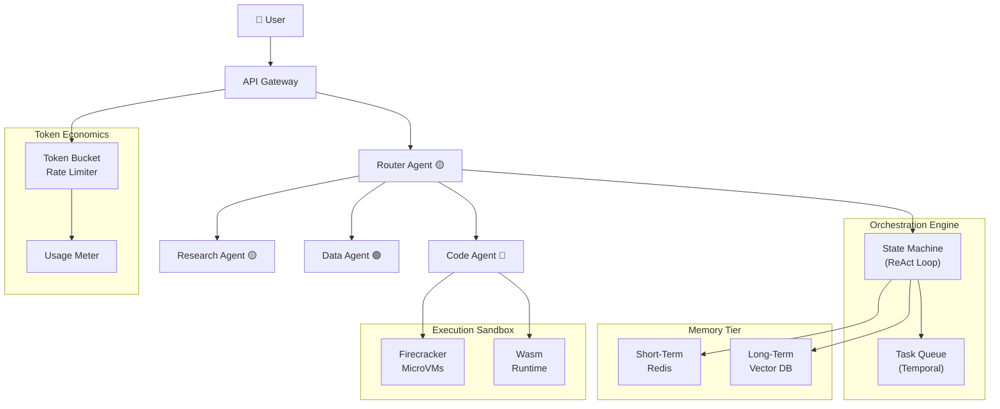

# System Design: The Autonomous AI Agent Orchestrator

## Why This Book?

Large Language Models can generate text, but they cannot *act*. The moment you need an AI to browse the web, query a database, write and execute code, or remember a conversation from last Tuesday, you leave the comfortable world of a single HTTP request-response cycle and enter the domain of **distributed systems engineering**.

This handbook is your blueprint for building that system—the **AI Agent Orchestrator**—an infrastructure layer that turns a stateless LLM into a persistent, tool-wielding, cost-controlled autonomous agent.

> **The Problem:** An LLM alone is a pure function: `f(prompt) → completion`. Converting it into an *agent* that reasons, acts, remembers, and collaborates is an infrastructure challenge on par with designing a stock exchange or a real-time multiplayer game server.

## What You Will Build

| Layer | Responsibility | Key Technology |
|---|---|---|
| **Orchestration Engine** | Manage the ReAct loop, pause/resume, handle failures | Temporal.io, Rust state machines |
| **Memory Tier** | Short-term chat context + long-term semantic recall | Redis, Qdrant / Milvus |
| **Execution Sandbox** | Safely run agent-generated code | Firecracker MicroVMs, Wasm (Wasmtime) |
| **Cost Control** | Rate-limit by token spend, prevent runaway agents | Distributed Token Bucket |
| **Multi-Agent Router** | Coordinate specialist agents, consensus voting | NATS JetStream, Mixture-of-Experts |

## Architecture at a Glance

## Prerequisites

| Skill | Level | Why |
|---|---|---|
| Distributed systems | Intermediate | The orchestrator is a distributed system |
| Rust or Go | Intermediate | Performance-critical data-plane components |
| Container / VM concepts | Familiar | Sandbox isolation relies on Linux cgroups/namespaces |
| LLM API usage | Basic | You should have called an LLM API at least once |

## Chapter Guide

| Emoji | Meaning | Typical Reader |
|---|---|---|
| 🟢 | Architecture / Foundations | All engineers |
| 🟡 | Context Management / Integration | Backend + ML engineers |
| 🔴 | Security / Execution / Cost | Platform + SRE engineers |

## Pacing Guide

| Chapter | Estimated Study Time |
|---|---|
| 1. The Stateful Agent Lifecycle 🟢 | 90 min |
| 2. Infinite Memory and RAG 🟡 | 90 min |
| 3. The Tool Execution Sandbox 🔴 | 120 min |
| 4. Rate Limiting and Token Economics 🔴 | 90 min |
| 5. Multi-Agent Consensus and Routing 🟡 | 120 min |

> **Key Takeaways**
>
> - An AI agent is a **distributed system**, not a prompt template.
> - Correctness, isolation, and cost control are first-class architectural concerns—not afterthoughts.
> - Each chapter stands alone, but the full stack emerges when all five layers interlock.
