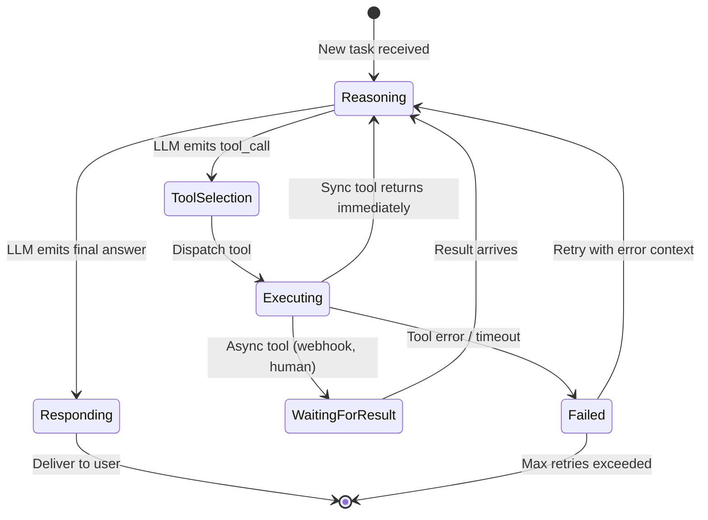
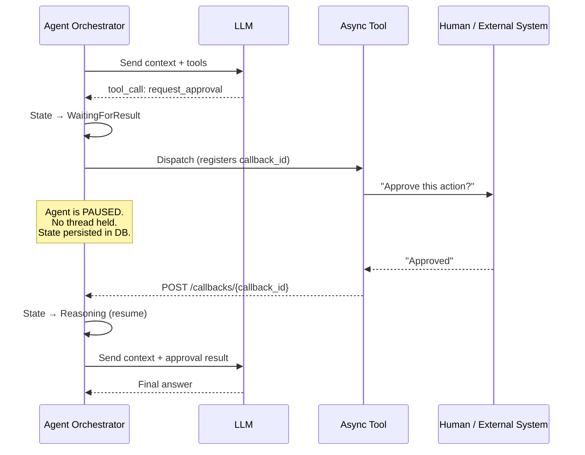

# Chapter 1: The Stateful Agent Lifecycle 🟢

> **The Problem:** An LLM is a pure, stateless function—it has no concept of "waiting for a database query" or "retrying after a 429." Yet an autonomous agent must pause mid-thought, survive process restarts, and resume exactly where it left off. How do you turn a stateless text generator into a durable, long-running workflow?

---

## 1.1 Why Statelessness Breaks Agents

A typical LLM API call:

```
POST /v1/chat/completions
{ "messages": [...], "tools": [...] }
→ { "tool_calls": [{ "function": "search_db", "arguments": "{\"q\":\"revenue Q3\"}" }] }
```

The LLM says *what* to do. It does not *do* it. Someone must:

1. Parse the tool call.
2. Execute `search_db("revenue Q3")` against a real database.
3. Collect the result.
4. Feed the result back into the LLM as a new message.
5. Repeat until the LLM emits a final answer.

This is the **ReAct (Reason + Act) loop**, and it has hard requirements that a single HTTP call cannot satisfy:

| Requirement | Why It's Hard |
|---|---|
| **Multi-turn execution** | A single task may require 5–50 LLM round-trips with tool calls in between. |
| **Durability** | If the orchestrator crashes on step 37, it must resume at step 37—not restart from step 1. |
| **Timeout management** | Some tool calls (e.g., human approval) may take hours. The process cannot block a thread for hours. |
| **Concurrency** | Thousands of agents run simultaneously, each at a different step. |

---

## 1.2 The ReAct Loop as a State Machine

The cleanest mental model for an agent is a **finite state machine** with the following states:



### State Definitions

| State | Description | Durable? |
|---|---|---|
| `Reasoning` | LLM is being called. Context window is assembled and sent. | Yes—the assembled messages are persisted before the call. |
| `ToolSelection` | LLM returned one or more `tool_calls`. The orchestrator parses and validates them. | Yes—tool call payloads are logged. |
| `Executing` | A tool is running (code execution, API call, DB query). | Yes—execution ID is recorded. |
| `WaitingForResult` | An async tool is in progress. The agent workflow is *paused*. | Yes—this is the key durability checkpoint. |
| `Failed` | A tool returned an error or timed out. | Yes—error is captured for retry logic. |
| `Responding` | The LLM produced a final answer. Deliver to the user. | Yes—response is idempotently delivered. |

---

## 1.3 Architecture Option A: Temporal.io Workflows

[Temporal](https://temporal.io) is a durable execution engine. It persists every state transition in a history log, so if a worker crashes, another worker replays the history and resumes exactly where execution stopped.

### Why Temporal Fits

| Temporal Feature | Agent Orchestrator Benefit |
|---|---|
| **Durable timers** | Agent can `sleep(3600)` while waiting for human approval without holding a thread. |
| **Automatic retries** | Tool calls that fail with transient errors (429, 503) are retried with exponential backoff. |
| **Event history** | Every ReAct step is an event—full auditability for free. |
| **Child workflows** | Multi-agent patterns (Chapter 5) map naturally to parent → child workflow relationships. |
| **Versioning** | Deploy new orchestration logic without killing in-flight agents. |

### Temporal Workflow — Pseudocode

```rust
// Agent orchestration as a Temporal workflow (Rust SDK pseudocode)

#[workflow]
pub async fn agent_react_loop(ctx: WfContext, task: AgentTask) -> AgentResult {
    let mut messages: Vec<Message> = assemble_initial_context(&task);
    let mut iteration = 0;
    let max_iterations = 50; // safety cap

    loop {
        if iteration >= max_iterations {
            return AgentResult::error("Max iterations exceeded — possible infinite loop");
        }
        iteration += 1;

        // ── Reasoning: call the LLM ──
        let llm_response = ctx
            .activity(CallLlmActivity {
                messages: messages.clone(),
                model: "gpt-4o",
            })
            .with_retry(RetryPolicy::exponential(3))
            .await?;

        match llm_response {
            LlmOutput::FinalAnswer(answer) => {
                return AgentResult::success(answer);
            }
            LlmOutput::ToolCalls(tool_calls) => {
                // ── Executing: run each tool ──
                let mut results = Vec::new();
                for tc in &tool_calls {
                    let result = ctx
                        .activity(ExecuteToolActivity {
                            tool_name: tc.name.clone(),
                            arguments: tc.arguments.clone(),
                        })
                        .with_timeout(Duration::from_secs(300))
                        .with_retry(RetryPolicy::exponential(2))
                        .await;

                    results.push(ToolResult {
                        call_id: tc.id.clone(),
                        output: match result {
                            Ok(out) => out,
                            Err(e) => format!("Tool error: {e}"),
                        },
                    });
                }
                // Append tool calls + results to messages
                messages.push(Message::assistant_tool_calls(&tool_calls));
                for r in &results {
                    messages.push(Message::tool_result(r));
                }
            }
        }
    }
}
```

**What Temporal gives you for free:**
- If the worker crashes after the LLM call but before the tool execution, Temporal replays the history: the LLM call result is already recorded, so it is not re-executed. Execution resumes at the tool dispatch.
- If `ExecuteToolActivity` times out, the retry policy kicks in automatically.

---

## 1.4 Architecture Option B: Custom Rust State Machine

Not every team wants to operate a Temporal cluster. A lightweight alternative is a custom state machine backed by a durable store (PostgreSQL or Redis Streams).

### The Core Loop

```rust
use serde::{Deserialize, Serialize};
use sqlx::PgPool;

#[derive(Debug, Clone, Serialize, Deserialize)]
pub enum AgentState {
    Reasoning,
    Executing { tool_call_id: String },
    WaitingForResult { callback_id: String },
    Responding { answer: String },
    Failed { error: String, retries: u32 },
    Completed,
}

#[derive(Debug, Clone, Serialize, Deserialize)]
pub struct AgentRun {
    pub run_id: String,
    pub state: AgentState,
    pub messages: Vec<Message>,
    pub iteration: u32,
    pub max_iterations: u32,
}

impl AgentRun {
    /// Advance the state machine by one step.
    /// Returns `true` if the run is still in progress.
    pub async fn step(
        &mut self,
        llm: &dyn LlmClient,
        tools: &dyn ToolExecutor,
        db: &PgPool,
    ) -> Result<bool, OrchError> {
        match &self.state {
            AgentState::Reasoning => {
                if self.iteration >= self.max_iterations {
                    self.state = AgentState::Failed {
                        error: "Max iterations exceeded".into(),
                        retries: 0,
                    };
                    self.persist(db).await?;
                    return Ok(false);
                }
                self.iteration += 1;

                let response = llm.chat(&self.messages).await?;

                match response {
                    LlmOutput::FinalAnswer(answer) => {
                        self.state = AgentState::Responding { answer };
                    }
                    LlmOutput::ToolCalls(calls) => {
                        // Take the first tool call (sequential execution)
                        let tc = &calls[0];
                        self.messages.push(Message::assistant_tool_calls(&calls));
                        self.state = AgentState::Executing {
                            tool_call_id: tc.id.clone(),
                        };
                    }
                }
                self.persist(db).await?;
                Ok(true)
            }
            AgentState::Executing { tool_call_id } => {
                let tc = self.find_tool_call(tool_call_id);
                let result = tools.execute(&tc.name, &tc.arguments).await;

                match result {
                    Ok(output) => {
                        self.messages.push(Message::tool_result(&ToolResult {
                            call_id: tool_call_id.clone(),
                            output,
                        }));
                        self.state = AgentState::Reasoning;
                    }
                    Err(e) => {
                        self.state = AgentState::Failed {
                            error: e.to_string(),
                            retries: 0,
                        };
                    }
                }
                self.persist(db).await?;
                Ok(true)
            }
            AgentState::Failed { error, retries } => {
                if *retries < 3 {
                    self.messages.push(Message::system(
                        &format!("Previous tool failed: {error}. Retrying."),
                    ));
                    self.state = AgentState::Reasoning;
                    self.persist(db).await?;
                    Ok(true)
                } else {
                    self.state = AgentState::Completed;
                    self.persist(db).await?;
                    Ok(false)
                }
            }
            AgentState::Responding { .. } | AgentState::Completed => {
                Ok(false)
            }
            AgentState::WaitingForResult { .. } => {
                // Will be advanced by an external callback
                Ok(false)
            }
        }
    }

    async fn persist(&self, db: &PgPool) -> Result<(), OrchError> {
        sqlx::query!(
            r#"
            UPDATE agent_runs
            SET state = $1, messages = $2, iteration = $3, updated_at = NOW()
            WHERE run_id = $4
            "#,
            serde_json::to_value(&self.state)?,
            serde_json::to_value(&self.messages)?,
            self.iteration as i32,
            self.run_id,
        )
        .execute(db)
        .await?;
        Ok(())
    }
}
```

### Comparison: Temporal vs. Custom State Machine

| Dimension | Temporal.io | Custom Rust State Machine |
|---|---|---|
| **Durability** | Built-in event sourcing | You implement `persist()` to PostgreSQL |
| **Retries** | Declarative retry policies | You write the retry logic |
| **Timers** | Durable timers (survive restarts) | You poll the DB or use `pg_notify` |
| **Operational cost** | Run a Temporal cluster (or use Temporal Cloud) | Just PostgreSQL |
| **Latency** | ~5 ms overhead per state transition | ~1 ms (direct DB write) |
| **Complexity** | Lower application code, higher infra | Higher application code, lower infra |
| **Best for** | Teams with > 10 engineers, complex workflows | Lean teams, latency-sensitive use cases |

---

## 1.5 Handling Async Tool Calls (Human-in-the-Loop)

Some tools don't return immediately. Examples:

- **Human approval:** "This agent wants to send an email on your behalf. Approve?"
- **Long-running computation:** A data pipeline that takes 10 minutes.
- **External webhook:** A third-party API that calls back when done.

### The Callback Pattern



### Implementation Sketch

```rust
// HTTP handler for external callbacks
async fn handle_callback(
    Path(callback_id): Path<String>,
    Json(payload): Json<CallbackPayload>,
    State(app): State<AppState>,
) -> impl IntoResponse {
    // Load the paused agent run
    let mut run = app.db.load_run_by_callback(&callback_id).await?;

    // Validate the callback matches the expected state
    match &run.state {
        AgentState::WaitingForResult { callback_id: expected }
            if *expected == callback_id =>
        {
            // Inject the result into the message history
            run.messages.push(Message::tool_result(&ToolResult {
                call_id: callback_id,
                output: payload.result,
            }));
            run.state = AgentState::Reasoning;
            run.persist(&app.db).await?;

            // Re-enqueue the run for processing
            app.task_queue.enqueue(run.run_id).await?;

            StatusCode::OK
        }
        _ => StatusCode::CONFLICT, // Already advanced or wrong state
    }
}
```

---

## 1.6 Context Window Assembly

Before each LLM call in the `Reasoning` state, the orchestrator must assemble the **context window**—the array of messages sent to the model. This is where the memory system (Chapter 2) intersects with the lifecycle engine.

### Assembly Strategy

```
┌─────────────────────────────────────────┐
│           Context Window (128K)         │
├─────────────────────────────────────────┤
│ 1. System prompt (fixed)         ~500t  │
│ 2. Long-term memory recall      ~2000t  │  ← Vector DB (Ch 2)
│ 3. Tool definitions             ~1500t  │
│ 4. Conversation history (sliding) var   │  ← Redis (Ch 2)
│ 5. Current user message           var   │
│ 6. Scratchpad / chain-of-thought  var   │
└─────────────────────────────────────────┘
        Total must be < model limit
```

The orchestrator **counts tokens** before sending, and if the total exceeds the budget, it truncates the oldest conversation history entries (section 4) first, then compresses long-term memory recall (section 2).

---

## 1.7 Failure Modes and Mitigations

| Failure | Impact | Mitigation |
|---|---|---|
| **LLM returns malformed JSON** | Tool call parsing fails | Retry with a "fix your JSON" system message appended |
| **Tool throws unhandled exception** | Agent loop stalls | Catch all errors, inject error text into message history, let the LLM self-correct |
| **Infinite tool loop** | Cost explosion, no progress | Enforce `max_iterations`; detect repeated identical tool calls |
| **Context window overflow** | API returns 400 | Pre-flight token count; truncate or summarize before calling |
| **Orchestrator process crash** | In-flight work lost | State persisted after every transition; new worker resumes |
| **LLM provider outage** | All agents blocked | Circuit breaker pattern; fallback to a secondary provider |

---

## 1.8 Observability

Every state transition should emit a structured event:

```json
{
  "event": "state_transition",
  "run_id": "run_abc123",
  "from": "Executing",
  "to": "Reasoning",
  "tool_name": "search_db",
  "tool_latency_ms": 47,
  "iteration": 12,
  "token_count": 8432,
  "timestamp": "2026-04-01T10:32:17Z"
}
```

**Dashboards to build:**
- **Agent run duration** (P50, P95, P99) — detects slow or stuck agents.
- **Iterations per run** — detects prompt regressions that cause extra loops.
- **Tool error rate** — detects broken integrations.
- **State distribution** — how many agents are in each state right now.

---

> **Key Takeaways**
>
> 1. An autonomous agent is a **durable state machine** executing the ReAct loop: Reason → Act → Observe → Repeat.
> 2. **Temporal.io** provides production-grade durability, retries, and timers out of the box. A **custom Rust state machine** with PostgreSQL is a lighter-weight alternative.
> 3. **Async tool calls** (human-in-the-loop, webhooks) require the orchestrator to *pause without holding resources* and resume via callbacks.
> 4. **Every state transition is persisted** before the next step begins—crash recovery is non-negotiable.
> 5. **Observability** on state transitions gives you free auditability, cost tracking, and anomaly detection.
