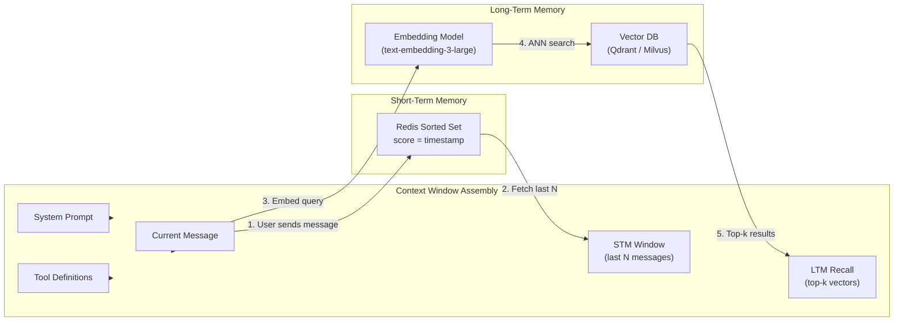
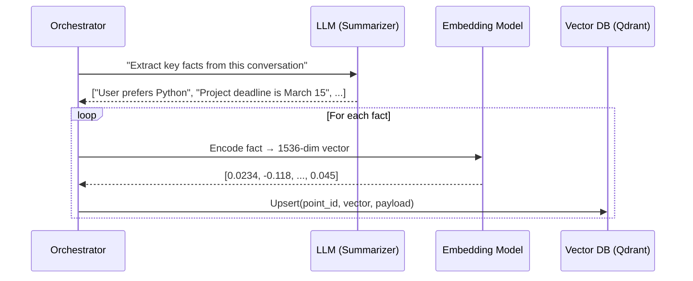
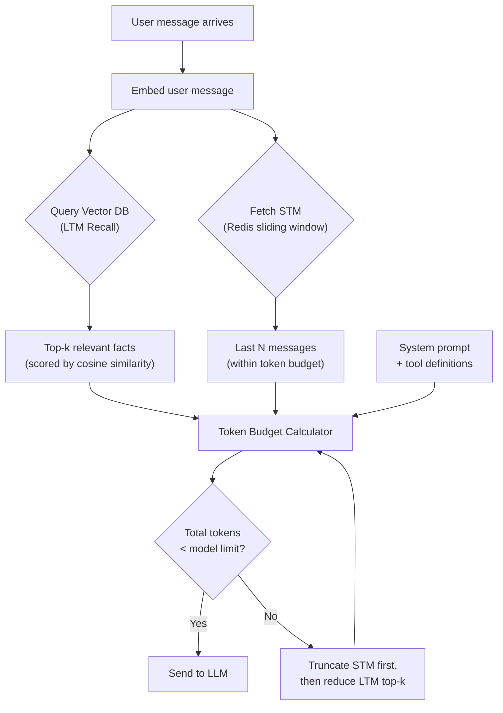

# Chapter 2: Infinite Memory and RAG (Retrieval-Augmented Generation) 🟡

> **The Problem:** GPT-4o has a 128K token context window. Claude has 200K. That sounds like a lot—until your agent is on its 200th conversation turn, has accumulated 50 tool call results, and needs to recall something the user said three weeks ago. Context windows are finite, expensive to fill, and degrade in accuracy as they grow. How do you give an agent *infinite* memory?

---

## 2.1 The Two-Memory Architecture

Human cognition has working memory (what you're thinking about *right now*) and long-term memory (everything you've ever learned). An agent needs the same:

| Memory Tier | Human Analogy | Implementation | Access Pattern | Latency Target |
|---|---|---|---|---|
| **Short-Term Memory (STM)** | Working memory | Redis (sorted set of recent messages) | Sequential scan, FIFO eviction | < 5 ms |
| **Long-Term Memory (LTM)** | Episodic + semantic memory | Vector database (Qdrant / Milvus) | Semantic similarity search | < 50 ms |



---

## 2.2 Short-Term Memory: The Sliding Window

### What Goes In

Every message in the ReAct loop—user messages, assistant responses, tool calls, and tool results—is appended to STM.

### Redis Data Model

```
Key:    agent:{run_id}:messages
Type:   Sorted Set
Score:  Unix timestamp (float, microsecond precision)
Member: JSON-serialized Message
```

```rust
use redis::AsyncCommands;

pub struct ShortTermMemory {
    redis: redis::aio::MultiplexedConnection,
    max_messages: usize,   // e.g., 100
    max_tokens: usize,     // e.g., 32_000
}

impl ShortTermMemory {
    /// Append a message and evict old entries if necessary.
    pub async fn append(&self, run_id: &str, msg: &Message) -> Result<(), MemError> {
        let key = format!("agent:{run_id}:messages");
        let score = msg.timestamp.timestamp_micros() as f64;
        let member = serde_json::to_string(msg)?;

        self.redis.zadd(&key, &member, score).await?;
        self.redis.expire(&key, 86400 * 7).await?; // TTL: 7 days

        // Trim to max_messages (keep newest)
        let len: usize = self.redis.zcard(&key).await?;
        if len > self.max_messages {
            let remove_count = len - self.max_messages;
            self.redis
                .zremrangebyrank(&key, 0, (remove_count - 1) as isize)
                .await?;
        }
        Ok(())
    }

    /// Retrieve the most recent messages that fit within a token budget.
    pub async fn recall(
        &self,
        run_id: &str,
        token_budget: usize,
    ) -> Result<Vec<Message>, MemError> {
        let key = format!("agent:{run_id}:messages");
        let raw: Vec<String> = self.redis.zrevrange(&key, 0, -1).await?;

        let mut result = Vec::new();
        let mut total_tokens = 0;

        for entry in raw {
            let msg: Message = serde_json::from_str(&entry)?;
            let msg_tokens = count_tokens(&msg);
            if total_tokens + msg_tokens > token_budget {
                break;
            }
            total_tokens += msg_tokens;
            result.push(msg);
        }

        result.reverse(); // Chronological order
        Ok(result)
    }
}
```

### Why Redis?

| Requirement | Redis Capability |
|---|---|
| Sub-millisecond reads | In-memory storage, sorted set O(log N) |
| Automatic eviction | `ZREMRANGEBYRANK` for FIFO; TTL for abandoned runs |
| Horizontal scaling | Redis Cluster with hash-tag routing on `{run_id}` |
| Persistence | AOF persistence for crash recovery |

---

## 2.3 Long-Term Memory: Vector Search

### The Embedding Pipeline

When an agent run completes (or at periodic checkpoints), the orchestrator extracts **memorable facts** and stores them in a vector database.



### What to Store

Not everything deserves long-term memory. The LLM acts as a **relevance filter**.

| Store ✅ | Skip ❌ |
|---|---|
| User preferences ("I prefer Rust over Go") | Transient tool outputs (raw search results) |
| Key decisions ("We chose PostgreSQL for the DB") | Filler messages ("Thanks!", "Got it") |
| Facts about the project ("Deadline is Q2 2026") | Repeated system prompts |
| Error patterns ("The deploy script fails on ARM") | Intermediate chain-of-thought |

### Qdrant Schema

```json
{
  "collection_name": "agent_memories",
  "vectors": {
    "size": 1536,
    "distance": "Cosine"
  },
  "payload_schema": {
    "user_id":    { "type": "keyword" },
    "agent_id":   { "type": "keyword" },
    "run_id":     { "type": "keyword" },
    "fact_text":  { "type": "text" },
    "created_at": { "type": "datetime" },
    "importance": { "type": "float" }
  }
}
```

### Rust Client for Qdrant

```rust
use qdrant_client::prelude::*;
use qdrant_client::qdrant::{PointStruct, SearchPoints, Value};

pub struct LongTermMemory {
    qdrant: QdrantClient,
    embedding_model: Box<dyn EmbeddingModel>,
    collection: String,
}

impl LongTermMemory {
    /// Store a fact in long-term memory.
    pub async fn remember(
        &self,
        user_id: &str,
        run_id: &str,
        fact: &str,
        importance: f32,
    ) -> Result<(), MemError> {
        let vector = self.embedding_model.embed(fact).await?;
        let point_id = uuid::Uuid::new_v4().to_string();

        let point = PointStruct::new(
            point_id,
            vector,
            Payload::new()
                .insert("user_id", Value::from(user_id))
                .insert("run_id", Value::from(run_id))
                .insert("fact_text", Value::from(fact))
                .insert("importance", Value::from(importance as f64))
                .insert("created_at", Value::from(chrono::Utc::now().to_rfc3339())),
        );

        self.qdrant
            .upsert_points(&self.collection, None, vec![point], None)
            .await?;
        Ok(())
    }

    /// Recall facts relevant to a query, filtered by user.
    pub async fn recall(
        &self,
        user_id: &str,
        query: &str,
        top_k: u64,
    ) -> Result<Vec<MemoryFact>, MemError> {
        let query_vector = self.embedding_model.embed(query).await?;

        let results = self
            .qdrant
            .search_points(&SearchPoints {
                collection_name: self.collection.clone(),
                vector: query_vector,
                limit: top_k,
                filter: Some(Filter::must(vec![
                    FieldCondition::match_keyword("user_id", user_id).into(),
                ])),
                with_payload: Some(true.into()),
                ..Default::default()
            })
            .await?;

        let facts = results
            .result
            .into_iter()
            .map(|r| MemoryFact {
                text: r.payload.get("fact_text").unwrap().to_string(),
                score: r.score,
                created_at: r.payload.get("created_at").unwrap().to_string(),
            })
            .collect();

        Ok(facts)
    }
}
```

---

## 2.4 The RAG Retrieval Flow

At every `Reasoning` step (Chapter 1), the orchestrator assembles the context window. Here is the full retrieval flow:



### Token Budget Allocation

The orchestrator uses a **priority-based token budget**:

| Priority | Section | Budget | Rationale |
|---|---|---|---|
| 1 (highest) | System prompt | Fixed ~500 tokens | Non-negotiable identity |
| 2 | Current user message | Variable | Must always be included |
| 3 | Tool definitions | Fixed ~1500 tokens | Agent needs to know its tools |
| 4 | LTM recall | Up to 2000 tokens | Relevant long-term context |
| 5 (lowest) | STM window | Remainder | As much recent history as fits |

```rust
pub fn assemble_context(
    system_prompt: &str,
    user_message: &str,
    tools: &[ToolDefinition],
    ltm_facts: &[MemoryFact],
    stm_messages: &[Message],
    model_limit: usize,
) -> Vec<Message> {
    let mut messages = Vec::new();
    let mut budget = model_limit;

    // Priority 1: System prompt (always included)
    let sys_tokens = count_tokens_str(system_prompt);
    messages.push(Message::system(system_prompt));
    budget -= sys_tokens;

    // Priority 2: Current user message (always included)
    let user_tokens = count_tokens_str(user_message);
    budget -= user_tokens;

    // Priority 3: Tool definitions (always included)
    let tool_tokens = count_tokens_tools(tools);
    budget -= tool_tokens;

    // Priority 4: LTM recall (up to budget)
    let ltm_block = format_ltm_facts(ltm_facts);
    let ltm_tokens = count_tokens_str(&ltm_block);
    let ltm_used = ltm_tokens.min(budget.min(2000));
    if ltm_used > 0 {
        messages.push(Message::system(&format!(
            "## Relevant memories:\n{ltm_block}"
        )));
        budget -= ltm_used;
    }

    // Priority 5: STM window (fill remaining budget)
    for msg in stm_messages {
        let msg_tokens = count_tokens(msg);
        if msg_tokens > budget {
            break;
        }
        messages.push(msg.clone());
        budget -= msg_tokens;
    }

    // Always append current user message last
    messages.push(Message::user(user_message));
    messages
}
```

---

## 2.5 Memory Lifecycle Management

### Forgetting Is a Feature

Unbounded memory growth creates noise. The system needs a **decay and compaction** strategy:

| Strategy | Mechanism | When |
|---|---|---|
| **TTL eviction** | Redis `EXPIRE` on STM keys | After 7 days of inactivity |
| **Importance decay** | `importance *= 0.95` on each recall miss | Nightly batch job |
| **Deduplication** | If cosine similarity > 0.95 between two facts, merge | On insert |
| **Summarization** | Periodically summarize clusters of related facts into one | Weekly batch job |

### Deduplication on Insert

```rust
impl LongTermMemory {
    pub async fn remember_deduped(
        &self,
        user_id: &str,
        run_id: &str,
        fact: &str,
        importance: f32,
    ) -> Result<(), MemError> {
        // Check for near-duplicates
        let existing = self.recall(user_id, fact, 1).await?;
        if let Some(top) = existing.first() {
            if top.score > 0.95 {
                // Near-duplicate — skip insertion
                return Ok(());
            }
        }
        self.remember(user_id, run_id, fact, importance).await
    }
}
```

---

## 2.6 Vector Database Comparison

| Feature | Qdrant | Milvus | Weaviate | Pinecone |
|---|---|---|---|---|
| **Language** | Rust | Go + C++ | Go | Proprietary (SaaS) |
| **Hosting** | Self-hosted + Cloud | Self-hosted + Cloud (Zilliz) | Self-hosted + Cloud | Cloud only |
| **Filtering** | Payload filters (fast) | Attribute filtering | GraphQL-like filters | Metadata filtering |
| **Max vectors** | Billions (disk index) | Billions | Millions | Billions |
| **P99 latency (1M vectors)** | ~5 ms | ~8 ms | ~10 ms | ~15 ms |
| **HNSW + quantization** | ✅ | ✅ | ✅ | ✅ |
| **Multi-tenancy** | Collection + payload filter | Partition key | Tenant classes | Namespace |
| **Best for** | Low-latency, Rust ecosystem | Large-scale, hybrid search | Full-stack AI apps | Zero-ops serverless |

### Recommendation

For the agent orchestrator, **Qdrant** is the best fit:
- Written in Rust — natural integration with a Rust orchestrator.
- Sub-5ms P99 at 1M vectors — well within the 50ms budget.
- Payload filtering enables per-user memory isolation without separate collections.

---

## 2.7 Scaling the Memory Tier

### Short-Term Memory (Redis)

```
┌───────────────────────────────────────┐
│          Redis Cluster (6 nodes)      │
│  ┌─────┐  ┌─────┐  ┌─────┐          │
│  │Shard│  │Shard│  │Shard│          │
│  │  0  │  │  1  │  │  2  │          │
│  └──┬──┘  └──┬──┘  └──┬──┘          │
│     │        │        │              │
│  ┌──┴──┐  ┌──┴──┐  ┌──┴──┐          │
│  │Repl │  │Repl │  │Repl │          │
│  │  0  │  │  1  │  │  2  │          │
│  └─────┘  └─────┘  └─────┘          │
│                                       │
│  Hash slot routing: {run_id} → shard  │
└───────────────────────────────────────┘
```

Key insight: Use **hash tags** (`{run_id}`) so all messages for one agent run land on the same shard, enabling atomic operations.

### Long-Term Memory (Qdrant)

```
┌────────────────────────────────────────────┐
│         Qdrant Distributed Mode            │
│                                            │
│  Collection: agent_memories                │
│  Shards: 6  |  Replicas: 2                │
│                                            │
│  Shard placement:                          │
│  ┌──────┐ ┌──────┐ ┌──────┐               │
│  │Node 1│ │Node 2│ │Node 3│               │
│  │S0, S3│ │S1, S4│ │S2, S5│               │
│  │(repl) │ │(repl) │ │(repl) │            │
│  └──────┘ └──────┘ └──────┘               │
│                                            │
│  Write consistency: quorum (2 of 3)        │
│  Read consistency: one (fastest)           │
└────────────────────────────────────────────┘
```

---

## 2.8 End-to-End Latency Budget

| Step | Operation | P99 Latency |
|---|---|---|
| 1 | Embed user query (text-embedding-3-large) | 15 ms |
| 2 | Vector search in Qdrant (top-10, filtered) | 5 ms |
| 3 | Redis ZREVRANGE (last 50 messages) | 2 ms |
| 4 | Token counting + context assembly | 3 ms |
| **Total memory overhead** | | **25 ms** |
| 5 | LLM inference (GPT-4o) | 500–3000 ms |

The memory tier adds **25 ms**—negligible compared to LLM inference time. The < 50 ms target is comfortably met.

---

> **Key Takeaways**
>
> 1. An agent's memory is a **two-tier system**: short-term (Redis sliding window) for recent context, long-term (vector DB) for semantic recall across sessions.
> 2. **RAG** (Retrieval-Augmented Generation) injects relevant long-term memories into the context window at every reasoning step, giving the agent "infinite memory" within a finite context budget.
> 3. **Token budget allocation** is priority-ordered: system prompt > user message > tools > LTM recall > STM history.
> 4. **Memory hygiene** (deduplication, importance decay, summarization) prevents noise accumulation.
> 5. **Qdrant** (Rust, sub-5ms P99) is the recommended vector DB for a latency-sensitive agent orchestrator.
