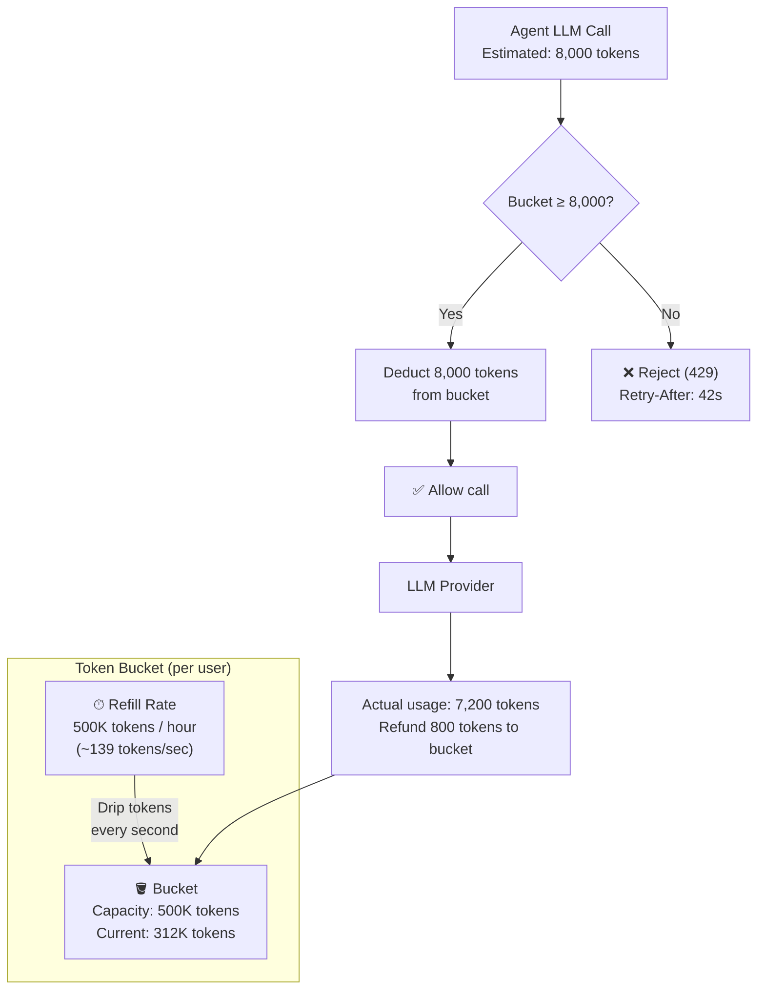
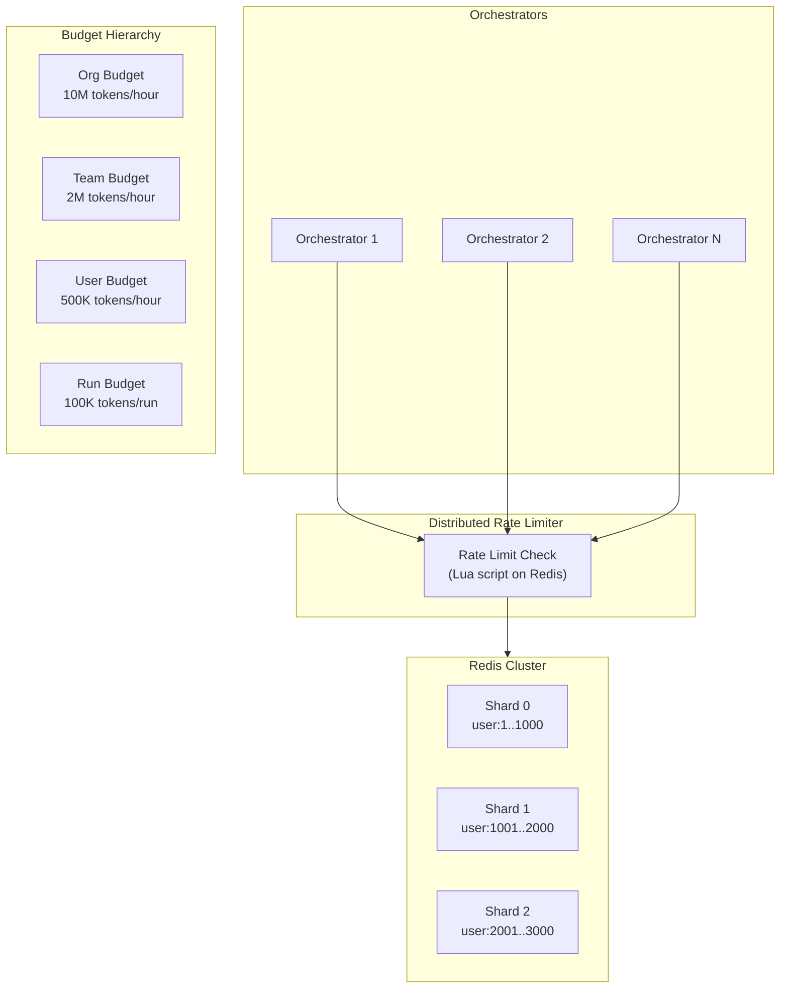
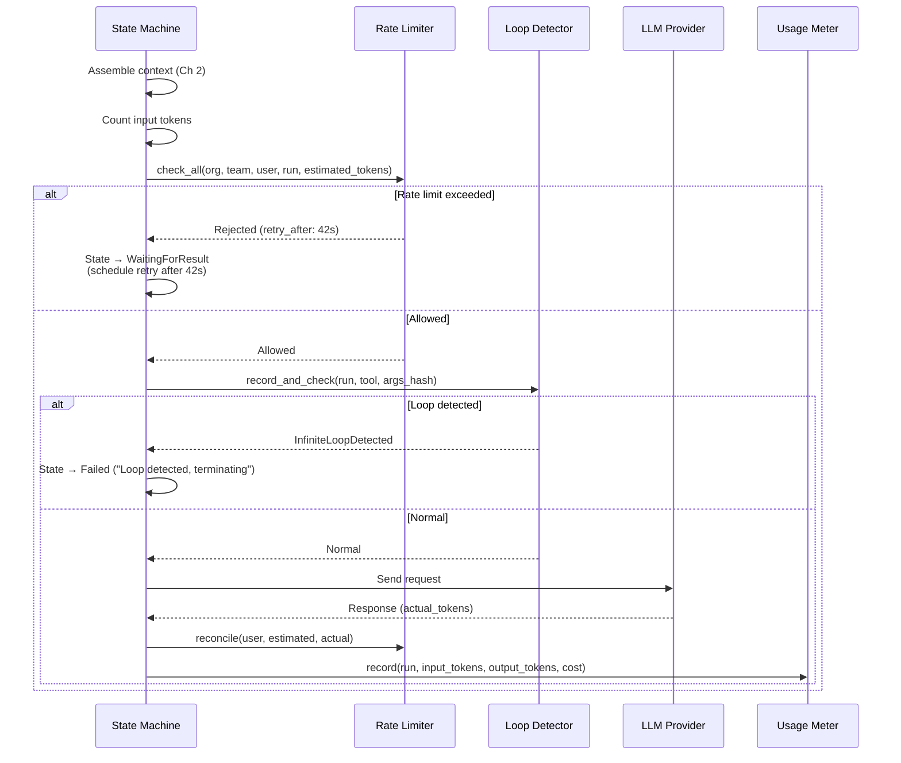

# Chapter 4: Rate Limiting and Token Economics 🔴

> **The Problem:** A single GPT-4o call can cost $0.06. An autonomous agent running a 50-iteration ReAct loop costs $3. A runaway agent stuck in an infinite loop can burn $1,000 before anyone notices. Multiply by 10,000 concurrent users, and the monthly bill has seven digits. Traditional rate limiters count *requests*—but an agent making 2 requests of 100K tokens each is 100× more expensive than one making 2 requests of 1K tokens. How do you build a rate limiter that thinks in *dollars*, not *requests*?

---

## 4.1 Why Request-Based Rate Limiting Fails for AI Agents

### The Mismatch

| Scenario | Requests/min | Tokens/min | Cost/min |
|---|---|---|---|
| Agent A: Simple Q&A | 2 | 2,000 | $0.01 |
| Agent B: Code generation with large context | 2 | 200,000 | $1.20 |
| Agent C: Infinite loop (broken prompt) | 60 | 6,000,000 | $36.00 |

A request-based limiter set to "10 requests/minute" would allow Agent B and block Agent A at the same threshold, despite Agent B costing 120× more. It would also let Agent C run for seconds before the request cap kicks in—enough to burn significant money.

### What We Need

A **token-aware rate limiter** that:

1. Meters **consumed tokens** (input + output) per user, per agent, and per organization.
2. Enforces **token budgets** per time window (e.g., 500K tokens/hour per user).
3. Supports **hierarchical limits** (org → team → user → agent run).
4. Detects **runaway loops** and circuit-breaks individual agent runs.
5. Operates at **< 1 ms overhead** per check—it sits in the hot path of every LLM call.

---

## 4.2 The Token Bucket Algorithm

The classic [Token Bucket](https://en.wikipedia.org/wiki/Token_bucket) algorithm is the foundation, adapted for LLM tokens instead of network packets.



### Key Insight: Estimate → Allow → Reconcile

Unlike network packets (fixed size), LLM token usage is only known *after* the call completes. The solution is a three-phase approach:

| Phase | When | Action |
|---|---|---|
| **Estimate** | Before LLM call | Count input tokens (known) + estimate output tokens (heuristic: ~1.5× requested `max_tokens` or historical average) |
| **Reserve** | Before LLM call | Deduct estimated tokens from the bucket |
| **Reconcile** | After LLM call | Adjust the bucket: refund overestimate or deduct underestimate |

---

## 4.3 Distributed Rate Limiter Architecture

In a distributed system with multiple orchestrator instances, the rate limiter state must be **shared and consistent**. Redis is the natural choice.



### Redis Data Model

```
# Per-user token bucket
Key:    rate:{user_id}:tokens
Type:   Hash
Fields:
  tokens:     312000          # Current token count
  last_refill: 1711958400.123 # Last refill timestamp (Unix float)
  capacity:    500000          # Max bucket size
  refill_rate: 138.89          # Tokens per second (500K/3600)

# Per-run token accumulator
Key:    run:{run_id}:usage
Type:   Hash
Fields:
  total_input:  45000
  total_output: 23000
  total_cost:   0.408
  iterations:   12

# Per-org aggregate (for hierarchical limits)
Key:    rate:{org_id}:tokens
Type:   Hash  (same structure as user bucket)
```

### Atomic Lua Script for Token Bucket

The entire check-and-deduct must be atomic. A Redis Lua script ensures this without race conditions:

```lua
-- token_bucket_check.lua
-- KEYS[1] = rate:{entity_id}:tokens
-- ARGV[1] = requested tokens
-- ARGV[2] = current timestamp (float)
-- ARGV[3] = capacity
-- ARGV[4] = refill_rate (tokens/sec)
-- Returns: {allowed (0/1), remaining_tokens, retry_after_seconds}

local key = KEYS[1]
local requested = tonumber(ARGV[1])
local now = tonumber(ARGV[2])
local capacity = tonumber(ARGV[3])
local refill_rate = tonumber(ARGV[4])

-- Get current state
local tokens = tonumber(redis.call('HGET', key, 'tokens') or capacity)
local last_refill = tonumber(redis.call('HGET', key, 'last_refill') or now)

-- Refill tokens based on elapsed time
local elapsed = math.max(0, now - last_refill)
local refill = math.min(capacity, tokens + (elapsed * refill_rate))

-- Check if we have enough
if refill >= requested then
    -- Deduct and allow
    local new_tokens = refill - requested
    redis.call('HMSET', key, 'tokens', new_tokens, 'last_refill', now)
    redis.call('EXPIRE', key, 7200) -- 2 hour TTL
    return {1, math.floor(new_tokens), 0}
else
    -- Reject — calculate when enough tokens will be available
    local deficit = requested - refill
    local retry_after = math.ceil(deficit / refill_rate)
    -- Still update refill state (tokens dripped but not consumed)
    redis.call('HMSET', key, 'tokens', refill, 'last_refill', now)
    redis.call('EXPIRE', key, 7200)
    return {0, math.floor(refill), retry_after}
end
```

### Rust Client

```rust
use redis::Script;
use std::time::{SystemTime, UNIX_EPOCH};

pub struct TokenBucketLimiter {
    redis: redis::aio::MultiplexedConnection,
    script: Script,
}

#[derive(Debug)]
pub struct RateLimitResult {
    pub allowed: bool,
    pub remaining_tokens: i64,
    pub retry_after_secs: i64,
}

impl TokenBucketLimiter {
    pub fn new(redis: redis::aio::MultiplexedConnection) -> Self {
        let script = Script::new(include_str!("token_bucket_check.lua"));
        Self { redis, script }
    }

    /// Check if a request with `estimated_tokens` is allowed.
    pub async fn check(
        &mut self,
        entity_id: &str,
        estimated_tokens: u64,
        capacity: u64,
        refill_rate: f64,
    ) -> Result<RateLimitResult, RateError> {
        let now = SystemTime::now()
            .duration_since(UNIX_EPOCH)?
            .as_secs_f64();

        let key = format!("rate:{entity_id}:tokens");

        let result: Vec<i64> = self
            .script
            .key(&key)
            .arg(estimated_tokens)
            .arg(now)
            .arg(capacity)
            .arg(refill_rate)
            .invoke_async(&mut self.redis)
            .await?;

        Ok(RateLimitResult {
            allowed: result[0] == 1,
            remaining_tokens: result[1],
            retry_after_secs: result[2],
        })
    }

    /// Reconcile after the actual token usage is known.
    pub async fn reconcile(
        &mut self,
        entity_id: &str,
        estimated: u64,
        actual: u64,
    ) -> Result<(), RateError> {
        let key = format!("rate:{entity_id}:tokens");
        if actual < estimated {
            // Refund overestimate
            let refund = estimated - actual;
            let _: () = redis::cmd("HINCRBYFLOAT")
                .arg(&key)
                .arg("tokens")
                .arg(refund as f64)
                .query_async(&mut self.redis)
                .await?;
        } else if actual > estimated {
            // Deduct underestimate
            let extra = actual - estimated;
            let _: () = redis::cmd("HINCRBYFLOAT")
                .arg(&key)
                .arg("tokens")
                .arg(-(extra as f64))
                .query_async(&mut self.redis)
                .await?;
        }
        Ok(())
    }
}
```

---

## 4.4 Hierarchical Rate Limits

A single token bucket isn't enough. Rate limits must be hierarchical:

```
Organization (10M tokens/hour)
  └── Team (2M tokens/hour)
       └── User (500K tokens/hour)
            └── Agent Run (100K tokens/run, 50 iteration cap)
```

### Hierarchical Check Logic

```rust
pub struct HierarchicalLimiter {
    limiter: TokenBucketLimiter,
}

impl HierarchicalLimiter {
    /// Check all levels. If ANY level rejects, the request is blocked.
    pub async fn check_all(
        &mut self,
        org_id: &str,
        team_id: &str,
        user_id: &str,
        run_id: &str,
        estimated_tokens: u64,
    ) -> Result<RateLimitDecision, RateError> {
        // Check from broadest to narrowest (fail fast on org-level exhaustion)
        let checks = [
            (format!("org:{org_id}"), 10_000_000u64, 2777.78f64),
            (format!("team:{team_id}"), 2_000_000, 555.56),
            (format!("user:{user_id}"), 500_000, 138.89),
        ];

        for (entity, capacity, rate) in &checks {
            let result = self.limiter.check(entity, estimated_tokens, *capacity, *rate).await?;
            if !result.allowed {
                return Ok(RateLimitDecision::Rejected {
                    level: entity.clone(),
                    retry_after: result.retry_after_secs,
                });
            }
        }

        // Per-run check: total tokens consumed in this run
        let run_usage: u64 = self.get_run_usage(run_id).await?;
        if run_usage + estimated_tokens > 100_000 {
            return Ok(RateLimitDecision::RunBudgetExceeded {
                run_id: run_id.to_string(),
                used: run_usage,
                limit: 100_000,
            });
        }

        Ok(RateLimitDecision::Allowed)
    }
}
```

---

## 4.5 Runaway Loop Detection

The most dangerous failure mode: an agent enters an infinite loop, making the same tool call repeatedly. The iteration cap (`max_iterations = 50` from Chapter 1) is the first defense. But we also need **pattern detection**:

### Circuit Breaker per Run

```rust
pub struct LoopDetector {
    redis: redis::aio::MultiplexedConnection,
}

impl LoopDetector {
    /// Record a tool call and check for repetitive patterns.
    pub async fn record_and_check(
        &mut self,
        run_id: &str,
        tool_name: &str,
        arguments_hash: &str,
    ) -> Result<LoopStatus, RateError> {
        let key = format!("loop:{run_id}:calls");
        let entry = format!("{tool_name}:{arguments_hash}");

        // Increment the count for this exact tool+args combination
        let count: u64 = redis::cmd("HINCRBY")
            .arg(&key)
            .arg(&entry)
            .arg(1)
            .query_async(&mut self.redis)
            .await?;

        // Expire after 1 hour (run should be done by then)
        let _: () = redis::cmd("EXPIRE")
            .arg(&key)
            .arg(3600)
            .query_async(&mut self.redis)
            .await?;

        if count >= 5 {
            return Ok(LoopStatus::InfiniteLoopDetected {
                tool: tool_name.to_string(),
                repetitions: count,
            });
        }

        // Also check for rapid iteration (> 10 iterations in 10 seconds)
        let rate_key = format!("loop:{run_id}:rate");
        let now = SystemTime::now().duration_since(UNIX_EPOCH)?.as_secs_f64();
        let _: () = redis::cmd("ZADD")
            .arg(&rate_key)
            .arg(now)
            .arg(now.to_string())
            .query_async(&mut self.redis)
            .await?;

        // Remove entries older than 10 seconds
        let cutoff = now - 10.0;
        let _: () = redis::cmd("ZREMRANGEBYSCORE")
            .arg(&rate_key)
            .arg("-inf")
            .arg(cutoff)
            .query_async(&mut self.redis)
            .await?;

        let recent_count: u64 = redis::cmd("ZCARD")
            .arg(&rate_key)
            .query_async(&mut self.redis)
            .await?;

        if recent_count > 10 {
            return Ok(LoopStatus::RapidIteration {
                iterations_in_window: recent_count,
            });
        }

        Ok(LoopStatus::Normal)
    }
}
```

---

## 4.6 Cost Estimation and Tracking

### Token Counting Before the Call

Input tokens can be counted exactly using a tokenizer (e.g., `tiktoken` for OpenAI models):

```rust
pub fn estimate_request_cost(
    messages: &[Message],
    model: &str,
) -> TokenEstimate {
    let input_tokens = count_tokens_for_model(messages, model);

    // Output estimation heuristic:
    // - For tool calls: ~500 tokens (structured JSON)
    // - For final answers: ~1000 tokens (natural language)
    // - Safety margin: 1.3×
    let estimated_output = match messages.last() {
        Some(m) if m.role == "tool" => 500,
        _ => 1000,
    };

    let total_estimated = input_tokens + estimated_output;

    TokenEstimate {
        input_tokens,
        estimated_output_tokens: estimated_output,
        total_estimated,
        estimated_cost_usd: compute_cost(model, input_tokens, estimated_output),
    }
}

fn compute_cost(model: &str, input: usize, output: usize) -> f64 {
    let (input_price, output_price) = match model {
        "gpt-4o"      => (2.50 / 1_000_000.0, 10.00 / 1_000_000.0),
        "gpt-4o-mini" => (0.15 / 1_000_000.0,  0.60 / 1_000_000.0),
        "claude-4-opus" => (15.00 / 1_000_000.0, 75.00 / 1_000_000.0),
        "claude-4-sonnet" => (3.00 / 1_000_000.0, 15.00 / 1_000_000.0),
        _ => (5.00 / 1_000_000.0, 15.00 / 1_000_000.0), // conservative default
    };
    (input as f64 * input_price) + (output as f64 * output_price)
}
```

### Real-Time Cost Dashboard

```
┌──────────────────────────────────────────────────┐
│            Token Economics Dashboard              │
├──────────────────────────────────────────────────┤
│                                                  │
│  Org: Acme Corp          Period: Last 1 Hour     │
│  ──────────────────────────────────────────────  │
│  Total Tokens:    4,231,000 / 10,000,000 (42%)   │
│  Total Cost:      $31.47                         │
│  Active Agents:   847                            │
│  Avg Tokens/Run:  4,995                          │
│                                                  │
│  Top Users by Spend:                             │
│  ┌──────────┬───────────┬────────┬──────────┐    │
│  │ User     │ Tokens    │ Cost   │ Runs     │    │
│  ├──────────┼───────────┼────────┼──────────┤    │
│  │ alice    │ 892,000   │ $6.69  │ 23       │    │
│  │ bob      │ 651,000   │ $4.88  │ 45       │    │
│  │ charlie  │ 423,000   │ $3.17  │ 12       │    │
│  └──────────┴───────────┴────────┴──────────┘    │
│                                                  │
│  ⚠ Alerts:                                      │
│  • run_abc123 hit 100K token budget (auto-killed)│
│  • user dave at 95% of hourly budget             │
│                                                  │
└──────────────────────────────────────────────────┘
```

---

## 4.7 Integration with the Orchestrator

The rate limiter integrates into the ReAct loop (Chapter 1) at the `Reasoning` state, just before the LLM call:



---

## 4.8 Advanced: Spending Tiers and Dynamic Pricing

### User Spending Tiers

| Tier | Token Budget/Hour | Max Concurrent Agents | Priority |
|---|---|---|---|
| Free | 100K | 1 | Low |
| Pro | 500K | 5 | Normal |
| Enterprise | 10M | 100 | High |
| Internal | Unlimited | Unlimited | Critical |

### Dynamic Model Routing Based on Budget

When a user is approaching their budget limit, the orchestrator can **downgrade the model** rather than rejecting the request:

```rust
pub fn select_model(
    preferred_model: &str,
    remaining_budget: u64,
    estimated_tokens: u64,
) -> &str {
    if remaining_budget > estimated_tokens * 3 {
        // Plenty of budget — use preferred model
        preferred_model
    } else if remaining_budget > estimated_tokens {
        // Getting tight — downgrade to cheaper model
        match preferred_model {
            "claude-4-opus" => "claude-4-sonnet",
            "gpt-4o" => "gpt-4o-mini",
            other => other,
        }
    } else {
        // Almost exhausted — use cheapest available
        "gpt-4o-mini"
    }
}
```

---

## 4.9 Failure Modes

| Failure | Impact | Mitigation |
|---|---|---|
| **Redis unavailable** | Rate limiter can't check | Fail-open with local in-memory limiter (conservative limits) + alert |
| **Token estimate wildly wrong** | Over-reserve blocks legitimate requests | Reconcile immediately after every call; tune estimation heuristic |
| **Reconcile message lost** | Tokens "leak" from the bucket permanently | Periodic bucket audit job compares Redis state to actual usage logs |
| **Clock skew between hosts** | Refill rate calculation is wrong | Use Redis `TIME` command in the Lua script instead of client clock |
| **Runaway admin user** | "Internal" tier has no limits | Even internal users get iteration caps and loop detection |

---

## 4.10 Metrics and Alerts

| Metric | Alert Threshold | Action |
|---|---|---|
| `rate_limit_rejections_per_minute` | > 100 | Potential capacity issue or abuse |
| `token_budget_exhaustion_rate` | > 30% of users exhausted/hour | Review tier limits |
| `cost_per_agent_run_p99` | > $5.00 | Investigate prompt efficiency |
| `runaway_loops_detected_per_hour` | > 10 | Prompt regression or adversarial input |
| `reconciliation_drift_tokens` | > 10% of estimated | Improve estimation heuristic |

---

> **Key Takeaways**
>
> 1. **Rate-limit by tokens, not requests.** A Token Bucket algorithm adapted for LLM token consumption is the foundation.
> 2. **Estimate → Reserve → Reconcile:** Deduct estimated tokens before the LLM call; adjust after the actual usage is known.
> 3. **Hierarchical limits** (org → team → user → run) prevent any single entity from starving others.
> 4. **Runaway loop detection** (repeated tool calls, rapid iteration) is a critical safety net beyond simple token counting.
> 5. **Dynamic model routing** degrades gracefully when budgets are tight, preserving availability over quality.
