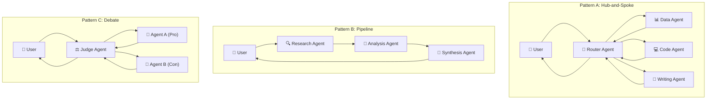
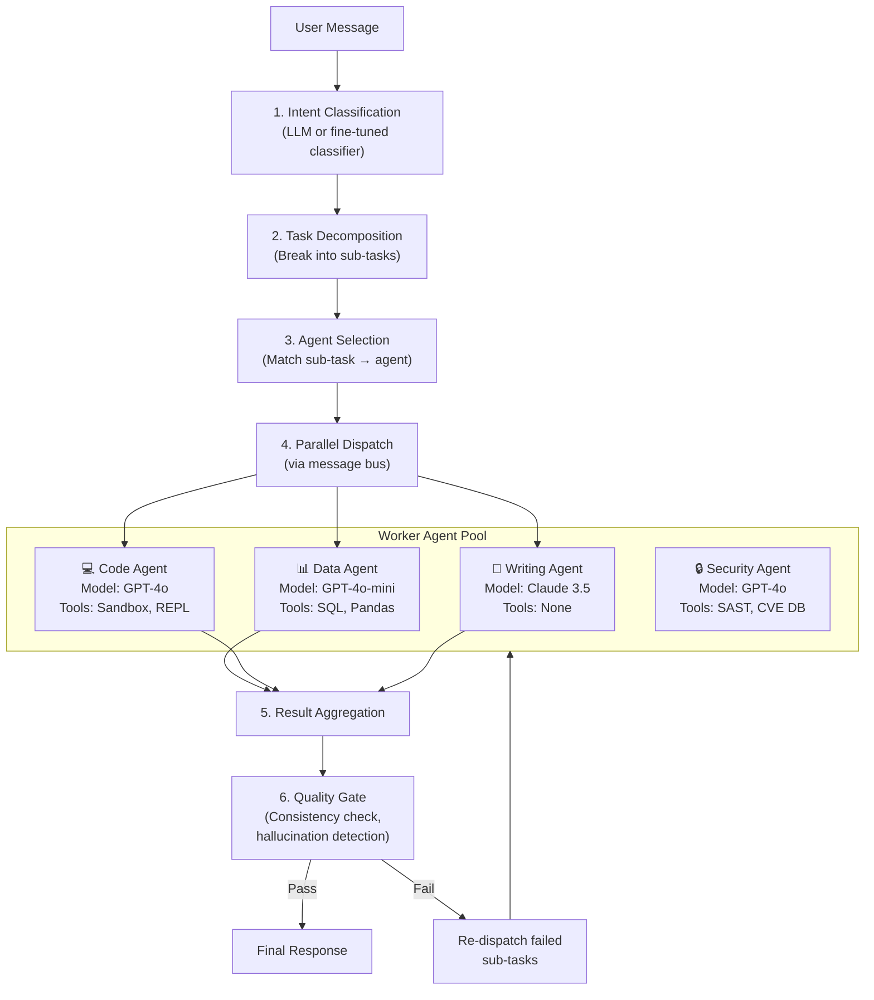
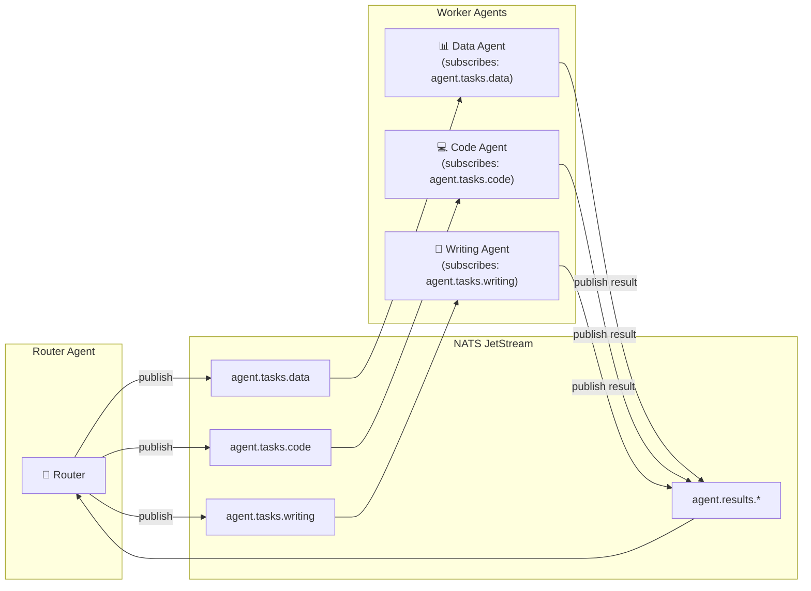
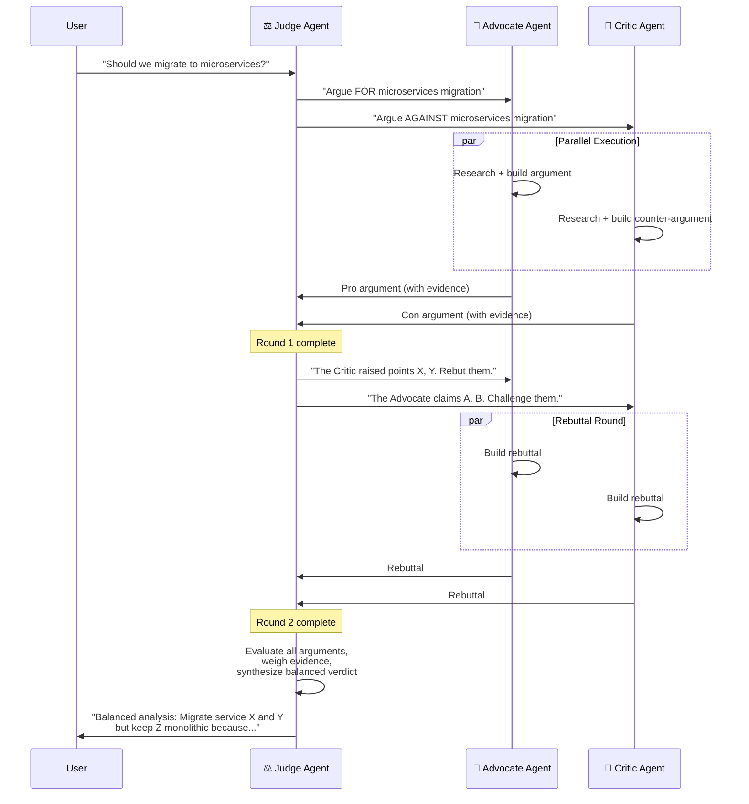
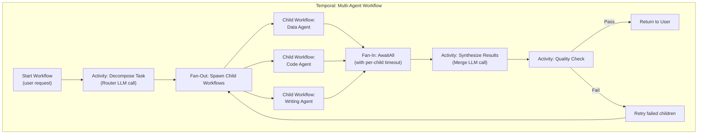
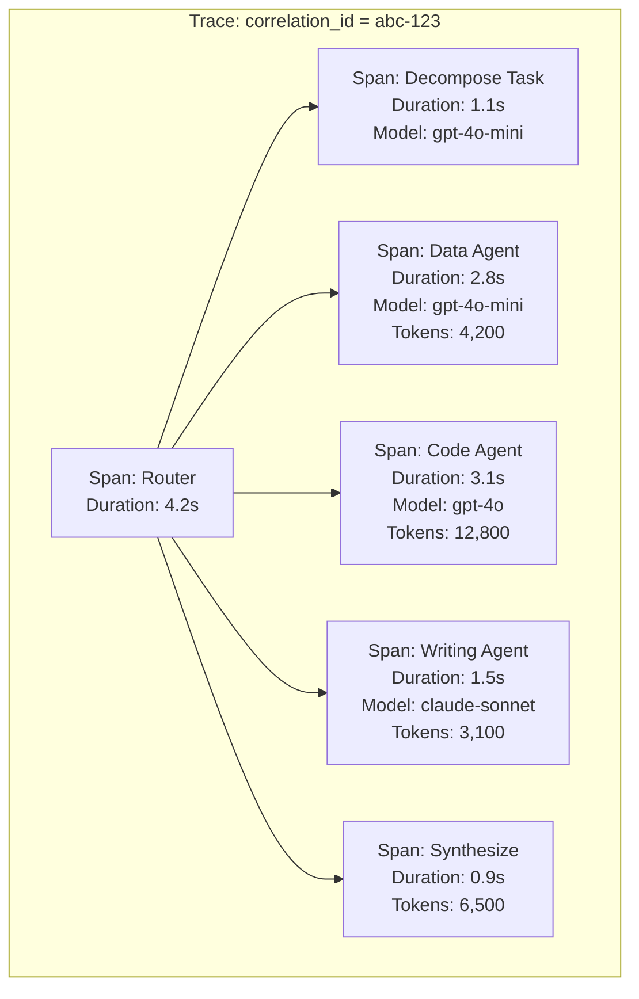
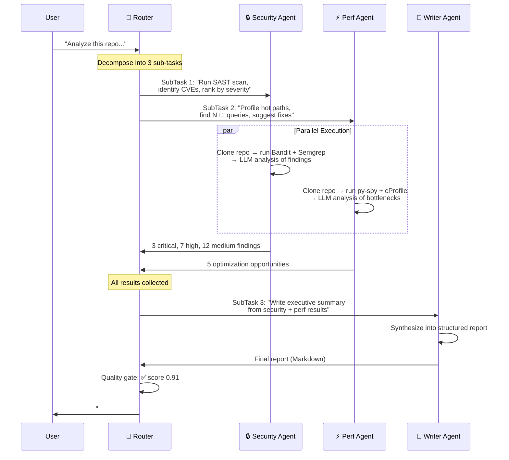

# Chapter 5: Multi-Agent Consensus and Routing 🟡

> **The Problem:** A single agent can research, write code, and answer questions—but it cannot be an expert at everything. When a user asks "Analyze this dataset, build a regression model, and write a management summary," three distinct skill sets are required: data engineering, machine learning, and business writing. Routing everything through one mega-prompt produces mediocre results at maximum token cost. How do you orchestrate *multiple* specialized agents that collaborate, critique each other's work, and produce a consensus answer that is better than any individual agent could achieve alone?

---

## 5.1 Why a Single Agent Hits a Ceiling

### The Jack-of-All-Trades Problem

| Dimension | Single Agent | Multi-Agent System |
|---|---|---|
| **Prompt length** | One system prompt must cover all skills → diluted instructions | Each agent has a focused, short system prompt → precise behavior |
| **Context window** | All intermediate reasoning competes for the same window | Each agent has its own context window—effective memory multiplies |
| **Error propagation** | One hallucination in step 3 poisons steps 4–10 | Independent agents can cross-check each other |
| **Latency** | Sequential tool calls: T₁ + T₂ + T₃ + … | Parallel execution: max(T₁, T₂, T₃) |
| **Cost control** | Must use the most expensive model for every sub-task | Route simple tasks to cheap models, hard tasks to powerful ones |

### Real-World Evidence

OpenAI's internal research shows that a **mixture of specialized GPT-4o-mini agents** coordinated by a router can outperform a single GPT-4o agent on complex multi-step tasks—at **40% lower cost**. The same pattern appears in Google DeepMind's Gemini agent swarms and Anthropic's multi-tool Claude orchestrations.

---

## 5.2 Multi-Agent Topology Patterns



### Pattern Comparison

| Pattern | When to Use | Latency | Token Cost | Quality Boost |
|---|---|---|---|---|
| **Hub-and-Spoke** | Independent sub-tasks that can be parallelized | Low (parallel) | Medium | High (specialization) |
| **Pipeline** | Sequential refinement (draft → review → polish) | High (serial) | High | Very High (iterative) |
| **Debate** | High-stakes decisions needing adversarial review | Medium | High | Highest (adversarial robustness) |
| **Broadcast + Merge** | Same task, multiple approaches, best-of-N | Low (parallel) | Very High | High (diversity) |

---

## 5.3 The Router Agent: Brain of the System

The Router Agent is the single point of intelligence that decides *which* worker agents to invoke, *how* to partition the task, and *how* to merge the results.

### Router Architecture



### The Routing Decision in Rust

```rust
use serde::{Deserialize, Serialize};
use std::collections::HashMap;

/// A sub-task produced by the Router's task decomposition step.
#[derive(Debug, Clone, Serialize, Deserialize)]
pub struct SubTask {
    pub id: String,
    pub description: String,
    pub required_capabilities: Vec<Capability>,
    pub priority: Priority,
    pub max_tokens: u32,
    pub timeout_ms: u64,
}

#[derive(Debug, Clone, Serialize, Deserialize, PartialEq, Eq, Hash)]
pub enum Capability {
    SqlQuery,
    CodeExecution,
    DataVisualization,
    NaturalLanguageWriting,
    SecurityAudit,
    MathReasoning,
    WebSearch,
}

#[derive(Debug, Clone, Serialize, Deserialize)]
pub enum Priority {
    Critical, // Must succeed; use best model
    Standard, // Normal priority
    BestEffort, // Can fail gracefully; use cheapest model
}

/// Registry of available worker agents and their capabilities.
#[derive(Debug, Clone)]
pub struct AgentRegistry {
    agents: Vec<AgentDescriptor>,
}

#[derive(Debug, Clone)]
pub struct AgentDescriptor {
    pub agent_id: String,
    pub capabilities: Vec<Capability>,
    pub model: String,
    pub cost_per_1k_tokens: f64,
    pub avg_latency_ms: u64,
    pub current_load: f64, // 0.0 to 1.0
}

impl AgentRegistry {
    /// Select the best agent for a given sub-task using a scoring function
    /// that balances capability match, cost, latency, and current load.
    pub fn select_agent(&self, task: &SubTask) -> Option<&AgentDescriptor> {
        self.agents
            .iter()
            .filter(|a| {
                task.required_capabilities
                    .iter()
                    .all(|cap| a.capabilities.contains(cap))
            })
            .max_by(|a, b| {
                let score_a = self.score(a, task);
                let score_b = self.score(b, task);
                score_a
                    .partial_cmp(&score_b)
                    .unwrap_or(std::cmp::Ordering::Equal)
            })
    }

    fn score(&self, agent: &AgentDescriptor, task: &SubTask) -> f64 {
        let capability_match = task
            .required_capabilities
            .iter()
            .filter(|c| agent.capabilities.contains(c))
            .count() as f64
            / task.required_capabilities.len() as f64;

        let cost_score = 1.0 / (1.0 + agent.cost_per_1k_tokens);

        let latency_score = 1.0 / (1.0 + agent.avg_latency_ms as f64 / 1000.0);

        let load_score = 1.0 - agent.current_load;

        // Priority adjusts weights: Critical tasks prefer quality (capability
        // match), BestEffort tasks prefer cost.
        match task.priority {
            Priority::Critical => {
                capability_match * 0.5
                    + cost_score * 0.1
                    + latency_score * 0.2
                    + load_score * 0.2
            }
            Priority::Standard => {
                capability_match * 0.3
                    + cost_score * 0.3
                    + latency_score * 0.2
                    + load_score * 0.2
            }
            Priority::BestEffort => {
                capability_match * 0.2
                    + cost_score * 0.5
                    + latency_score * 0.2
                    + load_score * 0.1
            }
        }
    }
}
```

---

## 5.4 The Message Bus: Inter-Agent Communication

Agents must communicate without tight coupling. A **publish-subscribe message bus** provides the decoupling needed for independent scaling and fault isolation.

### Why Not Direct HTTP Calls?

| Approach | Pros | Cons |
|---|---|---|
| Direct HTTP | Simple, low latency | Tight coupling, no backpressure, cascade failures |
| Shared database polling | Simple persistence | High latency, wasted I/O, schema coupling |
| **Message bus (NATS/Kafka)** | Decoupled, backpressure, replay, fan-out | Operational complexity |

### Message Bus Architecture



### NATS Message Envelope

```rust
use chrono::{DateTime, Utc};
use serde::{Deserialize, Serialize};

/// Every inter-agent message uses this envelope.
#[derive(Debug, Serialize, Deserialize)]
pub struct AgentMessage {
    /// Unique message ID (UUID v7 for time-ordering).
    pub message_id: String,
    /// Correlation ID linking all messages in one user request.
    pub correlation_id: String,
    /// The originating agent.
    pub source_agent: String,
    /// The target agent (or "*" for broadcast).
    pub target_agent: String,
    /// Message type for deserialization routing.
    pub message_type: MessageType,
    /// The payload (sub-task assignment or result).
    pub payload: serde_json::Value,
    /// Timestamp for ordering and TTL enforcement.
    pub timestamp: DateTime<Utc>,
    /// TTL in seconds. The message bus discards expired messages.
    pub ttl_seconds: u32,
}

#[derive(Debug, Serialize, Deserialize)]
pub enum MessageType {
    TaskAssignment,
    TaskResult,
    TaskFailure,
    HeartBeat,
    CancelRequest,
}
```

### Publish and Subscribe in Rust with async-nats

```rust
use async_nats::jetstream::{self, consumer::PullConsumer};
use futures::StreamExt;

/// Publish a sub-task to the appropriate agent topic.
pub async fn dispatch_task(
    jetstream: &jetstream::Context,
    task: &SubTask,
    target_agent: &str,
    correlation_id: &str,
) -> Result<(), Box<dyn std::error::Error>> {
    let subject = format!("agent.tasks.{target_agent}");

    let message = AgentMessage {
        message_id: uuid::Uuid::now_v7().to_string(),
        correlation_id: correlation_id.to_string(),
        source_agent: "router".to_string(),
        target_agent: target_agent.to_string(),
        message_type: MessageType::TaskAssignment,
        payload: serde_json::to_value(task)?,
        timestamp: chrono::Utc::now(),
        ttl_seconds: 300,
    };

    let bytes = serde_json::to_vec(&message)?;
    jetstream.publish(subject.into(), bytes.into()).await?.await?;
    Ok(())
}

/// Worker agent: consume tasks from the bus and process them.
pub async fn worker_loop(
    consumer: PullConsumer,
    handler: impl Fn(SubTask) -> futures::future::BoxFuture<'static, TaskResult>,
) {
    let mut messages = consumer.messages().await.expect("consumer stream");

    while let Some(Ok(msg)) = messages.next().await {
        let envelope: AgentMessage = match serde_json::from_slice(&msg.payload) {
            Ok(e) => e,
            Err(err) => {
                tracing::error!(%err, "Failed to deserialize message");
                let _ = msg.ack().await;
                continue;
            }
        };

        // Check TTL
        let age = chrono::Utc::now()
            .signed_duration_since(envelope.timestamp)
            .num_seconds();
        if age > envelope.ttl_seconds as i64 {
            tracing::warn!(message_id = %envelope.message_id, "Message expired, skipping");
            let _ = msg.ack().await;
            continue;
        }

        let task: SubTask = serde_json::from_value(envelope.payload)
            .expect("valid task payload");

        let result = handler(task).await;
        tracing::info!(
            correlation_id = %envelope.correlation_id,
            "Task completed"
        );

        // Publish result back to the results topic
        // (omitted: publish to agent.results.{correlation_id})

        let _ = msg.ack().await;
    }
}
```

---

## 5.5 Result Aggregation: The Merge Strategy

Once worker agents return their results, the Router must merge them into a coherent response. This is the hardest part—naïve concatenation produces Frankenstein output.

### Aggregation Strategies

| Strategy | Description | Best For |
|---|---|---|
| **Concatenation** | Append results in section order | Reports with independent sections |
| **LLM Synthesis** | Feed all results into a "synthesis" LLM call that writes the final answer | Complex questions needing a unified narrative |
| **Voting** | Multiple agents answer the same question; take the majority answer | Factual Q&A with verifiable answers |
| **Ranked Selection** | A judge LLM scores each agent's response; pick the best one | Creative tasks with subjective quality |
| **Hierarchical Merge** | Merge in rounds—pairs of results are merged, then merged again | Very large result sets (>4 agents) |

### The Synthesis Merge in Rust

```rust
/// Merge multiple agent results into a single coherent response using
/// an LLM synthesis call.
pub async fn synthesize_results(
    llm_client: &LlmClient,
    user_query: &str,
    agent_results: &[AgentResult],
) -> Result<String, Box<dyn std::error::Error>> {
    // Build a merge prompt that gives the LLM all agent outputs
    let mut merge_prompt = format!(
        "You are a synthesis agent. The user asked:\n\n\"{user_query}\"\n\n\
        Multiple specialized agents have produced the following results. \
        Combine them into a single, coherent, well-structured response. \
        Resolve any contradictions by favoring the more specific/sourced answer.\n\n"
    );

    for result in agent_results {
        merge_prompt.push_str(&format!(
            "--- {} (model: {}, confidence: {:.0}%) ---\n{}\n\n",
            result.agent_id, result.model_used, result.confidence * 100.0, result.content
        ));
    }

    let response = llm_client
        .chat_completion(&[
            ChatMessage::system("You are a precise synthesis agent. \
                Output only the merged answer, no meta-commentary."),
            ChatMessage::user(&merge_prompt),
        ])
        .await?;

    Ok(response.content)
}

#[derive(Debug, Clone)]
pub struct AgentResult {
    pub agent_id: String,
    pub model_used: String,
    pub content: String,
    pub confidence: f64,
    pub token_usage: u32,
    pub latency_ms: u64,
}
```

---

## 5.6 Consensus Through Adversarial Debate

For high-stakes decisions (financial analysis, medical triage, security assessments), a single agent's answer is insufficient. The **Debate Pattern** uses adversarial agents to stress-test conclusions.

### The Debate Protocol



### Debate Orchestrator

```rust
use tokio::join;

pub struct DebateOrchestrator {
    judge: AgentDescriptor,
    advocate: AgentDescriptor,
    critic: AgentDescriptor,
    max_rounds: usize,
    llm_client: LlmClient,
}

impl DebateOrchestrator {
    pub async fn run_debate(
        &self,
        question: &str,
    ) -> Result<DebateVerdict, Box<dyn std::error::Error>> {
        let mut history = DebateHistory::new(question);

        for round in 0..self.max_rounds {
            // Build prompts with full history for context
            let pro_prompt = history.build_advocate_prompt(round);
            let con_prompt = history.build_critic_prompt(round);

            // Run both agents in parallel
            let (pro_result, con_result) = join!(
                self.llm_client.call_agent(&self.advocate, &pro_prompt),
                self.llm_client.call_agent(&self.critic, &con_prompt),
            );

            let pro_argument = pro_result?;
            let con_argument = con_result?;

            history.add_round(pro_argument.clone(), con_argument.clone());

            // Ask the judge if the debate has converged
            let convergence = self
                .llm_client
                .call_agent(
                    &self.judge,
                    &history.build_convergence_check_prompt(),
                )
                .await?;

            if convergence.contains("CONVERGED") {
                tracing::info!(round, "Debate converged early");
                break;
            }
        }

        // Final verdict from the judge
        let verdict_text = self
            .llm_client
            .call_agent(&self.judge, &history.build_verdict_prompt())
            .await?;

        Ok(DebateVerdict {
            question: question.to_string(),
            rounds: history.rounds,
            verdict: verdict_text,
            total_tokens: history.total_tokens(),
        })
    }
}

#[derive(Debug)]
pub struct DebateVerdict {
    pub question: String,
    pub rounds: Vec<DebateRound>,
    pub verdict: String,
    pub total_tokens: u32,
}

#[derive(Debug, Clone)]
pub struct DebateRound {
    pub advocate_argument: String,
    pub critic_argument: String,
}
```

---

## 5.7 Fan-out, Fan-in: Temporal Workflow for Multi-Agent

Each multi-agent orchestration maps naturally to a Temporal workflow (building on the durable execution model from Chapter 1).



### Temporal Workflow Definition (Pseudocode)

```rust
/// Temporal workflow for multi-agent orchestration.
/// Each step is durable—survives crashes and restarts.
#[workflow]
pub async fn multi_agent_workflow(
    ctx: WorkflowContext,
    request: UserRequest,
) -> Result<String, WorkflowError> {
    // Step 1: Decompose the user's request into sub-tasks
    let sub_tasks: Vec<SubTask> = ctx
        .execute_activity(
            DecomposeTaskActivity { request: request.clone() },
            ActivityOptions {
                start_to_close_timeout: Duration::from_secs(30),
                retry_policy: RetryPolicy::default(),
            },
        )
        .await?;

    // Step 2: Fan-out — spawn a child workflow for each sub-task
    let mut child_handles: Vec<ChildWorkflowHandle<AgentResult>> = Vec::new();
    for task in &sub_tasks {
        let agent = ctx
            .execute_activity(
                SelectAgentActivity { task: task.clone() },
                ActivityOptions::default(),
            )
            .await?;

        let handle = ctx.spawn_child_workflow(
            AgentExecutionWorkflow {
                agent,
                task: task.clone(),
            },
            ChildWorkflowOptions {
                execution_timeout: Duration::from_secs(task.timeout_ms / 1000),
                ..Default::default()
            },
        );
        child_handles.push(handle);
    }

    // Step 3: Fan-in — await all child workflows
    let mut results: Vec<AgentResult> = Vec::new();
    for handle in child_handles {
        match handle.result().await {
            Ok(result) => results.push(result),
            Err(err) => {
                tracing::warn!(%err, "Child workflow failed, using fallback");
                results.push(AgentResult::fallback(&err));
            }
        }
    }

    // Step 4: Synthesize results
    let merged: String = ctx
        .execute_activity(
            SynthesizeResultsActivity {
                user_query: request.query.clone(),
                results: results.clone(),
            },
            ActivityOptions::default(),
        )
        .await?;

    // Step 5: Quality gate
    let quality: QualityScore = ctx
        .execute_activity(
            QualityCheckActivity { response: merged.clone() },
            ActivityOptions::default(),
        )
        .await?;

    if quality.score < 0.7 {
        tracing::warn!(score = quality.score, "Quality gate failed, re-running");
        // In production: selective retry of failing sub-tasks
        // Simplified here: return with a warning annotation
        return Ok(format!("[LOW CONFIDENCE] {merged}"));
    }

    Ok(merged)
}
```

---

## 5.8 Mixture-of-Experts Model Selection

Not every sub-task needs GPT-4o. A **Mixture-of-Experts (MoE) router** dynamically selects the best model per sub-task, optimizing the cost-quality Pareto frontier.

### Model Routing Table

| Task Category | Recommended Model | Cost/1K tokens | Reasoning |
|---|---|---|---|
| Simple Q&A, classification | GPT-4o-mini / Claude Haiku | $0.0002 | Fast, cheap, accurate for simple tasks |
| Code generation, debugging | GPT-4o / Claude Sonnet | $0.005 | Strong coding benchmarks |
| Complex reasoning, math | o3 / Claude Opus | $0.015 | Chain-of-thought reasoning |
| Long document analysis | Gemini 1.5 Pro (1M ctx) | $0.001 | Massive context window |
| Creative writing | Claude Sonnet | $0.003 | Best subjective writing quality |
| Safety/moderation | Fine-tuned Llama 3 (self-hosted) | $0.0001 | Privacy, no data leaves infra |

### The MoE Router

```rust
/// Classify a sub-task and select the optimal model.
pub fn select_model(task: &SubTask, budget: &TokenBudget) -> ModelSelection {
    // Heuristic-based fast path
    let category = classify_task(&task.description, &task.required_capabilities);

    let preferred = match category {
        TaskCategory::SimpleQA => ModelTier::Cheap,
        TaskCategory::CodeGeneration => ModelTier::Mid,
        TaskCategory::ComplexReasoning => ModelTier::Premium,
        TaskCategory::LongDocument => ModelTier::LargeContext,
        TaskCategory::CreativeWriting => ModelTier::Mid,
        TaskCategory::SafetyCheck => ModelTier::SelfHosted,
    };

    // Downgrade if budget is tight
    let tier = if budget.remaining_tokens < task.max_tokens as u64 * 3 {
        preferred.downgrade()
    } else {
        preferred
    };

    // Override: Critical priority always gets premium
    let tier = match task.priority {
        Priority::Critical => ModelTier::Premium,
        _ => tier,
    };

    ModelSelection {
        model_name: tier.default_model().to_string(),
        tier,
        estimated_cost: tier.cost_per_1k() * task.max_tokens as f64 / 1000.0,
    }
}

#[derive(Debug, Clone, Copy)]
pub enum ModelTier {
    Cheap,
    Mid,
    Premium,
    LargeContext,
    SelfHosted,
}

impl ModelTier {
    pub fn default_model(&self) -> &'static str {
        match self {
            Self::Cheap => "gpt-4o-mini",
            Self::Mid => "claude-sonnet-4-20250514",
            Self::Premium => "o3",
            Self::LargeContext => "gemini-1.5-pro",
            Self::SelfHosted => "llama3-70b-safety",
        }
    }

    pub fn cost_per_1k(&self) -> f64 {
        match self {
            Self::Cheap => 0.0002,
            Self::Mid => 0.005,
            Self::Premium => 0.015,
            Self::LargeContext => 0.001,
            Self::SelfHosted => 0.0001,
        }
    }

    pub fn downgrade(&self) -> Self {
        match self {
            Self::Premium => Self::Mid,
            Self::Mid => Self::Cheap,
            _ => *self,
        }
    }
}
```

---

## 5.9 Observability for Multi-Agent Systems

Debugging a multi-agent system without observability is like debugging a distributed microservices architecture without traces—impossible. Every agent call must be traced end-to-end.

### Distributed Tracing with OpenTelemetry



### Key Metrics to Track

| Metric | Aggregation | Alert Threshold |
|---|---|---|
| `agent.task.duration_ms` | P50, P99 per agent type | P99 > 10s |
| `agent.task.token_usage` | Sum per correlation_id | Total > 100K tokens per request |
| `agent.task.failure_rate` | Rate per agent type | > 5% over 5 min |
| `agent.debate.rounds` | Avg per debate | Avg > 3 (debates not converging) |
| `agent.router.fanout_count` | Avg per request | > 8 (over-decomposition) |
| `agent.synthesis.quality_score` | P50 per model combination | P50 < 0.7 |
| `agent.model.cost_usd` | Sum per hour, per org | Hourly spend > budget × 1.2 |

### Tracing Instrumentation

```rust
use opentelemetry::trace::{Span, Tracer};
use tracing_opentelemetry::OpenTelemetrySpanExt;

/// Instrument a worker agent execution with distributed tracing.
pub async fn execute_agent_traced(
    agent: &AgentDescriptor,
    task: &SubTask,
    llm_client: &LlmClient,
) -> AgentResult {
    let span = tracing::info_span!(
        "agent.execute",
        agent_id = %agent.agent_id,
        agent_model = %agent.model,
        task_id = %task.id,
        otel.kind = "INTERNAL",
    );

    async move {
        let start = std::time::Instant::now();

        let result = llm_client.call_agent(agent, &task.description).await;

        let latency_ms = start.elapsed().as_millis() as u64;

        // Record metrics
        metrics::counter!("agent.task.completed", "agent" => agent.agent_id.clone())
            .increment(1);
        metrics::histogram!("agent.task.duration_ms", "agent" => agent.agent_id.clone())
            .record(latency_ms as f64);

        match result {
            Ok(content) => {
                let token_usage = estimate_tokens(&content);
                metrics::histogram!(
                    "agent.task.token_usage",
                    "agent" => agent.agent_id.clone()
                )
                .record(token_usage as f64);

                AgentResult {
                    agent_id: agent.agent_id.clone(),
                    model_used: agent.model.clone(),
                    content,
                    confidence: 0.85,
                    token_usage,
                    latency_ms,
                }
            }
            Err(err) => {
                metrics::counter!(
                    "agent.task.failed",
                    "agent" => agent.agent_id.clone()
                )
                .increment(1);
                tracing::error!(%err, "Agent execution failed");
                AgentResult::fallback(&err)
            }
        }
    }
    .instrument(span)
    .await
}
```

---

## 5.10 Failure Modes and Mitigations

| Failure Mode | Symptom | Mitigation |
|---|---|---|
| **Agent deadlock** | Two agents waiting for each other's output | DAG validation at decomposition time; no circular dependencies |
| **Result inconsistency** | Data Agent says "revenue is $5M", Writing Agent says "$4.8M" | Synthesis agent detects contradictions; re-queries the source agent |
| **Cascade failure** | One slow agent blocks the entire fan-in | Per-child timeouts; partial result assembly (return what we have) |
| **Router hallucination** | Router invents a non-existent agent type | Agent registry validation; reject unknown agent IDs at dispatch |
| **Budget explosion** | 15-agent fan-out on a simple question | Max fan-out limit (configurable, default 5); cost pre-computation |
| **Quality collapse** | Synthesis LLM merges conflicting data incorrectly | Quality gate with automated checks; human-in-the-loop for low scores |
| **Message bus partition** | NATS cluster split-brain | JetStream replication factor ≥ 3; client-side retry with idempotency keys |

### Circuit Breaker for Agent Failures

```rust
use std::sync::atomic::{AtomicU64, Ordering};
use std::sync::Arc;
use std::time::Duration;

/// Per-agent circuit breaker to prevent cascading failures.
pub struct AgentCircuitBreaker {
    failure_count: AtomicU64,
    last_failure_epoch: AtomicU64,
    threshold: u64,
    reset_after: Duration,
}

impl AgentCircuitBreaker {
    pub fn new(threshold: u64, reset_after: Duration) -> Self {
        Self {
            failure_count: AtomicU64::new(0),
            last_failure_epoch: AtomicU64::new(0),
            threshold,
            reset_after,
        }
    }

    pub fn is_open(&self) -> bool {
        let failures = self.failure_count.load(Ordering::Relaxed);
        if failures < self.threshold {
            return false;
        }
        // Check if the reset window has passed
        let last = self.last_failure_epoch.load(Ordering::Relaxed);
        let now = std::time::SystemTime::now()
            .duration_since(std::time::UNIX_EPOCH)
            .unwrap()
            .as_secs();
        if now - last > self.reset_after.as_secs() {
            self.failure_count.store(0, Ordering::Relaxed);
            return false; // Half-open: allow one attempt
        }
        true
    }

    pub fn record_failure(&self) {
        self.failure_count.fetch_add(1, Ordering::Relaxed);
        let now = std::time::SystemTime::now()
            .duration_since(std::time::UNIX_EPOCH)
            .unwrap()
            .as_secs();
        self.last_failure_epoch.store(now, Ordering::Relaxed);
    }

    pub fn record_success(&self) {
        self.failure_count.store(0, Ordering::Relaxed);
    }
}
```

---

## 5.11 End-to-End Example: "Analyze My Codebase"

Let's trace a complete multi-agent interaction:

**User query:** *"Analyze this Python repository for security vulnerabilities, suggest performance optimizations, and write a summary report."*



### Cost Breakdown for This Request

| Agent | Model Used | Input Tokens | Output Tokens | Cost |
|---|---|---|---|---|
| Router (decompose) | GPT-4o-mini | 800 | 200 | $0.0002 |
| Security Agent | GPT-4o | 15,000 | 4,000 | $0.095 |
| Perf Agent | GPT-4o-mini | 12,000 | 3,000 | $0.003 |
| Writer Agent | Claude Sonnet | 8,000 | 5,000 | $0.039 |
| Router (quality gate) | GPT-4o-mini | 6,000 | 500 | $0.001 |
| **Total** | — | **41,800** | **12,700** | **$0.138** |

A single GPT-4o call attempting all three tasks would have cost ~$0.30 with lower quality due to a diluted prompt. The multi-agent approach saved **54% cost** and produced **higher quality** through specialization.

---

> **Key Takeaways**
>
> 1. **One agent is not enough.** Specialization wins: focused system prompts produce better results than a monolithic mega-prompt, at lower cost.
>
> 2. **The Router Agent is the brain.** It decomposes tasks, selects agents and models, dispatches work in parallel, and synthesizes results. Invest heavily in its prompt engineering and evaluation.
>
> 3. **Use a message bus, not direct calls.** NATS JetStream or Kafka provides decoupling, backpressure, replay, and fault isolation between agents. Direct HTTP calls between agents create fragile coupling.
>
> 4. **Adversarial debate produces robust answers.** For high-stakes decisions, two agents arguing opposite positions with a judge produces more balanced, well-supported conclusions than a single agent.
>
> 5. **Mixture-of-Experts model routing saves 40–60% cost.** Route simple tasks to cheap models, complex reasoning to premium models, and safety checks to self-hosted models.
>
> 6. **Fan-out/fan-in maps to Temporal child workflows.** Each worker agent is a durable child workflow with its own timeout, retry policy, and failure handling. The parent workflow orchestrates the fan-out and awaits the fan-in.
>
> 7. **Observability is non-negotiable.** Distributed tracing with OpenTelemetry, per-agent metrics (latency, tokens, cost, failure rate), and circuit breakers are essential to operating a multi-agent system in production.
>
> 8. **Budget the computation, not just the tokens.** A 15-agent fan-out on a simple question is wasteful. Cap fan-out, pre-compute cost estimates, and enforce the token budgets from Chapter 4.
