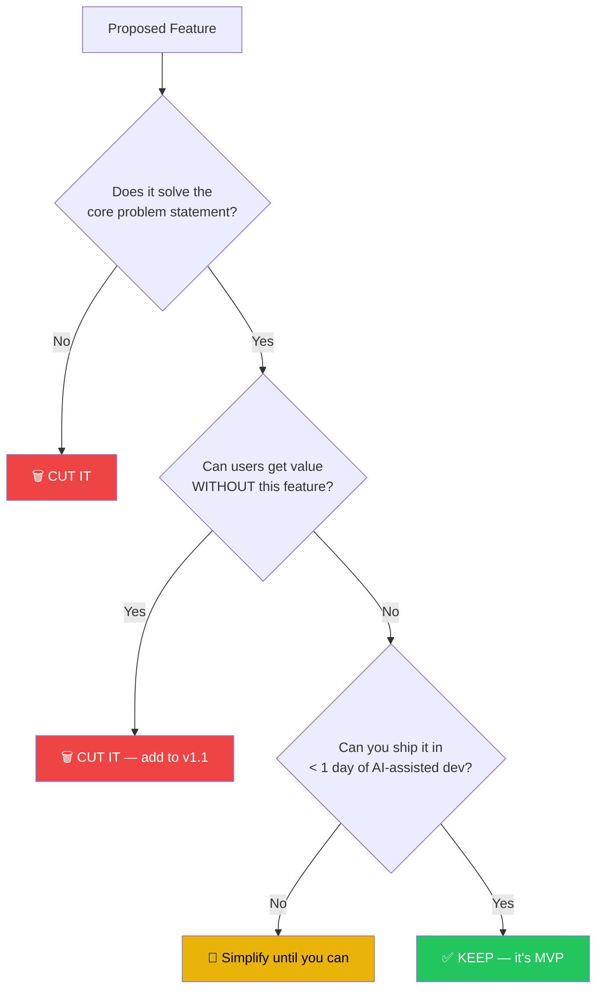

# 1. Defining the MVP and Bounding Scope 🟢

> **What you'll learn:**
> - How to write a one-page Product Requirements Document (PRD) that an LLM can directly translate into architecture
> - The "Ruthless Cut" framework for eliminating features that don't survive first contact with users
> - Why scope is the #1 predictor of shipping speed — not talent, not tooling, not funding
> - How to structure requirements so AI code generation produces coherent, testable output

---

## The #1 Reason Products Don't Ship

It's not bad code. It's not technical debt. It's not the wrong framework.

**It's scope.**

Every product that died in development died because someone said "while we're at it, let's also…" and nobody said no. The AI-native workflow makes this *worse*, not better, because generating code is now essentially free. The constraint has shifted from "can we build this?" to "should we build this?"

The answer is almost always no.

## The One-Page PRD

A Product Requirements Document is a contract between you and your codebase. In the AI-native workflow, it serves a dual purpose: it aligns the *team* and it aligns the *model*. A well-structured PRD is, quite literally, the best prompt you'll ever write.

### The Legacy Way: Bloated Requirements

```markdown
<!-- 💥 HALLUCINATION DEBT: This PRD style produces unfocused AI output -->
## Product Vision
We want to build a comprehensive platform that enables users to manage
their tasks, collaborate with team members, integrate with third-party
services, support multiple languages, provide real-time analytics,
offer a mobile app, and include an AI assistant...

## Features (47 items)
1. User registration with email, Google, GitHub, Apple, SAML SSO...
2. Task CRUD with subtasks, dependencies, recurring tasks, templates...
3. Real-time collaboration with presence, cursors, comments, reactions...
...
```

### The AI-Native Way: The One-Page PRD Template

```markdown
<!-- ✅ FIX: Structured PRD that LLMs can parse into architecture -->
# PRD: [Product Name] — v0.1 MVP

## Problem (2–3 sentences)
[Who] has [problem] because [root cause]. Today they [workaround].
This costs them [time/money/pain].

## Solution (1 sentence)
[Product] lets [who] do [what] in [how] so they [outcome].

## User Stories (max 5 for MVP)
1. As a [role], I want to [action] so that [benefit].
2. ...

## Non-Goals (explicit exclusions)
- NOT building: [feature A], [feature B], [feature C]
- NOT supporting: [platform], [integration], [edge case]

## Success Metric (1 number)
[Metric] reaches [target] within [timeframe].

## Technical Constraints
- Stack: [framework, database, hosting]
- Auth: [provider]
- Budget: [$X/month infrastructure]
```

This structure works because it has **hard boundaries**. When you feed this to Cursor or Copilot with "Generate the database schema for this PRD," the model produces focused output because the input is focused.

## The Ruthless Cut Framework

For every feature on your list, apply this filter:



### Example: Applying the Cut

You're building a SaaS that wraps an LLM API. Here's the feature list before and after the Ruthless Cut:

| Feature | Survives Cut? | Reason |
|---------|:---:|--------|
| User auth (email + password) | ✅ | Can't invoice without accounts |
| Google/GitHub OAuth | ❌ | Email auth ships in 2 hours; OAuth adds a full day |
| Conversation history | ✅ | Core value prop — users need to see past chats |
| Real-time streaming responses | ❌ | Nice UX but non-blocking; poll-and-display ships in 30 min |
| Team workspaces | ❌ | v1.1 — single-user validates the product first |
| Usage-based billing | ✅ | Must protect your API key costs from day one |
| Admin dashboard | ❌ | You can query the database directly for v0.1 |
| Mobile app | ❌ | Responsive web is the MVP mobile strategy |
| Export to PDF | ❌ | Users can copy-paste for now |

**Result:** 3 features survived. That's your sprint.

## Writing PRDs That AI Can Execute

The key insight is that **LLMs work best with structured, constrained inputs**. A PRD is a prompt. The clearer the prompt, the better the code.

### The PRD-to-Architecture Pipeline

When you have a tight PRD, you can feed it through a structured prompt chain:

| Step | Prompt Template | Expected Output |
|------|----------------|-----------------|
| 1. Schema | "Given this PRD, generate a PostgreSQL DDL schema with constraints" | `CREATE TABLE` statements |
| 2. API Contract | "Given this schema, generate an OpenAPI 3.1 spec for the REST API" | `openapi.yaml` |
| 3. Types | "Given this OpenAPI spec, generate TypeScript interfaces" | Shared type definitions |
| 4. Tests | "Given these types, generate integration test skeletons with edge cases" | Test files with `TODO` bodies |
| 5. Implementation | "Make these tests pass using [framework]" | Working business logic |

Each step constrains the next. The schema constrains the API. The API constrains the types. The types constrain the tests. The tests constrain the implementation. **You are building a funnel that makes hallucination progressively harder.**

### Anti-Pattern: The "Vibe Coding" Trap

```
// 💥 HALLUCINATION DEBT: Asking AI to "build me a task app" with no constraints
//    produces 800 lines of untyped, untested code with invented API endpoints,
//    a hand-rolled auth system, and dependencies on three deprecated packages.
```

```
// ✅ FIX: Feed the PRD → Schema → Types → Tests pipeline.
//    Each step is verifiable. Each step constrains the next.
//    The AI never sees an unbounded problem.
```

## Scope as a First Principle

Here's the uncomfortable truth: **scope discipline is a prerequisite for AI-assisted development.** Without it, AI tools amplify chaos. They'll happily generate 50 endpoints, 30 database tables, and a Kubernetes deployment manifest for a product that should have been a single-page app with three API routes and a SQLite database.

The AI doesn't know what not to build. That's your job.

<details>
<summary><strong>🏋️ Exercise: Write Your One-Page PRD</strong> (click to expand)</summary>

### The Challenge

You've been tasked with building an **internal tool** for a 20-person startup. The sales team manually tracks customer follow-ups in a spreadsheet. They want "a CRM." Your job is to scope the MVP.

**Requirements gathering from the sales lead:**
- "We need to track companies and contacts"
- "I want to see when the last touchpoint was"
- "It would be great to integrate with our email"
- "Can it predict which deals will close?"
- "We need pipeline stages and deal values"
- "Reporting dashboards would be amazing"
- "Mobile access is important"
- "Can we import our existing spreadsheet?"

**Your task:**
1. Write a One-Page PRD using the template above.
2. Apply the Ruthless Cut to the feature list.
3. Identify the exact user stories for v0.1 (max 5).

<details>
<summary>🔑 Solution</summary>

```markdown
# PRD: DealPulse — v0.1 MVP

## Problem (2–3 sentences)
The 20-person sales team tracks customer follow-ups in a shared
Google Sheet. Rows get accidentally deleted, there's no history
of interactions, and the sales lead can't see which accounts are
going stale. This costs ~5 hours/week in manual coordination.

## Solution (1 sentence)
DealPulse lets the sales team log contacts and touchpoints in a
simple web app so stale accounts surface automatically.

## User Stories (max 5 for MVP)
1. As a sales rep, I want to add a company and its contacts
   so I have a single source of truth.
2. As a sales rep, I want to log a touchpoint (call, email, meeting)
   against a contact so the team knows when we last talked.
3. As a sales lead, I want to see a list of accounts sorted by
   "days since last touchpoint" so I can spot stale deals.
4. As a sales rep, I want to import a CSV of our existing
   spreadsheet data so we don't start from zero.
5. As a sales lead, I want to assign a pipeline stage (Lead,
   Qualified, Proposal, Closed) to each company.

## Non-Goals (explicit exclusions)
- NOT building: email integration, deal value tracking,
  predictive analytics, mobile app, reporting dashboards
- NOT supporting: multi-tenant, SSO, API access

## Success Metric (1 number)
100% of sales team uses DealPulse instead of the spreadsheet
within 2 weeks of launch.

## Technical Constraints
- Stack: Next.js + Postgres (Supabase)
- Auth: Supabase Auth (email/password, internal only)
- Budget: $0/month (Supabase free tier)
```

**The Ruthless Cut applied:**

| Requested Feature | Decision | Reason |
|---|:---:|---|
| Track companies & contacts | ✅ KEEP | Core data model |
| Last touchpoint visibility | ✅ KEEP | Core problem being solved |
| Email integration | ❌ CUT | Massive scope; manual logging works for 20 people |
| Deal prediction (AI) | ❌ CUT | Requires months of data to be useful |
| Pipeline stages | ✅ KEEP | Simple enum field, high value |
| Reporting dashboards | ❌ CUT | SQL queries cover this for v0.1 |
| Mobile access | ❌ CUT | Responsive CSS on the web app |
| CSV import | ✅ KEEP | Zero-value app without existing data migration |

**Key insight:** We cut 4 of 8 features. The remaining 4 can be built in a single day with AI assistance. The email integration alone would have added a week.

</details>
</details>

> **Key Takeaways**
> - Scope is the single biggest lever on shipping speed. Cut ruthlessly.
> - A structured PRD is both a team alignment tool and the best AI prompt you'll ever write.
> - Use the PRD → Schema → Types → Tests → Implementation pipeline to constrain AI output at every stage.
> - The "Ruthless Cut" filter: if users can get value without it, it's not MVP.
> - AI amplifies chaos in unbounded problems. Your job is to set the boundaries.

> **See also:** [Chapter 2: Mastering the AI-Native IDE](ch02-mastering-the-ai-native-ide.md) for translating your PRD into a scaffolded project, and [Chapter 4: Schema-First Development](ch04-schema-first-development.md) for the next step in the pipeline.
