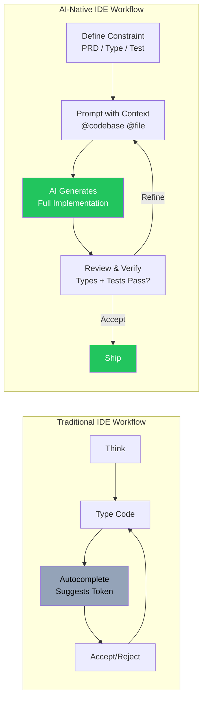
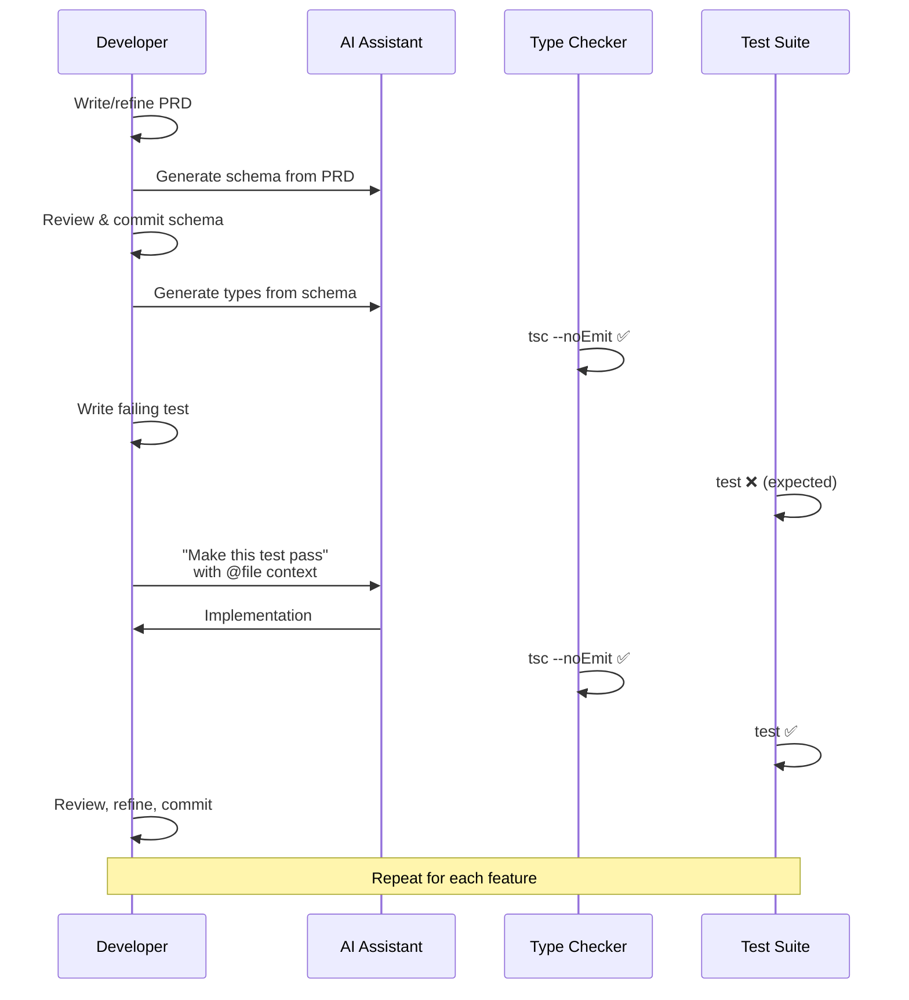

# 2. Mastering the AI-Native IDE (Cursor/Copilot) 🟢

> **What you'll learn:**
> - How to move from "autocomplete user" to "AI-native developer" using Cursor and GitHub Copilot
> - The `@codebase`, `@file`, and `@docs` context system that transforms AI accuracy
> - Prompt engineering patterns for refactoring, debugging, and greenfield generation
> - How to detect and prevent hallucinations: deprecated libraries, invented APIs, and phantom types

---

## Beyond Autocomplete: The AI-Native Mental Model

Most developers use AI coding assistants the same way they used IntelliSense in 2010: wait for a suggestion, press Tab, move on. That's the slowest possible way to use the most powerful development tool ever created.

The AI-native developer treats the LLM as a **pair programmer with perfect recall but zero judgment.** It has read every Stack Overflow answer, every GitHub repo, every blog post. It can write any function in any language. But it has no idea what *your* product needs, what *your* codebase looks like, or whether the library it's suggesting was deprecated six months ago.

Your job is to provide **context and constraints**. The AI's job is to provide **velocity**.



## The Context Hierarchy

The single most important concept in AI-assisted development is **context management.** The quality of AI output is a direct function of the context you provide.

### Cursor Context Commands

| Command | What It Does | When to Use |
|---------|-------------|-------------|
| `@codebase` | Indexes your entire project and includes relevant files | Generating code that needs to fit existing patterns |
| `@file:path/to/file.ts` | Includes a specific file in the prompt context | When you need the AI to match a specific interface or schema |
| `@docs` | Fetches documentation for a library | When working with an unfamiliar API |
| `@web` | Searches the internet for current information | When you suspect the AI's training data is stale |
| `@git` | Includes recent git diff/history | When asking "why did this break after the last commit?" |

### GitHub Copilot Context (VS Code)

| Feature | What It Does | When to Use |
|---------|-------------|-------------|
| `#file:path` | References a specific file | Matching existing patterns |
| `#selection` | References highlighted code | Refactoring or explaining specific code |
| `@workspace` | Searches entire workspace | Finding related code across files |
| `#codebase` | Broader codebase context | Cross-cutting architectural questions |
| Copilot Chat | Conversational coding assistant | Multi-step reasoning, debugging sessions |

### The Golden Rule of Context

> **The AI can only be as good as the context you give it.** An unbounded prompt ("build me a user auth system") produces garbage. A bounded prompt ("implement the `authenticate` function in `@file:src/auth.ts` that satisfies the interface in `@file:src/types/auth.d.ts` and passes the tests in `@file:tests/auth.test.ts`") produces production-quality code.

## Prompt Patterns That Ship

### Pattern 1: The Constraint Sandwich

Wrap your request between a type definition and a test expectation. The AI fills in the implementation.

**The Legacy Way:**
```
"Write a function that validates email addresses"

// 💥 HALLUCINATION DEBT: The AI will generate a regex that either
//    accepts "user@.com" or rejects "user+tag@example.co.uk".
//    No tests, no types, no edge cases defined.
```

**The AI-Native Way:**
```
Given this TypeScript interface:

interface EmailValidator {
  validate(email: string): Result<ValidEmail, EmailError>;
}

type EmailError = 
  | { kind: "empty" }
  | { kind: "no_at_symbol" }
  | { kind: "invalid_domain" }
  | { kind: "too_long"; max: number; actual: number };

And these test cases in @file:tests/email.test.ts,
implement the validate function so all tests pass.

// ✅ FIX: The types define the error domain exhaustively.
//    The tests define the edge cases. The AI just fills in logic.
```

### Pattern 2: The Refactor Directive

Don't ask the AI to "improve" code. Tell it exactly what transformation you want.

| Bad Prompt | Good Prompt |
|-----------|------------|
| "Refactor this code" | "Extract the database query logic from this handler into a separate `UserRepository` class that implements `@file:src/types/repository.d.ts`" |
| "Make this faster" | "Replace the N+1 query loop on lines 34–52 with a single `JOIN` query that fetches users and their orders in one round-trip" |
| "Clean this up" | "Split this 200-line function into three functions: `parseInput`, `validateRules`, `persistResult`, matching the types in `@file:src/types/pipeline.d.ts`" |

### Pattern 3: The Debug Interview

When debugging, don't just paste the error. Give the AI the full execution context.

```
I'm seeing this error:
[paste full error with stack trace]

Here's the relevant code: @file:src/api/orders.ts
Here's the database schema: @file:prisma/schema.prisma
Here's the failing test: @file:tests/orders.test.ts

The test was passing before commit abc123. 
Here's what changed: @git:abc123

What's the root cause and how do I fix it?
```

## Detecting and Preventing Hallucinations

AI hallucinations in code are not theoretical — they're the #1 source of bugs in AI-assisted development. Here's a taxonomy:

### The Hallucination Taxonomy

| Type | Example | Detection | Prevention |
|------|---------|-----------|-----------|
| **Deprecated API** | AI suggests `bodyParser()` middleware (Express 4.16+ has `express.json()`) | `npm outdated`, `cargo audit` | Use `@docs` for current library docs |
| **Invented API** | AI calls `prisma.user.findByEmail()` (not real — it's `findUnique({where: {email}})`) | Type checker catches it | Provide `@file:node_modules/.prisma/client/index.d.ts` |
| **Phantom Package** | AI imports `@supercool/validator` (doesn't exist on npm) | `npm install` fails | Always verify package exists before accepting |
| **Stale Pattern** | AI uses `getServerSideProps` (Next.js Pages Router, not App Router) | Code review | Specify framework version in prompt: "Using Next.js 14 App Router" |
| **Logic Error** | AI generates "working" code that silently drops error cases | Tests fail (if you wrote them) | Test-Driven AI Generation (Chapter 5) |

### The Three-Check Rule

Before accepting *any* AI-generated code block:

1. **Types check** — Does it compile? Does `tsc --noEmit` pass? Does `cargo check` pass?
2. **Tests pass** — Do the existing tests still pass? Does the new code have test coverage?
3. **Dependencies valid** — Are all imported packages real, current, and not deprecated?

If you skip these checks, you're accumulating **hallucination debt** — technical debt that's invisible until production.

## The AI-Native Development Loop

Here's the complete workflow, from PRD to committed code:



## Setting Up Your AI-Native Environment

### Cursor Configuration

Create a `.cursorrules` file at your project root to give the AI persistent context:

```
# .cursorrules — Project-level AI instructions

## Project Context
This is a Next.js 14 App Router application using TypeScript strict mode.
Database: PostgreSQL via Prisma ORM.
Auth: NextAuth.js v5.

## Code Style Rules
- All functions must have explicit return types
- Use `Result<T, E>` pattern for error handling (no thrown exceptions)
- Database queries go in `src/repositories/`, not in route handlers
- All environment variables are typed in `src/env.ts`

## Forbidden Patterns
- Do NOT use `any` type
- Do NOT use `getServerSideProps` (we use App Router, not Pages Router)
- Do NOT import from `@prisma/client` directly; use the singleton in `src/lib/db.ts`
- Do NOT use `console.log` for error handling; use the logger in `src/lib/logger.ts`
```

### GitHub Copilot Configuration

Create a `.github/copilot-instructions.md` for the same purpose:

```markdown
## Project Architecture
- Framework: Axum 0.8 + SQLx + Tokio
- Database: PostgreSQL 16
- All handlers return `Result<Json<T>, AppError>`
- Use the connection pool from `src/db.rs`, never create new connections
- Error types are defined in `src/error.rs`
- All database queries use compile-time checked SQLx macros

## Testing Standards
- Integration tests use `testcontainers` for database isolation
- Every public function has at least one test
- Use `#[sqlx::test]` for database-dependent tests
```

These files are **the single highest-ROI investment** in AI-assisted development. Five minutes of setup saves hundreds of hallucination-fixing cycles.

<details>
<summary><strong>🏋️ Exercise: Configure Your AI Context</strong> (click to expand)</summary>

### The Challenge

You're starting a new project: a URL shortener service. Your stack is:
- **Backend:** Rust (Axum) or TypeScript (Next.js) — pick one
- **Database:** PostgreSQL
- **Auth:** API key-based (no user accounts for v0.1)

**Your tasks:**
1. Write a `.cursorrules` or `.github/copilot-instructions.md` file for this project.
2. Write a prompt that generates the database schema using the One-Page PRD format from Chapter 1.
3. Write a second prompt that generates the main route handler, referencing the schema as context.
4. Identify at least 2 potential hallucination risks in the AI output and describe how you'd detect them.

<details>
<summary>🔑 Solution</summary>

**1. `.cursorrules` for a Rust/Axum URL shortener:**

```
# .cursorrules — URL Shortener Service

## Project Context
This is a Rust web service using Axum 0.8, SQLx (Postgres), and Tokio.
It's a URL shortener with API-key authentication.

## Code Style
- All handlers return `Result<Json<T>, AppError>` where AppError is in src/error.rs
- Database access ONLY through the pool in `AppState`
- Use `sqlx::query_as!` macro for compile-time checked queries
- Short codes are 8-character base62 strings generated by `src/shortcode.rs`

## Forbidden
- No `unwrap()` in production code paths
- No `String` for short-codes; use the `ShortCode` newtype in `src/types.rs`
- No raw SQL strings; always use `sqlx::query!` or `sqlx::query_as!`
```

**2. Schema generation prompt:**

```
Given this PRD, generate a PostgreSQL DDL schema with appropriate
constraints, indexes, and comments:

# PRD: LinkSnap — v0.1 MVP

## Problem
Developers share long URLs in docs and Slack. Links break when 
services change URL structures. There's no way to track which 
links get clicked.

## Solution
LinkSnap lets developers create short, stable URLs with 
click tracking via a simple REST API.

## User Stories
1. As a developer, I want to POST a long URL and get a short code.
2. As a user, I want to GET /{code} and be redirected to the original URL.
3. As a developer, I want to GET /api/stats/{code} to see click counts.
4. As an admin, I want API key auth on the creation endpoint.

## Non-Goals
- NOT building: custom aliases, expiration, user accounts, UI

## Technical Constraints
- PostgreSQL 16, short codes are 8-char base62
```

**3. Handler generation prompt:**

```
Given @file:migrations/001_init.sql and @file:src/types.rs,
implement the `create_link` handler in @file:src/handlers.rs.

It should:
- Extract the API key from the `Authorization: Bearer <key>` header
- Validate the key exists in the `api_keys` table
- Generate a unique short code using `ShortCode::generate()`
- Insert the new link into the `links` table
- Return 201 with the full short URL

Handle these error cases:
- Missing/invalid API key → 401
- Invalid URL format → 422
- Short code collision → retry with new code (max 3 attempts)
```

**4. Hallucination risks:**

| Risk | Detection | Fix |
|------|-----------|-----|
| AI might use `sqlx::query()` with runtime string interpolation instead of the `query!` macro, opening SQL injection risk | Code review + `.cursorrules` rule | Re-prompt with explicit reference to `query_as!` macro |
| AI might import a URL validation crate that doesn't exist or is unmaintained | `cargo check` will fail or `cargo audit` flags it | Verify on crates.io before accepting; specify `url` crate in prompt |

</details>
</details>

> **Key Takeaways**
> - Context is everything. `@codebase`, `@file`, and project-level rules files transform AI accuracy from "interesting suggestion" to "production-ready code."
> - Use the Constraint Sandwich: type → prompt → test. Never give the AI an unbounded problem.
> - Hallucinations are not edge cases — they are the default mode. The Three-Check Rule (types, tests, dependencies) catches them.
> - A `.cursorrules` or `copilot-instructions.md` file is the highest-ROI investment in your project.
> - Treat the AI as a pair programmer with perfect recall but zero judgment. You supply judgment; it supplies velocity.

> **See also:** [Chapter 1: Defining the MVP](ch01-defining-the-mvp.md) for structuring the PRD that feeds this workflow, and [Chapter 5: Test-Driven AI Generation](ch05-test-driven-ai-generation.md) for the formal methodology behind "make the tests pass."
