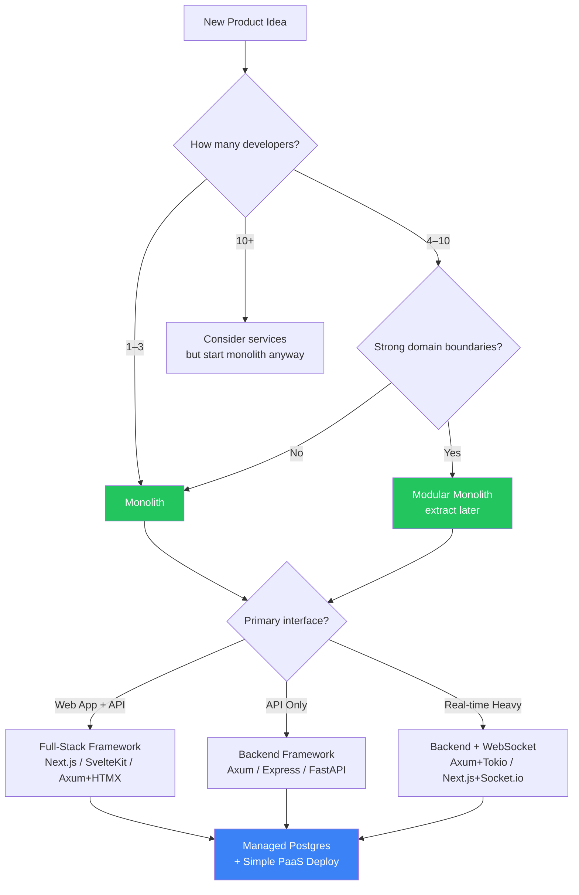

# 3. The Modern "Ship It" Stack 🟡

> **What you'll learn:**
> - Why "boring technology" is the fastest path to production and the best partner for AI code generation
> - How to choose between monolithic full-stack frameworks, microservices, and serverless — and why you should almost always start monolithic
> - The specific stack combinations that maximize AI-assisted development speed
> - Why managed Postgres is the only database you need for your first $10M in revenue

---

## The Paradox of Choice

The modern developer has access to more frameworks, databases, deployment targets, and architectural patterns than at any point in history. This is the worst thing that has ever happened to shipping speed.

Every hour spent evaluating whether you need Kafka (you don't), debating MongoDB vs. Postgres (use Postgres), or arguing about monorepo vs. polyrepo (monorepo) is an hour you're not shipping. AI tools make this worse by happily generating Kubernetes manifests, gRPC service meshes, and event-driven architectures for a product that has zero users.

**The first principle of the "Ship It" stack: Choose boring technology.**

Boring technology is well-documented (so AI generates better code for it), battle-tested (so you don't debug framework bugs at 3 AM), and broadly supported (so you can hire for it).

## The Stack Decision Matrix



## Monolith vs. Microservices vs. Serverless

Let's be aggressively honest about these trade-offs:

| Dimension | Monolith | Microservices | Serverless |
|-----------|----------|--------------|------------|
| **Time to first deploy** | Hours | Days to weeks | Hours |
| **Cognitive overhead** | Low | Extreme | Medium |
| **AI generation quality** | Excellent (single codebase, full context) | Poor (cross-service context is lost) | Good (small, isolated functions) |
| **Debugging** | Stack trace → fix | Distributed tracing required | CloudWatch log archaeology |
| **Cost at 0–1K users** | ~$5–25/month | ~$50–200/month | ~$0–5/month |
| **Cost at 100K users** | ~$50–200/month | ~$200–2000/month | ~$100–5000/month (watch out) |
| **When to choose** | Almost always for MVP | When you have 10+ devs and proven domain boundaries | Bursty, event-driven workloads |

### The Microservices Tax

```
// 💥 HALLUCINATION DEBT: The "senior architect" who insists on microservices for a 3-person team
//
// What you actually deploy:
// - 8 services, 8 Dockerfiles, 8 CI pipelines
// - A Kubernetes cluster ($200/month minimum)
// - A service mesh (Istio config: 2000+ lines of YAML)
// - Distributed tracing (Jaeger/Tempo)
// - An API gateway
// - A message queue (RabbitMQ/SQS)
// - A service discovery mechanism
//
// What you could have deployed:
// - 1 binary, 1 Dockerfile, 1 CI pipeline, 1 $7/month VPS
```

```
// ✅ FIX: Start monolith. Extract services when (a) you have proof
//    of distinct scaling needs and (b) you have the team to own them.
//    "Premature microservices are the root of all evil." — Adapted.
```

## The Recommended Stacks

### For TypeScript Teams

| Component | Choice | Why |
|-----------|--------|-----|
| Framework | **Next.js 14+** (App Router) or **SvelteKit** | Full-stack, SSR, API routes, one deployment |
| ORM | **Prisma** or **Drizzle** | Type-safe queries, AI generates schemas easily |
| Database | **PostgreSQL** (Supabase, Neon, or RDS) | The only database you need |
| Auth | **NextAuth.js v5** or **Supabase Auth** | Don't hand-roll auth |
| Hosting | **Vercel** or **Railway** | Git-push deploys, preview environments |
| Styling | **Tailwind CSS** | AI generates it fluently; consistent design system |

### For Rust Teams

| Component | Choice | Why |
|-----------|--------|-----|
| Framework | **Axum 0.8** + **Tower** | Type-safe, composable, async-first |
| Database | **SQLx** (compile-time checked queries) | Zero-cost abstractions, catches SQL errors at build time |
| Database Engine | **PostgreSQL** (Supabase, Neon, or RDS) | Same as above — Postgres is the answer |
| Auth | **axum-login** or JWT middleware | Middleware-based, composable |
| Hosting | **Fly.io** or **Railway** | Docker-based, global edge deployment |
| Frontend | **HTMX** + **Askama** templates or separate SPA | Server-rendered for speed; SPA if you need rich interactivity |

### For Python Teams

| Component | Choice | Why |
|-----------|--------|-----|
| Framework | **FastAPI** or **Django** | FastAPI for APIs; Django for full-stack with admin |
| ORM | **SQLAlchemy 2.0** or **Django ORM** | Mature, well-documented, AI-friendly |
| Database | **PostgreSQL** | Yes, still Postgres |
| Auth | **Django Auth** or **FastAPI-Users** | Don't reinvent the wheel |
| Hosting | **Railway** or **Render** | Simple container deploys |

## Why Postgres Is Always the Answer

Until you have proven — with data, not intuition — that PostgreSQL cannot handle your workload, it is the only database you need.

| "But what about…" | Answer |
|---|---|
| "We need a document store" | Postgres has `jsonb` with indexing. It *is* a document store. |
| "We need full-text search" | Postgres has `tsvector` and `GIN` indexes. Good enough until you need Elasticsearch at massive scale. |
| "We need a cache" | Use `UNLOGGED` tables or materialized views. Or add Redis later as a *cache*, not a primary store. |
| "We need time-series data" | TimescaleDB is a Postgres extension. Same connection string. |
| "We need graph queries" | Use recursive CTEs or Apache AGE extension. |
| "MongoDB is web-scale" | Postgres scales to hundreds of thousands of QPS. You don't have that problem yet. |

### The AI Advantage of Postgres

Postgres has been the most popular relational database for a decade. This means:

1. **LLMs have seen more Postgres SQL than any other dialect.** AI-generated queries are more likely to be correct.
2. **More Stack Overflow answers exist for Postgres.** When the AI hallucinates, you can debug faster.
3. **Type-safe ORMs (Prisma, Drizzle, SQLx) all have first-class Postgres support.** The AI generates typed schemas that catch errors at compile time, not runtime.

## Architecture for AI-Friendly Codebases

The way you structure your code directly impacts how well AI tools can work with it. Here's the key insight: **AI generates better code when your architecture has clear boundaries and strong types.**

### The AI-Hostile Architecture

```
src/
  app.ts              # 2000 lines: routes, business logic, DB queries, auth
  utils.ts            # 800 lines: everything that didn't fit in app.ts
  types.ts            # 50 lines: mostly `any`
```

The AI has no boundaries to work within. Every prompt requires the entire file as context. Generated code tangles with existing logic.

### The AI-Friendly Architecture

```
src/
  routes/
    users.ts          # HTTP layer only: parse request, call service, return response
    orders.ts
  services/
    user-service.ts   # Business logic only: validate, transform, orchestrate
    order-service.ts
  repositories/
    user-repo.ts      # Database layer only: queries and data mapping
    order-repo.ts
  types/
    user.d.ts         # Shared types/interfaces
    order.d.ts
    errors.d.ts
  lib/
    db.ts             # Database connection singleton
    logger.ts         # Structured logger
    auth.ts           # Auth middleware
```

Now you can tell the AI: "Implement `createOrder` in `@file:src/services/order-service.ts` using the repository in `@file:src/repositories/order-repo.ts` and the types in `@file:src/types/order.d.ts`." The AI has clear boundaries, typed interfaces, and a single responsibility per file.

<details>
<summary><strong>🏋️ Exercise: Choose Your Stack and Scaffold</strong> (click to expand)</summary>

### The Challenge

Using the DealPulse PRD from Chapter 1's exercise (or your own One-Page PRD):

1. **Choose your stack** using the decision matrix above. Justify each choice in one sentence.
2. **Scaffold the project** using your AI tool of choice. Your prompt should reference the PRD and produce:
   - The directory structure (AI-friendly architecture)
   - The initial `package.json` / `Cargo.toml` with dependencies
   - Skeleton files with typed interfaces but empty implementations
3. **Verify:** Check that all dependencies are *real* and *current*. Run the type checker to confirm the skeleton compiles.

<details>
<summary>🔑 Solution</summary>

**Stack choice for DealPulse (CRM for a 20-person startup):**

| Component | Choice | Justification |
|-----------|--------|--------------|
| Framework | Next.js 14 App Router | One codebase for UI + API; server components for fast loads |
| ORM | Prisma | AI generates Prisma schemas fluently; type-safe client |
| Database | Supabase (Postgres) | Free tier, managed, built-in auth if we need it later |
| Auth | Simple API key for v0.1 | Internal tool; no public signup needed |
| Deploy | Vercel | Auto-deploys on push; preview environments for free |
| Styling | Tailwind CSS | AI generates correct Tailwind on first try |

**Scaffold prompt for Cursor:**

```
Using @codebase context, scaffold a Next.js 14 App Router project 
for the DealPulse CRM described in @file:PRD.md.

Create this directory structure:
src/
  app/                    # Next.js App Router pages
    api/                  # API routes
      companies/route.ts
      contacts/route.ts
      touchpoints/route.ts
    page.tsx              # Dashboard: companies sorted by staleness
  lib/
    db.ts                 # Prisma client singleton
    auth.ts               # API key validation middleware
  types/
    company.d.ts
    contact.d.ts
    touchpoint.d.ts
  repositories/
    company-repo.ts
    contact-repo.ts
    touchpoint-repo.ts
prisma/
  schema.prisma           # From the PRD's user stories

For each file:
- Create the TypeScript interfaces in types/
- Create repository functions with correct signatures but `throw new Error("TODO")`
- Create API route handlers that parse requests and call repositories
- The Prisma schema should match the PRD exactly (companies, contacts, touchpoints, pipeline stages)

Do NOT implement business logic yet. Only create typed skeletons.
```

**Verification checklist:**
- [ ] `npx tsc --noEmit` passes (types are consistent)
- [ ] `npx prisma validate` passes (schema is valid)
- [ ] All packages in `package.json` exist on npm and are current
- [ ] No `any` types in the generated code
- [ ] Directory structure follows the AI-friendly pattern

</details>
</details>

> **Key Takeaways**
> - Choose boring technology. Boring = well-documented = AI generates better code for it.
> - Start monolith. Always. Extract services only when you have proof of distinct scaling needs *and* the team to own them.
> - Postgres is the only database you need until you have data proving otherwise.
> - Structure your codebase for AI: clear boundaries, typed interfaces, single responsibility per file.
> - The "Ship It" stack optimizes for one thing: time from idea to production with AI assistance.

> **See also:** [Chapter 4: Schema-First Development](ch04-schema-first-development.md) for designing the database layer, and [Chapter 6: Infrastructure as Code](ch06-infrastructure-as-code.md) for deploying this stack.
