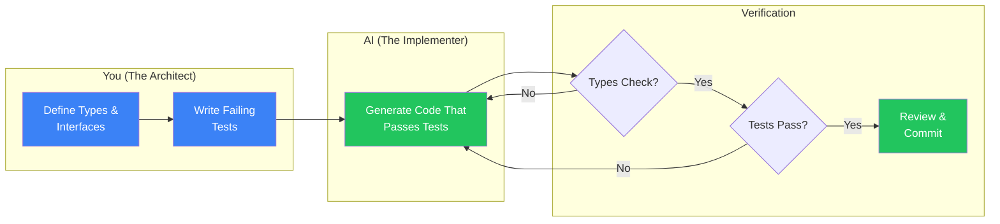
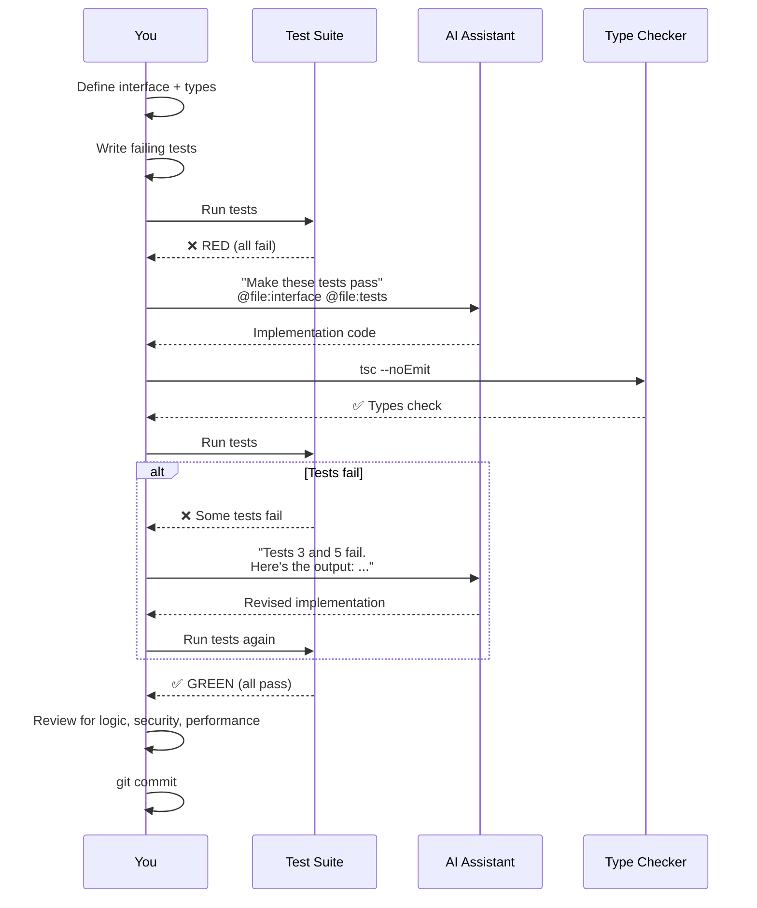

# 5. Test-Driven AI Generation 🟡

> **What you'll learn:**
> - Why AI is terrible at architecture but extraordinary at making tests pass — and how to exploit this asymmetry
> - The "Red-Green-AI" workflow: you write the failing test, the AI writes the implementation
> - How to write test specifications that constrain AI output to production-quality code
> - Patterns for testing AI-generated code that interacts with databases, external APIs, and async systems

---

## The Fundamental Asymmetry

AI coding assistants have a paradoxical skill profile:

| Task | AI Capability | Why |
|------|:---:|-----|
| Architecture decisions | 🔴 Terrible | Requires understanding of business context, team constraints, future evolution — all outside the context window |
| Writing code to an interface | 🟢 Excellent | Pure pattern matching against a well-defined target |
| Edge case identification | 🟡 Decent | Can enumerate common edge cases but misses domain-specific ones |
| Making a failing test pass | 🟢 Excellent | Clear success criteria, tight feedback loop, constrained output |
| Choosing between designs | 🔴 Terrible | Defaults to the most common pattern in training data, not the best one for *your* situation |

The insight: **don't let the AI architect. Let it implement.** You define the boundaries (types + tests). The AI fills in the body. This is Test-Driven AI Generation.



## The Red-Green-AI Workflow

Traditional TDD: Red → Green → Refactor.  
AI-native TDD: **Red → AI → Green → Human Review.**

### Step 1: You Write the Interface (The Contract)

```typescript
// src/services/rate-limiter.ts
// YOU write this. The AI touches nothing here.

export interface RateLimiter {
  /** 
   * Check if a request from this key is allowed.
   * Returns remaining requests in the window, or an error if rate limited.
   */
  check(key: string): Promise<RateLimitResult>;
  
  /** Reset the counter for a key (admin operation). */
  reset(key: string): Promise<void>;
}

export type RateLimitResult =
  | { allowed: true; remaining: number; resetAt: Date }
  | { allowed: false; retryAfter: number; resetAt: Date };

export interface RateLimiterConfig {
  /** Maximum requests per window */
  maxRequests: number;
  /** Window size in seconds */
  windowSeconds: number;
}
```

### Step 2: You Write the Failing Tests (The Specification)

```typescript
// tests/rate-limiter.test.ts
// YOU write this. Every test is a requirement.

import { describe, it, expect, beforeEach } from "vitest";
import { createRateLimiter } from "../src/services/rate-limiter-impl";
import type { RateLimiter } from "../src/services/rate-limiter";

describe("RateLimiter", () => {
  let limiter: RateLimiter;

  beforeEach(() => {
    limiter = createRateLimiter({
      maxRequests: 3,
      windowSeconds: 60,
    });
  });

  it("allows requests under the limit", async () => {
    const result = await limiter.check("user-1");
    expect(result.allowed).toBe(true);
    if (result.allowed) {
      expect(result.remaining).toBe(2); // 3 max - 1 used
    }
  });

  it("tracks requests per key independently", async () => {
    await limiter.check("user-1");
    await limiter.check("user-1");
    const result1 = await limiter.check("user-1");
    const result2 = await limiter.check("user-2");

    // user-1 used 3 of 3
    expect(result1.allowed).toBe(true);
    if (result1.allowed) expect(result1.remaining).toBe(0);
    
    // user-2 used 1 of 3
    expect(result2.allowed).toBe(true);
    if (result2.allowed) expect(result2.remaining).toBe(2);
  });

  it("blocks requests over the limit", async () => {
    await limiter.check("user-1");
    await limiter.check("user-1");
    await limiter.check("user-1");
    const result = await limiter.check("user-1");

    expect(result.allowed).toBe(false);
    if (!result.allowed) {
      expect(result.retryAfter).toBeGreaterThan(0);
      expect(result.retryAfter).toBeLessThanOrEqual(60);
    }
  });

  it("resets a specific key", async () => {
    await limiter.check("user-1");
    await limiter.check("user-1");
    await limiter.check("user-1");
    
    await limiter.reset("user-1");
    
    const result = await limiter.check("user-1");
    expect(result.allowed).toBe(true);
    if (result.allowed) expect(result.remaining).toBe(2);
  });

  it("does not reset other keys when resetting one", async () => {
    await limiter.check("user-1");
    await limiter.check("user-2");
    
    await limiter.reset("user-1");
    
    const r1 = await limiter.check("user-1");
    const r2 = await limiter.check("user-2");
    
    if (r1.allowed) expect(r1.remaining).toBe(2); // reset: 3 - 1 = 2
    if (r2.allowed) expect(r2.remaining).toBe(1); // not reset: 3 - 2 = 1
  });
});
```

### Step 3: The AI Implements (Make It Green)

Now, the prompt:

```
Given the interface in @file:src/services/rate-limiter.ts and the 
tests in @file:tests/rate-limiter.test.ts, implement the 
`createRateLimiter` function in @file:src/services/rate-limiter-impl.ts.

Requirements:
- Use an in-memory sliding window approach (no external dependencies)
- All tests must pass
- Export only the `createRateLimiter` factory function
```

### Step 4: Human Review

The AI will produce an implementation. Your review checklist:

- [ ] All tests pass (`npm test`)
- [ ] Type checker passes (`tsc --noEmit`)
- [ ] No `any` types
- [ ] No unnecessary dependencies imported
- [ ] Time complexity is reasonable (not O(n) per check where n = total historic requests)
- [ ] Memory is bounded (old entries are cleaned up)

## Anti-Patterns: What Happens Without Tests

```typescript
// 💥 HALLUCINATION DEBT: Asking AI to "implement rate limiting" without tests
//
// Common AI-generated mistakes:
// 1. Uses a simple counter that never resets (memory leak)
// 2. Uses Date.now() without considering clock drift in distributed systems
// 3. Doesn't handle concurrent access (race condition between check and increment)
// 4. Returns 429 status code directly (business logic coupled to HTTP layer)
// 5. Hard-codes the window to 60 seconds (not configurable)
// 6. Imports a rate-limiting library that may not exist
```

```typescript
// ✅ FIX: The tests above caught ALL of these:
// - Test "allows requests under limit" → forces counter tracking
// - Test "blocks over limit" → forces window to actually expire
// - Test "tracks per key" → forces isolation
// - Test "resets key" → forces cleanup capability
// - Interface `RateLimiterConfig` → forces configurability
// - Return type `RateLimitResult` → forces proper typing (not HTTP codes)
```

## Database-Dependent Tests

For code that touches the database, use test containers or transaction rollback:

### Pattern: Transaction Rollback (Fast, Isolated)

```typescript
// tests/helpers/db.ts
import { PrismaClient } from "@prisma/client";

/**
 * Runs a test callback inside a transaction that always rolls back.
 * Each test gets a clean database state without the cost of 
 * recreating the database.
 */
export async function withTestTransaction(
  fn: (prisma: PrismaClient) => Promise<void>
): Promise<void> {
  const prisma = new PrismaClient();
  
  // Prisma interactive transactions with rollback
  try {
    await prisma.$transaction(async (tx) => {
      await fn(tx as unknown as PrismaClient);
      throw new Error("ROLLBACK"); // Force rollback
    });
  } catch (e: unknown) {
    if (e instanceof Error && e.message !== "ROLLBACK") throw e;
  } finally {
    await prisma.$disconnect();
  }
}
```

### Pattern: Testcontainers (Realistic, Isolated)

```typescript
// tests/helpers/testcontainer.ts
import { PostgreSqlContainer } from "@testcontainers/postgresql";
import { PrismaClient } from "@prisma/client";
import { execSync } from "child_process";

let container: Awaited<ReturnType<PostgreSqlContainer["start"]>>;
let prisma: PrismaClient;

export async function setupTestDb() {
  container = await new PostgreSqlContainer("postgres:16").start();
  
  const url = container.getConnectionUri();
  process.env.DATABASE_URL = url;
  
  // Run migrations against the test container
  execSync("npx prisma migrate deploy", {
    env: { ...process.env, DATABASE_URL: url },
  });
  
  prisma = new PrismaClient({ datasources: { db: { url } } });
  return prisma;
}

export async function teardownTestDb() {
  await prisma.$disconnect();
  await container.stop();
}
```

## Testing External API Calls

When your code calls external APIs (e.g., OpenAI), never call them in tests. Use typed mocks:

```typescript
// src/services/ai-service.ts — THE INTERFACE (you write this)
export interface AiService {
  complete(prompt: string, maxTokens: number): Promise<AiCompletion>;
}

export interface AiCompletion {
  text: string;
  tokensUsed: number;
  model: string;
}

// tests/mocks/ai-service.mock.ts — THE MOCK (you write this)
import type { AiService, AiCompletion } from "../../src/services/ai-service";

export function createMockAiService(
  responses: Map<string, AiCompletion>
): AiService {
  return {
    async complete(prompt: string, maxTokens: number): Promise<AiCompletion> {
      const response = responses.get(prompt);
      if (!response) {
        throw new Error(
          `Unexpected prompt in test: "${prompt.slice(0, 50)}..."`
        );
      }
      return response;
    },
  };
}

// tests/chat-handler.test.ts — THE TEST (you write this)
// Then the AI implements the handler to make it pass.

import { createMockAiService } from "./mocks/ai-service.mock";
import { createChatHandler } from "../src/handlers/chat";

describe("ChatHandler", () => {
  it("returns AI completion and tracks token usage", async () => {
    const mock = createMockAiService(
      new Map([
        ["Hello", { text: "Hi there!", tokensUsed: 5, model: "gpt-4" }],
      ])
    );
    
    const handler = createChatHandler(mock);
    const result = await handler.handleMessage("user-1", "Hello");
    
    expect(result.reply).toBe("Hi there!");
    expect(result.tokensUsed).toBe(5);
  });

  it("enforces per-user token budget", async () => {
    // ... test that the handler rejects requests when budget is exhausted
  });
});
```

## The Complete Red-Green-AI Cycle



<details>
<summary><strong>🏋️ Exercise: Red-Green-AI a Repository Layer</strong> (click to expand)</summary>

### The Challenge

Using the DealPulse schema from Chapter 4:

1. **Write the interface** for a `CompanyRepository` with these operations:
   - `create(data)` → returns the new company
   - `findById(id)` → returns company or null
   - `listByStalenesss()` → returns companies sorted by days since last touchpoint
   - `updateStage(id, newStage)` → returns updated company

2. **Write 6+ failing tests** covering:
   - Happy path for each operation
   - `findById` with non-existent ID returns null (not throws)
   - `updateStage` with invalid stage is rejected by types (compile error)
   - `listByStaleness` correctly sorts (company with oldest touchpoint first)

3. **Feed the interface + tests to AI** and have it generate the implementation.

4. **Run the tests.** If any fail, feed the error output back to the AI and iterate.

<details>
<summary>🔑 Solution</summary>

**1. The Interface:**

```typescript
// src/repositories/company-repo.ts
import type { Company, Stage } from "@prisma/client";

export interface CompanyRepository {
  create(data: {
    name: string;
    website?: string;
    stage?: Stage;
  }): Promise<Company>;

  findById(id: string): Promise<Company | null>;

  listByStaleness(): Promise<CompanyWithStaleness[]>;

  updateStage(id: string, stage: Stage): Promise<Company>;
}

export interface CompanyWithStaleness extends Company {
  lastTouchpoint: Date | null;
  daysSinceContact: number | null;
}
```

**2. The Tests:**

```typescript
// tests/company-repo.test.ts
import { describe, it, expect, beforeAll, afterAll, beforeEach } from "vitest";
import { setupTestDb, teardownTestDb } from "./helpers/testcontainer";
import { createCompanyRepo } from "../src/repositories/company-repo-impl";
import type { CompanyRepository } from "../src/repositories/company-repo";
import type { PrismaClient } from "@prisma/client";

let prisma: PrismaClient;
let repo: CompanyRepository;

beforeAll(async () => {
  prisma = await setupTestDb();
  repo = createCompanyRepo(prisma);
});

afterAll(async () => {
  await teardownTestDb();
});

beforeEach(async () => {
  // Clean all tables between tests
  await prisma.touchpoint.deleteMany();
  await prisma.contact.deleteMany();
  await prisma.company.deleteMany();
});

describe("CompanyRepository", () => {
  describe("create", () => {
    it("creates a company with defaults", async () => {
      const co = await repo.create({ name: "Acme Corp" });
      expect(co.name).toBe("Acme Corp");
      expect(co.stage).toBe("lead"); // default
      expect(co.website).toBeNull();
      expect(co.id).toBeDefined();
    });

    it("creates a company with all fields", async () => {
      const co = await repo.create({
        name: "Beta Inc",
        website: "https://beta.example.com",
        stage: "qualified",
      });
      expect(co.website).toBe("https://beta.example.com");
      expect(co.stage).toBe("qualified");
    });
  });

  describe("findById", () => {
    it("returns the company when found", async () => {
      const created = await repo.create({ name: "Gamma LLC" });
      const found = await repo.findById(created.id);
      expect(found).not.toBeNull();
      expect(found!.name).toBe("Gamma LLC");
    });

    it("returns null when not found", async () => {
      const found = await repo.findById(
        "00000000-0000-0000-0000-000000000000"
      );
      expect(found).toBeNull();
    });
  });

  describe("listByStaleness", () => {
    it("lists stale companies first", async () => {
      // Create two companies with different touchpoint ages
      const old = await repo.create({ name: "Stale Corp" });
      const fresh = await repo.create({ name: "Fresh Corp" });

      const oldContact = await prisma.contact.create({
        data: { name: "Alice", email: "alice@stale.com", companyId: old.id },
      });
      await prisma.touchpoint.create({
        data: {
          contactId: oldContact.id,
          kind: "email",
          occurredAt: new Date("2024-01-01"),
        },
      });

      const freshContact = await prisma.contact.create({
        data: { name: "Bob", email: "bob@fresh.com", companyId: fresh.id },
      });
      await prisma.touchpoint.create({
        data: {
          contactId: freshContact.id,
          kind: "call",
          occurredAt: new Date(), // now
        },
      });

      const list = await repo.listByStaleness();
      expect(list[0].name).toBe("Stale Corp");
      expect(list[1].name).toBe("Fresh Corp");
    });
  });

  describe("updateStage", () => {
    it("updates the stage", async () => {
      const co = await repo.create({ name: "Delta Inc" });
      const updated = await repo.updateStage(co.id, "proposal");
      expect(updated.stage).toBe("proposal");
    });
  });
});
```

**3. AI prompt:**

```
Given @file:src/repositories/company-repo.ts (interface) and
@file:tests/company-repo.test.ts (tests), implement the
`createCompanyRepo` factory function in
@file:src/repositories/company-repo-impl.ts.

Use the PrismaClient passed to the factory for all database access.
All tests must pass.
```

**4. Expected result:** All 6 tests green. If `listByStaleness` fails (common AI mistake: wrong sort order), feed the test output back: "Test 'lists stale companies first' fails — expected 'Stale Corp' at index 0 but got 'Fresh Corp'. Fix the ORDER BY clause."

</details>
</details>

> **Key Takeaways**
> - AI is an implementer, not an architect. You define the contract (types + tests); the AI fills in the body.
> - The Red-Green-AI workflow: write interface → write failing tests → AI generates implementation → verify → commit.
> - Tests are specifications. Each test is a requirement that the AI must satisfy. More tests = more constrained (better) AI output.
> - Use transaction rollbacks or testcontainers for database tests. Use typed mocks for external APIs.
> - Never accept AI-generated code without running the type checker and the test suite. This is non-negotiable.

> **See also:** [Chapter 2: Mastering the AI-Native IDE](ch02-mastering-the-ai-native-ide.md) for the prompt patterns that feed this workflow, and [Chapter 7: CI/CD in the AI Era](ch07-cicd-in-the-ai-era.md) for running these tests automatically on every push.
