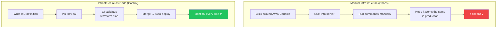

# 6. Infrastructure as Code at Light Speed 🔴

> **What you'll learn:**
> - How to stop clicking around cloud consoles and start defining infrastructure as version-controlled code
> - Using AI to generate Terraform, Pulumi, or CDK configurations from plain-English requirements
> - The real trade-offs between PaaS (Vercel/Render), Serverless (Lambda/CloudFlare Workers), and Containers (ECS/Fly.io)
> - Why IaC is the deployment equivalent of schema-first development — and how it prevents "works on my laptop" infrastructure

---

## Infrastructure Is Code or Infrastructure Is Chaos

Every environment you've manually configured through a cloud console is a snowflake. You can't reproduce it. You can't review it. You can't roll it back. And when it breaks at 3 AM, you can't remember which checkbox you clicked three months ago.

**Infrastructure as Code (IaC)** is the deployment equivalent of schema-first development. Just as your database schema is the source of truth for data, your IaC definitions are the source of truth for infrastructure. Everything else — console settings, manual tweaks, SSH-and-pray hotfixes — is drift.



## The Deployment Spectrum

Before writing any IaC, you need to choose your deployment model. Here's the honest comparison:

| Dimension | PaaS (Vercel, Render, Railway) | Serverless (Lambda, CF Workers) | Containers (ECS, Fly.io, Cloud Run) |
|-----------|------|------------|------------|
| **Time to first deploy** | Minutes | 30 min–1 hour | 1–3 hours |
| **Config complexity** | Nearly zero | Medium (IAM, triggers, layers) | Medium (Dockerfile, health checks) |
| **Cost at low traffic** | Free–$20/month | ~$0 (pay per invocation) | $5–25/month |
| **Cost at high traffic** | $50–500/month (often opaque) | Can explode ($$$) | Predictable, linear |
| **Cold start latency** | None (always warm) | 100ms–5s depending on runtime | None (always warm) |
| **Max execution time** | ~30s (serverless functions) or unlimited (VPS) | 15 min (Lambda), 30s (CF Workers) | Unlimited |
| **Customization** | Limited (their stack, their rules) | Limited runtime, full AWS access | Full control |
| **AI IaC generation quality** | N/A (no IaC needed) | Good (well-documented) | Good (Dockerfiles are simple) |
| **When to choose** | MVP, internal tools, static + API | Event-driven, bursty loads, webhooks | Long-running, CPU-heavy, full control |

### The Decision Tree

| If your product is... | Use... |
|---|---|
| A web app with <10K daily users and you want to ship in hours | **PaaS** (Vercel, Railway) |
| An API that handles webhooks, cron jobs, or bursty event processing | **Serverless** (Lambda + API Gateway) |
| A real-time app, long-running processes, or you need full control | **Containers** (Fly.io, ECS Fargate, Cloud Run) |
| All of the above at scale | **Containers** with serverless for event-driven bits |

## PaaS: The Fastest Path (And When to Graduate)

For the MVP, PaaS is almost always the right choice. Zero IaC needed — just `git push`.

### Vercel (Next.js / SvelteKit)

```bash
# That's it. That's the deployment.
npm i -g vercel
vercel
```

**What you get for free:**
- Automatic preview deployments on every PR
- Edge CDN
- Automatic HTTPS
- Environment variable management
- Serverless API routes

**When to leave Vercel:**
- Your serverless functions exceed 30-second timeout (long AI API calls)
- You need persistent WebSocket connections
- You need a background worker process
- Your bill exceeds $100/month and the pricing is opaque

### Railway / Render

```bash
# Docker-based deploy with a managed Postgres
# Just connect your GitHub repo and Railway autodeploys
```

**Ideal for:** Backend services, Rust/Go binaries, databases bundled with app.

## Serverless: AI-Generated Lambda Functions

When you need serverless, AI generates excellent Lambda/CDK code because there are thousands of examples in its training data.

### The Legacy Way: Click Around AWS Console

```
// 💥 HALLUCINATION DEBT: Manual Lambda setup
// - Created function in console
// - Attached IAM role by clicking checkboxes  
// - Configured API Gateway through 17 screens
// - Set env vars by pasting into a text box
// - Forgot to set memory/timeout and hit defaults
// - No version control, no reproducibility
```

### The AI-Native Way: CDK from a Prompt

Prompt:
```
Generate an AWS CDK (TypeScript) stack that deploys:
1. A Lambda function (Node.js 20, 256MB, 30s timeout) 
   behind API Gateway HTTP with CORS enabled
2. A PostgreSQL RDS instance (db.t4g.micro, 20GB)
3. The Lambda has read/write access to the database
4. Secrets stored in AWS Secrets Manager
5. All resources tagged with project=dealpulse, env=production
```

AI-generated CDK:

```typescript
// ✅ FIX: Version-controlled, reviewable, reproducible infrastructure
import * as cdk from "aws-cdk-lib";
import { Construct } from "constructs";
import * as lambda from "aws-cdk-lib/aws-lambda";
import * as apigw from "aws-cdk-lib/aws-apigatewayv2";
import * as rds from "aws-cdk-lib/aws-rds";
import * as secretsmanager from "aws-cdk-lib/aws-secretsmanager";
import * as ec2 from "aws-cdk-lib/aws-ec2";

export class DealPulseStack extends cdk.Stack {
  constructor(scope: Construct, id: string, props?: cdk.StackProps) {
    super(scope, id, props);

    // Tag everything
    cdk.Tags.of(this).add("project", "dealpulse");
    cdk.Tags.of(this).add("env", "production");

    // VPC for RDS
    const vpc = new ec2.Vpc(this, "Vpc", {
      maxAzs: 2,
      natGateways: 1, // Cost optimization: 1 NAT for prod
    });

    // Database credentials in Secrets Manager
    const dbSecret = new secretsmanager.Secret(this, "DbSecret", {
      generateSecretString: {
        secretStringTemplate: JSON.stringify({ username: "dealpulse" }),
        generateStringKey: "password",
        excludePunctuation: true,
      },
    });

    // PostgreSQL RDS
    const db = new rds.DatabaseInstance(this, "Database", {
      engine: rds.DatabaseInstanceEngine.postgres({
        version: rds.PostgresEngineVersion.VER_16,
      }),
      instanceType: ec2.InstanceType.of(
        ec2.InstanceClass.T4G,
        ec2.InstanceSize.MICRO
      ),
      vpc,
      allocatedStorage: 20,
      credentials: rds.Credentials.fromSecret(dbSecret),
      databaseName: "dealpulse",
      removalPolicy: cdk.RemovalPolicy.SNAPSHOT,
    });

    // Lambda function
    const fn = new lambda.Function(this, "ApiHandler", {
      runtime: lambda.Runtime.NODEJS_20_X,
      handler: "index.handler",
      code: lambda.Code.fromAsset("lambda/"),
      memorySize: 256,
      timeout: cdk.Duration.seconds(30),
      environment: {
        DB_SECRET_ARN: dbSecret.secretArn,
        DB_HOST: db.dbInstanceEndpointAddress,
        DB_NAME: "dealpulse",
      },
      vpc,
    });

    // Grant Lambda access to the database secret
    dbSecret.grantRead(fn);
    db.connections.allowDefaultPortFrom(fn);

    // API Gateway
    const api = new apigw.HttpApi(this, "HttpApi", {
      corsPreflight: {
        allowOrigins: ["*"],
        allowMethods: [apigw.CorsHttpMethod.ANY],
        allowHeaders: ["Content-Type", "Authorization"],
      },
    });

    api.addRoutes({
      path: "/{proxy+}",
      methods: [apigw.HttpMethod.ANY],
      integration: new cdk.aws_apigatewayv2_integrations
        .HttpLambdaIntegration("LambdaIntegration", fn),
    });

    // Outputs
    new cdk.CfnOutput(this, "ApiUrl", { value: api.url! });
  }
}
```

## Containers: Fly.io for Maximum Control with Minimum Pain

For Rust backends or when you need persistent processes, containers hit the sweet spot between PaaS simplicity and full control.

### Dockerfile (Production-ready, multi-stage)

```dockerfile
# Build stage
FROM rust:1.78-bookworm AS builder
WORKDIR /app
COPY Cargo.toml Cargo.lock ./
COPY src/ src/
COPY migrations/ migrations/
RUN cargo build --release

# Runtime stage — minimal image
FROM debian:bookworm-slim
RUN apt-get update && apt-get install -y ca-certificates && rm -rf /var/lib/apt/lists/*
COPY --from=builder /app/target/release/dealpulse /usr/local/bin/
COPY --from=builder /app/migrations /app/migrations
ENV DATABASE_URL=""
ENV PORT=8080
EXPOSE 8080
CMD ["dealpulse"]
```

### Fly.io Deployment

```toml
# fly.toml — version-controlled deployment config
app = "dealpulse"
primary_region = "iad"

[build]

[http_service]
  internal_port = 8080
  force_https = true
  auto_stop_machines = true      # Save money: stop when idle
  auto_start_machines = true     # Start on first request
  min_machines_running = 1       # Keep at least 1 warm

[env]
  RUST_LOG = "info"
  PORT = "8080"
```

```bash
# Deploy to Fly.io
fly launch               # First time: creates app, Postgres, secrets
fly deploy               # Subsequent: builds and deploys
fly secrets set DATABASE_URL="postgres://..."  # Set secrets
```

## AI-Generated Terraform: The Power and the Pitfalls

Terraform is the lingua franca of IaC. AI generates it well, but review is critical.

### Common AI Terraform Hallucinations

| Hallucination | Risk | Fix |
|---|---|---|
| `provider "aws" { region = "us-east-1" }` hard-coded | Can't multi-region | Use variables: `var.region` |
| Missing `lifecycle { prevent_destroy = true }` on databases | Accidental deletion | Always set on stateful resources |
| Security group with `0.0.0.0/0` ingress | Open to the internet | Restrict to VPC CIDR or specific IPs |
| No state backend configured | State stored locally | Configure S3 + DynamoDB backend |
| Using `latest` AMI or tag | Non-reproducible builds | Pin specific versions |

### Review Checklist for AI-Generated IaC

- [ ] No hard-coded secrets (use variables or secret managers)
- [ ] No `0.0.0.0/0` security group rules unless intentional (load balancers)
- [ ] Stateful resources have `prevent_destroy` or snapshot policies
- [ ] State backend is configured (S3, GCS, or Terraform Cloud)
- [ ] All resources are tagged for cost tracking
- [ ] `terraform plan` shows expected changes — read it before `apply`

<details>
<summary><strong>🏋️ Exercise: Deploy Your Stack with IaC</strong> (click to expand)</summary>

### The Challenge

Take the DealPulse application (or your own project) and deploy it to production using IaC:

1. **Choose your deployment model** from the spectrum above. Justify in one sentence.
2. **Write the IaC** (use AI to generate it, then review against the checklist above):
   - For PaaS: Create a `vercel.json` or Railway config
   - For Serverless: Generate a CDK or Terraform stack
   - For Containers: Write a Dockerfile + Fly.io config (or ECS task definition)
3. **Provision a database** with connection secrets stored securely (not in code).
4. **Deploy** and verify the health check endpoint responds.

<details>
<summary>🔑 Solution</summary>

**Decision: Fly.io (Container)** — DealPulse is an internal tool for 20 people. Fly.io gives us a managed Postgres add-on, per-second billing, and the ability to run long-lived processes if we need background jobs later.

**Step 1: Generate with AI prompt:**

```
Generate a production Fly.io deployment for a Next.js 14 app:
1. Multi-stage Dockerfile (node:20-slim, pnpm, standalone output)
2. fly.toml with auto-stop, HTTPS forced, health checks
3. Attached Postgres instance
Include the commands to set DATABASE_URL as a secret.
```

**Step 2: Dockerfile (reviewed & fixed):**

```dockerfile
FROM node:20-slim AS base
ENV PNPM_HOME="/pnpm"
ENV PATH="$PNPM_HOME:$PATH"
RUN corepack enable

FROM base AS deps
WORKDIR /app
COPY package.json pnpm-lock.yaml ./
RUN pnpm install --frozen-lockfile

FROM base AS builder
WORKDIR /app
COPY --from=deps /app/node_modules ./node_modules
COPY . .
RUN pnpm prisma generate
RUN pnpm build

FROM base AS runner
WORKDIR /app
ENV NODE_ENV=production
COPY --from=builder /app/.next/standalone ./
COPY --from=builder /app/.next/static ./.next/static
COPY --from=builder /app/public ./public
COPY --from=builder /app/prisma ./prisma
EXPOSE 3000
CMD ["node", "server.js"]
```

**Step 3: Deploy commands:**

```bash
# Create app + attached Postgres
fly launch --name dealpulse --region iad

# Create Postgres cluster (attached automatically)
fly postgres create --name dealpulse-db --region iad

# Attach (sets DATABASE_URL secret automatically)
fly postgres attach dealpulse-db

# Run migrations on deploy
fly ssh console -C "npx prisma migrate deploy"

# Verify
curl https://dealpulse.fly.dev/api/health
# Expected: {"status":"ok","db":"connected"}
```

**Step 4: Verification:**
- `fly status` shows 1 machine running
- `fly logs` shows no errors
- Health check returns `200 OK` with database connected
- `fly postgres connect -a dealpulse-db` lets you query the live database

</details>
</details>

> **Key Takeaways**
> - Infrastructure as Code is non-negotiable for production. If it's not in version control, it doesn't exist.
> - Start with PaaS for MVP speed. Graduate to containers when you need control or outgrow PaaS pricing.
> - AI generates excellent IaC — but review for security (open ports), reproducibility (pinned versions), and state management (backend config).
> - Secrets never go in code or IaC files. Use secret managers or environment variable injection.
> - `terraform plan` (or equivalent) before every `apply`. Read the diff like you read a code PR.

> **See also:** [Chapter 3: The Modern "Ship It" Stack](ch03-the-modern-ship-it-stack.md) for choosing what you're deploying, and [Chapter 7: CI/CD in the AI Era](ch07-cicd-in-the-ai-era.md) for automating this deployment on every push.
