# 8. Observability and "Day 2" Operations 🔴

> **What you'll learn:**
> - Why "it works on my machine" is irrelevant once you have users — and what to instrument from day one
> - How to set up the three pillars of observability: structured logging, metrics, and distributed tracing with OpenTelemetry
> - The exact instrumentation that tells you *why* a user's request failed before they report it
> - Alerting strategies that wake you up for real problems, not false alarms

---

## You Shipped It. Now It's Broken.

Shipping to production is not the finish line. It's the starting line. The moment your code handles its first real user request, a new category of problems emerges:

- **Latency spikes** that don't reproduce locally
- **Database connection exhaustion** under real concurrency
- **Third-party API failures** (OpenAI rate limits, payment provider timeouts)
- **Memory leaks** that only manifest after hours of uptime
- **Race conditions** that happen once per 10,000 requests

None of these show up in your test suite. None of these appear in CI. They exist only in production, under real load, with real data.

**Observability is the ability to understand what your system is doing from the outside, based solely on its outputs.** If you can't observe it, you can't debug it. If you can't debug it, you can't fix it. If you can't fix it, your users leave.

```mermaid
flowchart TD
    subgraph "Without Observability"
        A1[User reports:<br/>'It's slow'] --> A2[Developer: 'Works<br/>for me locally']
        A2 --> A3[Check server logs:<br/>nothing useful]
        A3 --> A4[SSH into prod,<br/>add printf debugging]
        A4 --> A5[Redeploy with<br/>debug logging]
        A5 --> A6[Wait for it to<br/>happen again]
        A6 --> A7[3 days to find<br/>the bug 😰]
    end

    subgraph "With Observability"
        B1[Alert fires:<br/>p99 latency > 500ms] --> B2[Open trace for<br/>slow request]
        B2 --> B3[See: OpenAI API call<br/>took 4200ms]
        B3 --> B4[Check metrics:<br/>AI API latency spiking]
        B4 --> B5[Root cause:<br/>AI provider degradation]
        B5 --> B6[10 min to diagnose,<br/>add circuit breaker 🎯]
    end

    style A7 fill:#ef4444,color:#fff
    style B6 fill:#22c55e,color:#fff
```



## The Three Pillars of Observability

| Pillar | What It Answers | Tool |
|--------|----------------|------|
| **Logs** | "What happened?" — individual events | Structured JSON logs → Loki, CloudWatch, Datadog |
| **Metrics** | "How is the system performing?" — aggregated numbers | Prometheus, Grafana, CloudWatch Metrics |
| **Traces** | "Why was this request slow/broken?" — request lifecycle | OpenTelemetry → Jaeger, Grafana Tempo, Honeycomb |

### The Old Way: Logs Only

```
// 💥 HALLUCINATION DEBT: console.log debugging in production

console.log("User logged in");                    // No structure, no context
console.log("Processing order " + orderId);       // String concatenation, no trace ID
console.log("Error: " + err);                     // Error object flattened to string
console.log("DB query took " + (Date.now() - t)); // Rolling your own metrics
```

### The AI-Native Way: Structured, Correlated Telemetry

```typescript
// ✅ FIX: Structured logging with trace correlation

import { trace, context } from "@opentelemetry/api";

const logger = createStructuredLogger("order-service");

// Log with trace context — every log is linked to the request trace
logger.info("Processing order", {
  orderId,
  userId,
  traceId: trace.getSpan(context.active())?.spanContext().traceId,
});

// Metrics are automatic via OpenTelemetry instrumentation
// Traces are automatic for HTTP, DB, and external API calls
```

## Setting Up OpenTelemetry

OpenTelemetry (OTel) is the industry standard for observability. It instruments your code once; you can send data to any backend (Grafana, Datadog, Honeycomb, Jaeger).

### Node.js / TypeScript Setup

```typescript
// src/instrumentation.ts — Load this BEFORE any other imports
import { NodeSDK } from "@opentelemetry/sdk-node";
import { getNodeAutoInstrumentations } from "@opentelemetry/auto-instrumentations-node";
import { OTLPTraceExporter } from "@opentelemetry/exporter-trace-otlp-http";
import { OTLPMetricExporter } from "@opentelemetry/exporter-metrics-otlp-http";
import { PeriodicExportingMetricReader } from "@opentelemetry/sdk-metrics";
import { Resource } from "@opentelemetry/resources";
import {
  ATTR_SERVICE_NAME,
  ATTR_SERVICE_VERSION,
  ATTR_DEPLOYMENT_ENVIRONMENT_NAME,
} from "@opentelemetry/semantic-conventions";

const sdk = new NodeSDK({
  resource: new Resource({
    [ATTR_SERVICE_NAME]: "dealpulse-api",
    [ATTR_SERVICE_VERSION]: process.env.GIT_SHA ?? "dev",
    [ATTR_DEPLOYMENT_ENVIRONMENT_NAME]: process.env.NODE_ENV ?? "development",
  }),
  traceExporter: new OTLPTraceExporter({
    url: process.env.OTEL_EXPORTER_OTLP_ENDPOINT + "/v1/traces",
  }),
  metricReader: new PeriodicExportingMetricReader({
    exporter: new OTLPMetricExporter({
      url: process.env.OTEL_EXPORTER_OTLP_ENDPOINT + "/v1/metrics",
    }),
    exportIntervalMillis: 30_000,
  }),
  instrumentations: [
    getNodeAutoInstrumentations({
      // Auto-instrument: HTTP, Express/Fastify, Prisma, pg, redis, fetch
      "@opentelemetry/instrumentation-fs": { enabled: false }, // Too noisy
    }),
  ],
});

sdk.start();
```

### Rust / Axum Setup

```rust
use opentelemetry::global;
use opentelemetry_otlp::WithExportConfig;
use opentelemetry_sdk::{trace as sdktrace, Resource};
use opentelemetry::KeyValue;
use tracing_subscriber::{layer::SubscriberExt, util::SubscriberInitExt};

pub fn init_telemetry() {
    // OTLP trace exporter
    let tracer = opentelemetry_otlp::new_pipeline()
        .tracing()
        .with_exporter(
            opentelemetry_otlp::new_exporter()
                .tonic()
                .with_endpoint(
                    std::env::var("OTEL_EXPORTER_OTLP_ENDPOINT")
                        .unwrap_or_else(|_| "http://localhost:4317".into())
                ),
        )
        .with_trace_config(
            sdktrace::Config::default().with_resource(Resource::new(vec![
                KeyValue::new("service.name", "dealpulse-api"),
                KeyValue::new("service.version", env!("CARGO_PKG_VERSION")),
            ])),
        )
        .install_batch(opentelemetry_sdk::runtime::Tokio)
        .expect("Failed to install tracer");

    // Bridge tracing crate → OpenTelemetry
    let otel_layer = tracing_opentelemetry::layer().with_tracer(tracer);

    tracing_subscriber::registry()
        .with(tracing_subscriber::EnvFilter::from_default_env())
        .with(tracing_subscriber::fmt::layer().json()) // Structured JSON logs
        .with(otel_layer)
        .init();
}
```

## What to Instrument

Not everything needs instrumentation. Focus on the **boundaries** — the places where your code talks to the outside world:

### The Instrumentation Priority List

| Priority | What | Why | How |
|:---:|------|-----|-----|
| 1 | **HTTP request/response** | Every user interaction | Auto-instrumented by OTel |
| 2 | **Database queries** | #1 source of latency | Auto-instrumented by OTel |
| 3 | **External API calls** (OpenAI, Stripe, etc.) | #1 source of failures | Auto-instrumented + custom spans |
| 4 | **Background jobs** | Silent failures, memory leaks | Custom spans with job metadata |
| 5 | **Authentication** | Security auditing | Custom logging with user context |
| 6 | **Business events** | Product analytics | Custom structured logs |

### Custom Span Example: Wrapping an AI API Call

```typescript
import { trace } from "@opentelemetry/api";

const tracer = trace.getTracer("ai-service");

async function callAiApi(prompt: string, userId: string): Promise<string> {
  return tracer.startActiveSpan("ai.completion", async (span) => {
    span.setAttribute("ai.provider", "openai");
    span.setAttribute("ai.model", "gpt-4");
    span.setAttribute("ai.prompt_tokens", prompt.length); // Approximate
    span.setAttribute("user.id", userId);

    try {
      const response = await openai.chat.completions.create({
        model: "gpt-4",
        messages: [{ role: "user", content: prompt }],
      });

      const result = response.choices[0]?.message?.content ?? "";
      
      span.setAttribute("ai.response_tokens", response.usage?.total_tokens ?? 0);
      span.setAttribute("ai.finish_reason", response.choices[0]?.finish_reason ?? "unknown");
      span.setStatus({ code: 0 }); // OK
      
      return result;
    } catch (error) {
      span.recordException(error as Error);
      span.setStatus({ code: 2, message: (error as Error).message }); // ERROR
      throw error;
    } finally {
      span.end();
    }
  });
}
```

## Structured Logging That Works

### The Structured Logger

```typescript
// src/lib/logger.ts
import pino from "pino";
import { trace, context } from "@opentelemetry/api";

export const logger = pino({
  level: process.env.LOG_LEVEL ?? "info",
  formatters: {
    log(obj) {
      // Automatically attach trace context to every log line
      const span = trace.getSpan(context.active());
      if (span) {
        const ctx = span.spanContext();
        return {
          ...obj,
          traceId: ctx.traceId,
          spanId: ctx.spanId,
        };
      }
      return obj;
    },
  },
});

// Usage:
logger.info({ orderId, userId, action: "order.created" }, "Order created");
logger.error({ err, orderId, userId }, "Failed to process order");
// NEVER: logger.info("Order " + orderId + " created by " + userId);
```

### Log Levels: What Goes Where

| Level | When to Use | Example |
|-------|------------|---------|
| `error` | Something is broken, user impact | Failed payment, database connection lost |
| `warn` | Something is degraded, not broken | API retry succeeded, rate limit approaching |
| `info` | Normal business events | User signed in, order placed, job completed |
| `debug` | Developer-only, disabled in prod | SQL query text, request payload details |

## Alerting: Wake Up for Real Problems

### The Alert Priority Matrix

| Severity | Trigger | Response Time | Example |
|----------|---------|:---:|---------|
| **P1 Critical** | Service is down | < 15 min | Health check fails, error rate > 50% |
| **P2 High** | Significant degradation | < 1 hour | p99 latency > 5s, error rate > 10% |
| **P3 Medium** | Noticeable issue | Next business day | p95 latency > 2s, disk usage > 80% |
| **P4 Low** | Worth investigating | Backlog | Unusual traffic pattern, dependency deprecated |

### Effective Alert Rules

```yaml
# Example: Grafana alerting rules (or Datadog monitors)

# P1: Service down
- alert: ServiceDown
  expr: up{service="dealpulse"} == 0
  for: 2m  # Must be down for 2 minutes (avoid flapping)
  labels:
    severity: critical
  annotations:
    summary: "DealPulse API is unreachable"

# P2: High error rate
- alert: HighErrorRate
  expr: rate(http_server_request_duration_seconds_count{status=~"5.."}[5m]) / rate(http_server_request_duration_seconds_count[5m]) > 0.1
  for: 5m
  labels:
    severity: high
  annotations:
    summary: "Error rate above 10% for 5 minutes"

# P2: Latency spike
- alert: HighLatency
  expr: histogram_quantile(0.99, rate(http_server_request_duration_seconds_bucket[5m])) > 5
  for: 5m
  labels:
    severity: high
  annotations:
    summary: "p99 latency above 5 seconds"
```

<details>
<summary><strong>🏋️ Exercise: Instrument Your Application</strong> (click to expand)</summary>

### The Challenge

Add observability to the DealPulse application (or your own project):

1. **Set up OpenTelemetry** using the configuration examples above. Use a free tier of Grafana Cloud, Honeycomb, or run Jaeger locally.
2. **Add structured logging** to at least 3 business operations (create company, add touchpoint, list stale companies).
3. **Add a custom span** for any external API call your app makes.
4. **Create one alert rule** for a P1 condition (service down or error rate > 50%).
5. **Generate a slow request** intentionally (add a `sleep(3000)` in one handler) and find it in your traces.

<details>
<summary>🔑 Solution</summary>

**1. Local Jaeger setup for testing:**

```bash
# Run Jaeger all-in-one (in-memory, good for development)
docker run -d --name jaeger \
  -p 16686:16686 \  # Jaeger UI
  -p 4317:4317 \    # OTLP gRPC
  -p 4318:4318 \    # OTLP HTTP
  jaegertracing/all-in-one:1.54
```

```bash
# Set environment variables
export OTEL_EXPORTER_OTLP_ENDPOINT="http://localhost:4318"
export OTEL_SERVICE_NAME="dealpulse-api"
```

**2. Structured logging for business ops:**

```typescript
// In your route handlers, use the structured logger:

// POST /api/companies
logger.info(
  { action: "company.created", companyId: result.id, userId },
  "Company created"
);

// POST /api/touchpoints
logger.info(
  { action: "touchpoint.logged", contactId, kind, userId },
  "Touchpoint logged"
);

// GET /api/companies?sort=staleness
logger.info(
  { action: "companies.listed", count: results.length, sortBy: "staleness" },
  "Companies listed"
);
```

**3. Custom span (example for a hypothetical email API):**

```typescript
async function sendFollowUpReminder(contact: Contact) {
  return tracer.startActiveSpan("email.send_reminder", async (span) => {
    span.setAttribute("email.to", contact.email);
    span.setAttribute("email.template", "follow_up_reminder");
    try {
      await emailApi.send(/* ... */);
      span.setStatus({ code: 0 });
    } catch (error) {
      span.recordException(error as Error);
      span.setStatus({ code: 2 });
      throw error;
    } finally {
      span.end();
    }
  });
}
```

**4. P1 alert (Grafana Cloud):**

Create a panel with this PromQL query, then set an alert threshold:
```promql
1 - (sum(rate(http_server_request_duration_seconds_count{status!~"5.."}[5m])) / sum(rate(http_server_request_duration_seconds_count[5m])))
```
Alert when value > 0.5 (50% error rate) for > 2 minutes.

**5. Find the slow request:**

```typescript
// Temporarily add to one handler:
app.get("/api/companies/:id", async (req, res) => {
  await new Promise((r) => setTimeout(r, 3000)); // Intentional delay
  // ... rest of handler
});
```

Open Jaeger UI at `http://localhost:16686`:
- Service: `dealpulse-api`
- Operation: `GET /api/companies/:id`
- Sort by duration (desc)
- Click the slow trace → see the 3-second gap in the waterfall

</details>
</details>

> **Key Takeaways**
> - Observability is not optional in production. If you can't see it, you can't fix it.
> - Instrument the boundaries: HTTP, database, external APIs. OpenTelemetry auto-instruments the first two.
> - Structured logging (JSON with trace IDs) replaces `console.log`. Every log correlates to a trace.
> - Alerts must be actionable. P1 = service down (wake up), P4 = investigate when convenient.
> - The cost of adding observability is hours. The cost of *not* having it is days of debugging blind.

> **See also:** [Chapter 7: CI/CD in the AI Era](ch07-cicd-in-the-ai-era.md) for deploying the instrumented application, and [Chapter 9: Capstone](ch09-capstone-zero-to-production.md) for the full end-to-end instrumented deployment.
