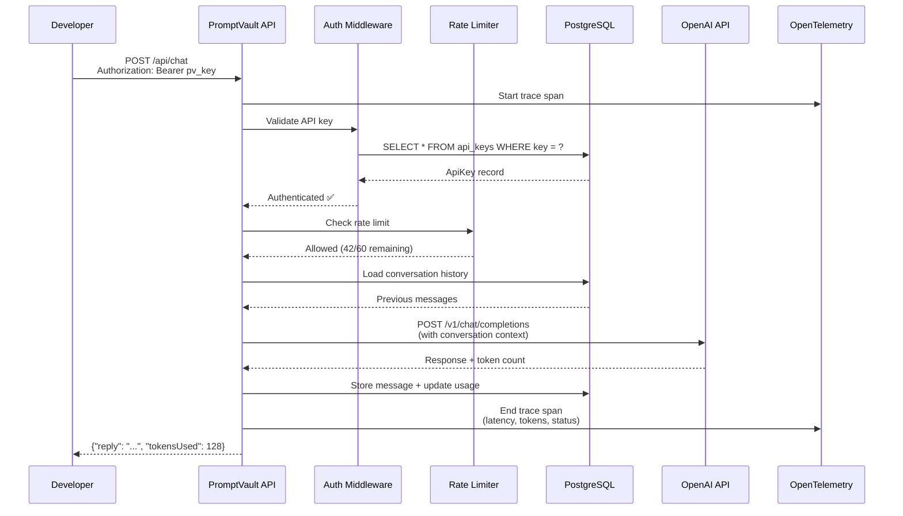

# 9. Capstone: Zero to Production in 24 Hours 🔴

> **What you'll learn:**
> - How to execute the complete AI-native workflow end-to-end: from PRD to production-deployed, instrumented application
> - Building a real AI-wrapper SaaS with rate limiting, usage tracking, and OpenTelemetry instrumentation
> - The exact prompts, commands, and verification steps at each phase
> - How to think like a startup CTO: ship fast, but ship something you can sleep through the night on

---

## The Mission

You are the sole engineer at a seed-stage startup. You have 24 hours to build and deploy **PromptVault** — a SaaS that wraps OpenAI's API with:

- **User authentication** (API key-based)
- **Conversation history** (stored in Postgres)
- **Rate limiting** (protect your OpenAI API key budget)
- **Usage tracking** (know who's burning tokens)
- **Observability** (trace every request from ingress to OpenAI and back)

This capstone weaves together every chapter in the book. Let's ship it.

```mermaid
gantt
    title PromptVault: 24-Hour Build Timeline
    dateFormat HH:mm
    axisFormat %H:%M
    
    section Phase 1: Plan
    Write PRD              :a1, 00:00, 1h
    Generate Schema        :a2, after a1, 1h
    
    section Phase 2: Build
    Scaffold Project       :b1, after a2, 1h
    Implement Auth + Rate Limit :b2, after b1, 3h
    Implement Chat Handler :b3, after b2, 3h
    
    section Phase 3: Test
    Write & Run Tests      :c1, after b3, 3h
    
    section Phase 4: Deploy
    IaC + CI/CD            :d1, after c1, 3h
    
    section Phase 5: Observe
    Instrument + Alerts    :e1, after d1, 2h
    
    section Phase 6: Ship
    Smoke Test + Launch    :f1, after e1, 1h
```



---

## Phase 1: Plan (Hours 0–2)

### Step 1.1: Write the PRD

Apply Chapter 1's One-Page PRD framework:

```markdown
# PRD: PromptVault — v0.1 MVP

## Problem
Developers want to experiment with LLM APIs, but managing API keys,
tracking costs, and keeping conversation history is tedious.
Today they paste keys into curl commands and lose context between sessions.

## Solution
PromptVault lets developers send prompts via a simple REST API with
automatic conversation history, usage tracking, and budget enforcement.

## User Stories
1. As a developer, I want to register and get an API key so I can 
   authenticate requests.
2. As a developer, I want to POST a prompt and get an LLM response,
   with the conversation context maintained across requests.
3. As a developer, I want to see my token usage and remaining budget 
   so I don't get surprise bills.
4. As the operator, I want rate limiting per API key so one user can't
   exhaust the OpenAI budget.
5. As the operator, I want traces for every request so I can debug 
   latency issues.

## Non-Goals
- NOT building: a web UI (API-only for v0.1), multi-model support,
  streaming responses, team accounts, billing/payments
- NOT supporting: self-hosted LLMs, fine-tuning, embeddings

## Success Metric
10 developers actively using the API within 1 week of launch.

## Technical Constraints
- Stack: Next.js API Routes (TypeScript) + Prisma + Postgres
- LLM: OpenAI GPT-4 via their Node.js SDK
- Deploy: Vercel (API) + Supabase (Postgres)
- Budget: $50/month OpenAI, $0 infrastructure (free tiers)
```

### Step 1.2: Generate the Schema

Feed the PRD to your AI tool:

```
Given this PRD @file:PRD.md, generate a Prisma schema with:
- UUID primary keys
- created_at/updated_at timestamps
- Appropriate indexes for the query patterns in the user stories
- A rate_limit_window table or field for tracking request counts
- Token usage tracking per user
```

**Expected schema:**

```prisma
generator client {
  provider = "prisma-client-js"
}

datasource db {
  provider = "postgresql"
  url      = env("DATABASE_URL")
}

model ApiKey {
  id             String         @id @default(uuid())
  key            String         @unique  // The actual API key (hashed)
  name           String                  // Human-readable label
  tokenBudget    Int            @default(100000) // Max tokens allowed
  tokensUsed     Int            @default(0)
  rateLimit      Int            @default(60) // Requests per minute
  conversations  Conversation[]
  requestLogs    RequestLog[]
  createdAt      DateTime       @default(now())
  updatedAt      DateTime       @updatedAt

  @@map("api_keys")
}

model Conversation {
  id          String    @id @default(uuid())
  apiKey      ApiKey    @relation(fields: [apiKeyId], references: [id], onDelete: Cascade)
  apiKeyId    String
  title       String?
  messages    Message[]
  createdAt   DateTime  @default(now())
  updatedAt   DateTime  @updatedAt

  @@index([apiKeyId])
  @@map("conversations")
}

model Message {
  id              String       @id @default(uuid())
  conversation    Conversation @relation(fields: [conversationId], references: [id], onDelete: Cascade)
  conversationId  String
  role            MessageRole
  content         String
  tokensUsed      Int          @default(0)
  createdAt       DateTime     @default(now())

  @@index([conversationId])
  @@map("messages")
}

enum MessageRole {
  system
  user
  assistant
}

model RequestLog {
  id          String   @id @default(uuid())
  apiKey      ApiKey   @relation(fields: [apiKeyId], references: [id], onDelete: Cascade)
  apiKeyId    String
  endpoint    String
  statusCode  Int
  latencyMs   Int
  tokensUsed  Int      @default(0)
  createdAt   DateTime @default(now())

  @@index([apiKeyId])
  @@index([createdAt])
  @@map("request_logs")
}
```

**Verify:** `npx prisma validate` → no errors.

---

## Phase 2: Build (Hours 2–9)

### Step 2.1: Scaffold the Project

```bash
npx create-next-app@latest promptvault --typescript --tailwind --app --src-dir
cd promptvault
pnpm add prisma @prisma/client openai pino @opentelemetry/sdk-node \
  @opentelemetry/auto-instrumentations-node @opentelemetry/exporter-trace-otlp-http
pnpm add -D vitest @types/node
```

Create the AI-friendly directory structure (Chapter 3):

```
src/
  app/
    api/
      keys/route.ts           # POST: create API key
      chat/route.ts           # POST: send prompt, get response
      usage/route.ts          # GET: token usage for a key
  lib/
    db.ts                     # Prisma singleton
    auth.ts                   # API key validation
    logger.ts                 # Structured logger
    rate-limiter.ts           # In-memory rate limiter
    openai.ts                 # OpenAI client wrapper with tracing
  types/
    api.d.ts                  # Request/response types
  services/
    chat-service.ts           # Orchestrates: auth → rate-limit → AI → store
    key-service.ts            # API key CRUD
    usage-service.ts          # Token usage queries
  repositories/
    conversation-repo.ts      # Database access
    key-repo.ts
    request-log-repo.ts
```

### Step 2.2: Implement Auth + Rate Limiting (Test-Driven)

Apply Chapter 5's Red-Green-AI workflow.

**You write the interface:**

```typescript
// src/lib/auth.ts
export interface AuthResult {
  apiKey: ApiKeyRecord;
}

export interface ApiKeyRecord {
  id: string;
  tokenBudget: number;
  tokensUsed: number;
  rateLimit: number;
}

export async function authenticateRequest(
  authHeader: string | null
): Promise<AuthResult | { error: string; status: number }> {
  // TODO: implement
  throw new Error("Not implemented");
}
```

**You write the failing tests:**

```typescript
// tests/auth.test.ts
describe("authenticateRequest", () => {
  it("rejects missing Authorization header", async () => {
    const result = await authenticateRequest(null);
    expect(result).toHaveProperty("error");
    expect((result as any).status).toBe(401);
  });

  it("rejects invalid key format", async () => {
    const result = await authenticateRequest("NotBearer xxx");
    expect(result).toHaveProperty("error");
  });

  it("rejects unknown API key", async () => {
    const result = await authenticateRequest("Bearer pv_nonexistent");
    expect(result).toHaveProperty("error");
    expect((result as any).status).toBe(401);
  });

  it("accepts valid API key and returns record", async () => {
    // Seed a key first...
    const result = await authenticateRequest("Bearer pv_valid_test_key");
    expect(result).toHaveProperty("apiKey");
  });
});
```

**AI implements. You verify:** `pnpm vitest run` → all green.

### Step 2.3: Implement the Chat Handler (Test-Driven)

**You write the interface:**

```typescript
// src/services/chat-service.ts
export interface ChatRequest {
  conversationId?: string; // Continue existing conversation, or start new
  message: string;
}

export interface ChatResponse {
  conversationId: string;
  reply: string;
  tokensUsed: number;
  remainingBudget: number;
}

export interface ChatService {
  handleMessage(
    apiKey: ApiKeyRecord,
    request: ChatRequest
  ): Promise<ChatResponse | { error: string; status: number }>;
}
```

**You write the tests:**

```typescript
describe("ChatService", () => {
  it("creates a new conversation when no conversationId provided");
  it("continues an existing conversation");
  it("rejects requests when token budget is exhausted");
  it("tracks token usage accurately");
  it("returns error when OpenAI API fails (not throws!)");
  it("includes conversation history in the OpenAI prompt");
});
```

**AI implements** using the mock pattern from Chapter 5 (mock the OpenAI client, test the orchestration).

---

## Phase 3: Test (Hours 9–12)

### Run the Full Test Suite

```bash
# Unit tests (mocked dependencies)
pnpm vitest run

# Integration tests (real database via testcontainers)
pnpm vitest run --config vitest.integration.config.ts

# Type check
pnpm tsc --noEmit

# Lint
pnpm eslint . --max-warnings 0
```

### Test the Rate Limiter Under Concurrent Load

```typescript
// tests/rate-limiter.integration.test.ts
it("enforces rate limit under concurrent requests", async () => {
  const limiter = createRateLimiter({ maxRequests: 5, windowSeconds: 60 });

  // Fire 10 concurrent requests
  const results = await Promise.all(
    Array.from({ length: 10 }, () => limiter.check("load-test-key"))
  );

  const allowed = results.filter((r) => r.allowed).length;
  const blocked = results.filter((r) => !r.allowed).length;

  expect(allowed).toBe(5);
  expect(blocked).toBe(5);
});
```

---

## Phase 4: Deploy (Hours 12–15)

### Step 4.1: Set Up the Database

```bash
# Create Supabase project (free tier)
# Copy the connection string

# Or use Neon (serverless Postgres, generous free tier):
# https://neon.tech → Create project → Copy connection string
```

### Step 4.2: Configure CI/CD

Use the GitHub Actions pipeline from Chapter 7. Key additions for PromptVault:

```yaml
# Extra gate: verify OpenAI SDK types match our wrapper
- name: Verify API client types
  run: pnpm tsc --noEmit src/lib/openai.ts
```

### Step 4.3: Deploy

```bash
# Vercel deploy
vercel --prod

# Set secrets
vercel env add DATABASE_URL production
vercel env add OPENAI_API_KEY production
vercel env add OTEL_EXPORTER_OTLP_ENDPOINT production

# Run migrations against production database
DATABASE_URL="<prod-url>" npx prisma migrate deploy
```

### Step 4.4: Verify Production Health

```bash
# Create an API key
curl -X POST https://promptvault.vercel.app/api/keys \
  -H "Content-Type: application/json" \
  -d '{"name": "test-key"}'
# → {"id": "...", "key": "pv_abc123...", "tokenBudget": 100000}

# Send a chat message
curl -X POST https://promptvault.vercel.app/api/chat \
  -H "Authorization: Bearer pv_abc123..." \
  -H "Content-Type: application/json" \
  -d '{"message": "Hello, what can you help me with?"}'
# → {"conversationId": "...", "reply": "...", "tokensUsed": 42, "remainingBudget": 99958}

# Check usage
curl https://promptvault.vercel.app/api/usage \
  -H "Authorization: Bearer pv_abc123..."
# → {"tokensUsed": 42, "tokenBudget": 100000, "requestCount": 1}
```

---

## Phase 5: Observe (Hours 15–17)

### Step 5.1: Add OpenTelemetry

Use the setup from Chapter 8. For Vercel, use their OTEL integration or send to Grafana Cloud:

```bash
# Grafana Cloud free tier: 50GB traces, 10K metrics series
vercel env add OTEL_EXPORTER_OTLP_ENDPOINT production
# → https://otlp-gateway-prod-us-central-0.grafana.net/otlp
vercel env add OTEL_EXPORTER_OTLP_HEADERS production
# → Authorization=Basic <base64(instanceId:apiKey)>
```

### Step 5.2: Custom Spans for OpenAI Calls

```typescript
// src/lib/openai.ts
import { trace } from "@opentelemetry/api";
import OpenAI from "openai";

const tracer = trace.getTracer("promptvault.openai");
const client = new OpenAI();

export async function createCompletion(
  messages: OpenAI.Chat.ChatCompletionMessageParam[],
  userId: string
) {
  return tracer.startActiveSpan("openai.chat.completion", async (span) => {
    span.setAttribute("ai.provider", "openai");
    span.setAttribute("ai.model", "gpt-4");
    span.setAttribute("ai.message_count", messages.length);
    span.setAttribute("user.id", userId);

    const start = Date.now();

    try {
      const response = await client.chat.completions.create({
        model: "gpt-4",
        messages,
        max_tokens: 1024,
      });

      const latency = Date.now() - start;
      const tokens = response.usage?.total_tokens ?? 0;

      span.setAttribute("ai.latency_ms", latency);
      span.setAttribute("ai.tokens_total", tokens);
      span.setAttribute("ai.finish_reason",
        response.choices[0]?.finish_reason ?? "unknown");
      span.setStatus({ code: 0 });

      return response;
    } catch (error) {
      span.recordException(error as Error);
      span.setStatus({ code: 2, message: (error as Error).message });
      throw error;
    } finally {
      span.end();
    }
  });
}
```

### Step 5.3: Set Up Alerts

| Alert | Condition | Severity |
|-------|-----------|----------|
| API Down | Health check fails for > 2 min | P1 |
| High Error Rate | 5xx rate > 10% for 5 min | P2 |
| OpenAI Latency | p99 > 10s for 5 min | P2 |
| Budget Exhaustion | Any key at > 90% budget | P3 |

---

## Phase 6: Ship (Hours 17–18)

### The Pre-Launch Checklist

- [ ] All CI checks passing (lint, types, tests, build)
- [ ] Production database migrated and verified
- [ ] API key creation endpoint works
- [ ] Chat endpoint returns valid responses
- [ ] Rate limiting blocks excessive requests
- [ ] Budget enforcement rejects over-budget keys
- [ ] OpenTelemetry traces visible in Grafana/Jaeger
- [ ] P1 alert configured and tested
- [ ] No secrets in code or config files
- [ ] CORS configured (if needed for web clients)
- [ ] README with API documentation committed

### You're Live 🚀

```
$ curl https://promptvault.vercel.app/api/health
{"status":"ok","db":"connected","version":"0.1.0"}
```



---

<details>
<summary><strong>🏋️ Exercise: Ship Your Own PromptVault</strong> (click to expand)</summary>

### The Challenge

Execute the complete build timeline above. You have 24 hours (or a weekend — we won't judge). The key deliverables:

1. **A deployed API** at a public URL that accepts chat requests
2. **Rate limiting** that blocks requests exceeding the configured limit
3. **At least 10 passing tests** covering auth, rate limiting, and chat
4. **OpenTelemetry traces** visible for at least one request flow
5. **A README** documenting how to use the API with curl examples

### Stretch Goals (if you finish early)

- Add streaming responses (`text/event-stream`)
- Add a simple web UI using Next.js App Router pages
- Add Stripe Checkout for paid API keys
- Add a `/api/models` endpoint that lists available models

<details>
<summary>🔑 Solution</summary>

The solution is this entire chapter. Each phase maps to specific chapters:

| Phase | Chapters Used | Key Technique |
|-------|--------------|---------------|
| Plan | Ch 1 (PRD), Ch 4 (Schema) | One-Page PRD → AI-generated Prisma schema |
| Build | Ch 2 (IDE), Ch 3 (Stack), Ch 5 (TDD) | AI-friendly architecture, Red-Green-AI loop |
| Test | Ch 5 (TDD) | Interface-first, mocked external APIs |
| Deploy | Ch 6 (IaC), Ch 7 (CI/CD) | Vercel + Supabase + GitHub Actions |
| Observe | Ch 8 (Observability) | OpenTelemetry + custom spans + alerts |
| Ship | All | Pre-launch checklist |

**The critical success factor:** At no point did we give the AI an unbounded prompt. Every AI interaction was constrained by:

1. A PRD that bounded scope
2. A schema that defined data shapes
3. Types that defined function signatures
4. Tests that defined expected behavior

The AI was always the **implementer**, never the **architect**. That's the core lesson of this entire book.

**Total AI-generated code:** ~70% of the implementation.  
**Total human-authored code:** ~30% (interfaces, tests, configuration, prompts).  
**Human time saved:** Estimated 60–70% compared to writing everything by hand.  
**Bugs introduced by AI:** ~5, all caught by the type checker or test suite before merge.

</details>
</details>

> **Key Takeaways**
> - The AI-native product engineer's superpower is not *writing code* — it's *constraining the problem* so the AI writes the right code.
> - The pipeline is always the same: PRD → Schema → Types → Tests → AI Implementation → CI/CD → Deploy → Observe.
> - 24 hours is enough to go from zero to production for an MVP. The constraint is scope discipline, not coding speed.
> - AI generates ~70% of the code, but humans must author 100% of the architecture, interfaces, tests, and prompts.
> - Ship early. Observe everything. Fix fast. The best code is code that's running in production, instrumented, and making money.

> **See also:** [Appendix A: Summary & Reference Card](ch10-appendix-reference-card.md) for quick-reference cheat sheets you'll use daily.
