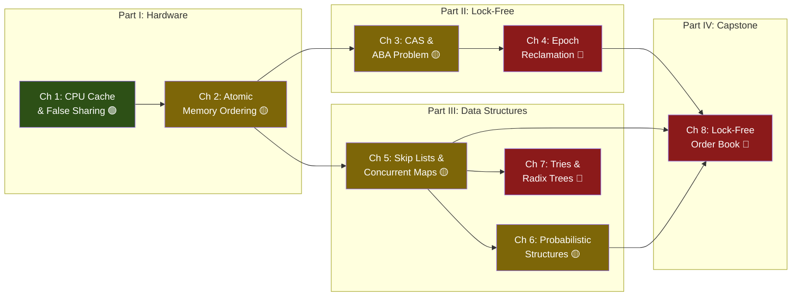

# Hardcore Algorithms & Concurrency: Lock-Free Architecture and Hardware Sympathy

> *"In the face of ambiguity, measure. In the face of contention, eliminate the lock."*

---

## About This Guide

Welcome. This is a principal-level training guide written from the trenches of ultra-low-latency systems engineering. It is not an introduction to threading. It is not a tour of `std::sync`. It is a systematic, first-principles descent into the hardware and algorithmic foundations that separate a 50-microsecond trading system from one that takes 5 milliseconds — a 100× gap that, in the world of high-frequency trading, is the difference between profit and bankruptcy.

Every chapter in this book starts at the hardware: cache lines, store buffers, memory buses, CPU pipelines. We build upward from there — through atomic instructions, memory orderings, lock-free algorithms, and probabilistic data structures — culminating in a complete lock-free order book matching engine, the kind of system that sits at the heart of every modern exchange.

---

## Speaker Intro

This material is written from the perspective of a **Principal Systems Architect** with deep experience building latency-critical infrastructure:

- **Ultra-Low-Latency Execution Engines** — wire-to-wire latencies measured in single-digit microseconds, processing millions of order events per second with zero garbage collection pauses.
- **Lock-Free Order Book Matching Engines** — using SPSC ring buffers for market data ingestion, wait-free atomic counters for statistics, and epoch-based memory reclamation for safe concurrent reads during price-level updates.
- **Kernel-Bypass Networking and DPDK** — where even a single `syscall` is too slow, and the entire network stack runs in userspace with busy-polling.
- **Production Incidents Debugged at the Assembly Level** — including false-sharing bugs that added 40µs of latency per message, memory ordering bugs that only manifested on ARM but never on x86, and ABA problems that corrupted order books once every 72 hours under peak load.

The lessons in this book are hard-won. Every anti-pattern shown here has caused a real production outage.

---

## Who This Is For

This guide is designed for:

- **Senior engineers preparing for algorithmic systems interviews** at firms like Citadel, Jane Street, Two Sigma, DE Shaw, or FAANG infrastructure teams (Google SRE, Meta's Thrift/FBOSS, AWS Firecracker).
- **Rust developers who have outgrown `Mutex`** and need to understand *why* their concurrent hash map is 10× slower than expected (hint: false sharing on the bucket array).
- **C++ engineers migrating to Rust** who need to map their knowledge of `std::atomic`, `std::memory_order`, and lock-free queues to Rust's ownership-aware atomic model.
- **Systems programmers building real-time pipelines** — market data handlers, telemetry ingestors, game servers, audio engines — where tail latency matters more than throughput.

### What This Guide Is NOT

- It is not a Rust introduction. You must already understand ownership, borrowing, lifetimes, and traits.
- It is not a survey of crates. We use `crossbeam` and `parking_lot` where appropriate, but the focus is on *understanding the algorithms*, not memorizing APIs.
- It is not academic. Every data structure and algorithm is evaluated by its real-world latency profile, not just its big-O complexity.

---

## Prerequisites

| Concept | Required Level | Where to Learn |
|---|---|---|
| Rust ownership & borrowing | Fluent | [Rust Memory Management](../memory-management-book/src/SUMMARY.md) |
| `Arc`, `Mutex`, `RwLock` | Working knowledge | [Concurrency in Rust](../concurrency-book/src/SUMMARY.md) |
| Big-O notation | Strong (amortized, expected, worst-case) | Any algorithms textbook (CLRS, Skiena) |
| Multithreading concepts | Intermediate | [Concurrency in Rust](../concurrency-book/src/SUMMARY.md) |
| Binary/hex, bitwise ops | Comfortable | — |
| Basic computer architecture | Helpful | Patterson & Hennessy, *Computer Organization and Design* |

---

## How to Use This Book

| Indicator | Meaning |
|---|---|
| 🟢 **Advanced Core** | Foundational for this guide — hardware and atomics first principles |
| 🟡 **Expert Applied** | Production algorithms, lock-free structures, probabilistic data structures |
| 🔴 **Hardware/Kernel-Level** | Epoch reclamation, radix trees, full system design capstone |

### Pacing Guide

| Chapters | Topic | Estimated Time | Checkpoint |
|---|---|---|---|
| Ch 1–2 | Hardware Sympathy & Atomics | 6–8 hours | Can explain MESI protocol and write correct `Acquire`/`Release` pairs |
| Ch 3–4 | Lock-Free Programming | 8–10 hours | Can implement a lock-free stack and explain epoch-based reclamation |
| Ch 5–7 | High-Performance Data Structures | 10–14 hours | Can choose between Skip List, Bloom Filter, and Radix Tree for a given workload |
| Ch 8 | HFT Capstone | 8–12 hours | Can design and implement a complete lock-free order book matching engine |

**Fast Track (Senior Interview Prep):** Chapters 1, 2, 3, 5, 8 — covers the core material most likely to appear in systems design interviews.

**Full Track (Mastery):** All chapters sequentially. Budget 2–3 weeks of focused study.

---

## Table of Contents

### Part I: Hardware Sympathy and Atomics

| Chapter | Description |
|---|---|
| **1. The CPU Cache and False Sharing** 🟢 | L1/L2/L3 caches, 64-byte cache lines, MESI protocol, false sharing detection and prevention with `#[repr(align(64))]` |
| **2. Atomic Memory Ordering** 🟡 | `Relaxed`, `Acquire`, `Release`, `AcqRel`, `SeqCst` — compiler fences, CPU store buffers, and the happens-before relation |

### Part II: Lock-Free Programming

| Chapter | Description |
|---|---|
| **3. Compare-And-Swap and the ABA Problem** 🟡 | CAS loops, `AtomicPtr`, the Treiber stack, ABA detection with tagged pointers and double-width CAS |
| **4. Epoch-Based Memory Reclamation** 🔴 | Why `Arc` is too slow for hot paths, hazard pointers, epoch-based reclamation (crossbeam-epoch), safe memory deallocation in lock-free structures |

### Part III: High-Performance Data Structures

| Chapter | Description |
|---|---|
| **5. Skip Lists and Concurrent Maps** 🟡 | Probabilistic balancing, O(log n) expected operations, why skip lists beat balanced trees for concurrent writes, concurrent skip list insertion |
| **6. Probabilistic Structures** 🟡 | Bloom Filters, Count-Min Sketch, HyperLogLog — trading accuracy for orders-of-magnitude space savings |
| **7. Tries, Radix Trees, and Prefix Routing** 🔴 | Compressed tries, Patricia trees, IP longest-prefix-match routing, cache-optimized memory layout |

### Part IV: The HFT Capstone

| Chapter | Description |
|---|---|
| **8. Capstone: Design a Lock-Free Order Book** 🔴 | Full staff-level system design — Limit Order Book with Hash Map + Skip List, Price-Time priority matching, SPSC ring buffer with `Acquire`/`Release` semantics |

### Appendices

| Section | Description |
|---|---|
| **Appendix A: Summary & Reference Card** | Atomic ordering cheat sheet, big-O of advanced structures, latency numbers every programmer should know |

---

## The Central Promise

By the end of this guide, you will be able to:

1. **Explain** why two threads incrementing independent counters can be 10× slower than a single thread — and fix it in under 60 seconds.
2. **Implement** a lock-free stack, a concurrent skip list, and an SPSC ring buffer from scratch, with correct memory ordering.
3. **Design** a complete lock-free order book matching engine that could process millions of orders per second.
4. **Debug** production concurrency issues at the assembly and cache-line level.
5. **Ace** the systems design portion of interviews at any quantitative trading firm or FAANG infrastructure team.

---

## Companion Guides

This guide builds on and cross-references other books in the curriculum:

| Guide | Relationship |
|---|---|
| [Concurrency in Rust](../concurrency-book/src/SUMMARY.md) | Prerequisite — covers `Mutex`, `RwLock`, channels, `Send`/`Sync` |
| [Rust Memory Management](../memory-management-book/src/SUMMARY.md) | Prerequisite — ownership, borrowing, `Arc`, `Rc` |
| [Rust at the Limit: Compiler Optimizations](../compiler-optimizations-book/src/SUMMARY.md) | Parallel — LLVM codegen, SIMD, assembly analysis |
| [Zero-Copy Architecture](../zero-copy-book/src/SUMMARY.md) | Parallel — io_uring, thread-per-core, rkyv |
| [Unsafe Rust & FFI](../unsafe-ffi-book/src/SUMMARY.md) | Reference — raw pointers, `unsafe` blocks, Miri |

Throughout this guide, you will see callouts like:

> **↔ Concurrency Guide:** points to foundational coverage of `Mutex` and channels before we go lock-free.

> **↔ Memory Guide:** points to deeper coverage of ownership semantics that underpin safe atomic programming.

---

---

> **Let's begin.** Chapter 1 starts where all performance work must start: at the hardware.
