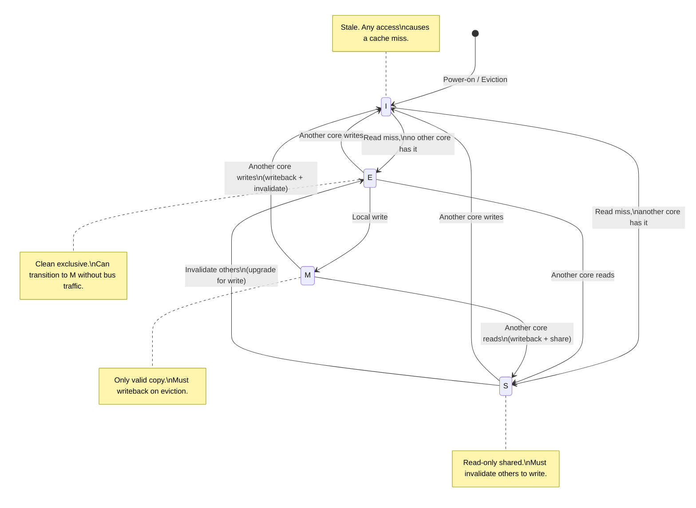
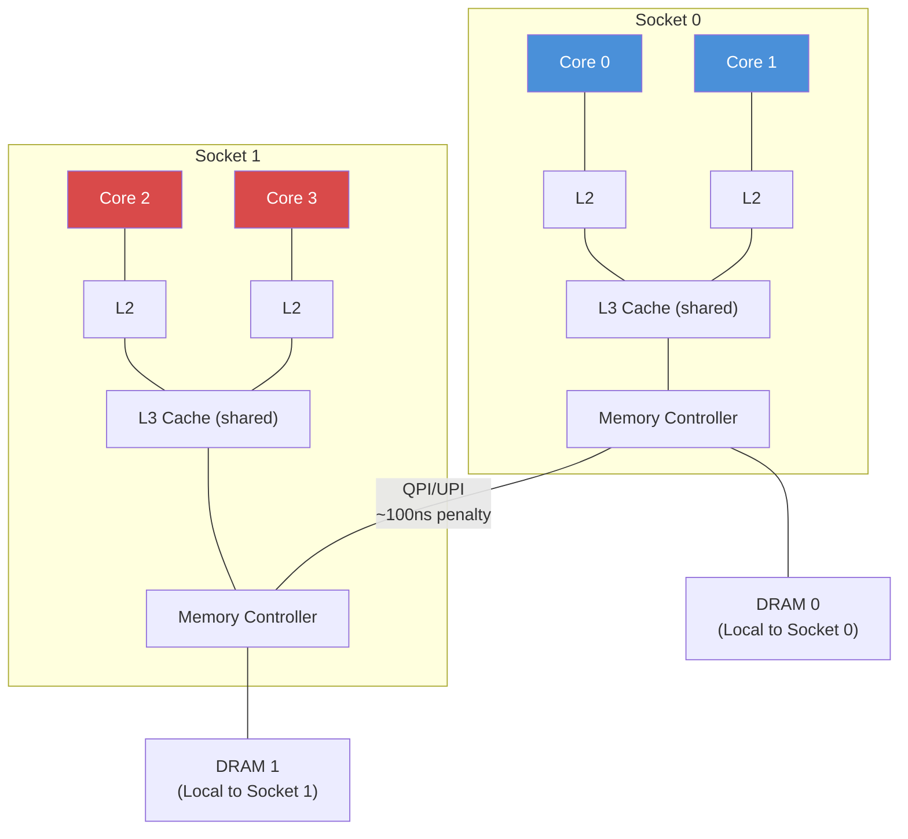

# Chapter 1: The CPU Cache and False Sharing 🟢

> **What you'll learn:**
> - How modern CPUs organize memory into L1/L2/L3 cache hierarchies and why cache misses dominate latency
> - The 64-byte cache line as the fundamental unit of memory transfer and coherence
> - The MESI protocol: how multiple CPU cores maintain a consistent view of memory
> - False sharing — the silent performance killer — and how to eliminate it with `#[repr(align(64))]`

---

## 1.1 The Memory Hierarchy: Why RAM Is a Lie

Every programmer learns that memory access is O(1). This is a useful abstraction and a dangerous lie. In reality, the time to access a piece of data depends on *where* it physically resides:

| Level | Typical Size | Latency (cycles) | Latency (ns) | Bandwidth |
|---|---|---|---|---|
| **L1 Cache** | 32–64 KB per core | 4–5 cycles | ~1 ns | ~1 TB/s |
| **L2 Cache** | 256 KB–1 MB per core | 12–15 cycles | ~4 ns | ~500 GB/s |
| **L3 Cache** | 8–64 MB shared | 30–50 cycles | ~12 ns | ~200 GB/s |
| **Main Memory (DRAM)** | 16–512 GB | 150–300 cycles | ~60–100 ns | ~50 GB/s |
| **NVMe SSD** | TB | — | ~10,000 ns | ~7 GB/s |

The implication is staggering: an L1 cache hit is **60–100× faster** than a main memory access. A function that fits entirely in L1 cache will obliterate one that constantly thrashes L3 — even if the L3 version has a theoretically better big-O complexity.

> **HFT Reality:** In production trading systems, we profile at the cache-miss level. A single unexpected L3 miss on a hot path can add 50ns of latency — which, at 10 million messages per second, means 500ms of cumulative delay per second. This is why we obsess over memory layout.

### The Cache Line: The Atom of Memory

CPUs never read or write individual bytes from DRAM. They transfer data in fixed-size blocks called **cache lines**. On all modern x86-64 and ARM processors, a cache line is **64 bytes**.

```
┌─────────────────────────────── 64 bytes ───────────────────────────────┐
│ byte[0] │ byte[1] │ byte[2] │ ... │ byte[62] │ byte[63] │
└────────────────────────────────────────────────────────────────────────┘
```

When you read a single `u64` (8 bytes) from memory, the CPU actually fetches the entire 64-byte cache line containing that `u64`. This has two profound consequences:

1. **Spatial locality is free.** If you access `array[0]`, then `array[1]` through `array[7]` (for `u64`) are already in cache.
2. **Cache coherence operates at the cache-line granularity.** If two cores touch *any* bytes in the same 64-byte line, they must coordinate, even if they're accessing completely different variables.

Consequence (2) is the root cause of false sharing.

---

## 1.2 The MESI Protocol: Cache Coherence Between Cores

When multiple CPU cores each have their own L1/L2 caches, a fundamental problem arises: what happens when Core 0 writes to a memory location that Core 1 has cached? The **MESI protocol** (and its extensions like MESIF on Intel, MOESI on AMD) solves this.

Each cache line in every core's cache is in exactly one of four states:

| State | Meaning | Other cores have a copy? | Cache line is dirty? |
|---|---|---|---|
| **M** (Modified) | This core has written to the line. It holds the only valid copy. | No | Yes |
| **E** (Exclusive) | This core has the only copy, but hasn't written to it yet. | No | No |
| **S** (Shared) | Multiple cores have a read-only copy. | Yes | No |
| **I** (Invalid) | This cache line is stale or unused. | — | — |



### The Cost of State Transitions

The critical insight is that **MESI state transitions are not free**. When Core 0 writes to a cache line that Core 1 holds in Shared state:

1. Core 0 sends an **invalidation message** on the cache coherence interconnect.
2. Core 1 receives the invalidation and marks its copy as **Invalid**.
3. Core 1 sends an **acknowledgment** back to Core 0.
4. Core 0 transitions its copy from Shared to **Modified** and performs the write.

This round-trip takes **~40–80 cycles** (roughly 20–40 ns) depending on the CPU topology. If the cores are on different NUMA nodes, it can be **100+ ns**.

> **Key principle:** Every write to a shared cache line forces a cross-core round-trip. The goal of high-performance concurrent programming is to minimize these invalidation round-trips.

---

## 1.3 False Sharing: The Silent Performance Killer

False sharing occurs when two threads modify **independent variables** that happen to reside on the **same 64-byte cache line**. Even though there is no logical data sharing, the hardware treats it as a write conflict and forces expensive cache-line invalidations.

### The Problem: A Struct That Looks Innocent

```rust
use std::sync::atomic::{AtomicU64, Ordering};

// 💥 CONTENTION HAZARD: These two atomics are only 8 bytes apart.
// They WILL share a cache line. Every write to `count_a` invalidates
// `count_b` in the other core's cache, and vice versa.
struct SharedCounters {
    count_a: AtomicU64,  // offset 0..8
    count_b: AtomicU64,  // offset 8..16
    // ... 48 bytes of padding until next cache line boundary
}
```

When Thread A increments `count_a` on Core 0, and Thread B increments `count_b` on Core 1:

```
┌───────────────────── Cache Line (64 bytes) ─────────────────────┐
│  count_a (8B)  │  count_b (8B)  │  unused padding (48B)        │
└─────────────────────────────────────────────────────────────────┘
       ↑                   ↑
    Core 0 writes       Core 1 writes
    (invalidates         (invalidates
     entire line)         entire line)

Timeline:
  Core 0: Write count_a → line goes to M on Core 0, I on Core 1
  Core 1: Write count_b → must fetch from Core 0, line goes to M on Core 1, I on Core 0
  Core 0: Write count_a → must fetch from Core 1, line goes to M on Core 0, I on Core 1
  ... (continuous ping-pong, ~40-80ns per write instead of ~1ns)
```

### The Benchmark: Proving False Sharing

```rust
use std::sync::atomic::{AtomicU64, Ordering};
use std::sync::Arc;
use std::thread;
use std::time::Instant;

// 💥 FALSE SHARING: Both atomics on the same cache line
struct BadCounters {
    count_a: AtomicU64,
    count_b: AtomicU64,
}

// ✅ FIX: Padding with #[repr(align(64))] ensures each counter
// occupies its own cache line — no cross-core invalidation
#[repr(align(64))]
struct PaddedCounter {
    value: AtomicU64,
}

struct GoodCounters {
    count_a: PaddedCounter,  // cache line 0
    count_b: PaddedCounter,  // cache line 1 (64 bytes later)
}

fn bench_false_sharing() {
    let bad = Arc::new(BadCounters {
        count_a: AtomicU64::new(0),
        count_b: AtomicU64::new(0),
    });

    let iterations = 100_000_000u64;
    let start = Instant::now();

    let bad_clone = Arc::clone(&bad);
    let t1 = thread::spawn(move || {
        for _ in 0..iterations {
            bad_clone.count_a.fetch_add(1, Ordering::Relaxed);
        }
    });

    let bad_clone = Arc::clone(&bad);
    let t2 = thread::spawn(move || {
        for _ in 0..iterations {
            bad_clone.count_b.fetch_add(1, Ordering::Relaxed);
        }
    });

    t1.join().unwrap();
    t2.join().unwrap();
    let bad_time = start.elapsed();

    // --- Good version ---
    let good = Arc::new(GoodCounters {
        count_a: PaddedCounter { value: AtomicU64::new(0) },
        count_b: PaddedCounter { value: AtomicU64::new(0) },
    });

    let start = Instant::now();

    let good_clone = Arc::clone(&good);
    let t1 = thread::spawn(move || {
        for _ in 0..iterations {
            good_clone.count_a.value.fetch_add(1, Ordering::Relaxed);
        }
    });

    let good_clone = Arc::clone(&good);
    let t2 = thread::spawn(move || {
        for _ in 0..iterations {
            good_clone.count_b.value.fetch_add(1, Ordering::Relaxed);
        }
    });

    t1.join().unwrap();
    t2.join().unwrap();
    let good_time = start.elapsed();

    println!("False sharing (bad):  {:?}", bad_time);
    println!("Padded (good):        {:?}", good_time);
    println!("Speedup:              {:.1}x", bad_time.as_nanos() as f64 / good_time.as_nanos() as f64);
}
```

Typical results on a modern multi-core CPU:

| Version | Time (100M iterations × 2 threads) | Per-op latency |
|---|---|---|
| **False sharing** | ~3.2 seconds | ~32 ns/op |
| **Padded (no false sharing)** | ~0.4 seconds | ~4 ns/op |
| **Speedup** | **~8×** | — |

The padded version is 5–10× faster despite doing the exact same logical work. The *only* difference is memory layout.

---

## 1.4 Detecting False Sharing in Production

### Using `perf` on Linux

```bash
# Record L1 data cache misses caused by other cores (cross-core invalidations)
perf stat -e cache-misses,cache-references,L1-dcache-load-misses ./my_binary

# For detailed per-cache-line analysis:
perf c2c record ./my_binary
perf c2c report --stdio
```

The `perf c2c` (cache-to-cache) tool directly identifies cache lines that are experiencing heavy cross-core contention. It will show you the exact memory addresses and the source code lines causing the sharing.

### Using Instruments on macOS

On Apple Silicon, use the **Counters** instrument in Xcode's Instruments app with the `MEMORY_BOUND` counter group to identify cache coherence overhead.

### Checking Layout at Compile Time

```rust
use std::mem;

#[repr(align(64))]
struct PaddedCounter {
    value: AtomicU64,
}

fn verify_layout() {
    // Ensure our padding is correct
    assert_eq!(mem::size_of::<PaddedCounter>(), 64);
    assert_eq!(mem::align_of::<PaddedCounter>(), 64);

    // Verify two counters cannot share a cache line
    struct TwoCounters {
        a: PaddedCounter,
        b: PaddedCounter,
    }
    assert_eq!(mem::size_of::<TwoCounters>(), 128); // 2 cache lines
}
```

---

## 1.5 Advanced Patterns: Cache-Friendly Concurrent Design

### Pattern 1: Per-Thread Counters with Final Merge

When you need a shared counter updated by many threads, the fastest approach is often *not* to share it at all:

```rust
use std::sync::atomic::{AtomicU64, Ordering};
use std::cell::UnsafeCell;

/// Each thread gets its own cache-line-aligned counter.
/// Final value is obtained by summing all per-thread counters.
/// This is the pattern used by Linux kernel's percpu counters.
#[repr(align(64))]
struct PerThreadCounter {
    value: UnsafeCell<u64>,  // No atomic needed — single-writer!
}

// SAFETY: Each thread only accesses its own slot
unsafe impl Sync for PerThreadCounter {}

struct DistributedCounter {
    slots: Vec<PerThreadCounter>,
}

impl DistributedCounter {
    fn new(num_threads: usize) -> Self {
        let mut slots = Vec::with_capacity(num_threads);
        for _ in 0..num_threads {
            slots.push(PerThreadCounter { value: UnsafeCell::new(0) });
        }
        DistributedCounter { slots }
    }

    /// Increment the counter for a specific thread. O(1), no atomics.
    ///
    /// # Safety
    /// `thread_id` must be unique per calling thread and < num_threads.
    unsafe fn increment(&self, thread_id: usize) {
        let slot = &self.slots[thread_id];
        let ptr = slot.value.get();
        *ptr += 1;
    }

    /// Read the total. O(num_threads). Only call when no writers are active,
    /// or accept a slightly stale approximate count.
    fn total(&self) -> u64 {
        self.slots.iter().map(|s| unsafe { *s.value.get() }).sum()
    }
}
```

| Pattern | Per-Increment Cost | Read Cost | Use Case |
|---|---|---|---|
| Single `AtomicU64` | ~5 ns (uncontended) to ~50 ns (contended) | ~1 ns | Few writers, frequent reads |
| `AtomicU64` with padding | ~5 ns | ~1 ns | Few independent counters |
| Per-thread counter | ~1 ns (plain store) | O(threads) | Many writers, infrequent reads |

### Pattern 2: Struct Field Ordering for Cache Locality

When designing structs accessed by multiple threads, group fields by access pattern:

```rust
// 💥 BAD: Hot and cold fields interleaved
struct OrderEntry {
    id: u64,              // Hot: accessed on every match
    customer_name: String, // Cold: only accessed for reporting
    price: f64,           // Hot: accessed on every match
    metadata: Vec<u8>,    // Cold: only accessed for logging
    quantity: u32,        // Hot: accessed on every match
    timestamp: u64,       // Hot: accessed for time-priority
}

// ✅ GOOD: Hot fields packed together on the same cache line(s)
#[repr(C)]  // Prevent the compiler from reordering fields
struct OrderEntryOptimized {
    // --- Cache line 0: HOT path (accessed every match cycle) ---
    id: u64,          // 8 bytes
    price: f64,       // 8 bytes
    quantity: u32,    // 4 bytes
    timestamp: u64,   // 8 bytes
    _pad: u32,        // 4 bytes alignment padding
    // Total: 32 bytes — fits in half a cache line

    // --- Cache line 1+: COLD path (accessed only for reporting) ---
    customer_name: String,  // 24 bytes (ptr + len + cap)
    metadata: Vec<u8>,      // 24 bytes (ptr + len + cap)
}
```

---

## 1.6 NUMA Topology and Cross-Socket Costs

On multi-socket servers (common in HFT), memory access latency depends on which CPU socket "owns" the memory:



| Access Type | Latency |
|---|---|
| L1 hit | ~1 ns |
| L2 hit | ~4 ns |
| L3 hit (same socket) | ~12 ns |
| **DRAM (local socket)** | **~60 ns** |
| **DRAM (remote socket via QPI/UPI)** | **~100–150 ns** |

In HFT, we pin threads to specific cores and allocate memory on the local NUMA node:

```rust
// Pseudocode — actual implementation uses libc::sched_setaffinity
// and libnuma bindings
fn pin_to_core(core_id: usize) {
    #[cfg(target_os = "linux")]
    unsafe {
        let mut cpuset: libc::cpu_set_t = std::mem::zeroed();
        libc::CPU_SET(core_id, &mut cpuset);
        libc::sched_setaffinity(0, std::mem::size_of_val(&cpuset), &cpuset);
    }
}
```

---

<details>
<summary><strong>🏋️ Exercise: Detect and Fix False Sharing</strong> (click to expand)</summary>

### Challenge

You are given a multi-threaded statistics collector that tracks per-event-type counters. Under load testing, it performs 8× worse than expected. Diagnose the false sharing bug and fix it.

```rust
use std::sync::atomic::{AtomicU64, Ordering};
use std::sync::Arc;
use std::thread;

/// A statistics collector tracking counts for different event types.
/// BUG: This performs terribly under contention. Why?
struct EventStats {
    network_events: AtomicU64,    // Thread A increments
    disk_events: AtomicU64,       // Thread B increments
    cpu_events: AtomicU64,        // Thread C increments
    memory_events: AtomicU64,     // Thread D increments
}

fn run_broken_stats() {
    let stats = Arc::new(EventStats {
        network_events: AtomicU64::new(0),
        disk_events: AtomicU64::new(0),
        cpu_events: AtomicU64::new(0),
        memory_events: AtomicU64::new(0),
    });

    let mut handles = vec![];
    let iterations = 50_000_000u64;

    // Thread A: network events
    let s = Arc::clone(&stats);
    handles.push(thread::spawn(move || {
        for _ in 0..iterations {
            s.network_events.fetch_add(1, Ordering::Relaxed);
        }
    }));

    // Thread B: disk events
    let s = Arc::clone(&stats);
    handles.push(thread::spawn(move || {
        for _ in 0..iterations {
            s.disk_events.fetch_add(1, Ordering::Relaxed);
        }
    }));

    // Thread C: CPU events
    let s = Arc::clone(&stats);
    handles.push(thread::spawn(move || {
        for _ in 0..iterations {
            s.cpu_events.fetch_add(1, Ordering::Relaxed);
        }
    }));

    // Thread D: memory events
    let s = Arc::clone(&stats);
    handles.push(thread::spawn(move || {
        for _ in 0..iterations {
            s.memory_events.fetch_add(1, Ordering::Relaxed);
        }
    }));

    for h in handles {
        h.join().unwrap();
    }
}
```

**Your task:**
1. Explain why all four counters share a single cache line (hint: 4 × 8 = 32 bytes < 64 bytes).
2. Fix the struct so each counter occupies its own cache line.
3. Predict the approximate speedup on a 4-core machine.

<details>
<summary>🔑 Solution</summary>

**Diagnosis:**

The `EventStats` struct contains four `AtomicU64` values, each 8 bytes. Total size: 32 bytes. Since a cache line is 64 bytes, **all four counters fit on a single cache line**. When four threads on four different cores each write to their respective counter, every write invalidates the cache line for all three other cores. This is a 4-way ping-pong — the worst-case false sharing scenario.

**Fix:**

```rust
use std::sync::atomic::{AtomicU64, Ordering};

// ✅ FIX: Padding with #[repr(align(64))] gives each counter its own cache line
#[repr(align(64))]
struct CacheAlignedCounter {
    value: AtomicU64,
    // The #[repr(align(64))] directive pads this struct to 64 bytes,
    // ensuring the next field in any containing struct starts on
    // a new cache line boundary.
}

struct EventStats {
    network_events: CacheAlignedCounter,   // Cache line 0 (bytes 0..63)
    disk_events: CacheAlignedCounter,      // Cache line 1 (bytes 64..127)
    cpu_events: CacheAlignedCounter,       // Cache line 2 (bytes 128..191)
    memory_events: CacheAlignedCounter,    // Cache line 3 (bytes 192..255)
}

// Verify at compile time:
const _: () = assert!(std::mem::size_of::<EventStats>() == 256);
const _: () = assert!(std::mem::align_of::<CacheAlignedCounter>() == 64);
```

**Expected speedup:** On a 4-core machine, eliminating the 4-way false sharing typically yields a **4–10× improvement**. With false sharing, each `fetch_add` takes ~40–80ns (cross-core invalidation). Without it, each takes ~5ns (local L1 hit for the atomic RMW operation). The exact speedup depends on the CPU's inter-core interconnect latency.

**Memory cost:** We went from 32 bytes to 256 bytes. This is almost always a worthwhile trade — 224 bytes of padding to gain 5–10× throughput on a hot path.

</details>
</details>

---

> **Key Takeaways:**
> - The CPU cache hierarchy introduces a 60–100× latency gap between L1 and DRAM. Algorithms must be designed for cache locality, not just big-O complexity.
> - Cache coherence (MESI protocol) operates at the **64-byte cache line** granularity. Cross-core writes to the same cache line cost 40–100+ ns each.
> - **False sharing** — independent variables on the same cache line — is the #1 silent performance killer in concurrent code. Fix it with `#[repr(align(64))]`.
> - In production HFT systems, per-thread counters and cache-line-padded data structures are not optimizations — they are requirements.

---

> **See also:**
> - [Chapter 2: Atomic Memory Ordering](./ch02-atomic-memory-ordering.md) — how the CPU and compiler reorder instructions, and how memory barriers enforce ordering
> - [Concurrency in Rust: Chapter 5 — Atomics and Lock-Free](../concurrency-book/src/ch05-atomics-and-lock-free.md) — foundational atomic operations
> - [Compiler Optimizations: SIMD and Cache](../compiler-optimizations-book/src/SUMMARY.md) — how the compiler optimizes for cache locality
