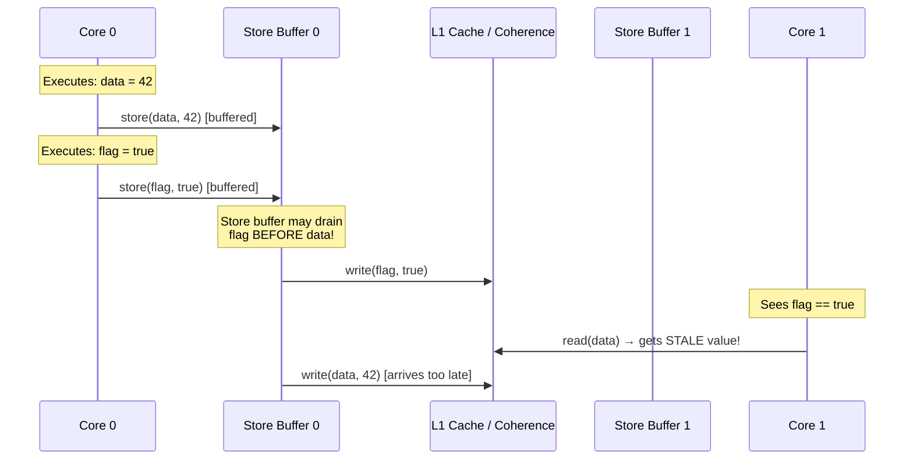
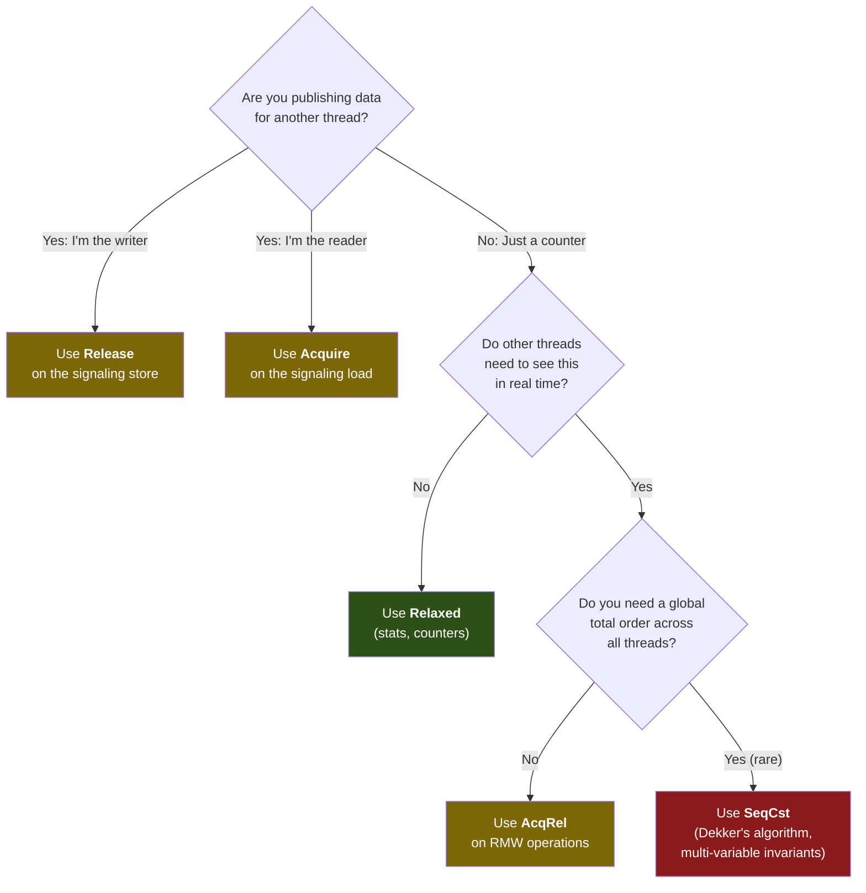

# Chapter 2: Atomic Memory Ordering 🟡

> **What you'll learn:**
> - Why the compiler AND the CPU actively reorder your memory operations — and when this is catastrophic
> - The five memory orderings in Rust (`Relaxed`, `Acquire`, `Release`, `AcqRel`, `SeqCst`) and their precise semantics
> - The **happens-before** relation: the formal foundation of all concurrent correctness proofs
> - How to choose the minimum ordering that is still correct — because `SeqCst` everywhere is a performance crutch

---

## 2.1 The Reordering Problem: Why Sequential Code Isn't Sequential

The most dangerous assumption in concurrent programming is that code executes in the order you wrote it. **It doesn't.** Two independent systems conspire to reorder your memory operations:

### Compiler Reordering

The compiler (LLVM, in Rust's case) can reorder, eliminate, or coalesce memory operations if the **as-if rule** says the single-threaded behavior is preserved:

```rust
// What you wrote:
fn store_values(data: &mut [u64; 2], flag: &mut bool) {
    data[0] = 42;     // (A)
    data[1] = 100;    // (B)
    *flag = true;      // (C)
}

// What the compiler MAY emit (perfectly legal under as-if):
// (C) *flag = true;     ← moved before data writes!
// (A) data[0] = 42;
// (B) data[1] = 100;
```

In single-threaded code, this reordering is invisible. But if another thread is spinning on `flag` to know when `data` is ready, the reordering causes it to read **uninitialized garbage**.

### CPU Reordering (Store Buffers)

Even if the compiler emits instructions in order, the CPU can reorder them at the hardware level. Modern out-of-order CPUs use **store buffers**: when a core executes a store instruction, it doesn't immediately write to the cache. Instead, it places the write in a **store buffer** and continues executing subsequent instructions.



On **x86-64**, the CPU provides **Total Store Ordering (TSO)**: stores from a single core are guaranteed to become visible in program order. This means x86 accidentally prevents many reordering bugs.

On **ARM and RISC-V**, the memory model is **weakly ordered**: stores can become visible to other cores in *any* order. Code that "works on x86" can **silently corrupt data** on ARM.

> **HFT Reality:** We test all code on ARM (AWS Graviton) in CI even though production runs on x86. Several production bugs were only caught by ARM's weaker memory model.

---

## 2.2 The Five Memory Orderings

Rust exposes five variants of `std::sync::atomic::Ordering`:

| Ordering | Compiler fence? | CPU fence? | Cost (x86) | Cost (ARM) | Use case |
|---|---|---|---|---|---|
| `Relaxed` | No reordering of *this* op eliminated | No fence | Cheapest | Cheapest | Counters, statistics |
| `Acquire` | No reads/writes move **before** this load | Load fence | Free (TSO) | `ldar` instruction | Reading a flag/pointer published by another thread |
| `Release` | No reads/writes move **after** this store | Store fence | Free (TSO) | `stlr` instruction | Publishing data for another thread to consume |
| `AcqRel` | Combined Acquire + Release | Load + Store fence | Free (TSO) | `ldar` + `stlr` | Read-modify-write: `fetch_add`, `compare_exchange` |
| `SeqCst` | Full fence | Full memory barrier | `MFENCE` (~20 cycles) | `dmb ish` | Global total ordering of all SeqCst operations |

### The Cost Hierarchy

```
Cheapest ───────────────────────────────────────────────── Most Expensive

  Relaxed     Acquire/Release      AcqRel           SeqCst
  (no fence)  (free on x86)        (free on x86)    (MFENCE on x86,
              (ldar/stlr on ARM)   (both on ARM)     dmb ish on ARM)
```

On x86, `Relaxed`, `Acquire`, `Release`, and `AcqRel` are all essentially free because TSO already guarantees store ordering. **However**, you must still use the correct ordering for two reasons:
1. The *compiler* can still reorder unless you specify the right ordering.
2. Your code might run on ARM (cloud servers, Apple Silicon development machines).

`SeqCst` is always the most expensive because it requires a full memory barrier (`MFENCE` on x86, `dmb ish` on ARM), which flushes the store buffer and stalls the pipeline.

---

## 2.3 The Happens-Before Relation

The formal tool for reasoning about memory ordering is the **happens-before** relation, written as `A ⟶ B` (A happens-before B). If `A ⟶ B`, then any memory writes performed by `A` are **guaranteed to be visible** to `B`.

### Rules for Establishing Happens-Before

1. **Program order:** Within a single thread, every statement happens-before the next.
2. **Release-Acquire pair:** If thread T1 does `store(x, Release)` and thread T2 does `load(x, Acquire)` and **sees the value stored by T1**, then everything T1 did before the `Release` store happens-before everything T2 does after the `Acquire` load.
3. **SeqCst total order:** All `SeqCst` operations form a single global total order agreed upon by all threads.
4. **Transitivity:** If `A ⟶ B` and `B ⟶ C`, then `A ⟶ C`.

### The Classic Pattern: Flag-Based Synchronization

```rust
use std::sync::atomic::{AtomicBool, AtomicU64, Ordering};
use std::sync::Arc;
use std::thread;

fn release_acquire_example() {
    let data = Arc::new(AtomicU64::new(0));
    let ready = Arc::new(AtomicBool::new(false));

    // --- Producer thread ---
    let d = Arc::clone(&data);
    let r = Arc::clone(&ready);
    let producer = thread::spawn(move || {
        // Step 1: Write the data
        d.store(42, Ordering::Relaxed);          // (W1)

        // Step 2: Signal that data is ready
        // Release: guarantees W1 is visible to anyone who Acquires this flag
        r.store(true, Ordering::Release);         // (W2) ← RELEASE
    });

    // --- Consumer thread ---
    let d = Arc::clone(&data);
    let r = Arc::clone(&ready);
    let consumer = thread::spawn(move || {
        // Spin until we see the flag
        while !r.load(Ordering::Acquire) {        // (R1) ← ACQUIRE
            std::hint::spin_loop();
        }

        // GUARANTEED: since R1 Acquired the value stored by W2 (Release),
        // everything before W2 (including W1) is visible here.
        let value = d.load(Ordering::Relaxed);    // (R2)
        assert_eq!(value, 42);  // ✅ Always passes
    });

    producer.join().unwrap();
    consumer.join().unwrap();
}
```

The happens-before edges:

```
Thread 1 (Producer):           Thread 2 (Consumer):
  W1: data = 42 (Relaxed)
       │ [program order]
       ▼
  W2: ready = true (Release)
       │
       │ [Release-Acquire synchronization edge]
       │   (T2 loads the value stored by T1)
       ▼
                               R1: load ready (Acquire) → true
                                    │ [program order]
                                    ▼
                               R2: load data (Relaxed) → 42 ✅
```

### What Goes Wrong with `Relaxed`

If we replaced `Release`/`Acquire` with `Relaxed`:

```rust
// 💥 BROKEN: No synchronization edge between producer and consumer
r.store(true, Ordering::Relaxed);  // Producer
// ...
while !r.load(Ordering::Relaxed) { // Consumer
    std::hint::spin_loop();
}
let value = d.load(Ordering::Relaxed);
// value could be 0 or 42 — NO GUARANTEE!
// On ARM, this WILL intermittently read stale data.
```

---

## 2.4 When to Use Each Ordering

### Decision Matrix



### Practical Ordering Table

| Use Case | Store Ordering | Load Ordering | Why |
|---|---|---|---|
| Stats counter | `Relaxed` | `Relaxed` | No data depends on the counter value |
| Publish data behind a flag | `Release` (flag) | `Acquire` (flag) | Ensures data writes are visible when flag is seen |
| `fetch_add` on shared counter | `Relaxed` | — | If only tracking count, not synchronizing other data |
| `compare_exchange` in a lock-free queue | `AcqRel` | — | CAS both reads and writes; must synchronize in both directions |
| Implementing `SeqLock` | `Release` (version++) | `Acquire` (version) | Reader-writer synchronization without mutual exclusion |
| Dekker's / Peterson's mutual exclusion | `SeqCst` | `SeqCst` | Requires global agreement on the order of flag stores |

---

## 2.5 SeqCst: The Sledgehammer (and When You Actually Need It)

`SeqCst` (Sequentially Consistent) provides the strongest guarantee: all `SeqCst` operations across all threads form a single, globally agreed-upon total order. Every thread sees the same interleaving.

### When SeqCst is Required

The classic case is **multi-variable invariants** across threads:

```rust
use std::sync::atomic::{AtomicBool, Ordering};
use std::sync::Arc;
use std::thread;

/// Dekker-style mutual exclusion (simplified).
/// REQUIRES SeqCst because each thread must see the OTHER thread's flag
/// in the globally agreed order.
fn dekker_requires_seqcst() {
    let flag_a = Arc::new(AtomicBool::new(false));
    let flag_b = Arc::new(AtomicBool::new(false));

    let fa = Arc::clone(&flag_a);
    let fb = Arc::clone(&flag_b);
    let thread_a = thread::spawn(move || {
        fa.store(true, Ordering::SeqCst);           // (1) announce intent
        if !fb.load(Ordering::SeqCst) {             // (2) check other's flag
            // critical section — only enter if B's flag is false
            // With Relaxed/Release, step (2) could be reordered before (1)
            // on ARM, letting BOTH threads enter the critical section!
        }
        fa.store(false, Ordering::SeqCst);
    });

    let fa = Arc::clone(&flag_a);
    let fb = Arc::clone(&flag_b);
    let thread_b = thread::spawn(move || {
        fb.store(true, Ordering::SeqCst);
        if !fa.load(Ordering::SeqCst) {
            // critical section
        }
        fb.store(false, Ordering::SeqCst);
    });

    thread_a.join().unwrap();
    thread_b.join().unwrap();
}
```

### Why Not SeqCst Everywhere?

| Aspect | `SeqCst` | `Acquire`/`Release` |
|---|---|---|
| **x86 cost** | `MFENCE` instruction (~20 cycles) | Free (handled by TSO) |
| **ARM cost** | `dmb ish` (full barrier, ~40 cycles) | `ldar`/`stlr` (~5 cycles) |
| **Composability** | Global ordering constraint limits CPU reordering of *all* instructions | Local constraint only affects the specific atomic and surrounding ops |
| **When needed** | Multi-variable invariants (Dekker, Peterson), lock implementations | 95% of real-world synchronization patterns |

> **Rule of thumb:** Start with `Acquire`/`Release`. Only reach for `SeqCst` when you have two or more *independent* atomic variables that must be observed in a consistent global order.

---

## 2.6 Compiler Fences vs CPU Fences

Rust also provides `std::sync::atomic::fence()` and `std::sync::atomic::compiler_fence()`:

```rust
use std::sync::atomic::{fence, compiler_fence, Ordering};

fn fence_example() {
    // CPU fence: prevents reordering at BOTH the compiler and hardware level
    fence(Ordering::Release);

    // Compiler fence: prevents reordering at the COMPILER level only.
    // The CPU can still reorder. Useful for signal handlers and
    // single-core scenarios (e.g., interrupt service routines).
    compiler_fence(Ordering::Release);
}
```

| Fence Type | Prevents Compiler Reordering? | Prevents CPU Reordering? | Use Case |
|---|---|---|---|
| `fence(Release)` | Yes | Yes | Cross-thread synchronization |
| `compiler_fence(Release)` | Yes | **No** | Signal handlers, single-core ISRs |

---

<details>
<summary><strong>🏋️ Exercise: Build a SeqLock (Sequence Lock)</strong> (click to expand)</summary>

### Challenge

Implement a **SeqLock** — a reader-writer synchronization primitive used in the Linux kernel for data that is rarely written but very frequently read (e.g., system clock, statistics).

The algorithm:
1. A `version` counter starts at 0 (even = unlocked).
2. **Writer:** Increments `version` to odd (locks), writes data, increments `version` to even (unlocks).
3. **Reader:** Reads `version` (must be even), reads data, reads `version` again. If version changed, retry. No mutex needed for readers.

```rust
use std::sync::atomic::{AtomicU64, Ordering};
use std::cell::UnsafeCell;

struct SeqLock<T: Copy> {
    version: AtomicU64,
    data: UnsafeCell<T>,
}

unsafe impl<T: Copy + Send> Send for SeqLock<T> {}
unsafe impl<T: Copy + Send> Sync for SeqLock<T> {}

// TODO: Implement read() and write() with correct memory orderings.
// Hint: The version increments use Release. The version reads use Acquire.
// Why is Relaxed not sufficient for the version reads?
```

<details>
<summary>🔑 Solution</summary>

```rust
use std::sync::atomic::{AtomicU64, Ordering, fence};
use std::cell::UnsafeCell;

struct SeqLock<T: Copy> {
    version: AtomicU64,
    data: UnsafeCell<T>,
}

unsafe impl<T: Copy + Send> Send for SeqLock<T> {}
unsafe impl<T: Copy + Send> Sync for SeqLock<T> {}

impl<T: Copy> SeqLock<T> {
    fn new(value: T) -> Self {
        SeqLock {
            version: AtomicU64::new(0),
            data: UnsafeCell::new(value),
        }
    }

    /// Read the value. Lock-free, wait-free for readers when no writer is active.
    /// Retries if a write occurred during the read.
    fn read(&self) -> T {
        loop {
            // Step 1: Read version. Must be Acquire so that subsequent
            // data reads cannot be reordered before this.
            let v1 = self.version.load(Ordering::Acquire);

            // Step 2: If version is odd, a write is in progress. Spin.
            if v1 & 1 != 0 {
                std::hint::spin_loop();
                continue;
            }

            // Step 3: Read the data.
            // SAFETY: We will validate the read with a second version check.
            let value = unsafe { *self.data.get() };

            // Step 4: Acquire fence before second version read.
            // This prevents the CPU from reordering the data read
            // AFTER the second version load.
            fence(Ordering::Acquire);

            // Step 5: Read version again.
            let v2 = self.version.load(Ordering::Relaxed);

            // Step 6: If version hasn't changed, our read was consistent.
            if v1 == v2 {
                return value;
            }

            // Version changed — a writer snuck in. Retry.
            std::hint::spin_loop();
        }
    }

    /// Write a new value. Exclusive — only one writer at a time.
    /// In production, you'd wrap this in a mutex for the write side.
    ///
    /// # Safety
    /// Caller must ensure exclusive write access (e.g., via an external mutex).
    unsafe fn write(&self, value: T) {
        // Step 1: Increment version to odd (signaling write in progress).
        // Relaxed is fine here because the Release on step 3 will
        // synchronize everything.
        let v = self.version.load(Ordering::Relaxed);
        self.version.store(v + 1, Ordering::Release);

        // Step 2: Write the data.
        *self.data.get() = value;

        // Step 3: Increment version to even (signaling write complete).
        // Release ensures the data write in step 2 is visible before
        // any reader sees the even version.
        self.version.store(v + 2, Ordering::Release);
    }
}
```

**Why does this work?**

- The **writer** uses `Release` on both version stores: the first Release ensures readers see the odd version before the data write becomes visible, and the second Release ensures the data write is visible before the even version.
- The **reader** uses `Acquire` on the first version load, creating a happens-before edge from the writer's Release to the reader's Acquire. The `fence(Acquire)` before the second version load ensures the data read completes before the validation check.
- If `v1 == v2` and both are even, no write occurred during the read, so the data is consistent.

**Latency characteristics:**
- Reader: 0 atomic RMW operations, only loads → no cache-line invalidations
- Writer: 2 atomic stores → invalidates readers' cache lines (acceptable since writes are rare)
- This makes SeqLock ideal for read-dominated workloads like clock values and statistics.

</details>
</details>

---

> **Key Takeaways:**
> - Both the **compiler** and the **CPU** actively reorder memory operations. Correct concurrent code requires explicit ordering constraints.
> - **`Acquire`/`Release`** pairs create happens-before edges: everything before a `Release` store is visible after the corresponding `Acquire` load. This covers 95% of synchronization needs.
> - **`Relaxed`** is safe only when no other memory operations depend on the atomic value (counters, statistics).
> - **`SeqCst`** is the nuclear option: use it only for multi-variable invariants like Dekker's algorithm. It's free on x86 but costly on ARM.
> - On x86, `Acquire`/`Release` are "free" due to TSO — but you MUST still specify them for compiler-fence correctness and ARM portability.

---

> **See also:**
> - [Chapter 1: The CPU Cache and False Sharing](./ch01-cpu-cache-and-false-sharing.md) — the hardware foundation that makes ordering matter
> - [Chapter 3: Compare-And-Swap (CAS) and the ABA Problem](./ch03-cas-and-aba-problem.md) — applying these orderings to lock-free algorithms
> - [Concurrency in Rust: Chapter 6 — Memory Ordering](../concurrency-book/src/ch06-memory-ordering.md) — foundational treatment of orderings
