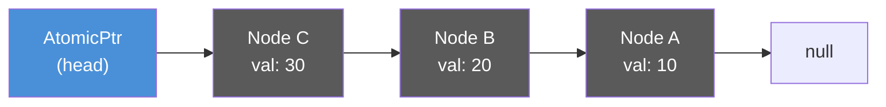
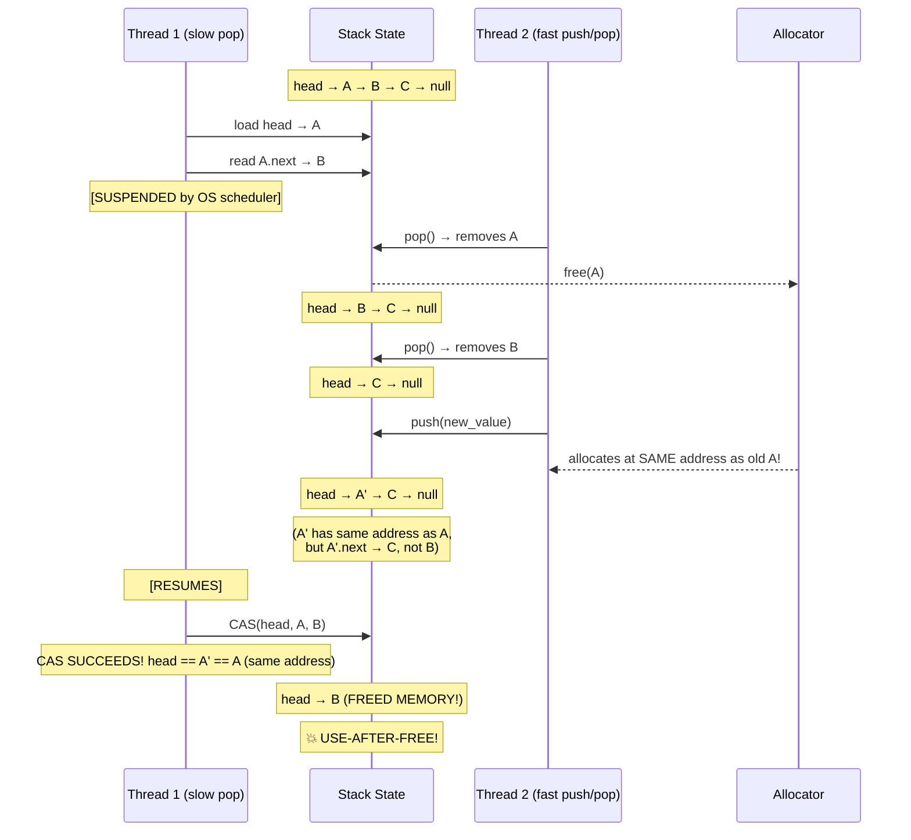

# Chapter 3: Compare-And-Swap (CAS) and the ABA Problem 🟡

> **What you'll learn:**
> - The Compare-And-Swap (CAS) instruction: the single hardware primitive behind all lock-free algorithms
> - How to build a lock-free stack (Treiber Stack) using `AtomicPtr` and CAS loops
> - The **ABA problem** — the most insidious correctness bug in lock-free programming — and why it only strikes once every million operations
> - Three defenses against ABA: tagged pointers, double-width CAS, and epoch-based reclamation

---

## 3.1 The CAS Instruction: Atomic Read-Modify-Write

Compare-And-Swap (CAS) is the foundational instruction for all lock-free programming. It atomically performs:

```
CAS(location, expected, desired):
    if *location == expected:
        *location = desired
        return Ok(expected)      // Success: we swapped
    else:
        return Err(*location)    // Failure: someone else changed it
```

On x86, this maps to the `LOCK CMPXCHG` instruction. On ARM, it uses `LDXR`/`STXR` (load-exclusive / store-exclusive) pairs.

### CAS in Rust

```rust
use std::sync::atomic::{AtomicUsize, Ordering};

fn cas_example() {
    let counter = AtomicUsize::new(5);

    // Try to change 5 → 10. Succeeds because current value is 5.
    let result = counter.compare_exchange(
        5,                    // expected
        10,                   // desired
        Ordering::AcqRel,    // success ordering
        Ordering::Acquire,   // failure ordering
    );
    assert_eq!(result, Ok(5)); // Returns previous value on success

    // Try to change 5 → 20. FAILS because current value is now 10.
    let result = counter.compare_exchange(
        5,                    // expected (stale!)
        20,                   // desired
        Ordering::AcqRel,
        Ordering::Acquire,
    );
    assert_eq!(result, Err(10)); // Returns current value on failure
}
```

### The CAS Loop Pattern

Since CAS can fail (another thread changed the value between our read and our CAS), we use **CAS loops** — retry until we succeed:

```rust
use std::sync::atomic::{AtomicUsize, Ordering};

/// Atomically multiply the counter by 2. No lock needed.
fn atomic_double(counter: &AtomicUsize) {
    loop {
        let current = counter.load(Ordering::Acquire);
        let new_value = current * 2;

        match counter.compare_exchange_weak(
            current,
            new_value,
            Ordering::AcqRel,
            Ordering::Acquire,
        ) {
            Ok(_) => break,    // CAS succeeded, we're done
            Err(_) => continue, // Another thread changed it, retry
        }
    }
}
```

> **`compare_exchange` vs `compare_exchange_weak`:** The `_weak` variant can spuriously fail (return `Err` even when the current value matches `expected`). On ARM, weak CAS maps to a single `LDXR`/`STXR` pair which can fail due to cache line contention even without a value change. In a CAS loop (which retries anyway), always prefer `compare_exchange_weak` — it avoids the overhead of the retry loop that `compare_exchange` adds internally on ARM.

### Lock-Free vs Mutex: A Comparison

| Property | `Mutex<T>` | CAS Loop |
|---|---|---|
| **Blocking?** | Yes — thread sleeps if lock is held | No — spins/retries without sleeping |
| **Priority inversion?** | Possible — low-priority thread holding lock blocks high-priority | Impossible — no ownership of shared state |
| **Deadlock?** | Possible if locking order is wrong | Impossible — no locks to deadlock on |
| **Throughput under contention** | Poor — OS scheduler overhead for sleep/wake | Good if CAS succeeds quickly; poor if contention is extreme |
| **Latency predictability** | Poor — worst case includes OS scheduling delay | Good — bounded by CAS retry count × instruction cost |
| **Complexity** | Low | High — subtle correctness bugs (ABA, memory ordering) |

---

## 3.2 Building a Lock-Free Stack (Treiber Stack)

The **Treiber Stack** (R. K. Treiber, 1986) is the simplest useful lock-free data structure. It's a singly linked list where `push` and `pop` both operate on the head pointer using CAS.

### Architecture



### Push Operation

```
1. Allocate new node
2. new_node.next = head           (read current head)
3. CAS(head, new_node.next, new_node)  (try to swing head)
4. If CAS fails, go to step 2    (someone else pushed first)
```

### Pop Operation

```
1. Read head
2. If head is null, return None
3. next = head.next               (read the second node)
4. CAS(head, head, next)          (try to swing head to second node)
5. If CAS fails, go to step 1    (someone else popped first)
6. Return head's value
```

### Implementation

```rust
use std::sync::atomic::{AtomicPtr, Ordering};
use std::ptr;

struct Node<T> {
    value: T,
    next: *mut Node<T>,
}

pub struct TreiberStack<T> {
    head: AtomicPtr<Node<T>>,
}

unsafe impl<T: Send> Send for TreiberStack<T> {}
unsafe impl<T: Send> Sync for TreiberStack<T> {}

impl<T> TreiberStack<T> {
    pub fn new() -> Self {
        TreiberStack {
            head: AtomicPtr::new(ptr::null_mut()),
        }
    }

    /// Push a value onto the stack. Lock-free, wait-free-bounded.
    pub fn push(&self, value: T) {
        let new_node = Box::into_raw(Box::new(Node {
            value,
            next: ptr::null_mut(),
        }));

        loop {
            // Step 1: Read current head
            let old_head = self.head.load(Ordering::Acquire);

            // Step 2: Point new node's next to current head
            // SAFETY: new_node is valid, we just allocated it
            unsafe { (*new_node).next = old_head; }

            // Step 3: CAS head from old_head to new_node
            match self.head.compare_exchange_weak(
                old_head,
                new_node,
                Ordering::Release, // On success: publish the new node
                Ordering::Relaxed, // On failure: just retry
            ) {
                Ok(_) => break,     // Successfully pushed
                Err(_) => continue, // Another thread won, retry
            }
        }
    }

    /// Pop a value from the stack. Lock-free.
    ///
    /// ⚠️ WARNING: This implementation has the ABA problem!
    /// See Section 3.3 for why this is dangerous.
    pub fn pop(&self) -> Option<T> {
        loop {
            // Step 1: Read current head
            let old_head = self.head.load(Ordering::Acquire);

            // Step 2: If empty, return None
            if old_head.is_null() {
                return None;
            }

            // Step 3: Read the next pointer
            // SAFETY: old_head is non-null and was a valid allocation
            let next = unsafe { (*old_head).next };

            // Step 4: CAS head from old_head to next
            // 💥 ABA HAZARD: Between step 1 and step 4, old_head could
            // have been popped, freed, and a NEW node allocated at the
            // SAME address. Our CAS succeeds but makes `next` point
            // to a freed node!
            match self.head.compare_exchange_weak(
                old_head,
                next,
                Ordering::AcqRel,
                Ordering::Acquire,
            ) {
                Ok(_) => {
                    // Successfully popped. Extract value and free node.
                    let value = unsafe { Box::from_raw(old_head).value };
                    return Some(value);
                }
                Err(_) => continue, // Another thread won, retry
            }
        }
    }
}

impl<T> Drop for TreiberStack<T> {
    fn drop(&mut self) {
        // Drain all remaining elements
        while self.pop().is_some() {}
    }
}
```

---

## 3.3 The ABA Problem

The Treiber Stack above has a lethal bug. It's called the **ABA problem**, and it's the single most important correctness hazard in lock-free programming.

### The Scenario



### Why CAS Doesn't Catch It

CAS compares the **pointer value** (the memory address). It does not check whether the pointed-to data is the same. After the allocator reuses address `A`:

- Thread 1 sees `head` is still `A` (same address) → CAS succeeds
- But `A.next` was `B` when Thread 1 read it — and `B` has since been freed
- The stack now points `head` to freed memory

### The Name "ABA"

The value goes `A` → `B` → back to `A` (different object, same address). Thread 1 only sees the initial `A` and the final `A`, missing the intermediate change to `B`.

---

## 3.4 Defenses Against ABA

### Defense 1: Tagged Pointers (Version Counter)

Pack a monotonically increasing version counter into the unused bits of the pointer, or combine the pointer with a counter in a 128-bit atomic:

```rust
use std::sync::atomic::{AtomicU64, Ordering};

/// A tagged pointer that packs both a pointer and a version counter
/// into a single 64-bit value.
///
/// Layout: [version: 16 bits][pointer: 48 bits]
///
/// On x86-64, only the lower 48 bits of a pointer are used for addressing
/// (current implementations use 48-bit virtual addresses).
/// We steal the upper 16 bits for a version counter (0..65535).
#[derive(Clone, Copy, Debug)]
struct TaggedPtr {
    packed: u64,
}

impl TaggedPtr {
    const PTR_MASK: u64 = 0x0000_FFFF_FFFF_FFFF; // Lower 48 bits
    const TAG_SHIFT: u32 = 48;

    fn new(ptr: *mut u8, tag: u16) -> Self {
        let ptr_val = ptr as u64 & Self::PTR_MASK;
        let tag_val = (tag as u64) << Self::TAG_SHIFT;
        TaggedPtr { packed: ptr_val | tag_val }
    }

    fn ptr(self) -> *mut u8 {
        // Sign-extend from bit 47 for canonical addresses
        let raw = self.packed & Self::PTR_MASK;
        if raw & (1u64 << 47) != 0 {
            (raw | !Self::PTR_MASK) as *mut u8
        } else {
            raw as *mut u8
        }
    }

    fn tag(self) -> u16 {
        (self.packed >> Self::TAG_SHIFT) as u16
    }
}

/// Now CAS compares BOTH the pointer AND the version tag.
/// Even if the allocator reuses address A, the tag will have
/// incremented, causing CAS to fail.
struct AtomicTaggedPtr {
    inner: AtomicU64,
}

impl AtomicTaggedPtr {
    fn load(&self, order: Ordering) -> TaggedPtr {
        TaggedPtr { packed: self.inner.load(order) }
    }

    fn compare_exchange_weak(
        &self,
        current: TaggedPtr,
        new: TaggedPtr,
        success: Ordering,
        failure: Ordering,
    ) -> Result<TaggedPtr, TaggedPtr> {
        self.inner
            .compare_exchange_weak(current.packed, new.packed, success, failure)
            .map(|v| TaggedPtr { packed: v })
            .map_err(|v| TaggedPtr { packed: v })
    }
}
```

**Limitation:** The 16-bit tag wraps around after 65,535 increments. In extremely high-throughput systems, this can still ABA. In practice, it's sufficient for most workloads.

### Defense 2: Double-Width CAS (DWCAS)

On x86-64, the `LOCK CMPXCHG16B` instruction provides a 128-bit CAS, allowing a full 64-bit pointer + a 64-bit counter:

```rust
// Conceptual — Rust doesn't expose 128-bit atomics on stable yet.
// Use the `crossbeam` crate or inline assembly.
struct DoubleWidthPtr<T> {
    ptr: *mut T,      // 64 bits
    counter: u64,     // 64 bits — will never wrap in practice
}
```

With a 64-bit counter, you'd need 2^64 ABA cycles before wrapping — effectively impossible.

### Defense 3: Epoch-Based Reclamation (Deferred Free)

The most elegant solution: **don't free memory immediately**. Instead, defer freeing until you can prove no thread holds a reference to the old pointer. This completely eliminates ABA because the allocator never reuses an address while any thread might still reference it.

This is the approach used by `crossbeam-epoch` and is covered in depth in Chapter 4.

| Defense | Complexity | ABA Safety | Performance | Memory Overhead |
|---|---|---|---|---|
| Tagged pointer (16-bit) | Low | High (wraps at 2^16) | Excellent — single CAS | +2 bytes per pointer |
| DWCAS (128-bit) | Medium | Perfect (2^64 counter) | Good — wider CAS is slower | +8 bytes per pointer |
| Epoch reclamation | High | Perfect | Good — amortized free cost | Deferred memory, needs epoch tracking |

---

## 3.5 A Correct Lock-Free Stack with Tagged Pointers

```rust
use std::sync::atomic::{AtomicU64, Ordering};
use std::ptr;

struct Node<T> {
    value: T,
    next: TaggedPtr,
}

pub struct AbaFreeStack<T> {
    head: AtomicTaggedPtr,
}

impl<T> AbaFreeStack<T> {
    pub fn new() -> Self {
        AbaFreeStack {
            head: AtomicTaggedPtr {
                inner: AtomicU64::new(TaggedPtr::new(ptr::null_mut(), 0).packed),
            },
        }
    }

    pub fn push(&self, value: T) {
        let new_node = Box::into_raw(Box::new(Node {
            value,
            next: TaggedPtr::new(ptr::null_mut(), 0),
        }));

        loop {
            let old_head = self.head.load(Ordering::Acquire);
            unsafe {
                (*new_node).next = old_head;
            }

            // ✅ FIX: Increment the tag on every push.
            // Even if `new_node` happens to share an address with
            // a previously freed node, the tag will differ.
            let new_tagged = TaggedPtr::new(
                new_node as *mut u8,
                old_head.tag().wrapping_add(1),
            );

            match self.head.compare_exchange_weak(
                old_head,
                new_tagged,
                Ordering::Release,
                Ordering::Relaxed,
            ) {
                Ok(_) => break,
                Err(_) => continue,
            }
        }
    }

    pub fn pop(&self) -> Option<T> {
        loop {
            let old_head = self.head.load(Ordering::Acquire);
            let head_ptr = old_head.ptr() as *mut Node<T>;

            if head_ptr.is_null() {
                return None;
            }

            let next = unsafe { (*head_ptr).next };
            let new_tagged = TaggedPtr::new(
                next.ptr(),
                old_head.tag().wrapping_add(1),
            );

            match self.head.compare_exchange_weak(
                old_head,
                new_tagged,
                Ordering::AcqRel,
                Ordering::Acquire,
            ) {
                Ok(_) => {
                    let value = unsafe { Box::from_raw(head_ptr).value };
                    return Some(value);
                }
                Err(_) => continue,
            }
        }
    }
}

impl<T> Drop for AbaFreeStack<T> {
    fn drop(&mut self) {
        while self.pop().is_some() {}
    }
}
```

---

<details>
<summary><strong>🏋️ Exercise: Build a Lock-Free Bounded Counter with CAS</strong> (click to expand)</summary>

### Challenge

Implement a lock-free **bounded counter** — a counter that can be incremented but never exceeds a maximum value. This is used in rate limiters and connection pool size tracking.

Requirements:
1. `try_increment(&self) -> bool` — atomically increments the counter if below `max`. Returns `true` on success, `false` if at capacity.
2. `decrement(&self)` — atomically decrements the counter (panics if already 0).
3. `count(&self) -> u64` — returns current value.
4. Must be fully lock-free using CAS loops.
5. Choose the correct memory orderings — not just `SeqCst` everywhere.

```rust
use std::sync::atomic::{AtomicU64, Ordering};

pub struct BoundedCounter {
    value: AtomicU64,
    max: u64,
}

// TODO: Implement try_increment, decrement, count
```

<details>
<summary>🔑 Solution</summary>

```rust
use std::sync::atomic::{AtomicU64, Ordering};

pub struct BoundedCounter {
    value: AtomicU64,
    max: u64,
}

impl BoundedCounter {
    pub fn new(max: u64) -> Self {
        BoundedCounter {
            value: AtomicU64::new(0),
            max,
        }
    }

    /// Try to increment the counter. Returns true if successful,
    /// false if the counter is already at max.
    ///
    /// Memory ordering rationale:
    /// - We use Acquire on load to see the latest value.
    /// - We use Release on successful CAS to publish the new value
    ///   so that downstream logic (e.g., "a slot is now taken") is
    ///   visible to threads that subsequently observe the incremented count.
    /// - We use Acquire on failure so the retry loop gets a fresh value.
    pub fn try_increment(&self) -> bool {
        loop {
            let current = self.value.load(Ordering::Acquire);

            // Check capacity BEFORE attempting CAS
            if current >= self.max {
                return false;
            }

            // Attempt to increment
            match self.value.compare_exchange_weak(
                current,
                current + 1,
                Ordering::Release,  // success: publish new value
                Ordering::Acquire,  // failure: get fresh value for retry
            ) {
                Ok(_) => return true,
                Err(_) => continue,   // Another thread changed it, retry
            }
        }
    }

    /// Decrement the counter. Panics if already 0.
    ///
    /// In production, you might return a Result instead.
    pub fn decrement(&self) {
        loop {
            let current = self.value.load(Ordering::Acquire);
            assert!(current > 0, "BoundedCounter: cannot decrement below zero");

            match self.value.compare_exchange_weak(
                current,
                current - 1,
                Ordering::Release,
                Ordering::Acquire,
            ) {
                Ok(_) => return,
                Err(_) => continue,
            }
        }
    }

    /// Read the current count. Uses Relaxed because this is just
    /// an observation — no data synchronization depends on it.
    pub fn count(&self) -> u64 {
        self.value.load(Ordering::Relaxed)
    }
}

// Test with multiple threads
#[cfg(test)]
mod tests {
    use super::*;
    use std::sync::Arc;
    use std::thread;

    #[test]
    fn test_bounded_counter() {
        let counter = Arc::new(BoundedCounter::new(100));
        let mut handles = vec![];

        // 200 threads each try to increment once. Only 100 should succeed.
        for _ in 0..200 {
            let c = Arc::clone(&counter);
            handles.push(thread::spawn(move || {
                c.try_increment()
            }));
        }

        let successes: usize = handles
            .into_iter()
            .map(|h| h.join().unwrap())
            .filter(|&ok| ok)
            .count();

        assert_eq!(successes, 100);
        assert_eq!(counter.count(), 100);
    }
}
```

**Why these orderings?**

- `try_increment` uses `Release` on success because after incrementing the counter (e.g., taking a connection pool slot), another thread that sees the new count must also see any state changes associated with that slot acquisition.
- `count()` uses `Relaxed` because it's a pure observation — no other data depends on seeing the exact current value. This makes it essentially free (no fence).
- We use `compare_exchange_weak` instead of `compare_exchange` because we're in a retry loop anyway. On ARM, weak CAS avoids an internal retry loop for spurious failures.

</details>
</details>

---

> **Key Takeaways:**
> - **CAS** (Compare-And-Swap) is the universal primitive for lock-free programming. It atomically reads, compares, and conditionally writes in a single instruction.
> - **CAS loops** retry until they succeed, making lock-free operations "optimistic": they assume no contention and handle it gracefully when it occurs.
> - The **ABA problem** is a correctness bug where a pointer is freed and reallocated at the same address, causing CAS to succeed when it shouldn't. It only manifests under high contention and specific timing — making it extremely difficult to reproduce.
> - **Tagged pointers** (version counters packed into pointer bits) are the simplest ABA defense. **Epoch-based reclamation** (Chapter 4) is the most robust.
> - Always prefer `compare_exchange_weak` inside CAS loops — it's faster on ARM and equivalent on x86.

---

> **See also:**
> - [Chapter 2: Atomic Memory Ordering](./ch02-atomic-memory-ordering.md) — the ordering parameters used in `compare_exchange`
> - [Chapter 4: Epoch-Based Memory Reclamation](./ch04-epoch-based-reclamation.md) — the definitive solution to safe memory reclamation in lock-free structures
> - [Chapter 8: Capstone — Lock-Free Order Book](./ch08-capstone-lock-free-order-book.md) — applying CAS to a production matching engine
