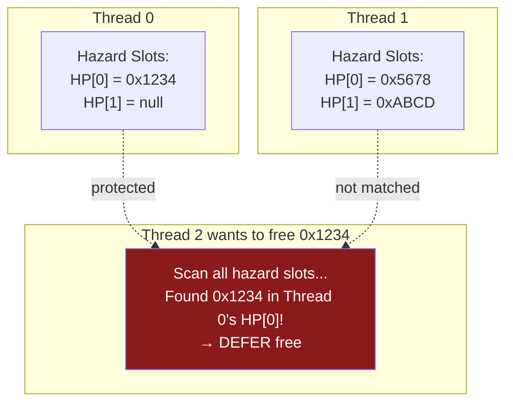
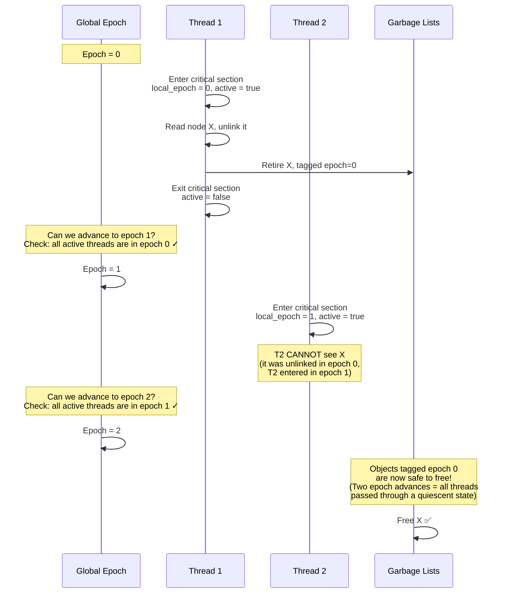
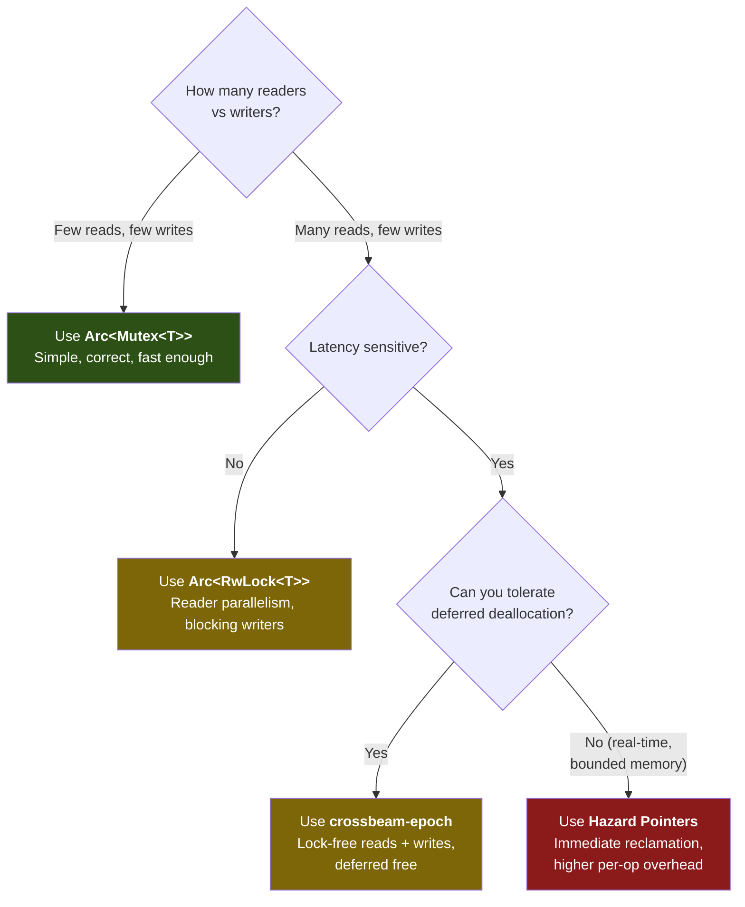

# Chapter 4: Epoch-Based Memory Reclamation 🔴

> **What you'll learn:**
> - Why traditional memory management (`Arc`, destructors, GC) fails for lock-free data structures
> - **Hazard Pointers**: the first safe reclamation scheme, and why it's expensive in practice
> - **Epoch-Based Reclamation (EBR)**: the elegant solution used by `crossbeam-epoch`, explained from first principles
> - How to use `crossbeam-epoch` to build production-grade lock-free data structures without use-after-free

---

## 4.1 The Reclamation Problem

In the Treiber Stack from Chapter 3, `pop()` removes a node from the linked list and then frees it. But what if another thread is *currently reading* that node? Consider:

```
Thread A (pop):                Thread B (pop):
1. old_head = load(head) → X   1. old_head = load(head) → X
2. next = X.next → Y           |
3. CAS(head, X, Y) → SUCCESS   | (Thread B is suspended here)
4. free(X)  ← 💥 DANGER!       |
                                2. next = X.next  ← USE-AFTER-FREE!
```

Thread A successfully pops `X` and frees it. But Thread B loaded `X` before the CAS and is about to dereference it. This is a **use-after-free** — undefined behavior.

### Why Standard Solutions Fail

| Approach | Problem in Lock-Free Context |
|---|---|
| **`Arc` (reference counting)** | Every `clone()`/`drop()` does an atomic `fetch_add`/`fetch_sub` on the refcount. On a hot path with millions of operations/sec, this **bounces the cache line** containing the refcount between cores — the exact false-sharing problem from Chapter 1. |
| **Garbage Collection (GC)** | Stop-the-world pauses are incompatible with latency requirements. Even concurrent GCs (G1, ZGC) add microseconds of unpredictable latency. |
| **Leaking memory** | Works for short-lived programs but is obviously not viable for long-running services. |
| **Locking before free** | Defeats the purpose of lock-free programming. |

We need a way to **defer deallocation** until we can prove no thread holds a reference to the object.

---

## 4.2 Hazard Pointers: The Brute-Force Approach

**Hazard Pointers** (Maged M. Michael, 2004) solve reclamation by having each thread publicly announce which pointers it's currently accessing.

### Concept

1. Each thread maintains a small set of **hazard pointer slots** (typically 1–2 per concurrent operation).
2. Before dereferencing a pointer, a thread writes it to its hazard slot: "I am currently using this pointer."
3. When a thread wants to free an object, it first scans **all other threads' hazard slots**. If any thread is protecting that pointer, the free is deferred.



### Problems with Hazard Pointers

| Issue | Impact |
|---|---|
| **Per-access overhead** | Every pointer dereference requires an atomic store to the hazard slot + a memory fence. At millions of ops/sec, this is measurable. |
| **Scanning cost** | Before freeing, must scan O(threads × hazard_slots) slots. With 64 threads and 2 slots each, that's 128 atomic loads per free. |
| **Memory overhead** | Need a separate retired list per thread and periodic batch scanning. |

Hazard Pointers are theoretically elegant and provide strong worst-case memory bounds, but the **per-access overhead** makes them slower in practice for most workloads. They are used in Facebook's Folly library for specific data structures where the strong reclamation guarantee matters.

---

## 4.3 Epoch-Based Reclamation: The Elegant Solution

**Epoch-Based Reclamation (EBR)** (Keir Fraser, 2004) takes a radically different approach: instead of tracking which specific pointers a thread is using, it tracks *when* threads are active using a global **epoch counter**.

### Core Idea

1. There is a **global epoch** counter that cycles through three values: 0, 1, 2.
2. Each thread has a **local epoch** and an **active flag**.
3. When a thread enters a critical section (accesses shared data), it sets its local epoch to the global epoch and marks itself active.
4. When a thread wants to free an object, it tags the object with the **current epoch** and places it in a **garbage list**.
5. The global epoch can advance only when **all active threads** have been observed in the current epoch.
6. Objects tagged with epoch `e` can be safely freed once the global epoch has advanced to `e + 2` — this guarantees at least one full epoch has passed since any thread could have held a reference.

### Why Epoch + 2?



**Why epoch + 2 and not + 1?** Consider epoch advancing from 0 to 1. A thread that was active during epoch 0 might have loaded a pointer but not yet dereferenced it. After advancing to epoch 1, that thread exits its critical section and re-enters — now in epoch 1. But between exiting and re-entering, it could still hold the old pointer in a register. Only after a *second* epoch advance (to epoch 2) can we guarantee that no thread retains any pointer from epoch 0, because every thread must have passed through a quiescent state (exited its critical section) at least once since epoch 0.

---

## 4.4 EBR Internals: A Simplified Implementation

```rust
use std::sync::atomic::{AtomicU64, AtomicBool, Ordering, fence};
use std::cell::UnsafeCell;

const EPOCH_COUNT: usize = 3;

/// Global state shared by all threads.
struct GlobalEpoch {
    /// The current global epoch (0, 1, or 2).
    epoch: AtomicU64,
}

/// Per-thread state.
struct ThreadState {
    /// This thread's local epoch (set on entry to critical section).
    local_epoch: AtomicU64,
    /// Whether this thread is currently in a critical section.
    active: AtomicBool,
    /// Garbage collected during each epoch. Three bags, one per epoch.
    garbage: [UnsafeCell<Vec<DeferredFree>>; EPOCH_COUNT],
}

struct DeferredFree {
    ptr: *mut u8,
    drop_fn: unsafe fn(*mut u8),
}

impl GlobalEpoch {
    /// Try to advance the global epoch.
    /// Succeeds only if all active threads have their local epoch
    /// equal to the current global epoch.
    fn try_advance(&self, threads: &[ThreadState]) -> bool {
        let current = self.epoch.load(Ordering::Acquire);

        // Check if all active threads are in the current epoch
        for thread in threads {
            if thread.active.load(Ordering::Acquire) {
                let thread_epoch = thread.local_epoch.load(Ordering::Acquire);
                if thread_epoch != current {
                    // This thread is still in an older epoch.
                    // Cannot advance yet.
                    return false;
                }
            }
        }

        // All active threads are caught up. Advance.
        let new_epoch = (current + 1) % EPOCH_COUNT as u64;
        // Use CAS to prevent double-advance
        self.epoch
            .compare_exchange(current, new_epoch, Ordering::AcqRel, Ordering::Relaxed)
            .is_ok()
    }
}

impl ThreadState {
    /// Enter a critical section. Must be called before accessing
    /// any shared lock-free data structure.
    fn pin(&self, global: &GlobalEpoch) {
        let epoch = global.epoch.load(Ordering::Relaxed);
        self.local_epoch.store(epoch, Ordering::Relaxed);
        self.active.store(true, Ordering::Release);

        // Fence: ensure the active flag is visible to other threads
        // BEFORE we start reading shared data structures.
        fence(Ordering::SeqCst);

        // Re-read epoch after fence to ensure consistency
        let epoch = global.epoch.load(Ordering::Relaxed);
        self.local_epoch.store(epoch, Ordering::Relaxed);
    }

    /// Exit the critical section.
    fn unpin(&self) {
        self.active.store(false, Ordering::Release);
    }

    /// Defer freeing a pointer until it's safe.
    fn retire(&self, ptr: *mut u8, drop_fn: unsafe fn(*mut u8)) {
        let epoch = self.local_epoch.load(Ordering::Relaxed) as usize;
        unsafe {
            (*self.garbage[epoch].get()).push(DeferredFree { ptr, drop_fn });
        }
    }

    /// Free garbage from epochs that are safe to collect.
    fn collect(&self, safe_epoch: u64) {
        let bag = &self.garbage[safe_epoch as usize];
        let garbage = unsafe { &mut *bag.get() };
        for deferred in garbage.drain(..) {
            unsafe { (deferred.drop_fn)(deferred.ptr); }
        }
    }
}
```

---

## 4.5 Using `crossbeam-epoch` in Practice

The `crossbeam-epoch` crate provides a production-grade EBR implementation. Here's how to use it:

```rust
use crossbeam_epoch::{self as epoch, Atomic, Owned, Shared, Guard};
use std::sync::atomic::Ordering;

struct Node<T> {
    value: T,
    next: Atomic<Node<T>>,
}

/// A Treiber Stack using crossbeam-epoch for safe memory reclamation.
/// No ABA problem, no use-after-free, no leaks.
pub struct EpochStack<T> {
    head: Atomic<Node<T>>,
}

impl<T> EpochStack<T> {
    pub fn new() -> Self {
        EpochStack {
            head: Atomic::null(),
        }
    }

    pub fn push(&self, value: T) {
        let mut node = Owned::new(Node {
            value,
            next: Atomic::null(),
        });

        // Pin the current thread — enters a critical section.
        // The returned Guard ensures we unpin when it's dropped.
        let guard = epoch::pin();

        loop {
            let head = self.head.load(Ordering::Acquire, &guard);
            node.next.store(head, Ordering::Relaxed);

            match self.head.compare_exchange(
                head,
                node,
                Ordering::Release,
                Ordering::Relaxed,
                &guard,
            ) {
                Ok(_) => break,
                Err(err) => node = err.new, // CAS failed, retry
            }
        }
    }

    pub fn pop(&self) -> Option<T> {
        let guard = epoch::pin();

        loop {
            let head = self.head.load(Ordering::Acquire, &guard);

            // Shared::as_ref() returns Option<&T> — safe because
            // the Guard guarantees the node won't be freed while
            // we hold it.
            let node = unsafe { head.as_ref() }?;

            let next = node.next.load(Ordering::Acquire, &guard);

            match self.head.compare_exchange(
                head,
                next,
                Ordering::AcqRel,
                Ordering::Acquire,
                &guard,
            ) {
                Ok(_) => {
                    // Successfully popped. Defer deallocation.
                    // The node will be freed after two epoch advances,
                    // when no thread can possibly hold a reference to it.
                    unsafe {
                        // Convert to Shared, then defer destruction.
                        guard.defer_destroy(head);
                    }
                    // Extract the value before the node is reclaimed.
                    // SAFETY: We just unlinked this node; no other thread
                    // will pop it (CAS ensures exclusivity of the pop).
                    return Some(unsafe { std::ptr::read(&node.value) });
                }
                Err(_) => continue,
            }
        }
    }
}

impl<T> Drop for EpochStack<T> {
    fn drop(&mut self) {
        // No other threads can access the stack during drop.
        // Safe to directly deallocate all nodes.
        let mut current = self.head.load(Ordering::Relaxed, unsafe {
            &epoch::unprotected()
        });
        while !current.is_null() {
            let node = unsafe { current.into_owned() };
            current = node.next.load(Ordering::Relaxed, unsafe {
                &epoch::unprotected()
            });
            drop(node);
        }
    }
}
```

### Key Concepts in `crossbeam-epoch`

| Concept | Description |
|---|---|
| `epoch::pin()` → `Guard` | Enter a critical section. Returns a `Guard` that unpins on drop. |
| `Atomic<T>` | An atomic pointer that integrates with epoch-based reclamation. |
| `Owned<T>` | A uniquely owned heap allocation (like `Box` for epoch pointers). |
| `Shared<'g, T>` | A shared reference tied to a `Guard`'s lifetime. Safe to dereference. |
| `guard.defer_destroy(ptr)` | Schedule `ptr` for deallocation after it's safe (epoch + 2). |

### Performance Characteristics

| Operation | `Arc`-based Stack | Epoch-based Stack |
|---|---|---|
| Push (uncontended) | ~15 ns (refcount inc) | ~8 ns (no refcount) |
| Push (8 threads) | ~120 ns (refcount bouncing) | ~25 ns (no shared writes) |
| Pop (uncontended) | ~20 ns (refcount dec + potential free) | ~10 ns |
| Pop (8 threads) | ~150 ns | ~30 ns |
| Memory reclamation | Immediate (deterministic) | Deferred (amortized, bounded) |

---

## 4.6 Trade-offs and When to Use What



| Approach | Reclamation | Per-op Overhead | Memory Bound | Complexity |
|---|---|---|---|---|
| `Arc` (refcounting) | Immediate | Atomic inc/dec on every access | Tight | Low |
| Hazard Pointers | Immediate | Atomic store per access + scan on free | Tight (O(threads²)) | High |
| Epoch (EBR) | Deferred | `pin()`/`unpin()` per batch | Unbounded worst case | Medium |
| Leaking | Never | Zero | Unbounded | Zero (but don't do this) |

> **HFT Recommendation:** Epoch-based reclamation (`crossbeam-epoch`) is our default for all lock-free data structures. The deferred memory cost is acceptable because we size our allocations generously and avoid long-lived critical sections. Hazard Pointers are reserved for structures that must guarantee bounded memory (e.g., on embedded systems or within the kernel).

---

<details>
<summary><strong>🏋️ Exercise: Epoch-Protected Lock-Free Queue</strong> (click to expand)</summary>

### Challenge

Implement a lock-free **FIFO queue** (not a stack) using `crossbeam-epoch`. The queue should have:

1. `enqueue(&self, value: T)` — add to the tail
2. `dequeue(&self) -> Option<T>` — remove from the head

Use the **Michael-Scott Queue** algorithm:
- Maintain separate `head` and `tail` atomic pointers
- Use a **sentinel (dummy) node** so that `head` and `tail` start pointing to the same node
- `enqueue` appends to `tail.next` via CAS, then advances `tail`
- `dequeue` reads `head.next` — if non-null, CAS `head` forward

This is harder than the stack because you must handle the case where `tail` lags behind the actual tail of the list.

<details>
<summary>🔑 Solution</summary>

```rust
use crossbeam_epoch::{self as epoch, Atomic, Owned, Shared, Guard};
use std::sync::atomic::Ordering;

struct Node<T> {
    value: Option<T>,  // None for the sentinel node
    next: Atomic<Node<T>>,
}

/// Michael-Scott lock-free FIFO queue with epoch-based reclamation.
pub struct MsQueue<T> {
    head: Atomic<Node<T>>,
    tail: Atomic<Node<T>>,
}

impl<T> MsQueue<T> {
    pub fn new() -> Self {
        // Create sentinel (dummy) node
        let sentinel = Owned::new(Node {
            value: None,
            next: Atomic::null(),
        });
        let guard = epoch::pin();
        let sentinel = sentinel.into_shared(&guard);

        MsQueue {
            head: Atomic::from(sentinel),
            tail: Atomic::from(sentinel),
        }
    }

    pub fn enqueue(&self, value: T) {
        let new_node = Owned::new(Node {
            value: Some(value),
            next: Atomic::null(),
        });

        let guard = epoch::pin();
        let new_node = new_node.into_shared(&guard);

        loop {
            // Step 1: Read tail
            let tail = self.tail.load(Ordering::Acquire, &guard);
            let tail_ref = unsafe { tail.deref() };

            // Step 2: Read tail's next
            let next = tail_ref.next.load(Ordering::Acquire, &guard);

            // Step 3: Is tail actually the last node?
            if next.is_null() {
                // Tail is correct. Try to link new node as tail.next
                match tail_ref.next.compare_exchange(
                    Shared::null(),
                    new_node,
                    Ordering::Release,
                    Ordering::Relaxed,
                    &guard,
                ) {
                    Ok(_) => {
                        // Successfully linked. Now try to advance tail.
                        // If this CAS fails, it's okay — another thread
                        // will advance tail for us in the next iteration.
                        let _ = self.tail.compare_exchange(
                            tail,
                            new_node,
                            Ordering::Release,
                            Ordering::Relaxed,
                            &guard,
                        );
                        return;
                    }
                    Err(_) => continue, // Another thread linked first
                }
            } else {
                // Tail is lagging behind. Help advance it.
                // This is the key to the algorithm's correctness:
                // any thread can help advance the tail pointer.
                let _ = self.tail.compare_exchange(
                    tail,
                    next,
                    Ordering::Release,
                    Ordering::Relaxed,
                    &guard,
                );
                // Retry — tail is now (hopefully) at the real tail
            }
        }
    }

    pub fn dequeue(&self) -> Option<T> {
        let guard = epoch::pin();

        loop {
            let head = self.head.load(Ordering::Acquire, &guard);
            let tail = self.tail.load(Ordering::Acquire, &guard);
            let head_ref = unsafe { head.deref() };
            let next = head_ref.next.load(Ordering::Acquire, &guard);

            // Is the queue empty?
            if next.is_null() {
                return None;
            }

            // If head == tail and next is non-null, tail is lagging.
            // Help advance tail before dequeuing.
            if head == tail {
                let _ = self.tail.compare_exchange(
                    tail,
                    next,
                    Ordering::Release,
                    Ordering::Relaxed,
                    &guard,
                );
                continue;
            }

            // Read the value from next (the first real node).
            let next_ref = unsafe { next.deref() };
            let value = unsafe { std::ptr::read(&next_ref.value) };

            // Try to advance head past the sentinel to next.
            match self.head.compare_exchange(
                head,
                next,
                Ordering::AcqRel,
                Ordering::Acquire,
                &guard,
            ) {
                Ok(_) => {
                    // Successfully dequeued. The old sentinel (head)
                    // is now unreachable. Defer its destruction.
                    unsafe { guard.defer_destroy(head); }
                    // `next` is the new sentinel.
                    return value;
                }
                Err(_) => continue, // Another thread dequeued first
            }
        }
    }
}

impl<T> Drop for MsQueue<T> {
    fn drop(&mut self) {
        // Drain remaining elements
        while self.dequeue().is_some() {}
        // Free the sentinel
        let guard = unsafe { epoch::unprotected() };
        let sentinel = self.head.load(Ordering::Relaxed, guard);
        if !sentinel.is_null() {
            unsafe { drop(sentinel.into_owned()); }
        }
    }
}
```

**Key insight:** The Michael-Scott Queue has a **helping mechanism** — when a thread notices that `tail` is lagging (i.e., `tail.next` is non-null), it helps advance `tail` forward. This ensures that the queue makes progress even if the thread that originally enqueued the node crashes or is suspended before updating `tail`. This is why the algorithm is **lock-free**: any thread can complete another thread's partially-finished operation.

</details>
</details>

---

> **Key Takeaways:**
> - Lock-free data structures cannot use traditional `drop()`/`free()` because another thread may be reading the node. This is the **reclamation problem**.
> - **`Arc` (reference counting)** causes cache-line bouncing on the refcount — unacceptable for hot paths processing millions of ops/sec.
> - **Epoch-Based Reclamation** defers deallocation until all threads have passed through a quiescent state. It adds near-zero per-operation overhead (just `pin()`/`unpin()`).
> - `crossbeam-epoch` provides a production-grade EBR implementation. Use `Guard`, `Atomic<T>`, `Shared<'g, T>`, and `defer_destroy` to build safe lock-free structures.
> - EBR's trade-off is **unbounded deferred memory** if a thread holds a `Guard` for too long. Keep critical sections short.

---

> **See also:**
> - [Chapter 3: CAS and the ABA Problem](./ch03-cas-and-aba-problem.md) — the ABA bug that EBR solves
> - [Chapter 5: Skip Lists and Concurrent Maps](./ch05-skip-lists-and-concurrent-maps.md) — EBR applied to a complex data structure
> - [Chapter 8: Capstone — Lock-Free Order Book](./ch08-capstone-lock-free-order-book.md) — EBR in a production system design
