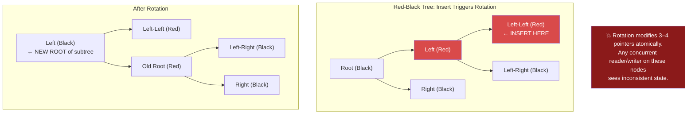
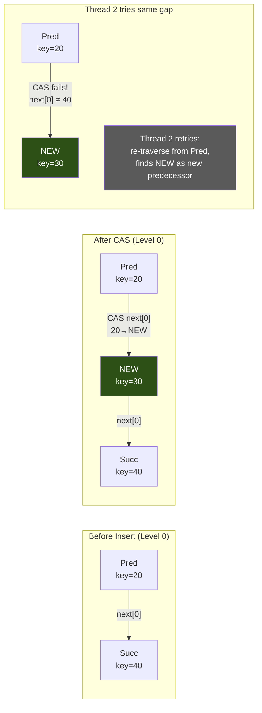

# Chapter 5: Skip Lists and Concurrent Maps 🟡

> **What you'll learn:**
> - Why balanced trees (Red-Black, AVL) are fundamentally hostile to concurrent writes due to global rotations
> - **Skip Lists**: a probabilistic data structure that achieves O(log n) expected-case operations with purely local mutations
> - How to make a skip list concurrent with per-node CAS operations — no global lock needed
> - When to choose a skip list over a `BTreeMap`, `HashMap`, or `RwLock<BTreeMap>`

---

## 5.1 The Problem with Balanced Trees Under Concurrency

Red-Black Trees and AVL Trees are workhorses for ordered key-value storage. They guarantee O(log n) worst-case for search, insert, and delete. But they have a fatal flaw for concurrent access: **rotations**.

When a Red-Black Tree inserts a node, it may need to perform **up to 3 rotations** that modify the structural pointers of nodes far from the insertion point — potentially all the way up to the root. This means:

1. **Writes conflict globally.** An insertion at the leftmost leaf can modify the root, blocking a concurrent insertion at the rightmost leaf.
2. **Fine-grained locking is nightmarishly complex.** Hand-over-hand locking through the tree requires careful lock ordering and deadlock avoidance, and the worst-case lock chain reaches the root.
3. **Lock-free Red-Black Trees are essentially impossible.** A single rotation requires atomically updating 3–4 pointers simultaneously — far beyond what a single CAS can do.



### Comparison: Trees vs Skip Lists for Concurrency

| Property | Red-Black Tree | Skip List |
|---|---|---|
| Search | O(log n) worst case | O(log n) expected case |
| Insert | O(log n) + rotations | O(log n) expected, **local modifications only** |
| Delete | O(log n) + rotations | O(log n) expected, local modifications only |
| Concurrent insert | Requires locking subtree up to root | CAS on 1–2 pointers per level |
| Lock-free feasible? | No (multi-pointer rotations) | **Yes** (per-level CAS) |
| Memory overhead | 2 child pointers + color per node | ~1.33 forward pointers per node (on average) |
| Cache behavior | Pointer chasing (poor) | Pointer chasing (poor), but more parallelizable |

---

## 5.2 Skip List Fundamentals

A **Skip List** (William Pugh, 1990) is a probabilistic data structure that uses multiple levels of linked lists to achieve O(log n) expected search time, *without* any rotations or rebalancing.

### Structure

```
Level 3:  HEAD ────────────────────────── 50 ────────────────────────── TAIL
Level 2:  HEAD ──────── 20 ──────────── 50 ──────── 70 ──────────── TAIL
Level 1:  HEAD ── 10 ── 20 ── 30 ── 40 ── 50 ── 60 ── 70 ── 80 ── TAIL
Level 0:  HEAD ── 10 ── 20 ── 30 ── 40 ── 50 ── 60 ── 70 ── 80 ── TAIL
```

- **Level 0** is a standard sorted linked list containing all elements.
- Each higher level is a "fast lane" containing a random subset of the level below.
- An element's height is chosen randomly: height 1 with probability 1/2, height 2 with probability 1/4, height 3 with probability 1/8, etc.
- The expected number of levels is O(log n) for n elements.

### Search Algorithm

To find key `K`, start at the highest level of the head sentinel and follow this algorithm:

```
search(K):
    current = HEAD
    for level in (max_level..=0):      // Top to bottom
        while current.next[level].key < K:
            current = current.next[level]   // Move right on this level
        // current.next[level].key >= K, so drop down a level
    // current.next[0] is the node with key >= K
    return current.next[0]
```

This is like a binary search expressed as linked list traversal: each level skips over exponentially more elements.

### Why It's O(log n) Expected

At each level, we expect to traverse ~2 nodes before dropping down (since each node appears at the next level with probability 1/2). With O(log n) levels, the expected total comparisons are ~2 × log₂(n) = **O(log n)**.

> **Mathematical note:** The skip list's expected performance comes from the geometric distribution of node heights. The expected number of nodes at level k is n/2^k. The expected maximum level is log₂(n). The analysis is in Pugh's original 1990 paper.

---

## 5.3 Skip List Implementation in Rust

### Node Definition

```rust
use std::sync::atomic::{AtomicPtr, Ordering};
use std::ptr;

const MAX_LEVEL: usize = 32; // Supports up to 2^32 elements efficiently

struct SkipNode<K: Ord, V> {
    key: K,
    value: V,
    /// Forward pointers for each level this node participates in.
    /// next[0] is the level-0 (bottom) next pointer.
    /// The actual height is `next.len()`.
    next: Vec<AtomicPtr<SkipNode<K, V>>>,
}

impl<K: Ord, V> SkipNode<K, V> {
    fn new(key: K, value: V, height: usize) -> Self {
        let mut next = Vec::with_capacity(height);
        for _ in 0..height {
            next.push(AtomicPtr::new(ptr::null_mut()));
        }
        SkipNode { key, value, next }
    }

    fn height(&self) -> usize {
        self.next.len()
    }
}
```

### Random Level Generation

```rust
use std::sync::atomic::{AtomicU64, Ordering as AtomicOrdering};

/// A fast, thread-local random level generator.
/// Uses a simple xorshift PRNG — no need for cryptographic randomness.
fn random_level() -> usize {
    // Thread-local xorshift64 state
    thread_local! {
        static STATE: std::cell::Cell<u64> = std::cell::Cell::new(
            // Seed from thread ID to avoid correlation between threads.
            // In production, seed from rdtsc or getrandom.
            std::thread::current().id().as_u64().get()
        );
    }

    STATE.with(|state| {
        let mut x = state.get();
        // xorshift64
        x ^= x << 13;
        x ^= x >> 7;
        x ^= x << 17;
        state.set(x);

        // Count trailing zeros = geometric distribution
        // P(level >= k) = 1/2^k
        let level = (x.trailing_zeros() as usize) + 1;
        level.min(MAX_LEVEL)
    })
}
```

### Sequential Skip List (for understanding before concurrent version)

```rust
pub struct SkipList<K: Ord, V> {
    head: Box<SkipNode<K, V>>,
    max_level: usize,
}

impl<K: Ord + Default, V: Default> SkipList<K, V> {
    pub fn new() -> Self {
        // Sentinel head node at maximum height
        SkipList {
            head: Box::new(SkipNode::new(K::default(), V::default(), MAX_LEVEL)),
            max_level: 1,
        }
    }

    /// Search for key K. Returns references to predecessor nodes at each level.
    /// This is the core building block for insert and delete.
    fn find_predecessors(&self, key: &K) -> [*mut SkipNode<K, V>; MAX_LEVEL] {
        let mut preds = [ptr::null_mut(); MAX_LEVEL];
        let mut current = &*self.head as *const _ as *mut SkipNode<K, V>;

        for level in (0..self.max_level).rev() {
            loop {
                let next = unsafe {
                    (*current).next[level].load(Ordering::Acquire)
                };
                if next.is_null() {
                    break;
                }
                if unsafe { &(*next).key } >= key {
                    break;
                }
                current = next;
            }
            preds[level] = current;
        }

        preds
    }

    pub fn insert(&mut self, key: K, value: V) {
        let preds = self.find_predecessors(&key);
        let height = random_level();

        if height > self.max_level {
            // Fill in predecessor pointers for new levels
            // (predecessor at new levels is always the head sentinel)
            for level in self.max_level..height {
                // preds[level] already null, set to head
                // (handled by the head having MAX_LEVEL height)
            }
            self.max_level = height;
        }

        let new_node = Box::into_raw(Box::new(SkipNode::new(key, value, height)));

        // Link the new node at each level it participates in
        for level in 0..height {
            let pred = if preds[level].is_null() {
                &*self.head as *const _ as *mut SkipNode<K, V>
            } else {
                preds[level]
            };

            unsafe {
                // new_node.next[level] = pred.next[level]
                let next = (*pred).next[level].load(Ordering::Relaxed);
                (*new_node).next[level].store(next, Ordering::Relaxed);

                // pred.next[level] = new_node
                (*pred).next[level].store(new_node, Ordering::Release);
            }
        }
    }

    pub fn search(&self, key: &K) -> Option<&V> {
        let preds = self.find_predecessors(key);
        let candidate = unsafe {
            (*preds[0]).next[0].load(Ordering::Acquire)
        };
        if candidate.is_null() {
            return None;
        }
        let node = unsafe { &*candidate };
        if &node.key == key {
            Some(&node.value)
        } else {
            None
        }
    }
}
```

---

## 5.4 Making the Skip List Concurrent

The key insight that makes skip lists concurrent-friendly: **insertions and deletions only modify local pointers** at each level. There are no rotations that propagate to distant nodes.

### Concurrent Insert Strategy

For each level that the new node participates in:
1. Find the predecessor and successor at that level (using the traversal from `find_predecessors`).
2. CAS the predecessor's `next[level]` from the successor to the new node.
3. If CAS fails (another thread inserted between the same predecessor and successor), re-traverse from the predecessor to find the new correct position.



### Concurrent Delete Strategy (Logical then Physical)

Deletion uses a two-phase approach:
1. **Logical delete:** Mark the node as deleted (set a flag or mark its forward pointers) using CAS.
2. **Physical delete:** Unlink the node from each level's linked list using CAS.

This separation ensures that a concurrent search traversing through a logically-deleted node can still follow its forward pointers safely.

```rust
// Conceptual: Mark a node for deletion using the low bit of the pointer
// (which is unused due to alignment). This is the "Harris" marking trick.
fn is_marked(ptr: *mut u8) -> bool {
    (ptr as usize) & 1 == 1
}

fn mark(ptr: *mut u8) -> *mut u8 {
    (ptr as usize | 1) as *mut u8
}

fn unmark(ptr: *mut u8) -> *mut u8 {
    (ptr as usize & !1) as *mut u8
}
```

---

## 5.5 Production Skip Lists: `crossbeam-skiplist`

The `crossbeam-skiplist` crate provides a fully concurrent, lock-free skip list with epoch-based reclamation:

```rust
use crossbeam_skiplist::SkipMap;
use std::sync::Arc;
use std::thread;

fn concurrent_skipmap_example() {
    let map = Arc::new(SkipMap::new());

    let mut handles = vec![];

    // Writer threads
    for t in 0..4 {
        let m = Arc::clone(&map);
        handles.push(thread::spawn(move || {
            for i in 0..10_000 {
                let key = t * 10_000 + i;
                m.insert(key, key * 2);
            }
        }));
    }

    // Reader thread — concurrent with writers
    let m = Arc::clone(&map);
    handles.push(thread::spawn(move || {
        let mut found = 0;
        for i in 0..40_000 {
            if m.contains_key(&i) {
                found += 1;
            }
        }
        println!("Found {} entries while writers are active", found);
    }));

    for h in handles {
        h.join().unwrap();
    }

    assert_eq!(map.len(), 40_000);
}
```

### Performance Comparison

| Structure | Concurrent Read | Concurrent Write | Ordered Iteration | Memory |
|---|---|---|---|---|
| `RwLock<BTreeMap>` | Parallel reads, blocked during writes | Serial (exclusive lock) | Excellent | Compact |
| `RwLock<HashMap>` | Parallel reads, blocked during writes | Serial | Not sorted | Compact |
| `DashMap` (sharded) | Low contention (per-shard locks) | Low contention | Not sorted | ~8× shards overhead |
| **`SkipMap` (lock-free)** | **True lock-free** | **True lock-free** | **Yes (sorted)** | ~1.33 ptrs/node overhead |

---

<details>
<summary><strong>🏋️ Exercise: Implement a Concurrent Range Query</strong> (click to expand)</summary>

### Challenge

Using `crossbeam_skiplist::SkipMap`, implement a `PriceIndex` that supports:

1. `insert(price: u64, order_id: u64)` — add a price level
2. `best_bid(&self) -> Option<(u64, u64)>` — return the highest price (for bid side)
3. `range_query(&self, low: u64, high: u64) -> Vec<(u64, u64)>` — return all entries in `[low, high]`
4. `remove(price: u64)` — remove a price level

This is a building block for the order book in Chapter 8.

<details>
<summary>🔑 Solution</summary>

```rust
use crossbeam_skiplist::SkipMap;

/// A concurrent price index backed by a lock-free skip list.
/// Keys are prices, values are order IDs (simplified — a real order book
/// would have a list of orders per price level).
pub struct PriceIndex {
    inner: SkipMap<u64, u64>,
}

impl PriceIndex {
    pub fn new() -> Self {
        PriceIndex {
            inner: SkipMap::new(),
        }
    }

    /// Insert a price level. Lock-free, O(log n) expected.
    pub fn insert(&self, price: u64, order_id: u64) {
        self.inner.insert(price, order_id);
    }

    /// Get the highest price (best bid). Lock-free, O(log n) expected.
    /// Uses the skip list's ordered property — the last element is the max.
    pub fn best_bid(&self) -> Option<(u64, u64)> {
        self.inner.back().map(|entry| (*entry.key(), *entry.value()))
    }

    /// Get the lowest price (best ask). Lock-free, O(log n) expected.
    pub fn best_ask(&self) -> Option<(u64, u64)> {
        self.inner.front().map(|entry| (*entry.key(), *entry.value()))
    }

    /// Range query: return all entries with price in [low, high].
    /// Lock-free iteration — snapshot consistency is not guaranteed
    /// (concurrent inserts may or may not be visible during iteration).
    pub fn range_query(&self, low: u64, high: u64) -> Vec<(u64, u64)> {
        self.inner
            .range(low..=high)
            .map(|entry| (*entry.key(), *entry.value()))
            .collect()
    }

    /// Remove a price level. Lock-free, O(log n) expected.
    pub fn remove(&self, price: u64) {
        self.inner.remove(&price);
    }

    /// Number of price levels. Note: this traverses the entire list (O(n)).
    pub fn len(&self) -> usize {
        self.inner.len()
    }
}

#[cfg(test)]
mod tests {
    use super::*;
    use std::sync::Arc;
    use std::thread;

    #[test]
    fn test_concurrent_price_index() {
        let index = Arc::new(PriceIndex::new());

        // Writer thread: insert bid prices
        let idx = Arc::clone(&index);
        let writer = thread::spawn(move || {
            for price in (100..200).rev() {
                idx.insert(price, price * 10);
            }
        });

        // Reader thread: query best bid while writes are happening
        let idx = Arc::clone(&index);
        let reader = thread::spawn(move || {
            let mut max_seen = 0;
            for _ in 0..1000 {
                if let Some((price, _)) = idx.best_bid() {
                    max_seen = max_seen.max(price);
                }
            }
            max_seen
        });

        writer.join().unwrap();
        let max = reader.join().unwrap();

        // The reader should have seen at least some prices
        assert!(max >= 100);

        // After writer completes, best bid should be 199
        assert_eq!(index.best_bid(), Some((199, 1990)));

        // Range query
        let range = index.range_query(150, 160);
        assert_eq!(range.len(), 11); // 150, 151, ..., 160 inclusive
    }
}
```

**Performance note:** `SkipMap::back()` and `SkipMap::front()` are O(log n) because they traverse from the highest level down — much faster than iterating the entire list. For a real order book where best-bid/best-ask is the hottest query, consider caching the best price in a separate `AtomicU64` updated on each insert/remove.

</details>
</details>

---

> **Key Takeaways:**
> - **Balanced trees** (Red-Black, AVL) require global rotations that make concurrent writes extremely difficult — they need locks that reach up to the root.
> - **Skip Lists** use probabilistic balancing with purely local mutations. Each insert/delete modifies O(log n) next-pointers, each changeable with a single CAS.
> - Skip Lists give O(log n) expected-case operations with the same asymptotic complexity as balanced trees, plus natural support for range queries.
> - `crossbeam-skiplist` provides a production-grade concurrent skip list with epoch-based reclamation. Use `SkipMap` when you need sorted, lock-free concurrent access.
> - For the HFT order book (Chapter 8), a skip list provides sorted price levels with O(log n) insertion — critical for maintaining bid/ask priority.

---

> **See also:**
> - [Chapter 4: Epoch-Based Memory Reclamation](./ch04-epoch-based-reclamation.md) — the memory management strategy that makes concurrent skip lists safe
> - [Chapter 6: Probabilistic Structures](./ch06-probabilistic-structures.md) — more probabilistic data structures (Bloom Filters, HyperLogLog)
> - [Chapter 8: Capstone — Lock-Free Order Book](./ch08-capstone-lock-free-order-book.md) — skip lists applied to order book price levels
