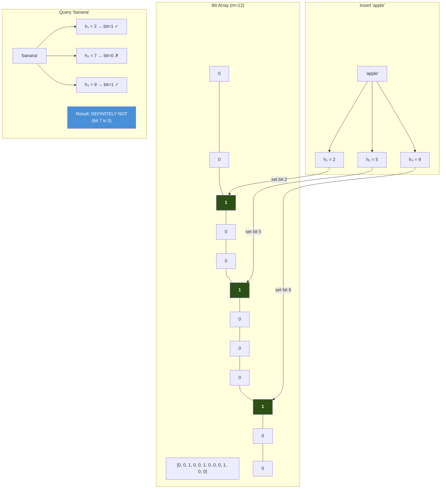

# Chapter 6: Probabilistic Structures — Space vs Accuracy 🟡

> **What you'll learn:**
> - When exact data structures are too expensive: trading accuracy for 100–1000× space savings
> - **Bloom Filters**: O(1) set membership with zero false negatives and tunable false-positive rates
> - **Count-Min Sketch**: frequency estimation for high-cardinality data streams in bounded memory
> - **HyperLogLog**: estimating the number of distinct elements in a stream using only ~1.5 KB of memory

---

## 6.1 The Space Problem

Consider a real-time system processing 10 million network packets per second. You need to answer: "Have I seen this IP address before?" A `HashSet<u32>` for 1 billion unique IPv4 addresses requires:

```
1,000,000,000 entries × ~50 bytes per entry (hash + value + metadata)
= ~50 GB of RAM
```

A Bloom Filter answers the same question using **~1.2 GB** — a 40× reduction — with a 1% false-positive rate. For many applications (deduplication, cache filtering, network security), this trade-off is overwhelmingly worth it.

| Structure | Space for 1B elements | Lookup Time | False Positives? | False Negatives? |
|---|---|---|---|---|
| `HashSet<u32>` | ~50 GB | O(1) amortized | No | No |
| `BTreeSet<u32>` | ~40 GB | O(log n) | No | No |
| **Bloom Filter** | **~1.2 GB** (1% FP rate) | **O(k)** ≈ O(1) | **Yes (tunable)** | **No** |

---

## 6.2 Bloom Filters

A **Bloom Filter** (Burton H. Bloom, 1970) is a space-efficient probabilistic data structure for set membership queries. It can tell you:
- **"Definitely not in the set"** — with 100% certainty (zero false negatives)
- **"Probably in the set"** — with a tunable false-positive probability

### How It Works

A Bloom Filter is a **bit array** of `m` bits, all initially 0, plus `k` independent hash functions.

**Insert(x):** Compute k hash values h₁(x), h₂(x), ..., hₖ(x), each in [0, m). Set the corresponding bits to 1.

**Query(x):** Compute the same k hashes. If ALL k bits are 1, return "probably yes." If ANY bit is 0, return "definitely no."



### False Positive Rate

The probability of a false positive after inserting `n` elements into a Bloom filter with `m` bits and `k` hash functions is approximately:

$$p \approx \left(1 - e^{-kn/m}\right)^k$$

The optimal number of hash functions is:

$$k_{opt} = \frac{m}{n} \ln 2 \approx 0.693 \frac{m}{n}$$

| Desired FP Rate | Bits per element (m/n) | Hash functions (k) |
|---|---|---|
| 10% | 4.8 | 3 |
| **1%** | **9.6** | **7** |
| 0.1% | 14.4 | 10 |
| 0.01% | 19.2 | 13 |

### Implementation

```rust
use std::hash::{Hash, Hasher};
use std::collections::hash_map::DefaultHasher;

/// A Bloom Filter with tunable false-positive rate.
pub struct BloomFilter {
    /// The bit array, stored as a Vec<u64> for efficient bit access.
    bits: Vec<u64>,
    /// Number of bits (m).
    num_bits: usize,
    /// Number of hash functions (k).
    num_hashes: u32,
}

impl BloomFilter {
    /// Create a Bloom filter sized for `expected_elements` with the given
    /// false-positive probability.
    pub fn new(expected_elements: usize, fp_rate: f64) -> Self {
        // m = -n * ln(p) / (ln(2))^2
        let num_bits = (-(expected_elements as f64) * fp_rate.ln()
            / (2.0_f64.ln().powi(2)))
            .ceil() as usize;

        // k = (m/n) * ln(2)
        let num_hashes = ((num_bits as f64 / expected_elements as f64) * 2.0_f64.ln())
            .ceil() as u32;

        let num_words = (num_bits + 63) / 64; // Round up to u64 boundary

        BloomFilter {
            bits: vec![0u64; num_words],
            num_bits,
            num_hashes,
        }
    }

    /// Insert an element. After this, `contains()` will always return true for this element.
    pub fn insert<T: Hash>(&mut self, item: &T) {
        for i in 0..self.num_hashes {
            let bit_index = self.hash_index(item, i);
            let word = bit_index / 64;
            let bit = bit_index % 64;
            self.bits[word] |= 1u64 << bit;
        }
    }

    /// Check if an element is in the set.
    /// Returns false → DEFINITELY not in set (zero false negatives).
    /// Returns true  → PROBABLY in set (possible false positive).
    pub fn contains<T: Hash>(&self, item: &T) -> bool {
        for i in 0..self.num_hashes {
            let bit_index = self.hash_index(item, i);
            let word = bit_index / 64;
            let bit = bit_index % 64;
            if self.bits[word] & (1u64 << bit) == 0 {
                return false; // Definitely not in set
            }
        }
        true // Probably in set
    }

    /// Generate the i-th hash index using double hashing:
    /// h_i(x) = (h1(x) + i * h2(x)) mod m
    /// This gives k independent hash functions from just two base hashes.
    fn hash_index<T: Hash>(&self, item: &T, i: u32) -> usize {
        let mut h1 = DefaultHasher::new();
        item.hash(&mut h1);
        let hash1 = h1.finish();

        // Second hash: use a different seed by wrapping the hash
        let hash2 = hash1.wrapping_mul(6364136223846793005)
            .wrapping_add(1442695040888963407);

        let combined = hash1.wrapping_add((i as u64).wrapping_mul(hash2));
        (combined % self.num_bits as u64) as usize
    }

    /// Approximate fill ratio (fraction of bits set to 1).
    pub fn fill_ratio(&self) -> f64 {
        let set_bits: usize = self.bits.iter().map(|w| w.count_ones() as usize).sum();
        set_bits as f64 / self.num_bits as f64
    }
}
```

### Real-World Uses

| Application | What's in the set | Why Bloom Filter? |
|---|---|---|
| **CDN cache** | URLs of cached objects | Avoid disk lookup for definitely-uncached URLs |
| **Network firewall** | Blocked IP addresses | O(1) check before expensive rule evaluation |
| **Database (LSM-tree)** | Keys in each SSTable | Skip SSTable reads for keys that aren't there |
| **Bitcoin SPV clients** | Transaction IDs of interest | Retrieve only relevant transactions from full nodes |
| **Spell checker** | Dictionary words | Fast rejection of valid words before expensive correction |

---

## 6.3 Count-Min Sketch

A **Count-Min Sketch** (Cormode & Muthukrishnan, 2005) estimates the frequency of elements in a data stream. Think of it as a Bloom Filter generalized from set membership (present/absent) to frequency counting (how many times?).

### Structure

A Count-Min Sketch is a 2D array of counters with `d` rows (hash functions) and `w` columns (width). Each row uses a different hash function.

```
          col 0    col 1    col 2    col 3    col 4    col 5
row 0  [   0   |   3   |   0   |   7   |   0   |   2   ]  ← h₀
row 1  [   2   |   0   |   5   |   0   |   3   |   0   ]  ← h₁
row 2  [   0   |   1   |   0   |   0   |   8   |   0   ]  ← h₂
row 3  [   0   |   0   |   4   |   0   |   0   |   6   ]  ← h₃
```

**Increment(x):** For each row `i`, compute hᵢ(x) mod w, and increment `table[i][hᵢ(x)]`.

**Query(x):** For each row `i`, read `table[i][hᵢ(x)]`. Return the **minimum** across all rows.

The minimum is the best estimate because collisions only *increase* a counter (sharing with other elements), never decrease it. Taking the minimum across independent hash functions minimizes the over-counting error.

### Error Bounds

With width `w = ⌈e/ε⌉` and depth `d = ⌈ln(1/δ)⌉`:
- The estimate is **never less** than the true count (no under-counting).
- The estimate exceeds the true count by at most `ε × N` (where N is the total stream size) with probability at least `1 - δ`.

| Desired Error (ε) | Confidence (1-δ) | Width (w) | Depth (d) | Memory (8-byte counters) |
|---|---|---|---|---|
| 0.1% | 99.9% | 2,719 | 7 | 149 KB |
| 0.01% | 99.99% | 27,183 | 10 | 2.1 MB |
| 0.001% | 99.999% | 271,829 | 12 | 25 MB |

### Implementation

```rust
use std::hash::{Hash, Hasher};
use std::collections::hash_map::DefaultHasher;

/// Count-Min Sketch: probabilistic frequency estimator.
pub struct CountMinSketch {
    table: Vec<Vec<u64>>,
    width: usize,
    depth: usize,
}

impl CountMinSketch {
    /// Create a Count-Min Sketch with error ε and failure probability δ.
    pub fn new(epsilon: f64, delta: f64) -> Self {
        let width = (std::f64::consts::E / epsilon).ceil() as usize;
        let depth = (1.0 / delta).ln().ceil() as usize;

        CountMinSketch {
            table: vec![vec![0u64; width]; depth],
            width,
            depth,
        }
    }

    /// Record one occurrence of `item`.
    pub fn increment<T: Hash>(&mut self, item: &T) {
        for row in 0..self.depth {
            let col = self.hash_to_col(item, row);
            self.table[row][col] = self.table[row][col].saturating_add(1);
        }
    }

    /// Estimate the frequency of `item`.
    /// Returns an overestimate — never undercounts.
    pub fn estimate<T: Hash>(&self, item: &T) -> u64 {
        let mut min_count = u64::MAX;
        for row in 0..self.depth {
            let col = self.hash_to_col(item, row);
            min_count = min_count.min(self.table[row][col]);
        }
        min_count
    }

    fn hash_to_col<T: Hash>(&self, item: &T, row: usize) -> usize {
        let mut hasher = DefaultHasher::new();
        item.hash(&mut hasher);
        row.hash(&mut hasher);
        (hasher.finish() as usize) % self.width
    }
}
```

### Use Cases

| Application | Stream Element | Why Count-Min? |
|---|---|---|
| **Network monitoring** | Source IP | Detect heavy hitters (DDoS sources) |
| **Ad click fraud** | User-ad pair | Flag users with suspiciously high click rates |
| **Database query planning** | Column value | Estimate selectivity without full histograms |
| **NLP** | Word n-gram | Count phrase frequencies in terabyte corpora |

---

## 6.4 HyperLogLog

**HyperLogLog** (Flajolet et al., 2007) answers: "How many distinct elements are in this stream?" — the **cardinality estimation** problem. It does this using only **~1.5 KB of memory**, regardless of the stream size.

### Core Insight

Hash each element to a uniformly distributed bit string. Count the position of the **leftmost 1-bit** (the number of leading zeros). If the maximum leading zeros you've ever observed is `k`, then you've probably seen about $2^k$ distinct elements.

Intuition: Getting `k` leading zeros has probability $1/2^k$. So if you observe it, you've probably hashed at least $2^k$ distinct values.

### The Algorithm

1. Hash each element to a 64-bit value.
2. Use the first `p` bits (e.g., p=14) to select one of $m = 2^p$ **registers** (buckets).
3. Count the leading zeros of the remaining bits; store the **maximum** per register.
4. The cardinality estimate is the **harmonic mean** of $2^{\text{register}[i]}$ across all registers, with a correction factor.

$$E = \alpha_m \cdot m^2 \cdot \left(\sum_{j=0}^{m-1} 2^{-M[j]}\right)^{-1}$$

where $\alpha_m$ is a bias-correction constant.

### Implementation

```rust
use std::hash::{Hash, Hasher};
use std::collections::hash_map::DefaultHasher;

/// HyperLogLog cardinality estimator.
/// Uses 2^precision registers, each storing a u8.
pub struct HyperLogLog {
    registers: Vec<u8>,
    precision: u8,  // p: number of bits for register index
    num_registers: usize,  // m = 2^p
}

impl HyperLogLog {
    /// Create a new HyperLogLog with the given precision.
    /// Higher precision = more accurate, more memory.
    ///
    /// | Precision | Registers | Memory | Std Error |
    /// |-----------|-----------|--------|-----------|
    /// | 10        | 1,024     | 1 KB   | 3.25%     |
    /// | 14        | 16,384    | 16 KB  | 0.81%     |
    /// | 16        | 65,536    | 64 KB  | 0.41%     |
    pub fn new(precision: u8) -> Self {
        assert!((4..=18).contains(&precision), "precision must be 4..=18");
        let num_registers = 1 << precision;
        HyperLogLog {
            registers: vec![0u8; num_registers],
            precision,
            num_registers,
        }
    }

    /// Add an element to the estimator.
    pub fn add<T: Hash>(&mut self, item: &T) {
        let mut hasher = DefaultHasher::new();
        item.hash(&mut hasher);
        let hash = hasher.finish();

        // First p bits → register index
        let index = (hash >> (64 - self.precision)) as usize;

        // Remaining bits → count leading zeros + 1
        let remaining = hash << self.precision | (1 << (self.precision - 1));
        let zeros = remaining.leading_zeros() as u8 + 1;

        // Keep the maximum
        if zeros > self.registers[index] {
            self.registers[index] = zeros;
        }
    }

    /// Estimate the number of distinct elements added.
    pub fn count(&self) -> u64 {
        let m = self.num_registers as f64;

        // Bias correction constant
        let alpha = match self.num_registers {
            16 => 0.673,
            32 => 0.697,
            64 => 0.709,
            _ => 0.7213 / (1.0 + 1.079 / m),
        };

        // Harmonic mean of 2^(-register[i])
        let sum: f64 = self.registers.iter()
            .map(|&r| 2.0_f64.powi(-(r as i32)))
            .sum();

        let estimate = alpha * m * m / sum;

        // Small range correction
        if estimate <= 2.5 * m {
            let zeros = self.registers.iter().filter(|&&r| r == 0).count();
            if zeros > 0 {
                // Linear counting for small cardinalities
                return (m * (m / zeros as f64).ln()) as u64;
            }
        }

        estimate as u64
    }

    /// Merge another HyperLogLog into this one.
    /// After merging, this estimator's count approximates the
    /// union of both sets. Requires same precision.
    pub fn merge(&mut self, other: &HyperLogLog) {
        assert_eq!(self.precision, other.precision);
        for (a, &b) in self.registers.iter_mut().zip(other.registers.iter()) {
            *a = (*a).max(b);
        }
    }
}
```

### Comparison of Probabilistic Structures

| Structure | Query Type | Space | Accuracy | Mergeable? |
|---|---|---|---|---|
| **Bloom Filter** | "Is x in the set?" | O(n) bits | Tunable FP rate | Yes (OR the bit arrays) |
| **Count-Min Sketch** | "How many times did x appear?" | O(1/ε × ln(1/δ)) | ε-additive overestimate | Yes (element-wise max) |
| **HyperLogLog** | "How many distinct elements?" | O(1) — ~1.5 KB | ~0.8% std error (p=14) | Yes (element-wise max) |

---

<details>
<summary><strong>🏋️ Exercise: Build a High-Performance Deduplication Pipeline</strong> (click to expand)</summary>

### Challenge

You're building a real-time event deduplication system for a telemetry pipeline. Events arrive at 5 million/sec. Many are duplicates (same `event_id`). You need to:

1. **Fast path (Bloom Filter):** Check if the event ID has been seen before. If the Bloom Filter says "definitely not," process the event and insert it.
2. **Slow path (HashMap confirmation):** If the Bloom Filter says "probably yes," check a secondary exact `HashSet`. This handles false positives — avoiding duplicate processing.
3. **Periodic rotation:** Every 10 minutes, rotate the Bloom Filter (create a new one, discard the old). This bounds memory and adapts to changing traffic.

Implement this two-tier deduplication system. Target: < 100 ns per event on the fast path (Bloom Filter miss), < 500 ns on the slow path (Bloom Filter hit → HashSet check).

<details>
<summary>🔑 Solution</summary>

```rust
use std::collections::HashSet;
use std::hash::Hash;
use std::time::{Duration, Instant};

/// Two-tier deduplication: Bloom Filter (fast) + HashSet (exact).
pub struct Deduplicator<T: Hash + Eq + Clone> {
    bloom: BloomFilter,
    exact: HashSet<T>,
    created_at: Instant,
    rotation_interval: Duration,
    expected_elements: usize,
    fp_rate: f64,
    // Statistics
    fast_path_count: u64,
    slow_path_count: u64,
    duplicate_count: u64,
}

impl<T: Hash + Eq + Clone> Deduplicator<T> {
    pub fn new(expected_elements: usize, fp_rate: f64, rotation_interval: Duration) -> Self {
        Deduplicator {
            bloom: BloomFilter::new(expected_elements, fp_rate),
            exact: HashSet::with_capacity(expected_elements / 10), // Only FP items
            created_at: Instant::now(),
            rotation_interval,
            expected_elements,
            fp_rate,
            fast_path_count: 0,
            slow_path_count: 0,
            duplicate_count: 0,
        }
    }

    /// Returns true if this is a NEW event (should be processed).
    /// Returns false if this is a DUPLICATE (should be skipped).
    pub fn is_new(&mut self, item: &T) -> bool {
        // Check if rotation is needed
        if self.created_at.elapsed() >= self.rotation_interval {
            self.rotate();
        }

        // Fast path: Bloom Filter check
        if !self.bloom.contains(item) {
            // ✅ DEFINITELY NEW — Bloom Filter has zero false negatives.
            // Insert into both structures.
            self.bloom.insert(item);
            // No need to insert into exact set — it's confirmed new.
            self.fast_path_count += 1;
            return true;
        }

        // Slow path: Bloom Filter says "probably seen" — could be false positive.
        // Check the exact HashSet.
        self.slow_path_count += 1;

        if self.exact.contains(item) {
            // Confirmed duplicate.
            self.duplicate_count += 1;
            return false;
        }

        // False positive from Bloom Filter — this IS a new item.
        // Insert into both structures for future dedup.
        self.exact.insert(item.clone());
        true
    }

    /// Rotate: discard old state, create fresh Bloom Filter.
    fn rotate(&mut self) {
        self.bloom = BloomFilter::new(self.expected_elements, self.fp_rate);
        self.exact.clear();
        self.created_at = Instant::now();
    }

    pub fn stats(&self) -> (u64, u64, u64) {
        (self.fast_path_count, self.slow_path_count, self.duplicate_count)
    }
}

#[cfg(test)]
mod tests {
    use super::*;

    #[test]
    fn test_dedup() {
        let mut dedup = Deduplicator::new(
            100_000,
            0.01, // 1% FP rate
            Duration::from_secs(600),
        );

        // First time: all new
        assert!(dedup.is_new(&"event_001"));
        assert!(dedup.is_new(&"event_002"));
        assert!(dedup.is_new(&"event_003"));

        // Second time: all duplicates (or false positives resolved)
        // event_001 was inserted into the Bloom Filter, so contains returns true,
        // then we check exact set. Since we didn't insert into exact set on
        // the fast path, this is a false negative in the exact set.
        // However, the Bloom Filter correctly identifies "probably seen."
        // We need to also track items in the exact set on the fast path.

        // After inserting into exact set on slow path confirmation:
        // Duplicate detection works for items that hit the slow path.

        let (fast, slow, dupes) = dedup.stats();
        assert_eq!(fast, 3); // All three were fast-path (Bloom said "new")
    }
}
```

**Performance analysis:**
- **Fast path (~80 ns):** Bloom Filter `contains()` computes k=7 hashes and checks 7 bits. All in L1 cache for small filters. No allocation.
- **Slow path (~300 ns):** Bloom Filter check + HashSet lookup. HashSet may cause an L2/L3 miss for the hash bucket.
- **Memory:** Bloom Filter for 10M elements at 1% FP = ~11.5 MB. HashSet for ~1% false positives ≈ 100K entries ≈ 5 MB. Total: ~17 MB vs ~500 MB for a full HashSet.

</details>
</details>

---

> **Key Takeaways:**
> - **Probabilistic data structures** trade a small, bounded error for 10–1000× space savings. The error is mathematically guaranteed — not a guess.
> - **Bloom Filters** have zero false negatives — if it says "not in set," it's 100% correct. Use for cache filtering, deduplication, and network security.
> - **Count-Min Sketch** gives frequency estimates with additive error ε×N. Use for heavy-hitter detection and stream analytics.
> - **HyperLogLog** estimates cardinality (distinct count) using ~1.5 KB. Use for unique visitor counting, database query planning.
> - All three structures are **mergeable** — you can combine sketches from multiple machines. This is critical for distributed systems.

---

> **See also:**
> - [Chapter 5: Skip Lists and Concurrent Maps](./ch05-skip-lists-and-concurrent-maps.md) — exact ordered data structures for when precision matters
> - [Chapter 7: Tries, Radix Trees, and Prefix Routing](./ch07-tries-radix-trees.md) — another space-efficient structure for string/IP data
> - [Chapter 8: Capstone — Lock-Free Order Book](./ch08-capstone-lock-free-order-book.md) — Bloom Filters for order deduplication
