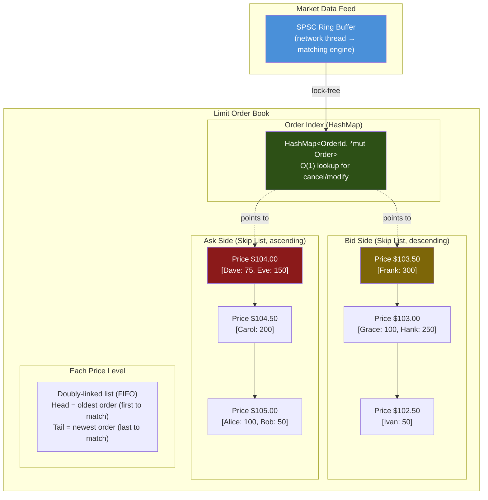
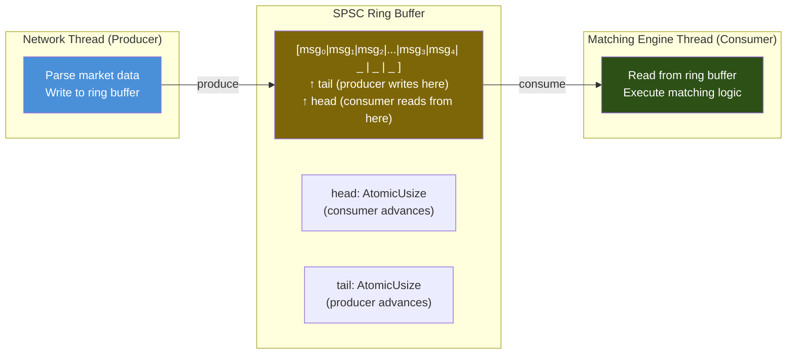

# Chapter 8: Capstone — Design a Lock-Free Order Book 🔴

> **What you'll learn:**
> - The complete architecture of a **Limit Order Book (LOB)** — the data structure at the heart of every financial exchange
> - How to combine Hash Maps (O(1) cancel), Skip Lists (sorted price levels), and FIFO queues (time priority) into a single coherent design
> - **Price-Time priority matching**: the algorithm that determines which orders execute
> - Designing a lock-free **SPSC ring buffer** for market data ingestion, with exact `Acquire`/`Release` semantics explained per atomic operation

---

## 8.1 What Is a Limit Order Book?

Every financial exchange — NYSE, NASDAQ, Binance, CME — maintains a **Limit Order Book (LOB)** for each tradable instrument. The LOB tracks all outstanding buy (bid) and sell (ask) orders, organized by price.

```
        ASKS (sell orders, sorted ascending)
        ┌─────────────────────────────────────┐
        │  Price $105.00  │  100 shares (Alice) │  50 shares (Bob)
        │  Price $104.50  │  200 shares (Carol)
        │  Price $104.00  │  75 shares (Dave)    │  150 shares (Eve)
        ├─────────────────┤
        │     SPREAD      │  ($104.00 - $103.50 = $0.50)
        ├─────────────────┤
        │  Price $103.50  │  300 shares (Frank)
        │  Price $103.00  │  100 shares (Grace)  │  250 shares (Hank)
        │  Price $102.50  │  50 shares (Ivan)
        └─────────────────────────────────────┘
        BIDS (buy orders, sorted descending)

        Best Ask: $104.00 (lowest sell)
        Best Bid: $103.50 (highest buy)
```

### Core Operations

| Operation | Description | Latency Requirement |
|---|---|---|
| **Add Order** | Insert a new limit order at a price level | < 1 µs |
| **Cancel Order** | Remove an existing order by ID | < 1 µs |
| **Match** | When a new order crosses the spread, execute trades | < 1 µs |
| **Best Bid/Ask** | Query the top-of-book prices | < 100 ns |
| **Market Data** | Broadcast order book changes to subscribers | < 5 µs total |

At peak, a modern exchange processes **5–10 million order events per second**. Every operation must complete in single-digit microseconds, with tail latency (p99.9) below 10 µs.

---

## 8.2 Data Structure Design

The LOB requires three access patterns simultaneously:

1. **O(1) order lookup by ID** — for cancel/modify
2. **Sorted price levels** — for matching and best-bid/ask queries
3. **FIFO queue per price level** — for price-time priority

### Architecture



### Data Structures

```rust
use std::collections::HashMap;

/// A unique identifier for each order.
type OrderId = u64;
type Price = u64;   // Price in cents (integer arithmetic, no floating point!)
type Quantity = u32;

#[derive(Debug, Clone, Copy, PartialEq)]
enum Side {
    Buy,
    Sell,
}

/// A single order in the book.
struct Order {
    id: OrderId,
    side: Side,
    price: Price,
    quantity: Quantity,
    timestamp: u64,
    // Doubly-linked list pointers for the price level queue
    prev: Option<OrderId>,
    next: Option<OrderId>,
}

/// A price level contains all orders at a given price, in FIFO order.
struct PriceLevel {
    price: Price,
    total_quantity: Quantity,
    head: Option<OrderId>,  // Oldest order (first to match)
    tail: Option<OrderId>,  // Newest order (last to match)
    order_count: u32,
}

/// The complete Limit Order Book.
pub struct OrderBook {
    /// O(1) order lookup by ID.
    orders: HashMap<OrderId, Order>,

    /// Bid price levels, sorted descending (best bid first).
    /// Key: Price (negated for descending order in BTreeMap, or use a Skip List).
    bids: std::collections::BTreeMap<std::cmp::Reverse<Price>, PriceLevel>,

    /// Ask price levels, sorted ascending (best ask first).
    asks: std::collections::BTreeMap<Price, PriceLevel>,

    /// Monotonic timestamp counter
    timestamp: u64,
}
```

> **Why integer prices?** Floating-point arithmetic is non-associative: `(0.1 + 0.2) + 0.3 ≠ 0.1 + (0.2 + 0.3)`. At nanosecond resolution, a floating-point rounding error can cause orders to match at the wrong price. Every production exchange uses **integer prices** (price in cents, ticks, or satoshis).

---

## 8.3 Price-Time Priority Matching

The matching algorithm is the core of the exchange. When a new order arrives that **crosses the spread** (buy price ≥ best ask, or sell price ≤ best bid), it matches against resting orders.

### Algorithm: Match a New Buy Order

```
match_buy(new_order):
    while new_order.quantity > 0:
        best_ask_level = asks.first()     // O(log n) or O(1) with cached pointer
        if best_ask_level is None:
            break                          // No resting sell orders
        if new_order.price < best_ask_level.price:
            break                          // Price doesn't cross

        // Match against orders at this price level (FIFO = time priority)
        while new_order.quantity > 0 AND best_ask_level has orders:
            resting_order = best_ask_level.head  // Oldest order first

            fill_qty = min(new_order.quantity, resting_order.quantity)
            emit_trade(new_order.id, resting_order.id, fill_qty, resting_order.price)

            new_order.quantity -= fill_qty
            resting_order.quantity -= fill_qty

            if resting_order.quantity == 0:
                remove_order(resting_order)    // O(1) unlink from queue + HashMap

        if best_ask_level.order_count == 0:
            asks.remove(best_ask_level.price)  // O(log n) remove empty level

    if new_order.quantity > 0:
        add_to_book(new_order)                 // Remaining quantity rests in book
```

### Implementation

```rust
#[derive(Debug)]
pub struct Trade {
    buyer_order_id: OrderId,
    seller_order_id: OrderId,
    price: Price,
    quantity: Quantity,
}

impl OrderBook {
    pub fn new() -> Self {
        OrderBook {
            orders: HashMap::new(),
            bids: std::collections::BTreeMap::new(),
            asks: std::collections::BTreeMap::new(),
            timestamp: 0,
        }
    }

    /// Submit a new order. Returns any trades that resulted from matching.
    pub fn submit_order(
        &mut self,
        id: OrderId,
        side: Side,
        price: Price,
        mut quantity: Quantity,
    ) -> Vec<Trade> {
        self.timestamp += 1;
        let mut trades = Vec::new();

        match side {
            Side::Buy => {
                // Match against asks (ascending price)
                while quantity > 0 {
                    let best_ask = match self.asks.first_key_value() {
                        Some((&ask_price, _)) if price >= ask_price => ask_price,
                        _ => break,
                    };

                    let level = self.asks.get_mut(&best_ask).unwrap();
                    self.match_at_level(
                        id, Side::Buy, best_ask,
                        &mut quantity, level, &mut trades,
                    );

                    if level.order_count == 0 {
                        self.asks.remove(&best_ask);
                    }
                }

                // Rest remaining quantity
                if quantity > 0 {
                    self.add_order(id, Side::Buy, price, quantity);
                }
            }
            Side::Sell => {
                // Match against bids (descending price)
                while quantity > 0 {
                    let best_bid = match self.bids.first_key_value() {
                        Some((&std::cmp::Reverse(bid_price), _)) if price <= bid_price => bid_price,
                        _ => break,
                    };

                    let level = self.bids.get_mut(&std::cmp::Reverse(best_bid)).unwrap();
                    self.match_at_level(
                        id, Side::Sell, best_bid,
                        &mut quantity, level, &mut trades,
                    );

                    if level.order_count == 0 {
                        self.bids.remove(&std::cmp::Reverse(best_bid));
                    }
                }

                if quantity > 0 {
                    self.add_order(id, Side::Sell, price, quantity);
                }
            }
        }

        trades
    }

    fn match_at_level(
        &mut self,
        aggressor_id: OrderId,
        aggressor_side: Side,
        match_price: Price,
        remaining: &mut Quantity,
        level: &mut PriceLevel,
        trades: &mut Vec<Trade>,
    ) {
        while *remaining > 0 {
            let resting_id = match level.head {
                Some(id) => id,
                None => break,
            };

            let resting = self.orders.get_mut(&resting_id).unwrap();
            let fill_qty = (*remaining).min(resting.quantity);

            let (buyer_id, seller_id) = match aggressor_side {
                Side::Buy  => (aggressor_id, resting_id),
                Side::Sell => (resting_id, aggressor_id),
            };

            trades.push(Trade {
                buyer_order_id: buyer_id,
                seller_order_id: seller_id,
                price: match_price,
                quantity: fill_qty,
            });

            *remaining -= fill_qty;
            resting.quantity -= fill_qty;
            level.total_quantity -= fill_qty;

            if resting.quantity == 0 {
                // Remove fully filled order from the level's linked list
                let next = resting.next;
                level.head = next;
                if next.is_none() {
                    level.tail = None;
                } else if let Some(next_order) = self.orders.get_mut(&next.unwrap()) {
                    next_order.prev = None;
                }
                level.order_count -= 1;
                self.orders.remove(&resting_id);
            }
        }
    }

    fn add_order(&mut self, id: OrderId, side: Side, price: Price, quantity: Quantity) {
        let order = Order {
            id,
            side,
            price,
            quantity,
            timestamp: self.timestamp,
            prev: None,
            next: None,
        };

        // Get or create the price level
        let level = match side {
            Side::Buy => self.bids
                .entry(std::cmp::Reverse(price))
                .or_insert_with(|| PriceLevel {
                    price,
                    total_quantity: 0,
                    head: None,
                    tail: None,
                    order_count: 0,
                }),
            Side::Sell => self.asks
                .entry(price)
                .or_insert_with(|| PriceLevel {
                    price,
                    total_quantity: 0,
                    head: None,
                    tail: None,
                    order_count: 0,
                }),
        };

        // Append to tail of the level's FIFO queue
        let mut order = order;
        order.prev = level.tail;
        if let Some(tail_id) = level.tail {
            if let Some(tail_order) = self.orders.get_mut(&tail_id) {
                tail_order.next = Some(id);
            }
        } else {
            level.head = Some(id);
        }
        level.tail = Some(id);
        level.total_quantity += quantity;
        level.order_count += 1;

        self.orders.insert(id, order);
    }

    /// Cancel an order by ID. O(1) lookup + O(1) unlink.
    pub fn cancel_order(&mut self, id: OrderId) -> bool {
        let order = match self.orders.remove(&id) {
            Some(o) => o,
            None => return false,
        };

        // Unlink from the price level's doubly-linked list
        if let Some(prev_id) = order.prev {
            if let Some(prev) = self.orders.get_mut(&prev_id) {
                prev.next = order.next;
            }
        }
        if let Some(next_id) = order.next {
            if let Some(next) = self.orders.get_mut(&next_id) {
                next.prev = order.prev;
            }
        }

        // Update the price level
        let level = match order.side {
            Side::Buy => self.bids.get_mut(&std::cmp::Reverse(order.price)),
            Side::Sell => self.asks.get_mut(&order.price),
        };

        if let Some(level) = level {
            if level.head == Some(id) {
                level.head = order.next;
            }
            if level.tail == Some(id) {
                level.tail = order.prev;
            }
            level.total_quantity -= order.quantity;
            level.order_count -= 1;

            // Remove empty price level
            if level.order_count == 0 {
                match order.side {
                    Side::Buy => { self.bids.remove(&std::cmp::Reverse(order.price)); }
                    Side::Sell => { self.asks.remove(&order.price); }
                }
            }
        }

        true
    }

    /// Get the best bid price. O(1) for BTreeMap (cached min).
    pub fn best_bid(&self) -> Option<Price> {
        self.bids.first_key_value().map(|(&std::cmp::Reverse(p), _)| p)
    }

    /// Get the best ask price. O(1) for BTreeMap (cached min).
    pub fn best_ask(&self) -> Option<Price> {
        self.asks.first_key_value().map(|(&p, _)| p)
    }
}
```

---

## 8.4 Lock-Free SPSC Ring Buffer

The matching engine receives market data from the network thread. This is the hottest path in the system. We cannot use a `Mutex` (adds ~25 ns per message) or even a channel (dynamic allocation per message). We need a **Single-Producer Single-Consumer (SPSC) ring buffer** — the fastest possible inter-thread communication mechanism.

### Architecture



### Why SPSC?

| IPC Mechanism | Latency per message | Allocation? | Lock? |
|---|---|---|---|
| `std::sync::mpsc` | ~100–500 ns | Yes (per node) | No (lock-free internally), but allocates |
| `crossbeam::channel` | ~50–200 ns | Bounded: no, Unbounded: yes | Lock-free |
| `Mutex<VecDeque>` | ~25–50 ns (uncontended) | Amortized | **Yes** |
| **SPSC Ring Buffer** | **~5–15 ns** | **Never** | **No** |

The SPSC ring buffer wins because:
1. **No allocation** — fixed-size array, pre-allocated.
2. **No locking** — only two atomics (`head`, `tail`), each written by one thread.
3. **No false sharing** — `head` (read by producer, written by consumer) and `tail` (read by consumer, written by producer) are on separate cache lines.
4. **Excellent cache performance** — sequential writes and reads = prefetcher-friendly.

### Implementation

```rust
use std::sync::atomic::{AtomicUsize, Ordering};
use std::cell::UnsafeCell;
use std::mem::MaybeUninit;

/// A lock-free Single-Producer Single-Consumer ring buffer.
///
/// Memory ordering contract:
/// - Producer writes `tail` with Release: ensures the buffer slot write
///   is visible before the consumer sees the advanced tail.
/// - Consumer writes `head` with Release: ensures the buffer slot is fully
///   read before the producer sees the advanced head (and potentially overwrites).
/// - Cross-thread reads use Acquire to establish happens-before edges.
pub struct SpscRingBuffer<T, const N: usize> {
    /// The buffer slots. UnsafeCell because producer and consumer access
    /// different slots concurrently.
    buffer: [UnsafeCell<MaybeUninit<T>>; N],

    /// Index of the next slot to be read by the consumer.
    /// Written by consumer, read by producer.
    #[repr(align(64))]  // ✅ Separate cache line from tail
    head: CacheAligned<AtomicUsize>,

    /// Index of the next slot to be written by the producer.
    /// Written by producer, read by consumer.
    #[repr(align(64))]  // ✅ Separate cache line from head
    tail: CacheAligned<AtomicUsize>,
}

#[repr(align(64))]
struct CacheAligned<T>(T);

// SAFETY: Only one producer and one consumer access the buffer concurrently.
// The producer writes to `buffer[tail % N]` and advances `tail`.
// The consumer reads from `buffer[head % N]` and advances `head`.
// These never overlap as long as the buffer is not full/empty,
// which is enforced by the head/tail checks.
unsafe impl<T: Send, const N: usize> Send for SpscRingBuffer<T, N> {}
unsafe impl<T: Send, const N: usize> Sync for SpscRingBuffer<T, N> {}

impl<T, const N: usize> SpscRingBuffer<T, N> {
    /// Create a new ring buffer with capacity N.
    /// N must be a power of 2 for efficient modular arithmetic.
    pub fn new() -> Self {
        assert!(N.is_power_of_two(), "Capacity must be a power of 2");
        assert!(N >= 2, "Capacity must be at least 2");

        // SAFETY: MaybeUninit doesn't require initialization
        let buffer = unsafe {
            let mut arr: [UnsafeCell<MaybeUninit<T>>; N] =
                MaybeUninit::uninit().assume_init();
            for slot in &mut arr {
                *slot = UnsafeCell::new(MaybeUninit::uninit());
            }
            arr
        };

        SpscRingBuffer {
            buffer,
            head: CacheAligned(AtomicUsize::new(0)),
            tail: CacheAligned(AtomicUsize::new(0)),
        }
    }

    /// Try to push an item into the buffer.
    /// Returns Err(item) if the buffer is full.
    ///
    /// # Memory Ordering
    /// - `self.head.load(Acquire)`: Creates a happens-before edge from the
    ///   consumer's last `head.store(Release)`. This ensures we see the
    ///   consumer has finished reading the slot before we overwrite it.
    /// - `self.tail.store(Release)`: Creates a happens-before edge to the
    ///   consumer's next `tail.load(Acquire)`. This ensures the buffer
    ///   write is visible before the consumer tries to read it.
    ///
    /// SAFETY: Must only be called from the single producer thread.
    pub fn try_push(&self, item: T) -> Result<(), T> {
        let tail = self.tail.0.load(Ordering::Relaxed); // Only we write tail
        let head = self.head.0.load(Ordering::Acquire);  // Sync with consumer

        // Check if full: if advancing tail would bump into head
        if tail.wrapping_sub(head) >= N {
            return Err(item); // Buffer full
        }

        // Write the item to the slot
        let slot = tail & (N - 1); // Efficient modulo for power-of-2
        unsafe {
            (*self.buffer[slot].get()).write(item);
        }

        // Advance tail. Release ensures the slot write above is visible
        // before the consumer sees the new tail value.
        self.tail.0.store(tail.wrapping_add(1), Ordering::Release);

        Ok(())
    }

    /// Try to pop an item from the buffer.
    /// Returns None if the buffer is empty.
    ///
    /// # Memory Ordering
    /// - `self.tail.load(Acquire)`: Creates a happens-before edge from the
    ///   producer's last `tail.store(Release)`. This ensures we see the
    ///   data the producer wrote to the slot.
    /// - `self.head.store(Release)`: Creates a happens-before edge to the
    ///   producer's next `head.load(Acquire)`. This ensures we've finished
    ///   reading the slot before the producer overwrites it.
    ///
    /// SAFETY: Must only be called from the single consumer thread.
    pub fn try_pop(&self) -> Option<T> {
        let head = self.head.0.load(Ordering::Relaxed); // Only we write head
        let tail = self.tail.0.load(Ordering::Acquire);  // Sync with producer

        // Check if empty
        if head == tail {
            return None; // Buffer empty
        }

        // Read the item from the slot
        let slot = head & (N - 1);
        let item = unsafe {
            (*self.buffer[slot].get()).assume_init_read()
        };

        // Advance head. Release ensures the slot read above is complete
        // before the producer sees the new head value and potentially
        // overwrites this slot.
        self.head.0.store(head.wrapping_add(1), Ordering::Release);

        Some(item)
    }

    /// Number of items currently in the buffer. Approximate — may race with
    /// concurrent push/pop.
    pub fn len(&self) -> usize {
        let tail = self.tail.0.load(Ordering::Relaxed);
        let head = self.head.0.load(Ordering::Relaxed);
        tail.wrapping_sub(head)
    }

    pub fn is_empty(&self) -> bool {
        self.len() == 0
    }

    pub fn is_full(&self) -> bool {
        self.len() >= N
    }
}

impl<T, const N: usize> Drop for SpscRingBuffer<T, N> {
    fn drop(&mut self) {
        // Drop any remaining items
        while self.try_pop().is_some() {}
    }
}
```

### Memory Ordering Analysis

The ring buffer uses exactly four atomic operations. Here's why each ordering is correct and minimal:

| Operation | Thread | Ordering | Reason |
|---|---|---|---|
| `tail.load()` in `try_push` | Producer | `Relaxed` | Producer is the sole writer of `tail` — it always sees its own latest value |
| `head.load()` in `try_push` | Producer | `Acquire` | Must synchronize with consumer's `Release` store to `head` — ensures slot is free |
| `tail.store()` in `try_push` | Producer | `Release` | Must synchronize with consumer's `Acquire` load of `tail` — ensures slot data is visible |
| `head.load()` in `try_pop` | Consumer | `Relaxed` | Consumer is the sole writer of `head` — it always sees its own latest value |
| `tail.load()` in `try_pop` | Consumer | `Acquire` | Must synchronize with producer's `Release` store to `tail` — ensures slot data is visible |
| `head.store()` in `try_pop` | Consumer | `Release` | Must synchronize with producer's `Acquire` load of `head` — ensures slot is fully read |

> **Why not `SeqCst`?** None of these operations involve multi-variable invariants across threads. Each pair (head/tail) forms an independent Release-Acquire channel. Using `SeqCst` would add an `MFENCE` on x86 (~20 cycles per op) for zero correctness benefit.

---

## 8.5 Putting It All Together: The Matching Engine Pipeline


### The Complete Event Loop

```rust
/// An event from the network thread to the matching engine.
#[derive(Debug, Clone)]
enum OrderEvent {
    NewOrder {
        id: OrderId,
        side: Side,
        price: Price,
        quantity: Quantity,
    },
    CancelOrder {
        id: OrderId,
    },
}

/// The matching engine: single-threaded, processes events from the ring buffer.
struct MatchingEngine {
    book: OrderBook,
    // In production: multiple books per instrument
}

impl MatchingEngine {
    fn new() -> Self {
        MatchingEngine {
            book: OrderBook::new(),
        }
    }

    /// Process a single event. Returns trades if any.
    fn process(&mut self, event: OrderEvent) -> Vec<Trade> {
        match event {
            OrderEvent::NewOrder { id, side, price, quantity } => {
                self.book.submit_order(id, side, price, quantity)
            }
            OrderEvent::CancelOrder { id } => {
                self.book.cancel_order(id);
                Vec::new()
            }
        }
    }

    /// Main event loop: spin on the ring buffer.
    fn run(
        &mut self,
        input: &SpscRingBuffer<OrderEvent, 65536>,
        // In production: output ring buffer for trades
    ) {
        loop {
            match input.try_pop() {
                Some(event) => {
                    let trades = self.process(event);
                    for trade in &trades {
                        // In production: push to output ring buffer for
                        // market data publisher thread
                        println!("TRADE: {:?}", trade);
                    }
                }
                None => {
                    // No event available. In HFT, we BUSY-WAIT (spin).
                    // In non-latency-critical systems, use:
                    //   std::thread::park() or crossbeam's Parker
                    std::hint::spin_loop();
                }
            }
        }
    }
}
```

---

## 8.6 Latency Budget

| Component | Expected Latency | Notes |
|---|---|---|
| Network → Ring Buffer (push) | ~10 ns | SPSC push with Release store |
| Ring Buffer → Engine (pop) | ~10 ns | SPSC pop with Acquire load |
| HashMap order lookup | ~20–50 ns | Cache-warm, low collision rate |
| BTreeMap price level lookup | ~50–100 ns | O(log P) where P is number of distinct prices |
| Order insertion/removal | ~10–20 ns | Doubly-linked list pointer manipulation |
| **Total wire-to-trade** | **~100–200 ns** | Without kernel-bypass networking |
| With DPDK kernel-bypass | **~50–100 ns** | Eliminates syscall overhead |

---

<details>
<summary><strong>🏋️ Exercise: Design a Full Exchange System</strong> (click to expand)</summary>

### Challenge

You are the lead architect for a new cryptocurrency exchange. Design the complete system architecture, answering:

1. **Data Structures:** For each of the following, specify the exact data structure and why:
   - Order storage (by ID): `___`
   - Price level organization: `___`
   - Time-priority queue per level: `___`
   - Market data output buffer: `___`

2. **Threading Model:** Draw the thread topology. How many threads? Which are pinned to which cores? What is the communication mechanism between each pair?

3. **Memory Ordering:** For the SPSC ring buffer between the network thread and the matching engine, specify the exact `Ordering` for each atomic operation and justify each choice.

4. **Fault Tolerance:** The matching engine must survive a crash and restart. How do you persist the order book state without adding latency to the hot path?

5. **Capacity Planning:** If the exchange processes 1 million orders/second with an average of 100 active price levels and 10,000 resting orders, estimate the total memory footprint.

<details>
<summary>🔑 Solution</summary>

### 1. Data Structures

| Component | Data Structure | Justification |
|---|---|---|
| **Order storage** | `HashMap<OrderId, Order>` | O(1) cancel/modify by ID. Pre-sized for expected max orders. |
| **Price levels** | `BTreeMap<Price, PriceLevel>` or Skip List | O(log P) lookup, O(1) cached best-bid/ask. Skip List for lock-free variant. |
| **Time-priority queue** | Intrusive doubly-linked list per price level | O(1) append (new orders), O(1) removal (cancels/fills). Intrusive = no allocation. |
| **Market data output** | SPSC Ring Buffer (matching → publisher) | Lock-free, zero allocation, predictable latency. |
| **Order deduplication** | Bloom Filter for recent OrderIDs | Prevent replayed messages from executing twice. |

### 2. Threading Model

```
Core 0: Network RX (pinned)
  ↓ SPSC Ring Buffer (lock-free)
Core 1: Matching Engine (pinned)  ← THE critical path
  ↓ SPSC Ring Buffer (lock-free)
Core 2: Market Data Publisher (pinned)
  ↓ SPSC Ring Buffer
Core 3: Order Persistence (WAL writer)
  ↓ SPSC Ring Buffer
Core 4: Risk/Margin Engine
  ↓ Shared-nothing message passing
Core 5-7: Client gateway threads (one per connected client group)
```

All communication is via SPSC ring buffers — no shared mutable state, no locks. The matching engine is **single-threaded** by design: multi-threaded matching introduces ordering hazards that are worse than the latency of a single fast thread.

### 3. Memory Ordering

(See Section 8.4 table — identical reasoning applies.)

| Operation | Ordering | Justification |
|---|---|---|
| Producer reads own tail | `Relaxed` | Single-writer self-read |
| Producer reads consumer's head | `Acquire` | Synchronize with consumer's Release |
| Producer writes tail | `Release` | Ensure data write is visible |
| Consumer reads own head | `Relaxed` | Single-writer self-read |
| Consumer reads producer's tail | `Acquire` | Ensure data write is visible |
| Consumer writes head | `Release` | Ensure read is complete before producer overwrites |

### 4. Fault Tolerance

Use a **Write-Ahead Log (WAL):**
- After each order event is processed, the matching engine pushes the event to a persistence ring buffer (→ Core 3).
- Core 3 writes events to a sequential log file using `O_DIRECT` (bypass kernel page cache) and `io_uring` for async I/O.
- On crash recovery: replay the WAL from the last checkpoint to rebuild the order book.
- **Key insight:** Persistence is on a separate thread and does NOT add latency to the matching hot path. The matching engine fires-and-forgets into the ring buffer.

### 5. Capacity Planning

| Component | Estimate |
|---|---|
| `Order` struct | ~80 bytes × 10,000 orders = ~800 KB |
| `HashMap` overhead | ~16 bytes/entry × 10,000 = ~160 KB |
| `PriceLevel` structs | ~64 bytes × 100 levels = ~6.4 KB |
| `BTreeMap` overhead | ~48 bytes/node × 100 = ~4.8 KB |
| SPSC Ring Buffer (64K slots) | ~5 MB (depends on message size) |
| **Total hot data** | **~6 MB** — fits entirely in L3 cache |

This is the secret to HFT performance: the entire order book fits in L3 cache. Every operation is L1/L2 cache-warm. No disk I/O, no GC pauses, no lock contention.

</details>
</details>

---

> **Key Takeaways:**
> - A **Limit Order Book** combines three data structures: HashMap (O(1) cancel), sorted map (O(log n) price levels), and FIFO queue (time priority per level).
> - **Price-Time priority** matching walks the sorted price levels and processes orders within each level in FIFO order. Integer prices avoid floating-point hazards.
> - An **SPSC ring buffer** is the fastest inter-thread communication mechanism: ~10 ns per message, zero allocation, lock-free. The key is `Acquire`/`Release` ordering on `head`/`tail` indices.
> - The entire hot path — parsing, ring buffer transit, matching — completes in **100–200 ns**. The order book fits in L3 cache (~6 MB for 10K orders).
> - Real exchange systems are **single-threaded matching engines** connected by lock-free ring buffers. Multi-threaded matching is harder and slower.

---

> **See also:**
> - [Chapter 2: Atomic Memory Ordering](./ch02-atomic-memory-ordering.md) — the Acquire/Release theory behind the ring buffer
> - [Chapter 3: CAS and the ABA Problem](./ch03-cas-and-aba-problem.md) — CAS-based alternatives for multi-producer scenarios
> - [Chapter 5: Skip Lists and Concurrent Maps](./ch05-skip-lists-and-concurrent-maps.md) — skip list variant of the price level index
> - [Chapter 6: Probabilistic Structures](./ch06-probabilistic-structures.md) — Bloom Filters for order deduplication
