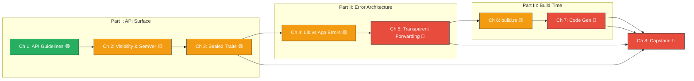

# Rust API Design & Error Architecture: Building Bulletproof Crates

## Speaker Intro

I'm a core library maintainer who has spent the last decade building foundational crates — from serialization frameworks downloaded millions of times per month, to internal platform SDKs consumed by hundreds of teams across a monorepo. I've reviewed over a thousand pull requests where a "trivial" public API change triggered a cascade of downstream build failures. I've debugged error chains that were five wrappers deep and still told the user absolutely nothing. I've watched a well-intentioned `build.rs` add 90 seconds to every incremental compile.

This guide distills the hard-won lessons from those experiences into a structured curriculum. It is not a tour of Rust syntax — you already know that. It is a deep-dive into the *craft* of designing APIs that are impossible to misuse, errors that are impossible to misdiagnose, and build scripts that stay out of the way.

---

## Who This Is For

This guide is for **senior engineers** who are writing:

- **Open-source crates** that will be consumed by thousands of downstream users who cannot ask you questions on Slack.
- **Internal foundational libraries** in large monorepos where a breaking change means filing 200 migration tickets.
- **SDK wrappers** around gRPC, REST, or database services that must hide internal protocol complexity behind a clean Rust API.
- **Build-time code generators** that produce Rust types from Protobuf, FlatBuffers, or custom schema languages.

You should already be comfortable with:

| Concept | Where to Learn |
|---------|---------------|
| Ownership, borrowing, and lifetimes | [Rust Memory Management](../memory-management-book/src/SUMMARY.md) |
| Traits, generics, and associated types | [Rust's Type System & Traits](../type-system-traits-book/src/SUMMARY.md) |
| Declarative and procedural macros | [Rust Metaprogramming](../metaprogramming-book/src/SUMMARY.md) |
| Cargo workspaces and basic tooling | [Ecosystem, Tooling & Profiling](../tooling-profiling-book/src/SUMMARY.md) |
| `async`/`.await` fundamentals | [Async Rust](../async-book/src/SUMMARY.md) |

If you're still fighting the borrow checker, start with the Memory Management book. This guide assumes you've won that fight and are ready to focus on *design*.

---

## How to Use This Book

| Emoji | Meaning |
|-------|---------|
| 🟢 | **Foundational** — concepts every crate author must know |
| 🟡 | **Applied** — patterns that require judgment and context |
| 🔴 | **Advanced** — deep internals, production edge cases |

Every chapter follows the same structure:

1. **What you'll learn** — 3–4 concrete outcomes.
2. **The Clunky Way vs. The Idiomatic Way** — side-by-side code showing the evolution.
3. **SemVer Hazard callouts** — code that compiles but will break your users on the next release, marked with `// 💥 SEMVER HAZARD:`.
4. **Exercise** — a hands-on challenge with a hidden, heavily-commented solution.
5. **Key Takeaways** — the 3–4 sentences you'd write in a code review comment.

---

## Pacing Guide

| Chapters | Topic | Time | Checkpoint |
|----------|-------|------|------------|
| Ch 1 | The Rust API Guidelines | 1–2 hours | Can you name 5 C-x rules from memory? |
| Ch 2–3 | Visibility, SemVer, Sealed Traits | 3–4 hours | Can you add a field to your struct without breaking downstream? |
| Ch 4–5 | Error Architecture | 3–4 hours | Can you design a library error enum that never leaks dependencies? |
| Ch 6–7 | `build.rs` and Code Generation | 3–4 hours | Can you compile a C library and generate types from a `.proto` file? |
| Ch 8 | Capstone | 4–6 hours | Can you build a complete SDK that passes all the checks above? |

**Total: 14–20 hours** for the full curriculum, or ~3 days of focused study.

---

## Table of Contents

### Part I: The Art of the Rust API

Your public API *is* your product. These chapters teach you the official Rust API Guidelines, how to use Rust's visibility system to enforce encapsulation across crate boundaries, and the Sealed Trait pattern for protecting invariants.

- **Chapter 1: The Rust API Guidelines (C-x Rules) 🟢** — Naming conventions, interoperability traits, and why `impl Iterator` beats `Vec` at the API boundary.
- **Chapter 2: Visibility, Encapsulation, and SemVer 🟡** — `pub`, `pub(crate)`, `#[non_exhaustive]`, and the art of making future changes non-breaking.
- **Chapter 3: The Sealed Trait Pattern 🟡** — Public traits that downstream users can call but cannot implement. Protecting invariants from rogue implementations.

### Part II: Advanced Error Architecture

Errors are the other half of your API. These chapters teach the fundamental split between library errors and application errors, and how to propagate context without leaking implementation details.

- **Chapter 4: The Great Divide: Libraries vs. Applications 🟡** — Why `anyhow` in a library is a SemVer hazard. Structuring errors with `thiserror`.
- **Chapter 5: Transparent Forwarding and Context 🔴** — `#[error(transparent)]`, boxing internal errors, backtrace capture, and the `error_generic_member_access` nightly feature.

### Part III: Metaprogramming at Build Time (`build.rs`)

`build.rs` is Rust's escape hatch for doing work at compile time that procedural macros cannot. These chapters teach the build script lifecycle, Cargo communication protocol, and real-world code generation patterns.

- **Chapter 6: Mastering `build.rs` 🟡** — The compilation lifecycle, `cargo:` instructions, environment variables, and conditional compilation.
- **Chapter 7: C-Interop and Code Generation 🔴** — The `cc` crate for compiling C/C++, `pkg-config` for system libraries, and `prost`/`tonic-build` for Protobuf.

### Part IV: Capstone Project

- **Chapter 8: Capstone: Building a Production-Grade SDK 🔴** — Synthesize every technique into a single, bulletproof SDK.

### Appendices

- **Appendix A: API Design Reference Card** — Cheat sheets for naming conventions, SemVer breaking changes, and `build.rs` Cargo instructions.

---

---

## Companion Guides

This book is designed to be read alongside:

- [**Rust Metaprogramming**](../metaprogramming-book/src/SUMMARY.md) — for deeper proc-macro patterns beyond `build.rs`.
- [**Rust's Type System & Traits**](../type-system-traits-book/src/SUMMARY.md) — for the trait system foundations that underpin sealed traits and builder patterns.
- [**Rust Ecosystem, Tooling & Profiling**](../tooling-profiling-book/src/SUMMARY.md) — for Cargo workspace management and benchmarking.
- [**Rust Architecture & Design Patterns**](../architecture-book/src/SUMMARY.md) — for broader architectural patterns like Typestate and Hexagonal Architecture.
- [**Unsafe Rust & FFI**](../unsafe-ffi-book/src/SUMMARY.md) — for the `unsafe` foundations that Chapter 7's C-interop builds upon.

Let's begin.
