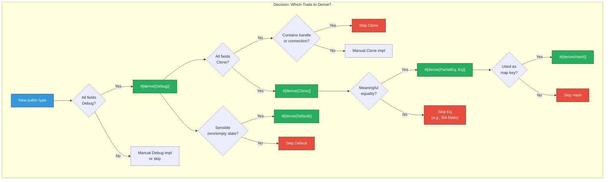

# 1. The Rust API Guidelines (C-x Rules) 🟢

> **What you'll learn:**
> - The official Rust API Guidelines and their `C-x` naming convention — what they are, why they exist, and how to audit your crate against them.
> - Naming conventions that make your API instantly recognizable to any Rust developer (`C-CONV`, `C-GETTER`, `C-ITER`).
> - The "standard interoperability traits" every public type should implement (`Debug`, `Clone`, `Default`, `Eq`, `Hash`, `Send`, `Sync`).
> - Why returning `impl Iterator` at API boundaries is almost always superior to returning a `Vec`.

**Cross-references:** This chapter provides the naming and trait foundation for the visibility rules in [Chapter 2](ch02-visibility-encapsulation-semver.md) and the error types in [Chapter 4](ch04-libraries-vs-applications.md).

---

## Why API Guidelines Exist

When you write an internal function, the audience is you and your team. When you publish a crate, the audience is *every Rust developer on earth*. They will never read your source code. They will read your function signatures, your type names, your error messages, and your documentation — in that order.

The [Rust API Guidelines](https://rust-lang.github.io/api-guidelines/) are a checklist maintained by the Rust library team. Each rule has a short code like `C-COMMON-TRAITS` or `C-GETTER`. Think of them as a code review rubric: if your crate violates a rule, experienced Rust developers will *feel* that something is wrong, even if they can't articulate why.

This chapter covers the rules that trip up the most developers.

---

## Naming Conventions (C-CASE, C-CONV)

Rust has strong conventions for casing and naming. Violating them doesn't just look wrong — it triggers compiler warnings and confuses IDE tooling.

| Item | Convention | Example | Rule |
|------|-----------|---------|------|
| Crate name | `snake_case` (with hyphens in Cargo.toml, underscores in code) | `my_crate` | C-CASE |
| Types (struct, enum, trait) | `UpperCamelCase` | `HttpClient`, `ParseError` | C-CASE |
| Functions, methods | `snake_case` | `from_bytes`, `into_inner` | C-CASE |
| Constants, statics | `SCREAMING_SNAKE_CASE` | `MAX_RETRIES`, `DEFAULT_PORT` | C-CASE |
| Type parameters | Short `UpperCamelCase` | `T`, `K`, `V`, `Item` | C-CASE |
| Lifetimes | Short, lowercase | `'a`, `'de`, `'conn` | C-CASE |
| Feature flags | `snake_case`, no default prefix | `serde`, `async`, `tls` | C-CASE |

### Conversion Method Naming (C-CONV)

Rust has precise conventions for methods that convert between types. Using the wrong prefix is a SemVer hazard because it misleads users about ownership semantics.

| Prefix | Ownership | Cost | Example |
|--------|----------|------|---------|
| `as_` | Borrows `&self` | Free (reinterpret) | `fn as_bytes(&self) -> &[u8]` |
| `to_` | Borrows `&self` | Expensive (allocates) | `fn to_string(&self) -> String` |
| `into_` | Consumes `self` | Variable | `fn into_inner(self) -> T` |
| `from_` | Static constructor | Variable | `fn from_bytes(b: &[u8]) -> Self` |

```rust
// 💥 SEMVER HAZARD: Using `to_` for a free, non-allocating conversion
impl MyBuffer {
    pub fn to_bytes(&self) -> &[u8] {  // 💥 Misleading: implies allocation
        &self.inner
    }
}

// ✅ FIX: Use `as_` for cheap borrows
impl MyBuffer {
    pub fn as_bytes(&self) -> &[u8] {  // ✅ Correct: cheap borrow, no allocation
        &self.inner
    }
}
```

### Getter Naming (C-GETTER)

In Rust, getters do **not** use a `get_` prefix. The field name *is* the getter name.

```rust
// ❌ The Clunky Way: Java-style getters
impl Config {
    pub fn get_timeout(&self) -> Duration { self.timeout }
    pub fn get_retries(&self) -> u32 { self.retries }
}

// ✅ The Idiomatic Rust Way: field-name getters
impl Config {
    pub fn timeout(&self) -> Duration { self.timeout }
    pub fn retries(&self) -> u32 { self.retries }
}
```

The one exception: `get` is acceptable when the method performs a lookup by key (like `HashMap::get`).

### Iterator Method Naming (C-ITER)

Collections should provide `iter()`, `iter_mut()`, and `into_iter()` methods following the standard convention:

| Method | Returns | Borrows |
|--------|---------|---------|
| `iter()` | `impl Iterator<Item = &T>` | `&self` |
| `iter_mut()` | `impl Iterator<Item = &mut T>` | `&mut self` |
| `into_iter()` | `impl Iterator<Item = T>` | `self` (consumed) |

---

## Standard Interoperability Traits (C-COMMON-TRAITS)

Every public type in your crate should implement as many of these traits as semantically appropriate. Missing a common trait is the #1 source of "why can't I use this type in a `HashMap`?" issues.

| Trait | Why it matters | Derive? |
|-------|---------------|---------|
| `Debug` | Required for `{:?}` formatting, `unwrap()` messages, and test output | `#[derive(Debug)]` — almost always |
| `Clone` | Lets users duplicate values. Required for many generic bounds | `#[derive(Clone)]` if all fields are `Clone` |
| `Default` | Enables `..Default::default()` struct update syntax and builder patterns | `#[derive(Default)]` or manual impl |
| `PartialEq` / `Eq` | Required for `assert_eq!` in tests and collection lookups | `#[derive(PartialEq, Eq)]` |
| `Hash` | Required for using the type as a `HashMap` or `HashSet` key | `#[derive(Hash)]` — requires `Eq` |
| `Send` | Allows transfer across thread boundaries. Auto-implemented unless you use `Rc`, raw pointers, etc. | Automatic |
| `Sync` | Allows shared references across threads. Auto-implemented for most types. | Automatic |
| `Display` | User-facing formatting. Required for `Error` types. | Manual impl |
| `Serialize` / `Deserialize` | De facto standard for data interchange (behind a `serde` feature flag) | `#[derive(Serialize, Deserialize)]` |

### The "Derive Everything" Anti-Pattern

Deriving every trait on every type is not the answer. Be intentional:

```rust
// 💥 SEMVER HAZARD: Deriving traits you can't maintain
#[derive(Debug, Clone, PartialEq, Eq, Hash, Default)]
pub struct DatabaseConnection {
    pool: sqlx::PgPool,  // 💥 PgPool doesn't impl Eq or Hash!
    // This compiles today, but only because the derive
    // doesn't check trait bounds until someone *uses* the trait.
}

// ✅ FIX: Only derive traits your fields actually support
#[derive(Debug, Clone)]
pub struct DatabaseConnection {
    pool: sqlx::PgPool,
}
```



---

## Return `impl Iterator`, Not `Vec` (C-CALLER-DECIDES)

One of the most impactful API guidelines: **let the caller decide how to collect**. If your function computes a sequence of items, return an iterator — not a pre-collected `Vec`.

### Why?

| `Vec` return | `impl Iterator` return |
|-------------|----------------------|
| Always allocates | Zero allocation until collected |
| Caller must re-iterate to filter/map | Caller chains `.filter()`, `.map()`, `.take()` — fused into one pass |
| Forces the caller to own the data | Lazy — can stop early with `.next()` or `.take(5)` |
| Locked into `Vec` — changing to `BTreeSet` is breaking | Implementation freedom — you can change internal collection without breaking API |

```rust
// ❌ The Clunky Way: Forcing allocation on the caller
pub fn active_users(users: &[User]) -> Vec<&User> {
    users.iter().filter(|u| u.is_active).collect()
    // Caller MUST allocate a Vec, even if they only need the first 3.
}

// ✅ The Idiomatic Rust Way: Return an iterator
pub fn active_users(users: &[User]) -> impl Iterator<Item = &User> {
    users.iter().filter(|u| u.is_active)
    // Caller decides: .collect::<Vec<_>>(), .take(3), .count(), .for_each(...)
}
```

### When to Return `Vec`

There are legitimate cases for returning `Vec`:

- The function **must sort or deduplicate** — iterators are lazy and can't be sorted without collecting.
- The result is stored in a struct field (you need an owned collection).
- The **caller always needs random access** (`result[42]`).

### Returning `impl Trait` vs. Named Types

`impl Iterator` is *existential* — it hides the concrete type. This is usually what you want at API boundaries because it gives you freedom to change the implementation:

```rust
// ✅ Good: concrete type is hidden
pub fn even_numbers(limit: u32) -> impl Iterator<Item = u32> {
    (0..limit).filter(|n| n % 2 == 0)
}

// Also valid: when the caller needs to name the type (e.g., store it in a struct)
pub struct EvenNumbers {
    inner: std::ops::Range<u32>,
}
impl Iterator for EvenNumbers {
    type Item = u32;
    fn next(&mut self) -> Option<u32> {
        loop {
            let n = self.inner.next()?;
            if n % 2 == 0 { return Some(n); }
        }
    }
}
```

---

## The `From` and `Into` Ecosystem (C-CONV-TRAITS)

Public constructors should leverage `From`/`Into` for idiomatic conversions. The rule is simple: implement `From<T>` on your type, and users get `Into<YourType>` for free.

```rust
use std::net::SocketAddr;
use std::path::PathBuf;

// ✅ Idiomatic: implement From for lossless conversions
impl From<&str> for Endpoint {
    fn from(s: &str) -> Self {
        Endpoint { url: s.to_owned() }
    }
}

// ✅ Then users can write:
// let ep: Endpoint = "https://api.example.com".into();
// or: connect(Endpoint::from("https://api.example.com"));
```

### `TryFrom` for Fallible Conversions

If the conversion can fail, implement `TryFrom` instead:

```rust
impl TryFrom<&str> for Port {
    type Error = ParsePortError;

    fn try_from(s: &str) -> Result<Self, Self::Error> {
        let n: u16 = s.parse().map_err(|_| ParsePortError::InvalidNumber)?;
        if n == 0 {
            return Err(ParsePortError::ZeroPort);
        }
        Ok(Port(n))
    }
}
```

---

## Accepting Generics at the Boundary (C-GENERIC)

A powerful pattern: accept `impl Into<T>` or `impl AsRef<T>` at your public API boundary to reduce friction for callers.

```rust
// ❌ The Clunky Way: Forcing callers to convert manually
pub fn read_config(path: PathBuf) -> Result<Config, io::Error> { /* ... */ }
// Caller must write: read_config(PathBuf::from("/etc/app.toml"))
// or: read_config(my_string.into())

// ✅ The Idiomatic Rust Way: Accept anything path-like
pub fn read_config(path: impl AsRef<Path>) -> Result<Config, io::Error> {
    let path = path.as_ref();
    // ...
#     todo!()
}
// Caller can write: read_config("/etc/app.toml")
// or: read_config(PathBuf::from("/etc/app.toml"))
// or: read_config(&my_os_string)
```

The same applies to string-like parameters:

```rust
// ✅ Accept impl Into<String> when you need ownership
pub fn set_name(&mut self, name: impl Into<String>) {
    self.name = name.into();
}
// Caller: client.set_name("alice");          // &str → String
// Caller: client.set_name(my_string);        // String → String (no clone)
```

---

## Documentation (C-EXAMPLE, C-QUESTION-MARK)

Every public item must have a doc comment. Every doc comment on a function should include a runnable example. Use `?` in examples (not `.unwrap()`) to teach idiomatic error handling:

```rust
/// Parses a socket address from a string.
///
/// # Examples
///
/// ```
/// use my_crate::parse_addr;
///
/// let addr = parse_addr("127.0.0.1:8080")?;
/// assert_eq!(addr.port(), 8080);
/// # Ok::<(), my_crate::ParseError>(())
/// ```
pub fn parse_addr(s: &str) -> Result<SocketAddr, ParseError> {
    // ...
#     todo!()
}
```

The `# Ok::<(), ...>(())` line is a hidden line that makes the doc-test compile as a `fn main() -> Result<...>` without cluttering the visible example.

---

<details>
<summary><strong>🏋️ Exercise: Audit a Crate's API Surface</strong> (click to expand)</summary>

You're reviewing a PR that adds a new public module to your company's HTTP client crate. Identify all the API guideline violations and fix them.

```rust
// The code under review:
pub struct http_response {
    pub StatusCode: u16,
    pub headers: Vec<(String, String)>,
    pub Body: Vec<u8>,
}

impl http_response {
    pub fn get_status(&self) -> u16 { self.StatusCode }
    pub fn to_body_ref(&self) -> &[u8] { &self.Body }
    pub fn GetHeaders(&self) -> Vec<(String, String)> { self.headers.clone() }
}
```

**Your task:**
1. List every C-x rule violation.
2. Rewrite the struct and its methods to be fully idiomatic.
3. Add appropriate `#[derive(...)]` attributes.
4. Return an iterator from `headers()` instead of cloning a `Vec`.

<details>
<summary>🔑 Solution</summary>

```rust
// Violations found:
// 1. C-CASE: struct name `http_response` should be `HttpResponse` (UpperCamelCase)
// 2. C-CASE: field `StatusCode` should be `status_code` (snake_case)
// 3. C-CASE: field `Body` should be `body` (snake_case)
// 4. C-GETTER: `get_status` should be `status` (no `get_` prefix)
// 5. C-CONV: `to_body_ref` is a cheap borrow, should be `as_body` (use `as_` prefix)
// 6. C-CASE: `GetHeaders` should be `headers` (snake_case, no `Get` prefix)
// 7. C-CALLER-DECIDES: `GetHeaders` clones into Vec; should return an iterator
// 8. C-COMMON-TRAITS: missing Debug, Clone, PartialEq derives

/// An HTTP response with status code, headers, and body.
#[derive(Debug, Clone, PartialEq)]
pub struct HttpResponse {
    // Fields are private — accessed through methods.
    status_code: u16,
    headers: Vec<(String, String)>,
    body: Vec<u8>,
}

impl HttpResponse {
    /// Returns the HTTP status code.
    pub fn status(&self) -> u16 {
        // C-GETTER: no `get_` prefix
        self.status_code
    }

    /// Returns a reference to the response body bytes.
    pub fn as_body(&self) -> &[u8] {
        // C-CONV: `as_` prefix for cheap, non-allocating borrows
        &self.body
    }

    /// Returns an iterator over the response headers.
    pub fn headers(&self) -> impl Iterator<Item = (&str, &str)> {
        // C-CALLER-DECIDES: return iterator, not Vec
        // C-GETTER: no `get_` prefix
        self.headers.iter().map(|(k, v)| (k.as_str(), v.as_str()))
    }
}
```

</details>
</details>

---

> **Key Takeaways**
> - The Rust API Guidelines are not suggestions — they are the shared vocabulary of the ecosystem. Violating them creates friction for every downstream user.
> - Use `as_` for free borrows, `to_` for allocating conversions, `into_` for consuming transformations, and `from_` for constructors.
> - Derive `Debug` on every public type. Derive `Clone`, `PartialEq`, `Eq`, `Hash`, and `Default` when semantically appropriate — but *only* when your fields support them.
> - Return `impl Iterator` at API boundaries to give callers control over allocation and laziness.

> **See also:**
> - [Chapter 2: Visibility, Encapsulation, and SemVer](ch02-visibility-encapsulation-semver.md) — how to hide fields while maintaining these conventions.
> - [Chapter 4: Libraries vs. Applications](ch04-libraries-vs-applications.md) — applying `C-COMMON-TRAITS` to error types.
> - [Official Rust API Guidelines](https://rust-lang.github.io/api-guidelines/) — the full checklist.
