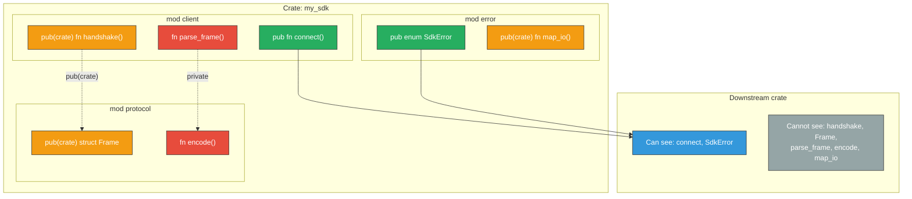

# 2. Visibility, Encapsulation, and SemVer 🟡

> **What you'll learn:**
> - Why Semantic Versioning (SemVer) exists and what constitutes a *breaking change* in a Rust crate.
> - How to use `pub`, `pub(crate)`, `pub(super)`, and `pub(in path)` to create precise visibility boundaries.
> - The `#[non_exhaustive]` attribute — the single most important tool for future-proofing your public structs and enums.
> - A systematic approach to designing module hierarchies that minimize your SemVer surface area.

**Cross-references:** This chapter builds on the naming conventions from [Chapter 1](ch01-rust-api-guidelines.md) and sets up the encapsulation required for the Sealed Trait pattern in [Chapter 3](ch03-sealed-trait-pattern.md).

---

## Why SemVer Matters

Semantic Versioning (`MAJOR.MINOR.PATCH`) is not a version numbering scheme — it is a **contract** between you and every downstream crate. When a user writes `my_crate = "1.2"` in their `Cargo.toml`, Cargo's resolver interprets this as "any version `>=1.2.0` and `<2.0.0`". This means:

| You release... | Users get... | What it means |
|---------------|-------------|---------------|
| `1.2.3` → `1.2.4` | Auto-updated | **Patch**: bug fixes only, no API changes |
| `1.2.3` → `1.3.0` | Auto-updated | **Minor**: new features added, no existing API broken |
| `1.2.3` → `2.0.0` | NOT auto-updated | **Major**: breaking changes — user must explicitly opt in |

The consequence: **any change that causes downstream code to stop compiling is a breaking change and requires a major version bump**. This includes changes that seem "trivial":

### Common Accidental Breaking Changes

| Change | Why it breaks |
|--------|--------------|
| Adding a public field to a struct | Users who construct the struct with `Struct { field1, field2 }` syntax now get a "missing field" error |
| Adding a variant to a public enum | Users who `match` on the enum without a wildcard arm get a "non-exhaustive patterns" error |
| Removing a trait implementation | Code that relied on the trait bound no longer compiles |
| Changing a function parameter from `&str` to `impl AsRef<str>` | Ambiguity in type inference can break existing call sites |
| Making a public type generic | `MyType` becoming `MyType<T>` breaks all existing usage |
| Re-exporting a type from a dependency | Bumping that dependency is now YOUR breaking change |

---

## The Visibility Spectrum

Rust's visibility modifiers are more granular than most languages. Use the **narrowest** visibility that works:

| Modifier | Visible to | Use when |
|----------|-----------|----------|
| (no modifier) | Same module only | Internal helpers |
| `pub(self)` | Same module (explicit form of private) | Documentation clarity |
| `pub(super)` | Parent module | Helper shared between sibling submodules |
| `pub(in crate::foo)` | A specific ancestor module | Rare — targeted internal sharing |
| `pub(crate)` | Anywhere in the same crate | Internal API between modules |
| `pub` | Everyone, including downstream crates | Your public API surface |



### The `pub(crate)` Workhorse

`pub(crate)` is the visibility you'll use most in well-designed libraries. It makes items available across module boundaries *within* your crate, without exposing them to downstream users:

```rust
// src/protocol/frame.rs
pub(crate) struct Frame {
    pub(crate) opcode: u8,
    pub(crate) payload: Vec<u8>,
}

// src/client.rs — can access Frame because we're in the same crate
use crate::protocol::frame::Frame;

pub fn send_message(msg: &str) {
    let frame = Frame {
        opcode: 0x01,
        payload: msg.as_bytes().to_vec(),
    };
    // ...
}
```

---

## `#[non_exhaustive]`: Your SemVer Shield

The `#[non_exhaustive]` attribute is the most important tool in your SemVer arsenal. It tells downstream crates: "this type may gain new fields/variants in the future — don't assume you've seen them all."

### On Structs

Without `#[non_exhaustive]`, adding a field to a public struct is a **breaking change**:

```rust
// 💥 SEMVER HAZARD: Naked public struct
// v1.0.0
pub struct Config {
    pub timeout: Duration,
    pub retries: u32,
}

// v1.1.0 — you add a field:
pub struct Config {
    pub timeout: Duration,
    pub retries: u32,
    pub max_connections: u32,  // 💥 BREAKS downstream code!
}

// Downstream code that was fine in v1.0.0:
// let cfg = Config { timeout: Duration::from_secs(5), retries: 3 };
//                    ^^^ ERROR: missing field `max_connections`
```

The fix:

```rust
// ✅ FIX: #[non_exhaustive] prevents struct literal construction from outside the crate
#[non_exhaustive]
pub struct Config {
    pub timeout: Duration,
    pub retries: u32,
}

impl Config {
    /// Creates a new Config with sensible defaults.
    pub fn new(timeout: Duration) -> Self {
        Config {
            timeout,
            retries: 3,
        }
    }
}

// Now downstream MUST use Config::new() or a builder.
// Adding fields in v1.1.0 is a MINOR change, not a MAJOR one.
```

### On Enums

Without `#[non_exhaustive]`, adding a variant is a **breaking change** for anyone matching on the enum:

```rust
// 💥 SEMVER HAZARD: Exhaustive enum
pub enum DatabaseError {
    ConnectionFailed,
    QueryTimeout,
}

// Downstream code:
// match err {
//     DatabaseError::ConnectionFailed => { ... }
//     DatabaseError::QueryTimeout => { ... }
//     // No wildcard — this is exhaustive.
// }

// v1.1.0 — you add a variant:
pub enum DatabaseError {
    ConnectionFailed,
    QueryTimeout,
    AuthenticationFailed,  // 💥 BREAKS the match above!
}
```

The fix:

```rust
// ✅ FIX: #[non_exhaustive] forces downstream to include a wildcard arm
#[non_exhaustive]
pub enum DatabaseError {
    ConnectionFailed,
    QueryTimeout,
}

// Downstream is FORCED to write:
// match err {
//     DatabaseError::ConnectionFailed => { ... }
//     DatabaseError::QueryTimeout => { ... }
//     _ => { /* handle unknown future variants */ }
// }
```

### On Enum Variants

You can also apply `#[non_exhaustive]` to individual enum variants that carry data:

```rust
#[non_exhaustive]
pub enum Event {
    // Each variant can independently be non_exhaustive
    #[non_exhaustive]
    Connected {
        peer_addr: SocketAddr,
    },
    #[non_exhaustive]
    MessageReceived {
        payload: Vec<u8>,
    },
    Disconnected,
}
```

This lets you add fields to `Connected { peer_addr, tls_version }` in a minor release.

---

## Module Hierarchy Design

A well-designed module hierarchy minimizes your public surface area while keeping internal code organized. The key principle: **re-export at the crate root, hide module structure**.

```rust
// ❌ The Clunky Way: Exposing your internal module tree
// Users must write: my_crate::client::builder::ClientBuilder
// If you reorganize modules, every user's imports break.

// ✅ The Idiomatic Rust Way: Flat re-exports at the crate root
// src/lib.rs
mod client;    // private module
mod error;     // private module
mod protocol;  // private module

// Re-export the public API at the crate root:
pub use client::Client;
pub use client::ClientBuilder;
pub use error::SdkError;
```

Users write `use my_crate::Client;` — clean and stable. You can reorganize your internal modules freely without breaking anyone.

### The Prelude Pattern

For crates with many public types, consider a `prelude` module:

```rust
// src/prelude.rs
pub use crate::Client;
pub use crate::ClientBuilder;
pub use crate::SdkError;
pub use crate::Result; // type alias: pub type Result<T> = std::result::Result<T, SdkError>;

// Users can write:
// use my_crate::prelude::*;
```

---

## Preventing Type Leakage

A subtle SemVer hazard: if your public API exposes types from your dependencies, then bumping those dependencies becomes YOUR breaking change.

```rust
// 💥 SEMVER HAZARD: Leaking a dependency type in your public API
pub fn connect(addr: hyper::Uri) -> Result<Connection, Error> {
    // Now `hyper` is part of YOUR public API.
    // Bumping hyper from 0.14 → 1.0 in your Cargo.toml
    // is a MAJOR version bump for YOUR crate.
    todo!()
}

// ✅ FIX: Accept a standard type; convert internally
pub fn connect(addr: &str) -> Result<Connection, Error> {
    let uri: hyper::Uri = addr.parse().map_err(Error::InvalidUri)?;
    // hyper is now an internal implementation detail.
    todo!()
}
```

The rule: **your public API should only expose types from `std`, your own crate, or well-established ecosystem crates that you're willing to couple your versioning to** (e.g., `serde`, `bytes`, `http`).

---

## The SemVer Audit Checklist

Before every release, run through this checklist:

| Check | Tool / Technique |
|-------|-----------------|
| Are any new public types missing `#[non_exhaustive]`? | `grep -r "^pub struct\|^pub enum" src/ | grep -v non_exhaustive` |
| Did I add fields to a non-`#[non_exhaustive]` struct? | `cargo semver-checks` (the `cargo-semver-checks` tool) |
| Am I re-exporting types from a dependency I might bump? | Review `pub use` statements in `lib.rs` |
| Did any function signatures change? | `cargo public-api diff` |
| Are all new public methods documented? | `#![deny(missing_docs)]` in `lib.rs` |

```rust
// In your lib.rs — enforce documentation and warn on accidental pub exposure:
#![deny(missing_docs)]
#![warn(unreachable_pub)]
```

---

<details>
<summary><strong>🏋️ Exercise: SemVer-Proof a Public API</strong> (click to expand)</summary>

You maintain a configuration library. The current v1.0.0 API looks like this:

```rust
pub struct AppConfig {
    pub database_url: String,
    pub port: u16,
}

pub enum LogLevel {
    Debug,
    Info,
    Warn,
    Error,
}

pub fn load_config(path: &str) -> AppConfig {
    todo!()
}
```

**Your task:**
1. Make it possible to add a `log_level: LogLevel` field to `AppConfig` in v1.1.0 without breaking downstream.
2. Make it possible to add a `Trace` variant to `LogLevel` in v1.1.0 without breaking downstream.
3. Ensure `load_config` returns proper errors instead of panicking.
4. Add the appropriate `#[derive(...)]` attributes.

<details>
<summary>🔑 Solution</summary>

```rust
use std::path::Path;

/// Application configuration.
///
/// # Stability
///
/// This struct is `#[non_exhaustive]` — new fields may be added in minor releases.
/// Use [`AppConfig::builder()`] or [`AppConfig::default()`] to construct instances.
#[derive(Debug, Clone, PartialEq)]
#[non_exhaustive]  // ✅ Downstream cannot use struct literal syntax
pub struct AppConfig {
    /// The database connection URL.
    pub database_url: String,
    /// The port to listen on.
    pub port: u16,
    // In v1.1.0, we can add:
    // pub log_level: LogLevel,
    // ...and it's NOT a breaking change.
}

impl Default for AppConfig {
    fn default() -> Self {
        AppConfig {
            database_url: String::from("postgres://localhost/mydb"),
            port: 8080,
        }
    }
}

/// Log verbosity level.
///
/// # Stability
///
/// This enum is `#[non_exhaustive]` — match arms must include a wildcard.
#[derive(Debug, Clone, Copy, PartialEq, Eq, Hash)]
#[non_exhaustive]  // ✅ Downstream must use a wildcard arm in match
pub enum LogLevel {
    /// Detailed debug information.
    Debug,
    /// General informational messages.
    Info,
    /// Warning conditions.
    Warn,
    /// Error conditions.
    Error,
    // In v1.1.0, we can add:
    // Trace,
    // ...and it's NOT a breaking change, because downstream
    // is forced to have `_ => { ... }` in their match.
}

/// Errors that can occur when loading configuration.
#[derive(Debug)]
#[non_exhaustive]
pub enum ConfigError {
    /// The configuration file could not be read.
    Io(std::io::Error),
    /// The configuration file contained invalid syntax.
    Parse(String),
}

impl std::fmt::Display for ConfigError {
    fn fmt(&self, f: &mut std::fmt::Formatter<'_>) -> std::fmt::Result {
        match self {
            ConfigError::Io(e) => write!(f, "failed to read config: {e}"),
            ConfigError::Parse(msg) => write!(f, "invalid config: {msg}"),
            _ => write!(f, "unknown config error"),
        }
    }
}

impl std::error::Error for ConfigError {
    fn source(&self) -> Option<&(dyn std::error::Error + 'static)> {
        match self {
            ConfigError::Io(e) => Some(e),
            _ => None,
        }
    }
}

/// Loads application configuration from a file.
///
/// # Errors
///
/// Returns `ConfigError::Io` if the file cannot be read,
/// or `ConfigError::Parse` if the contents are invalid.
pub fn load_config(path: impl AsRef<Path>) -> Result<AppConfig, ConfigError> {
    // ✅ Returns Result instead of panicking
    // ✅ Accepts impl AsRef<Path> for ergonomics (C-GENERIC)
    let _contents = std::fs::read_to_string(path.as_ref())
        .map_err(ConfigError::Io)?;
    // ... parse contents ...
    Ok(AppConfig::default())
}
```

</details>
</details>

---

> **Key Takeaways**
> - Every `pub` item is a promise. Use the narrowest visibility that works: prefer `pub(crate)` for internal sharing, reserve `pub` for your true API surface.
> - Apply `#[non_exhaustive]` to every public struct and enum unless you have a specific reason not to. It costs you nothing and saves you from major version bumps.
> - Never expose types from your dependencies in your public API unless you're willing to couple your version to theirs.
> - Use `cargo-semver-checks` and `#![deny(missing_docs)]` as CI gates to catch accidental breakage before release.

> **See also:**
> - [Chapter 1: The Rust API Guidelines](ch01-rust-api-guidelines.md) — the naming conventions that complement this chapter's visibility rules.
> - [Chapter 3: The Sealed Trait Pattern](ch03-sealed-trait-pattern.md) — an advanced encapsulation technique for traits.
> - [Chapter 4: Libraries vs. Applications](ch04-libraries-vs-applications.md) — SemVer implications for error types.
