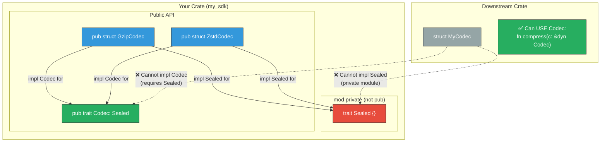

# 3. The Sealed Trait Pattern 🟡

> **What you'll learn:**
> - Why public traits that anyone can implement are a SemVer liability — and how the Sealed Trait pattern solves this.
> - The mechanics of sealing: a private supertrait in a public-but-unimplementable position.
> - When to seal (extension points you control) vs. when to leave open (extension points you want users to fill).
> - How to combine sealed traits with `#[non_exhaustive]` for maximum future-proofing.

**Cross-references:** This chapter builds on the visibility rules from [Chapter 2](ch02-visibility-encapsulation-semver.md) and is used heavily in the Capstone ([Chapter 8](ch08-capstone-production-grade-sdk.md)).

---

## The Problem: Public Traits Are Promises

When you publish a public trait, you're making two promises:

1. **Users can call methods on types that implement it** — this is what you intended.
2. **Users can implement it on their own types** — this is often *not* what you intended.

The second promise is dangerous because it constrains your ability to evolve the trait:

```rust
// v1.0.0 — your crate
pub trait Codec {
    fn encode(&self, data: &[u8]) -> Vec<u8>;
    fn decode(&self, data: &[u8]) -> Vec<u8>;
}

// A user implements it in their crate:
struct MyCodec;
impl your_crate::Codec for MyCodec {
    fn encode(&self, data: &[u8]) -> Vec<u8> { data.to_vec() }
    fn decode(&self, data: &[u8]) -> Vec<u8> { data.to_vec() }
}
```

Now, in v1.1.0, you want to add an optional method with a default implementation:

```rust
// 💥 SEMVER HAZARD: Adding a method to a public trait
pub trait Codec {
    fn encode(&self, data: &[u8]) -> Vec<u8>;
    fn decode(&self, data: &[u8]) -> Vec<u8>;
    
    // 💥 This compiles, and existing impls get the default...
    // BUT if MyCodec already has a method called `content_type`,
    // this will silently shadow it, changing behavior!
    fn content_type(&self) -> &str {
        "application/octet-stream"
    }
}
```

Even worse: adding a **required** method (without a default) is an unambiguous breaking change — every downstream `impl Codec for ...` immediately fails to compile.

### The Core Insight

If you control all the implementations of a trait, you should **prevent** downstream users from implementing it. This makes adding methods, changing signatures, and adding supertraits into non-breaking changes.

---

## The Sealed Trait Pattern

The pattern uses a private module containing a "seal" trait. Your public trait requires the seal as a supertrait. Since the seal trait lives in a private module, no code outside your crate can implement it — and therefore no code outside your crate can implement your public trait.

```rust
// The standard implementation:

/// Private module — not accessible from outside the crate.
mod private {
    /// The seal. This trait is public (so it can be named in trait bounds),
    /// but it lives in a private module (so no one outside can reach it).
    pub trait Sealed {}
}

/// A public trait that downstream can USE but not IMPLEMENT.
///
/// This trait is sealed — you cannot implement it for your own types.
/// See the crate documentation for the list of provided implementations.
pub trait Codec: private::Sealed {
    /// Encode raw bytes.
    fn encode(&self, data: &[u8]) -> Vec<u8>;
    /// Decode raw bytes.
    fn decode(&self, data: &[u8]) -> Vec<u8>;
}

// Implement the seal for your types:
impl private::Sealed for GzipCodec {}
impl private::Sealed for ZstdCodec {}

// Then implement the public trait:
pub struct GzipCodec;
impl Codec for GzipCodec {
    fn encode(&self, data: &[u8]) -> Vec<u8> { /* ... */ todo!() }
    fn decode(&self, data: &[u8]) -> Vec<u8> { /* ... */ todo!() }
}

pub struct ZstdCodec;
impl Codec for ZstdCodec {
    fn encode(&self, data: &[u8]) -> Vec<u8> { /* ... */ todo!() }
    fn decode(&self, data: &[u8]) -> Vec<u8> { /* ... */ todo!() }
}
```

Now if a downstream user tries:

```rust,ignore
struct MyCodec;
impl your_crate::Codec for MyCodec {
//   ^^^^^^^^^^^^^^^^^^^^^^^^^^^^^^
//   ERROR: the trait bound `MyCodec: your_crate::private::Sealed` is not satisfied
//   NOTE: `private::Sealed` is not accessible — it's in a private module
    fn encode(&self, data: &[u8]) -> Vec<u8> { data.to_vec() }
    fn decode(&self, data: &[u8]) -> Vec<u8> { data.to_vec() }
}
```

The compiler stops them at the gate.



---

## Why Not Just Use `pub(crate) trait Codec`?

If you make the trait `pub(crate)`, downstream crates can't *see* it at all — they can't call methods on it, can't use it as a bound, can't name it in function signatures. That's too restrictive. You want downstream crates to **use** the trait, just not **implement** it.

| Approach | Can downstream see it? | Can downstream call methods? | Can downstream implement it? |
|----------|----------------------|----------------------------|----------------------------|
| `pub trait Codec` | ✅ | ✅ | ✅ (undesired) |
| `pub(crate) trait Codec` | ❌ | ❌ | ❌ (too restrictive) |
| Sealed trait | ✅ | ✅ | ❌ (exactly right) |

---

## The `Sealed` Trait as a Module Convention

In real-world crates, you'll often see the seal in a dedicated `sealed` module:

```rust
// A common organizational pattern:

// src/sealed.rs
pub(crate) mod sealed {
    pub trait Sealed {}
}

// src/codec.rs
use crate::sealed::sealed::Sealed;

pub trait Codec: Sealed {
    fn encode(&self, data: &[u8]) -> Vec<u8>;
    fn decode(&self, data: &[u8]) -> Vec<u8>;
}
```

Some crates use a slightly different structure where the private module is inline:

```rust
// Inline private module — also valid:
pub trait Query: query_sealed::Sealed {
    fn execute(&self) -> QueryResult;
}

mod query_sealed {
    pub trait Sealed {}
    
    impl Sealed for super::SelectQuery {}
    impl Sealed for super::InsertQuery {}
    impl Sealed for super::DeleteQuery {}
}
```

---

## When to Seal vs. When to Leave Open

Not every trait should be sealed. Here's a decision framework:

| Scenario | Seal? | Reasoning |
|----------|-------|-----------|
| You control all implementations (codecs, transports, query types) | ✅ Seal | You need freedom to evolve the trait |
| You want users to provide custom implementations (serializers, loggers, middleware) | ❌ Open | The trait IS the extension point |
| The trait is an abstraction over your internal types | ✅ Seal | Users shouldn't depend on internals |
| The trait represents a standard protocol (Iterator, Read, Write) | ❌ Open | Interoperability requires open implementation |

### The Extension Trait Pattern

Sometimes you want a sealed extension trait that adds methods to types implementing an open trait:

```rust
/// Open trait — anyone can implement this.
pub trait Transport {
    fn send(&self, data: &[u8]) -> Result<(), TransportError>;
}

/// Sealed extension — adds convenience methods.
/// Users can call these, but only on types that implement Transport.
pub trait TransportExt: Transport + private::Sealed {
    fn send_json<T: serde::Serialize>(&self, value: &T) -> Result<(), TransportError> {
        let bytes = serde_json::to_vec(value).map_err(TransportError::Serialize)?;
        self.send(&bytes)
    }
}

// Blanket implementation: every Transport automatically gets TransportExt
impl<T: Transport> private::Sealed for T {}
impl<T: Transport> TransportExt for T {}
```

This lets users implement `Transport` but gives them `send_json()` for free — and you can add more extension methods without breaking anyone.

---

## Sealed Traits and Object Safety

Sealed traits are often used with trait objects (`dyn Codec`). Since you control all implementations, you know exactly which vtable entries exist and can optimize accordingly.

One subtlety: if `Sealed` has any generic methods or `Self: Sized` bounds, it can break object safety. Keep the seal trait completely empty:

```rust
mod private {
    // ✅ Empty trait — always object-safe
    pub trait Sealed {}
    
    // ❌ NEVER do this — breaks dyn compatibility:
    // pub trait Sealed: Sized {}
}
```

---

## Documenting Sealed Traits

Always document that a trait is sealed. Users who try to implement it will see a confusing error message otherwise:

```rust
/// A compression codec.
///
/// # Sealed
///
/// This trait is **sealed** — it cannot be implemented outside of this crate.
/// The following implementations are provided:
///
/// - [`GzipCodec`] — gzip compression
/// - [`ZstdCodec`] — Zstandard compression
///
/// If you need a custom codec, use [`CustomCodec::new`] with a closure.
pub trait Codec: private::Sealed {
    // ...
}
```

---

<details>
<summary><strong>🏋️ Exercise: Seal a Query Trait</strong> (click to expand)</summary>

You're building a database SDK. You have three query types (`Select`, `Insert`, `Delete`) and a `Query` trait that defines how they're executed. You want users to construct and execute queries, but NOT implement their own query types (because your executor relies on internal invariants about how queries are serialized).

**Your task:**
1. Define a sealed `Query` trait with methods `fn sql(&self) -> &str` and `fn params(&self) -> &[Value]`.
2. Implement it for `Select`, `Insert`, and `Delete` structs.
3. Write a public `execute` function that accepts `&dyn Query`.
4. Verify (by reasoning about the visibility) that downstream users cannot implement `Query`.

<details>
<summary>🔑 Solution</summary>

```rust
use std::fmt;

/// A dynamically-typed query parameter value.
#[derive(Debug, Clone)]
#[non_exhaustive]
pub enum Value {
    /// A text value.
    Text(String),
    /// An integer value.
    Int(i64),
    /// A null value.
    Null,
}

// ── The Seal ─────────────────────────────────────────────────────
/// Private module: downstream crates cannot access anything in here.
mod private {
    /// The seal trait. It's `pub` so it can appear in the `Query` supertrait,
    /// but the *module* is private, so downstream code can't path to it.
    pub trait Sealed {}
}

// ── The Sealed Public Trait ──────────────────────────────────────
/// A database query that can be executed against the connection pool.
///
/// # Sealed
///
/// This trait is sealed and cannot be implemented outside of this crate.
/// Use [`Select`], [`Insert`], or [`Delete`] to construct queries.
pub trait Query: private::Sealed + fmt::Debug {
    /// Returns the SQL string for this query.
    fn sql(&self) -> &str;

    /// Returns the bind parameters for this query.
    fn params(&self) -> &[Value];
}

// ── Concrete Query Types ─────────────────────────────────────────

/// A SELECT query.
#[derive(Debug)]
pub struct Select {
    sql: String,
    params: Vec<Value>,
}

impl Select {
    /// Creates a new SELECT query.
    pub fn new(sql: impl Into<String>) -> Self {
        Select { sql: sql.into(), params: Vec::new() }
    }

    /// Binds a parameter to the query.
    pub fn bind(mut self, value: Value) -> Self {
        self.params.push(value);
        self
    }
}

// Seal it:
impl private::Sealed for Select {}

// Implement the public trait:
impl Query for Select {
    fn sql(&self) -> &str { &self.sql }
    fn params(&self) -> &[Value] { &self.params }
}

/// An INSERT query.
#[derive(Debug)]
pub struct Insert {
    sql: String,
    params: Vec<Value>,
}

impl Insert {
    /// Creates a new INSERT query.
    pub fn new(sql: impl Into<String>) -> Self {
        Insert { sql: sql.into(), params: Vec::new() }
    }

    /// Binds a parameter to the query.
    pub fn bind(mut self, value: Value) -> Self {
        self.params.push(value);
        self
    }
}

impl private::Sealed for Insert {}

impl Query for Insert {
    fn sql(&self) -> &str { &self.sql }
    fn params(&self) -> &[Value] { &self.params }
}

/// A DELETE query.
#[derive(Debug)]
pub struct Delete {
    sql: String,
    params: Vec<Value>,
}

impl Delete {
    /// Creates a new DELETE query.
    pub fn new(sql: impl Into<String>) -> Self {
        Delete { sql: sql.into(), params: Vec::new() }
    }

    /// Binds a parameter to the query.
    pub fn bind(mut self, value: Value) -> Self {
        self.params.push(value);
        self
    }
}

impl private::Sealed for Delete {}

impl Query for Delete {
    fn sql(&self) -> &str { &self.sql }
    fn params(&self) -> &[Value] { &self.params }
}

// ── The Public Executor ──────────────────────────────────────────

/// Executes a query and returns the number of affected rows.
///
/// Accepts any sealed `Query` implementation via dynamic dispatch.
pub fn execute(query: &dyn Query) -> Result<u64, Box<dyn std::error::Error>> {
    // In a real implementation, this would use a connection pool.
    println!("Executing: {}", query.sql());
    println!("With {} params: {:?}", query.params().len(), query.params());
    Ok(0)
}

// ── Why This Is Sealed ───────────────────────────────────────────
// 
// Downstream crate tries:
//
//   struct EvilQuery;
//   impl my_crate::Query for EvilQuery { ... }
//
// Compiler error:
//   "the trait bound `EvilQuery: my_crate::private::Sealed` is not satisfied"
//   "the trait `my_crate::private::Sealed` is not implemented for `EvilQuery`"
//
// They can't implement `Sealed` because `mod private` is not `pub`.
// ✅ Mission accomplished.
```

</details>
</details>

---

> **Key Takeaways**
> - A public trait is an implicit promise that anyone can implement it. The Sealed Trait pattern breaks this assumption intentionally, giving you full control over evolution.
> - The seal is a `pub trait Sealed {}` inside a private module: visible in trait bounds but unreachable from outside the crate.
> - Seal traits when you control all implementations. Leave traits open when the trait IS the extension point for users.
> - Always document that a trait is sealed — otherwise users get a confusing compiler error about a private module.

> **See also:**
> - [Chapter 2: Visibility, Encapsulation, and SemVer](ch02-visibility-encapsulation-semver.md) — the visibility mechanics that make sealing possible.
> - [Chapter 8: Capstone](ch08-capstone-production-grade-sdk.md) — where we use sealed traits in a real SDK.
> - [Rust API Guidelines: C-SEALED](https://rust-lang.github.io/api-guidelines/future-proofing.html) — the official guidance.
