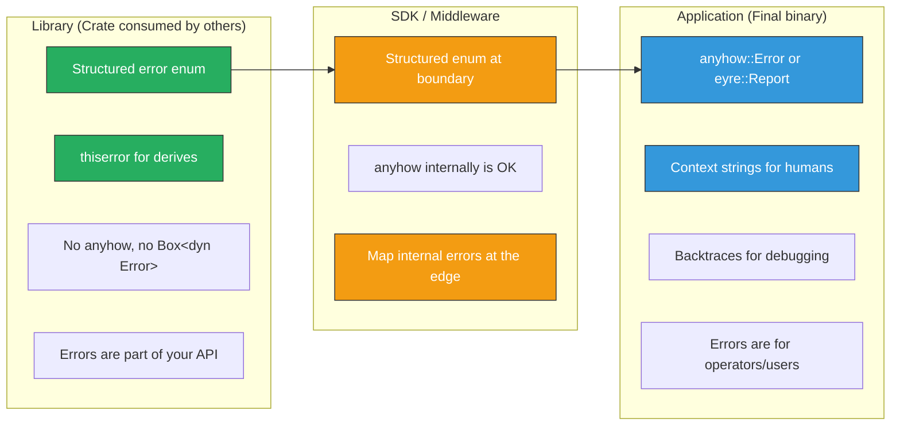

# 4. The Great Divide: Libraries vs. Applications 🟡

> **What you'll learn:**
> - The fundamental architectural difference between **library errors** (structured, typed, stable) and **application errors** (flexible, contextual, human-readable).
> - Why libraries should never return `anyhow::Error` or `Box<dyn Error>` — and when `anyhow` is exactly the right choice.
> - How to design library error enums with `thiserror` that are informative without leaking implementation details.
> - The `Error` trait in `std` — `source()`, `Display`, and how error chains actually work.

**Cross-references:** This chapter prepares you for the advanced error wrapping techniques in [Chapter 5](ch05-transparent-forwarding-and-context.md). The error types we design here follow the SemVer rules from [Chapter 2](ch02-visibility-encapsulation-semver.md).

---

## The Error Spectrum

Every Rust project sits somewhere on a spectrum between "pure library" and "pure application." Where you sit determines your error strategy:



| | Library | Application |
|---|---------|-------------|
| **Audience** | Other programmers' code (pattern matching) | Humans (operators, end users, log aggregators) |
| **Error type** | `enum MyError { Variant1, Variant2(detail) }` | `anyhow::Error` or `eyre::Report` |
| **Evolution** | SemVer-bound — adding variants is a breaking change (unless `#[non_exhaustive]`) | Freely change — no downstream code depends on variants |
| **Context** | Structured fields (port number, file path, query text) | Free-form `.context("while loading config")` strings |
| **Backtrace** | Optional, controlled | Always captured in debug builds |
| **Dependencies** | `thiserror` (compile-time only, zero-cost) | `anyhow` or `eyre` (thin runtime wrapper) |

---

## The `std::error::Error` Trait

Before diving into `thiserror` and `anyhow`, let's understand what they're built on. The standard `Error` trait is defined as:

```rust,ignore
pub trait Error: Debug + Display {
    fn source(&self) -> Option<&(dyn Error + 'static)> {
        None
    }
}
```

Three requirements:
1. **`Debug`** — for `{:?}` formatting in error messages and test output.
2. **`Display`** — the user-facing error message. This is what `.to_string()` returns.
3. **`source()`** — returns the underlying cause, forming an error *chain*.

### Error Chains

When errors wrap other errors, `source()` creates a linked list:

```text
SdkError::QueryFailed
  └── source: ConnectionError::PoolExhausted
        └── source: tokio::time::error::Elapsed
              └── source: None
```

Libraries and tools can walk this chain to provide rich diagnostics:

```rust,ignore
fn print_error_chain(err: &dyn std::error::Error) {
    eprintln!("Error: {err}");
    let mut source = err.source();
    while let Some(cause) = source {
        eprintln!("  Caused by: {cause}");
        source = cause.source();
    }
}
```

---

## Library Errors with `thiserror`

`thiserror` is a proc-macro crate that generates `Display`, `Error`, and `From` implementations from your enum definition. It has **zero runtime cost** — it's purely a compile-time convenience.

### The Basics

```rust,ignore
use thiserror::Error;

#[derive(Debug, Error)]
#[non_exhaustive]  // ✅ SemVer-safe: can add variants in minor releases
pub enum SdkError {
    /// The connection to the database timed out.
    #[error("connection timed out after {timeout_ms}ms")]
    ConnectionTimeout {
        /// The timeout duration that was exceeded.
        timeout_ms: u64,
    },

    /// Authentication failed.
    #[error("authentication failed for user {user:?}")]
    AuthFailed {
        /// The username that failed authentication.
        user: String,
    },

    /// A query was malformed.
    #[error("invalid query: {reason}")]
    InvalidQuery {
        /// A human-readable description of the problem.
        reason: String,
    },

    /// An I/O error occurred during communication.
    #[error("i/o error")]
    Io(#[from] std::io::Error),
}
```

Let's break down the attributes:

| Attribute | Effect |
|-----------|--------|
| `#[derive(Error)]` | Implements `std::error::Error` |
| `#[error("...")]` | Generates `Display` impl with format-string syntax |
| `#[from]` | Generates `From<std::io::Error> for SdkError` — enables the `?` operator |
| `#[source]` | Marks a field as returned by `Error::source()` (auto-detected for `#[from]`) |

### Why Not `Box<dyn Error>`?

```rust
// 💥 SEMVER HAZARD: Returning Box<dyn Error> from a library
pub fn connect(addr: &str) -> Result<Connection, Box<dyn std::error::Error>> {
    // 💥 Problems:
    // 1. Downstream code cannot match on error variants
    // 2. No way to programmatically distinguish "timeout" from "auth failure"
    // 3. The actual error types you return are an implicit API —
    //    changing them is a silent behavioral change
    todo!()
}

// ✅ FIX: Return a structured error enum
pub fn connect(addr: &str) -> Result<Connection, SdkError> {
    // ✅ Downstream can match:
    // match sdk.connect("db://host") {
    //     Err(SdkError::ConnectionTimeout { timeout_ms }) => retry(timeout_ms),
    //     Err(SdkError::AuthFailed { user }) => prompt_credentials(&user),
    //     Err(e) => return Err(e.into()),
    //     Ok(conn) => use_connection(conn),
    // }
    todo!()
}
```

### Why Not `anyhow::Error` in a Library?

```rust,ignore
// 💥 SEMVER HAZARD: Using anyhow in a library's public API
pub fn query(sql: &str) -> Result<Rows, anyhow::Error> {
    // 💥 Problems:
    // 1. anyhow::Error erases the type — downstream can only downcast, which is fragile
    // 2. Adding anyhow as a public dependency couples your API to anyhow's version
    // 3. Users who want structured error handling must downcast:
    //    err.downcast_ref::<std::io::Error>()  ← fragile, no exhaustiveness checking
    todo!()
}
```

---

## Application Errors with `anyhow`

At the top of your application (the `main()` function, the HTTP handler, the CLI command), you don't need structured error types. You need:

1. **Context** — "what were we doing when this failed?"
2. **The full chain** — all the wrapped causes.
3. **A backtrace** — where in the code did this happen?

`anyhow` gives you all three:

```rust,ignore
use anyhow::{Context, Result};

fn main() -> Result<()> {
    let config = load_config("config.toml")
        .context("failed to load application configuration")?;
    
    let db = connect_database(&config.database_url)
        .context("failed to connect to the database")?;
    
    run_server(db, config.port)
        .context("server crashed")?;
    
    Ok(())
}
```

If `connect_database` returns `Err(SdkError::ConnectionTimeout { timeout_ms: 5000 })`, the output is:

```text
Error: failed to connect to the database

Caused by:
    0: connection timed out after 5000ms
```

### `anyhow` vs. `eyre`

| Feature | `anyhow` | `eyre` |
|---------|----------|--------|
| Maintained by | David Tolnay | Jane Lusby (yaahc) |
| Core type | `anyhow::Error` | `eyre::Report` |
| Custom reporters | ❌ | ✅ (`color-eyre` for beautiful output) |
| Span traces | ❌ | ✅ (via `tracing` integration) |
| Context API | `.context()` / `.with_context(|| ...)` | Same |
| Recommendation | Default choice for most apps | Choose if you want span traces or colored output |

---

## The Conversion Boundary

In practice, most projects have layers. The rule is: **convert at the boundary**.

```rust,ignore
// Layer 1: Library crate (structured errors)
pub enum DbError {
    ConnectionTimeout { timeout_ms: u64 },
    QuerySyntax { details: String },
    // ...
}

// Layer 2: Application service (anyhow)
fn handle_request(req: Request) -> anyhow::Result<Response> {
    let conn = db::connect(&config.db_url)
        .context("database connection failed")?;  // DbError → anyhow::Error
    
    let rows = conn.query(&req.sql)
        .context("query execution failed")?;       // DbError → anyhow::Error
    
    Ok(Response::from(rows))
}
```

The `?` operator automatically converts `DbError` into `anyhow::Error` because `anyhow::Error` implements `From<E>` for any `E: std::error::Error`. The `.context()` call adds a human-readable layer.

---

## Designing Error Enums: A Checklist

When designing a library error enum, follow these principles:

### 1. One Error Enum Per Public API Surface

Don't create a single God Error that covers every possible failure in your crate. Instead, scope error types to the operations that produce them:

```rust,ignore
// ❌ The Clunky Way: One giant error covering the entire crate
pub enum Error {
    ConnectionTimeout,
    AuthFailed,
    InvalidQuery,
    SerializationFailed,
    FileNotFound,
    ConfigInvalid,
    // ... 30 more variants
}

// ✅ The Idiomatic Rust Way: Scoped error types
pub enum ConnectError {
    Timeout { timeout_ms: u64 },
    AuthFailed { user: String },
    DnsResolutionFailed { host: String },
}

pub enum QueryError {
    Syntax { details: String },
    ExecutionFailed { source: Box<dyn std::error::Error + Send + Sync> },
    ResultTooLarge { rows: u64, limit: u64 },
}
```

### 2. Include Actionable Context

Every error variant should contain enough information for the caller to decide what to do:

```rust,ignore
// ❌ Useless: caller can't decide anything
#[error("connection failed")]
ConnectionFailed,

// ✅ Actionable: caller knows whether to retry and how long to wait
#[error("connection to {host}:{port} timed out after {timeout_ms}ms")]
ConnectionTimeout {
    host: String,
    port: u16,
    timeout_ms: u64,
},
```

### 3. Never Leak Dependency Types

```rust,ignore
// 💥 SEMVER HAZARD: Leaking reqwest types
#[derive(Debug, Error)]
pub enum ApiError {
    #[error("HTTP request failed")]
    Http(#[from] reqwest::Error),  // 💥 reqwest is now YOUR public API
}

// ✅ FIX: Box the dependency error behind a trait object
#[derive(Debug, Error)]
pub enum ApiError {
    #[error("HTTP request failed")]
    Http(#[source] Box<dyn std::error::Error + Send + Sync>),
}

// Convert at the boundary:
impl From<reqwest::Error> for ApiError {
    fn from(e: reqwest::Error) -> Self {
        ApiError::Http(Box::new(e))
    }
}
```

We'll explore this boxing pattern in depth in [Chapter 5](ch05-transparent-forwarding-and-context.md).

---

## The `Result` Type Alias Convention

Well-designed crates define a `Result` type alias that uses their error type:

```rust,ignore
/// A Result alias for operations that can fail with [`SdkError`].
pub type Result<T> = std::result::Result<T, SdkError>;

// Now public functions read cleanly:
pub fn connect(addr: &str) -> Result<Connection> { /* ... */ }
pub fn query(conn: &Connection, sql: &str) -> Result<Rows> { /* ... */ }
```

This is used by `std::io::Result`, `serde_json::Result`, and most major crates.

---

<details>
<summary><strong>🏋️ Exercise: Design a Library Error Hierarchy</strong> (click to expand)</summary>

You're building a crate called `kv_store` that provides an embedded key-value store. The crate has three public operations:

1. `open(path)` — opens a store file. Can fail due to I/O errors or corrupt data.
2. `get(key)` — reads a value. Can fail due to I/O errors. Returns `None` for missing keys (not an error).
3. `put(key, value)` — writes a value. Can fail due to I/O errors, or if the value exceeds a size limit.

**Your task:**
1. Design error types using `thiserror`. Decide: one error enum or multiple?
2. Apply `#[non_exhaustive]` appropriately.
3. Ensure no dependency types leak into the public API.
4. Define a `Result` type alias.
5. Write function signatures (not implementations) for `open`, `get`, and `put`.

<details>
<summary>🔑 Solution</summary>

```rust,ignore
use std::path::{Path, PathBuf};
use thiserror::Error;

// ── Error Types ──────────────────────────────────────────────────
//
// Design decision: TWO error types.
// - OpenError: for the `open` operation, which has unique failure modes (corruption).
// - StoreError: for `get` and `put`, which share I/O failure modes.
//
// This gives callers precise match arms for each operation,
// without a bloated "God error" that has variants irrelevant to the operation.

/// Errors that can occur when opening a key-value store.
#[derive(Debug, Error)]
#[non_exhaustive]  // ✅ Future-proof: we might add PermissionDenied, VersionMismatch, etc.
pub enum OpenError {
    /// The store file could not be read or created.
    #[error("failed to open store at {path}")]
    Io {
        /// The path that could not be opened.
        path: PathBuf,
        /// The underlying I/O error.
        #[source]
        source: std::io::Error,
        // ✅ std::io::Error is from std — safe to expose.
    },

    /// The store file exists but contains corrupt data.
    #[error("store at {path} is corrupt: {details}")]
    Corrupt {
        /// The path of the corrupt store.
        path: PathBuf,
        /// What was wrong with the data.
        details: String,
    },
}

/// Errors that can occur during store reads and writes.
#[derive(Debug, Error)]
#[non_exhaustive]
pub enum StoreError {
    /// An I/O error occurred during the operation.
    #[error("store I/O error")]
    Io(#[from] std::io::Error),

    /// The value exceeds the maximum allowed size.
    #[error("value size {size} exceeds limit of {limit} bytes")]
    ValueTooLarge {
        /// The size of the rejected value in bytes.
        size: usize,
        /// The maximum allowed size in bytes.
        limit: usize,
    },
}

// ── Result Alias ─────────────────────────────────────────────────

/// A Result alias for store operations.
pub type Result<T> = std::result::Result<T, StoreError>;

// ── Public API ───────────────────────────────────────────────────

/// A handle to an open key-value store.
pub struct Store { /* internal fields */ }

/// Opens a key-value store at the given path.
///
/// # Errors
///
/// Returns [`OpenError::Io`] if the file cannot be opened,
/// or [`OpenError::Corrupt`] if the existing data is invalid.
pub fn open(path: impl AsRef<Path>) -> std::result::Result<Store, OpenError> {
    // Note: uses std::result::Result because OpenError ≠ StoreError
    todo!()
}

impl Store {
    /// Reads the value associated with `key`.
    ///
    /// Returns `Ok(None)` if the key does not exist.
    /// Returns `Err(StoreError::Io)` on I/O failure.
    pub fn get(&self, key: &str) -> Result<Option<Vec<u8>>> {
        todo!()
    }

    /// Writes a key-value pair to the store.
    ///
    /// # Errors
    ///
    /// Returns [`StoreError::ValueTooLarge`] if `value` exceeds the size limit.
    /// Returns [`StoreError::Io`] on I/O failure.
    pub fn put(&mut self, key: &str, value: &[u8]) -> Result<()> {
        todo!()
    }
}
```

**Why two error types?**

- `open` has a unique failure mode (`Corrupt`) that's irrelevant to `get`/`put`.
- `get`/`put` share the `Io` failure mode and `put` has `ValueTooLarge`.
- Callers of `open` get precise match arms. Callers of `get`/`put` never see `Corrupt`.
- Both enums are `#[non_exhaustive]`, so we can add variants freely.

</details>
</details>

---

> **Key Takeaways**
> - Libraries return structured, typed error enums. Applications return `anyhow::Error` (or `eyre::Report`). The boundary between them is where `.context()` is called.
> - Use `thiserror` in libraries for zero-cost `Display`, `Error`, and `From` derives. Use `anyhow` in binaries for flexible, context-rich error chains.
> - Scope your error types to operations (one enum per API surface), not one monolithic error for the whole crate.
> - Never expose dependency types through `#[from]`. Box them behind `Box<dyn Error + Send + Sync>` to keep your SemVer surface clean.

> **See also:**
> - [Chapter 5: Transparent Forwarding and Context](ch05-transparent-forwarding-and-context.md) — advanced techniques for wrapping and boxing errors.
> - [Chapter 2: Visibility, Encapsulation, and SemVer](ch02-visibility-encapsulation-semver.md) — why `#[non_exhaustive]` on error enums matters.
> - [Chapter 8: Capstone](ch08-capstone-production-grade-sdk.md) — putting it all together in a real SDK.
