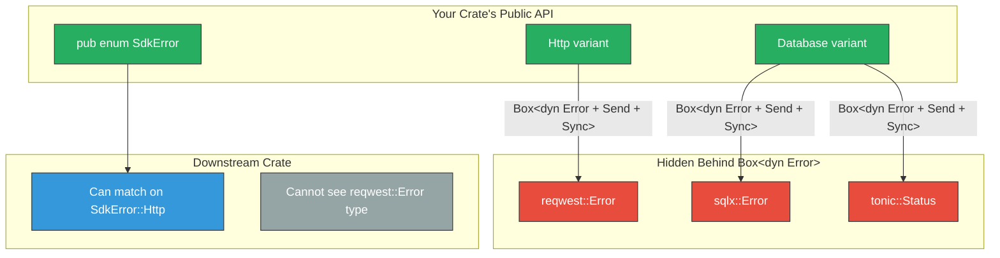

# 5. Transparent Forwarding and Context 🔴

> **What you'll learn:**
> - How `#[error(transparent)]` works in `thiserror` and when to use it for single-variant "newtype" errors.
> - The boxed-error pattern for hiding internal dependency errors without losing the error chain.
> - How to capture `std::backtrace::Backtrace` in your error types for zero-cost-when-unused diagnostics.
> - Strategies for formatting rich, multi-cause error reports in both libraries and applications.

**Cross-references:** This chapter is a direct continuation of [Chapter 4](ch04-libraries-vs-applications.md). It builds on the SemVer principles from [Chapter 2](ch02-visibility-encapsulation-semver.md) and feeds into the Capstone error design in [Chapter 8](ch08-capstone-production-grade-sdk.md).

---

## `#[error(transparent)]`: Delegating Display and Source

The `transparent` attribute tells `thiserror`: "this variant *is* the inner error — delegate both `Display` and `source()` to it."

```rust,ignore
use thiserror::Error;

#[derive(Debug, Error)]
pub enum ServiceError {
    /// A database error occurred.
    #[error(transparent)]  // Display AND source() come from DbError
    Database(#[from] DbError),

    /// A cache error occurred.
    #[error(transparent)]
    Cache(#[from] CacheError),

    /// An unexpected internal error.
    #[error(transparent)]
    Internal(#[from] anyhow::Error),
}
```

When you print a `ServiceError::Database(db_err)`:
- `Display` → calls `db_err.to_string()` (the inner error's message)
- `source()` → calls `db_err.source()` (the inner error's cause chain)

This is useful for "pass-through" errors where the variant name is sufficient categorization and you don't need to add your own message.

### When to Use `transparent`

| Use `transparent` | Don't use `transparent` |
|-------------------|------------------------|
| Newtype wrappers: `struct MyError(AnotherError)` | When you want to add context: `"failed to open database: {inner}"` |
| Single-cause forwarding where variant name is enough | When the inner error's message is technical and you want a user-friendly message |
| The inner type already has a good `Display` impl | When you need to present the error differently at this layer |

---

## The Boxed Error Pattern: Hiding Dependencies

In [Chapter 4](ch04-libraries-vs-applications.md) we established the rule: never leak dependency types in your public API. The boxed error pattern is how you implement this:



### Implementation

```rust,ignore
use thiserror::Error;

#[derive(Debug, Error)]
#[non_exhaustive]
pub enum SdkError {
    /// An HTTP request to the backend service failed.
    #[error("HTTP request failed: {message}")]
    Http {
        /// A human-readable description of the failure.
        message: String,
        /// The underlying error (type-erased to avoid leaking reqwest).
        #[source]
        source: Box<dyn std::error::Error + Send + Sync>,
    },

    /// A database query failed.
    #[error("database error: {message}")]
    Database {
        /// A human-readable description of the failure.
        message: String,
        /// The underlying error (type-erased).
        #[source]
        source: Box<dyn std::error::Error + Send + Sync>,
    },

    /// The request timed out.
    #[error("operation timed out after {timeout_ms}ms")]
    Timeout {
        /// The timeout duration that was exceeded, in milliseconds.
        timeout_ms: u64,
    },
}
```

### The Conversion Layer

You implement `From` at the boundary between your internals and the public API:

```rust,ignore
// Internal module — not pub
mod internal {
    use super::SdkError;

    /// Convert a reqwest error into our public SdkError.
    impl From<reqwest::Error> for SdkError {
        fn from(e: reqwest::Error) -> Self {
            let message = if e.is_timeout() {
                "request timed out".to_string()
            } else if e.is_connect() {
                "connection failed".to_string()
            } else {
                format!("HTTP error: {e}")
            };
            SdkError::Http {
                message,
                source: Box::new(e),
            }
        }
    }

    /// Convert a sqlx error into our public SdkError.
    impl From<sqlx::Error> for SdkError {
        fn from(e: sqlx::Error) -> Self {
            let message = match &e {
                sqlx::Error::PoolTimedOut => "connection pool exhausted".to_string(),
                sqlx::Error::Database(db_err) => db_err.message().to_string(),
                _ => format!("database error: {e}"),
            };
            SdkError::Database {
                message,
                source: Box::new(e),
            }
        }
    }
}
```

**Why this works:**
- The public API (`SdkError`) only exposes `String` and `Box<dyn Error>` — no dependency types.
- The error *chain* is preserved: `source()` still returns the original `reqwest::Error` or `sqlx::Error` as a trait object.
- You can bump `reqwest` from `0.11` to `0.12` without changing your public API.
- The `message` field gives callers a stable, human-readable summary they can display or log.

---

## Backtrace Capture

Backtraces tell you *where* in your code the error was created. They're essential for debugging but have a runtime cost, so Rust makes them opt-in.

### Using `std::backtrace::Backtrace`

```rust,ignore
use std::backtrace::Backtrace;
use thiserror::Error;

#[derive(Debug, Error)]
#[non_exhaustive]
pub enum SdkError {
    #[error("connection to {host}:{port} failed")]
    ConnectionFailed {
        host: String,
        port: u16,
        backtrace: Backtrace,  // thiserror recognizes this field name
    },

    #[error("query execution failed: {message}")]
    QueryFailed {
        message: String,
        #[source]
        source: Box<dyn std::error::Error + Send + Sync>,
        backtrace: Backtrace,
    },
}
```

`thiserror` automatically implements the `Error::provide()` method (when using nightly) or stores the backtrace for `std::error::Error`'s backtrace support. On stable Rust, the backtrace is captured in the field and can be accessed directly.

### Controlling Backtrace Capture

Backtraces are captured based on the `RUST_BACKTRACE` environment variable:

| `RUST_BACKTRACE` | Behavior |
|-------------------|----------|
| Not set or `"0"` | `Backtrace::capture()` returns an empty backtrace (zero cost) |
| `"1"` | Captures a backtrace (some cost at error creation time) |
| `"full"` | Captures with full symbols (slower but more detailed) |

This means adding `Backtrace` fields has **zero cost in production** unless the operator explicitly enables it.

```rust,ignore
// Creating an error with backtrace:
let err = SdkError::ConnectionFailed {
    host: "db.example.com".to_string(),
    port: 5432,
    backtrace: Backtrace::capture(),  // Free if RUST_BACKTRACE is unset
};
```

---

## Formatting Rich Error Reports

### For Libraries: Keep It Structured

Libraries should implement `Display` to show the immediate error, and rely on `source()` for chaining. Don't format the entire chain in `Display` — that's the caller's job:

```rust,ignore
// ❌ Anti-pattern: Library error formatting the entire chain
#[error("SDK failed: {message}, caused by: {source}")]
SdkFailed {
    message: String,
    source: Box<dyn std::error::Error + Send + Sync>,
}
// Output: "SDK failed: timeout, caused by: connection timed out after 5000ms"
// Problem: If the caller ALSO formats the chain, you get duplication.

// ✅ Correct: Only format the immediate error
#[error("SDK failed: {message}")]
SdkFailed {
    message: String,
    #[source]  // source() returns this, but Display ignores it
    source: Box<dyn std::error::Error + Send + Sync>,
}
```

### For Applications: Walk the Chain

At the application level, use `anyhow`'s built-in chain formatting, or write your own:

```rust,ignore
// anyhow does this automatically:
// Error: failed to process request
//
// Caused by:
//    0: database query failed
//    1: connection pool exhausted
//    2: all connections are busy

// Manual chain walking for custom formatting:
fn format_error(err: &dyn std::error::Error) -> String {
    let mut msg = format!("Error: {err}");
    let mut source = err.source();
    let mut depth = 0;
    while let Some(cause) = source {
        depth += 1;
        msg.push_str(&format!("\n  {depth}: {cause}"));
        source = cause.source();
    }
    msg
}
```

---

## Advanced: The `error_generic_member_access` Feature

On nightly Rust, the `Error` trait supports a `provide()` method that enables attaching arbitrary data to errors without changing their public type:

```rust,ignore
#![feature(error_generic_member_access)]

use std::error::{Error, Request};
use std::backtrace::Backtrace;
use std::fmt;

#[derive(Debug)]
struct MyError {
    message: String,
    backtrace: Backtrace,
    // You could also attach a span ID, request ID, etc.
}

impl fmt::Display for MyError {
    fn fmt(&self, f: &mut fmt::Formatter<'_>) -> fmt::Result {
        write!(f, "{}", self.message)
    }
}

impl Error for MyError {
    fn provide<'a>(&'a self, request: &mut Request<'a>) {
        request.provide_ref::<Backtrace>(&self.backtrace);
        // Could also provide: SpanTrace, RequestId, etc.
    }
}
```

Callers can then request the backtrace without knowing the concrete error type:

```rust,ignore
fn handle_error(err: &dyn Error) {
    // Request a backtrace from any error in the chain:
    if let Some(bt) = err.request_ref::<Backtrace>() {
        eprintln!("Backtrace:\n{bt}");
    }
}
```

> **Note:** This feature is nightly-only as of early 2026. For stable Rust, access backtraces through explicit fields or use `anyhow`/`eyre` which provide their own backtrace capture.

---

## The `#[from]` vs. Manual `From` Decision

| Situation | Use `#[from]` | Use manual `From` |
|-----------|--------------|-------------------|
| 1:1 mapping, no context needed | ✅ | |
| Need to extract info from the source error | | ✅ |
| Source is a dependency you don't want to leak | | ✅ (box it) |
| Multiple source types map to the same variant | | ✅ (can't use `#[from]` twice) |
| Need to add backtrace capture | | ✅ |

```rust,ignore
// ✅ Simple 1:1 mapping — #[from] is fine:
#[derive(Debug, Error)]
pub enum IoError {
    #[error("I/O error")]
    Io(#[from] std::io::Error),
}

// ✅ Complex mapping — manual From is better:
impl From<reqwest::Error> for SdkError {
    fn from(e: reqwest::Error) -> Self {
        // Extract specific information from the reqwest error
        if e.is_timeout() {
            SdkError::Timeout {
                timeout_ms: 30_000, // default assumption
            }
        } else {
            SdkError::Http {
                message: e.to_string(),
                source: Box::new(e),
            }
        }
    }
}
```

---

<details>
<summary><strong>🏋️ Exercise: Build a Layered Error Stack</strong> (click to expand)</summary>

You're building a REST API client library (`api_client` crate) that wraps `reqwest` internally. The library is consumed by a CLI application.

**Your task:**

1. **Library layer**: Define an `ApiError` enum with variants for `HttpError`, `JsonParse`, `AuthExpired`, and `RateLimit`. None of these should expose `reqwest::Error` or `serde_json::Error` directly.
2. **Application layer**: Write a `main()` function that uses `anyhow` to wrap `ApiError` with context.
3. **Backtrace**: Add `Backtrace` capture to the `HttpError` variant.
4. Show the full error chain output when `RUST_BACKTRACE=1`.

<details>
<summary>🔑 Solution</summary>

```rust,ignore
// ── Library: api_client/src/lib.rs ───────────────────────────────
use std::backtrace::Backtrace;
use thiserror::Error;

/// Errors returned by the API client.
///
/// This enum is `#[non_exhaustive]` — new variants may be added in minor releases.
#[derive(Debug, Error)]
#[non_exhaustive]
pub enum ApiError {
    /// An HTTP-level error occurred (network, DNS, TLS, etc.).
    #[error("HTTP request to {url} failed: {message}")]
    HttpError {
        /// The URL that was requested.
        url: String,
        /// A human-readable summary of the failure.
        message: String,
        /// The type-erased underlying error. Does NOT leak reqwest.
        #[source]
        source: Box<dyn std::error::Error + Send + Sync>,
        /// A backtrace captured at the point of error creation.
        /// Zero-cost unless RUST_BACKTRACE is set.
        backtrace: Backtrace,
    },

    /// The response body could not be parsed as valid JSON.
    #[error("failed to parse JSON response: {message}")]
    JsonParse {
        /// What was wrong with the JSON.
        message: String,
        /// The underlying parse error, type-erased.
        #[source]
        source: Box<dyn std::error::Error + Send + Sync>,
    },

    /// The authentication token has expired.
    #[error("authentication token expired, re-authenticate to continue")]
    AuthExpired,

    /// The API rate limit has been exceeded.
    #[error("rate limit exceeded, retry after {retry_after_secs} seconds")]
    RateLimit {
        /// How many seconds to wait before retrying.
        retry_after_secs: u64,
    },
}

/// Convert reqwest::Error at the crate boundary.
impl From<reqwest::Error> for ApiError {
    fn from(e: reqwest::Error) -> Self {
        let url = e.url()
            .map(|u| u.to_string())
            .unwrap_or_else(|| "<unknown>".to_string());
        
        let message = if e.is_timeout() {
            "request timed out".to_string()
        } else if e.is_connect() {
            "connection failed".to_string()
        } else if e.is_redirect() {
            "too many redirects".to_string()
        } else {
            format!("{e}")
        };

        ApiError::HttpError {
            url,
            message,
            source: Box::new(e),
            backtrace: Backtrace::capture(),
        }
    }
}

/// Convert serde_json::Error at the crate boundary.
impl From<serde_json::Error> for ApiError {
    fn from(e: serde_json::Error) -> Self {
        ApiError::JsonParse {
            message: format!("at line {} column {}: {}", e.line(), e.column(), e),
            source: Box::new(e),
        }
    }
}

/// Fetch user data from the API.
pub fn get_user(id: u64) -> Result<User, ApiError> {
    // In a real implementation:
    // let resp = reqwest::blocking::get(format!("https://api.example.com/users/{id}"))?;
    // if resp.status() == 401 { return Err(ApiError::AuthExpired); }
    // if resp.status() == 429 {
    //     let secs = resp.headers().get("retry-after")...;
    //     return Err(ApiError::RateLimit { retry_after_secs: secs });
    // }
    // let user: User = resp.json()?;  // serde_json::Error → ApiError::JsonParse
    // Ok(user)
    todo!()
}

#[derive(Debug)]
pub struct User {
    pub id: u64,
    pub name: String,
}

// ── Application: src/main.rs ─────────────────────────────────────
// use anyhow::{Context, Result};
// use api_client::{get_user, ApiError};
//
// fn main() -> Result<()> {
//     let user = get_user(42)
//         .context("failed to fetch user profile for onboarding flow")?;
//     
//     println!("Welcome, {}!", user.name);
//     Ok(())
// }
//
// ── Error Output with RUST_BACKTRACE=1 ───────────────────────────
// 
// Error: failed to fetch user profile for onboarding flow
//
// Caused by:
//    0: HTTP request to https://api.example.com/users/42 failed: connection failed
//    1: error sending request for url (https://api.example.com/users/42)
//    2: error trying to connect: dns error: ...
//
// Stack backtrace:
//    0: std::backtrace::Backtrace::capture
//    1: api_client::ApiError::from
//             at api_client/src/lib.rs:58
//    2: api_client::get_user
//             at api_client/src/lib.rs:92
//    3: myapp::main
//             at src/main.rs:5
```

</details>
</details>

---

> **Key Takeaways**
> - Use `#[error(transparent)]` for pass-through errors where the inner type's `Display` and `source()` are exactly what you want. Don't use it when you need to add context.
> - Box dependency errors behind `Box<dyn Error + Send + Sync>` to decouple your public API from your dependencies' versions.
> - Add `Backtrace` fields to error variants that benefit from stack trace diagnostics. The cost is zero unless `RUST_BACKTRACE` is enabled at runtime.
> - Libraries format only the immediate error in `Display`. Applications walk the `source()` chain to produce the full narrative.

> **See also:**
> - [Chapter 4: Libraries vs. Applications](ch04-libraries-vs-applications.md) — the foundational error architecture this chapter extends.
> - [Chapter 8: Capstone](ch08-capstone-production-grade-sdk.md) — applying these patterns in a complete SDK.
> - [`thiserror` documentation](https://docs.rs/thiserror) — the definitive reference for the derive macro.
> - [`anyhow` documentation](https://docs.rs/anyhow) — context-based error handling for applications.
