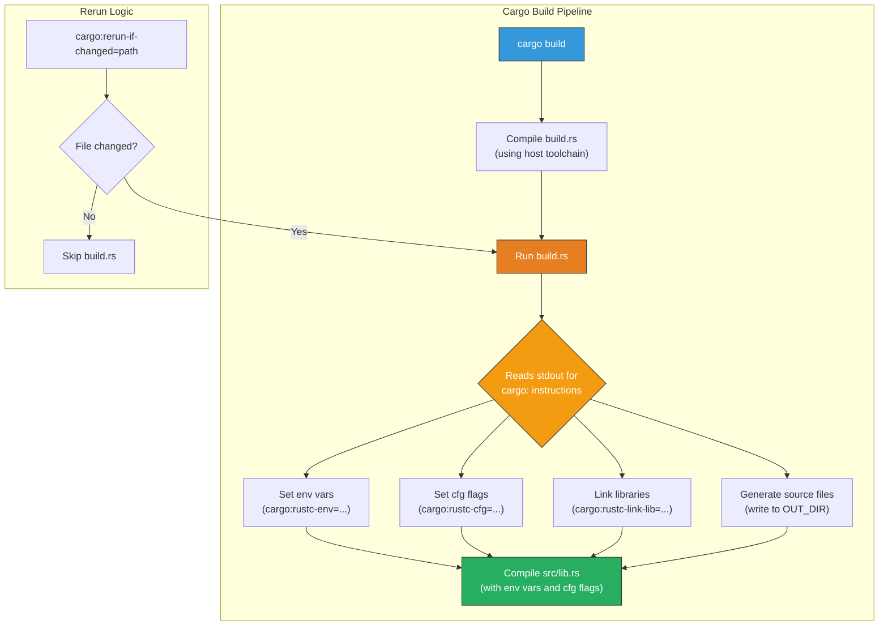

# 6. Mastering `build.rs` 🟡

> **What you'll learn:**
> - The complete `build.rs` lifecycle: when it runs, what triggers reruns, and how it communicates with Cargo.
> - The full set of `cargo:` instructions: `rustc-env`, `rustc-cfg`, `rustc-link-lib`, `rerun-if-changed`, `rerun-if-env-changed`, and `warning`.
> - How to emit conditional compilation flags (`cfg`) dynamically based on target OS, CPU features, or environment variables.
> - Best practices for keeping `build.rs` fast and deterministic.

**Cross-references:** This chapter prepares you for the code generation patterns in [Chapter 7](ch07-c-interop-and-code-generation.md). For proc-macro alternatives to `build.rs`, see [Rust Metaprogramming](../metaprogramming-book/src/SUMMARY.md).

---

## What Is `build.rs`?

`build.rs` is a Rust program that Cargo compiles and runs **before** compiling your crate. It sits at the root of your package (next to `Cargo.toml`) and communicates with Cargo by printing specially formatted lines to stdout.

Think of it as a pre-compilation hook. It can:

- Set environment variables accessible via `env!()` in your main code.
- Emit `cfg` flags for conditional compilation (`#[cfg(feature = "...")]`-style).
- Compile C/C++ source code and link it into your crate.
- Generate Rust source files that `include!()` pulls into compilation.
- Tell Cargo when to re-run the build script (and when not to).



---

## The Build Script Lifecycle

### When Does `build.rs` Run?

1. **First build** — always runs.
2. **Subsequent builds** — Cargo checks the rerun conditions:
   - If `build.rs` itself changed → rerun.
   - If any file listed in `cargo:rerun-if-changed=<path>` changed → rerun.
   - If any env var listed in `cargo:rerun-if-env-changed=<var>` changed → rerun.
   - If **no** `rerun-if-*` instructions were printed → rerun on **any** file change in the package.

That last point is critical:

```rust,ignore
// 💥 PERFORMANCE HAZARD: No rerun-if-changed means "rerun always"
fn main() {
    // This build script runs every single time `cargo build` is called,
    // because Cargo has no way to know what it depends on.
    let version = std::fs::read_to_string("VERSION").unwrap();
    println!("cargo:rustc-env=APP_VERSION={version}");
}

// ✅ FIX: Tell Cargo exactly what to watch
fn main() {
    println!("cargo:rerun-if-changed=VERSION");
    let version = std::fs::read_to_string("VERSION").unwrap();
    println!("cargo:rustc-env=APP_VERSION={version}");
}
```

### Environment Variables Available to `build.rs`

Cargo sets many environment variables that `build.rs` can read:

| Variable | Example | Use case |
|----------|---------|----------|
| `OUT_DIR` | `/path/to/target/debug/build/my-crate-abc123/out` | Where to write generated files |
| `TARGET` | `x86_64-unknown-linux-gnu` | Cross-compilation target |
| `HOST` | `x86_64-apple-darwin` | The machine running the build |
| `CARGO_PKG_VERSION` | `1.2.3` | Your crate's version from Cargo.toml |
| `CARGO_PKG_NAME` | `my_crate` | Your crate's name |
| `PROFILE` | `debug` or `release` | Build profile |
| `CARGO_FEATURE_<NAME>` | `CARGO_FEATURE_TLS` (set if feature is active) | Feature detection |
| `CARGO_CFG_TARGET_OS` | `linux`, `macos`, `windows` | Target OS |
| `CARGO_CFG_TARGET_ARCH` | `x86_64`, `aarch64` | Target CPU architecture |

---

## The `cargo:` Instruction Protocol

`build.rs` communicates with Cargo by printing lines to stdout. Each line starts with `cargo:` followed by an instruction.

### Setting Environment Variables: `cargo:rustc-env`

Makes an environment variable available at compile time via `env!()`:

```rust,ignore
// build.rs
fn main() {
    println!("cargo:rerun-if-env-changed=BUILD_ID");
    
    let build_id = std::env::var("BUILD_ID")
        .unwrap_or_else(|_| "dev".to_string());
    
    println!("cargo:rustc-env=BUILD_ID={build_id}");
    println!("cargo:rustc-env=BUILD_TIMESTAMP={}", chrono::Utc::now().to_rfc3339());
}

// src/lib.rs
pub fn build_info() -> &'static str {
    concat!(
        "build_id=", env!("BUILD_ID"),
        " built_at=", env!("BUILD_TIMESTAMP"),
    )
}
```

### Setting `cfg` Flags: `cargo:rustc-cfg`

Enables conditional compilation based on runtime detection:

```rust,ignore
// build.rs
fn main() {
    println!("cargo:rerun-if-changed=build.rs");
    
    let target_os = std::env::var("CARGO_CFG_TARGET_OS").unwrap();
    let target_arch = std::env::var("CARGO_CFG_TARGET_ARCH").unwrap();
    
    // Emit a cfg flag for SIMD availability
    if target_arch == "x86_64" {
        println!("cargo:rustc-cfg=has_sse42");
    }
    if target_arch == "aarch64" {
        println!("cargo:rustc-cfg=has_neon");
    }
    
    // Emit a cfg flag for platform-specific optimization
    if target_os == "linux" {
        println!("cargo:rustc-cfg=has_io_uring");
    }
}

// src/lib.rs
pub fn fast_hash(data: &[u8]) -> u64 {
    #[cfg(has_sse42)]
    {
        unsafe { sse42_crc_hash(data) }
    }
    #[cfg(has_neon)]
    {
        unsafe { neon_crc_hash(data) }
    }
    #[cfg(not(any(has_sse42, has_neon)))]
    {
        software_hash(data)
    }
}
```

### Warning Messages: `cargo:warning`

Emits a compiler warning visible to the user:

```rust,ignore
// build.rs
fn main() {
    println!("cargo:rerun-if-env-changed=DATABASE_URL");
    
    if std::env::var("DATABASE_URL").is_err() {
        println!("cargo:warning=DATABASE_URL is not set; using default localhost connection");
    }
}
```

### Linking Libraries: `cargo:rustc-link-lib` and `cargo:rustc-link-search`

Used for FFI — telling the linker where to find native libraries:

```rust,ignore
// build.rs
fn main() {
    println!("cargo:rerun-if-changed=build.rs");
    
    // Link to a system library
    println!("cargo:rustc-link-lib=z");          // -lz (zlib)
    println!("cargo:rustc-link-lib=static=mylib"); // static linking
    
    // Add a search path for the linker
    println!("cargo:rustc-link-search=native=/usr/local/lib");
}
```

We'll use these extensively in [Chapter 7](ch07-c-interop-and-code-generation.md).

### The Full Instruction Reference

| Instruction | Effect |
|-------------|--------|
| `cargo:rerun-if-changed=<path>` | Re-run if `<path>` changes (file or directory) |
| `cargo:rerun-if-env-changed=<var>` | Re-run if environment variable `<var>` changes |
| `cargo:rustc-env=<KEY>=<VALUE>` | Set compile-time env var (accessible via `env!()`) |
| `cargo:rustc-cfg=<flag>` | Enable `#[cfg(flag)]` conditional compilation |
| `cargo:rustc-link-lib=[kind=]<name>` | Link to native library (kind: `static`, `dylib`, `framework`) |
| `cargo:rustc-link-search=[kind=]<path>` | Add native library search directory |
| `cargo:rustc-cdylib-link-arg=<flag>` | Pass a flag to the linker for cdylib targets |
| `cargo:warning=<message>` | Emit a compile-time warning |
| `cargo:metadata=<KEY>=<VALUE>` | Set metadata for dependent crates to read |

---

## Generating Source Files

One of the most powerful uses of `build.rs` is generating Rust source code that's included in your crate at compile time.

### The Pattern

```rust,ignore
// build.rs
use std::env;
use std::fs;
use std::path::Path;

fn main() {
    println!("cargo:rerun-if-changed=sql/queries");
    
    let out_dir = env::var("OUT_DIR").unwrap();
    let dest_path = Path::new(&out_dir).join("generated_queries.rs");
    
    // Read SQL files and generate Rust constants
    let mut code = String::new();
    code.push_str("// Auto-generated by build.rs — do not edit!\n\n");
    
    for entry in fs::read_dir("sql/queries").unwrap() {
        let entry = entry.unwrap();
        let name = entry.file_name();
        let name_str = name.to_str().unwrap();
        if name_str.ends_with(".sql") {
            let const_name = name_str
                .trim_end_matches(".sql")
                .to_uppercase()
                .replace('-', "_");
            let sql = fs::read_to_string(entry.path()).unwrap();
            code.push_str(&format!(
                "pub const {const_name}: &str = r#\"{sql}\"#;\n"
            ));
        }
    }
    
    fs::write(&dest_path, code).unwrap();
}

// src/lib.rs
/// SQL queries generated at build time from the `sql/queries/` directory.
pub mod queries {
    include!(concat!(env!("OUT_DIR"), "/generated_queries.rs"));
}

// Usage:
// println!("{}", queries::GET_USER_BY_ID);  // the SQL string from sql/queries/get-user-by-id.sql
```

---

## Best Practices

### 1. Always Specify Rerun Conditions

```rust,ignore
// The most common pattern:
fn main() {
    // Watch the build script itself
    println!("cargo:rerun-if-changed=build.rs");
    // Watch input files
    println!("cargo:rerun-if-changed=proto/schema.proto");
    // Watch environment variables
    println!("cargo:rerun-if-env-changed=DATABASE_URL");
}
```

### 2. Keep `build.rs` Dependencies Minimal

Every crate you use in `build.rs` must be compiled before your crate. This adds to your build time. Prefer `std`-only solutions when possible:

```toml
# Cargo.toml
[build-dependencies]
# ✅ Only what you truly need
cc = "1"  # for compiling C code

# 💥 AVOID: Heavy dependencies in build.rs
# serde = { version = "1", features = ["derive"] }
# reqwest = "0.12"  # NEVER do network I/O in build.rs!
```

### 3. Never Do Network I/O

Build scripts run during compilation, often in sandboxed environments (CI, air-gapped networks). Network calls make builds non-reproducible and fragile. Download assets in a separate step and check them into source control or a content-addressed cache.

### 4. Make Output Deterministic

Build scripts that produce different output on each run cause unnecessary recompilation:

```rust,ignore
// 💥 Non-deterministic: changes every build
println!("cargo:rustc-env=BUILD_TIME={}", std::time::SystemTime::now());

// ✅ Deterministic: only changes when the source changes
// Use a hash of the input, or the git commit SHA (which is stable per commit)
```

### 5. Use `OUT_DIR` for Generated Files

Never write to `src/`. Always write to `OUT_DIR` and include the generated files with `include!()`:

```rust,ignore
// ✅ Write to OUT_DIR
let out_dir = std::env::var("OUT_DIR").unwrap();
let path = std::path::Path::new(&out_dir).join("generated.rs");
std::fs::write(path, generated_code).unwrap();
```

---

<details>
<summary><strong>🏋️ Exercise: Build a Version Info Module</strong> (click to expand)</summary>

Create a `build.rs` that generates a `version_info` module containing:

1. The crate version from `Cargo.toml` (via `CARGO_PKG_VERSION`).
2. The target triple (via `TARGET`).
3. The build profile (`debug` or `release`, via `PROFILE`).
4. A `cfg` flag `is_release` that is only set in release builds.

Then use these in `src/lib.rs` to implement a `fn version_string() -> String` and conditionally compile a more detailed debug banner when `not(is_release)`.

<details>
<summary>🔑 Solution</summary>

```rust,ignore
// ── build.rs ─────────────────────────────────────────────────────
fn main() {
    // Watch only the build script itself — all inputs are env vars.
    println!("cargo:rerun-if-changed=build.rs");

    // Read Cargo-provided environment variables.
    let version = std::env::var("CARGO_PKG_VERSION").unwrap();
    let target = std::env::var("TARGET").unwrap();
    let profile = std::env::var("PROFILE").unwrap();

    // Emit compile-time environment variables.
    println!("cargo:rustc-env=BUILD_TARGET={target}");
    println!("cargo:rustc-env=BUILD_PROFILE={profile}");
    // CARGO_PKG_VERSION is already available via env!(), so we don't
    // need to re-emit it — but we do for consistency in our module.
    println!("cargo:rustc-env=BUILD_VERSION={version}");

    // Emit a cfg flag for release builds.
    if profile == "release" {
        println!("cargo:rustc-cfg=is_release");
    }
}
```

```rust
// ── src/lib.rs ───────────────────────────────────────────────────

/// Returns a human-readable version string.
///
/// In release builds, returns a compact string.
/// In debug builds, includes the target triple and profile.
pub fn version_string() -> String {
    let version = env!("BUILD_VERSION");

    #[cfg(is_release)]
    {
        format!("v{version}")
    }

    #[cfg(not(is_release))]
    {
        let target = env!("BUILD_TARGET");
        let profile = env!("BUILD_PROFILE");
        format!("v{version} ({target}, {profile})")
    }
}

#[cfg(test)]
mod tests {
    use super::*;

    #[test]
    fn version_string_contains_version() {
        let v = version_string();
        // In test builds (debug profile), we get the full string.
        assert!(v.starts_with('v'));
        assert!(v.contains(env!("CARGO_PKG_VERSION")));
    }
}
```

</details>
</details>

---

> **Key Takeaways**
> - `build.rs` runs before your crate compiles. It communicates with Cargo via `println!("cargo:...")` instructions on stdout.
> - Always specify `rerun-if-changed` or `rerun-if-env-changed`. Without them, your build script runs on every single build.
> - Use `cargo:rustc-env` to inject compile-time values and `cargo:rustc-cfg` for conditional compilation. Write generated source files to `OUT_DIR` and include them with `include!()`.
> - Keep build scripts fast, deterministic, and offline. Never do network I/O. Minimize `[build-dependencies]`.

> **See also:**
> - [Chapter 7: C-Interop and Code Generation](ch07-c-interop-and-code-generation.md) — using `build.rs` with the `cc` crate and Protobuf code generators.
> - [Rust Metaprogramming](../metaprogramming-book/src/SUMMARY.md) — when proc-macros are a better fit than `build.rs`.
> - [Cargo Build Scripts documentation](https://doc.rust-lang.org/cargo/reference/build-scripts.html) — the official reference.
