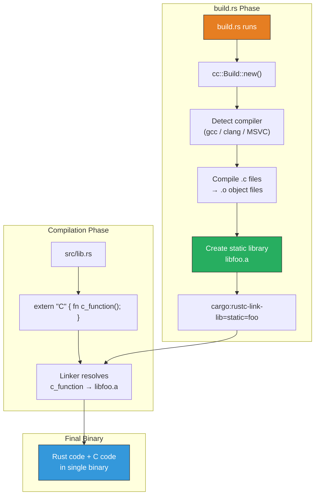
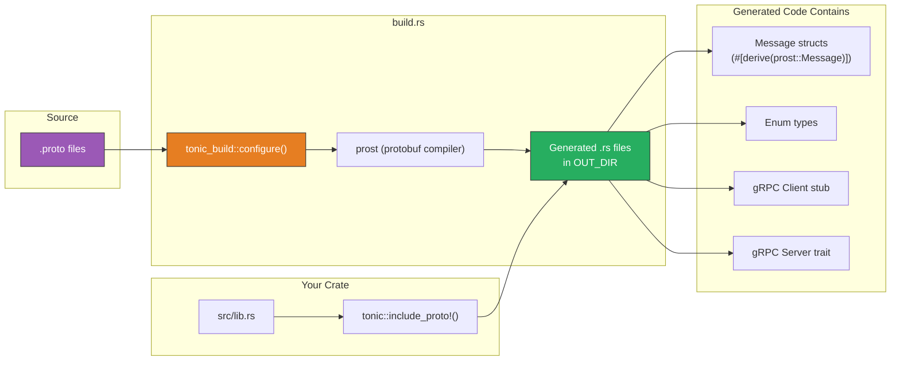

# 7. C-Interop and Code Generation 🔴

> **What you'll learn:**
> - How to compile C and C++ source code directly into your Rust crate using the `cc` crate in `build.rs`.
> - How to discover and link system libraries using `pkg-config` for portable builds across Linux, macOS, and Windows.
> - How to generate Rust types and gRPC service stubs from `.proto` files using `prost` and `tonic-build`.
> - The architecture of code generation pipelines: keeping generated code out of source control while maintaining reproducibility.

**Cross-references:** This chapter builds directly on the `build.rs` foundations from [Chapter 6](ch06-mastering-build-rs.md). For raw FFI and `unsafe` bindings, see [Unsafe Rust & FFI](../unsafe-ffi-book/src/SUMMARY.md).

---

## Compiling C/C++ with the `cc` Crate

The [`cc`](https://docs.rs/cc) crate is the standard way to compile C/C++ source files as part of your Rust build. It handles compiler detection (gcc, clang, MSVC), cross-compilation, and emitting the correct `cargo:rustc-link-lib` instructions.

### Why Compile C from `build.rs`?

- **Performance-critical inner loops** — sometimes a hand-optimized C function outperforms anything Rust can generate (e.g., SIMD implementations, kernel bypass routines).
- **Wrapping existing C libraries** — when you have C source code and want to compile it alongside your Rust crate without requiring a system-wide installation.
- **Platform-specific code** — assembly or platform APIs that only have C headers.



### Basic Usage

```toml
# Cargo.toml
[build-dependencies]
cc = "1"
```

```c
// c_src/fast_hash.c
#include <stdint.h>
#include <stddef.h>

// A simple demonstration hash function.
uint64_t fast_hash(const uint8_t *data, size_t len) {
    uint64_t hash = 0xcbf29ce484222325ULL;  // FNV offset basis
    for (size_t i = 0; i < len; i++) {
        hash ^= (uint64_t)data[i];
        hash *= 0x100000001b3ULL;  // FNV prime
    }
    return hash;
}
```

```rust,ignore
// build.rs
fn main() {
    println!("cargo:rerun-if-changed=c_src/fast_hash.c");
    
    cc::Build::new()
        .file("c_src/fast_hash.c")
        .opt_level(3)              // Always optimize C code
        .warnings(true)            // Enable C compiler warnings
        .compile("fast_hash");     // Produces libfast_hash.a
    
    // cc automatically emits:
    // cargo:rustc-link-lib=static=fast_hash
    // cargo:rustc-link-search=native={OUT_DIR}
}
```

```rust,ignore
// src/lib.rs

// Declare the C function signature
extern "C" {
    fn fast_hash(data: *const u8, len: usize) -> u64;
}

/// Compute a hash of the input bytes using the C implementation.
///
/// # Safety
///
/// This function calls into C code. The C implementation has been
/// audited and does not access memory beyond `data[0..data.len()]`.
pub fn hash(data: &[u8]) -> u64 {
    // SAFETY: We pass a valid pointer and the correct length.
    // The C function only reads within bounds.
    unsafe { fast_hash(data.as_ptr(), data.len()) }
}
```

### Compiling C++ and Multiple Files

```rust,ignore
// build.rs
fn main() {
    println!("cargo:rerun-if-changed=cpp_src/");
    
    cc::Build::new()
        .cpp(true)                        // C++ mode
        .file("cpp_src/encoder.cpp")
        .file("cpp_src/decoder.cpp")
        .include("cpp_src/include")       // -I path for headers
        .flag_if_supported("-std=c++17")  // C++ standard
        .flag_if_supported("-march=native") // Optimize for host CPU
        .define("NDEBUG", None)           // -DNDEBUG
        .compile("codec");
}
```

### Cross-Compilation

The `cc` crate automatically respects Cargo's target triple. When you run:

```bash
cargo build --target aarch64-unknown-linux-gnu
```

`cc` will use the appropriate cross-compiler (e.g., `aarch64-linux-gnu-gcc`). You can customize this with environment variables:

| Variable | Purpose |
|----------|---------|
| `CC` | C compiler path |
| `CXX` | C++ compiler path |
| `CFLAGS` | Additional C compiler flags |
| `CXXFLAGS` | Additional C++ compiler flags |
| `AR` | Archiver (for creating `.a` files) |

---

## Linking System Libraries with `pkg-config`

When you need to link against a library installed on the system (like `openssl`, `zlib`, or `sqlite3`), the [`pkg-config`](https://docs.rs/pkg-config) crate queries the system's `pkg-config` database to find compiler and linker flags.

```toml
# Cargo.toml
[build-dependencies]
pkg-config = "0.3"
```

```rust,ignore
// build.rs
fn main() {
    println!("cargo:rerun-if-changed=build.rs");
    
    // Find and link OpenSSL
    let openssl = pkg_config::Config::new()
        .atleast_version("1.1.0")
        .probe("openssl")
        .expect("OpenSSL >= 1.1.0 is required");
    
    // pkg_config automatically emits:
    // cargo:rustc-link-lib=ssl
    // cargo:rustc-link-lib=crypto
    // cargo:rustc-link-search=native=/usr/lib/x86_64-linux-gnu
    // cargo:include=/usr/include/openssl
    
    // You can also read the discovered paths:
    for path in &openssl.include_paths {
        println!("cargo:include={}", path.display());
    }
}
```

### Fallback Strategy

Not all systems have `pkg-config`. A robust `build.rs` should handle this:

```rust,ignore
// build.rs
fn main() {
    println!("cargo:rerun-if-changed=build.rs");
    
    // Try pkg-config first, fall back to manual paths
    if pkg_config::probe_library("zlib").is_err() {
        // Manual fallback for systems without pkg-config (e.g., Windows)
        println!("cargo:warning=pkg-config not found for zlib, using manual configuration");
        
        let target_os = std::env::var("CARGO_CFG_TARGET_OS").unwrap();
        match target_os.as_str() {
            "windows" => {
                println!("cargo:rustc-link-lib=static=zlibstatic");
                // User must set ZLIB_DIR environment variable
                if let Ok(dir) = std::env::var("ZLIB_DIR") {
                    println!("cargo:rustc-link-search=native={dir}/lib");
                }
            }
            _ => {
                println!("cargo:rustc-link-lib=z");
            }
        }
    }
}
```

---

## Protobuf Code Generation with `prost` and `tonic-build`

For gRPC and Protocol Buffer-based projects, `prost` generates Rust structs and enums from `.proto` files, while `tonic-build` additionally generates async gRPC client/server stubs.

### Architecture



### Setup

```toml
# Cargo.toml
[dependencies]
prost = "0.13"
tonic = "0.12"

[build-dependencies]
tonic-build = "0.12"
```

### The Proto File

```protobuf
// proto/database.proto
syntax = "proto3";

package database.v1;

service DatabaseService {
    rpc Query(QueryRequest) returns (QueryResponse);
    rpc Execute(ExecuteRequest) returns (ExecuteResponse);
}

message QueryRequest {
    string sql = 1;
    repeated Value params = 2;
}

message QueryResponse {
    repeated Row rows = 1;
    uint64 affected_rows = 2;
}

message ExecuteRequest {
    string sql = 1;
    repeated Value params = 2;
}

message ExecuteResponse {
    uint64 affected_rows = 1;
}

message Value {
    oneof kind {
        string text = 1;
        int64 integer = 2;
        double floating = 3;
        bool boolean = 4;
    }
}

message Row {
    map<string, Value> columns = 1;
}
```

### The Build Script

```rust,ignore
// build.rs
fn main() -> Result<(), Box<dyn std::error::Error>> {
    // Watch the proto files for changes
    println!("cargo:rerun-if-changed=proto/database.proto");
    
    tonic_build::configure()
        .build_server(true)        // Generate server trait
        .build_client(true)        // Generate client struct
        .type_attribute(
            ".",                   // Apply to all types
            "#[derive(serde::Serialize, serde::Deserialize)]"
        )
        .type_attribute(
            "database.v1.QueryRequest",
            "#[non_exhaustive]"    // SemVer-safe generated types
        )
        .compile_protos(
            &["proto/database.proto"],  // Proto files to compile
            &["proto/"],               // Include paths
        )?;
    
    Ok(())
}
```

### Using Generated Code

```rust,ignore
// src/lib.rs

/// Generated protobuf types and gRPC stubs.
pub mod proto {
    tonic::include_proto!("database.v1");
}

// Now you can use:
// proto::QueryRequest { sql: "SELECT ...", params: vec![] }
// proto::database_service_client::DatabaseServiceClient::connect("http://...")
// proto::database_service_server::DatabaseServiceServer::new(my_impl)
```

### Keeping Generated Code Out of Source Control

Generated `.rs` files live in `OUT_DIR` (inside `target/`), so they're automatically gitignored. This is the recommended approach. If you need to inspect the generated code:

```bash
# Find the generated files
find target -name "database.v1.rs" -path "*/out/*"

# Or tell tonic-build to output to a visible directory (for debugging only):
# tonic_build::configure()
#     .out_dir("src/generated/")  // ⚠️ Only for debugging!
#     .compile_protos(...)
```

---

## Advanced: Custom Code Generation

Sometimes you need to generate Rust code from a custom schema (not protobuf). The pattern is the same: read input files, generate Rust source, write to `OUT_DIR`.

```rust,ignore
// build.rs — Generate enum variants from a YAML configuration file
use std::env;
use std::fs;
use std::path::Path;

fn main() {
    println!("cargo:rerun-if-changed=schemas/error_codes.yaml");
    
    let yaml = fs::read_to_string("schemas/error_codes.yaml").unwrap();
    let out_dir = env::var("OUT_DIR").unwrap();
    let dest = Path::new(&out_dir).join("error_codes.rs");
    
    let mut code = String::new();
    code.push_str("// Auto-generated from error_codes.yaml — do not edit!\n\n");
    code.push_str("#[derive(Debug, Clone, Copy, PartialEq, Eq, Hash)]\n");
    code.push_str("#[non_exhaustive]\n");
    code.push_str("pub enum ErrorCode {\n");
    
    // Parse YAML (using a simple line-based approach to avoid heavy deps)
    for line in yaml.lines() {
        let line = line.trim();
        if line.is_empty() || line.starts_with('#') {
            continue;
        }
        if let Some((code_name, description)) = line.split_once(':') {
            let code_name = code_name.trim();
            let description = description.trim().trim_matches('"');
            code.push_str(&format!("    /// {description}\n"));
            code.push_str(&format!("    {code_name},\n"));
        }
    }
    
    code.push_str("}\n");
    
    fs::write(dest, code).unwrap();
}
```

---

## Build Script Dependencies and Caching

### `[build-dependencies]` vs `[dependencies]`

| Section | When it's compiled | Who uses it |
|---------|--------------------|-------------|
| `[dependencies]` | For the target platform | Your crate's source code |
| `[build-dependencies]` | For the host platform | `build.rs` only |
| `[dev-dependencies]` | For the target platform | Tests and benchmarks |

When cross-compiling, `build-dependencies` are compiled for the **host** (the machine running the build), while `dependencies` are compiled for the **target** (the platform the binary will run on). This distinction matters for `cc`, which must run on the host.

### Build Script Caching

Cargo caches `build.rs` outputs between builds. If the rerun conditions aren't met, Cargo reuses the previous output. This is why correct `rerun-if-changed` directives are critical — incorrect ones lead to stale builds or unnecessary rebuilds.

---

<details>
<summary><strong>🏋️ Exercise: Build a Crate with C and Proto Sources</strong> (click to expand)</summary>

Create a Rust library crate that:

1. **Compiles a C file** (`c_src/crc32.c`) containing a CRC32 checksum function.
2. **Generates types from a proto file** (`proto/message.proto`) containing a `ChecksumRequest` and `ChecksumResponse`.
3. **Exposes a safe Rust API** that ties them together: a function that takes a `ChecksumRequest` (generated) and returns a `ChecksumResponse` with the CRC32 computed by the C code.

Write the `build.rs`, the C source file, the proto file, and the Rust wrappers.

<details>
<summary>🔑 Solution</summary>

```toml
# Cargo.toml
[package]
name = "checksum-service"
version = "0.1.0"
edition = "2021"

[dependencies]
prost = "0.13"

[build-dependencies]
cc = "1"
prost-build = "0.13"
```

```c
// c_src/crc32.c
#include <stdint.h>
#include <stddef.h>

// Standard CRC32 implementation using the polynomial 0xEDB88320.
static uint32_t crc32_table[256];
static int table_initialized = 0;

static void init_table(void) {
    for (uint32_t i = 0; i < 256; i++) {
        uint32_t crc = i;
        for (int j = 0; j < 8; j++) {
            if (crc & 1)
                crc = (crc >> 1) ^ 0xEDB88320;
            else
                crc >>= 1;
        }
        crc32_table[i] = crc;
    }
    table_initialized = 1;
}

uint32_t compute_crc32(const uint8_t *data, size_t len) {
    if (!table_initialized) init_table();
    
    uint32_t crc = 0xFFFFFFFF;
    for (size_t i = 0; i < len; i++) {
        uint8_t index = (uint8_t)((crc ^ data[i]) & 0xFF);
        crc = (crc >> 8) ^ crc32_table[index];
    }
    return crc ^ 0xFFFFFFFF;
}
```

```protobuf
// proto/message.proto
syntax = "proto3";

package checksum.v1;

message ChecksumRequest {
    bytes data = 1;
}

message ChecksumResponse {
    uint32 crc32 = 1;
    uint64 data_length = 2;
}
```

```rust,ignore
// build.rs
fn main() -> Result<(), Box<dyn std::error::Error>> {
    // ── Step 1: Compile C source ─────────────────────────────────
    println!("cargo:rerun-if-changed=c_src/crc32.c");
    
    cc::Build::new()
        .file("c_src/crc32.c")
        .opt_level(3)
        .compile("crc32");
    
    // ── Step 2: Generate Rust types from proto ───────────────────
    println!("cargo:rerun-if-changed=proto/message.proto");
    
    prost_build::Config::new()
        .type_attribute(".", "#[derive(Eq, Hash)]")
        .compile_protos(
            &["proto/message.proto"],
            &["proto/"],
        )?;
    
    Ok(())
}
```

```rust,ignore
// src/lib.rs

/// Generated protobuf types.
pub mod proto {
    include!(concat!(env!("OUT_DIR"), "/checksum.v1.rs"));
}

// FFI declaration for the C function.
extern "C" {
    fn compute_crc32(data: *const u8, len: usize) -> u32;
}

/// Compute a CRC32 checksum for the given request.
///
/// This function calls into an optimized C implementation for the
/// actual CRC32 computation.
pub fn checksum(request: &proto::ChecksumRequest) -> proto::ChecksumResponse {
    let data = &request.data;
    
    // SAFETY: We pass a valid pointer to the start of the slice
    // and the exact length. The C function reads only within bounds.
    let crc = unsafe { compute_crc32(data.as_ptr(), data.len()) };
    
    proto::ChecksumResponse {
        crc32: crc,
        data_length: data.len() as u64,
    }
}

#[cfg(test)]
mod tests {
    use super::*;
    
    #[test]
    fn test_empty_data() {
        let req = proto::ChecksumRequest { data: vec![] };
        let resp = checksum(&req);
        assert_eq!(resp.crc32, 0x00000000);
        assert_eq!(resp.data_length, 0);
    }
    
    #[test]
    fn test_known_checksum() {
        // CRC32 of "123456789" is 0xCBF43926
        let req = proto::ChecksumRequest {
            data: b"123456789".to_vec(),
        };
        let resp = checksum(&req);
        assert_eq!(resp.crc32, 0xCBF43926);
        assert_eq!(resp.data_length, 9);
    }
}
```

</details>
</details>

---

> **Key Takeaways**
> - The `cc` crate is your standard tool for compiling C/C++ into a Rust crate. It handles compiler detection, cross-compilation, and Cargo linkage instructions automatically.
> - Use `pkg-config` to discover system libraries portably. Always provide a fallback for platforms without `pkg-config`.
> - `prost` and `tonic-build` generate Rust types and gRPC stubs from `.proto` files during `build.rs`. Generated files live in `OUT_DIR` and are included via `include!()` or `tonic::include_proto!()`.
> - Keep generated code out of source control. Trust the build system to regenerate it. Use `rerun-if-changed` on the source schema files to ensure correctness.

> **See also:**
> - [Chapter 6: Mastering `build.rs`](ch06-mastering-build-rs.md) — the lifecycle and instruction set that this chapter builds upon.
> - [Chapter 8: Capstone](ch08-capstone-production-grade-sdk.md) — using `build.rs` + `prost` in a full SDK.
> - [Unsafe Rust & FFI](../unsafe-ffi-book/src/SUMMARY.md) — for deeper coverage of `extern "C"`, `bindgen`, and `cbindgen`.
