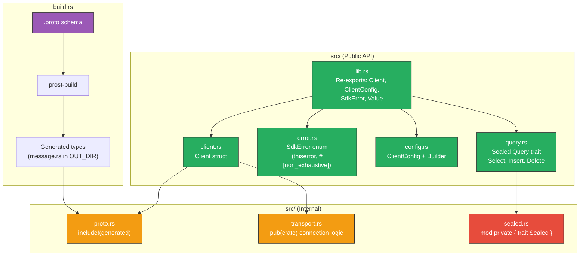

# 8. Capstone: Building a Production-Grade SDK 🔴

> **What you'll learn:**
> - How to synthesize *every* technique from this book into a single, cohesive library: API guidelines, SemVer, sealed traits, structured errors, and `build.rs` code generation.
> - How to design a type-safe Builder pattern for client configuration that prevents misconfiguration at compile time.
> - How to structure a crate's module hierarchy for minimal public surface area and maximum internal flexibility.
> - How to think like a library *consumer* — designing the API from the outside in.

**Cross-references:** This chapter draws from every previous chapter. You should be comfortable with [the API Guidelines (Ch 1)](ch01-rust-api-guidelines.md), [SemVer (Ch 2)](ch02-visibility-encapsulation-semver.md), [Sealed Traits (Ch 3)](ch03-sealed-trait-pattern.md), [Error Architecture (Ch 4–5)](ch04-libraries-vs-applications.md), and [`build.rs` (Ch 6–7)](ch06-mastering-build-rs.md).

---

## The Project: `mock_db_sdk`

We're building an SDK crate for a fictional distributed database called "MockDB." The SDK must:

1. **Generate message types** from a `.proto` file using `build.rs` + `prost`.
2. **Provide a type-safe Builder** for `ClientConfig` that can't be misconfigured.
3. **Define a sealed `Query` trait** that users can use but cannot implement.
4. **Return structured errors** via `thiserror` that never leak internal dependencies.
5. **Be 100% SemVer-safe** — fields, variants, and traits can evolve in minor releases.

Here's what the final API looks like from a consumer's perspective:

```rust,ignore
use mock_db_sdk::{Client, ClientConfig, SdkError};
use mock_db_sdk::query::{Select, Insert, Query};

fn main() -> Result<(), Box<dyn std::error::Error>> {
    // 1. Build configuration using the type-safe builder
    let config = ClientConfig::builder()
        .endpoint("mockdb://db.example.com:9042")
        .credentials("admin", "hunter2")
        .timeout(std::time::Duration::from_secs(5))
        .max_connections(10)
        .build()?;
    
    // 2. Create a client
    let client = Client::connect(config)?;
    
    // 3. Execute queries using the sealed Query trait
    let select = Select::new("SELECT name FROM users WHERE id = ?")
        .bind(mock_db_sdk::Value::Int(42));
    
    let rows = client.query(&select)?;
    
    let insert = Insert::new("INSERT INTO users (name, age) VALUES (?, ?)")
        .bind(mock_db_sdk::Value::Text("Alice".into()))
        .bind(mock_db_sdk::Value::Int(30));
    
    let affected = client.execute(&insert)?;
    println!("Inserted {affected} rows");
    
    // 4. Errors are structured and matchable
    match client.query(&select) {
        Ok(rows) => println!("Got {} rows", rows.len()),
        Err(SdkError::ConnectionTimeout { timeout_ms }) => {
            eprintln!("Timed out after {timeout_ms}ms, retrying...");
        }
        Err(SdkError::AuthFailed { user }) => {
            eprintln!("Auth failed for {user}");
        }
        Err(e) => return Err(e.into()),  // wildcard for #[non_exhaustive]
    }
    
    Ok(())
}
```

---

## Architecture Overview



---

## Step 1: The Proto Schema and `build.rs`

```protobuf
// proto/mockdb.proto
syntax = "proto3";
package mockdb.v1;

message QueryRequest {
    string sql = 1;
    repeated ParamValue params = 2;
}

message QueryResponse {
    repeated Row rows = 1;
    uint64 affected_rows = 2;
}

message ParamValue {
    oneof kind {
        string text = 1;
        int64 integer = 2;
        double floating = 3;
        bool boolean = 4;
    }
}

message Row {
    map<string, ParamValue> columns = 1;
}
```

```rust,ignore
// build.rs
fn main() -> Result<(), Box<dyn std::error::Error>> {
    println!("cargo:rerun-if-changed=proto/mockdb.proto");
    println!("cargo:rerun-if-changed=build.rs");
    
    prost_build::Config::new()
        // Make all generated types derive common traits (C-COMMON-TRAITS)
        .type_attribute(".", "#[derive(Eq, Hash)]")
        // Make types #[non_exhaustive] for SemVer safety
        .type_attribute("mockdb.v1.QueryRequest", "#[non_exhaustive]")
        .type_attribute("mockdb.v1.QueryResponse", "#[non_exhaustive]")
        .type_attribute("mockdb.v1.Row", "#[non_exhaustive]")
        .compile_protos(
            &["proto/mockdb.proto"],
            &["proto/"],
        )?;
    
    Ok(())
}
```

```rust,ignore
// src/proto.rs — internal module (not pub)
pub(crate) mod types {
    include!(concat!(env!("OUT_DIR"), "/mockdb.v1.rs"));
}
```

Note: the generated proto types are `pub(crate)` — they are **not** part of our public API. We expose our own types that wrap or translate them. This means we can change the proto schema or switch from prost to another serializer without breaking downstream.

---

## Step 2: The Error Architecture

```rust,ignore
// src/error.rs
use std::backtrace::Backtrace;
use thiserror::Error;

/// Errors returned by the MockDB SDK.
///
/// This enum is `#[non_exhaustive]` — new variants may be added in minor releases.
/// Always include a wildcard arm (`_ => ...`) when matching.
#[derive(Debug, Error)]
#[non_exhaustive]
pub enum SdkError {
    /// The connection to the database timed out.
    #[error("connection timed out after {timeout_ms}ms")]
    ConnectionTimeout {
        /// The timeout that was exceeded, in milliseconds.
        timeout_ms: u64,
    },

    /// Authentication failed.
    #[error("authentication failed for user {user:?}")]
    AuthFailed {
        /// The username that was rejected.
        user: String,
    },

    /// The client configuration is invalid.
    #[error("invalid configuration: {reason}")]
    InvalidConfig {
        /// What was wrong with the configuration.
        reason: String,
    },

    /// A query failed to execute.
    #[error("query execution failed: {message}")]
    QueryFailed {
        /// A human-readable summary of the failure.
        message: String,
        /// The underlying cause (type-erased — does not leak internal types).
        #[source]
        source: Box<dyn std::error::Error + Send + Sync>,
        /// A backtrace captured at the point of error creation.
        backtrace: Backtrace,
    },

    /// An I/O error occurred during communication.
    #[error("I/O error during database communication")]
    Io(#[from] std::io::Error),
}

/// A Result alias for MockDB SDK operations.
pub type Result<T> = std::result::Result<T, SdkError>;
```

Key design decisions:
- `#[non_exhaustive]` — adding variants is a non-breaking change.
- `QueryFailed` uses `Box<dyn Error + Send + Sync>` — no internal types leak.
- `Backtrace` is captured in `QueryFailed` where debugging is most valuable.
- `Io` uses `#[from]` for `std::io::Error` — this is safe because `std::io::Error` is a standard type.
- A `Result<T>` type alias follows the ecosystem convention.

---

## Step 3: The Type-Safe Builder Pattern

The Builder pattern ensures that required fields must be set before `build()` is called. We use the typestate variant to make this a compile-time guarantee.

```rust,ignore
// src/config.rs
use std::time::Duration;
use crate::error::SdkError;

/// Configuration for connecting to MockDB.
///
/// Use [`ClientConfig::builder()`] to construct.
#[derive(Debug, Clone)]
#[non_exhaustive]
pub struct ClientConfig {
    /// The MockDB endpoint URL.
    pub endpoint: String,
    /// The authentication username.
    pub username: String,
    /// Connection timeout duration.
    pub timeout: Duration,
    /// Maximum number of connections in the pool.
    pub max_connections: u32,
    // Password is NOT public — it's internal only.
    pub(crate) password: String,
}

impl ClientConfig {
    /// Creates a new builder for client configuration.
    pub fn builder() -> ClientConfigBuilder<NeedsEndpoint> {
        ClientConfigBuilder {
            state: NeedsEndpoint,
            timeout: Duration::from_secs(30),
            max_connections: 5,
        }
    }
}

// ── Typestate Markers ────────────────────────────────────────────
// These types exist only to encode the builder's state at compile time.
// They have no runtime representation (zero-sized types).

/// Builder state: endpoint has not been set yet.
#[derive(Debug)]
pub struct NeedsEndpoint;

/// Builder state: endpoint is set, credentials are not.
#[derive(Debug)]
pub struct NeedsCredentials {
    endpoint: String,
}

/// Builder state: all required fields are set.
#[derive(Debug)]
pub struct Ready {
    endpoint: String,
    username: String,
    password: String,
}

/// A builder for [`ClientConfig`].
///
/// Required methods must be called in order:
/// 1. [`endpoint()`](ClientConfigBuilder::endpoint) → sets the database URL.
/// 2. [`credentials()`](ClientConfigBuilder::credentials) → sets authentication.
/// 3. [`build()`](ClientConfigBuilder::build) → produces the final config.
///
/// Optional methods (timeout, max_connections) can be called at any stage.
#[derive(Debug)]
pub struct ClientConfigBuilder<State> {
    state: State,
    timeout: Duration,
    max_connections: u32,
}

// Methods available on ALL states:
impl<S> ClientConfigBuilder<S> {
    /// Sets the connection timeout. Default: 30 seconds.
    pub fn timeout(mut self, timeout: Duration) -> Self {
        self.timeout = timeout;
        self
    }

    /// Sets the maximum number of pooled connections. Default: 5.
    pub fn max_connections(mut self, n: u32) -> Self {
        self.max_connections = n;
        self
    }
}

// Methods available only in the NeedsEndpoint state:
impl ClientConfigBuilder<NeedsEndpoint> {
    /// Sets the MockDB endpoint URL.
    ///
    /// This is a required field.
    pub fn endpoint(self, endpoint: impl Into<String>) -> ClientConfigBuilder<NeedsCredentials> {
        ClientConfigBuilder {
            state: NeedsCredentials {
                endpoint: endpoint.into(),
            },
            timeout: self.timeout,
            max_connections: self.max_connections,
        }
    }
}

// Methods available only in the NeedsCredentials state:
impl ClientConfigBuilder<NeedsCredentials> {
    /// Sets the authentication credentials.
    ///
    /// This is a required field.
    pub fn credentials(
        self,
        username: impl Into<String>,
        password: impl Into<String>,
    ) -> ClientConfigBuilder<Ready> {
        ClientConfigBuilder {
            state: Ready {
                endpoint: self.state.endpoint,
                username: username.into(),
                password: password.into(),
            },
            timeout: self.timeout,
            max_connections: self.max_connections,
        }
    }
}

// Methods available only in the Ready state:
impl ClientConfigBuilder<Ready> {
    /// Builds the final ClientConfig.
    ///
    /// # Errors
    ///
    /// Returns [`SdkError::InvalidConfig`] if the endpoint URL is malformed.
    pub fn build(self) -> crate::error::Result<ClientConfig> {
        let endpoint = &self.state.endpoint;
        
        if !endpoint.starts_with("mockdb://") {
            return Err(SdkError::InvalidConfig {
                reason: format!(
                    "endpoint must start with 'mockdb://', got: {endpoint:?}"
                ),
            });
        }
        
        Ok(ClientConfig {
            endpoint: self.state.endpoint,
            username: self.state.username,
            password: self.state.password,
            timeout: self.timeout,
            max_connections: self.max_connections,
        })
    }
}
```

**Why typestates?**

```rust,ignore
// ✅ This compiles:
let config = ClientConfig::builder()
    .endpoint("mockdb://localhost:9042")
    .credentials("admin", "secret")
    .build()?;

// ❌ This does NOT compile — can't call .build() without .credentials():
// let config = ClientConfig::builder()
//     .endpoint("mockdb://localhost:9042")
//     .build();  // ERROR: method `build` not found for
//                //        `ClientConfigBuilder<NeedsCredentials>`

// ❌ This does NOT compile — can't call .credentials() without .endpoint():
// let config = ClientConfig::builder()
//     .credentials("admin", "secret");  // ERROR: method `credentials`
//                                       // not found for
//                                       // `ClientConfigBuilder<NeedsEndpoint>`
```

---

## Step 4: The Sealed Query Trait

```rust,ignore
// src/sealed.rs — internal module
pub(crate) mod private {
    pub trait Sealed {}
}

// src/query.rs
use crate::sealed::private;

/// A dynamically-typed parameter value for query binding.
#[derive(Debug, Clone, PartialEq)]
#[non_exhaustive]
pub enum Value {
    /// A text value.
    Text(String),
    /// An integer value.
    Int(i64),
    /// A floating-point value.
    Float(f64),
    /// A boolean value.
    Bool(bool),
    /// A null value.
    Null,
}

/// A database query that can be executed against a MockDB connection.
///
/// # Sealed
///
/// This trait is sealed and cannot be implemented outside of this crate.
/// Use [`Select`], [`Insert`], or [`Delete`] to construct queries.
pub trait Query: private::Sealed + std::fmt::Debug {
    /// Returns the SQL string for this query.
    fn sql(&self) -> &str;
    /// Returns the bound parameters.
    fn params(&self) -> &[Value];
    
    /// Returns true if this query modifies data (INSERT, UPDATE, DELETE).
    #[doc(hidden)]
    fn is_mutation(&self) -> bool;
}

/// A SELECT query.
#[derive(Debug, Clone)]
pub struct Select {
    sql: String,
    params: Vec<Value>,
}

impl Select {
    /// Creates a new SELECT query.
    pub fn new(sql: impl Into<String>) -> Self {
        Select { sql: sql.into(), params: Vec::new() }
    }

    /// Binds a parameter value.
    pub fn bind(mut self, value: Value) -> Self {
        self.params.push(value);
        self
    }
}

impl private::Sealed for Select {}
impl Query for Select {
    fn sql(&self) -> &str { &self.sql }
    fn params(&self) -> &[Value] { &self.params }
    fn is_mutation(&self) -> bool { false }
}

/// An INSERT query.
#[derive(Debug, Clone)]
pub struct Insert {
    sql: String,
    params: Vec<Value>,
}

impl Insert {
    /// Creates a new INSERT query.
    pub fn new(sql: impl Into<String>) -> Self {
        Insert { sql: sql.into(), params: Vec::new() }
    }

    /// Binds a parameter value.
    pub fn bind(mut self, value: Value) -> Self {
        self.params.push(value);
        self
    }
}

impl private::Sealed for Insert {}
impl Query for Insert {
    fn sql(&self) -> &str { &self.sql }
    fn params(&self) -> &[Value] { &self.params }
    fn is_mutation(&self) -> bool { true }
}

/// A DELETE query.
#[derive(Debug, Clone)]
pub struct Delete {
    sql: String,
    params: Vec<Value>,
}

impl Delete {
    /// Creates a new DELETE query.
    pub fn new(sql: impl Into<String>) -> Self {
        Delete { sql: sql.into(), params: Vec::new() }
    }

    /// Binds a parameter value.
    pub fn bind(mut self, value: Value) -> Self {
        self.params.push(value);
        self
    }
}

impl private::Sealed for Delete {}
impl Query for Delete {
    fn sql(&self) -> &str { &self.sql }
    fn params(&self) -> &[Value] { &self.params }
    fn is_mutation(&self) -> bool { true }
}
```

---

## Step 5: The Client

```rust,ignore
// src/client.rs
use crate::config::ClientConfig;
use crate::error::{SdkError, Result};
use crate::query::{Query, Value};

/// A row returned from a query, mapping column names to values.
#[derive(Debug, Clone)]
#[non_exhaustive]
pub struct Row {
    /// The column values, keyed by column name.
    pub columns: std::collections::HashMap<String, Value>,
}

/// A connected MockDB client.
///
/// Created via [`Client::connect`].
#[derive(Debug)]
pub struct Client {
    config: ClientConfig,
    // In a real SDK, this would hold a connection pool handle.
}

impl Client {
    /// Connects to a MockDB instance.
    ///
    /// # Errors
    ///
    /// Returns [`SdkError::ConnectionTimeout`] if the connection cannot be established
    /// within the configured timeout.
    /// Returns [`SdkError::AuthFailed`] if the credentials are rejected.
    pub fn connect(config: ClientConfig) -> Result<Self> {
        // In a real SDK, this would establish a TCP connection,
        // perform a TLS handshake, authenticate, and set up a connection pool.
        //
        // For the capstone, we simulate success:
        Ok(Client { config })
    }

    /// Executes a read query and returns the matching rows.
    ///
    /// # Errors
    ///
    /// Returns [`SdkError::QueryFailed`] if the query cannot be executed.
    pub fn query(&self, q: &dyn Query) -> Result<Vec<Row>> {
        // In a real SDK, this would serialize the query to a proto message,
        // send it over the network, and deserialize the response.
        let _ = self.config.endpoint.as_str();
        let _ = q.sql();
        let _ = q.params();
        
        // Simulated response
        Ok(vec![])
    }

    /// Executes a mutation query and returns the number of affected rows.
    ///
    /// # Errors
    ///
    /// Returns [`SdkError::QueryFailed`] if the query cannot be executed.
    pub fn execute(&self, q: &dyn Query) -> Result<u64> {
        if !q.is_mutation() {
            return Err(SdkError::InvalidConfig {
                reason: "execute() requires a mutation query (INSERT, UPDATE, DELETE)".into(),
            });
        }
        
        let _ = q.sql();
        let _ = q.params();
        
        // Simulated response
        Ok(1)
    }
}
```

---

## Step 6: The Crate Root

```rust,ignore
// src/lib.rs
#![deny(missing_docs)]
#![warn(unreachable_pub)]

//! # MockDB SDK
//!
//! An ergonomic, type-safe Rust SDK for the MockDB distributed database.
//!
//! ## Quick Start
//!
//! ```rust,no_run
//! use mock_db_sdk::{Client, ClientConfig, SdkError};
//! use mock_db_sdk::query::{Select, Value};
//!
//! # fn main() -> Result<(), Box<dyn std::error::Error>> {
//! let config = ClientConfig::builder()
//!     .endpoint("mockdb://localhost:9042")
//!     .credentials("admin", "password")
//!     .build()?;
//!
//! let client = Client::connect(config)?;
//!
//! let q = Select::new("SELECT name FROM users WHERE id = ?")
//!     .bind(Value::Int(1));
//!
//! let rows = client.query(&q)?;
//! # Ok(())
//! # }
//! ```

// Internal modules (not pub — hidden from downstream)
mod sealed;
mod proto;
pub(crate) mod transport;

// Public modules
pub mod query;
mod config;
mod error;
mod client;

// Re-export the public API at the crate root for convenience.
pub use client::{Client, Row};
pub use config::{ClientConfig, ClientConfigBuilder};
pub use error::{SdkError, Result};
pub use query::Value;
```

---

## SemVer Audit

Let's verify our SDK against the checklist from [Chapter 2](ch02-visibility-encapsulation-semver.md):

| Check | Status |
|-------|--------|
| All public structs are `#[non_exhaustive]` | ✅ `ClientConfig`, `Row`, all proto types |
| All public enums are `#[non_exhaustive]` | ✅ `SdkError`, `Value` |
| Sealed traits prevent downstream impl | ✅ `Query: private::Sealed` |
| No dependency types in public API | ✅ `reqwest`, `tokio`, `prost` are all internal |
| Error types use `Box<dyn Error>` for sources | ✅ `QueryFailed` boxes its source |
| `#![deny(missing_docs)]` enabled | ✅ Enforced in `lib.rs` |
| `Result` type alias defined | ✅ `pub type Result<T>` |
| Generated proto types are `pub(crate)` | ✅ Not re-exported |

---

<details>
<summary><strong>🏋️ Exercise: Extend the SDK</strong> (click to expand)</summary>

Take the capstone SDK and extend it with the following features:

1. **Add an `Update` query type** — implement `Query` for it, seal it, and verify it works with `client.execute()`.
2. **Add a `SdkError::RateLimit` variant** with a `retry_after_secs: u64` field. Verify that this is a non-breaking change because `SdkError` is `#[non_exhaustive]`.
3. **Add a `pool_size()` method** to `Client` that returns the current number of connections. Think about: should this be `pub` or `pub(crate)`?
4. **Add a `ClientConfig` field** `tls_enabled: bool`. Verify this is non-breaking because `ClientConfig` is `#[non_exhaustive]` and constructed via the builder.

<details>
<summary>🔑 Solution</summary>

```rust,ignore
// ── 1. Add Update query type ─────────────────────────────────────
// In src/query.rs:

/// An UPDATE query.
#[derive(Debug, Clone)]
pub struct Update {
    sql: String,
    params: Vec<Value>,
}

impl Update {
    /// Creates a new UPDATE query.
    pub fn new(sql: impl Into<String>) -> Self {
        Update { sql: sql.into(), params: Vec::new() }
    }

    /// Binds a parameter value.
    pub fn bind(mut self, value: Value) -> Self {
        self.params.push(value);
        self
    }
}

// Seal it:
impl private::Sealed for Update {}

// Implement the sealed trait:
impl Query for Update {
    fn sql(&self) -> &str { &self.sql }
    fn params(&self) -> &[Value] { &self.params }
    fn is_mutation(&self) -> bool { true }  // UPDATE is a mutation
}

// ── 2. Add RateLimit error variant ───────────────────────────────
// In src/error.rs — just add to the existing enum:

#[derive(Debug, Error)]
#[non_exhaustive]
pub enum SdkError {
    // ... existing variants ...

    /// The server is rate-limiting requests.
    #[error("rate limited, retry after {retry_after_secs} seconds")]
    RateLimit {
        /// How many seconds to wait before retrying.
        retry_after_secs: u64,
    },
    // ✅ This is a MINOR change, not a MAJOR one!
    // Because SdkError is #[non_exhaustive], all downstream match
    // statements already have a `_ => { ... }` wildcard arm.
}

// ── 3. Add pool_size() to Client ─────────────────────────────────
// Decision: `pub` — users need this for monitoring and diagnostics.
// If it were only for internal health checks, we'd use pub(crate).

impl Client {
    /// Returns the current number of active connections in the pool.
    ///
    /// Useful for monitoring and diagnostics.
    pub fn pool_size(&self) -> u32 {
        // In a real SDK, query the connection pool.
        self.config.max_connections  // placeholder
    }
}

// ── 4. Add tls_enabled to ClientConfig ───────────────────────────
// In src/config.rs — extend the struct:

#[derive(Debug, Clone)]
#[non_exhaustive]  // ← This is why we can add fields!
pub struct ClientConfig {
    pub endpoint: String,
    pub username: String,
    pub timeout: Duration,
    pub max_connections: u32,
    /// Whether to use TLS for the connection. Default: true.
    pub tls_enabled: bool,  // ✅ New field — non-breaking!
    pub(crate) password: String,
}

// Update the builder's Ready state and build() method:
impl ClientConfigBuilder<Ready> {
    pub fn build(self) -> crate::error::Result<ClientConfig> {
        // ... validation ...
        Ok(ClientConfig {
            endpoint: self.state.endpoint,
            username: self.state.username,
            password: self.state.password,
            timeout: self.timeout,
            max_connections: self.max_connections,
            tls_enabled: self.tls_enabled,  // default from builder
        })
    }
}

// Add an optional setter on all builder states:
impl<S> ClientConfigBuilder<S> {
    /// Enables or disables TLS. Default: true.
    pub fn tls_enabled(mut self, enabled: bool) -> Self {
        self.tls_enabled = enabled;
        self
    }
}

// ✅ This is a MINOR change because:
// 1. ClientConfig is #[non_exhaustive] — nobody constructs it with struct literal syntax.
// 2. The builder provides a default value — existing builder chains keep working.
// 3. The new field is pub — users can read it for inspection.
```

</details>
</details>

---

> **Key Takeaways**
> - Design your API from the *consumer's* perspective first. Write the usage code you *wish* existed, then work backwards to the implementation.
> - The typestate Builder pattern turns runtime configuration errors into compile-time errors. Required fields become type-level state transitions.
> - Generated proto types should be `pub(crate)` — expose your own types at the API boundary to decouple from the serialization format.
> - The combination of `#[non_exhaustive]` + sealed traits + boxed error sources gives you maximum freedom to evolve the crate in minor releases.

> **See also:**
> - [Appendix A: API Design Reference Card](appendix-a-reference-card.md) — a quick-reference summary of every pattern in this book.
> - [Rust Architecture & Design Patterns](../architecture-book/src/SUMMARY.md) — for deeper coverage of the Typestate pattern and Hexagonal Architecture.
> - [Rust Engineering Practices](../engineering-book/src/SUMMARY.md) — for CI/CD, cross-compilation, and release management.
