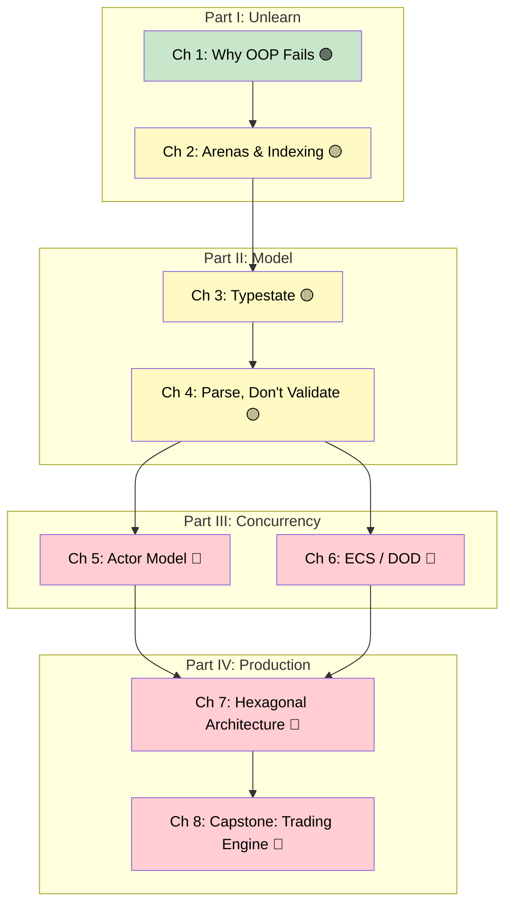

# Rust Architecture & Design Patterns: Structuring Large-Scale Systems

## Speaker Intro

- Principal Systems Architect with two decades of experience shipping production systems in Java, C++, and C#
- Led the migration of three large-scale backend services (order processing, telemetry pipelines, device firmware) from C++ and Java to Rust
- Industry veteran in distributed systems, high-frequency trading infrastructure, and cloud platform engineering
- Started programming in Rust in 2018 and has since onboarded over 200 engineers from OOP backgrounds into idiomatic Rust

---

This is a master-level guide to **architecting large-scale Rust systems**. It's not about syntax — it's about the *shapes* your code takes when you stop fighting the borrow checker and start collaborating with it.

If you've ever tried to build an OOP-style object graph in Rust and been met with a wall of lifetime errors, this book explains *why* that happens and — more importantly — shows you the architectural patterns that make those errors vanish entirely. Proper architecture in Rust doesn't just make code compile; it eliminates entire categories of memory and concurrency bugs at the type level.

## Who This Is For

- **Java / C# / C++ veterans** who keep reaching for inheritance hierarchies, `Rc<RefCell<T>>`, and getter/setter patterns — and keep losing
- **Team leads** migrating production services to Rust who need architectural blueprints, not syntax tutorials
- **Intermediate Rustaceans** who can write small programs but struggle to structure large codebases with multiple subsystems
- **Anyone who has "fought the borrow checker"** and suspects the problem might be their *architecture*, not the language

## Prerequisites

You should be comfortable with:

| Concept | Where to Learn |
|---------|---------------|
| Ownership, borrowing, lifetimes | [Rust Memory Management](../memory-management-book/src/SUMMARY.md) |
| Traits, generics, `dyn Trait` | [Rust's Type System & Traits](../type-system-traits-book/src/SUMMARY.md) |
| `async/await`, Tokio basics | [Async Rust](../async-book/src/SUMMARY.md) |
| `Arc`, `Mutex`, channels | [Concurrency in Rust](../concurrency-book/src/SUMMARY.md) |
| `Result<T, E>` and the `?` operator | [The Rust Programming Language](https://doc.rust-lang.org/book/) |

If you're shaky on any of these, work through the relevant companion guide first. This book assumes you know Rust's mechanics and focuses entirely on *architecture* — how to compose those mechanics into large, maintainable systems.

## How to Use This Book

**Read linearly the first time.** Parts I–IV build on each other. Each chapter has:

| Symbol | Meaning |
|--------|---------|
| 🟢 | Beginner — foundational concept, accessible from day one |
| 🟡 | Intermediate — requires understanding of earlier chapters |
| 🔴 | Advanced — production patterns for experienced Rustaceans |

Each chapter includes:
- A **"What you'll learn"** block at the top
- **Mermaid diagrams** for visual learners
- **Side-by-side comparisons** of OOP anti-patterns vs idiomatic Rust
- An **inline exercise** with a hidden solution
- **Key Takeaways** summarizing the core ideas
- **Cross-references** to companion guides

## Pacing Guide

| Chapters | Topic | Suggested Time | Checkpoint |
|----------|-------|----------------|------------|
| 1–2 | Unlearning OOP Habits | 6–8 hours | You can explain why object graphs fail in Rust and build a tree with arena allocation |
| 3–4 | Domain Modeling & Invariants | 5–7 hours | You can encode state machines in the type system and parse untrusted input into validated domain types |
| 5–6 | Concurrency Architectures | 6–8 hours | You can design an actor-based system with Tokio channels and understand ECS/SoA layouts |
| 7 | Hexagonal Architecture | 4–6 hours | You can decouple domain logic from infrastructure with trait-based DI and test with mocks |
| 8 | Capstone: Trading Engine | 6–8 hours | You've integrated every pattern into a working, testable, concurrent system |

**Total estimated time: 27–37 hours**

## Working Through Exercises

Every chapter has an inline exercise. The capstone (Ch 8) integrates everything into a single project. For maximum learning:

1. **Try the exercise before expanding the solution** — struggling is where learning happens
2. **Type the code, don't copy-paste** — muscle memory matters for Rust's syntax
3. **Run every example** — `cargo new arch-exercises` and test as you go
4. **Refactor the anti-patterns yourself first** — before reading the idiomatic version, try to fix the OOP code on your own

## Table of Contents

### Part I: Unlearning Object-Oriented Habits

- [1. Why OOP Fails in Rust](ch01-why-oop-fails-in-rust.md) 🟢 — The trap of deep inheritance, self-referential graphs, and getter/setter `&mut` fights
- [2. Arena Allocators and Indexing](ch02-arena-allocators-and-indexing.md) 🟡 — Building trees and graphs without `Rc<RefCell<T>>`, using `Vec`-backed arenas and index handles

### Part II: Domain Modeling & Invariants

- [3. The Typestate Pattern](ch03-the-typestate-pattern.md) 🟡 — Encoding state machines in the type system with consuming `self` and zero-sized types
- [4. Parse, Don't Validate](ch04-parse-dont-validate.md) 🟡 — Newtypes, `TryFrom`, and making invalid domain states unrepresentable

### Part III: Concurrency Architectures

- [5. The Actor Model](ch05-the-actor-model.md) 🔴 — Replacing `Arc<Mutex<T>>` with message-passing actors built on Tokio tasks and `mpsc` channels
- [6. Entity-Component-System (ECS)](ch06-entity-component-system.md) 🔴 — Data-Oriented Design: Struct of Arrays, cache-friendly layouts, and why ECS sidesteps the borrow checker

### Part IV: Production Systems & Capstone

- [7. Hexagonal Architecture (Ports and Adapters)](ch07-hexagonal-architecture.md) 🔴 — Decoupling domain logic from I/O with trait-based dependency injection and testable boundaries
- [8. Capstone Project: The Trading Engine](ch08-capstone-trading-engine.md) 🔴 — A modular, high-throughput order-matching engine integrating every pattern in this book

### Appendices

- [Summary and Reference Card](ch09-summary-and-reference-card.md) — Cheat sheet for architectural decisions, pattern selection, and DI trait bounds

## Companion Guides

This book is a master-level companion to the other books in this training series. It explicitly demonstrates how proper architecture eliminates the frictions discussed in those guides:

| Companion Guide | How This Book Connects |
|----------------|----------------------|
| [Async Rust](../async-book/src/SUMMARY.md) | Ch 5 (Actor Model) shows how Tokio spawns and channels create perfect actors |
| [Rust Memory Management](../memory-management-book/src/SUMMARY.md) | Ch 1–2 explain why object graphs cause lifetime hell and how arenas fix it |
| [Rust's Type System & Traits](../type-system-traits-book/src/SUMMARY.md) | Ch 3–4 leverage the type system for compile-time state machines and domain invariants |
| [Concurrency in Rust](../concurrency-book/src/SUMMARY.md) | Ch 5–6 present architectural alternatives to shared-state concurrency |
| [Rust Engineering Practices](../engineering-book/src/SUMMARY.md) | Ch 7 shows how Hexagonal Architecture enables CI-friendly, testable Rust services |

***
