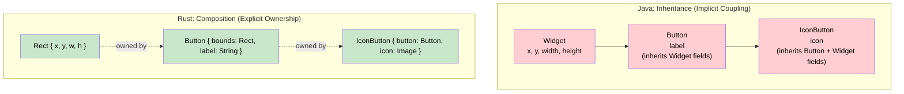
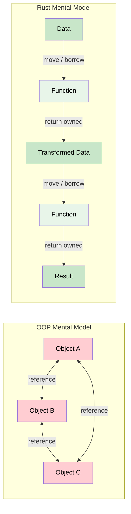

# 1. Why OOP Fails in Rust 🟢

> **What you'll learn:**
> - Why deep inheritance hierarchies and self-referential object graphs are fundamentally incompatible with Rust's ownership model
> - How the borrow checker prevents the getter/setter patterns you rely on in Java, C#, and C++
> - Why "Composition over Inheritance" isn't just good advice in Rust — it's the *only* viable path
> - The mental shift from "objects that own each other" to "data that flows through functions"

## The OOP Instinct

If you've spent years in Java, C#, or C++, you've internalized a set of architectural reflexes. When you see a problem, your brain immediately reaches for:

1. **Inheritance** — "I'll make a base class and override methods"
2. **Object graphs** — "Objects will hold references to each other"
3. **Getters and setters** — "I'll encapsulate state behind `&mut self` methods"
4. **The `self` reference** — "An object should be able to reference its own parts"

Every single one of these reflexes will cause you pain in Rust. Not because Rust is deficient — but because these patterns encode *assumptions about memory* that Rust's ownership model explicitly rejects.

Let's see why, and what to do instead.

## The Inheritance Trap

In Java, you might model a UI framework like this:

```java
// Java — inheritance hierarchy
abstract class Widget {
    protected int x, y, width, height;
    abstract void draw(Canvas c);
}

class Button extends Widget {
    private String label;
    void draw(Canvas c) { /* draw button */ }
    void onClick(Runnable handler) { /* ... */ }
}

class IconButton extends Button {
    private Image icon;
    void draw(Canvas c) { /* draw icon + label */ }
}
```

Your first instinct in Rust might be:

```rust
// ❌ FAILS: Trying to force inheritance in Rust
// Rust has no inheritance. This is not valid Rust.

// You might try trait objects:
trait Widget {
    fn draw(&self);
    fn x(&self) -> i32;
    fn y(&self) -> i32;
}

// But where does shared state live? There's no `super` keyword.
// There's no way for `Button` to "inherit" fields from `Widget`.
// Each struct must own ALL its data independently.
```

### Why Inheritance Doesn't Exist in Rust

Rust made a deliberate design choice: **no struct inheritance**. This isn't an oversight. Inheritance creates implicit coupling between parent and child memory layouts, which conflicts with Rust's guarantees about:

- **Memory layout predictability** — the compiler must know every struct's size at compile time
- **Ownership clarity** — who owns the `x, y` fields? The parent? The child? Both?
- **Move semantics** — when you move a child, the parent's fields must move too. Inheritance makes this ambiguous.



### The Rust Way: Composition + Traits

```rust
// ✅ FIX: Composition over inheritance
struct Rect {
    x: i32,
    y: i32,
    width: i32,
    height: i32,
}

struct Button {
    bounds: Rect,       // Composition: Button OWNS a Rect
    label: String,
}

struct IconButton {
    button: Button,     // Composition: IconButton OWNS a Button
    icon: Vec<u8>,      // Image data
}

// Shared behavior through traits, not inheritance:
trait Drawable {
    fn draw(&self);
    fn bounds(&self) -> &Rect;
}

impl Drawable for Button {
    fn draw(&self) {
        println!("Drawing button '{}' at ({}, {})", 
            self.label, self.bounds.x, self.bounds.y);
    }
    fn bounds(&self) -> &Rect { &self.bounds }
}

impl Drawable for IconButton {
    fn draw(&self) {
        self.button.draw(); // Delegate, don't inherit
        println!("  (with icon, {} bytes)", self.icon.len());
    }
    fn bounds(&self) -> &Rect { &self.button.bounds }
}
```

**Key insight:** In Rust, `traits` define shared *behavior*. `structs` define *data*. They never mix implicitly. You always know exactly who owns what.

## The Self-Referential Object Graph Problem

This is where OOP veterans hit the hardest wall. In Java and C#, objects freely reference each other:

```java
// Java — object graph with cycles
class Department {
    String name;
    List<Employee> employees = new ArrayList<>();
    
    void addEmployee(Employee e) {
        employees.add(e);
        e.department = this; // ← Circular reference! Fine in Java (GC handles it)
    }
}

class Employee {
    String name;
    Department department; // ← Points back to parent
}
```

The garbage collector handles the circular reference. In Rust, there is no garbage collector, and the ownership model forbids this:

```rust
// ❌ FAILS: Circular references violate ownership
struct Department {
    name: String,
    employees: Vec<Employee>,
}

struct Employee {
    name: String,
    department: /* ??? What goes here? */
    // &Department — but who owns it? What's the lifetime?
    // Box<Department> — now Employee OWNS the department? That's backwards.
    // Rc<Department> — now nobody has &mut access without RefCell.
}
```

### Why Graphs Are Hard in Rust

Rust's ownership model is a *tree*. Every value has exactly one owner. Ownership flows downward like a tree:

```
main()
  └── department: Department
        ├── name: String
        └── employees: Vec<Employee>
              ├── [0]: Employee { name: String }
              └── [1]: Employee { name: String }
```

A graph where `Employee` points back to `Department` creates a *cycle* — and cycles cannot exist in a tree. This is not a limitation of the borrow checker; it's a fundamental consequence of Rust's ownership model.

| Pattern | Java/C# | C++ | Rust |
|---------|---------|-----|------|
| Circular references | GC handles it | Manual delete (or leak) | Ownership violation — won't compile |
| Parent ↔ Child pointers | `this` reference | Raw pointers | Lifetime conflict |
| Observer pattern (many → one) | Interface callbacks | `shared_ptr` + raw ptr | `Rc<RefCell<T>>` or redesign |
| Tree with parent pointers | Trivial | Trivial (with caution) | Requires arena or indices (Ch 2) |

### The Naive "Fix" — `Rc<RefCell<T>>`

Many newcomers discover `Rc<RefCell<T>>` and think they've found the answer:

```rust
use std::cell::RefCell;
use std::rc::Rc;

struct Department {
    name: String,
    employees: Vec<Rc<RefCell<Employee>>>,
}

struct Employee {
    name: String,
    department: Rc<RefCell<Department>>, // Circular!
}
```

**This compiles, but it's a trap:**

1. **Memory leaks** — `Rc` uses reference counting. Cycles causes leaks because the count never reaches zero.  You'd need `Weak<RefCell<Department>>` to break the cycle, adding complexity.
2. **Runtime panics** — `RefCell` moves borrow checking to runtime. Call `.borrow_mut()` twice and your program panics instead of failing to compile.
3. **Not `Send`** — `Rc<RefCell<T>>` cannot cross thread boundaries. Your entire architecture is limited to single-threaded code.
4. **Performance** — Every access requires runtime borrow checking and reference count manipulation. This is the antithesis of Rust's zero-cost philosophy.

> **Rule of thumb:** If you're reaching for `Rc<RefCell<T>>`, you're probably encoding an OOP object graph. Step back and redesign your data relationships. Chapter 2 shows how.

## The Getter/Setter `&mut` Problem

In OOP, encapsulation means private fields with public getters and setters. In Rust, this pattern collides with the borrow checker:

```rust
struct GameWorld {
    players: Vec<Player>,
    enemies: Vec<Enemy>,
    map: Map,
}

impl GameWorld {
    fn players_mut(&mut self) -> &mut Vec<Player> {
        &mut self.players
    }
    fn enemies_mut(&mut self) -> &mut Vec<Enemy> {
        &mut self.enemies
    }
}

fn update(world: &mut GameWorld) {
    // ❌ FAILS: Cannot borrow `world` as mutable more than once
    let players = world.players_mut();   // &mut borrow of `world`
    let enemies = world.enemies_mut();   // Second &mut borrow — CONFLICT!
    
    for player in players.iter_mut() {
        for enemy in enemies.iter_mut() {
            // Check collisions...
        }
    }
}
```

The compiler error:

```
error[E0499]: cannot borrow `*world` as mutable more than once at a time
  --> src/main.rs
   |
   |     let players = world.players_mut();
   |                   ----- first mutable borrow occurs here
   |     let enemies = world.enemies_mut();
   |                   ^^^^^ second mutable borrow occurs here
```

### Why This Happens

Both `players_mut()` and `enemies_mut()` take `&mut self` — they borrow the *entire* `GameWorld` mutably. The compiler can't see through the method boundary to know that `players` and `enemies` are disjoint fields. It only sees: "two mutable borrows of the same struct."

### The Fix: Direct Field Access (Destructuring)

```rust
// ✅ FIX: Borrow fields directly, bypassing the getter methods
fn update(world: &mut GameWorld) {
    // Destructure to get simultaneous mutable access to disjoint fields:
    let GameWorld { players, enemies, .. } = world;
    
    for player in players.iter_mut() {
        for enemy in enemies.iter_mut() {
            // Now the compiler can see these are separate allocations
            check_collision(player, enemy);
        }
    }
}

fn check_collision(player: &mut Player, enemy: &mut Enemy) {
    // ...
}
```

Or equivalently, access fields directly without methods:

```rust
fn update(world: &mut GameWorld) {
    // ✅ Direct field access — compiler knows these don't overlap
    for i in 0..world.players.len() {
        for j in 0..world.enemies.len() {
            if collides(&world.players[i], &world.enemies[j]) {
                world.players[i].health -= world.enemies[j].damage;
            }
        }
    }
}
# fn collides(player: &Player, enemy: &Enemy) -> bool { false }
```

**Key insight:** Getters and setters that return `&mut T` are an anti-pattern in Rust. They hide disjoint field access behind a `&mut self` boundary that the borrow checker treats as a whole-struct borrow. Prefer direct field access or pass individual fields to functions.

## Composition Over Inheritance: A Systematic Approach

Here's a decision framework for translating OOP designs to Rust:

| OOP Pattern | Rust Translation |
|-------------|-----------------|
| `class B extends A` | `struct B { a: A }` (composition) |
| `abstract class` with shared state | Trait + default methods + composition |
| `interface` | `trait` |
| Polymorphic collection (`List<Animal>`) | `Vec<Box<dyn Animal>>` or `enum` |
| `instanceof` / downcasting | `enum` with pattern matching |
| `this` reference in methods | `&self` / `&mut self` (but no self-referencing) |
| Observer pattern | Channels (`mpsc`) or callback `Fn` closures |
| Factory pattern | Associated function `fn new() -> Self` or builder pattern |
| Singleton | `static` with `OnceLock` or module-level state |

### Enum-Based Polymorphism vs Trait Objects

For *closed* sets of variants (you know all types at compile time), prefer `enum`:

```rust
// ✅ Closed set: use enum (zero-cost, exhaustive matching)
enum Shape {
    Circle { radius: f64 },
    Rectangle { width: f64, height: f64 },
    Triangle { base: f64, height: f64 },
}

impl Shape {
    fn area(&self) -> f64 {
        match self {
            Shape::Circle { radius } => std::f64::consts::PI * radius * radius,
            Shape::Rectangle { width, height } => width * height,
            Shape::Triangle { base, height } => 0.5 * base * height,
        }
    }
}

// All shapes in one Vec — no heap allocation, no vtable
let shapes: Vec<Shape> = vec![
    Shape::Circle { radius: 5.0 },
    Shape::Rectangle { width: 3.0, height: 4.0 },
];
```

For *open* sets (plugins, user-defined types), use `dyn Trait`:

```rust
// ✅ Open set: use trait objects (extensible, but with vtable cost)
trait Plugin {
    fn name(&self) -> &str;
    fn execute(&mut self, input: &[u8]) -> Vec<u8>;
}

// Consumers don't need to know concrete types
fn run_pipeline(plugins: &mut [Box<dyn Plugin>], data: &[u8]) -> Vec<u8> {
    let mut result = data.to_vec();
    for plugin in plugins.iter_mut() {
        result = plugin.execute(&result);
    }
    result
}
```

| | `enum` | `dyn Trait` |
|---|---|---|
| **When to use** | Closed set of variants | Open set, extensibility needed |
| **Performance** | Zero-cost (no heap, no vtable) | vtable indirection + `Box` allocation |
| **Exhaustiveness** | Compiler ensures all cases handled | No compile-time exhaustiveness |
| **Adding variants** | Requires changing all match sites | Just implement the trait |

## The Mental Model Shift

The single most important realization for OOP developers in Rust:

> **In OOP, you design around objects that hold state and collaborate via references. In Rust, you design around data that flows through functions, with ownership transferring at each step.**



In subsequent chapters, we'll build on this foundation:
- **Chapter 2** shows how to build tree and graph structures without object references
- **Chapter 3** shows how to encode state transitions in the type system instead of in mutable object state
- **Chapter 5** shows how actors encapsulate state without shared references

<details>
<summary><strong>🏋️ Exercise: Refactor an OOP Design</strong> (click to expand)</summary>

**Challenge:** The following code tries to implement a simple library system using OOP patterns. It won't compile. Refactor it to use composition and direct field access.

```rust,ignore
struct Library {
    books: Vec<Book>,
    members: Vec<Member>,
}

struct Book {
    title: String,
    borrowed_by: Option<&Member>, // ❌ Lifetime issue
}

struct Member {
    name: String,
    borrowed_books: Vec<&Book>,   // ❌ Lifetime issue
}

impl Library {
    fn borrow_book(&mut self, member_idx: usize, book_idx: usize) {
        let member = &mut self.members[member_idx];
        let book = &mut self.books[book_idx]; // ❌ Double &mut self
        book.borrowed_by = Some(member);
        member.borrowed_books.push(book);
    }
}
```

**Goal:** Make it compile and work correctly, without `Rc<RefCell<T>>`.

<details>
<summary>🔑 Solution</summary>

```rust
/// Use indices instead of references to avoid lifetime issues.
/// This is a preview of the arena/indexing pattern from Chapter 2.

// Type aliases for clarity — these are just indices into Vecs
type MemberId = usize;
type BookId = usize;

struct Library {
    books: Vec<Book>,
    members: Vec<Member>,
}

struct Book {
    title: String,
    borrowed_by: Option<MemberId>,  // ✅ Index, not reference
}

struct Member {
    name: String,
    borrowed_books: Vec<BookId>,    // ✅ Index, not reference
}

impl Library {
    fn borrow_book(&mut self, member_id: MemberId, book_id: BookId) {
        // Validate indices
        assert!(member_id < self.members.len(), "Invalid member ID");
        assert!(book_id < self.books.len(), "Invalid book ID");
        assert!(
            self.books[book_id].borrowed_by.is_none(),
            "Book is already borrowed"
        );

        // ✅ Direct field access — no &mut self conflict
        self.books[book_id].borrowed_by = Some(member_id);
        self.members[member_id].borrowed_books.push(book_id);
    }

    fn return_book(&mut self, member_id: MemberId, book_id: BookId) {
        self.books[book_id].borrowed_by = None;
        self.members[member_id]
            .borrowed_books
            .retain(|&id| id != book_id);
    }

    fn books_borrowed_by(&self, member_id: MemberId) -> Vec<&str> {
        // ✅ We can traverse the index graph freely with shared references
        self.members[member_id]
            .borrowed_books
            .iter()
            .map(|&book_id| self.books[book_id].title.as_str())
            .collect()
    }
}

fn main() {
    let mut lib = Library {
        books: vec![
            Book { title: "The Rust Programming Language".into(), borrowed_by: None },
            Book { title: "Programming Rust".into(), borrowed_by: None },
        ],
        members: vec![
            Member { name: "Alice".into(), borrowed_books: vec![] },
        ],
    };

    lib.borrow_book(0, 0);
    lib.borrow_book(0, 1);
    
    println!("{:?}", lib.books_borrowed_by(0));
    // ["The Rust Programming Language", "Programming Rust"]
    
    lib.return_book(0, 0);
    println!("{:?}", lib.books_borrowed_by(0));
    // ["Programming Rust"]
}
```

**Key takeaways from this exercise:**
- Replace references (`&Member`, `&Book`) with **indices** (`usize`) to break the cycle
- Access disjoint parts of the `Library` struct **directly by field** instead of through `&mut self` methods
- Indices are `Copy`, `Send`, and have no lifetime — they're just numbers
- Chapter 2 generalizes this into a full arena allocator pattern

</details>
</details>

> **Key Takeaways:**
> - Rust has **no struct inheritance**. Use composition (`struct B { a: A }`) and traits for shared behavior.
> - **Self-referential object graphs** (cycles) are incompatible with Rust's ownership tree. Use indices (Ch 2) or message passing (Ch 5).
> - **Getters/setters that return `&mut T`** cause whole-struct borrows. Prefer direct field access or pass individual fields to functions.
> - For closed type sets, use `enum`. For open/extensible sets, use `dyn Trait`.
> - The core mental model shift: **data flows through functions** (with ownership transfer), not **objects that hold references to each other**.

> **See also:**
> - [Chapter 2: Arena Allocators and Indexing](ch02-arena-allocators-and-indexing.md) — the systematic solution to object graphs in Rust
> - [Rust Memory Management](../memory-management-book/src/SUMMARY.md) — deep dive into ownership, borrowing, and lifetimes
> - [Rust's Type System & Traits](../type-system-traits-book/src/SUMMARY.md) — mastering trait-based polymorphism
