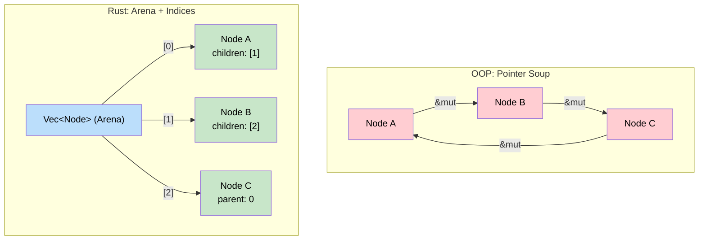
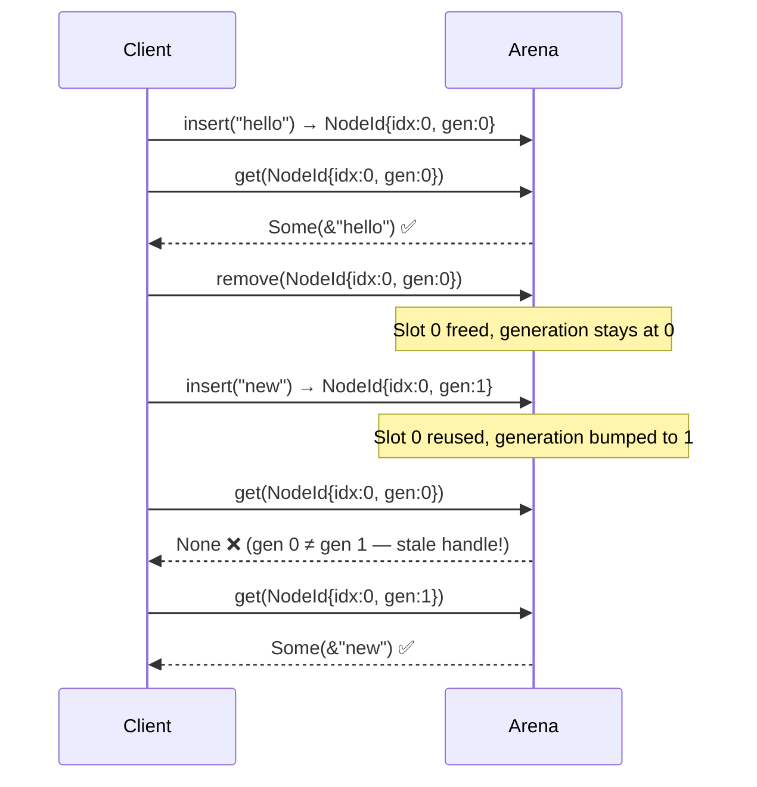

# 2. Arena Allocators and Indexing 🟡

> **What you'll learn:**
> - Why arena allocation is the idiomatic Rust solution for trees, graphs, and DAGs
> - How to store nodes in a `Vec` and use `usize` handles instead of pointers or references
> - How to implement a generic arena with generational indices to detect use-after-free at runtime
> - When to use arenas vs `Rc`, vs ECS (Chapter 6), vs the Actor Model (Chapter 5)

## The Problem: Graphs Need Shared Ownership

In Chapter 1, we saw that Rust's ownership model is a *tree* — every value has one owner. But many real-world data structures are *graphs*: file systems, scene graphs, dependency trees with shared nodes, social networks, ASTs with back-edges.

In C++ or Java, you'd model these with pointers or references:

```java
// Java — tree with parent pointers
class TreeNode {
    String value;
    TreeNode parent;             // Points UP
    List<TreeNode> children;     // Points DOWN

    void addChild(TreeNode child) {
        children.add(child);
        child.parent = this;     // Circular reference — GC handles it
    }
}
```

In Rust, this is the "forbidden pattern" — circular references can't exist under single ownership. The standard workaround (`Rc<RefCell<T>>`) has serious drawbacks as we discussed. We need a better model.

## The Arena Pattern

The insight: **don't let nodes own each other. Let a central arena own all nodes, and let nodes refer to each other by index.**



### A Simple Tree with Arena Indexing

```rust
/// A handle into the arena — just an index
type NodeId = usize;

struct TreeNode {
    value: String,
    parent: Option<NodeId>,
    children: Vec<NodeId>,
}

/// The arena owns ALL nodes. Nodes refer to each other by index.
struct Tree {
    nodes: Vec<TreeNode>,
}

impl Tree {
    fn new() -> Self {
        Tree { nodes: Vec::new() }
    }

    /// Add a root node. Returns its NodeId.
    fn add_root(&mut self, value: String) -> NodeId {
        let id = self.nodes.len();
        self.nodes.push(TreeNode {
            value,
            parent: None,
            children: Vec::new(),
        });
        id
    }

    /// Add a child to an existing node. Returns the child's NodeId.
    fn add_child(&mut self, parent: NodeId, value: String) -> NodeId {
        let child_id = self.nodes.len();
        self.nodes.push(TreeNode {
            value,
            parent: Some(parent),
            children: Vec::new(),
        });
        // ✅ No borrow conflict — we index into the Vec, not hold references
        self.nodes[parent].children.push(child_id);
        child_id
    }

    /// Walk ancestors from a node to the root
    fn ancestors(&self, mut node: NodeId) -> Vec<&str> {
        let mut path = vec![self.nodes[node].value.as_str()];
        while let Some(parent) = self.nodes[node].parent {
            path.push(self.nodes[parent].value.as_str());
            node = parent;
        }
        path.reverse();
        path
    }
}

fn main() {
    let mut tree = Tree::new();
    let root = tree.add_root("root".into());
    let child_a = tree.add_child(root, "a".into());
    let child_b = tree.add_child(root, "b".into());
    let grandchild = tree.add_child(child_a, "a.1".into());

    println!("Path to a.1: {:?}", tree.ancestors(grandchild));
    // ["root", "a", "a.1"]
    
    println!("Children of root: {:?}", 
        tree.nodes[root].children.iter()
            .map(|&id| tree.nodes[id].value.as_str())
            .collect::<Vec<_>>());
    // ["a", "b"]
}
```

### Why This Works

| Property | References (`&T`) | `Rc<RefCell<T>>` | Arena + Index |
|----------|-------------------|-------------------|---------------|
| Circular references | ❌ Impossible | ⚠️ Leaks memory | ✅ Trivial |
| Borrow checker friction | 🔴 High | 🟡 Runtime panics | 🟢 None |
| Thread safety | ✅ Compile-time | ❌ Not `Send` | ✅ `usize` is `Copy + Send` |
| Performance | ✅ Zero-cost | 🔴 Ref counting + runtime checks | ✅ Cache-friendly `Vec` |
| Dangling references | ❌ Prevented by lifetimes | ❌ Prevented by RC | ⚠️ Possible (stale index) |

The one risk is **stale indices** — a `NodeId` might refer to a node that's been removed. We solve this next with generational indices.

## Generational Indices: Detecting Use-After-Free

A plain `usize` index has a flaw: if you remove a node and reuse its slot, old handles become silently invalid. **Generational indices** solve this by adding a generation counter:

```rust
/// A handle that knows which "generation" of the slot it refers to.
/// If the slot has been recycled, the generations won't match.
#[derive(Clone, Copy, Debug, PartialEq, Eq, Hash)]
struct NodeId {
    index: usize,
    generation: u64,
}

struct ArenaEntry<T> {
    generation: u64,
    value: Option<T>,      // None = slot is free
}

struct Arena<T> {
    entries: Vec<ArenaEntry<T>>,
    free_list: Vec<usize>,  // Indices of free slots for reuse
}

impl<T> Arena<T> {
    fn new() -> Self {
        Arena {
            entries: Vec::new(),
            free_list: Vec::new(),
        }
    }

    /// Insert a value, returning a generational handle.
    fn insert(&mut self, value: T) -> NodeId {
        if let Some(index) = self.free_list.pop() {
            // Reuse a freed slot — bump the generation
            let entry = &mut self.entries[index];
            entry.generation += 1;
            entry.value = Some(value);
            NodeId {
                index,
                generation: entry.generation,
            }
        } else {
            // Allocate a new slot
            let index = self.entries.len();
            self.entries.push(ArenaEntry {
                generation: 0,
                value: Some(value),
            });
            NodeId {
                index,
                generation: 0,
            }
        }
    }

    /// Get a reference to a value, or None if the handle is stale.
    fn get(&self, id: NodeId) -> Option<&T> {
        let entry = self.entries.get(id.index)?;
        if entry.generation == id.generation {
            entry.value.as_ref()
        } else {
            None // Stale handle — slot was recycled
        }
    }

    /// Get a mutable reference to a value.
    fn get_mut(&mut self, id: NodeId) -> Option<&mut T> {
        let entry = self.entries.get_mut(id.index)?;
        if entry.generation == id.generation {
            entry.value.as_mut()
        } else {
            None
        }
    }

    /// Remove a value, freeing the slot for reuse.
    fn remove(&mut self, id: NodeId) -> Option<T> {
        let entry = self.entries.get_mut(id.index)?;
        if entry.generation == id.generation {
            let value = entry.value.take();
            self.free_list.push(id.index);
            value
        } else {
            None
        }
    }
}

fn main() {
    let mut arena = Arena::new();
    
    let id1 = arena.insert("hello");
    let id2 = arena.insert("world");
    
    assert_eq!(arena.get(id1), Some(&"hello"));
    
    // Remove "hello" — its slot is now free
    arena.remove(id1);
    
    // Insert something new — it reuses the slot
    let id3 = arena.insert("recycled");
    
    // The OLD handle is now stale — generation mismatch
    assert_eq!(arena.get(id1), None);        // ✅ Detected!
    assert_eq!(arena.get(id3), Some(&"recycled")); // ✅ New handle works
}
```

### How Generational Indices Work



## Building a Graph with the Arena

Now let's build a proper directed graph — the kind OOP developers would build with `HashMap<NodeId, HashSet<NodeId>>`, but fully arena-backed:

```rust
use std::collections::HashSet;

type NodeId = usize;

struct GraphNode<T> {
    value: T,
    edges_out: HashSet<NodeId>, // Outgoing edges
    edges_in: HashSet<NodeId>,  // Incoming edges (for traversal)
}

struct Graph<T> {
    nodes: Vec<Option<GraphNode<T>>>, // Option for removal support
    free_slots: Vec<NodeId>,
}

impl<T> Graph<T> {
    fn new() -> Self {
        Graph {
            nodes: Vec::new(),
            free_slots: Vec::new(),
        }
    }

    fn add_node(&mut self, value: T) -> NodeId {
        if let Some(id) = self.free_slots.pop() {
            self.nodes[id] = Some(GraphNode {
                value,
                edges_out: HashSet::new(),
                edges_in: HashSet::new(),
            });
            id
        } else {
            let id = self.nodes.len();
            self.nodes.push(Some(GraphNode {
                value,
                edges_out: HashSet::new(),
                edges_in: HashSet::new(),
            }));
            id
        }
    }

    fn add_edge(&mut self, from: NodeId, to: NodeId) {
        // ✅ No borrow checker issues — we use indices
        if let Some(node) = &mut self.nodes[from] {
            node.edges_out.insert(to);
        }
        if let Some(node) = &mut self.nodes[to] {
            node.edges_in.insert(from);
        }
    }

    fn neighbors(&self, id: NodeId) -> impl Iterator<Item = NodeId> + '_ {
        self.nodes[id]
            .as_ref()
            .into_iter()
            .flat_map(|node| node.edges_out.iter().copied())
    }

    fn value(&self, id: NodeId) -> Option<&T> {
        self.nodes[id].as_ref().map(|n| &n.value)
    }
}

fn main() {
    let mut graph = Graph::new();
    let a = graph.add_node("A");
    let b = graph.add_node("B");
    let c = graph.add_node("C");

    graph.add_edge(a, b); // A → B
    graph.add_edge(b, c); // B → C
    graph.add_edge(c, a); // C → A  (cycle!)

    // ✅ Cycles are trivial — no ownership conflicts
    for neighbor in graph.neighbors(a) {
        println!("A → {}", graph.value(neighbor).unwrap());
    }
    // Output: A → B
}
```

## Real-World Arena Libraries

You don't need to write your own arena. The Rust ecosystem has battle-tested implementations:

| Crate | Use Case | Key Feature |
|-------|----------|-------------|
| [`slotmap`](https://docs.rs/slotmap) | General-purpose arenas | Generational indices, `SecondaryMap` for associated data |
| [`thunderdome`](https://docs.rs/thunderdome) | Simpler API | Lightweight generational arena |
| [`typed-arena`](https://docs.rs/typed-arena) | Bump allocation | All items freed at once, best for ASTs |
| [`id-arena`](https://docs.rs/id-arena) | Type-safe IDs | IDs are branded to prevent cross-arena use |
| [`petgraph`](https://docs.rs/petgraph) | Graph algorithms | Full graph library with BFS, DFS, Dijkstra, etc. |

### Example with `slotmap`

```rust,ignore
use slotmap::{SlotMap, new_key_type};

new_key_type! {
    struct NodeKey;
}

struct SceneNode {
    name: String,
    parent: Option<NodeKey>,
    children: Vec<NodeKey>,
    transform: [f32; 16],
}

fn main() {
    let mut scene: SlotMap<NodeKey, SceneNode> = SlotMap::with_key();

    let root = scene.insert(SceneNode {
        name: "root".into(),
        parent: None,
        children: Vec::new(),
        transform: [0.0; 16],
    });

    let camera = scene.insert(SceneNode {
        name: "camera".into(),
        parent: Some(root),
        children: Vec::new(),
        transform: [0.0; 16],
    });

    // ✅ Mutate parent through arena — no borrow issues
    scene[root].children.push(camera);

    // ✅ Stale keys return None (generational safety)
    scene.remove(camera);
    assert!(scene.get(camera).is_none());
}
```

## When NOT to Use Arenas

Arenas aren't always the right tool. Here's a decision matrix:

| Situation | Best Approach | Why |
|-----------|---------------|-----|
| Tree with parent pointers | ✅ Arena | Cycles need shared access |
| DAG (directed acyclic graph) | ✅ Arena or `petgraph` | Shared nodes need multi-owner access |
| Config or data objects with no cycles | ❌ Arena overkill | Plain `struct` composition works fine |
| Concurrent access to shared nodes | ⚠️ Arena + `RwLock` or Actor (Ch 5) | Arena alone isn't thread-safe |
| Massive simulation (millions of entities) | ✅ ECS (Ch 6) | SoA layout + query system is more cache-friendly |
| Objects that communicate via messages | ✅ Actor model (Ch 5) | No shared state needed |

<details>
<summary><strong>🏋️ Exercise: File System Tree</strong> (click to expand)</summary>

**Challenge:** Build a file-system tree using the arena pattern. Requirements:

1. Each node has a `name: String`, an `is_dir: bool` flag, and children
2. Support adding files/directories to a parent path
3. Implement a `print_tree` function that displays the tree with indentation
4. Support finding a node by its full path (e.g., `/usr/local/bin`)

```rust,ignore
// Your starting point:
type NodeId = usize;

struct FsNode {
    name: String,
    is_dir: bool,
    children: Vec<NodeId>,
    parent: Option<NodeId>,
}

struct FileSystem {
    nodes: Vec<FsNode>,
    root: NodeId,
}
```

<details>
<summary>🔑 Solution</summary>

```rust
type NodeId = usize;

struct FsNode {
    name: String,
    is_dir: bool,
    children: Vec<NodeId>,
    parent: Option<NodeId>,
}

struct FileSystem {
    nodes: Vec<FsNode>,
    root: NodeId,
}

impl FileSystem {
    fn new() -> Self {
        let root_node = FsNode {
            name: "/".into(),
            is_dir: true,
            children: Vec::new(),
            parent: None,
        };
        FileSystem {
            nodes: vec![root_node],
            root: 0,
        }
    }

    /// Add a child node under a parent. Returns the new NodeId.
    fn add_child(&mut self, parent: NodeId, name: String, is_dir: bool) -> NodeId {
        let child_id = self.nodes.len();
        self.nodes.push(FsNode {
            name,
            is_dir,
            children: Vec::new(),
            parent: Some(parent),
        });
        // ✅ Index-based mutation — no borrow conflicts
        self.nodes[parent].children.push(child_id);
        child_id
    }

    /// Find a node by its absolute path (e.g., "/usr/local/bin").
    fn find_by_path(&self, path: &str) -> Option<NodeId> {
        let parts: Vec<&str> = path
            .split('/')
            .filter(|s| !s.is_empty())
            .collect();

        let mut current = self.root;
        for part in parts {
            // Search children of current node for matching name
            let found = self.nodes[current]
                .children
                .iter()
                .find(|&&child_id| self.nodes[child_id].name == part);
            match found {
                Some(&child_id) => current = child_id,
                None => return None,
            }
        }
        Some(current)
    }

    /// Build the full path string for a node by walking up to root.
    fn full_path(&self, node_id: NodeId) -> String {
        let mut parts = Vec::new();
        let mut current = node_id;

        loop {
            parts.push(self.nodes[current].name.as_str());
            match self.nodes[current].parent {
                Some(parent) => current = parent,
                None => break, // Reached root
            }
        }

        parts.reverse();
        if parts.len() == 1 {
            "/".into()
        } else {
            parts.join("/").replacen("//", "/", 1)
        }
    }

    /// Pretty-print the tree with indentation.
    fn print_tree(&self) {
        self.print_subtree(self.root, 0);
    }

    fn print_subtree(&self, node_id: NodeId, depth: usize) {
        let node = &self.nodes[node_id];
        let indent = "  ".repeat(depth);
        let icon = if node.is_dir { "📁" } else { "📄" };
        println!("{}{} {}", indent, icon, node.name);

        for &child_id in &node.children {
            self.print_subtree(child_id, depth + 1);
        }
    }
}

fn main() {
    let mut fs = FileSystem::new();
    let usr = fs.add_child(fs.root, "usr".into(), true);
    let local = fs.add_child(usr, "local".into(), true);
    let bin = fs.add_child(local, "bin".into(), true);
    fs.add_child(bin, "rustc".into(), false);
    fs.add_child(bin, "cargo".into(), false);
    let etc = fs.add_child(fs.root, "etc".into(), true);
    fs.add_child(etc, "hosts".into(), false);

    fs.print_tree();
    // 📁 /
    //   📁 usr
    //     📁 local
    //       📁 bin
    //         📄 rustc
    //         📄 cargo
    //   📁 etc
    //     📄 hosts

    // Path lookup
    if let Some(id) = fs.find_by_path("/usr/local/bin/rustc") {
        println!("Found: {}", fs.full_path(id));
        // Found: /usr/local/bin/rustc
    }
}
```

**Why this works:** Every `FsNode` lives in a single `Vec`. Parent and child relationships are just `usize` indices. No lifetimes, no `Rc`, no `RefCell`. The tree can have arbitrary depth and breadth, and operations like path lookup just follow index chains through the `Vec`.

</details>
</details>

> **Key Takeaways:**
> - The **arena pattern** stores all nodes in a single `Vec` (or `SlotMap`) and uses indices instead of references or smart pointers.
> - **Generational indices** add a generation counter to detect stale handles (use-after-free), trading pointer safety for index safety.
> - Arenas make **cyclic and self-referential data structures** trivial in Rust — cycles are just indices pointing at each other.
> - Index handles are **`Copy`, `Send`, `Sync`**, and have **no lifetime** — they're just numbers. This eliminates all borrow checker friction.
> - Use crates like `slotmap`, `thunderdome`, or `petgraph` in production instead of rolling your own.

> **See also:**
> - [Chapter 1: Why OOP Fails in Rust](ch01-why-oop-fails-in-rust.md) — the problems arenas solve
> - [Chapter 6: Entity-Component-System](ch06-entity-component-system.md) — arenas taken to the extreme with Struct-of-Arrays
> - [Rust Memory Management](../memory-management-book/src/SUMMARY.md) — deep dive on ownership, lifetimes, and smart pointers
