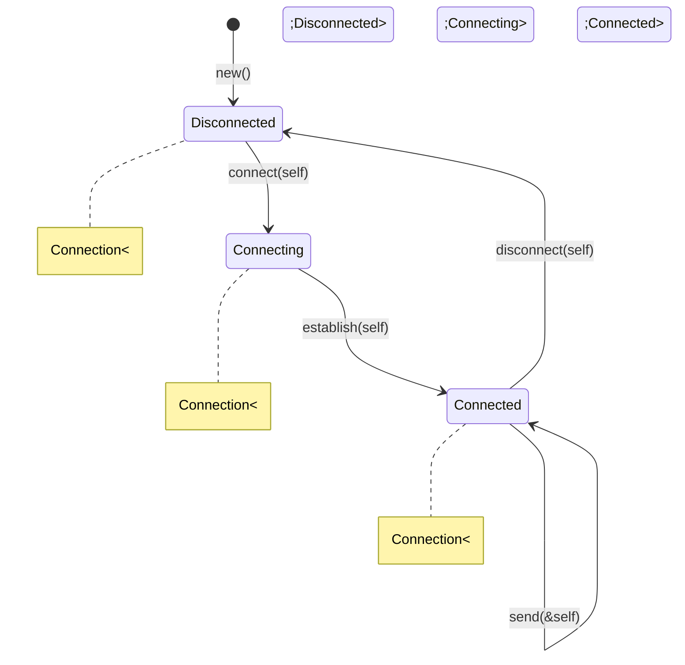
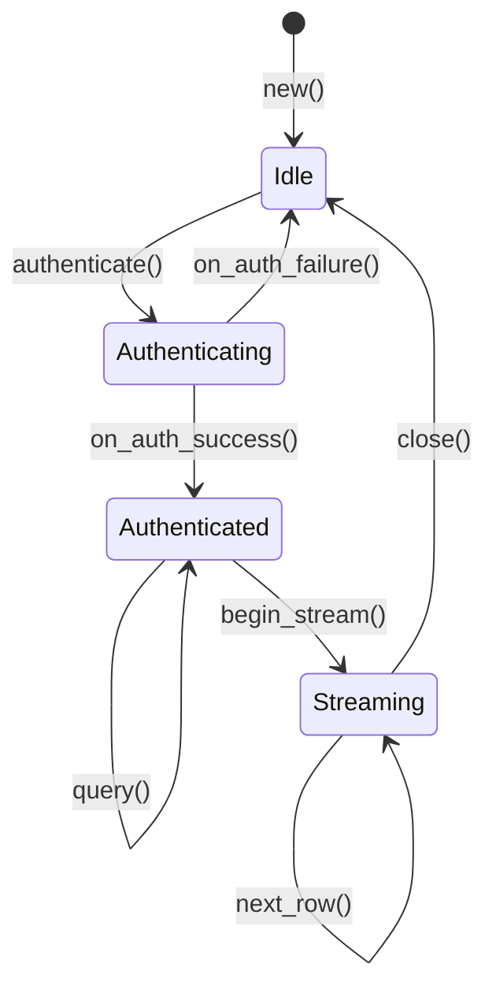

# 3. The Typestate Pattern 🟡

> **What you'll learn:**
> - How to encode state machines directly into the type system so that invalid transitions fail at *compile time*
> - The mechanics: consuming `self`, zero-sized types (ZSTs), and generic state parameters
> - Why this eliminates entire classes of runtime bugs (calling methods on objects in the wrong state)
> - Real-world applications: connection builders, HTTP requests, order processing, and protocol state machines

## The Problem: Runtime State Checks

In OOP, state machines are typically modeled with an enum field and runtime checks:

```java
// Java — runtime state machine
class Connection {
    enum State { DISCONNECTED, CONNECTING, CONNECTED }
    private State state = State.DISCONNECTED;

    void connect(String host) {
        if (state != State.DISCONNECTED)
            throw new IllegalStateException("Already connected!");
        state = State.CONNECTING;
        // ... connect ...
        state = State.CONNECTED;
    }

    void send(byte[] data) {
        if (state != State.CONNECTED)
            throw new IllegalStateException("Not connected!"); // Runtime explosion
        // ... send ...
    }
}
```

**The problems:**
1. The compiler can't prevent calling `send()` before `connect()` — you discover the bug at runtime
2. Every method must check the current state — boilerplate and a maintenance burden
3. Forgetting a state check is a *silent* bug; it compiles fine but crashes in production

In Rust, we can do better: **make the invalid state transition a compile error**.

## The Typestate Pattern, Explained

The core idea: instead of one struct with a state enum, create **different types for each state**. Transitions *consume* the old type and return the new one.

```rust
// ✅ Typestate: each state is a distinct type

/// Zero-sized types (ZSTs) — they carry no data, just type information.
/// The compiler erases them completely; they have zero runtime cost.
struct Disconnected;
struct Connecting;
struct Connected;

/// The connection is generic over its state.
/// `PhantomData` tells the compiler "I'm using S" without storing it.
struct Connection<S> {
    host: String,
    _state: std::marker::PhantomData<S>,
}

impl Connection<Disconnected> {
    /// Create a new disconnected connection
    fn new(host: String) -> Self {
        Connection {
            host,
            _state: std::marker::PhantomData,
        }
    }

    /// Transition: Disconnected → Connecting
    /// Note: consumes `self` — you can't use the Disconnected connection after this
    fn connect(self) -> Connection<Connecting> {
        println!("Connecting to {}...", self.host);
        Connection {
            host: self.host,
            _state: std::marker::PhantomData,
        }
    }
}

impl Connection<Connecting> {
    /// Transition: Connecting → Connected
    fn establish(self) -> Connection<Connected> {
        println!("Connection to {} established!", self.host);
        Connection {
            host: self.host,
            _state: std::marker::PhantomData,
        }
    }
}

impl Connection<Connected> {
    /// Only available when Connected
    fn send(&self, data: &[u8]) {
        println!("Sending {} bytes to {}", data.len(), self.host);
    }

    /// Transition: Connected → Disconnected
    fn disconnect(self) -> Connection<Disconnected> {
        println!("Disconnected from {}", self.host);
        Connection {
            host: self.host,
            _state: std::marker::PhantomData,
        }
    }
}

fn main() {
    let conn = Connection::<Disconnected>::new("example.com".into());
    
    // ✅ Valid transition chain:
    let conn = conn.connect();      // Disconnected → Connecting
    let conn = conn.establish();    // Connecting → Connected
    conn.send(b"hello");            // Only available when Connected

    // ❌ FAILS at compile time — Connection<Disconnected> has no send():
    // let disconnected = Connection::<Disconnected>::new("x.com".into());
    // disconnected.send(b"oops"); 
    // Error: no method named `send` found for `Connection<Disconnected>`
    
    // ❌ FAILS — connect() consumed `conn`, it's been moved:
    // conn.connect();
    // Error: use of moved value: `conn`
}
```

### How It Works



**Three mechanisms make this work:**

| Mechanism | What It Does |
|-----------|-------------|
| **Zero-Sized Types (ZSTs)** | `struct Disconnected;` — carries type information with zero runtime cost |
| **Consuming `self`** | `fn connect(self) -> ...` — the caller can't use the old state after transition |
| **Generic state parameter** | `Connection<S>` — different states are different types; each has its own `impl` block |

### Zero-Cost Guarantee

This is truly zero-cost. The `PhantomData<S>` is erased at compile time. In the generated assembly, `Connection<Disconnected>` and `Connection<Connected>` have **identical memory layouts** — the state is purely a compile-time concept.

```rust
# use std::marker::PhantomData;
# struct Disconnected;
# struct Connected;
# struct Connection<S> { host: String, _state: PhantomData<S> }

// Both of these are the same size at runtime:
assert_eq!(
    std::mem::size_of::<Connection<Disconnected>>(),
    std::mem::size_of::<Connection<Connected>>()
);
// They're both just a String (24 bytes on 64-bit: ptr + len + capacity)
```

## The OOP Way vs The Typestate Way

Let's compare the approaches side-by-side with a more realistic example — an HTTP request builder:

### The OOP Way (Anti-Pattern)

```rust
// ❌ OOP approach: runtime state validation
struct HttpRequest {
    method: Option<String>,
    url: Option<String>,
    headers: Vec<(String, String)>,
    body: Option<Vec<u8>>,
    sent: bool,
}

impl HttpRequest {
    fn new() -> Self {
        HttpRequest {
            method: None, url: None, headers: vec![],
            body: None, sent: false,
        }
    }

    fn set_method(&mut self, method: &str) { self.method = Some(method.into()); }
    fn set_url(&mut self, url: &str) { self.url = Some(url.into()); }
    fn add_header(&mut self, k: &str, v: &str) {
        self.headers.push((k.into(), v.into()));
    }

    fn send(&mut self) -> Result<(), String> {
        if self.sent {
            return Err("Already sent!".into());   // Runtime check
        }
        let method = self.method.as_ref().ok_or("No method set")?; // Runtime check
        let url = self.url.as_ref().ok_or("No URL set")?;          // Runtime check
        println!("{} {} ({} headers)", method, url, self.headers.len());
        self.sent = true;
        Ok(())
    }
}
```

**Problems:** 5 `Option` fields, 3 runtime checks, and nothing prevents calling `send()` first.

### The Typestate Way (Idiomatic)

```rust
// ✅ Typestate: invalid states are unrepresentable

/// Builder states — each is a ZST
struct NeedsMethod;
struct NeedsUrl { method: String }
struct Ready { method: String, url: String }

struct HttpRequest<S> {
    state: S,
    headers: Vec<(String, String)>,
}

impl HttpRequest<NeedsMethod> {
    fn new() -> Self {
        HttpRequest { state: NeedsMethod, headers: vec![] }
    }

    fn method(self, method: &str) -> HttpRequest<NeedsUrl> {
        HttpRequest {
            state: NeedsUrl { method: method.into() },
            headers: self.headers,
        }
    }
}

impl HttpRequest<NeedsUrl> {
    fn url(self, url: &str) -> HttpRequest<Ready> {
        HttpRequest {
            state: Ready {
                method: self.state.method,
                url: url.into(),
            },
            headers: self.headers,
        }
    }
}

// Headers can be added in any state (generic impl)
impl<S> HttpRequest<S> {
    fn header(mut self, key: &str, value: &str) -> Self {
        self.headers.push((key.into(), value.into()));
        self
    }
}

impl HttpRequest<Ready> {
    /// send() is ONLY available in the Ready state.
    /// No Option unwrapping, no runtime checks.
    fn send(self) {
        println!("{} {} ({} headers)",
            self.state.method, self.state.url, self.headers.len());
        // `self` is consumed — can't send twice
    }
}

fn main() {
    // ✅ The type system enforces the correct order:
    HttpRequest::new()
        .method("GET")
        .header("Accept", "application/json")
        .url("https://api.example.com/data")
        .header("Authorization", "Bearer token123")
        .send();

    // ❌ FAILS: can't call send() without method and url:
    // HttpRequest::new().send();
    // Error: no method named `send` found for `HttpRequest<NeedsMethod>`

    // ❌ FAILS: can't call send() without url:
    // HttpRequest::new().method("GET").send();
    // Error: no method named `send` found for `HttpRequest<NeedsUrl>`
}
```

| | OOP Runtime Checks | Typestate |
|---|---|---|
| Invalid call detected | Runtime (`Result::Err` or panic) | Compile time (type error) |
| Number of `Option` fields | Many | Zero |
| Double-send prevention | Boolean flag + runtime check | `self` consumed — impossible |
| Missing field detection | Runtime, per-field | Compile time — state won't reach `Ready` |
| Performance | Runtime checks on every call | Zero-cost — erased at compile time |

## Advanced: Typestate with Sealed Traits

For complex state machines with many transitions, you can use a sealed trait to constrain the generic parameter:

```rust
/// Sealed trait — only our states can implement it.
/// This prevents external code from creating arbitrary states.
mod sealed {
    pub trait ConnectionState {}
}

pub struct Idle;
pub struct Authenticating;
pub struct Authenticated;
pub struct Streaming;

impl sealed::ConnectionState for Idle {}
impl sealed::ConnectionState for Authenticating {}
impl sealed::ConnectionState for Authenticated {}
impl sealed::ConnectionState for Streaming {}

pub struct DatabaseConn<S: sealed::ConnectionState> {
    host: String,
    _state: std::marker::PhantomData<S>,
}

// Methods available for ALL states:
impl<S: sealed::ConnectionState> DatabaseConn<S> {
    pub fn host(&self) -> &str { &self.host }
}

// State-specific transitions:
impl DatabaseConn<Idle> {
    pub fn new(host: String) -> Self {
        DatabaseConn { host, _state: std::marker::PhantomData }
    }
    pub fn authenticate(self, _user: &str, _pass: &str) -> DatabaseConn<Authenticating> {
        DatabaseConn { host: self.host, _state: std::marker::PhantomData }
    }
}

impl DatabaseConn<Authenticating> {
    pub fn on_auth_success(self) -> DatabaseConn<Authenticated> {
        DatabaseConn { host: self.host, _state: std::marker::PhantomData }
    }
    pub fn on_auth_failure(self) -> DatabaseConn<Idle> {
        DatabaseConn { host: self.host, _state: std::marker::PhantomData }
    }
}

impl DatabaseConn<Authenticated> {
    pub fn begin_stream(self) -> DatabaseConn<Streaming> {
        DatabaseConn { host: self.host, _state: std::marker::PhantomData }
    }
    pub fn query(&self, sql: &str) -> Vec<String> {
        println!("Querying {}: {}", self.host, sql);
        vec![] // placeholder
    }
}

impl DatabaseConn<Streaming> {
    pub fn next_row(&mut self) -> Option<Vec<String>> {
        None // placeholder
    }
    pub fn close(self) -> DatabaseConn<Idle> {
        DatabaseConn { host: self.host, _state: std::marker::PhantomData }
    }
}
```

### Transition Graph for the Database Connection



## When to Use (and Not Use) Typestate

| Scenario | Use Typestate? | Why |
|----------|---------------|-----|
| Protocol state machines (TCP, HTTP, DB) | ✅ Yes | States and transitions are well-defined |
| Builder patterns (request, config) | ✅ Yes | Enforce required fields at compile time |
| Order processing (Pending → Validated → Shipped) | ✅ Yes | Business logic encoded in types (see Ch 8) |
| UI component states (Loading, Ready, Error) | ⚠️ Maybe | If states are dynamic/user-driven, consider `enum` |
| Free-form data transformations | ❌ No | Too many possible "states" to encode |
| Simple on/off toggles | ❌ No | Overkill; a `bool` is fine |

<details>
<summary><strong>🏋️ Exercise: Door State Machine</strong> (click to expand)</summary>

**Challenge:** Implement a door with three states using the typestate pattern:
- **Locked** — can be unlocked (with a key)
- **Closed** — can be opened or locked
- **Open** — can be closed

Invalid transitions should fail at compile time:
- Can't open a locked door
- Can't lock an open door
- Can't close an already-closed door

```rust,ignore
// Implement:
// Door<Locked>::unlock(self, key: &str) -> Door<Closed>
// Door<Closed>::open(self) -> Door<Open>
// Door<Closed>::lock(self, key: &str) -> Door<Locked>
// Door<Open>::close(self) -> Door<Closed>
```

<details>
<summary>🔑 Solution</summary>

```rust
use std::marker::PhantomData;

// State types (ZSTs)
struct Locked;
struct Closed;
struct Open;

struct Door<S> {
    name: String,
    _state: PhantomData<S>,
}

// Helper to create the door in a new state (avoids repetition)
impl<S> Door<S> {
    fn transition<NewState>(self) -> Door<NewState> {
        Door {
            name: self.name,
            _state: PhantomData,
        }
    }
}

impl Door<Locked> {
    fn new(name: &str) -> Self {
        println!("🔒 Door '{}' created (locked)", name);
        Door { name: name.into(), _state: PhantomData }
    }

    /// Locked → Closed (requires the correct key)
    fn unlock(self, key: &str) -> Door<Closed> {
        println!("🔓 Door '{}' unlocked with key '{}'", self.name, key);
        self.transition()
    }
}

impl Door<Closed> {
    /// Closed → Open
    fn open(self) -> Door<Open> {
        println!("🚪 Door '{}' opened", self.name);
        self.transition()
    }

    /// Closed → Locked
    fn lock(self, key: &str) -> Door<Locked> {
        println!("🔒 Door '{}' locked with key '{}'", self.name, key);
        self.transition()
    }
}

impl Door<Open> {
    /// Open → Closed
    fn close(self) -> Door<Closed> {
        println!("🚪 Door '{}' closed", self.name);
        self.transition()
    }
}

fn main() {
    let door = Door::<Locked>::new("Front Door");
    
    // ✅ Valid sequence: Locked → Closed → Open → Closed → Locked
    let door = door.unlock("secret_key");
    let door = door.open();
    let door = door.close();
    let _door = door.lock("secret_key");

    // ❌ FAILS: Can't open a locked door
    // let locked = Door::<Locked>::new("Back Door");
    // locked.open(); // Error: no method `open` found for `Door<Locked>`

    // ❌ FAILS: Can't lock an open door
    // let open = Door::<Locked>::new("Side Door").unlock("k").open();
    // open.lock("k"); // Error: no method `lock` found for `Door<Open>`
}
```

**Why this is powerful:** The compiler enforces the state machine. You can't even *write* code that opens a locked door — it's not a runtime error, it's a type error. The state machine diagram in the mermaid chart above becomes a verified contract in your code.

</details>
</details>

> **Key Takeaways:**
> - The **Typestate pattern** uses generic type parameters (ZSTs) and consuming `self` to encode state machines at compile time.
> - Invalid transitions become **compile errors**, not runtime panics. You literally can't call the wrong method.
> - Typestate is **zero-cost** — ZSTs and PhantomData are erased during compilation. No runtime checks, no overhead.
> - Use typestate for **protocol state machines, builder patterns, and business logic workflows** where states and transitions are well-defined.
> - This pattern is a foundation for Chapter 8's trading engine, where orders transition through `Pending → Validated → Matched`.

> **See also:**
> - [Chapter 4: Parse, Don't Validate](ch04-parse-dont-validate.md) — complementary technique for domain boundaries
> - [Chapter 8: Capstone Trading Engine](ch08-capstone-trading-engine.md) — typestate applied to order lifecycle
> - [Type-Driven Correctness](../type-driven-correctness-book/src/SUMMARY.md) — the full deep-dive into type-level programming
