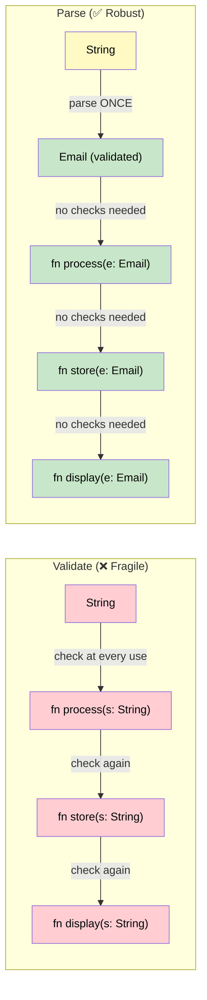
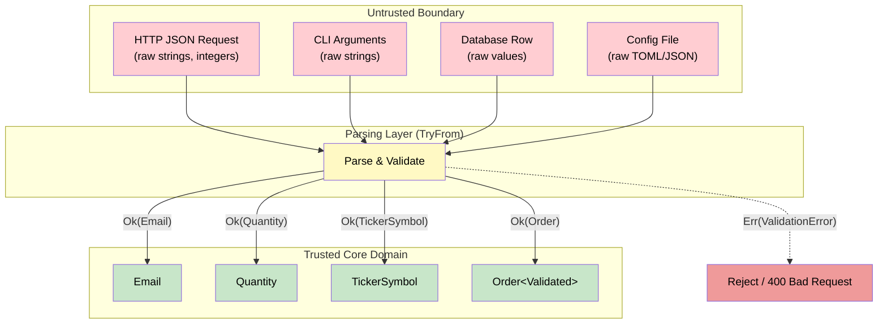

# 4. Parse, Don't Validate 🟡

> **What you'll learn:**
> - The "Parse, Don't Validate" principle: convert unstructured input into strongly typed domain objects *once*, at the boundary
> - How the **Newtype pattern** creates distinct types that carry semantic meaning and invariants
> - How `TryFrom` / `FromStr` encode validation into type construction, making invalid data unrepresentable in the core domain
> - Why this eliminates defensive programming — if the type exists, it's already valid

## The Problem: Shotgun Validation

In typical OOP codebases, validation is scattered everywhere:

```java
// Java — validation sprinkled across the codebase
class OrderService {
    void placeOrder(String email, int quantity, String symbol) {
        // Validate here...
        if (!email.contains("@")) throw new IllegalArgumentException("Bad email");
        if (quantity <= 0) throw new IllegalArgumentException("Bad quantity");
        if (symbol.length() > 5) throw new IllegalArgumentException("Bad symbol");

        // ...and also here...
        processPayment(email, quantity, symbol);
    }

    void processPayment(String email, int quantity, String symbol) {
        // Do we validate AGAIN? What if someone calls this directly?
        if (!email.contains("@")) throw new IllegalArgumentException("Bad email");
        // ... duplicate validation ...
    }
}
```

**The problems:**
1. **Duplication** — Every function that handles `email` re-validates it
2. **Trust deficit** — You can never be sure the `String` you received is actually a valid email
3. **Primitive obsession** — `String` carries no semantic meaning; an email, a username, and a SQL query are all `String`
4. **Silent bugs** — Forgetting to validate in one path compiles fine but creates a vulnerability

## Parse, Don't Validate

The core insight: **don't repeatedly check properties of data; convert it into a type that guarantees those properties.**



## The Newtype Pattern

A **newtype** is a single-field struct that wraps a primitive type, giving it a distinct type identity:

```rust
/// A validated email address. The inner String is private —
/// the only way to create an Email is through TryFrom, which validates.
#[derive(Debug, Clone, PartialEq, Eq, Hash)]
pub struct Email(String);

/// A validated stock ticker symbol (1-5 uppercase ASCII letters).
#[derive(Debug, Clone, PartialEq, Eq, Hash)]
pub struct TickerSymbol(String);

/// A positive, non-zero quantity.
#[derive(Debug, Clone, Copy, PartialEq, Eq, PartialOrd, Ord, Hash)]
pub struct Quantity(u32);
```

**The field is private.** External code cannot create `Email("garbage".into())` directly. They *must* go through the validated constructor.

### Implementing `TryFrom`

```rust
use std::fmt;

#[derive(Debug, Clone, PartialEq, Eq, Hash)]
pub struct Email(String);

#[derive(Debug, Clone, PartialEq)]
pub enum EmailError {
    Empty,
    MissingAtSign,
    MissingDomain,
    MissingLocalPart,
}

impl fmt::Display for EmailError {
    fn fmt(&self, f: &mut fmt::Formatter<'_>) -> fmt::Result {
        match self {
            EmailError::Empty => write!(f, "email cannot be empty"),
            EmailError::MissingAtSign => write!(f, "email must contain '@'"),
            EmailError::MissingDomain => write!(f, "email must have a domain after '@'"),
            EmailError::MissingLocalPart => write!(f, "email must have a local part before '@'"),
        }
    }
}

impl TryFrom<String> for Email {
    type Error = EmailError;

    fn try_from(value: String) -> Result<Self, Self::Error> {
        if value.is_empty() {
            return Err(EmailError::Empty);
        }
        let at_pos = value.find('@').ok_or(EmailError::MissingAtSign)?;
        if at_pos == 0 {
            return Err(EmailError::MissingLocalPart);
        }
        if at_pos == value.len() - 1 {
            return Err(EmailError::MissingDomain);
        }
        Ok(Email(value))
    }
}

impl TryFrom<&str> for Email {
    type Error = EmailError;

    fn try_from(value: &str) -> Result<Self, Self::Error> {
        Email::try_from(value.to_string())
    }
}

impl Email {
    /// Borrow the validated email string.
    /// This is the ONLY way to access the inner value.
    pub fn as_str(&self) -> &str {
        &self.0
    }

    pub fn domain(&self) -> &str {
        // Safe: we validated the '@' exists during construction
        self.0.split('@').nth(1).unwrap()
    }
}

fn main() {
    // ✅ Parsing at the boundary:
    let email = Email::try_from("user@example.com").unwrap();
    println!("Domain: {}", email.domain()); // "example.com"

    // ❌ Invalid email — caught at parse time, not deep in business logic:
    let bad = Email::try_from("not-an-email");
    assert!(bad.is_err());
    println!("Error: {}", bad.unwrap_err()); // "email must contain '@'"
}
```

### The Quantity Newtype

```rust
#[derive(Debug, Clone, Copy, PartialEq, Eq, PartialOrd, Ord, Hash)]
pub struct Quantity(u32);

#[derive(Debug, Clone, PartialEq)]
pub struct QuantityError;

impl std::fmt::Display for QuantityError {
    fn fmt(&self, f: &mut std::fmt::Formatter<'_>) -> std::fmt::Result {
        write!(f, "quantity must be greater than zero")
    }
}

impl TryFrom<u32> for Quantity {
    type Error = QuantityError;

    fn try_from(value: u32) -> Result<Self, Self::Error> {
        if value == 0 {
            Err(QuantityError)
        } else {
            Ok(Quantity(value))
        }
    }
}

impl Quantity {
    pub fn get(&self) -> u32 {
        self.0
    }
}

fn process_order(qty: Quantity) {
    // ✅ No validation needed — the type GUARANTEES qty > 0
    println!("Processing {} units", qty.get());
}

fn main() {
    let qty = Quantity::try_from(10).unwrap();
    process_order(qty);

    // ❌ Caught at parse time:
    let bad = Quantity::try_from(0);
    assert!(bad.is_err());
}
```

## Domain Boundaries: Where Parsing Happens

The principle: **parse at the boundary, trust inside the boundary.**



### Complete Example: Parsing an Order from JSON

```rust
use std::fmt;

// ── Domain Types (trusted) ──────────────────────────────────────

#[derive(Debug, Clone, PartialEq, Eq, Hash)]
pub struct TickerSymbol(String);

#[derive(Debug, Clone, Copy, PartialEq, Eq)]
pub struct Quantity(u32);

#[derive(Debug, Clone, Copy, PartialEq)]
pub struct Price(f64);

#[derive(Debug, Clone, Copy, PartialEq, Eq)]
pub enum Side { Buy, Sell }

/// A validated order — every field is guaranteed valid by construction.
#[derive(Debug)]
pub struct Order {
    pub symbol: TickerSymbol,
    pub side: Side,
    pub quantity: Quantity,
    pub price: Price,
}

// ── Validation Errors ───────────────────────────────────────────

#[derive(Debug)]
pub enum OrderError {
    InvalidSymbol(String),
    InvalidQuantity(String),
    InvalidPrice(String),
    InvalidSide(String),
}

impl fmt::Display for OrderError {
    fn fmt(&self, f: &mut fmt::Formatter<'_>) -> fmt::Result {
        match self {
            OrderError::InvalidSymbol(msg) => write!(f, "invalid symbol: {msg}"),
            OrderError::InvalidQuantity(msg) => write!(f, "invalid quantity: {msg}"),
            OrderError::InvalidPrice(msg) => write!(f, "invalid price: {msg}"),
            OrderError::InvalidSide(msg) => write!(f, "invalid side: {msg}"),
        }
    }
}

// ── TryFrom implementations ────────────────────────────────────

impl TryFrom<&str> for TickerSymbol {
    type Error = OrderError;
    fn try_from(s: &str) -> Result<Self, Self::Error> {
        if s.is_empty() || s.len() > 5 {
            return Err(OrderError::InvalidSymbol(
                format!("must be 1-5 chars, got '{s}'")));
        }
        if !s.chars().all(|c| c.is_ascii_uppercase()) {
            return Err(OrderError::InvalidSymbol(
                format!("must be uppercase ASCII, got '{s}'")));
        }
        Ok(TickerSymbol(s.to_string()))
    }
}

impl TryFrom<u32> for Quantity {
    type Error = OrderError;
    fn try_from(n: u32) -> Result<Self, Self::Error> {
        if n == 0 {
            return Err(OrderError::InvalidQuantity("must be > 0".into()));
        }
        Ok(Quantity(n))
    }
}

impl TryFrom<f64> for Price {
    type Error = OrderError;
    fn try_from(p: f64) -> Result<Self, Self::Error> {
        if p <= 0.0 || !p.is_finite() {
            return Err(OrderError::InvalidPrice(
                format!("must be positive and finite, got {p}")));
        }
        Ok(Price(p))
    }
}

impl TryFrom<&str> for Side {
    type Error = OrderError;
    fn try_from(s: &str) -> Result<Self, Self::Error> {
        match s {
            "buy" | "BUY" => Ok(Side::Buy),
            "sell" | "SELL" => Ok(Side::Sell),
            other => Err(OrderError::InvalidSide(
                format!("expected 'buy' or 'sell', got '{other}'")))
        }
    }
}

// ── The parsing boundary ────────────────────────────────────────

/// Simulates raw JSON input (in production, use serde)
struct RawOrderRequest {
    symbol: String,
    side: String,
    quantity: u32,
    price: f64,
}

impl RawOrderRequest {
    /// Parse the raw request into a validated Order.
    /// This is the SINGLE point of validation.
    fn parse(self) -> Result<Order, Vec<OrderError>> {
        let mut errors = Vec::new();

        let symbol = TickerSymbol::try_from(self.symbol.as_str())
            .map_err(|e| errors.push(e)).ok();
        let side = Side::try_from(self.side.as_str())
            .map_err(|e| errors.push(e)).ok();
        let quantity = Quantity::try_from(self.quantity)
            .map_err(|e| errors.push(e)).ok();
        let price = Price::try_from(self.price)
            .map_err(|e| errors.push(e)).ok();

        if !errors.is_empty() {
            return Err(errors);
        }

        // ✅ All fields validated — unwrap is safe here
        Ok(Order {
            symbol: symbol.unwrap(),
            side: side.unwrap(),
            quantity: quantity.unwrap(),
            price: price.unwrap(),
        })
    }
}

// ── Core domain logic — NO validation needed ────────────────────

fn process_order(order: &Order) {
    // ✅ We can TRUST every field is valid. No checks needed.
    println!("Processing {:?} {:?} × {} @ {}",
        order.side,
        order.symbol,
        order.quantity.0,
        order.price.0,
    );
}

fn main() {
    // Good request:
    let raw = RawOrderRequest {
        symbol: "AAPL".into(),
        side: "buy".into(),
        quantity: 100,
        price: 150.50,
    };
    match raw.parse() {
        Ok(order) => process_order(&order),
        Err(errors) => {
            for e in &errors {
                eprintln!("Validation error: {e}");
            }
        }
    }
    // Output: Processing Buy TickerSymbol("AAPL") × 100 @ 150.5

    // Bad request — collects ALL errors:
    let raw = RawOrderRequest {
        symbol: "invalid!!".into(),
        side: "maybe".into(),
        quantity: 0,
        price: -10.0,
    };
    match raw.parse() {
        Ok(_) => unreachable!(),
        Err(errors) => {
            for e in &errors {
                eprintln!("Validation error: {e}");
            }
        }
    }
    // Validation error: invalid symbol: must be uppercase ASCII, got 'invalid!!'
    // Validation error: invalid side: expected 'buy' or 'sell', got 'maybe'
    // Validation error: invalid quantity: must be > 0
    // Validation error: invalid price: must be positive and finite, got -10
}
```

## Comparison: Primitive Obsession vs Parse, Don't Validate

| Aspect | Primitive Types (`String`, `u32`) | Newtypes (`Email`, `Quantity`) |
|--------|----------------------------------|-------------------------------|
| **Meaning** | None — a `String` could be anything | Self-documenting — `Email` is clearly an email |
| **Validation** | Repeated at every usage site | Once, at construction |
| **Mixing up arguments** | `fn order(String, String, u32)` — which String is which? | `fn order(TickerSymbol, Email, Quantity)` — unambiguous |
| **Refactoring safety** | Changing validation logic requires finding every check | Change the `TryFrom` impl — one place |
| **Zero-cost** | N/A | Yes — newtypes compile to the same layout as the inner type |

### Preventing Argument Mixups

```rust
// ❌ Primitive obsession — easy to swap arguments:
fn transfer(from: String, to: String, amount: f64) { /* ... */ }

// Was it transfer(from, to) or transfer(to, from)?
// The compiler can't help you.

// ✅ Newtypes — impossible to swap:
# #[derive(Debug)]
struct AccountId(String);
# #[derive(Debug)]
struct Amount(f64);

fn transfer(from: AccountId, to: AccountId, amount: Amount) {
    println!("Transfer {:?} from {:?} to {:?}", amount, from, to);
}

// transfer(amount, from, to) — WON'T COMPILE. The types are different.
```

## Combining with Typestate (Preview of Capstone)

Parse, Don't Validate and Typestate are complementary patterns. Together, they create a pipeline where:

1. **Parse**: Raw input → Validated domain types (`TryFrom`)
2. **Typestate**: Validated data → State transitions (`Pending → Validated → Matched`)

```rust
# use std::marker::PhantomData;
# #[derive(Debug, Clone)] struct TickerSymbol(String);
# #[derive(Debug, Clone, Copy)] struct Quantity(u32);
# #[derive(Debug, Clone, Copy)] struct Price(f64);
# #[derive(Debug, Clone, Copy)] enum Side { Buy, Sell }

// Typestate markers for order lifecycle
struct Pending;
struct Validated;
struct Matched;

struct Order<State> {
    symbol: TickerSymbol,
    side: Side,
    quantity: Quantity,
    price: Price,
    _state: PhantomData<State>,
}

impl Order<Pending> {
    /// Created from parsed-and-validated domain types
    fn new(symbol: TickerSymbol, side: Side, quantity: Quantity, price: Price) -> Self {
        Order { symbol, side, quantity, price, _state: PhantomData }
    }

    /// Validate against market rules (price limits, trading hours, etc.)
    fn validate(self) -> Result<Order<Validated>, String> {
        // Business rules that go beyond parsing
        if self.price.0 > 10_000.0 {
            return Err("Price exceeds market limit".into());
        }
        Ok(Order {
            symbol: self.symbol, side: self.side,
            quantity: self.quantity, price: self.price,
            _state: PhantomData,
        })
    }
}

impl Order<Validated> {
    /// Only validated orders can be submitted to the matching engine
    fn submit_to_matching(self) -> Order<Matched> {
        println!("Matching order: {:?} {:?}", self.side, self.symbol);
        Order {
            symbol: self.symbol, side: self.side,
            quantity: self.quantity, price: self.price,
            _state: PhantomData,
        }
    }
}

fn main() {
    // Step 1: Parse (TryFrom at the boundary)
    let symbol = TickerSymbol("MSFT".into());
    let qty = Quantity(50);
    let price = Price(350.25);

    // Step 2: Create pending order from validated types
    let order = Order::<Pending>::new(symbol, Side::Buy, qty, price);

    // Step 3: Typestate transitions
    let order = order.validate().expect("validation failed");
    let _matched = order.submit_to_matching();

    // ❌ Can't submit a Pending order directly:
    // Order::<Pending>::new(...).submit_to_matching();
    // Error: no method `submit_to_matching` found for `Order<Pending>`
}
```

<details>
<summary><strong>🏋️ Exercise: Username and Password Newtypes</strong> (click to expand)</summary>

**Challenge:** Create `Username` and `Password` newtypes with the following rules:

- **Username**: 3–20 characters, alphanumeric and underscores only, must start with a letter
- **Password**: at least 8 characters, must contain at least one uppercase letter, one lowercase letter, and one digit

Implement `TryFrom<&str>` for both. Then create a `Credentials` struct that can only be constructed from validated `Username` and `Password`.

<details>
<summary>🔑 Solution</summary>

```rust
use std::fmt;

#[derive(Debug, Clone)]
pub struct Username(String);

#[derive(Clone)]
pub struct Password(String);

// Don't print passwords in Debug output!
impl fmt::Debug for Password {
    fn fmt(&self, f: &mut fmt::Formatter<'_>) -> fmt::Result {
        write!(f, "Password(***)")
    }
}

#[derive(Debug)]
pub enum CredentialError {
    UsernameTooShort,
    UsernameTooLong,
    UsernameInvalidChars,
    UsernameMustStartWithLetter,
    PasswordTooShort,
    PasswordMissingUppercase,
    PasswordMissingLowercase,
    PasswordMissingDigit,
}

impl fmt::Display for CredentialError {
    fn fmt(&self, f: &mut fmt::Formatter<'_>) -> fmt::Result {
        match self {
            Self::UsernameTooShort => write!(f, "username must be at least 3 characters"),
            Self::UsernameTooLong => write!(f, "username must be at most 20 characters"),
            Self::UsernameInvalidChars => write!(f, "username must be alphanumeric/underscore"),
            Self::UsernameMustStartWithLetter => write!(f, "username must start with a letter"),
            Self::PasswordTooShort => write!(f, "password must be at least 8 characters"),
            Self::PasswordMissingUppercase => write!(f, "password must contain an uppercase letter"),
            Self::PasswordMissingLowercase => write!(f, "password must contain a lowercase letter"),
            Self::PasswordMissingDigit => write!(f, "password must contain a digit"),
        }
    }
}

impl TryFrom<&str> for Username {
    type Error = CredentialError;
    fn try_from(s: &str) -> Result<Self, Self::Error> {
        if s.len() < 3 { return Err(CredentialError::UsernameTooShort); }
        if s.len() > 20 { return Err(CredentialError::UsernameTooLong); }
        if !s.starts_with(|c: char| c.is_ascii_alphabetic()) {
            return Err(CredentialError::UsernameMustStartWithLetter);
        }
        if !s.chars().all(|c| c.is_ascii_alphanumeric() || c == '_') {
            return Err(CredentialError::UsernameInvalidChars);
        }
        Ok(Username(s.to_string()))
    }
}

impl TryFrom<&str> for Password {
    type Error = CredentialError;
    fn try_from(s: &str) -> Result<Self, Self::Error> {
        if s.len() < 8 { return Err(CredentialError::PasswordTooShort); }
        if !s.chars().any(|c| c.is_ascii_uppercase()) {
            return Err(CredentialError::PasswordMissingUppercase);
        }
        if !s.chars().any(|c| c.is_ascii_lowercase()) {
            return Err(CredentialError::PasswordMissingLowercase);
        }
        if !s.chars().any(|c| c.is_ascii_digit()) {
            return Err(CredentialError::PasswordMissingDigit);
        }
        Ok(Password(s.to_string()))
    }
}

/// Can ONLY be constructed from validated Username + Password
#[derive(Debug)]
pub struct Credentials {
    pub username: Username,
    pub password: Password,
}

impl Credentials {
    pub fn new(username: Username, password: Password) -> Self {
        Credentials { username, password }
    }
}

fn login(creds: &Credentials) {
    // ✅ No validation needed — the types guarantee correctness
    println!("Logging in as {:?}", creds.username);
}

fn main() {
    let user = Username::try_from("alice_dev").unwrap();
    let pass = Password::try_from("Str0ngP@ss").unwrap();
    let creds = Credentials::new(user, pass);
    login(&creds);

    // ❌ These fail at parse time:
    assert!(Username::try_from("ab").is_err());        // Too short
    assert!(Username::try_from("1invalid").is_err());   // Starts with digit
    assert!(Password::try_from("short").is_err());      // Too short
    assert!(Password::try_from("alllowercase1").is_err()); // No uppercase
}
```

</details>
</details>

> **Key Takeaways:**
> - **Parse, Don't Validate**: convert raw input into strongly typed domain objects at the boundary. Once parsed, the type itself is the proof of validity.
> - **Newtypes** (`struct Email(String)`) add semantic meaning, prevent argument mixups, and carry invariants — all at zero runtime cost.
> - **`TryFrom`** is the idiomatic Rust trait for fallible parsing. Implement it on your newtypes for a clean, composable validation API.
> - **Validate at the boundary, trust inside.** Functions that accept `Email` or `Quantity` never need defensive checks.
> - Combined with Typestate (Chapter 3), this creates a pipeline: **Parse → Typestate transitions → Business logic** with zero runtime validation in the core domain.

> **See also:**
> - [Chapter 3: The Typestate Pattern](ch03-the-typestate-pattern.md) — complementary compile-time invariant enforcement
> - [Chapter 7: Hexagonal Architecture](ch07-hexagonal-architecture.md) — where the boundary between untrusted and trusted lives architecturally
> - [Chapter 8: Capstone Trading Engine](ch08-capstone-trading-engine.md) — Parse, Don't Validate applied to order ingestion
> - [Type-Driven Correctness](../type-driven-correctness-book/src/SUMMARY.md) — advanced type-level techniques
