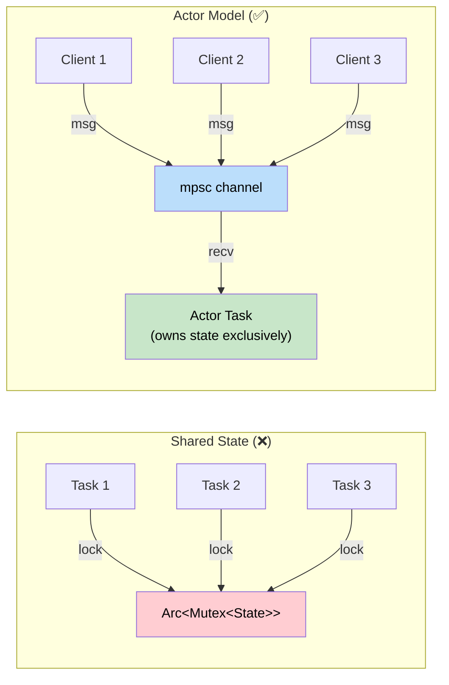
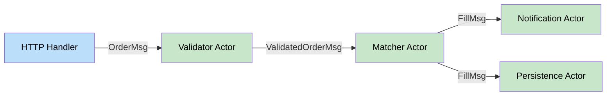

# 5. The Actor Model 🔴

> **What you'll learn:**
> - Why `Arc<Mutex<T>>` leads to deadlocks, contention, and architectural fragility in large systems
> - How the Actor Model encapsulates mutable state inside spawned tasks, communicated via channels
> - How to build production-quality actors with Tokio's `mpsc`, `oneshot`, and `watch` channels
> - How actors connect to Async Rust (Tokio spawns), and why they eliminate shared-state concurrency bugs

## The Problem: Shared State, Shared Pain

When Java and C++ developers first encounter concurrent Rust, they reach for the familiar: a global data structure behind a mutex.

```rust
use std::collections::HashMap;
use std::sync::{Arc, Mutex};

/// The "obvious" approach: shared state + mutex
type SharedCache = Arc<Mutex<HashMap<String, String>>>;

async fn handle_request_bad(cache: SharedCache, key: String) -> Option<String> {
    // ❌ Problems with this approach:
    // 1. Lock contention — every handler blocks on the same mutex
    // 2. Lock ordering — multiple mutexes → deadlock risk
    // 3. Poison — if a thread panics while holding the lock, the mutex is poisoned
    // 4. No backpressure — tasks pile up waiting for the lock
    let guard = cache.lock().unwrap();
    guard.get(&key).cloned()
}
```

This works for small systems. But as complexity grows — multiple shared resources, nested locks, async code — `Arc<Mutex<T>>` becomes increasingly dangerous:

| Problem | Symptom | Root Cause |
|---------|---------|------------|
| **Deadlocks** | System hangs silently | Two tasks acquire locks in different order |
| **Lock contention** | Throughput plateaus | All tasks serialize on one mutex |
| **Held across `.await`** | Compilation error or runtime hang | `MutexGuard` is `!Send` in `std::sync::Mutex`; `tokio::sync::Mutex` allows it but risks deadlocks |
| **Write starvation** | Readers always win | `RwLock` with many readers doesn't let writers through |
| **Poisoned mutex** | Cascading `PoisonError` | A thread panicked while holding the lock |

### The Architectural Insight

The problem isn't the mutex itself — it's the *shared ownership model*. When state is shared, you need synchronization. When state is *owned by a single task*, you don't.

> **The Actor Model says:** Don't share state. Give each piece of state to a dedicated task (the actor), and communicate by sending messages.

## The Actor Model

An **actor** is:
1. A spawned task that owns some state
2. A channel receiver (`mpsc::Receiver`) that accepts messages
3. A loop that processes messages one at a time, mutating state safely



### A Simple Key-Value Store Actor

```rust,ignore
use tokio::sync::{mpsc, oneshot};
use std::collections::HashMap;

/// Messages the actor can receive.
/// Each variant carries the data needed + a reply channel.
enum CacheMessage {
    Get {
        key: String,
        reply: oneshot::Sender<Option<String>>,
    },
    Set {
        key: String,
        value: String,
    },
    Delete {
        key: String,
        reply: oneshot::Sender<bool>,
    },
}

/// The actor: a spawned task that owns the HashMap exclusively.
struct CacheActor {
    receiver: mpsc::Receiver<CacheMessage>,
    store: HashMap<String, String>,
}

impl CacheActor {
    fn new(receiver: mpsc::Receiver<CacheMessage>) -> Self {
        CacheActor {
            receiver,
            store: HashMap::new(),
        }
    }

    /// The actor's run loop. Processes messages one at a time.
    /// No mutex needed — this task has exclusive ownership of `store`.
    async fn run(mut self) {
        // Process messages until all senders are dropped
        while let Some(msg) = self.receiver.recv().await {
            match msg {
                CacheMessage::Get { key, reply } => {
                    let value = self.store.get(&key).cloned();
                    // Ignore send errors (receiver may have been dropped)
                    let _ = reply.send(value);
                }
                CacheMessage::Set { key, value } => {
                    self.store.insert(key, value);
                }
                CacheMessage::Delete { key, reply } => {
                    let existed = self.store.remove(&key).is_some();
                    let _ = reply.send(existed);
                }
            }
        }
    }
}

/// A handle to the actor — this is what clients use.
/// Cloneable, Send, cheap to pass around.
#[derive(Clone)]
struct CacheHandle {
    sender: mpsc::Sender<CacheMessage>,
}

impl CacheHandle {
    /// Spawn the actor and return a handle to it.
    fn new(buffer_size: usize) -> Self {
        let (sender, receiver) = mpsc::channel(buffer_size);
        let actor = CacheActor::new(receiver);
        
        // Spawn the actor as a Tokio task — it runs independently
        tokio::spawn(actor.run());
        
        CacheHandle { sender }
    }

    /// Send a Get message and await the reply.
    async fn get(&self, key: &str) -> Option<String> {
        let (reply_tx, reply_rx) = oneshot::channel();
        let msg = CacheMessage::Get {
            key: key.to_string(),
            reply: reply_tx,
        };
        // If the actor has been dropped, this will fail
        self.sender.send(msg).await.ok()?;
        reply_rx.await.ok()?
    }

    /// Send a Set message (fire-and-forget).
    async fn set(&self, key: String, value: String) {
        let msg = CacheMessage::Set { key, value };
        let _ = self.sender.send(msg).await;
    }

    /// Send a Delete message and await the reply.
    async fn delete(&self, key: &str) -> bool {
        let (reply_tx, reply_rx) = oneshot::channel();
        let msg = CacheMessage::Delete {
            key: key.to_string(),
            reply: reply_tx,
        };
        if self.sender.send(msg).await.is_err() {
            return false;
        }
        reply_rx.await.unwrap_or(false)
    }
}

#[tokio::main]
async fn main() {
    let cache = CacheHandle::new(64);

    // Multiple concurrent tasks can use the same handle
    let cache1 = cache.clone();
    let cache2 = cache.clone();

    let t1 = tokio::spawn(async move {
        cache1.set("name".into(), "Alice".into()).await;
        cache1.set("lang".into(), "Rust".into()).await;
    });

    let t2 = tokio::spawn(async move {
        // Wait briefly for t1 to populate
        tokio::time::sleep(std::time::Duration::from_millis(10)).await;
        let name = cache2.get("name").await;
        println!("Got: {:?}", name); // Some("Alice")
    });

    t1.await.unwrap();
    t2.await.unwrap();
}
```

### Why This Is Better Than `Arc<Mutex<T>>`

| Property | `Arc<Mutex<T>>` | Actor Model |
|----------|-----------------|-------------|
| **Data races** | Prevented by Mutex (safe) | Impossible — single owner |
| **Deadlocks** | Possible with multiple mutexes | Impossible — no locks |
| **Contention** | All tasks block on one lock | Buffered channel — tasks enqueue and continue |
| **Backpressure** | None — tasks spin-wait | `mpsc::channel(N)` — bounded buffer applies backpressure |
| **Testability** | Hard to test lock ordering | Send messages in tests — deterministic |
| **Async-friendly** | `std::Mutex` can't hold across await | Actors are native async tasks |

## Actor Patterns in Production

### Pattern 1: Request/Response with `oneshot`

The most common pattern: send a request, await a response.

```rust,ignore
// Already shown above — the Get/Delete messages use oneshot

// The key insight: oneshot::channel() creates a one-time response channel
let (reply_tx, reply_rx) = oneshot::channel();
sender.send(Request { ..., reply: reply_tx }).await;
let response = reply_rx.await?; // Await the actor's response
```

### Pattern 2: Fire-and-Forget

For messages where you don't need a response (logging, metrics, cache warming):

```rust,ignore
// No reply channel — just send and continue
sender.send(LogMessage { level: "info", text: "request handled" }).await;
```

### Pattern 3: Actor Supervision with `watch`

Use a `watch` channel for actors that need to broadcast state changes:

```rust,ignore
use tokio::sync::watch;

struct HealthActor {
    receiver: mpsc::Receiver<HealthMessage>,
    state_tx: watch::Sender<ServiceHealth>,
}

/// Multiple subscribers can watch the health state
/// without any lock contention.
async fn health_check_endpoint(health: watch::Receiver<ServiceHealth>) -> String {
    let current = health.borrow().clone();
    format!("Status: {:?}", current)
}
```

### Pattern 4: Actor Topology (Multiple Actors)

In production systems, actors often form pipelines:



Each actor owns its state. Messages flow through channels. No shared state, no locks, no deadlocks.

### Pattern 5: Graceful Shutdown

Actors shut down naturally when all senders are dropped (the `while let Some(msg) = receiver.recv().await` loop exits):

```rust,ignore
// To shut down an actor, drop all handles:
{
    let cache = CacheHandle::new(64);
    cache.set("key".into(), "value".into()).await;
} // cache handle dropped here → sender dropped → actor's recv() returns None → loop exits

// For explicit shutdown, add a Shutdown variant:
enum Message {
    DoWork { /* ... */ },
    Shutdown,
}

// In the actor loop:
while let Some(msg) = self.receiver.recv().await {
    match msg {
        Message::Shutdown => break, // Exit the loop cleanly
        Message::DoWork { /* ... */ } => { /* ... */ }
    }
}
// Cleanup code runs here after the loop
```

## Connection to Async Rust

This chapter builds directly on the [Async Rust](../async-book/src/SUMMARY.md) guide:

| Async Concept | Actor Usage |
|---------------|-------------|
| `tokio::spawn` | Creates the actor task |
| `mpsc::channel` | The actor's message inbox |
| `oneshot::channel` | Request/response communication |
| `select!` | Actor processes messages from multiple sources |
| Cancellation (drop) | Dropping all handles shuts down the actor |
| `Send + 'static` | Actor messages must be `Send` (tokio::spawn requires it) |

The actor model is why `tokio::spawn` exists — it creates isolated tasks that communicate through channels. If you've read the Async Rust guide, you already know the mechanics. This chapter shows you the *architecture*.

<details>
<summary><strong>🏋️ Exercise: Rate Limiter Actor</strong> (click to expand)</summary>

**Challenge:** Build an actor that implements a **token bucket rate limiter**:
- The actor maintains a bucket of `max_tokens` tokens
- Tokens refill at a rate of `refill_rate` per second
- Clients send `Acquire` messages. The actor replies `true` if a token was available, `false` otherwise
- The actor should use `tokio::time::interval` to refill tokens periodically

```rust,ignore
// Your message type:
enum RateLimitMessage {
    Acquire { reply: oneshot::Sender<bool> },
}

// Your handle:
struct RateLimiter { sender: mpsc::Sender<RateLimitMessage> }

impl RateLimiter {
    fn new(max_tokens: u32, refill_rate: Duration) -> Self { /* ... */ }
    async fn acquire(&self) -> bool { /* ... */ }
}
```

<details>
<summary>🔑 Solution</summary>

```rust,ignore
use std::time::Duration;
use tokio::sync::{mpsc, oneshot};
use tokio::time;

enum RateLimitMessage {
    Acquire { reply: oneshot::Sender<bool> },
}

struct RateLimitActor {
    receiver: mpsc::Receiver<RateLimitMessage>,
    tokens: u32,
    max_tokens: u32,
}

impl RateLimitActor {
    fn new(receiver: mpsc::Receiver<RateLimitMessage>, max_tokens: u32) -> Self {
        RateLimitActor {
            receiver,
            tokens: max_tokens, // Start full
            max_tokens,
        }
    }

    async fn run(mut self, refill_interval: Duration) {
        // ✅ Use tokio::select! to handle both messages AND the refill timer
        let mut refill_tick = time::interval(refill_interval);
        
        loop {
            tokio::select! {
                // Handle incoming messages
                msg = self.receiver.recv() => {
                    match msg {
                        Some(RateLimitMessage::Acquire { reply }) => {
                            if self.tokens > 0 {
                                self.tokens -= 1;
                                let _ = reply.send(true);
                            } else {
                                let _ = reply.send(false);
                            }
                        }
                        None => {
                            // All senders dropped — shut down
                            break;
                        }
                    }
                }
                // Refill tokens periodically
                _ = refill_tick.tick() => {
                    if self.tokens < self.max_tokens {
                        self.tokens += 1;
                    }
                }
            }
        }
    }
}

#[derive(Clone)]
struct RateLimiter {
    sender: mpsc::Sender<RateLimitMessage>,
}

impl RateLimiter {
    fn new(max_tokens: u32, refill_interval: Duration) -> Self {
        let (sender, receiver) = mpsc::channel(64);
        let actor = RateLimitActor::new(receiver, max_tokens);
        tokio::spawn(actor.run(refill_interval));
        RateLimiter { sender }
    }

    async fn acquire(&self) -> bool {
        let (reply_tx, reply_rx) = oneshot::channel();
        let msg = RateLimitMessage::Acquire { reply: reply_tx };
        if self.sender.send(msg).await.is_err() {
            return false; // Actor shut down
        }
        reply_rx.await.unwrap_or(false)
    }
}

#[tokio::main]
async fn main() {
    // 5 tokens max, refill 1 per second
    let limiter = RateLimiter::new(5, Duration::from_secs(1));

    // Use up all tokens
    for i in 0..7 {
        let allowed = limiter.acquire().await;
        println!("Request {}: {}", i, if allowed { "✅ allowed" } else { "❌ rejected" });
    }
    // Requests 0-4: allowed, 5-6: rejected

    // Wait for refill
    tokio::time::sleep(Duration::from_secs(2)).await;

    // Tokens have been refilled
    let allowed = limiter.acquire().await;
    println!("After refill: {}", if allowed { "✅ allowed" } else { "❌ rejected" });
    // ✅ allowed
}
```

**Key points:**
- `tokio::select!` lets the actor handle both messages and timers in one loop — no need for separate refill tasks
- The actor **exclusively owns** `tokens` — no `Mutex` needed
- The `Clone`-able `RateLimiter` handle can be shared across tasks freely
- Dropping all handles gracefully shuts down the actor

</details>
</details>

> **Key Takeaways:**
> - **The Actor Model** replaces shared state (`Arc<Mutex<T>>`) with message passing. Each actor is a spawned task that exclusively owns its state.
> - **`mpsc`** channels are the actor's inbox. **`oneshot`** channels provide request/response. **`watch`** channels broadcast state.
> - Actors are **deadlock-free** (no locks!), **backpressure-aware** (bounded channels), and **naturally async** (built on `tokio::spawn`).
> - The **Handle pattern** (a cloneable struct wrapping an `mpsc::Sender`) is the client-facing API. It hides the actor's internal message protocol.
> - Actor topologies (pipelines, fan-out) compose naturally for complex concurrent systems like the trading engine in Chapter 8.

> **See also:**
> - [Async Rust](../async-book/src/SUMMARY.md) — the runtime foundation that actors are built on
> - [Concurrency in Rust](../concurrency-book/src/SUMMARY.md) — comprehensive coverage of threads, atomics, and channels
> - [Chapter 8: Capstone Trading Engine](ch08-capstone-trading-engine.md) — actors used for order book management
