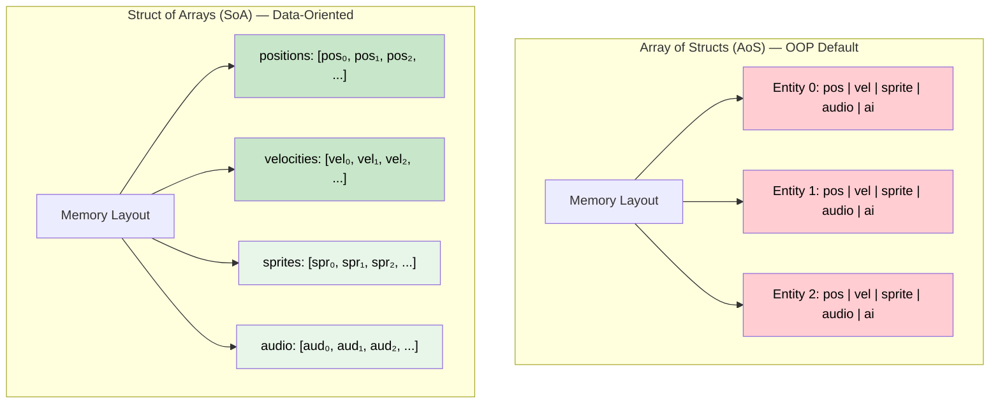
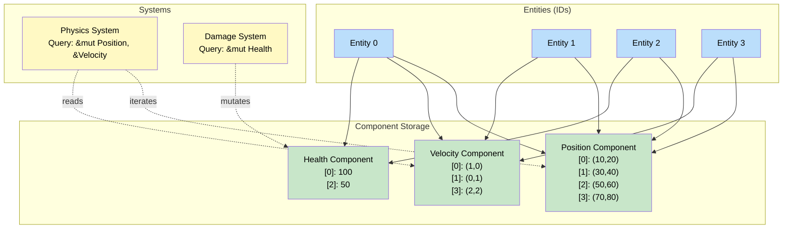

# 6. Entity-Component-System (ECS) 🔴

> **What you'll learn:**
> - Why Data-Oriented Design (DOD) outperforms Object-Oriented Design for large-scale simulations
> - How Array of Structs (AoS) vs Struct of Arrays (SoA) affects cache performance and borrow checker ergonomics
> - How the Entity-Component-System (ECS) pattern completely sidesteps borrow checker issues for massive concurrent data processing
> - When ECS is (and isn't) the right architecture, and how it connects to arena allocation (Chapter 2)

## The Problem: OOP and the Cache Miss Crisis

Consider a game with 100,000 entities. In OOP:

```java
// Java — Array of Structs (AoS) with inheritance
abstract class Entity {
    Vec3 position;
    Vec3 velocity;
    Sprite sprite;       // 64 bytes of texture data
    AudioSource audio;   // 128 bytes of audio buffers
    AIController ai;     // 256 bytes of pathfinding state
}

// When updating physics, you iterate ALL entities:
for (Entity e : entities) {
    e.position.add(e.velocity); // You only need 24 bytes (position + velocity)
    // But the CPU loads the ENTIRE Entity into cache (500+ bytes per entity)
    // Most of that data (sprite, audio, ai) is WASTED cache space
}
```

This is the **Array of Structs (AoS)** layout. The CPU cache line (typically 64 bytes) loads the whole entity just to read two fields. For 100,000 entities, you're thrashing the cache catastrophically.

### Memory Layout: AoS vs SoA



With SoA, the physics system iterates *only* the positions and velocities arrays. These are contiguous in memory, and every cache line is packed with useful data.

| Metric | AoS (OOP) | SoA (DOD) |
|--------|-----------|-----------|
| **Cache efficiency** (physics update) | ~5% useful data per cache line | ~100% useful data per cache line |
| **SIMD vectorization** | Impossible (data interleaved) | Natural (contiguous arrays) |
| **Borrow checker** | `&mut entity` borrows everything | `&mut positions` + `&velocities` — disjoint borrows |
| **Adding new data** | Add field to struct — breaks all code | Add new array — existing systems unchanged |

## Data-Oriented Design (DOD) in Rust

Let's translate the OOP game example into DOD:

```rust
// ✅ Struct of Arrays — Data-Oriented Design
struct Vec3 { x: f32, y: f32, z: f32 }

struct World {
    // Each "component" is a separate array
    positions: Vec<Vec3>,
    velocities: Vec<Vec3>,
    healths: Vec<f32>,
    sprites: Vec<SpriteData>,
    // ... more components as needed
}

struct SpriteData { texture_id: u32, width: u32, height: u32 }

impl World {
    fn update_physics(&mut self) {
        // ✅ Only positions and velocities are touched — perfect cache locality
        // ✅ Disjoint borrows: &mut positions + &velocities — no borrow conflict!
        for (pos, vel) in self.positions.iter_mut().zip(self.velocities.iter()) {
            pos.x += vel.x;
            pos.y += vel.y;
            pos.z += vel.z;
        }
    }

    fn update_rendering(&self) {
        // ✅ Only positions and sprites — health/velocity not loaded
        for (pos, sprite) in self.positions.iter().zip(self.sprites.iter()) {
            draw(pos, sprite);
        }
    }
}

# fn draw(_pos: &Vec3, _sprite: &SpriteData) {}
```

**Notice how the borrow checker issue from Chapter 1 vanishes.** When fields are separate arrays, you can borrow `&mut positions` and `&velocities` simultaneously because they're disjoint fields of the `World` struct.

## The ECS Architecture

ECS formalizes DOD into three concepts:

| Concept | What It Is | Analogy |
|---------|-----------|---------|
| **Entity** | A unique ID (like a row in a database) | Primary key |
| **Component** | A data struct (like a column) | Table column |
| **System** | A function that operates on specific components | SQL query |



**Key insight:** Not every entity has every component. Entity 1 has Position and Velocity but no Health. Entity 2 has Position and Health but no Velocity. The system "Physics" only runs on entities that have *both* Position and Velocity.

## Building a Minimal ECS from Scratch

```rust
use std::any::{Any, TypeId};
use std::collections::HashMap;

/// An entity is just a unique ID.
#[derive(Clone, Copy, Debug, PartialEq, Eq, Hash)]
struct Entity(usize);

/// Type-erased component storage for one component type.
/// Each component type gets its own Vec, indexed by entity.
struct ComponentVec {
    data: Vec<Option<Box<dyn Any>>>,
}

impl ComponentVec {
    fn new() -> Self {
        ComponentVec { data: Vec::new() }
    }

    fn set<T: 'static>(&mut self, entity: Entity, component: T) {
        // Grow storage if needed
        if entity.0 >= self.data.len() {
            self.data.resize_with(entity.0 + 1, || None);
        }
        self.data[entity.0] = Some(Box::new(component));
    }

    fn get<T: 'static>(&self, entity: Entity) -> Option<&T> {
        self.data.get(entity.0)?
            .as_ref()?
            .downcast_ref::<T>()
    }

    fn get_mut<T: 'static>(&mut self, entity: Entity) -> Option<&mut T> {
        self.data.get_mut(entity.0)?
            .as_mut()?
            .downcast_mut::<T>()
    }
}

/// The World stores all entities and their components.
struct World {
    entity_count: usize,
    components: HashMap<TypeId, ComponentVec>,
}

impl World {
    fn new() -> Self {
        World {
            entity_count: 0,
            components: HashMap::new(),
        }
    }

    /// Create a new entity (just allocates an ID).
    fn spawn(&mut self) -> Entity {
        let entity = Entity(self.entity_count);
        self.entity_count += 1;
        entity
    }

    /// Attach a component to an entity.
    fn add_component<T: 'static>(&mut self, entity: Entity, component: T) {
        let type_id = TypeId::of::<T>();
        let storage = self.components
            .entry(type_id)
            .or_insert_with(ComponentVec::new);
        storage.set(entity, component);
    }

    /// Get a reference to an entity's component.
    fn get_component<T: 'static>(&self, entity: Entity) -> Option<&T> {
        let type_id = TypeId::of::<T>();
        self.components.get(&type_id)?.get::<T>(entity)
    }

    /// Get a mutable reference to an entity's component.
    fn get_component_mut<T: 'static>(&mut self, entity: Entity) -> Option<&mut T> {
        let type_id = TypeId::of::<T>();
        self.components.get_mut(&type_id)?.get_mut::<T>(entity)
    }
}

// ── Components ──────────────────────────────────────────────────

#[derive(Debug, Clone)]
struct Position { x: f32, y: f32 }

#[derive(Debug, Clone)]
struct Velocity { dx: f32, dy: f32 }

#[derive(Debug, Clone)]
struct Health { hp: f32, max_hp: f32 }

// ── Systems (just functions!) ───────────────────────────────────

fn physics_system(world: &mut World) {
    // In a real ECS, you'd query for entities with both Position and Velocity.
    // In our minimal version, we iterate entities manually:
    for id in 0..world.entity_count {
        let entity = Entity(id);
        // Only process entities that have BOTH Position and Velocity
        let vel_copy = world.get_component::<Velocity>(entity).cloned();
        if let Some(vel) = vel_copy {
            if let Some(pos) = world.get_component_mut::<Position>(entity) {
                pos.x += vel.dx;
                pos.y += vel.dy;
            }
        }
    }
}

fn print_system(world: &World) {
    for id in 0..world.entity_count {
        let entity = Entity(id);
        if let Some(pos) = world.get_component::<Position>(entity) {
            println!("Entity {}: position=({:.1}, {:.1})", id, pos.x, pos.y);
        }
    }
}

fn main() {
    let mut world = World::new();

    // Spawn entities with different component combinations
    let player = world.spawn();
    world.add_component(player, Position { x: 0.0, y: 0.0 });
    world.add_component(player, Velocity { dx: 1.0, dy: 0.5 });
    world.add_component(player, Health { hp: 100.0, max_hp: 100.0 });

    let rock = world.spawn(); // Static object
    world.add_component(rock, Position { x: 50.0, y: 50.0 });
    // No velocity! Physics system will skip this entity.

    let bullet = world.spawn();
    world.add_component(bullet, Position { x: 0.0, y: 0.0 });
    world.add_component(bullet, Velocity { dx: 10.0, dy: 0.0 });

    // Run systems
    println!("--- Before physics ---");
    print_system(&world);

    physics_system(&mut world);

    println!("--- After physics ---");
    print_system(&world);
    // Entity 0: position=(1.0, 0.5)   — moved
    // Entity 1: position=(50.0, 50.0) — static (no velocity)
    // Entity 2: position=(10.0, 0.0)  — moved
}
```

## Why ECS Sidesteps the Borrow Checker

The magic: **systems request specific components, not entire entities.** This maps to **disjoint borrows** in Rust:

```rust
# struct Position { x: f32, y: f32 }
# struct Velocity { dx: f32, dy: f32 }
# struct Health { hp: f32, max_hp: f32 }

struct World {
    positions: Vec<Option<Position>>,
    velocities: Vec<Option<Velocity>>,
    healths: Vec<Option<Health>>,
}

impl World {
    fn run_physics(&mut self) {
        // ✅ Borrows positions mutably + velocities immutably — DISJOINT
        let World { positions, velocities, .. } = self;
        for (pos, vel) in positions.iter_mut().zip(velocities.iter()) {
            if let (Some(p), Some(v)) = (pos, vel) {
                p.x += v.dx;
                p.y += v.dy;
            }
        }
    }

    fn run_damage(&mut self) {
        // ✅ Only borrows healths — doesn't conflict with physics
        for health in self.healths.iter_mut().flatten() {
            health.hp = health.hp.max(0.0);
        }
    }
}
```

In OOP, `entity.update()` borrows the entire entity. In ECS, each system borrows only the component arrays it needs. This is exactly the disjoint-field-access solution from Chapter 1, scaled to an architecture.

## Production ECS: Bevy

[Bevy](https://bevyengine.org/) is the most popular Rust ECS framework. It handles scheduling, parallel system execution, and change detection:

```rust,ignore
use bevy::prelude::*;

// Components are just structs with #[derive(Component)]
#[derive(Component)]
struct Position { x: f32, y: f32 }

#[derive(Component)]
struct Velocity { dx: f32, dy: f32 }

#[derive(Component)]
struct Health(f32);

// Systems are functions with Query parameters.
// Bevy figures out which components to fetch.
fn physics_system(mut query: Query<(&mut Position, &Velocity)>) {
    // ✅ Bevy runs this in parallel on entities that have BOTH components
    for (mut pos, vel) in &mut query {
        pos.x += vel.dx;
        pos.y += vel.dy;
    }
}

fn damage_system(mut query: Query<&mut Health>) {
    for mut hp in &mut query {
        hp.0 = hp.0.max(0.0);
    }
}

fn main() {
    App::new()
        .add_plugins(MinimalPlugins)
        // Bevy automatically detects that physics_system and damage_system
        // access different components → runs them IN PARALLEL
        .add_systems(Update, (physics_system, damage_system))
        .run();
}
```

**Bevy's automatic parallelism:** Because systems declare their component access through `Query` types, Bevy can statically analyze whether two systems conflict. If they don't touch the same component arrays, they run on different threads simultaneously — with zero manual synchronization.

## ECS vs Other Patterns: Decision Matrix

| Scenario | Best Architecture | Why |
|----------|-------------------|-----|
| Game with 10,000+ entities | ✅ **ECS** | Cache locality, automatic parallel systems |
| Simulation (physics, particles) | ✅ **ECS** | SoA layout maximizes throughput |
| Web service with business logic | ❌ **Hexagonal + Actors** | ECS is overkill; domain logic doesn't benefit from SoA |
| Tree/graph data structure | ❌ **Arena (Ch 2)** | ECS is for homogeneous entity processing, not graph traversal |
| State machine protocol | ❌ **Typestate (Ch 3)** | No entity iteration needed |
| Concurrent microservice | ⚠️ **Actor (Ch 5)** or ECS | Actors for message passing; ECS if you're batch-processing data |

<details>
<summary><strong>🏋️ Exercise: Particle Simulation</strong> (click to expand)</summary>

**Challenge:** Build a simple 2D particle simulation using the SoA pattern:

1. Create a `ParticleWorld` struct with separate `Vec`s for position, velocity, lifetime, and active/inactive status
2. Implement a `spawn` function that adds 1000 particles with random velocities
3. Implement a `tick` system that:
   - Updates positions from velocities
   - Decrements lifetimes
   - Marks particles as inactive when lifetime reaches zero
4. Implement a `compact` function that removes inactive particles (bonus: swap-remove for O(1))

<details>
<summary>🔑 Solution</summary>

```rust
/// SoA particle world — each property is a separate, contiguous array.
struct ParticleWorld {
    // ✅ Struct of Arrays — each Vec is contiguous in memory
    pos_x: Vec<f32>,
    pos_y: Vec<f32>,
    vel_x: Vec<f32>,
    vel_y: Vec<f32>,
    lifetime: Vec<f32>,
    active: Vec<bool>,
}

impl ParticleWorld {
    fn new() -> Self {
        ParticleWorld {
            pos_x: Vec::new(),
            pos_y: Vec::new(),
            vel_x: Vec::new(),
            vel_y: Vec::new(),
            lifetime: Vec::new(),
            active: Vec::new(),
        }
    }

    fn spawn(&mut self, x: f32, y: f32, vx: f32, vy: f32, life: f32) {
        self.pos_x.push(x);
        self.pos_y.push(y);
        self.vel_x.push(vx);
        self.vel_y.push(vy);
        self.lifetime.push(life);
        self.active.push(true);
    }

    fn spawn_burst(&mut self, count: usize) {
        // Simple deterministic "random" using index
        for i in 0..count {
            let angle = (i as f32) * 0.0618; // Golden angle-ish
            let speed = 1.0 + (i % 5) as f32 * 0.5;
            let vx = angle.cos() * speed;
            let vy = angle.sin() * speed;
            let life = 2.0 + (i % 3) as f32;
            self.spawn(0.0, 0.0, vx, vy, life);
        }
    }

    /// Physics + lifetime system.
    /// ✅ Disjoint borrows: we destructure to access separate arrays.
    fn tick(&mut self, dt: f32) {
        let ParticleWorld {
            pos_x, pos_y, vel_x, vel_y, lifetime, active
        } = self;

        for i in 0..active.len() {
            if !active[i] {
                continue;
            }

            // Update position from velocity
            pos_x[i] += vel_x[i] * dt;
            pos_y[i] += vel_y[i] * dt;

            // Decrement lifetime
            lifetime[i] -= dt;
            if lifetime[i] <= 0.0 {
                active[i] = false;
            }
        }
    }

    /// Remove inactive particles using swap-remove for O(1) per removal.
    /// This maintains contiguous arrays without gaps.
    fn compact(&mut self) {
        let mut i = 0;
        while i < self.active.len() {
            if !self.active[i] {
                // Swap-remove from all arrays simultaneously
                self.pos_x.swap_remove(i);
                self.pos_y.swap_remove(i);
                self.vel_x.swap_remove(i);
                self.vel_y.swap_remove(i);
                self.lifetime.swap_remove(i);
                self.active.swap_remove(i);
                // Don't increment i — the swapped element needs checking
            } else {
                i += 1;
            }
        }
    }

    fn active_count(&self) -> usize {
        self.active.iter().filter(|&&a| a).count()
    }

    fn total_count(&self) -> usize {
        self.active.len()
    }
}

fn main() {
    let mut world = ParticleWorld::new();
    world.spawn_burst(1000);
    println!("Spawned {} particles", world.total_count());

    // Simulate 5 seconds at 60fps
    let dt = 1.0 / 60.0;
    for frame in 0..300 {
        world.tick(dt);
        if frame % 60 == 0 {
            println!(
                "Frame {}: {}/{} active",
                frame,
                world.active_count(),
                world.total_count()
            );
        }
    }

    // Compact to remove dead particles
    world.compact();
    println!("After compaction: {} particles", world.total_count());
}
```

**Performance insight:** The `tick` function iterates contiguous `f32` arrays — this is exactly what CPU prefetchers and SIMD instructions are optimized for. With AoS, you'd be hopping across 500+ byte entities to read two floats.

</details>
</details>

> **Key Takeaways:**
> - **Data-Oriented Design (DOD)** organizes data by *usage pattern* (SoA), not by object identity (AoS). This maximizes cache locality and enables SIMD.
> - **ECS** (Entity-Component-System) formalizes DOD: entities are IDs, components are data in separate arrays, systems are functions that query component combinations.
> - ECS **sidesteps the borrow checker** because systems borrow *component arrays*, not entities. Disjoint component arrays = disjoint borrows = no conflicts.
> - Production ECS frameworks like **Bevy** automatically parallelize systems that access different components.
> - ECS is ideal for **simulations, games, and batch data processing** — not for web services or protocol state machines.

> **See also:**
> - [Chapter 1: Why OOP Fails in Rust](ch01-why-oop-fails-in-rust.md) — the disjoint field access pattern that ECS generalizes
> - [Chapter 2: Arena Allocators](ch02-arena-allocators-and-indexing.md) — the indexing foundation that ECS builds on
> - [Rust Memory Management](../memory-management-book/src/SUMMARY.md) — understanding memory layout, cache lines, and allocators
