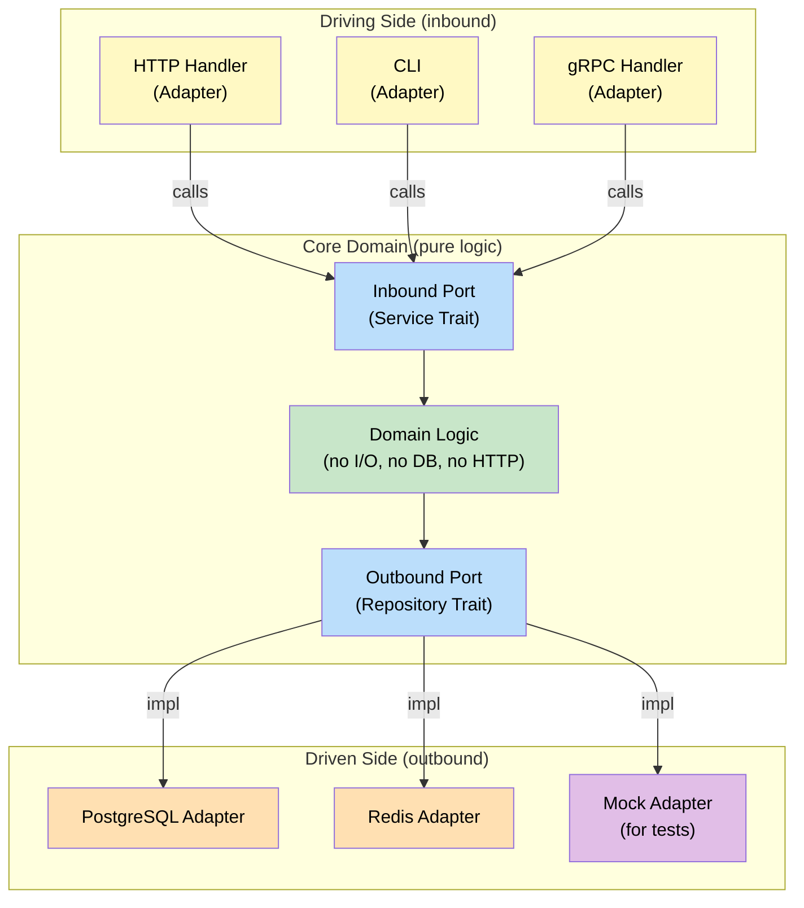

# 7. Hexagonal Architecture (Ports and Adapters) 🔴

> **What you'll learn:**
> - How to decouple domain logic from databases, HTTP, and file I/O using Hexagonal Architecture (Ports & Adapters)
> - Two dependency injection strategies in Rust: **generics (`impl Trait`)** vs **dynamic dispatch (`dyn Trait`)** — and when to use each
> - How to write pure, testable domain logic with mock adapters injected via traits
> - How this architecture maps to Rust module layout and crate boundaries

## The Problem: Domain Logic Entangled with Infrastructure

In typical OOP applications, business logic gets tangled with database calls, HTTP clients, and file I/O:

```java
// Java — domain logic coupled to infrastructure
class OrderService {
    private final Database db;
    private final HttpClient paymentApi;
    private final EmailSender emailer;

    Order placeOrder(OrderRequest req) {
        // Business logic mixed with infrastructure:
        Order order = new Order(req);
        db.save(order);                          // Direct DB dependency
        paymentApi.charge(order.amount());        // Direct HTTP dependency
        emailer.send(req.email(), "Order placed"); // Direct email dependency
        return order;
    }
}
```

**Problems:**
- Testing `placeOrder` requires a real database, a running payment API, and an email server (or complex mocking frameworks)
- Switching from PostgreSQL to DynamoDB means rewriting business logic
- The "core domain" is invisible — buried under infrastructure calls

## Hexagonal Architecture

The solution: **the domain core has no dependencies on infrastructure.** Instead, it defines *ports* (traits) that infrastructure *adapters* implement.



| Concept | Rust Implementation |
|---------|-------------------|
| **Port** | A `trait` (e.g., `trait OrderRepository`) |
| **Adapter** | A struct that `impl`s the trait (e.g., `PostgresOrderRepo`) |
| **Domain Core** | Pure functions and structs — no I/O, no `async` unless the port requires it |
| **Dependency Injection** | Generic parameters (`impl Trait`) or trait objects (`dyn Trait`) |

## Building a Hexagonal Architecture in Rust

Let's build an order management service step by step.

### Step 1: Define the Domain Types (Parse, Don't Validate)

```rust
/// Domain types — Chapter 4's Parse, Don't Validate applied here
#[derive(Debug, Clone, PartialEq)]
pub struct OrderId(String);

#[derive(Debug, Clone)]
pub struct Order {
    pub id: OrderId,
    pub customer_email: String,
    pub items: Vec<OrderItem>,
    pub total_cents: u64,
}

#[derive(Debug, Clone)]
pub struct OrderItem {
    pub product_id: String,
    pub quantity: u32,
    pub price_cents: u64,
}

impl Order {
    pub fn calculate_total(items: &[OrderItem]) -> u64 {
        items.iter().map(|i| i.price_cents * i.quantity as u64).sum()
    }
}
```

### Step 2: Define the Ports (Traits)

Ports are traits. Outbound ports define what the domain *needs* from the outside world:

```rust
# use std::fmt;
# #[derive(Debug, Clone, PartialEq)] pub struct OrderId(String);
# #[derive(Debug, Clone)] pub struct Order { pub id: OrderId, pub customer_email: String, pub items: Vec<OrderItem>, pub total_cents: u64 }
# #[derive(Debug, Clone)] pub struct OrderItem { pub product_id: String, pub quantity: u32, pub price_cents: u64 }

/// Outbound port: the domain needs to persist orders
pub trait OrderRepository {
    fn save(&self, order: &Order) -> Result<(), RepositoryError>;
    fn find_by_id(&self, id: &OrderId) -> Result<Option<Order>, RepositoryError>;
    fn find_all(&self) -> Result<Vec<Order>, RepositoryError>;
}

/// Outbound port: the domain needs to send notifications
pub trait NotificationService {
    fn notify_order_placed(&self, order: &Order) -> Result<(), NotificationError>;
}

#[derive(Debug)]
pub enum RepositoryError {
    ConnectionFailed(String),
    NotFound,
    DuplicateKey,
}

#[derive(Debug)]
pub enum NotificationError {
    SendFailed(String),
}

impl fmt::Display for RepositoryError {
    fn fmt(&self, f: &mut fmt::Formatter<'_>) -> fmt::Result {
        match self {
            Self::ConnectionFailed(msg) => write!(f, "connection failed: {msg}"),
            Self::NotFound => write!(f, "not found"),
            Self::DuplicateKey => write!(f, "duplicate key"),
        }
    }
}

impl fmt::Display for NotificationError {
    fn fmt(&self, f: &mut fmt::Formatter<'_>) -> fmt::Result {
        match self {
            Self::SendFailed(msg) => write!(f, "send failed: {msg}"),
        }
    }
}
```

### Step 3: Implement the Domain Service (Generic DI)

The domain service is generic over its dependencies:

```rust
# #[derive(Debug, Clone, PartialEq)] pub struct OrderId(String);
# #[derive(Debug, Clone)] pub struct Order { pub id: OrderId, pub customer_email: String, pub items: Vec<OrderItem>, pub total_cents: u64 }
# #[derive(Debug, Clone)] pub struct OrderItem { pub product_id: String, pub quantity: u32, pub price_cents: u64 }
# #[derive(Debug)] pub enum RepositoryError { ConnectionFailed(String), NotFound, DuplicateKey }
# #[derive(Debug)] pub enum NotificationError { SendFailed(String) }
# pub trait OrderRepository { fn save(&self, order: &Order) -> Result<(), RepositoryError>; fn find_by_id(&self, id: &OrderId) -> Result<Option<Order>, RepositoryError>; fn find_all(&self) -> Result<Vec<Order>, RepositoryError>; }
# pub trait NotificationService { fn notify_order_placed(&self, order: &Order) -> Result<(), NotificationError>; }
# impl Order { pub fn calculate_total(items: &[OrderItem]) -> u64 { items.iter().map(|i| i.price_cents * i.quantity as u64).sum() } }

/// The domain service — generic over its dependencies.
/// No DB, no HTTP, no I/O — just pure domain logic.
pub struct OrderService<R: OrderRepository, N: NotificationService> {
    repo: R,
    notifier: N,
    next_id: std::cell::Cell<u64>,
}

#[derive(Debug)]
pub enum OrderError {
    EmptyOrder,
    Repository(RepositoryError),
    Notification(NotificationError),
}

impl<R: OrderRepository, N: NotificationService> OrderService<R, N> {
    pub fn new(repo: R, notifier: N) -> Self {
        OrderService {
            repo,
            notifier,
            next_id: std::cell::Cell::new(1),
        }
    }

    /// Pure domain logic: validate, calculate, persist, notify.
    pub fn place_order(
        &self,
        customer_email: String,
        items: Vec<OrderItem>,
    ) -> Result<Order, OrderError> {
        // Business rule: orders must have at least one item
        if items.is_empty() {
            return Err(OrderError::EmptyOrder);
        }

        let total = Order::calculate_total(&items);
        let id = self.next_id.get();
        self.next_id.set(id + 1);

        let order = Order {
            id: OrderId(format!("ORD-{:06}", id)),
            customer_email,
            items,
            total_cents: total,
        };

        // Use the repository port (we don't know if it's Postgres, mocks, etc.)
        self.repo.save(&order).map_err(OrderError::Repository)?;

        // Use the notification port
        self.notifier
            .notify_order_placed(&order)
            .map_err(OrderError::Notification)?;

        Ok(order)
    }

    pub fn get_order(&self, id: &OrderId) -> Result<Option<Order>, OrderError> {
        self.repo.find_by_id(id).map_err(OrderError::Repository)
    }
}
```

**Notice:** `OrderService` has zero infrastructure knowledge. It doesn't know about PostgreSQL, Redis, HTTP, or email. It works with any types that implement the port traits.

### Step 4: Implement Adapters

```rust
# #[derive(Debug, Clone, PartialEq)] pub struct OrderId(String);
# #[derive(Debug, Clone)] pub struct Order { pub id: OrderId, pub customer_email: String, pub items: Vec<OrderItem>, pub total_cents: u64 }
# #[derive(Debug, Clone)] pub struct OrderItem { pub product_id: String, pub quantity: u32, pub price_cents: u64 }
# #[derive(Debug)] pub enum RepositoryError { ConnectionFailed(String), NotFound, DuplicateKey }
# #[derive(Debug)] pub enum NotificationError { SendFailed(String) }
# pub trait OrderRepository { fn save(&self, order: &Order) -> Result<(), RepositoryError>; fn find_by_id(&self, id: &OrderId) -> Result<Option<Order>, RepositoryError>; fn find_all(&self) -> Result<Vec<Order>, RepositoryError>; }
# pub trait NotificationService { fn notify_order_placed(&self, order: &Order) -> Result<(), NotificationError>; }

use std::cell::RefCell;

/// In-memory adapter (for tests and prototyping)
pub struct InMemoryOrderRepo {
    orders: RefCell<Vec<Order>>,
}

impl InMemoryOrderRepo {
    pub fn new() -> Self {
        InMemoryOrderRepo {
            orders: RefCell::new(Vec::new()),
        }
    }

    pub fn count(&self) -> usize {
        self.orders.borrow().len()
    }
}

impl OrderRepository for InMemoryOrderRepo {
    fn save(&self, order: &Order) -> Result<(), RepositoryError> {
        let mut orders = self.orders.borrow_mut();
        if orders.iter().any(|o| o.id == order.id) {
            return Err(RepositoryError::DuplicateKey);
        }
        orders.push(order.clone());
        Ok(())
    }

    fn find_by_id(&self, id: &OrderId) -> Result<Option<Order>, RepositoryError> {
        let orders = self.orders.borrow();
        Ok(orders.iter().find(|o| &o.id == id).cloned())
    }

    fn find_all(&self) -> Result<Vec<Order>, RepositoryError> {
        Ok(self.orders.borrow().clone())
    }
}

/// Console notification adapter (prints instead of sending email)
pub struct ConsoleNotifier;

impl NotificationService for ConsoleNotifier {
    fn notify_order_placed(&self, order: &Order) -> Result<(), NotificationError> {
        println!(
            "📧 Notification: Order {} placed for {} (${:.2})",
            order.id.0,
            order.customer_email,
            order.total_cents as f64 / 100.0
        );
        Ok(())
    }
}
```

### Step 5: Wire It Together

```rust
# #[derive(Debug, Clone, PartialEq)] pub struct OrderId(pub String);
# #[derive(Debug, Clone)] pub struct Order { pub id: OrderId, pub customer_email: String, pub items: Vec<OrderItem>, pub total_cents: u64 }
# #[derive(Debug, Clone)] pub struct OrderItem { pub product_id: String, pub quantity: u32, pub price_cents: u64 }
# impl Order { pub fn calculate_total(items: &[OrderItem]) -> u64 { items.iter().map(|i| i.price_cents * i.quantity as u64).sum() } }
# #[derive(Debug)] pub enum RepositoryError { ConnectionFailed(String), NotFound, DuplicateKey }
# #[derive(Debug)] pub enum NotificationError { SendFailed(String) }
# pub trait OrderRepository { fn save(&self, order: &Order) -> Result<(), RepositoryError>; fn find_by_id(&self, id: &OrderId) -> Result<Option<Order>, RepositoryError>; fn find_all(&self) -> Result<Vec<Order>, RepositoryError>; }
# pub trait NotificationService { fn notify_order_placed(&self, order: &Order) -> Result<(), NotificationError>; }
# use std::cell::{RefCell, Cell};
# pub struct InMemoryOrderRepo { orders: RefCell<Vec<Order>> }
# impl InMemoryOrderRepo { pub fn new() -> Self { InMemoryOrderRepo { orders: RefCell::new(Vec::new()) } } pub fn count(&self) -> usize { self.orders.borrow().len() } }
# impl OrderRepository for InMemoryOrderRepo { fn save(&self, order: &Order) -> Result<(), RepositoryError> { self.orders.borrow_mut().push(order.clone()); Ok(()) } fn find_by_id(&self, id: &OrderId) -> Result<Option<Order>, RepositoryError> { Ok(self.orders.borrow().iter().find(|o| &o.id == id).cloned()) } fn find_all(&self) -> Result<Vec<Order>, RepositoryError> { Ok(self.orders.borrow().clone()) } }
# pub struct ConsoleNotifier;
# impl NotificationService for ConsoleNotifier { fn notify_order_placed(&self, order: &Order) -> Result<(), NotificationError> { println!("Notified: {}", order.id.0); Ok(()) } }
# #[derive(Debug)] pub enum OrderError { EmptyOrder, Repository(RepositoryError), Notification(NotificationError) }
# pub struct OrderService<R: OrderRepository, N: NotificationService> { repo: R, notifier: N, next_id: Cell<u64> }
# impl<R: OrderRepository, N: NotificationService> OrderService<R, N> { pub fn new(repo: R, notifier: N) -> Self { OrderService { repo, notifier, next_id: Cell::new(1) } } pub fn place_order(&self, email: String, items: Vec<OrderItem>) -> Result<Order, OrderError> { if items.is_empty() { return Err(OrderError::EmptyOrder); } let total = Order::calculate_total(&items); let id = self.next_id.get(); self.next_id.set(id + 1); let order = Order { id: OrderId(format!("ORD-{:06}", id)), customer_email: email, items, total_cents: total }; self.repo.save(&order).map_err(OrderError::Repository)?; self.notifier.notify_order_placed(&order).map_err(OrderError::Notification)?; Ok(order) } }

fn main() {
    // Production wiring (would use PostgresOrderRepo + SmtpNotifier):
    let repo = InMemoryOrderRepo::new();
    let notifier = ConsoleNotifier;
    let service = OrderService::new(repo, notifier);

    let order = service.place_order(
        "alice@example.com".into(),
        vec![
            OrderItem {
                product_id: "WIDGET-1".into(),
                quantity: 2,
                price_cents: 1999,
            },
            OrderItem {
                product_id: "GADGET-3".into(),
                quantity: 1,
                price_cents: 4999,
            },
        ],
    ).unwrap();

    println!("Order placed: {} — total: ${:.2}",
        order.id.0,
        order.total_cents as f64 / 100.0);
}
```

## Dependency Injection: Generics vs `dyn Trait`

Rust offers two DI strategies. Each has trade-offs:

### Strategy 1: Generics (`impl Trait`)

```rust
# trait OrderRepository {} trait NotificationService {}
// Monomorphized — zero-cost, but generates code for each concrete combination
struct OrderService<R: OrderRepository, N: NotificationService> {
    repo: R,
    notifier: N,
}

// Can't store different OrderService types in a Vec
// (OrderService<Postgres, Smtp> ≠ OrderService<InMemory, Console>)
```

### Strategy 2: Dynamic Dispatch (`dyn Trait`)

```rust
# trait OrderRepository {} trait NotificationService {}
// Single concrete type — flexible, but has vtable overhead
struct OrderService {
    repo: Box<dyn OrderRepository>,
    notifier: Box<dyn NotificationService>,
}

// ✅ Can swap implementations at runtime (feature flags, config-based)
// ✅ Faster compile times (no monomorphization)
// ❌ Heap allocation (Box) + vtable indirection
```

### Comparison Table

| | Generics (`impl Trait`) | `dyn Trait` (Trait Objects) |
|---|---|---|
| **Performance** | Zero-cost (monomorphized, inlined) | 1 vtable lookup + 1 heap allocation |
| **Compile time** | Slower (code generated per combination) | Faster (single codegen) |
| **Binary size** | Larger (copies per monomorphization) | Smaller (single implementation) |
| **Runtime swap** | ❌ Types fixed at compile time | ✅ Can swap via config/feature flags |
| **Object-safety** | N/A | Trait must be object-safe (no `Self`, no generics) |
| **Best for** | Hot paths, inner loops | Configuration, plugins, testing |

**Rule of thumb:** Use generics for the domain core (hot path). Use `dyn Trait` at application boundaries (wiring, plugins, test injection).

## Module Layout

A well-structured Rust hexagonal project:

```
my-service/
├── Cargo.toml
├── src/
│   ├── main.rs              # Wiring: creates adapters, injects into domain
│   ├── domain/
│   │   ├── mod.rs
│   │   ├── model.rs          # Order, OrderItem, OrderId (domain types)
│   │   ├── ports.rs          # OrderRepository, NotificationService (traits)
│   │   └── service.rs        # OrderService (pure domain logic)
│   ├── adapters/
│   │   ├── mod.rs
│   │   ├── postgres_repo.rs  # impl OrderRepository for PostgresRepo
│   │   ├── redis_repo.rs     # impl OrderRepository for RedisRepo
│   │   ├── smtp_notifier.rs  # impl NotificationService for SmtpNotifier
│   │   └── console_notifier.rs
│   └── api/
│       ├── mod.rs
│       ├── http_handler.rs   # Axum/Actix handlers (inbound adapter)
│       └── grpc_handler.rs
└── tests/
    └── order_service_test.rs # Uses InMemoryRepo + stub notifier
```

**Key rule:** The `domain/` module has **zero dependencies** on `adapters/` or `api/`. Dependencies flow inward: `api → domain ← adapters`.

## Testing with Mock Adapters

This is the payoff. Testing domain logic requires no database, no network, no I/O:

```rust
# #[derive(Debug, Clone, PartialEq)] pub struct OrderId(pub String);
# #[derive(Debug, Clone)] pub struct Order { pub id: OrderId, pub customer_email: String, pub items: Vec<OrderItem>, pub total_cents: u64 }
# #[derive(Debug, Clone)] pub struct OrderItem { pub product_id: String, pub quantity: u32, pub price_cents: u64 }
# impl Order { pub fn calculate_total(items: &[OrderItem]) -> u64 { items.iter().map(|i| i.price_cents * i.quantity as u64).sum() } }
# #[derive(Debug)] pub enum RepositoryError { ConnectionFailed(String), NotFound, DuplicateKey }
# #[derive(Debug)] pub enum NotificationError { SendFailed(String) }
# pub trait OrderRepository { fn save(&self, order: &Order) -> Result<(), RepositoryError>; fn find_by_id(&self, id: &OrderId) -> Result<Option<Order>, RepositoryError>; fn find_all(&self) -> Result<Vec<Order>, RepositoryError>; }
# pub trait NotificationService { fn notify_order_placed(&self, order: &Order) -> Result<(), NotificationError>; }
# use std::cell::{RefCell, Cell};
# #[derive(Debug)] pub enum OrderError { EmptyOrder, Repository(RepositoryError), Notification(NotificationError) }
# pub struct OrderService<R: OrderRepository, N: NotificationService> { repo: R, notifier: N, next_id: Cell<u64> }
# impl<R: OrderRepository, N: NotificationService> OrderService<R, N> { pub fn new(repo: R, notifier: N) -> Self { OrderService { repo, notifier, next_id: Cell::new(1) } } pub fn place_order(&self, email: String, items: Vec<OrderItem>) -> Result<Order, OrderError> { if items.is_empty() { return Err(OrderError::EmptyOrder); } let total = Order::calculate_total(&items); let id = self.next_id.get(); self.next_id.set(id + 1); let order = Order { id: OrderId(format!("ORD-{:06}", id)), customer_email: email, items, total_cents: total }; self.repo.save(&order).map_err(OrderError::Repository)?; self.notifier.notify_order_placed(&order).map_err(OrderError::Notification)?; Ok(order) } }

/// Test double: in-memory repository
struct MockRepo {
    orders: RefCell<Vec<Order>>,
}
impl MockRepo {
    fn new() -> Self { MockRepo { orders: RefCell::new(Vec::new()) } }
    fn saved_orders(&self) -> Vec<Order> { self.orders.borrow().clone() }
}
impl OrderRepository for MockRepo {
    fn save(&self, order: &Order) -> Result<(), RepositoryError> {
        self.orders.borrow_mut().push(order.clone());
        Ok(())
    }
    fn find_by_id(&self, id: &OrderId) -> Result<Option<Order>, RepositoryError> {
        Ok(self.orders.borrow().iter().find(|o| &o.id == id).cloned())
    }
    fn find_all(&self) -> Result<Vec<Order>, RepositoryError> {
        Ok(self.orders.borrow().clone())
    }
}

/// Test double: records notifications
struct MockNotifier {
    notifications: RefCell<Vec<String>>,
}
impl MockNotifier {
    fn new() -> Self { MockNotifier { notifications: RefCell::new(Vec::new()) } }
    fn sent_notifications(&self) -> Vec<String> { self.notifications.borrow().clone() }
}
impl NotificationService for MockNotifier {
    fn notify_order_placed(&self, order: &Order) -> Result<(), NotificationError> {
        self.notifications.borrow_mut().push(order.id.0.clone());
        Ok(())
    }
}

/// Failing adapter: simulates infrastructure failure
struct FailingRepo;
impl OrderRepository for FailingRepo {
    fn save(&self, _: &Order) -> Result<(), RepositoryError> {
        Err(RepositoryError::ConnectionFailed("DB is down".into()))
    }
    fn find_by_id(&self, _: &OrderId) -> Result<Option<Order>, RepositoryError> {
        Err(RepositoryError::ConnectionFailed("DB is down".into()))
    }
    fn find_all(&self) -> Result<Vec<Order>, RepositoryError> {
        Err(RepositoryError::ConnectionFailed("DB is down".into()))
    }
}

fn main() {
    // Test 1: Happy path
    let repo = MockRepo::new();
    let notifier = MockNotifier::new();
    let service = OrderService::new(repo, notifier);

    let result = service.place_order(
        "test@example.com".into(),
        vec![OrderItem {
            product_id: "P1".into(),
            quantity: 1,
            price_cents: 999,
        }],
    );
    assert!(result.is_ok());
    let order = result.unwrap();
    assert_eq!(order.total_cents, 999);

    // Test 2: Empty order rejected
    let repo = MockRepo::new();
    let notifier = MockNotifier::new();
    let service = OrderService::new(repo, notifier);

    let result = service.place_order("test@example.com".into(), vec![]);
    assert!(matches!(result, Err(OrderError::EmptyOrder)));

    // Test 3: Repository failure propagated
    let notifier = MockNotifier::new();
    let service = OrderService::new(FailingRepo, notifier);

    let result = service.place_order(
        "test@example.com".into(),
        vec![OrderItem { product_id: "P1".into(), quantity: 1, price_cents: 999 }],
    );
    assert!(matches!(result, Err(OrderError::Repository(_))));

    println!("All tests passed!");
}
```

**Zero mocking frameworks needed.** Just implement the trait differently for tests. The Rust type system ensures the mock satisfies the port contract.

<details>
<summary><strong>🏋️ Exercise: Add a Discount Service Port</strong> (click to expand)</summary>

**Challenge:** Extend the hexagonal order service with a new port:

1. Create a `DiscountService` trait with a method `fn calculate_discount(&self, items: &[OrderItem]) -> u64` (returns discount in cents)
2. Add it as a generic parameter to `OrderService`
3. Apply the discount to the order total in `place_order`
4. Implement two adapters: `NoDiscount` (always returns 0) and `PercentageDiscount` (applies a fixed percentage)
5. Write a test that verifies a 10% discount is applied correctly

<details>
<summary>🔑 Solution</summary>

```rust
# #[derive(Debug, Clone, PartialEq)] pub struct OrderId(pub String);
# #[derive(Debug, Clone)] pub struct Order { pub id: OrderId, pub customer_email: String, pub items: Vec<OrderItem>, pub total_cents: u64, pub discount_cents: u64 }
# #[derive(Debug, Clone)] pub struct OrderItem { pub product_id: String, pub quantity: u32, pub price_cents: u64 }
# impl Order { pub fn calculate_total(items: &[OrderItem]) -> u64 { items.iter().map(|i| i.price_cents * i.quantity as u64).sum() } }
# #[derive(Debug)] pub enum RepositoryError { ConnectionFailed(String), NotFound, DuplicateKey }
# #[derive(Debug)] pub enum NotificationError { SendFailed(String) }
# pub trait OrderRepository { fn save(&self, order: &Order) -> Result<(), RepositoryError>; fn find_by_id(&self, id: &OrderId) -> Result<Option<Order>, RepositoryError>; }
# pub trait NotificationService { fn notify_order_placed(&self, order: &Order) -> Result<(), NotificationError>; }
use std::cell::{RefCell, Cell};

/// NEW PORT: discount calculation
pub trait DiscountService {
    fn calculate_discount(&self, items: &[OrderItem]) -> u64;
}

/// Adapter: no discount
pub struct NoDiscount;
impl DiscountService for NoDiscount {
    fn calculate_discount(&self, _items: &[OrderItem]) -> u64 { 0 }
}

/// Adapter: percentage-based discount
pub struct PercentageDiscount {
    percent: f64, // e.g., 0.10 for 10%
}

impl PercentageDiscount {
    pub fn new(percent: f64) -> Self {
        assert!((0.0..=1.0).contains(&percent), "percent must be 0.0–1.0");
        PercentageDiscount { percent }
    }
}

impl DiscountService for PercentageDiscount {
    fn calculate_discount(&self, items: &[OrderItem]) -> u64 {
        let subtotal = Order::calculate_total(items);
        (subtotal as f64 * self.percent).round() as u64
    }
}

/// Updated OrderService with discount port
#[derive(Debug)] pub enum OrderError { EmptyOrder, Repository(RepositoryError), Notification(NotificationError) }

pub struct OrderService<R: OrderRepository, N: NotificationService, D: DiscountService> {
    repo: R,
    notifier: N,
    discounter: D,
    next_id: Cell<u64>,
}

impl<R: OrderRepository, N: NotificationService, D: DiscountService>
    OrderService<R, N, D>
{
    pub fn new(repo: R, notifier: N, discounter: D) -> Self {
        OrderService { repo, notifier, discounter, next_id: Cell::new(1) }
    }

    pub fn place_order(
        &self,
        email: String,
        items: Vec<OrderItem>,
    ) -> Result<Order, OrderError> {
        if items.is_empty() {
            return Err(OrderError::EmptyOrder);
        }

        let subtotal = Order::calculate_total(&items);
        let discount = self.discounter.calculate_discount(&items);
        let total = subtotal.saturating_sub(discount);

        let id = self.next_id.get();
        self.next_id.set(id + 1);

        let order = Order {
            id: OrderId(format!("ORD-{:06}", id)),
            customer_email: email,
            items,
            total_cents: total,
            discount_cents: discount,
        };

        self.repo.save(&order).map_err(OrderError::Repository)?;
        self.notifier.notify_order_placed(&order).map_err(OrderError::Notification)?;
        Ok(order)
    }
}

// ── Mock adapters for testing ───────────────────────────────────

struct MockRepo { orders: RefCell<Vec<Order>> }
impl MockRepo { fn new() -> Self { MockRepo { orders: RefCell::new(Vec::new()) } } }
impl OrderRepository for MockRepo {
    fn save(&self, order: &Order) -> Result<(), RepositoryError> {
        self.orders.borrow_mut().push(order.clone()); Ok(())
    }
    fn find_by_id(&self, id: &OrderId) -> Result<Option<Order>, RepositoryError> {
        Ok(self.orders.borrow().iter().find(|o| &o.id == id).cloned())
    }
}

struct StubNotifier;
impl NotificationService for StubNotifier {
    fn notify_order_placed(&self, _: &Order) -> Result<(), NotificationError> { Ok(()) }
}

fn main() {
    // Test: 10% discount applied correctly
    let service = OrderService::new(
        MockRepo::new(),
        StubNotifier,
        PercentageDiscount::new(0.10), // 10% off
    );

    let order = service.place_order(
        "alice@test.com".into(),
        vec![
            OrderItem { product_id: "A".into(), quantity: 1, price_cents: 10000 }, // $100
            OrderItem { product_id: "B".into(), quantity: 2, price_cents: 5000 },  // $100
        ],
    ).unwrap();

    // Subtotal: $200.00 (20000 cents)
    // Discount: 10% = $20.00 (2000 cents)
    // Total: $180.00 (18000 cents)
    assert_eq!(order.discount_cents, 2000);
    assert_eq!(order.total_cents, 18000);
    println!("✅ Discount test passed: total=${:.2}, discount=${:.2}",
        order.total_cents as f64 / 100.0,
        order.discount_cents as f64 / 100.0);
}
```

**The beauty:** Adding a new port (`DiscountService`) required zero changes to existing adapters. The `InMemoryRepo` and `SmtpNotifier` keep working. This is the Open-Closed Principle, enforced by Rust's type system.

</details>
</details>

> **Key Takeaways:**
> - **Hexagonal Architecture** decouples domain logic from infrastructure. The domain defines *ports* (traits); infrastructure implements *adapters*.
> - Dependencies flow **inward**: `adapters → domain core`. The domain has zero knowledge of databases, HTTP, or file systems.
> - **Generics** provide zero-cost DI for hot-path domain logic. **`dyn Trait`** provides flexible, runtime-swappable DI for application wiring and plugins.
> - **Testing is trivial**: implement the port traits with mock/stub structs. No mocking frameworks, no test databases, no Docker containers.
> - The module layout should mirror the architecture: `domain/` (types + traits + services), `adapters/` (trait implementations), `api/` (HTTP/gRPC handlers).

> **See also:**
> - [Chapter 4: Parse, Don't Validate](ch04-parse-dont-validate.md) — domain types used in the hexagonal core
> - [Chapter 5: The Actor Model](ch05-the-actor-model.md) — actors as an alternative to shared-state services
> - [Chapter 8: Capstone Trading Engine](ch08-capstone-trading-engine.md) — hexagonal architecture applied to a complete system
> - [Rust Engineering Practices](../engineering-book/src/SUMMARY.md) — CI/CD, testing strategies, and cross-compilation
