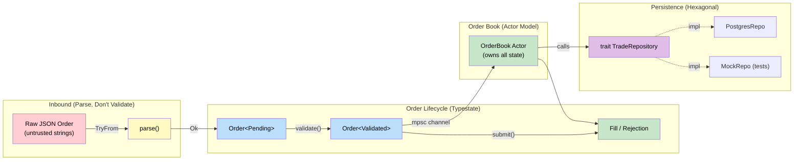
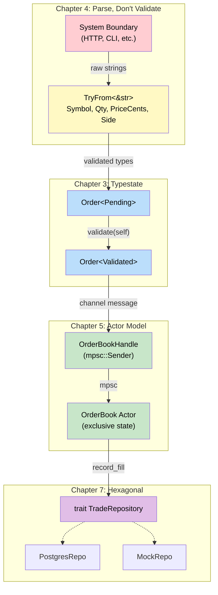

# 8. Capstone Project: The Trading Engine 🔴

> **What you'll learn:**
> - How to integrate **every pattern** from this book into a single, modular, high-throughput system
> - **Parse, Don't Validate** (Ch 4) for incoming order requests
> - **Typestate Pattern** (Ch 3) for order lifecycle: `Pending → Validated → Matched`
> - **Actor Model** (Ch 5) for the Order Book — mutated via channels, deadlock-free
> - **Hexagonal Architecture** (Ch 7) for dependency injection and pure unit testing of matching logic

## Architecture Overview

We're building a simplified **order-matching engine** — the core of any stock exchange or crypto trading platform. Orders arrive over a channel, get parsed and validated, transition through states, and are matched against a price-time priority order book.



## Step 1: Domain Types — Parse, Don't Validate

Every value entering our system is validated exactly once, at the boundary:

```rust
use std::fmt;

// ── Validated Domain Types ──────────────────────────────────────

/// A stock ticker: 1–5 uppercase ASCII letters.
#[derive(Debug, Clone, PartialEq, Eq, Hash)]
pub struct Symbol(String);

/// A positive, non-zero quantity of shares.
#[derive(Debug, Clone, Copy, PartialEq, Eq, PartialOrd, Ord)]
pub struct Qty(u64);

/// A positive price in cents (integer to avoid floating-point issues).
#[derive(Debug, Clone, Copy, PartialEq, Eq, PartialOrd, Ord)]
pub struct PriceCents(u64);

#[derive(Debug, Clone, Copy, PartialEq, Eq)]
pub enum Side {
    Buy,
    Sell,
}

// ── Validation Errors ───────────────────────────────────────────

#[derive(Debug)]
pub enum ParseError {
    InvalidSymbol(String),
    InvalidQty(String),
    InvalidPrice(String),
    InvalidSide(String),
}

impl fmt::Display for ParseError {
    fn fmt(&self, f: &mut fmt::Formatter<'_>) -> fmt::Result {
        match self {
            ParseError::InvalidSymbol(m) => write!(f, "bad symbol: {m}"),
            ParseError::InvalidQty(m) => write!(f, "bad qty: {m}"),
            ParseError::InvalidPrice(m) => write!(f, "bad price: {m}"),
            ParseError::InvalidSide(m) => write!(f, "bad side: {m}"),
        }
    }
}

// ── TryFrom implementations ─────────────────────────────────────

impl TryFrom<&str> for Symbol {
    type Error = ParseError;
    fn try_from(s: &str) -> Result<Self, Self::Error> {
        if s.is_empty() || s.len() > 5 || !s.chars().all(|c| c.is_ascii_uppercase()) {
            return Err(ParseError::InvalidSymbol(
                format!("must be 1–5 uppercase ASCII, got '{s}'")));
        }
        Ok(Symbol(s.to_string()))
    }
}

impl Symbol {
    pub fn as_str(&self) -> &str { &self.0 }
}

impl TryFrom<u64> for Qty {
    type Error = ParseError;
    fn try_from(n: u64) -> Result<Self, Self::Error> {
        if n == 0 {
            return Err(ParseError::InvalidQty("must be > 0".into()));
        }
        Ok(Qty(n))
    }
}

impl Qty {
    pub fn get(&self) -> u64 { self.0 }
    pub fn checked_sub(&self, other: Qty) -> Option<Qty> {
        self.0.checked_sub(other.0).and_then(|n| if n > 0 { Some(Qty(n)) } else { None })
    }
}

impl TryFrom<u64> for PriceCents {
    type Error = ParseError;
    fn try_from(n: u64) -> Result<Self, Self::Error> {
        if n == 0 {
            return Err(ParseError::InvalidPrice("must be > 0".into()));
        }
        Ok(PriceCents(n))
    }
}

impl PriceCents {
    pub fn get(&self) -> u64 { self.0 }
}

impl TryFrom<&str> for Side {
    type Error = ParseError;
    fn try_from(s: &str) -> Result<Self, Self::Error> {
        match s.to_lowercase().as_str() {
            "buy" => Ok(Side::Buy),
            "sell" => Ok(Side::Sell),
            _ => Err(ParseError::InvalidSide(format!("expected buy/sell, got '{s}'"))),
        }
    }
}

fn main() {
    // Parsing at the boundary:
    let sym = Symbol::try_from("AAPL").unwrap();
    let qty = Qty::try_from(100u64).unwrap();
    let price = PriceCents::try_from(15050u64).unwrap();
    let side = Side::try_from("buy").unwrap();
    
    // ❌ Invalid input rejected immediately:
    assert!(Symbol::try_from("invalid!").is_err());
    assert!(Qty::try_from(0u64).is_err());
    assert!(PriceCents::try_from(0u64).is_err());
    assert!(Side::try_from("maybe").is_err());
    
    println!("Parsed: {:?} {:?} {} @ {}¢", side, sym, qty.get(), price.get());
}
```

## Step 2: Order Typestate — Compile-Time Lifecycle

Orders transition through states. The type system prevents submitting un-validated orders:

```rust
use std::marker::PhantomData;
# #[derive(Debug, Clone, PartialEq, Eq, Hash)] pub struct Symbol(String);
# impl Symbol { pub fn as_str(&self) -> &str { &self.0 } }
# #[derive(Debug, Clone, Copy, PartialEq, Eq, PartialOrd, Ord)] pub struct Qty(u64);
# impl Qty { pub fn get(&self) -> u64 { self.0 } }
# #[derive(Debug, Clone, Copy, PartialEq, Eq, PartialOrd, Ord)] pub struct PriceCents(u64);
# impl PriceCents { pub fn get(&self) -> u64 { self.0 } }
# #[derive(Debug, Clone, Copy, PartialEq, Eq)] pub enum Side { Buy, Sell }

// ── Typestate markers ───────────────────────────────────────────

/// Order has been parsed but not validated against business rules.
pub struct Pending;
/// Order has passed validation and is ready for the matching engine.
pub struct Validated;

// ── Order ID ────────────────────────────────────────────────────

#[derive(Debug, Clone, Copy, PartialEq, Eq, Hash)]
pub struct OrderId(u64);

// ── The Order struct, generic over state ────────────────────────

#[derive(Debug, Clone)]
pub struct Order<State> {
    pub id: OrderId,
    pub symbol: Symbol,
    pub side: Side,
    pub qty: Qty,
    pub price: PriceCents,
    _state: PhantomData<State>,
}

impl Order<Pending> {
    /// Create a new pending order from validated domain types.
    pub fn new(id: OrderId, symbol: Symbol, side: Side, qty: Qty, price: PriceCents) -> Self {
        Order { id, symbol, side, qty, price, _state: PhantomData }
    }

    /// Validate against business rules. Consumes the Pending order.
    pub fn validate(self, max_price: PriceCents, max_qty: Qty) -> Result<Order<Validated>, String> {
        if self.price > max_price {
            return Err(format!(
                "Price {} exceeds max {}", self.price.get(), max_price.get()
            ));
        }
        if self.qty > max_qty {
            return Err(format!(
                "Qty {} exceeds max {}", self.qty.get(), max_qty.get()
            ));
        }
        Ok(Order {
            id: self.id,
            symbol: self.symbol,
            side: self.side,
            qty: self.qty,
            price: self.price,
            _state: PhantomData,
        })
    }
}

// Only validated orders have these methods:
impl Order<Validated> {
    pub fn is_buy(&self) -> bool { self.side == Side::Buy }
    pub fn is_sell(&self) -> bool { self.side == Side::Sell }
}

fn main() {
    let pending = Order::<Pending>::new(
        OrderId(1),
        Symbol("MSFT".to_string()),
        Side::Buy,
        Qty(100),
        PriceCents(35000),
    );

    let max_price = PriceCents(100_000);
    let max_qty = Qty(10_000);
    
    // ✅ Transition: Pending → Validated
    let validated = pending.validate(max_price, max_qty).unwrap();
    println!("Validated order: {:?} {:?} {} @ {}¢",
        validated.side, validated.symbol, validated.qty.get(), validated.price.get());

    // ❌ Can't access Validated-only methods on a Pending order:
    // let pending2 = Order::<Pending>::new(...);
    // pending2.is_buy(); // ERROR: no method `is_buy` found for `Order<Pending>`
}
```

## Step 3: The Matching Engine — Pure Domain Logic

The matching engine is a pure function with no I/O — it takes an order and a book side, and produces fills:

```rust
# #[derive(Debug, Clone, PartialEq, Eq, Hash)] pub struct Symbol(String);
# #[derive(Debug, Clone, Copy, PartialEq, Eq, PartialOrd, Ord)] pub struct Qty(pub u64);
# impl Qty { pub fn get(&self) -> u64 { self.0 } }
# #[derive(Debug, Clone, Copy, PartialEq, Eq, PartialOrd, Ord)] pub struct PriceCents(pub u64);
# impl PriceCents { pub fn get(&self) -> u64 { self.0 } }
# #[derive(Debug, Clone, Copy, PartialEq, Eq)] pub enum Side { Buy, Sell }
# #[derive(Debug, Clone, Copy, PartialEq, Eq, Hash)] pub struct OrderId(pub u64);
# use std::marker::PhantomData;
# pub struct Validated;
# #[derive(Debug, Clone)] pub struct Order<S> { pub id: OrderId, pub symbol: Symbol, pub side: Side, pub qty: Qty, pub price: PriceCents, _state: PhantomData<S> }

use std::collections::BTreeMap;

/// A fill represents a matched trade between two orders.
#[derive(Debug, Clone)]
pub struct Fill {
    pub buy_order_id: OrderId,
    pub sell_order_id: OrderId,
    pub qty: Qty,
    pub price: PriceCents,
}

/// A resting order in the book (already validated).
#[derive(Debug, Clone)]
struct BookEntry {
    id: OrderId,
    remaining_qty: u64,
    price: PriceCents,
}

/// One side of the order book (buy or sell).
/// BTreeMap<PriceCents, Vec<BookEntry>> — sorted by price.
struct BookSide {
    /// For buys: highest price first (best bid).
    /// For sells: lowest price first (best ask).
    levels: BTreeMap<u64, Vec<BookEntry>>,
    is_buy_side: bool,
}

impl BookSide {
    fn new(is_buy_side: bool) -> Self {
        BookSide { levels: BTreeMap::new(), is_buy_side }
    }

    /// Insert a resting order at its price level.
    fn insert(&mut self, entry: BookEntry) {
        self.levels
            .entry(entry.price.get())
            .or_default()
            .push(entry);
    }

    /// Get price levels in matching order (best first).
    fn best_prices(&self) -> Vec<u64> {
        if self.is_buy_side {
            // Buys: highest price first
            self.levels.keys().rev().copied().collect()
        } else {
            // Sells: lowest price first
            self.levels.keys().copied().collect()
        }
    }
}

/// The order book for a single symbol.
pub struct OrderBook {
    pub symbol: Symbol,
    bids: BookSide,  // Buy orders (highest price = best bid)
    asks: BookSide,  // Sell orders (lowest price = best ask)
}

impl OrderBook {
    pub fn new(symbol: Symbol) -> Self {
        OrderBook {
            symbol,
            bids: BookSide::new(true),
            asks: BookSide::new(false),
        }
    }

    /// Submit a validated order and attempt to match it.
    /// Returns fills for each match and a flag indicating if the order rests.
    pub fn submit(&mut self, order: &Order<Validated>) -> Vec<Fill> {
        let mut fills = Vec::new();
        let mut remaining = order.qty.get();

        // Match against the opposite side
        let opposite = if order.side == Side::Buy { &mut self.asks } else { &mut self.bids };

        let matchable_prices = opposite.best_prices();

        for price_level in matchable_prices {
            if remaining == 0 { break; }

            // Check if the price crosses
            let crosses = match order.side {
                Side::Buy => price_level <= order.price.get(),   // Buy at or below ask
                Side::Sell => price_level >= order.price.get(),  // Sell at or above bid
            };

            if !crosses { break; }

            if let Some(entries) = opposite.levels.get_mut(&price_level) {
                let mut i = 0;
                while i < entries.len() && remaining > 0 {
                    let fill_qty = remaining.min(entries[i].remaining_qty);
                    
                    let (buy_id, sell_id) = if order.side == Side::Buy {
                        (order.id, entries[i].id)
                    } else {
                        (entries[i].id, order.id)
                    };

                    fills.push(Fill {
                        buy_order_id: buy_id,
                        sell_order_id: sell_id,
                        qty: Qty(fill_qty),
                        price: PriceCents(price_level),
                    });

                    remaining -= fill_qty;
                    entries[i].remaining_qty -= fill_qty;

                    if entries[i].remaining_qty == 0 {
                        entries.remove(i); // Fully filled — remove from book
                    } else {
                        i += 1;
                    }
                }
            }

            // Clean up empty price levels
            if opposite.levels.get(&price_level).map_or(false, |e| e.is_empty()) {
                opposite.levels.remove(&price_level);
            }
        }

        // If the order has remaining quantity, rest it in the book
        if remaining > 0 {
            let book_side = if order.side == Side::Buy { &mut self.bids } else { &mut self.asks };
            book_side.insert(BookEntry {
                id: order.id,
                remaining_qty: remaining,
                price: order.price,
            });
        }

        fills
    }
}

fn main() {
    let mut book = OrderBook::new(Symbol("AAPL".into()));

    // Sell order rests in the book (no matching buy orders)
    let sell = Order {
        id: OrderId(1), symbol: Symbol("AAPL".into()),
        side: Side::Sell, qty: Qty(100), price: PriceCents(15000),
        _state: PhantomData,
    };
    let fills = book.submit(&sell);
    assert!(fills.is_empty());
    println!("Sell order resting (no match)");

    // Buy order matches the resting sell
    let buy = Order {
        id: OrderId(2), symbol: Symbol("AAPL".into()),
        side: Side::Buy, qty: Qty(60), price: PriceCents(15000),
        _state: PhantomData,
    };
    let fills = book.submit(&buy);
    assert_eq!(fills.len(), 1);
    assert_eq!(fills[0].qty.get(), 60);
    println!("Matched: {} shares @ {}¢", fills[0].qty.get(), fills[0].price.get());

    // Another buy takes the remaining 40
    let buy2 = Order {
        id: OrderId(3), symbol: Symbol("AAPL".into()),
        side: Side::Buy, qty: Qty(50), price: PriceCents(15000),
        _state: PhantomData,
    };
    let fills = book.submit(&buy2);
    assert_eq!(fills[0].qty.get(), 40); // Only 40 remaining from the sell
    println!("Matched: {} shares (10 left resting as buy)", fills[0].qty.get());
}
```

## Step 4: The Order Book Actor — Concurrency via Channels

The `OrderBook` is wrapped in an actor so multiple async tasks can submit orders concurrently without locks:

```rust,ignore
use tokio::sync::{mpsc, oneshot};

/// Messages the actor handles.
enum OrderBookMessage {
    Submit {
        order: Order<Validated>,
        reply: oneshot::Sender<Vec<Fill>>,
    },
    GetSpread {
        reply: oneshot::Sender<Option<(PriceCents, PriceCents)>>,
    },
    Shutdown,
}

/// Actor that exclusively owns the OrderBook state.
struct OrderBookActor {
    book: OrderBook,
    receiver: mpsc::Receiver<OrderBookMessage>,
    trade_repo: Box<dyn TradeRepository + Send>,
}

impl OrderBookActor {
    async fn run(mut self) {
        while let Some(msg) = self.receiver.recv().await {
            match msg {
                OrderBookMessage::Submit { order, reply } => {
                    let fills = self.book.submit(&order);
                    
                    // Persist fills via the injected repository (Hexagonal!)
                    for fill in &fills {
                        if let Err(e) = self.trade_repo.record_fill(fill) {
                            eprintln!("Failed to persist fill: {e}");
                        }
                    }
                    
                    let _ = reply.send(fills);
                }
                OrderBookMessage::GetSpread { reply } => {
                    // Best bid / best ask
                    let spread = self.book.spread();
                    let _ = reply.send(spread);
                }
                OrderBookMessage::Shutdown => break,
            }
        }
    }
}

/// Client handle (cloneable, Send).
#[derive(Clone)]
pub struct OrderBookHandle {
    sender: mpsc::Sender<OrderBookMessage>,
}

impl OrderBookHandle {
    pub fn new(
        symbol: Symbol,
        trade_repo: Box<dyn TradeRepository + Send>,
        buffer: usize,
    ) -> Self {
        let (tx, rx) = mpsc::channel(buffer);
        let actor = OrderBookActor {
            book: OrderBook::new(symbol),
            receiver: rx,
            trade_repo,
        };
        tokio::spawn(actor.run());
        OrderBookHandle { sender: tx }
    }

    pub async fn submit(&self, order: Order<Validated>) -> Option<Vec<Fill>> {
        let (reply_tx, reply_rx) = oneshot::channel();
        self.sender
            .send(OrderBookMessage::Submit { order, reply: reply_tx })
            .await
            .ok()?;
        reply_rx.await.ok()
    }

    pub async fn shutdown(&self) {
        let _ = self.sender.send(OrderBookMessage::Shutdown).await;
    }
}
```

**No `Arc<Mutex<OrderBook>>`.** The actor owns the book exclusively. All access goes through the channel. Concurrent tasks submit orders safely and get fills back via oneshot replies.

## Step 5: Hexagonal Architecture — Testable Persistence

The repository trait decouples matching logic from storage:

```rust,ignore
/// Outbound port: trade persistence
pub trait TradeRepository: Send {
    fn record_fill(&self, fill: &Fill) -> Result<(), String>;
    fn get_fills_for_order(&self, order_id: OrderId) -> Result<Vec<Fill>, String>;
}

// ── Production adapter ──────────────────────────────────────────

struct PostgresTradeRepo {
    // pool: sqlx::PgPool (in production)
}

impl TradeRepository for PostgresTradeRepo {
    fn record_fill(&self, fill: &Fill) -> Result<(), String> {
        // INSERT INTO fills (buy_order_id, sell_order_id, qty, price) VALUES (...)
        println!("💾 Persisted fill to Postgres: {:?}", fill);
        Ok(())
    }
    fn get_fills_for_order(&self, _order_id: OrderId) -> Result<Vec<Fill>, String> {
        Ok(vec![]) // Placeholder
    }
}

// ── Test adapter ────────────────────────────────────────────────

struct MockTradeRepo {
    fills: std::sync::Mutex<Vec<Fill>>,
}

impl MockTradeRepo {
    fn new() -> Self {
        MockTradeRepo { fills: std::sync::Mutex::new(Vec::new()) }
    }
    fn recorded_fills(&self) -> Vec<Fill> {
        self.fills.lock().unwrap().clone()
    }
}

impl TradeRepository for MockTradeRepo {
    fn record_fill(&self, fill: &Fill) -> Result<(), String> {
        self.fills.lock().unwrap().push(fill.clone());
        Ok(())
    }
    fn get_fills_for_order(&self, order_id: OrderId) -> Result<Vec<Fill>, String> {
        let fills = self.fills.lock().unwrap();
        Ok(fills.iter().filter(|f| f.buy_order_id == order_id || f.sell_order_id == order_id).cloned().collect())
    }
}
```

## Putting It All Together

```rust,ignore
#[tokio::main]
async fn main() {
    // ── Wire the system (Hexagonal Architecture) ────────────────
    let trade_repo = Box::new(MockTradeRepo::new());
    let book = OrderBookHandle::new(
        Symbol::try_from("AAPL").unwrap(),
        trade_repo,
        256, // channel buffer size
    );

    // ── Parse incoming orders (Parse, Don't Validate) ───────────
    let raw_orders = vec![
        ("AAPL", "sell", 100u64, 15000u64),
        ("AAPL", "sell", 50,     14900),
        ("AAPL", "buy",  120,    15000),
    ];

    let max_price = PriceCents::try_from(1_000_000u64).unwrap();
    let max_qty = Qty::try_from(100_000u64).unwrap();

    for (i, (sym, side, qty, price)) in raw_orders.into_iter().enumerate() {
        // Step 1: Parse (TryFrom at boundary)
        let symbol = Symbol::try_from(sym).unwrap();
        let side = Side::try_from(side).unwrap();
        let qty = Qty::try_from(qty).unwrap();
        let price = PriceCents::try_from(price).unwrap();

        // Step 2: Create Pending order (Typestate)
        let pending = Order::<Pending>::new(
            OrderId(i as u64), symbol, side, qty, price
        );

        // Step 3: Validate → Typestate transition to Validated
        let validated = pending.validate(max_price, max_qty).unwrap();

        // Step 4: Submit to Actor (message passing)
        if let Some(fills) = book.submit(validated).await {
            for fill in &fills {
                println!(
                    "🔔 Fill: buy={} sell={} qty={} @ {}¢",
                    fill.buy_order_id.0,
                    fill.sell_order_id.0,
                    fill.qty.get(),
                    fill.price.get()
                );
            }
            if fills.is_empty() {
                println!("📋 Order {} resting in book", i);
            }
        }
    }

    // Expected output:
    // 📋 Order 0 resting in book         (sell 100 @ 150.00 — no buyer)
    // 📋 Order 1 resting in book         (sell 50 @ 149.00 — no buyer)
    // 🔔 Fill: buy=2 sell=1 qty=50 @ 14900¢  (buy matches cheaper sell first)
    // 🔔 Fill: buy=2 sell=0 qty=70 @ 15000¢  (remaining 70 matches next level)

    book.shutdown().await;
}
```

## Architecture Summary



| Pattern | Where It's Used | What It Prevents |
|---------|----------------|-----------------|
| **Parse, Don't Validate** | Order ingestion boundary | Invalid data reaching domain logic |
| **Typestate** | `Pending → Validated` transition | Submitting unvalidated orders to the engine |
| **Actor Model** | Order book state management | Deadlocks, lock contention, data races |
| **Hexagonal Architecture** | Trade persistence & notification | Untestable code coupled to databases |

<details>
<summary><strong>🏋️ Exercise: Add Cancel Order Support</strong> (click to expand)</summary>

**Challenge:** Extend the trading engine with order cancellation:

1. Add a `Cancel` message variant to the actor
2. The actor should remove the resting order from the book and return `true`/`false`
3. Add a `cancel` method to `OrderBookHandle`
4. Write a test that:
   - Submits a sell order (it rests because no buyers)
   - Cancels it
   - Submits a buy order and verifies it also rests (no sell to match)

<details>
<summary>🔑 Solution</summary>

```rust,ignore
// ── Add to OrderBookMessage ─────────────────────────────────────
enum OrderBookMessage {
    Submit { order: Order<Validated>, reply: oneshot::Sender<Vec<Fill>> },
    Cancel { order_id: OrderId, reply: oneshot::Sender<bool> },
    Shutdown,
}

// ── Add cancel support to OrderBook ─────────────────────────────
impl OrderBook {
    /// Cancel a resting order. Returns true if found and removed.
    pub fn cancel(&mut self, order_id: OrderId) -> bool {
        // Search both sides of the book
        for side in [&mut self.bids, &mut self.asks] {
            for (_price, entries) in side.levels.iter_mut() {
                if let Some(pos) = entries.iter().position(|e| e.id == order_id) {
                    entries.remove(pos);
                    return true;
                }
            }
            // Clean up empty levels
            side.levels.retain(|_, entries| !entries.is_empty());
        }
        false
    }
}

// ── Add to actor run loop ───────────────────────────────────────
// In OrderBookActor::run():
OrderBookMessage::Cancel { order_id, reply } => {
    let cancelled = self.book.cancel(order_id);
    let _ = reply.send(cancelled);
}

// ── Add to handle ───────────────────────────────────────────────
impl OrderBookHandle {
    pub async fn cancel(&self, order_id: OrderId) -> bool {
        let (reply_tx, reply_rx) = oneshot::channel();
        if self.sender.send(OrderBookMessage::Cancel { order_id, reply: reply_tx }).await.is_err() {
            return false;
        }
        reply_rx.await.unwrap_or(false)
    }
}

// ── Test ─────────────────────────────────────────────────────────
#[tokio::test]
async fn test_cancel_order() {
    let repo = Box::new(MockTradeRepo::new());
    let book = OrderBookHandle::new(Symbol::try_from("TEST").unwrap(), repo, 64);

    // Submit a sell order (rests — no buyers)
    let sell = Order {
        id: OrderId(1), symbol: Symbol("TEST".into()),
        side: Side::Sell, qty: Qty(100), price: PriceCents(10000),
        _state: PhantomData::<Validated>,
    };
    let fills = book.submit(sell).await.unwrap();
    assert!(fills.is_empty(), "sell should rest");

    // Cancel the sell order
    let cancelled = book.cancel(OrderId(1)).await;
    assert!(cancelled, "should find and cancel the order");

    // Now submit a buy — it should also rest (the sell was cancelled)
    let buy = Order {
        id: OrderId(2), symbol: Symbol("TEST".into()),
        side: Side::Buy, qty: Qty(100), price: PriceCents(10000),
        _state: PhantomData::<Validated>,
    };
    let fills = book.submit(buy).await.unwrap();
    assert!(fills.is_empty(), "buy should rest — sell was cancelled");

    // Cancel a non-existent order
    let cancelled = book.cancel(OrderId(999)).await;
    assert!(!cancelled, "should not find order 999");

    book.shutdown().await;
}
```

</details>
</details>

> **Key Takeaways:**
> - This capstone integrates **four architectural patterns** into a single coherent system — each solving a specific problem.
> - **Parse, Don't Validate** ensures no invalid data reaches the matching engine — ever.
> - **Typestate** makes it a **compile error** to submit an unvalidated order — no runtime checks needed in the matching logic.
> - **The Actor Model** gives the order book **exclusive, lock-free ownership** of its state — safe concurrent access through channels.
> - **Hexagonal Architecture** decouples persistence from matching — the engine is testable with mock repos, deployable with Postgres.
> - Together, these patterns create a system that is **correct by construction**: memory safety from ownership, concurrency safety from actors, state safety from types, and testability from trait boundaries.

> **See also:**
> - [Chapter 3: The Typestate Pattern](ch03-the-typestate-pattern.md)
> - [Chapter 4: Parse, Don't Validate](ch04-parse-dont-validate.md)
> - [Chapter 5: The Actor Model](ch05-the-actor-model.md)
> - [Chapter 7: Hexagonal Architecture](ch07-hexagonal-architecture.md)
> - [Async Rust](../async-book/src/SUMMARY.md) — Tokio runtime deep dive
