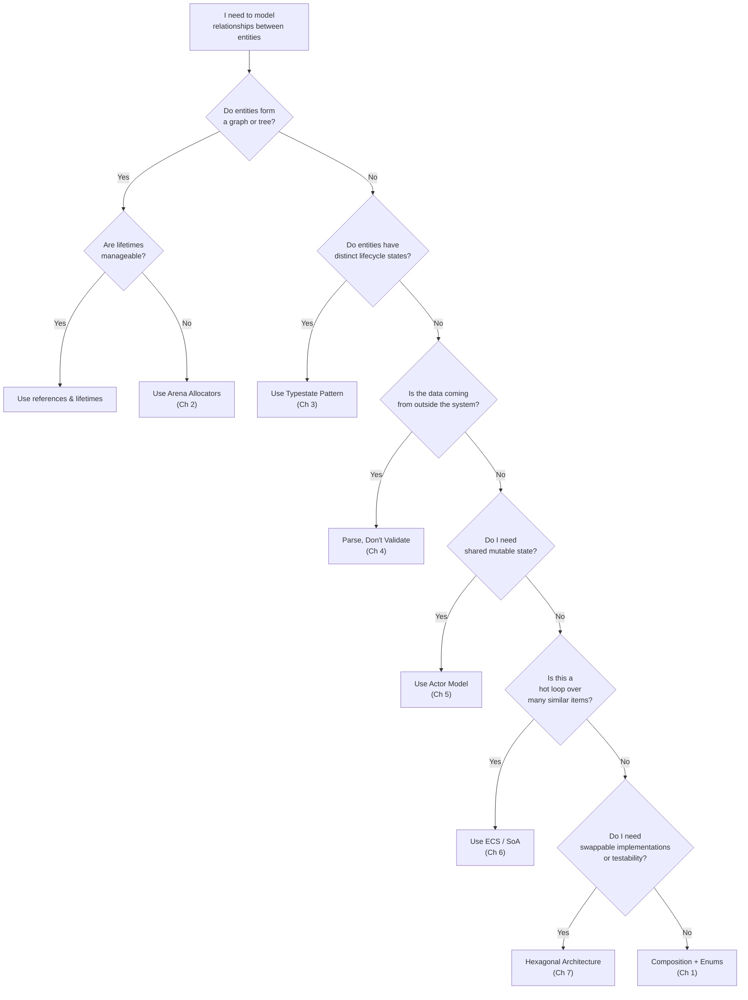

# Appendix A — Summary and Reference Card 📋

> **Quick-reference cheat sheets for every pattern in this guide.**
> Print this appendix or keep it open in a side tab while coding.

---

## Pattern Selection Flowchart

Use this decision tree when starting a new module or refactoring an existing one:



---

## Master Pattern Reference Table

| Pattern | Chapter | Core Idea | Key Types/Traits | When to Use | When to Avoid |
|---------|---------|-----------|-----------------|-------------|---------------|
| **Composition over Inheritance** | 1 | Replace class hierarchies with enums + trait objects | `enum`, `dyn Trait`, struct embedding | Modeling variants, shared behavior | When you need open extension (use traits) |
| **Arena Allocators** | 2 | Store nodes in a `Vec`, reference by index | `Vec<T>`, `usize`, `SlotMap` | Trees, graphs, self-referential data | Simple parent-child with clear lifetimes |
| **Generational Indices** | 2 | Add a generation counter to detect stale handles | `Arena<T>`, `Index { idx, gen }` | Long-lived arenas with removal | Short-lived, append-only collections |
| **Typestate** | 3 | Encode state machine in the type system | ZSTs, `PhantomData<S>`, consuming `self` | Builders, protocols, lifecycles | > 5 states (use sealed trait variant) |
| **Parse, Don't Validate** | 4 | Reject invalid data at the boundary, carry proof in types | `TryFrom`, newtypes, `NonZeroU32` | Domain boundaries, API inputs | Internal helper functions |
| **Actor Model** | 5 | Own state behind a channel, communicate via messages | `mpsc`, `oneshot`, `Handle` | Shared mutable state, concurrent services | CPU-bound tight loops |
| **ECS / SoA** | 6 | Separate identity from data; process by component | `Vec<Option<T>>`, `query()` | Game loops, simulations, batch processing | CRUD apps, web services |
| **Hexagonal Architecture** | 7 | Domain logic depends on traits, not implementations | Generic service `<R: Repo>`, trait ports | Large apps, team boundaries, testability | Scripts, CLI tools, prototypes |

---

## Ownership & Reference Strategy Guide

Choose the right indirection for your use case:

| Strategy | Syntax | Shared? | Mutable? | Thread-safe? | Overhead | Best For |
|----------|--------|---------|----------|-------------|----------|----------|
| Owned value | `T` | No | Yes | N/A | Zero | Local data, small structs |
| Immutable borrow | `&T` | Yes | No | Yes | Zero | Read-only access |
| Mutable borrow | `&mut T` | No | Yes | Yes | Zero | Exclusive mutation |
| Index into `Vec` | `usize` | Copy | Via `&mut vec` | Via `Mutex<Vec>` | Zero | Arenas, trees, graphs |
| Generational index | `Index` | Copy | Via `&mut arena` | Via `Mutex<Arena>` | 8 bytes | Long-lived arenas |
| `Box<T>` | `Box<T>` | No | Yes | N/A | Heap alloc | Recursive types, large values |
| `Rc<T>` | `Rc<T>` | Yes | No | **No** | Ref count | Single-thread DAGs |
| `Arc<T>` | `Arc<T>` | Yes | No | Yes | Atomic ref count | Cross-thread sharing |
| `Arc<Mutex<T>>` | `Arc<Mutex<T>>` | Yes | Yes | Yes | Lock + atomic | Last resort shared mutation |
| Actor handle | `Handle` (mpsc) | Clone | Via messages | Yes | Channel + task | Stateful concurrent services |

---

## Typestate Quick Reference

```text
┌─────────────────────────────────────────────────────┐
│  Zero-Sized Type (ZST) states:                      │
│                                                     │
│    struct Pending;                                   │
│    struct Validated;                                 │
│    struct Submitted;                                 │
│                                                     │
│  Generic wrapper:                                    │
│                                                     │
│    struct Order<S> {                                 │
│        data: OrderData,                              │
│        _state: PhantomData<S>,                       │
│    }                                                 │
│                                                     │
│  Transitions consume self → return new state:        │
│                                                     │
│    impl Order<Pending> {                             │
│        fn validate(self) -> Result<Order<Validated>> │
│    }                                                 │
│    impl Order<Validated> {                            │
│        fn submit(self) -> Order<Submitted>           │
│    }                                                 │
│                                                     │
│  Rules:                                              │
│    ✓ Only valid transitions compile                  │
│    ✓ PhantomData<S> is zero-cost at runtime          │
│    ✓ Each state gets its own impl block              │
│    ✗ Cannot call .submit() on Order<Pending>         │
└─────────────────────────────────────────────────────┘
```

---

## Newtype / Parse-Don't-Validate Checklist

Use this checklist whenever you introduce a new domain type:

- [ ] **Create the newtype**: `struct Email(String);`
- [ ] **Make the inner field private**: no `pub` on the tuple field
- [ ] **Implement `TryFrom`**: validate in `try_from`, return a descriptive error
- [ ] **No public constructor**: force all creation through `TryFrom` / `new`
- [ ] **Implement `AsRef<str>`** (or `Deref`): allow read-only access to the inner value
- [ ] **Derive what makes sense**: `Debug`, `Clone`, `PartialEq`, `Eq`, `Hash`
- [ ] **Test the boundary**: unit tests for valid inputs, invalid inputs, and edge cases
- [ ] **Use the newtype everywhere downstream**: never pass raw `String` after parsing

---

## Actor Pattern Template

Copy-paste starter for a new actor:

```rust,editable
use tokio::sync::{mpsc, oneshot};

// 1. Define the message enum
enum Msg {
    DoSomething {
        input: String,
        reply: oneshot::Sender<Result<String, String>>,
    },
    Shutdown,
}

// 2. Define the handle (public API)
#[derive(Clone)]
struct MyActorHandle {
    tx: mpsc::Sender<Msg>,
}

impl MyActorHandle {
    fn new() -> Self {
        let (tx, rx) = mpsc::channel(64);
        tokio::spawn(run_actor(rx));
        Self { tx }
    }

    async fn do_something(&self, input: String) -> Result<String, String> {
        let (reply, rx) = oneshot::channel();
        self.tx
            .send(Msg::DoSomething { input, reply })
            .await
            .map_err(|_| "actor gone".to_string())?;
        rx.await.map_err(|_| "actor dropped".to_string())?
    }

    async fn shutdown(&self) {
        let _ = self.tx.send(Msg::Shutdown).await;
    }
}

// 3. The actor loop (private)
async fn run_actor(mut rx: mpsc::Receiver<Msg>) {
    let mut state = Vec::new(); // ← your private state

    while let Some(msg) = rx.recv().await {
        match msg {
            Msg::DoSomething { input, reply } => {
                state.push(input.clone());
                let _ = reply.send(Ok(format!("processed: {}", input)));
            }
            Msg::Shutdown => break,
        }
    }
}
```

---

## Hexagonal Architecture Module Layout

```text
my_crate/
├── src/
│   ├── domain/           # Pure business logic — no I/O
│   │   ├── mod.rs
│   │   ├── types.rs      # Newtypes, enums, domain errors
│   │   └── service.rs    # Generic service:  impl<R: Repo, N: Notifier> Service<R, N>
│   │
│   ├── ports/            # Trait definitions (interfaces)
│   │   ├── mod.rs
│   │   ├── repository.rs # trait OrderRepo { async fn save(...) }
│   │   └── notifier.rs   # trait Notifier  { async fn notify(...) }
│   │
│   ├── adapters/         # Concrete implementations
│   │   ├── mod.rs
│   │   ├── postgres.rs   # impl OrderRepo for PgRepo { ... }
│   │   ├── redis.rs      # impl OrderRepo for RedisRepo { ... }
│   │   └── email.rs      # impl Notifier for EmailNotifier { ... }
│   │
│   ├── main.rs           # Wiring: construct adapters → inject into service → run
│   └── lib.rs
│
└── tests/
    └── integration.rs    # Uses MockRepo, MockNotifier from domain/service tests
```

**Key Rule**: `domain/` and `ports/` have **zero** dependencies on `adapters/`.
Dependency arrows always point **inward**.

---

## Generics vs `dyn Trait` Decision Table

| Criterion | Generics (`impl<R: Repo>`) | `dyn Trait` (`Box<dyn Repo>`) |
|-----------|---------------------------|-------------------------------|
| **Performance** | Monomorphized, zero-cost | vtable indirection |
| **Binary size** | Larger (one copy per type) | Smaller (single code path) |
| **Compile time** | Slower (more codegen) | Faster |
| **Flexibility** | Fixed at compile time | Swappable at runtime |
| **Object safety** | Not required | Required (no `Self`, no generics in methods) |
| **Testing** | ✅ Easy mock injection | ✅ Easy mock injection |
| **Recommend** | Libraries, hot paths | Plugin systems, config-driven DI |

---

## Common Anti-Patterns → Fixes

| Anti-Pattern | Problem | Fix | Chapter |
|-------------|---------|-----|---------|
| Deep inheritance hierarchies | Doesn't exist in Rust | Enums + composition | 1 |
| `Rc<RefCell<T>>` everywhere | Runtime panics, no thread safety | Arena allocators | 1, 2 |
| Stringly-typed APIs | `fn send(to: String, from: String)` — easy to swap | Newtypes: `fn send(to: Email, from: Email)` | 4 |
| `Arc<Mutex<T>>` for shared state | Deadlock risk, contention | Actor model | 5 |
| Array of Structs in hot loops | Cache misses | Struct of Arrays / ECS | 6 |
| `impl Service { db: PgPool }` | Untestable, coupled to Postgres | `impl<R: Repo> Service<R>` | 7 |
| Boolean state flags | `if is_connected && !is_authenticated` | Typestate pattern | 3 |
| Validating everywhere | Defensive checks scattered in every function | Parse at the boundary once | 4 |

---

## Cargo Dependency Cheat Sheet

Crates referenced in this guide:

| Crate | Version | Used In | Purpose |
|-------|---------|---------|---------|
| `slotmap` | 1.x | Ch 2 | Generational-index arena |
| `typed-builder` | 0.18+ | Ch 3 | Derive macro for builder pattern |
| `thiserror` | 1.x | Ch 4 | Ergonomic error types |
| `tokio` | 1.x | Ch 5, 8 | Async runtime, channels |
| `bevy_ecs` | 0.13+ | Ch 6 | Production ECS framework |
| `tracing` | 0.1 | Ch 5, 7, 8 | Structured logging |
| `serde` | 1.x | Ch 4, 7 | Serialization for domain types |

---

## Key Takeaways — The Whole Book in Ten Lines

1. **Rust is not OOP** — stop translating Java/C# patterns; start with enums, traits, and composition.
2. **Use indices, not pointers** — `Vec<T>` + `usize` handles replace object graphs without lifetime pain.
3. **Encode invariants in types** — if the compiler can check it, don't check it at runtime.
4. **Parse at the boundary, trust downstream** — newtypes carry proof that data is valid.
5. **Message-pass, don't lock** — actors own their state; the handle is just a channel sender.
6. **Think in data, not objects** — SoA and ECS let the hardware do what it does best.
7. **Depend on traits, not types** — hexagonal architecture makes large codebases testable and modular.
8. **Combine patterns freely** — typestate + newtypes + actors + hex ports = the capstone approach.
9. **`PhantomData` and ZSTs are free** — zero-cost abstractions are Rust's superpower; use them.
10. **When in doubt, keep it simple** — the right pattern is the *simplest* one that enforces your invariants.

---

## See Also

| Resource | Link |
|----------|------|
| *Rust API Guidelines* | [rust-lang.github.io/api-guidelines](https://rust-lang.github.io/api-guidelines) |
| *Rust Design Patterns* (unofficial book) | [rust-unofficial.github.io/patterns](https://rust-unofficial.github.io/patterns/) |
| *Data-Oriented Design* (Richard Fabian) | [dataorienteddesign.com](https://dataorienteddesign.com/dodbook/) |
| *Hexagonal Architecture* (Alistair Cockburn) | [alistair.cockburn.us/hexagonal-architecture](https://alistair.cockburn.us/hexagonal-architecture/) |
| Companion: **Async Rust** guide | [async-book](../async-book/src/SUMMARY.md) |
| Companion: **Rust Patterns** guide | [rust-patterns-book](../rust-patterns-book/src/SUMMARY.md) |
| Companion: **Type System & Traits** guide | [type-system-traits-book](../type-system-traits-book/src/SUMMARY.md) |
