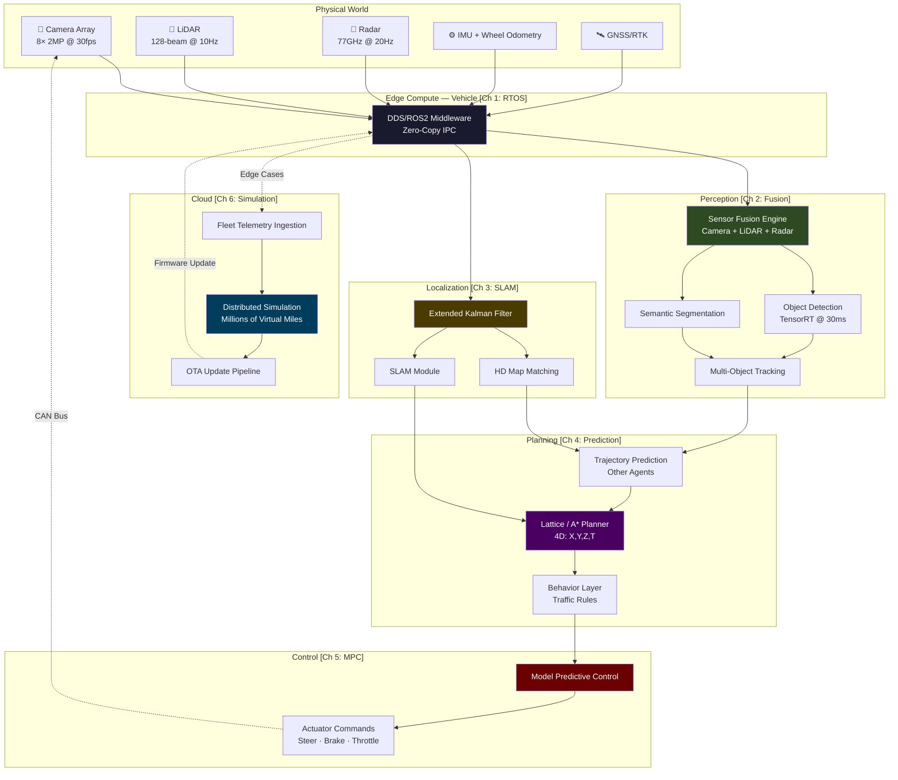

# System Design: The Autonomous Vehicle Software Brain

## Speaker Intro

I'm a Principal Autonomous Vehicle Architect with over a decade of experience building production self-driving stacks — from early research prototypes to vehicles operating on public roads without a safety driver. My career spans perception engines processing petabytes of LiDAR data, real-time control systems where a missed deadline means a fatality, and cloud simulation platforms that replay millions of virtual miles before a single byte of firmware ships Over-The-Air.

This handbook distills the architecture that keeps autonomous vehicles alive.

---

## Who This Is For

- **Systems engineers** who build safety-critical, real-time software and want to understand the full AV stack end-to-end.
- **Rust/C++ developers** working on embedded or high-performance systems who want to see how deterministic latency is achieved in production.
- **ML/AI engineers** who design perception models and need to understand how their 200ms training inference must become a 30ms edge deployment.
- **Cloud/platform engineers** building the data pipelines and simulation infrastructure that validate autonomous driving at fleet scale.
- **Technical leaders and architects** evaluating or designing autonomous vehicle programs and need a single, rigorous reference.
- **Anyone** who has ever asked: *"How does a self-driving car actually work — all of it, from photon to steering wheel?"*

---

## Prerequisites

| Concept | Where to Learn |
|---|---|
| Systems programming (Rust or C++) | [Rust Training core books](../README.md) |
| Basic linear algebra (matrices, transforms) | 3Blue1Brown *Essence of Linear Algebra* |
| Probability & statistics (Bayes' theorem, Gaussian distributions) | Khan Academy or *Probabilistic Robotics* by Thrun et al. |
| Networking fundamentals (pub/sub, UDP, serialization) | [Distributed Systems Book](../distributed-systems-book/src/SUMMARY.md) |
| Basic control theory (PID concept) | Any introductory controls textbook |
| Familiarity with GPU computing concepts (CUDA, kernels) | NVIDIA CUDA Programming Guide |

---

## How to Use This Book

| Emoji | Meaning | What to Expect |
|-------|---------|----------------|
| 🟢 | **Architecture** | System topology, middleware, data-flow design |
| 🟡 | **Algorithms / AI** | Neural networks, sensor fusion math, probabilistic models |
| 🔴 | **Real-Time Hardware / Safety** | RTOS constraints, control theory, ASIL-D compliance, failure modes that kill people |

Every chapter follows the same structure:

1. **The Problem** — the specific failure mode or bottleneck we must solve.
2. **Architecture & Theory** — the math, the diagrams, the trade-offs.
3. **Naive vs. Production Code** — side-by-side examples showing why shortcuts are fatal.
4. **Key Takeaways** — the non-negotiable architectural decisions.

Read linearly for the full picture, or jump to any chapter — each is self-contained with full context.

---

## Pacing Guide

| Chapter | Topic | Time | Checkpoint |
|---------|-------|------|------------|
| 0 | Introduction & Overview | 1 hour | Understand the full AV software stack at 10,000 feet |
| 1 | RTOS and Middleware | 4–6 hours | Can design a deterministic ROS2/DDS node graph |
| 2 | Sensor Fusion & Perception | 6–8 hours | Can architect a camera+LiDAR+radar fusion pipeline |
| 3 | Localization & SLAM | 6–8 hours | Can implement EKF-based localization with HD map matching |
| 4 | Prediction & Path Planning | 6–8 hours | Can design a lattice planner with trajectory prediction |
| 5 | Control Theory (Actuation) | 4–6 hours | Can implement MPC for steering and braking |
| 6 | Cloud & Simulation | 4–6 hours | Can architect fleet telemetry ingestion and simulation-at-scale |
| **Total** | | **31–43 hours** | **Full-stack AV software architect** |

---

## The Autonomous Vehicle Software Stack

Before we dive into individual chapters, here is the complete system we are building:

### The Latency Budget — Where Lives Are Won or Lost

The entire pipeline — from photon hitting a camera sensor to brake caliper applying pressure — must complete in under **150 milliseconds**. Here is how the budget is allocated:

| Stage | Budget | Consequence of Overrun |
|-------|--------|----------------------|
| Sensor capture + DDS transport | 10 ms | Stale data enters pipeline |
| Perception (detection + tracking) | 30 ms | Ghost objects or missed pedestrians |
| Localization | 10 ms | Vehicle doesn't know where it is |
| Prediction | 15 ms | Wrong model of other agents' intent |
| Path Planning | 25 ms | No valid trajectory generated |
| Control (MPC solve) | 10 ms | Actuator commands not sent in time |
| Actuator response | 50 ms | Physical system lag (brake hydraulics) |
| **Total** | **≤ 150 ms** | **Someone dies** |

Every chapter in this book is about defending one row of this table.

---

## Companion Guides

This book builds on and references several other books in the Rust Training series:

- [System Design Book](../system-design-book/src/SUMMARY.md) — Distributed systems design patterns
- [Async Book](../async-book/src/SUMMARY.md) — Async Rust fundamentals
- [Embedded Book](../embedded-book/src/SUMMARY.md) — Bare-metal and embedded Rust
- [Hardware Sympathy Book](../hardware-sympathy-book/src/SUMMARY.md) — CPU caches, memory models, SIMD
- [Concurrency Book](../concurrency-book/src/SUMMARY.md) — Lock-free data structures, threading models
- [Cloud Native Book](../cloud-native-book/src/SUMMARY.md) — Kubernetes, observability, cloud architecture

---

> *"The car doesn't care about your elegant abstractions. It cares about 150 milliseconds. Miss that deadline, and the abstraction that fails is the one between life and death."*

Let's begin.
