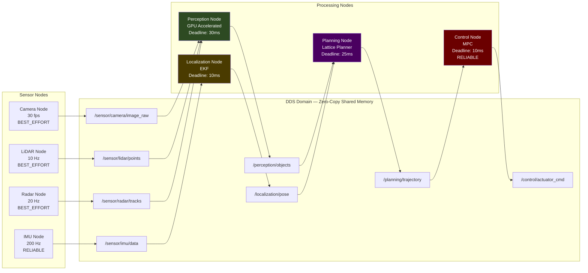
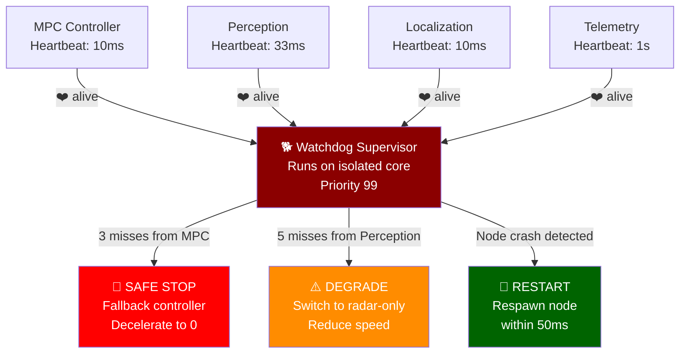

# 1. The Real-Time Operating System (RTOS) and Middleware 🟢

> **The Problem:** A standard Linux kernel uses a Completely Fair Scheduler (CFS) that can preempt your safety-critical braking thread for 10–50ms to run a log rotation daemon. In an autonomous vehicle traveling at 60 mph (≈27 m/s), a 50ms scheduling delay means the car travels **1.35 meters blind**. CFS does not understand that a missed brake command kills a pedestrian while a delayed Spotify buffer merely stutters. Standard Linux will get someone killed.

---

## 1.1 Why General-Purpose Operating Systems Fail

Every operating system makes a fundamental contract with its processes about scheduling fairness. Desktop and server operating systems optimize for **throughput** — maximize total work completed across all processes. Real-time systems optimize for **determinism** — guarantee that the highest-priority task always runs within a bounded, provable time window.

| Property | General-Purpose Linux | RT-Linux (PREEMPT_RT) | QNX Neutrino |
|----------|----------------------|----------------------|--------------|
| Scheduler | CFS (fairness-optimized) | SCHED_FIFO / SCHED_RR (priority-based) | Adaptive partitioning + priority |
| Worst-case latency | 1–50 ms (unbounded) | 10–100 μs (bounded) | 5–50 μs (bounded, certified) |
| Kernel preemption | Voluntary preemption points | Full kernel preemption | Fully preemptible microkernel |
| Safety certification | None | Achievable with hardening | ASIL-D (ISO 26262) pre-certified |
| Memory protection | Process-level | Process-level | Per-thread, per-partition |
| Cost | Free | Free (patch) | Commercial license |
| Used by | Simulation, infotainment | Waymo, Apollo (Baidu) | BlackBerry QNX (most OEMs) |

### The Scheduling Inversion Problem

The most dangerous failure mode in a non-real-time OS is **priority inversion**: a low-priority task holds a lock that a high-priority task needs, and a medium-priority task preempts the low-priority task — causing the high-priority task to wait indefinitely.

```
// 💥 FATAL SCENARIO: Priority Inversion on standard Linux

Timeline:
  t=0ms   [LOW  priority] Log-writer acquires mutex on shared sensor buffer
  t=1ms   [HIGH priority] Brake controller wakes up, needs sensor buffer — BLOCKS on mutex
  t=2ms   [MED  priority] Map tile decoder wakes up, preempts log-writer
  t=3ms   ...map decoder runs for 12ms...
  t=15ms  [MED  priority] Map decoder finishes
  t=15ms  [LOW  priority] Log-writer finally resumes and releases mutex
  t=15ms  [HIGH priority] Brake controller finally gets sensor data

  ⚠️  Brake controller was starved for 14ms by a MAP TILE DECODER.
  ⚠️  At 27 m/s, the car traveled 0.38m without braking.
```

### The RTOS Solution: Priority Inheritance

Real-time operating systems solve this with **priority inheritance protocols**:

```
// ✅ FIX: Priority Inheritance on QNX / RT-Linux

Timeline:
  t=0ms    [LOW  priority] Log-writer acquires mutex on shared sensor buffer
  t=1ms    [HIGH priority] Brake controller wakes up, needs sensor buffer
             → OS IMMEDIATELY boosts log-writer to HIGH priority
  t=1.01ms [LOW→HIGH] Log-writer runs at HIGH priority, finishes critical section
  t=1.05ms [LOW→HIGH] Log-writer releases mutex, drops back to LOW priority
  t=1.06ms [HIGH priority] Brake controller acquires mutex — runs immediately

  ✅ Brake controller waited only 0.06ms, not 14ms.
  ✅ Map decoder never got a chance to interfere.
```

---

## 1.2 Choosing Your RTOS: RT-Linux vs. QNX

### RT-Linux (PREEMPT_RT Patch)

The PREEMPT_RT patch transforms the Linux kernel into a real-time kernel by:

1. Making all kernel spinlocks preemptible (converting them to RT-mutexes).
2. Converting interrupt handlers to kernel threads with configurable priorities.
3. Implementing priority inheritance in the kernel's locking primitives.
4. Providing high-resolution timers with nanosecond granularity.

```rust
// Production RT-Linux thread configuration in Rust
use libc::{
    sched_param, sched_setscheduler, SCHED_FIFO,
    mlockall, MCL_CURRENT, MCL_FUTURE,
};

/// Configure the current process for real-time operation.
/// This MUST be called before any safety-critical work begins.
///
/// # Safety
/// Requires CAP_SYS_NICE and root privileges.
unsafe fn configure_realtime() {
    // Lock all current and future memory pages — prevent page faults
    // A page fault during braking = unbounded latency = death
    let ret = mlockall(MCL_CURRENT | MCL_FUTURE);
    assert_eq!(ret, 0, "mlockall failed — cannot guarantee RT behavior");

    // Set SCHED_FIFO with priority 90 (out of 99)
    // Priority 99 is reserved for kernel watchdog threads
    let param = sched_param { sched_priority: 90 };
    let ret = sched_setscheduler(0, SCHED_FIFO, &param);
    assert_eq!(ret, 0, "sched_setscheduler failed — no RT scheduling");
}
```

### QNX Neutrino

QNX is a **microkernel** RTOS where the kernel itself is roughly 100KB. Device drivers, file systems, and networking all run as isolated user-space processes. If a camera driver crashes, the kernel isolates the failure — the process restarts without bringing down the control loop.

| QNX Advantage | Why It Matters for AVs |
|---------------|----------------------|
| Microkernel isolation | Driver crash ≠ system crash |
| ASIL-D pre-certified | Satisfies ISO 26262 without custom safety case |
| Adaptive partitioning | CPU budget guaranteed per partition, even under overload |
| Persistent publish/subscribe | Middleware can be built on native IPC |

---

## 1.3 The Middleware: ROS2 and DDS

The middleware is the nervous system of the vehicle. It must deliver sensor data from producers (cameras, LiDAR) to consumers (perception, planning) with **zero-copy semantics**, **deterministic latency**, and **automatic discovery** — all without a central broker that becomes a single point of failure.

### Why ROS2 Over ROS1

| Property | ROS1 | ROS2 |
|----------|------|------|
| Transport | Custom TCP (TCPROS) | DDS (OMG standard) |
| Discovery | Central rosmaster (SPOF) | Decentralized DDS discovery |
| Real-time support | None | First-class via DDS QoS |
| Zero-copy IPC | No | Yes (shared memory transport) |
| Security | None | DDS Security (authentication, encryption, access control) |
| Language support | Python/C++ | Python/C++/Rust |

### DDS — Data Distribution Service

DDS is the OMG (Object Management Group) standard for real-time publish/subscribe middleware. ROS2 is an abstraction layer on top of DDS. The critical DDS Quality of Service (QoS) policies for AVs:

| QoS Policy | Setting for AV | Why |
|------------|---------------|-----|
| **Reliability** | `BEST_EFFORT` for cameras, `RELIABLE` for control commands | Drop a camera frame, never drop a brake command |
| **Deadline** | 33ms for camera (30fps), 5ms for control | Detect stale data immediately |
| **Liveliness** | `AUTOMATIC`, lease = 100ms | Detect dead nodes within 100ms |
| **History** | `KEEP_LAST(1)` for sensors, `KEEP_ALL` for commands | Always use freshest sensor data |
| **Durability** | `VOLATILE` for sensors, `TRANSIENT_LOCAL` for parameters | Late-joining nodes get configuration |



### Zero-Copy Message Passing

The single most important performance optimization in AV middleware is **zero-copy IPC**. A single LiDAR frame is ~2MB. Copying it between nodes at 10Hz wastes 20MB/s of memory bandwidth and introduces unpredictable latency from `memcpy` + cache pollution.

```rust
// 💥 NAIVE APPROACH: Copying sensor data between nodes
// This code copies a 2MB LiDAR point cloud through the DDS serialization layer

fn on_lidar_frame(raw_bytes: &[u8]) {
    // Deserialize from network buffer (COPY #1)
    let point_cloud: PointCloud = deserialize(raw_bytes);  // 2MB copy

    // Publish to perception node (COPY #2 — serialization)
    publisher.publish(point_cloud);  // Serializes back to bytes: another 2MB copy

    // On the subscriber side (COPY #3 — deserialization)
    // subscriber callback receives yet another deserialized copy

    // 💥 RESULT: 6MB of memory copies per frame × 10 frames/sec = 60 MB/s wasted
    // 💥 Each copy pollutes L3 cache, evicting hot perception model weights
    // 💥 Non-deterministic memcpy time: 0.1ms to 3ms depending on cache state
}
```

```rust
// ✅ PRODUCTION APPROACH: Zero-copy shared memory transport
// Using CycloneDDS with shared memory (iceoryx) backend

use cyclonedds::SharedMemoryPublisher;

/// LiDAR data lives in a pre-allocated shared memory segment.
/// Publisher and subscriber both get direct pointer access.
/// ZERO copies. ZERO serialization. Deterministic latency.
fn on_lidar_frame_zero_copy(shm_publisher: &SharedMemoryPublisher<PointCloud>) {
    // Loan a pre-allocated buffer from the shared memory pool
    // This is O(1) — just a pointer bump in a lock-free ring buffer
    let mut loan = shm_publisher.loan().expect("SHM pool exhausted");

    // Write directly into shared memory — the subscriber will read
    // from this exact memory location. No copies ever occur.
    populate_point_cloud(&mut loan);

    // "Publish" = make the memory region visible to subscribers
    // This is a single atomic store — nanoseconds, not milliseconds
    shm_publisher.publish(loan);

    // ✅ RESULT: 0 bytes copied. 0 cache lines evicted.
    // ✅ Publish latency: ~200 nanoseconds (atomic store + memory fence)
    // ✅ Subscriber sees data in < 1 microsecond
}
```

---

## 1.4 Thread Architecture and CPU Affinity

In production, every node runs on a **pinned CPU core** with carefully assigned priorities. The RTOS scheduler never migrates threads between cores (which would flush L1/L2 caches and cause latency spikes).

### Production Thread Layout

| CPU Core | Thread | Priority | Period | Notes |
|----------|--------|----------|--------|-------|
| Core 0 | OS kernel + housekeeping | — | — | Isolated from RT tasks |
| Core 1 | IMU driver + EKF (localization) | 95 | 5 ms | Highest-frequency safety loop |
| Core 2 | Control (MPC solver) | 93 | 10 ms | Must meet hard deadline |
| Core 3 | LiDAR driver + point cloud preprocessing | 85 | 100 ms | DMA from sensor, ring buffer |
| Core 4–7 | Perception (GPU dispatch + postprocess) | 80 | 33 ms | 4 cores for parallel inference |
| Core 8–9 | Planning (lattice planner) | 88 | 40 ms | Needs burst compute |
| Core 10 | Radar driver + tracking | 82 | 50 ms | Lower rate sensor |
| Core 11 | Telemetry + logging (non-RT) | 10 | — | Best-effort, never interferes |

```rust
// ✅ PRODUCTION: CPU pinning and priority assignment

use core_affinity;
use libc::{sched_param, sched_setscheduler, SCHED_FIFO};

/// Pin the current thread to a specific CPU core and set its RT priority.
/// This MUST be done at thread startup, before entering the control loop.
fn pin_and_prioritize(core_id: usize, priority: i32) {
    // Pin to specific core — prevents cache-thrashing migration
    let core_ids = core_affinity::get_core_ids().expect("Failed to get core IDs");
    core_affinity::set_for_current(core_ids[core_id]);

    // Set SCHED_FIFO priority
    unsafe {
        let param = sched_param { sched_priority: priority };
        let ret = sched_setscheduler(0, SCHED_FIFO, &param);
        assert_eq!(ret, 0, "Failed to set RT priority {} on core {}", priority, core_id);
    }
}

/// The MPC control loop — runs on Core 2 at priority 93
fn mpc_control_loop() {
    pin_and_prioritize(2, 93);

    // Pre-allocate all memory before entering the loop
    // Any allocation inside the loop = non-deterministic latency
    let mut state_buffer = Vec::with_capacity(1024);
    let mut command_buffer = ActuatorCommand::default();

    loop {
        let deadline = Instant::now() + Duration::from_millis(10);

        // Read latest vehicle state (zero-copy from shared memory)
        let state = read_vehicle_state_shm();

        // Solve MPC — this MUST complete within 8ms to leave 2ms margin
        let commands = solve_mpc(&state, &mut state_buffer);

        // Publish actuator commands
        publish_actuator_commands(&commands, &mut command_buffer);

        // Sleep until next period — using RT clock, not wall clock
        let remaining = deadline.saturating_duration_since(Instant::now());
        if remaining.is_zero() {
            // 🚨 DEADLINE MISS — log and alert, this is a safety event
            log_deadline_miss("MPC", Instant::now());
        }
        std::thread::sleep(remaining);
    }
}
```

---

## 1.5 Watchdog and Health Monitoring

Every safety-critical node must report its health to a **watchdog supervisor**. If any node misses its heartbeat, the supervisor triggers a **safe stop** — the vehicle decelerates to a controlled stop using a minimal, independently verified fallback controller.

```rust
/// Watchdog configuration per node
struct WatchdogConfig {
    node_name: &'static str,
    expected_period_ms: u64,
    /// How many consecutive misses before triggering safe stop
    miss_threshold: u32,
    /// Is this node safety-critical? If true, miss = safe stop.
    /// If false, miss = degrade gracefully.
    safety_critical: bool,
}

const WATCHDOG_TABLE: &[WatchdogConfig] = &[
    WatchdogConfig {
        node_name: "mpc_controller",
        expected_period_ms: 10,
        miss_threshold: 3,       // 30ms of silence = emergency
        safety_critical: true,
    },
    WatchdogConfig {
        node_name: "perception",
        expected_period_ms: 33,
        miss_threshold: 5,       // 165ms = degrade to radar-only
        safety_critical: true,
    },
    WatchdogConfig {
        node_name: "localization",
        expected_period_ms: 10,
        miss_threshold: 5,       // 50ms = switch to dead reckoning
        safety_critical: true,
    },
    WatchdogConfig {
        node_name: "telemetry",
        expected_period_ms: 1000,
        miss_threshold: 10,      // 10s = just log it
        safety_critical: false,
    },
];
```



---

## 1.6 The Memory Model: No Allocations in the Hot Path

The number one rule of real-time programming: **never allocate memory in the control loop**. `malloc` and Rust's global allocator call into the kernel, which can trigger page faults, lock contention, or memory compaction — all with unbounded latency.

```rust
// 💥 NAIVE: Allocating in the hot path
fn process_lidar_frame(raw: &[u8]) -> Vec<DetectedObject> {
    let points: Vec<Point3D> = deserialize_points(raw);  // 💥 HEAP ALLOCATION
    let mut clusters = Vec::new();                         // 💥 HEAP ALLOCATION
    for cluster in dbscan(&points) {
        let bbox = compute_bounding_box(&cluster);
        clusters.push(DetectedObject::new(bbox));          // 💥 HEAP ALLOCATION (resize)
    }
    clusters  // 💥 Returned on heap, caller must free
}
```

```rust
// ✅ PRODUCTION: Pre-allocated arena with zero runtime allocation
use bumpalo::Bump;

/// Arena allocator — pre-allocates a contiguous block at startup.
/// All allocations within a frame are O(1) pointer bumps.
/// At the end of the frame, reset the arena in O(1).
struct FrameArena {
    bump: Bump,
}

impl FrameArena {
    fn new() -> Self {
        Self {
            // Pre-allocate 16MB — enough for the largest LiDAR frame
            bump: Bump::with_capacity(16 * 1024 * 1024),
        }
    }

    fn process_lidar_frame<'a>(
        &'a self,
        raw: &[u8],
        objects_out: &mut [DetectedObject; MAX_OBJECTS],
    ) -> usize {
        // All intermediate allocations go to the bump arena
        // Each is a single pointer increment — O(1), no syscall
        let points = self.bump.alloc_slice_fill_copy(raw.len() / 12, Point3D::ZERO);
        deserialize_points_into(raw, points);

        let clusters = dbscan_arena(&self.bump, points);

        let mut count = 0;
        for cluster in clusters {
            if count >= MAX_OBJECTS { break; }
            objects_out[count] = compute_bounding_box(cluster);
            count += 1;
        }

        // Reset for next frame — O(1), just resets the pointer
        self.bump.reset();
        count
    }
}
```

---

> **Key Takeaways**
>
> 1. **Never use a general-purpose OS for safety-critical control loops.** Use RT-Linux (PREEMPT_RT) or QNX. The scheduler must guarantee bounded worst-case latency, not average throughput.
> 2. **DDS is the only middleware standard that provides deterministic, zero-copy, decentralized pub/sub** with configurable QoS policies. ROS2 is the ecosystem; DDS is the transport.
> 3. **Zero-copy shared memory (iceoryx/CycloneDDS SHM) is non-negotiable** for LiDAR and camera data. Copying 2MB per frame at 10Hz is a latency and cache pollution disaster.
> 4. **Pin every thread to a specific CPU core** with explicit SCHED_FIFO priority. Never let the OS migrate threads between cores.
> 5. **Never allocate memory in the hot path.** Use arena allocators, pre-allocated ring buffers, and fixed-capacity collections. A single `malloc` in the control loop is a latent safety bug.
> 6. **Watchdog every safety-critical node.** If a node goes silent, you have milliseconds to invoke the fallback safe-stop controller.
> 7. **Priority inheritance is required** in any mutex shared between threads of different priority levels. Without it, priority inversion will eventually cause a deadline miss in production.
