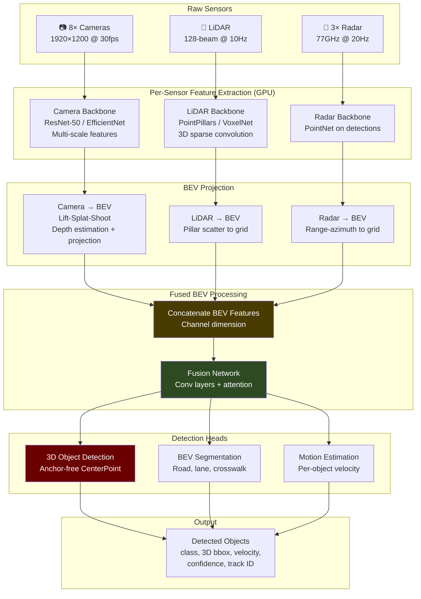
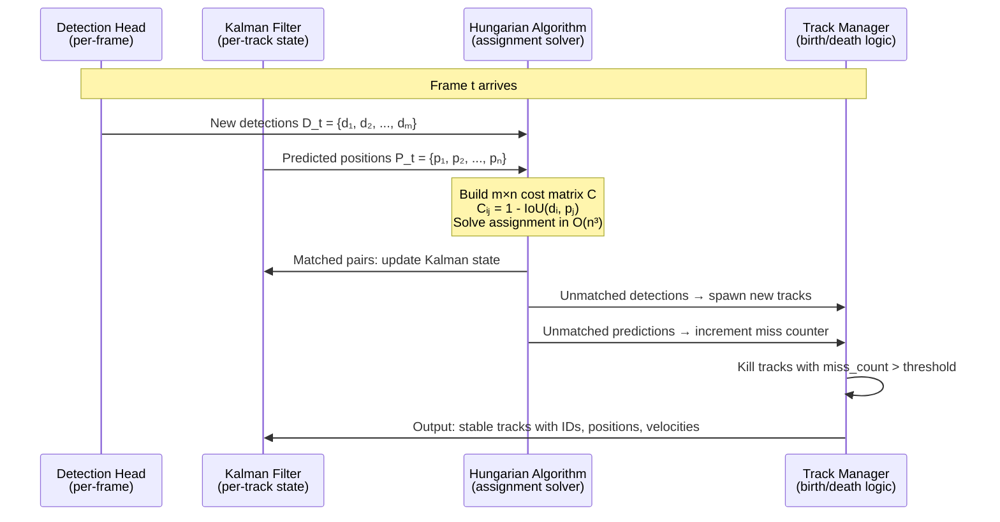

# 2. Sensor Fusion and The Perception Engine 🟡

> **The Problem:** An autonomous vehicle generates approximately **50 GB of raw sensor data per minute**. Eight cameras produce 1.2 Gpixels/second. A 128-beam LiDAR generates 2.4 million points per second. Three radar units produce thousands of range-Doppler returns per sweep. None of these sensors alone is sufficient: cameras fail in direct sunlight and at night, LiDAR fails in heavy rain and fog, and radar cannot distinguish a plastic bag from a child. The perception engine must **fuse** all modalities into a single, unified world model — and it must do this in under **30 milliseconds per frame**, every frame, or the planning module starves and the car drives blind.

---

## 2.1 The Sensor Suite

A Level 4 AV typically carries the following sensor complement:

| Sensor | Count | Output | Rate | Data Size/Frame | Strength | Weakness |
|--------|-------|--------|------|------------------|----------|----------|
| Camera (RGB) | 8 | 1920×1200 pixels | 30 Hz | 6.9 MB (raw) | Rich texture, color, signs | No depth, fails in glare/dark |
| LiDAR (128-beam) | 1–2 | 128 × 1800 points | 10 Hz | 2.1 MB (XYZ + intensity) | Precise 3D geometry, range | Degrades in rain/fog, sparse |
| Radar (77 GHz) | 3–5 | Range-Doppler map | 20 Hz | 50 KB | Works in all weather, velocity | Poor angular resolution |
| Ultrasonics | 12 | Distance | 40 Hz | < 1 KB | Close-range (<5m) | Useless beyond parking |

### Why Multi-Modal Fusion Is Non-Negotiable

```
Single-Sensor Failure Scenarios:

Camera only:  🌧️ Rain on lens → blurred → missed pedestrian
              🌅 Setting sun → bloomed CCD → phantom objects
              🌙 Night tunnel exit → exposure adaptation lag → 200ms blind

LiDAR only:   🚶 Person wearing black at 100m → only 3 return points → missed
              🌧️ Heavy rain → millions of false returns → phantom walls
              📋 Flat white truck → specular reflection → invisible

Radar only:   🛍️ Plastic bag vs child → same radar cross-section → indistinguishable
              🏗️ Metal guardrail → multipath reflection → ghost vehicle
              🚗 Stationary car → filtered as clutter → invisible

Fused:         ✅ Camera says "person" + LiDAR says "3D object at 50m"
                  + Radar says "moving at 1.2 m/s toward road"
               → HIGH CONFIDENCE PEDESTRIAN ALERT
```

---

## 2.2 The Fusion Architecture: Early vs. Late vs. Deep Fusion

There are three fundamental approaches to fusing multi-modal sensor data:

| Approach | Where Fusion Happens | Pros | Cons | Used By |
|----------|---------------------|------|------|---------|
| **Early Fusion** | Raw data level (concatenate point clouds + pixels) | Richest signal, no information loss | Huge input tensor, hard to train | Some research systems |
| **Late Fusion** | After per-sensor detection (merge bounding boxes) | Simple, modular, sensor-independent | Loses cross-modal correlations | Traditional stacks |
| **Deep (Mid-Level) Fusion** | Feature map level (fuse learned representations) | Best accuracy, learns cross-modal features | Complex architecture, harder to debug | Waymo, Tesla (BEV) |

### Production Architecture: Bird's-Eye View (BEV) Deep Fusion

The current state-of-the-art fuses camera and LiDAR features into a unified **Bird's-Eye View** representation. This approach, pioneered by systems like BEVFusion, projects all sensors into a common coordinate frame.



---

## 2.3 GPU Inference Pipeline: Meeting the 30ms Budget

The perception engine must run on the vehicle's onboard GPU (typically NVIDIA Orin or dual A100). Meeting the 30ms deadline requires **TensorRT optimization**, **CUDA stream pipelining**, and **quantization**.

### The Latency Budget for Perception

| Stage | Time | Notes |
|-------|------|-------|
| Sensor DMA to GPU memory | 2 ms | Zero-copy via pinned memory |
| Camera backbone (8 images) | 8 ms | Batched inference, TensorRT FP16 |
| LiDAR voxelization + backbone | 5 ms | Sparse 3D convolution |
| BEV projection (Lift-Splat) | 4 ms | Custom CUDA kernel |
| Feature concatenation | 0.5 ms | GPU memory operation |
| Fusion network + heads | 6 ms | TensorRT FP16 |
| NMS + post-processing | 2 ms | Custom CUDA kernel |
| Copy results to CPU | 0.5 ms | Pinned memory DMA |
| **Total** | **28 ms** | **2ms margin** |

### TensorRT Optimization: From 200ms to 28ms

```rust
// 💥 NAIVE: Running PyTorch model directly on the vehicle
// This is what happens when ML engineers ship their training code to production

fn run_perception_naive(camera_images: &[Image], lidar_points: &[Point3D]) {
    // 💥 PyTorch eager mode: no graph optimization, no kernel fusion
    // 💥 FP32 precision: 2× the memory bandwidth, 2× the compute
    // 💥 Python GIL: serializes all GPU dispatches behind a single lock
    // 💥 Dynamic shapes: recompiles CUDA kernels every frame

    let result = python_runtime.call(
        "model.forward",
        &[camera_images, lidar_points],
    );
    // 💥 RESULT: 180–250ms per frame
    // 💥 At 30fps requirement, we can only process 4–5 fps
    // 💥 The car is blind for 83% of the time
}
```

```rust
// ✅ PRODUCTION: TensorRT-optimized inference pipeline
// All models compiled offline with static shapes and FP16 quantization

use tensorrt_rs::{Engine, ExecutionContext, CudaStream};

struct PerceptionPipeline {
    camera_engine: Engine,       // ResNet-50 backbone, FP16, static batch=8
    lidar_engine: Engine,        // PointPillars, FP16, static grid
    fusion_engine: Engine,       // BEV fusion + heads, FP16
    stream_preprocess: CudaStream,
    stream_inference: CudaStream,
    stream_postprocess: CudaStream,
    // Pre-allocated GPU memory — ZERO allocations at runtime
    camera_input_buf: CudaBuffer,
    lidar_input_buf: CudaBuffer,
    bev_features_buf: CudaBuffer,
    detection_output_buf: CudaBuffer,
}

impl PerceptionPipeline {
    /// Run the full perception pipeline.
    /// Uses triple-stream pipelining: while frame N does inference,
    /// frame N+1 is being preprocessed, and frame N-1 results are
    /// being copied back to CPU.
    fn run_frame(&mut self, frame: &SensorFrame) -> Vec<DetectedObject> {
        // Stream 1: Preprocess (DMA + normalization)
        self.stream_preprocess.memcpy_async(
            &self.camera_input_buf,
            frame.camera_raw,
        );
        self.preprocess_lidar_kernel.launch(
            &self.stream_preprocess,
            frame.lidar_raw,
            &mut self.lidar_input_buf,
        );

        // Synchronize: preprocessing must finish before inference begins
        self.stream_preprocess.synchronize();

        // Stream 2: Inference (all three engines back-to-back)
        self.camera_engine.execute(
            &self.stream_inference,
            &self.camera_input_buf,
            &mut self.bev_features_buf,
        );
        self.lidar_engine.execute(
            &self.stream_inference,
            &self.lidar_input_buf,
            &mut self.bev_features_buf,
        );
        self.fusion_engine.execute(
            &self.stream_inference,
            &self.bev_features_buf,
            &mut self.detection_output_buf,
        );

        // Stream 3: Post-process (NMS + copy to CPU)
        self.stream_inference.synchronize();
        let detections = self.nms_and_copy(&self.detection_output_buf);

        detections
    }
}
```

---

## 2.4 LiDAR Processing: From Point Cloud to Pillars

Raw LiDAR data is an unordered set of 3D points — unsuitable for standard convolutions. The **PointPillars** architecture converts this sparse 3D data into a dense 2D pseudo-image for efficient processing.

### PointPillars Algorithm

1. **Voxelize**: Divide the 3D space into a grid of vertical pillars (e.g., 0.16m × 0.16m × 4m).
2. **Encode**: For each pillar, sample up to N points and encode them as feature vectors (x, y, z, intensity, Δx, Δy, Δz from pillar center).
3. **PointNet**: Apply a small PointNet (shared MLP) to each pillar to produce a fixed-length feature.
4. **Scatter**: Place each pillar's feature into the corresponding BEV grid cell.
5. **2D CNN**: Run a standard 2D backbone (SSD, ResNet) over the pseudo-image.

```rust
// ✅ PRODUCTION: LiDAR voxelization — CUDA kernel
// Converts raw point cloud into PointPillars format on GPU

/// CUDA kernel: assign each point to its pillar, compute local offsets
/// Points outside the region of interest are discarded
/// Maximum points per pillar is clamped to avoid memory explosion
fn voxelize_points_cuda(
    points: &CudaSlice<Point3D>,       // Raw points on GPU
    pillars: &mut CudaSlice<Pillar>,    // Output pillar buffer (pre-allocated)
    config: &VoxelConfig,
) {
    // Grid dimensions
    let grid_x = ((config.max_x - config.min_x) / config.pillar_x) as usize; // e.g., 432
    let grid_y = ((config.max_y - config.min_y) / config.pillar_y) as usize; // e.g., 496

    // Each CUDA thread processes one point
    // Atomically increment the point count in the target pillar
    // If pillar is full (>= MAX_POINTS_PER_PILLAR), skip this point
    launch_kernel!(voxelize_kernel<<<points.len() / 256, 256>>>(
        points.as_ptr(),
        points.len(),
        pillars.as_mut_ptr(),
        config.min_x, config.min_y,
        config.pillar_x, config.pillar_y,
        grid_x, grid_y,
        MAX_POINTS_PER_PILLAR,
    ));
}

struct VoxelConfig {
    min_x: f32,       //  -39.68m (left of vehicle)
    max_x: f32,       //   39.68m (right of vehicle)
    min_y: f32,       //    0.0m  (vehicle position)
    max_y: f32,       //   69.12m (forward)
    min_z: f32,       //   -3.0m  (below ground plane)
    max_z: f32,       //    1.0m  (above vehicle)
    pillar_x: f32,    //    0.16m
    pillar_y: f32,    //    0.16m
}
```

---

## 2.5 Multi-Object Tracking (MOT)

Detections from a single frame are noisy and lack temporal continuity. A tracking algorithm associates detections across frames to produce stable **tracks** with smoothed positions, velocities, and track IDs.

### Hungarian Algorithm + Kalman Filter

The standard production approach:

1. **Predict**: Use Kalman filter to predict each track's position in the current frame.
2. **Associate**: Use the **Hungarian algorithm** to find the optimal assignment between predicted tracks and new detections, minimizing a cost matrix (IoU or Mahalanobis distance).
3. **Update**: For matched pairs, update the Kalman filter with the new measurement.
4. **Birth/Death**: Unmatched detections spawn new tracks. Unmatched tracks increment a "missed" counter; after N consecutive misses, the track dies.



```rust
// ✅ PRODUCTION: Kalman Filter state for 3D object tracking

/// State vector for a tracked object:
/// [x, y, z, vx, vy, vz, ax, ay, az, yaw, yaw_rate]
/// Using a constant-acceleration motion model
const STATE_DIM: usize = 11;
const MEAS_DIM: usize = 7;  // [x, y, z, vx, vy, vz, yaw] from detector

struct TrackedObject {
    id: u64,
    state: nalgebra::SVector<f64, STATE_DIM>,
    covariance: nalgebra::SMatrix<f64, STATE_DIM, STATE_DIM>,
    class: ObjectClass,
    confidence: f32,
    consecutive_misses: u32,
    age: u32,  // frames since birth
}

impl TrackedObject {
    /// Kalman predict step: propagate state forward by dt
    fn predict(&mut self, dt: f64) {
        // State transition matrix (constant acceleration model)
        let f = state_transition_matrix(dt);

        // x_{t|t-1} = F * x_{t-1|t-1}
        self.state = &f * &self.state;

        // P_{t|t-1} = F * P_{t-1|t-1} * F^T + Q
        let q = process_noise_matrix(dt);
        self.covariance = &f * &self.covariance * f.transpose() + q;
    }

    /// Kalman update step: incorporate new measurement
    fn update(&mut self, measurement: &nalgebra::SVector<f64, MEAS_DIM>) {
        let h = measurement_matrix();

        // Innovation: y = z - H * x
        let innovation = measurement - &h * &self.state;

        // Innovation covariance: S = H * P * H^T + R
        let r = measurement_noise_matrix();
        let s = &h * &self.covariance * h.transpose() + r;

        // Kalman gain: K = P * H^T * S^{-1}
        let k = &self.covariance * h.transpose() * s.try_inverse().unwrap();

        // Updated state: x = x + K * y
        self.state = &self.state + &k * &innovation;

        // Updated covariance: P = (I - K * H) * P
        let i = nalgebra::SMatrix::<f64, STATE_DIM, STATE_DIM>::identity();
        self.covariance = (&i - &k * &h) * &self.covariance;

        self.consecutive_misses = 0;
        self.age += 1;
    }
}
```

---

## 2.6 Semantic Segmentation: Understanding the Drivable Surface

Object detection finds *things* (cars, people, bikes). Semantic segmentation classifies every point or pixel into *stuff* categories:

| Class | Why It Matters |
|-------|---------------|
| **Drivable road** | Where the car can physically drive |
| **Lane markings** | Lane-keeping and lane-change planning |
| **Crosswalk** | Yield to pedestrians (even if none detected) |
| **Sidewalk** | Hard boundary — car must never cross |
| **Vegetation** | Soft boundary — mountable in emergency |
| **Construction zone** | Dynamic speed reduction, path re-route |

In the BEV fusion architecture, segmentation shares the same backbone and BEV features as object detection — it's an additional head that outputs a per-cell class label on the BEV grid.

---

## 2.7 Handling Edge Cases: When Sensors Disagree

The most dangerous scenarios are when sensors **disagree**:

| Scenario | Camera Says | LiDAR Says | Radar Says | Correct Action |
|----------|------------|-----------|-----------|----------------|
| Child in shadow | Nothing | 3D cluster, 0.8m tall | Moving target, 1 m/s | **BRAKE** — trust LiDAR + radar |
| White truck broadside | Sky | Nothing (specular) | Large RCS, 0 m/s | **BRAKE** — trust camera + radar |
| Plastic bag | Vague blob | 3D cluster, 0.3m | Small RCS, wind-speed | **Ignore** — not a real obstacle |
| Bridge overpass | Nothing unusual | Dense returns above | Nothing | **Ignore** — filter by z-height |
| Black car at night | Nothing | 3D cluster | Large RCS, matching speed | **Track** — trust LiDAR + radar |

### Conflict Resolution Strategy

```rust
/// When sensors disagree, apply a principled conflict resolution policy.
/// The cardinal rule: when in doubt, assume the most dangerous interpretation.
fn resolve_sensor_conflict(
    camera_det: Option<&Detection>,
    lidar_det: Option<&Detection>,
    radar_det: Option<&Detection>,
) -> FusedDetection {
    match (camera_det, lidar_det, radar_det) {
        // All three agree — high confidence
        (Some(c), Some(l), Some(r)) => {
            FusedDetection::merge_all(c, l, r, Confidence::High)
        }

        // Two out of three — medium-high confidence
        // Trust the two that agree, flag the missing modality
        (Some(c), Some(l), None) => FusedDetection::merge(c, l, Confidence::MediumHigh),
        (Some(c), None, Some(r)) => FusedDetection::merge(c, r, Confidence::MediumHigh),
        (None, Some(l), Some(r)) => FusedDetection::merge(l, r, Confidence::MediumHigh),

        // Only one sensor — depends on which one
        (None, Some(l), None) => {
            // LiDAR-only detections are geometry-reliable
            // Conservative: treat as real obstacle, reduce speed
            FusedDetection::from_single(l, Confidence::Medium)
        }
        (None, None, Some(r)) => {
            // Radar-only: could be ghost. Track for 3 frames before acting.
            FusedDetection::from_single(r, Confidence::Low)
        }
        (Some(c), None, None) => {
            // Camera-only: no depth info. Cannot brake on camera alone
            // unless classifier confidence > 0.95
            if c.confidence > 0.95 {
                FusedDetection::from_single(c, Confidence::Medium)
            } else {
                FusedDetection::uncertain(c)
            }
        }

        // No detections
        (None, None, None) => FusedDetection::empty(),
    }
}
```

---

## 2.8 Quantization: FP32 → FP16 → INT8

To meet the 30ms inference budget, models are quantized after training:

| Precision | Memory | Throughput (TOPS) | Accuracy Impact | Use Case |
|-----------|--------|-------------------|-----------------|----------|
| FP32 | 4 bytes/weight | 1× | Baseline | Training only |
| FP16 | 2 bytes/weight | 2× | < 0.3% mAP loss | Default production |
| INT8 | 1 byte/weight | 4× | 0.5–2% mAP loss | Aggressive, needs calibration |
| INT4 (experimental) | 0.5 bytes/weight | 8× | 2–5% mAP loss | Not yet production-ready |

```rust
// ✅ PRODUCTION: TensorRT INT8 calibration workflow
// Calibration runs offline on a representative dataset (~5000 frames)
// It finds optimal clipping thresholds per tensor to minimize quantization error

struct CalibrationConfig {
    /// Dataset of representative sensor frames (diverse conditions)
    calibration_dataset: PathBuf,
    /// Number of frames to use for calibration histogram
    num_calibration_frames: usize,  // typically 5000
    /// Calibration algorithm
    algorithm: CalibrationAlgorithm,
    /// Layers that must remain FP16 (first + last layers, attention)
    fp16_override_layers: Vec<String>,
}

enum CalibrationAlgorithm {
    /// Minimizes KL-divergence between FP32 and INT8 distributions
    EntropyCalibration,
    /// Minimizes mean squared error
    MinMaxCalibration,
    /// Percentile-based clipping (99.99th percentile)
    PercentileCalibration,
}
```

---

> **Key Takeaways**
>
> 1. **No single sensor modality is sufficient.** Cameras lack depth, LiDAR lacks texture, radar lacks resolution. Multi-modal fusion is a safety requirement, not an optimization.
> 2. **BEV (Bird's-Eye View) fusion is the state of the art.** Project all sensors into a common coordinate frame, concatenate features, and run unified detection heads.
> 3. **TensorRT compilation with FP16 quantization is the minimum viable optimization** to meet 30ms latency on automotive GPUs. INT8 gives 2× more headroom but requires careful calibration.
> 4. **Multi-object tracking (Hungarian + Kalman) provides temporal consistency.** Raw per-frame detections are noisy; tracks provide stable IDs, smoothed positions, and velocity estimates that the planner depends on.
> 5. **When sensors disagree, assume the most dangerous interpretation.** A detection that exists in LiDAR and radar but not camera is a real obstacle until proven otherwise.
> 6. **Zero-copy GPU pipelines are mandatory.** Sensor data flows: sensor → DMA → pinned GPU memory → inference → results. No CPU-side copies in the critical path.
> 7. **Pre-allocate all GPU memory at startup.** CUDA's `cudaMalloc` is non-deterministic and can take milliseconds. Use CUDA memory pools or pre-allocated buffers exclusively.
