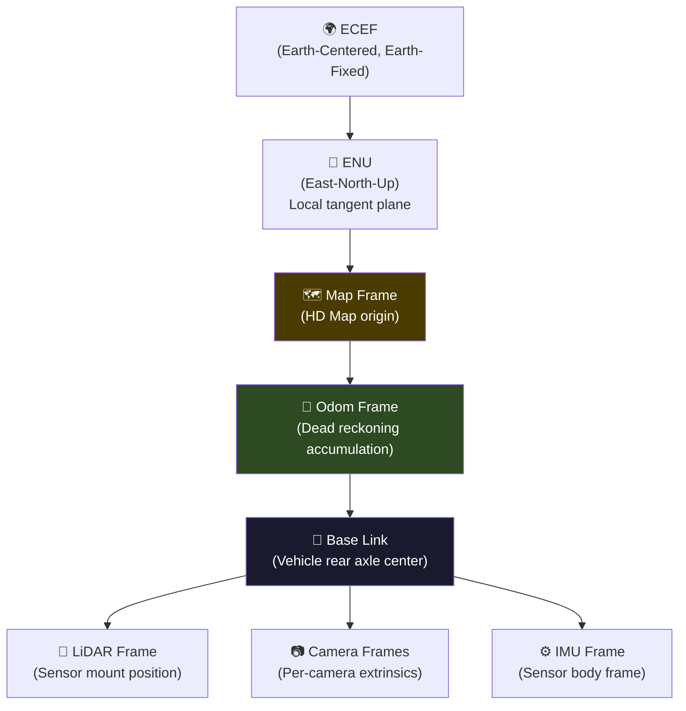
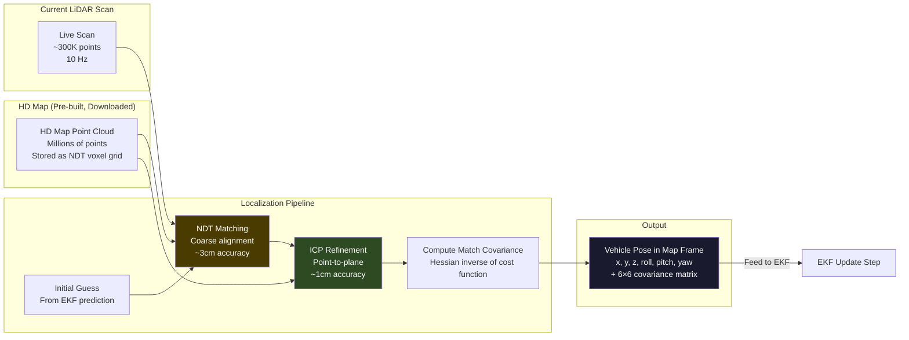
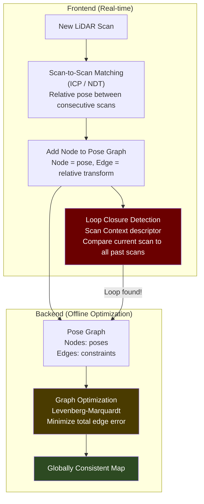

# 3. Localization and SLAM (Where Am I?) 🔴

> **The Problem:** GPS (GNSS) is accurate to 2–5 meters in open sky, and degrades to 10–50 meters in urban canyons between buildings. A car is 1.8 meters wide. A lane is 3.5 meters wide. GPS alone cannot tell the vehicle which lane it is in, let alone maintain centimeter-level accuracy needed to follow lane markings, stop at the correct position behind a crosswalk, and avoid curbs. The localization system must fuse GPS, IMU, wheel odometry, and LiDAR point cloud registration against pre-built HD Maps to achieve **< 10 cm positional accuracy and < 0.1° heading accuracy** — at 100 Hz — even when GPS is completely unavailable (tunnels, parking garages, dense urban canyons).

---

## 3.1 The Localization Sensor Suite

| Sensor | Rate | What It Provides | Strengths | Weaknesses |
|--------|------|------------------|-----------|------------|
| **GNSS/RTK** | 10 Hz | Global position (lat, lon, alt) | Absolute reference, no drift | 2–5m error; fails in tunnels/canyons |
| **IMU** (6-axis) | 200–1000 Hz | Angular velocity + linear acceleration | Very high rate, no external dependency | Drifts rapidly (meters/minute) |
| **Wheel Odometry** | 100 Hz | Distance traveled per wheel | Reliable on flat, dry roads | Wheel slip, surface dependency |
| **LiDAR** | 10 Hz | 3D point cloud matched to HD map | Centimeter accuracy via ICP/NDT | Requires pre-built HD map |
| **Camera** | 30 Hz | Visual landmarks, lane markings | Rich features for visual localization | Lighting-dependent, computationally expensive |

### Why No Single Source Suffices

```
GPS alone:     2–5m accuracy → wrong lane → head-on collision
IMU alone:     Drifts 1–10m per minute → useless after 30 seconds
Odometry alone: Wheel slip on wet road → cumulative error → off-road
LiDAR matching: 10 Hz only → between scans, car moves 2.7m at 60mph
                 Requires HD map → fails in unmapped areas
Camera alone:  Lighting changes → feature matching fails → lost
```

The solution: **fuse all of them** using an Extended Kalman Filter (EKF), with each sensor compensating for the others' weaknesses.

---

## 3.2 Coordinate Frames and Transforms

Before fusing any data, every measurement must be transformed into a common coordinate frame. A Level 4 AV stack maintains a strict transform tree:



| Transform | Source | How It's Computed |
|-----------|--------|-------------------|
| ECEF → ENU | WGS-84 geodetic math | Fixed trigonometric conversion |
| ENU → Map | HD Map metadata | Static offset + rotation at map load |
| Map → Odom | **EKF output** | This is what we're solving for |
| Odom → Base Link | Odometry integration | Dead reckoning between EKF updates |
| Base Link → Sensors | **Calibration** | Measured offline, millimeter precision |

### Sensor Extrinsic Calibration

Every sensor's mounting position and orientation relative to the vehicle must be known to sub-millimeter precision. A 1° error in LiDAR-to-vehicle rotation at 100m range produces a **1.75m positional error** in the point cloud.

```rust
/// Rigid-body transform: rotation (quaternion) + translation
/// Represents the pose of one frame relative to another
#[derive(Clone, Debug)]
struct Transform3D {
    /// Rotation as unit quaternion [w, x, y, z]
    rotation: nalgebra::UnitQuaternion<f64>,
    /// Translation in meters [x, y, z]
    translation: nalgebra::Vector3<f64>,
}

impl Transform3D {
    /// Compose two transforms: T_a_c = T_a_b * T_b_c
    fn compose(&self, other: &Transform3D) -> Transform3D {
        Transform3D {
            rotation: self.rotation * other.rotation,
            translation: self.rotation * other.translation + self.translation,
        }
    }

    /// Transform a 3D point from the child frame to the parent frame
    fn transform_point(&self, point: &nalgebra::Point3<f64>) -> nalgebra::Point3<f64> {
        self.rotation * point + self.translation
    }

    /// Inverse transform: T_b_a from T_a_b
    fn inverse(&self) -> Transform3D {
        let inv_rot = self.rotation.inverse();
        Transform3D {
            rotation: inv_rot,
            translation: inv_rot * (-self.translation),
        }
    }
}

/// The vehicle's full transform tree — loaded from calibration files at startup
struct TransformTree {
    base_to_lidar: Transform3D,
    base_to_imu: Transform3D,
    base_to_cameras: [Transform3D; 8],
    base_to_gnss_antenna: Transform3D,
    map_to_odom: Transform3D,    // Updated by EKF
    odom_to_base: Transform3D,   // Updated by odometry integration
}
```

---

## 3.3 The Extended Kalman Filter (EKF)

The EKF is the mathematical core of the localization system. It maintains a probabilistic estimate of the vehicle's state (position, velocity, orientation) and updates this estimate as each new sensor measurement arrives.

### State Vector

The EKF state vector for vehicle localization:

$$\mathbf{x} = \begin{bmatrix} x \\ y \\ z \\ v_x \\ v_y \\ v_z \\ \phi \\ \theta \\ \psi \\ b_{ax} \\ b_{ay} \\ b_{az} \\ b_{gx} \\ b_{gy} \\ b_{gz} \end{bmatrix}$$

Where:
- $(x, y, z)$ — position in the map frame (meters)
- $(v_x, v_y, v_z)$ — velocity in the map frame (m/s)
- $(\phi, \theta, \psi)$ — roll, pitch, yaw (radians)
- $(b_{ax}, b_{ay}, b_{az})$ — accelerometer bias (m/s²) — **critical: IMU biases drift!**
- $(b_{gx}, b_{gy}, b_{gz})$ — gyroscope bias (rad/s)

State dimension: $n = 15$

### Prediction Step (IMU-driven, 200 Hz)

The IMU drives the prediction step because it runs at the highest rate (200–1000 Hz). Between any other sensor update, the EKF propagates the state forward using IMU measurements.

The nonlinear state transition:

$$\mathbf{x}_{t+1} = f(\mathbf{x}_t, \mathbf{u}_t) + \mathbf{w}_t$$

Where $\mathbf{u}_t = [\alpha_x, \alpha_y, \alpha_z, \omega_x, \omega_y, \omega_z]^T$ is the IMU measurement (acceleration + angular velocity), and $\mathbf{w}_t \sim \mathcal{N}(0, \mathbf{Q})$ is process noise.

The Jacobian of $f$ with respect to $\mathbf{x}$ (the state transition matrix) must be computed at each step:

$$\mathbf{F}_t = \left. \frac{\partial f}{\partial \mathbf{x}} \right|_{\mathbf{x}_t, \mathbf{u}_t}$$

### Update Step (sensor-driven, variable rate)

When a sensor measurement $\mathbf{z}$ arrives:

$$\mathbf{K}_t = \mathbf{P}_{t|t-1} \mathbf{H}_t^T (\mathbf{H}_t \mathbf{P}_{t|t-1} \mathbf{H}_t^T + \mathbf{R}_t)^{-1}$$

$$\mathbf{x}_{t|t} = \mathbf{x}_{t|t-1} + \mathbf{K}_t (\mathbf{z}_t - h(\mathbf{x}_{t|t-1}))$$

$$\mathbf{P}_{t|t} = (\mathbf{I} - \mathbf{K}_t \mathbf{H}_t) \mathbf{P}_{t|t-1}$$

Where $\mathbf{H}_t$ is the Jacobian of the measurement function $h$, and $\mathbf{R}_t$ is the measurement noise covariance.

```rust
// ✅ PRODUCTION: EKF implementation for vehicle localization

use nalgebra::{SMatrix, SVector};

const STATE_DIM: usize = 15;
const IMU_DIM: usize = 6;

type StateVec = SVector<f64, STATE_DIM>;
type StateCov = SMatrix<f64, STATE_DIM, STATE_DIM>;

struct EKFLocalizer {
    /// Current state estimate
    state: StateVec,
    /// State covariance (uncertainty)
    covariance: StateCov,
    /// Process noise — tuned per IMU hardware specification
    process_noise: StateCov,
    /// Last IMU timestamp for dt computation
    last_imu_time: f64,
    /// Gravity vector in map frame
    gravity: nalgebra::Vector3<f64>,
}

impl EKFLocalizer {
    /// IMU prediction step — called at 200 Hz
    fn predict_imu(&mut self, imu: &ImuMeasurement) {
        let dt = imu.timestamp - self.last_imu_time;
        self.last_imu_time = imu.timestamp;

        // Extract current state components
        let pos = self.state.fixed_rows::<3>(0);
        let vel = self.state.fixed_rows::<3>(3);
        let rpy = self.state.fixed_rows::<3>(6);
        let accel_bias = self.state.fixed_rows::<3>(9);
        let gyro_bias = self.state.fixed_rows::<3>(12);

        // Correct IMU measurements for estimated biases
        let accel_corrected = imu.linear_acceleration - accel_bias;
        let gyro_corrected = imu.angular_velocity - gyro_bias;

        // Rotation matrix from body to map frame
        let r_body_to_map = rotation_matrix_from_rpy(rpy[0], rpy[1], rpy[2]);

        // Rotate acceleration into map frame and subtract gravity
        let accel_map = r_body_to_map * accel_corrected - self.gravity;

        // State prediction (constant acceleration model)
        // Position += velocity * dt + 0.5 * accel * dt²
        let new_pos = pos + vel * dt + accel_map * (0.5 * dt * dt);
        // Velocity += accel * dt
        let new_vel = vel + accel_map * dt;
        // Orientation += angular_velocity * dt (simplified; production uses quaternions)
        let new_rpy = rpy + gyro_corrected * dt;

        // Update state vector
        self.state.fixed_rows_mut::<3>(0).copy_from(&new_pos);
        self.state.fixed_rows_mut::<3>(3).copy_from(&new_vel);
        self.state.fixed_rows_mut::<3>(6).copy_from(&new_rpy);
        // Biases evolve as random walks (no explicit prediction)

        // Compute Jacobian F = df/dx and propagate covariance
        let f_jacobian = self.compute_imu_jacobian(dt, &r_body_to_map);
        self.covariance = &f_jacobian * &self.covariance * f_jacobian.transpose()
            + &self.process_noise * (dt * dt);
    }

    /// GNSS update step — called at 10 Hz (when available)
    fn update_gnss(&mut self, gnss: &GnssMeasurement) {
        // Measurement model: z = [x, y, z] from GNSS
        // H is 3×15: extracts position from state
        let mut h = SMatrix::<f64, 3, STATE_DIM>::zeros();
        h[(0, 0)] = 1.0;  // x
        h[(1, 1)] = 1.0;  // y
        h[(2, 2)] = 1.0;  // z

        // Measurement noise: depends on GNSS fix quality
        let r = gnss_noise_covariance(gnss.fix_quality, gnss.hdop);

        // Innovation
        let predicted_pos = self.state.fixed_rows::<3>(0);
        let innovation = gnss.position_enu - predicted_pos;

        // Mahalanobis distance gate — reject GNSS outliers
        let s = &h * &self.covariance * h.transpose() + &r;
        let mahal_dist = innovation.transpose() * s.try_inverse().unwrap() * &innovation;
        if mahal_dist[(0, 0)] > CHI_SQUARED_GATE_3DOF {
            // 🚨 GNSS measurement is an outlier — reject it
            // This catches GPS multipath in urban canyons
            log::warn!("GNSS outlier rejected: Mahalanobis distance = {:.2}", mahal_dist[(0, 0)]);
            return;
        }

        // Standard Kalman update
        let k = &self.covariance * h.transpose() * s.try_inverse().unwrap();
        self.state += &k * &innovation;
        let i = StateCov::identity();
        self.covariance = (&i - &k * &h) * &self.covariance;
    }

    /// LiDAR-to-map matching update — called at 10 Hz
    /// This provides the highest accuracy: typically < 5cm
    fn update_lidar_matching(&mut self, lidar_pose: &Transform3D, match_covariance: &SMatrix<f64, 6, 6>) {
        // Measurement: [x, y, z, roll, pitch, yaw] from ICP/NDT matching
        let mut h = SMatrix::<f64, 6, STATE_DIM>::zeros();
        h[(0, 0)] = 1.0; h[(1, 1)] = 1.0; h[(2, 2)] = 1.0;  // position
        h[(3, 6)] = 1.0; h[(4, 7)] = 1.0; h[(5, 8)] = 1.0;  // orientation

        let z = nalgebra::SVector::<f64, 6>::new(
            lidar_pose.translation.x,
            lidar_pose.translation.y,
            lidar_pose.translation.z,
            lidar_pose.rpy().0,
            lidar_pose.rpy().1,
            lidar_pose.rpy().2,
        );

        let predicted_measurement = h * &self.state;
        let innovation = z - predicted_measurement;

        let s = &h * &self.covariance * h.transpose() + match_covariance;
        let k = &self.covariance * h.transpose() * s.try_inverse().unwrap();

        self.state += &k * &innovation;
        let i = StateCov::identity();
        self.covariance = (&i - &k * &h) * &self.covariance;
    }
}
```

---

## 3.4 LiDAR Point Cloud Registration: ICP and NDT

The LiDAR localization module aligns the current scan against a pre-built HD point cloud map to determine the vehicle's precise pose. Two algorithms dominate:

### Iterative Closest Point (ICP) vs. Normal Distributions Transform (NDT)

| Property | ICP | NDT |
|----------|-----|-----|
| Representation | Point-to-point/plane | Probability distributions per voxel |
| Speed | Slow on dense clouds (O(n log n) per iteration) | Fast (O(n) with spatial hashing) |
| Accuracy | Sub-cm with good initialization | ~2cm typical |
| Robustness to initialization | Poor — needs < 0.5m initial guess | Good — converges from ~1m offset |
| Memory | Full point cloud stored | Compressed into voxel statistics |
| **Production choice** | **ICP for fine refinement** | **NDT for coarse alignment** |

### NDT Algorithm

1. **Divide** the HD map into a 3D voxel grid (e.g., 1m³ cells).
2. **Compute** per-voxel mean $\boldsymbol{\mu}_i$ and covariance $\boldsymbol{\Sigma}_i$ from map points within each voxel.
3. For each scan point $\mathbf{p}_j$, find its voxel and compute the likelihood: $\ell_j = \exp\left( -\frac{1}{2} (\mathbf{p}_j - \boldsymbol{\mu}_i)^T \boldsymbol{\Sigma}_i^{-1} (\mathbf{p}_j - \boldsymbol{\mu}_i) \right)$
4. **Optimize** the 6-DOF transform $\mathbf{T} = [x, y, z, \phi, \theta, \psi]$ that maximizes $\sum_j \ell_j$ using Newton's method.



```rust
// 💥 NAIVE: Brute-force ICP without spatial indexing
fn icp_naive(scan: &[Point3D], map: &[Point3D], max_iters: usize) -> Transform3D {
    let mut transform = Transform3D::identity();

    for _iter in 0..max_iters {
        let mut correspondences = Vec::new();

        for scan_point in scan {
            let transformed = transform.transform_point(scan_point);

            // 💥 Linear search for nearest neighbor: O(n × m)
            // With 300K scan points and 10M map points = 3 TRILLION distance computations
            // Takes ~30 SECONDS per iteration. We have 100ms total budget.
            let nearest = map.iter()
                .min_by(|a, b| {
                    a.distance_to(&transformed)
                        .partial_cmp(&b.distance_to(&transformed))
                        .unwrap()
                })
                .unwrap();

            correspondences.push((transformed, *nearest));
        }

        transform = solve_transform(&correspondences);
    }
    transform
}
```

```rust
// ✅ PRODUCTION: NDT with spatial hashing + ICP refinement

use std::collections::HashMap;

/// NDT voxel: stores mean and covariance of points within a 3D cell
struct NdtVoxel {
    mean: nalgebra::Vector3<f64>,
    covariance: nalgebra::Matrix3<f64>,
    inv_covariance: nalgebra::Matrix3<f64>,
    num_points: usize,
}

/// Pre-computed NDT map — built offline, loaded at startup
struct NdtMap {
    /// Spatial hash: voxel coordinate → NDT statistics
    /// O(1) lookup by voxel index
    voxels: HashMap<VoxelIndex, NdtVoxel>,
    voxel_size: f64,  // typically 1.0m
}

impl NdtMap {
    /// Run NDT scan matching: find the optimal 6-DOF transform
    /// that aligns the current scan to the map
    fn match_scan(
        &self,
        scan: &[Point3D],
        initial_guess: &Transform3D,
        max_iterations: usize,
    ) -> (Transform3D, nalgebra::SMatrix<f64, 6, 6>) {
        let mut transform = initial_guess.clone();

        for iteration in 0..max_iterations {
            let mut score = 0.0;
            // Gradient and Hessian for Newton's method
            let mut gradient = nalgebra::SVector::<f64, 6>::zeros();
            let mut hessian = nalgebra::SMatrix::<f64, 6, 6>::zeros();

            for point in scan {
                let transformed = transform.transform_point(point);
                let voxel_idx = self.point_to_voxel(&transformed);

                if let Some(voxel) = self.voxels.get(&voxel_idx) {
                    let diff = transformed.coords - voxel.mean;
                    let exponent = -0.5 * diff.transpose() * &voxel.inv_covariance * &diff;
                    let likelihood = exponent[(0, 0)].exp();
                    score += likelihood;

                    // Accumulate gradient and Hessian contributions
                    // (Jacobian of transform w.r.t. parameters × NDT gradient)
                    let j = transform_jacobian(point, &transform);
                    let g = -voxel.inv_covariance * &diff * likelihood;
                    gradient += j.transpose() * g;
                    hessian += j.transpose() * &voxel.inv_covariance * &j * likelihood;
                }
            }

            // Newton step: δ = -H⁻¹ g
            if let Some(inv_hessian) = hessian.try_inverse() {
                let delta = -inv_hessian * gradient;

                // Apply delta to transform parameters
                transform = apply_delta(&transform, &delta);

                // Convergence check
                if delta.norm() < 1e-4 {
                    break;
                }
            }
        }

        // Match covariance ≈ inverse Hessian at the optimum
        // This tells the EKF how confident this match is
        let match_covariance = hessian.try_inverse()
            .unwrap_or(nalgebra::SMatrix::<f64, 6, 6>::identity() * 1.0);

        (transform, match_covariance)
    }
}
```

---

## 3.5 HD Maps: The Pre-Built World Model

Level 4 AVs rely on pre-built High-Definition Maps that contain:

| Layer | Content | Accuracy | Update Frequency |
|-------|---------|----------|------------------|
| **Point Cloud Layer** | 3D point cloud of the environment | 2 cm | Monthly (survey vehicles) |
| **Lane Graph** | Lane center lines, widths, connections | 10 cm | Weekly |
| **Regulatory Layer** | Speed limits, traffic signs, signals, stop lines | Absolute | As regulations change |
| **Semantic Layer** | Crosswalks, bike lanes, construction zones | 30 cm | Daily (fleet telemetry) |
| **Surface Layer** | Road surface type, grade, camber | 5 cm | Monthly |

### HD Map Download and Update Strategy

```rust
/// HD Map tiles are downloaded on-demand based on the vehicle's planned route.
/// Each tile covers a 100m × 100m area.
struct HdMapManager {
    /// Currently loaded tiles (LRU cache, max 500 tiles = 5km × 1km)
    tile_cache: LruCache<TileId, HdMapTile>,
    /// Pre-fetched tiles along the planned route
    prefetch_queue: VecDeque<TileId>,
    /// Local NVMe storage for offline operation
    local_storage: PathBuf,
}

struct HdMapTile {
    id: TileId,
    /// NDT voxel grid for localization
    ndt_map: NdtMap,
    /// Lane graph for planning
    lane_graph: LaneGraph,
    /// Regulatory elements (signs, signals, speed limits)
    regulations: Vec<RegulatoryElement>,
    /// Semantic polygons (crosswalks, construction zones)
    semantics: Vec<SemanticPolygon>,
    /// Version for delta updates
    version: u64,
}
```

---

## 3.6 Degraded Mode: When Localization Sensors Fail

| Failure | Detection Method | Fallback Strategy |
|---------|-----------------|-------------------|
| GPS lost (tunnel) | HDOP → ∞, fix quality = 0 | EKF continues with IMU + odometry + LiDAR map matching |
| LiDAR scan matching fails | NDT score < threshold | Rely on GPS + IMU + odometry; widen EKF covariance |
| IMU fault | Built-in diagnostics, checksum failure | Switch to redundant IMU; if both fail → safe stop |
| HD map not loaded | Tile cache miss on route | Drive on last known good position for 200m, then safe stop |
| All sensors degraded | EKF covariance exceeds safe threshold | **Immediate safe stop** — decelerate to 0 |

```rust
/// Monitor localization health and trigger degradation
fn check_localization_health(ekf: &EKFLocalizer) -> LocalizationHealth {
    let position_uncertainty = ekf.covariance.fixed_slice::<3, 3>(0, 0).trace().sqrt();
    let heading_uncertainty = ekf.covariance[(8, 8)].sqrt().to_degrees();

    match (position_uncertainty, heading_uncertainty) {
        (p, h) if p < 0.10 && h < 0.1 => LocalizationHealth::Nominal,
        (p, h) if p < 0.30 && h < 0.5 => LocalizationHealth::Degraded {
            action: "Reduce speed to 25 mph, increase following distance",
        },
        (p, h) if p < 1.00 && h < 2.0 => LocalizationHealth::Critical {
            action: "Reduce speed to 10 mph, seek safe pullover location",
        },
        _ => LocalizationHealth::Failed {
            action: "IMMEDIATE SAFE STOP — localization lost",
        },
    }
}
```

---

## 3.7 SLAM: When There Is No HD Map

For initial map building or driving in unmapped areas, **Simultaneous Localization and Mapping (SLAM)** builds the map on-the-fly while simultaneously localizing within it. This is a chicken-and-egg problem: you need a map to localize, and you need a position to build a map.

### LiDAR SLAM with Loop Closure



### Why Loop Closure Matters

Without loop closure, odometry drift accumulates. After driving a 1km loop, the start and end points might disagree by 5–10 meters. Loop closure detects that the vehicle has returned to a previously visited location and adds a constraint to the pose graph. The graph optimizer then distributes the accumulated error across all poses, making the entire map globally consistent.

```rust
// ✅ PRODUCTION: Pose graph with loop closure

/// A node in the pose graph: represents a vehicle pose at a specific time
struct PoseNode {
    id: usize,
    timestamp: f64,
    pose: Transform3D,
    /// The LiDAR scan associated with this pose (for loop closure matching)
    scan_context: ScanContextDescriptor,
}

/// An edge in the pose graph: a relative transform constraint between two poses
struct PoseEdge {
    from: usize,
    to: usize,
    /// Relative transform measured between the two poses
    relative_transform: Transform3D,
    /// Information matrix (inverse covariance) — how confident this edge is
    information: nalgebra::SMatrix<f64, 6, 6>,
}

struct PoseGraph {
    nodes: Vec<PoseNode>,
    edges: Vec<PoseEdge>,
}

impl PoseGraph {
    /// Detect loop closure: check if the current scan matches any previous location
    fn detect_loop_closure(&self, current: &PoseNode) -> Option<(usize, Transform3D)> {
        for past_node in &self.nodes {
            // Skip recent nodes (must be at least 50 poses ago to be a real loop)
            if current.id - past_node.id < 50 { continue; }

            // Fast descriptor matching: ScanContext cosine similarity
            let similarity = current.scan_context.similarity(&past_node.scan_context);
            if similarity < LOOP_CLOSURE_THRESHOLD { continue; }

            // Expensive verification: run ICP between the two scans
            if let Some(relative_pose) = verify_loop_closure_icp(current, past_node) {
                return Some((past_node.id, relative_pose));
            }
        }
        None
    }

    /// Optimize the pose graph using Levenberg-Marquardt
    /// Minimizes: sum of squared errors across all edges
    /// E = Σ_edges ||e_ij||²_{Ω_ij}
    /// where e_ij = T_i⁻¹ T_j ⊖ Z_ij (measured vs. predicted relative transform)
    fn optimize(&mut self, max_iterations: usize) {
        for _iter in 0..max_iterations {
            let (h, b) = self.build_linear_system();

            // Solve H * δx = -b
            let delta = h.cholesky().unwrap().solve(&(-b));

            // Apply correction to all poses
            for (i, node) in self.nodes.iter_mut().enumerate() {
                let dx = delta.fixed_rows::<6>(i * 6);
                node.pose = apply_delta(&node.pose, &dx);
            }

            if delta.norm() < 1e-6 { break; }
        }
    }
}
```

---

> **Key Takeaways**
>
> 1. **GPS alone is insufficient for lane-level driving.** It provides ~3m accuracy; you need ~10cm. The EKF fuses GPS, IMU, odometry, and LiDAR map matching to achieve this.
> 2. **The IMU drives the prediction step at 200+ Hz** because it's the highest-rate sensor. All other sensors provide asynchronous correction updates to the EKF.
> 3. **LiDAR-to-HD-map matching (NDT + ICP) is the most accurate localization source** (~1–5cm). Without HD maps, you must fall back to SLAM, which is less accurate and computationally expensive.
> 4. **Sensor extrinsic calibration is a safety-critical process.** A 0.1° error in LiDAR mounting translates to meter-level localization errors at range. Calibrate to sub-millimeter, sub-millidegree precision.
> 5. **Always gate measurements with Mahalanobis distance.** GPS multipath, LiDAR matching failures, and IMU faults produce outliers. Rejecting outliers prevents the EKF from diverging.
> 6. **Monitor EKF covariance continuously.** If positional uncertainty exceeds 30cm, degrade to lower speed. If it exceeds 1m, initiate safe stop. Driving without knowing where you are is unacceptable.
> 7. **Loop closure is what makes SLAM work.** Without it, drift accumulates unboundedly. With it, you get a globally consistent map that enables long-term operation in unmapped environments.
