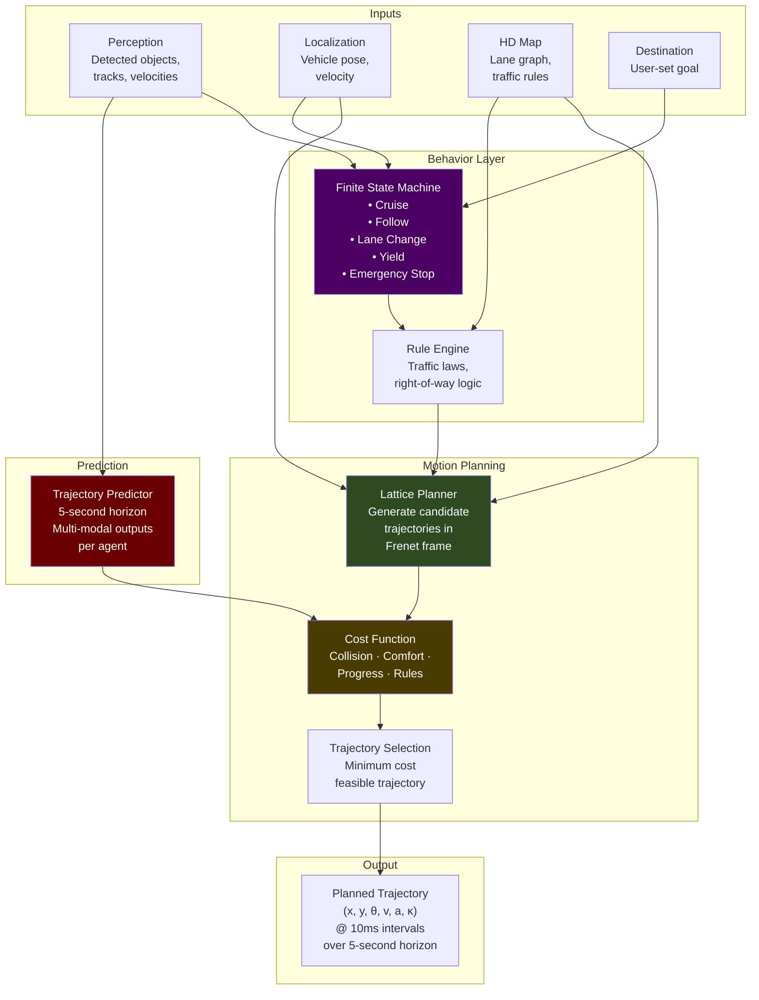
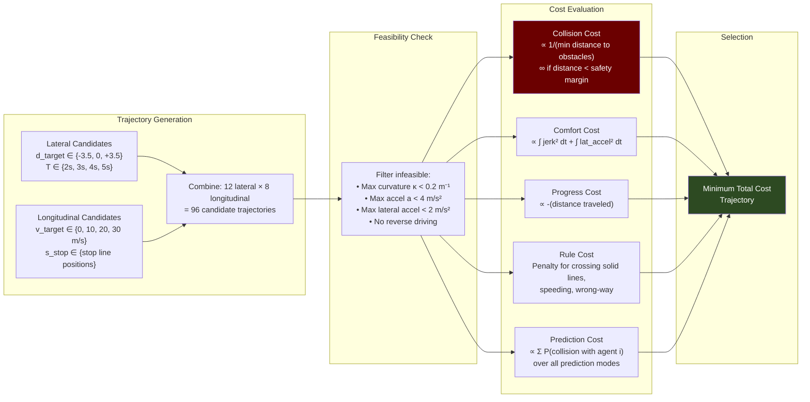

# 4. Prediction and Path Planning 🔴

> **The Problem:** The car knows where it is (Chapter 3) and what objects surround it (Chapter 2). Now it must decide **what to do**. This is the hardest problem in autonomous driving — not because the algorithms are the most complex (they are), but because the input space is unbounded. A cyclist might swerve. A pedestrian might step off the curb. A driver in the oncoming lane might be texting and drift across the center line. The prediction and planning system must model the future trajectories of every agent in the scene, generate a collision-free trajectory through 4D space (X, Y, Z, Time) that respects traffic laws, passenger comfort, and the physical limits of the vehicle — and it must do this every **40 milliseconds**, replanning from scratch as the world changes.

---

## 4.1 The Planning Architecture: Behavior → Route → Motion

Production AV planning stacks are hierarchical, splitting the problem into three layers:

| Layer | Responsibility | Horizon | Rate | Algorithm |
|-------|---------------|---------|------|-----------|
| **Behavior Planner** | High-level decisions: lane change, turn, yield, stop | 10–30 s | 5 Hz | Finite State Machine + Rule Engine |
| **Route Planner** | Lane-level path: which lanes to follow, which turns to take | 1–5 km | On route change | Graph search on lane graph (Dijkstra/A*) |
| **Motion Planner** | Precise trajectory: exact positions at exact times | 5–8 s | 25 Hz | Lattice Planner / Optimization-based |



---

## 4.2 Trajectory Prediction: What Will Other Agents Do?

Before planning our own path, we must predict where every other agent (vehicle, pedestrian, cyclist) will be over the next 5 seconds. This is inherently **multi-modal** — a car at an intersection might go straight, turn left, or turn right.

### Prediction Approaches

| Approach | How It Works | Pros | Cons |
|----------|-------------|------|------|
| **Constant Velocity** | Extrapolate current velocity | Fast, simple | Wrong for any non-linear motion |
| **Physics-based** | Bicycle model + lane constraints | Respects dynamics | Doesn't capture intent |
| **ML: Trajectron++** | Graph neural network on agent interactions | Multi-modal, captures social behavior | Requires training data, ~5ms inference |
| **ML: VectorNet** | Polyline encoding of map + agent histories | Map-aware predictions | Complex architecture |
| **ML: MotionFormer** | Transformer attention over agents + map | State-of-the-art accuracy | Highest compute cost |

### Multi-Modal Predictions

A proper prediction system outputs **multiple possible futures** for each agent, each with an associated probability:

```rust
/// Predicted future trajectory for a single agent
struct PredictedTrajectory {
    /// Sequence of (x, y, heading) at fixed time intervals
    waypoints: Vec<TrajectoryWaypoint>,
    /// Probability of this trajectory mode (all modes sum to 1.0)
    probability: f64,
    /// Semantic label for this mode
    mode: PredictionMode,
}

struct TrajectoryWaypoint {
    x: f64,
    y: f64,
    heading: f64,
    time: f64,        // seconds from now
    velocity: f64,
    /// 2D Gaussian uncertainty at this waypoint
    covariance: nalgebra::Matrix2<f64>,
}

enum PredictionMode {
    KeepLane,
    TurnLeft,
    TurnRight,
    LaneChangeLeft,
    LaneChangeRight,
    SlowDown,
    Stop,
    Jaywalking,  // pedestrians only
}

/// Prediction output for one agent: multiple possible futures
struct AgentPrediction {
    track_id: u64,
    class: ObjectClass,
    predictions: Vec<PredictedTrajectory>,
    // e.g., Car at an intersection might have:
    //   - 60% keep_lane straight
    //   - 25% turn_left
    //   - 15% turn_right
}
```

```rust
// 💥 NAIVE: Constant velocity prediction
// Extrapolates current velocity into the future — dangerously wrong

fn predict_naive(track: &TrackedObject, horizon_secs: f64) -> Vec<TrajectoryWaypoint> {
    let dt = 0.1; // 100ms intervals
    let mut waypoints = Vec::new();
    let mut t = 0.0;

    while t < horizon_secs {
        // 💥 Assumes the car will maintain its current velocity FOREVER
        // 💥 A car approaching a red light at 30 mph → prediction says it blows through
        // 💥 A car signaling left → prediction says it goes straight
        // 💥 A pedestrian at a crosswalk → prediction says they walk into traffic
        waypoints.push(TrajectoryWaypoint {
            x: track.x + track.vx * t,
            y: track.y + track.vy * t,
            heading: track.yaw,
            time: t,
            velocity: track.speed(),
            covariance: nalgebra::Matrix2::identity() * (t * 2.0), // grows linearly (wrong)
        });
        t += dt;
    }
    waypoints
}
```

```rust
// ✅ PRODUCTION: Map-aware multi-modal prediction
// Uses HD map lane graph to constrain predictions to realistic paths

fn predict_map_aware(
    track: &TrackedObject,
    lane_graph: &LaneGraph,
    horizon_secs: f64,
) -> Vec<PredictedTrajectory> {
    let mut predictions = Vec::new();

    // Find the lane(s) the agent is currently in or near
    let candidate_lanes = lane_graph.find_nearby_lanes(
        track.x, track.y, track.yaw,
        /*max_lateral_distance=*/ 3.0,
    );

    for lane in &candidate_lanes {
        // For each lane, compute possible route continuations
        let routes = lane_graph.get_reachable_routes(lane, horizon_secs * track.speed());

        for route in &routes {
            // Project the agent's current state onto this route
            let trajectory = project_along_route(track, route, horizon_secs);

            // Estimate probability based on:
            // - Current lane alignment (is the agent already turning?)
            // - Turn signal state (if detectable from perception)
            // - Distance to intersection
            // - Historical behavior at this location
            let probability = compute_route_probability(track, route, lane);

            predictions.push(PredictedTrajectory {
                waypoints: trajectory,
                probability,
                mode: route.semantic_mode(),
            });
        }
    }

    // Normalize probabilities
    let total: f64 = predictions.iter().map(|p| p.probability).sum();
    for pred in &mut predictions {
        pred.probability /= total;
    }

    predictions
}
```

---

## 4.3 The Frenet Frame: Simplifying the Planning Problem

Instead of planning in Cartesian (x, y) coordinates, motion planners operate in the **Frenet frame** — a curvilinear coordinate system aligned with the reference lane:

| Frenet Coordinate | Meaning |
|-------------------|---------|
| $s$ | **Longitudinal distance** along the lane centerline (meters) |
| $d$ | **Lateral offset** from the lane centerline (meters, positive = left) |
| $\dot{s}$ | Longitudinal velocity (speed along lane) |
| $\dot{d}$ | Lateral velocity (rate of lane change) |
| $\ddot{s}$ | Longitudinal acceleration |
| $\ddot{d}$ | Lateral acceleration (comfort-critical) |

### Why Frenet Is Better Than Cartesian

```
Cartesian planning on a curved road:
  ┌─────────────────────────┐
  │  The road curves. In    │
  │  Cartesian, "go straight"│
  │  means different things  │
  │  depending on where you  │
  │  are on the curve. Lane  │
  │  keeping is a nonlinear  │
  │  optimization problem.   │
  └─────────────────────────┘

Frenet planning on the same road:
  ┌─────────────────────────┐
  │  In Frenet, "go straight"│
  │  means d=0 (stay on     │
  │  centerline). Lane       │
  │  keeping is trivially    │
  │  d_target = 0. Lane      │
  │  change is d_target =    │
  │  ±3.5m. Planning along   │
  │  s is decoupled from     │
  │  road curvature.         │
  └─────────────────────────┘
```

---

## 4.4 The Lattice Planner

The lattice planner generates a dense set of candidate trajectories in Frenet space and evaluates each against a multi-objective cost function. The trajectory with the minimum feasible cost is selected.

### Trajectory Generation

For each planning cycle, the planner generates candidates along two axes:

**Longitudinal (s-axis) — speed profiles:**
- Maintain current speed
- Accelerate to target speed
- Decelerate to stop at specific $s$ position
- Follow lead vehicle (adaptive cruise)

**Lateral (d-axis) — lane profiles:**
- Stay in current lane ($d = 0$)
- Change to left lane ($d = -3.5$)
- Change to right lane ($d = +3.5$)
- Nudge around obstacle ($d = \pm 1.0$)

Each trajectory is represented as a quintic polynomial in time:

$$d(t) = a_0 + a_1 t + a_2 t^2 + a_3 t^3 + a_4 t^4 + a_5 t^5$$

The coefficients are determined by the boundary conditions:

$$d(0) = d_0, \quad \dot{d}(0) = \dot{d}_0, \quad \ddot{d}(0) = \ddot{d}_0$$
$$d(T) = d_T, \quad \dot{d}(T) = 0, \quad \ddot{d}(T) = 0$$



### Cost Function Implementation

```rust
// ✅ PRODUCTION: Multi-objective trajectory cost function

struct TrajectoryCost {
    collision: f64,       // Weight: 1000.0 (dominant — safety first)
    prediction: f64,      // Weight: 500.0  (future collision risk)
    comfort_jerk: f64,    // Weight: 10.0   (passenger comfort)
    comfort_lateral: f64, // Weight: 20.0   (lateral acceleration)
    progress: f64,        // Weight: 5.0    (make forward progress)
    rule_violation: f64,  // Weight: 200.0  (traffic law compliance)
    lane_center: f64,     // Weight: 2.0    (prefer lane center)
}

impl TrajectoryCost {
    fn total(&self) -> f64 {
        1000.0 * self.collision
            + 500.0 * self.prediction
            + 10.0 * self.comfort_jerk
            + 20.0 * self.comfort_lateral
            + 5.0 * self.progress
            + 200.0 * self.rule_violation
            + 2.0 * self.lane_center
    }
}

fn evaluate_trajectory(
    trajectory: &PlannedTrajectory,
    obstacles: &[TrackedObject],
    predictions: &[AgentPrediction],
    lane_graph: &LaneGraph,
    traffic_rules: &TrafficRules,
) -> TrajectoryCost {
    let mut cost = TrajectoryCost::default();

    // === COLLISION COST ===
    // Check every point along trajectory against every obstacle
    for waypoint in &trajectory.waypoints {
        for obstacle in obstacles {
            let distance = ego_obstacle_distance(waypoint, obstacle);
            let safety_margin = safety_margin_for_class(obstacle.class);

            if distance < safety_margin {
                // Hard collision — infinite cost, immediately discard
                cost.collision = f64::INFINITY;
                return cost;
            }

            // Soft cost: exponential decay from safety margin
            cost.collision += (-(distance - safety_margin) / 2.0).exp();
        }
    }

    // === PREDICTION COST ===
    // For each agent, sum collision probability across all prediction modes
    for agent_pred in predictions {
        for predicted_traj in &agent_pred.predictions {
            let collision_prob = compute_collision_probability(
                trajectory,
                predicted_traj,
            );
            cost.prediction += predicted_traj.probability * collision_prob;
        }
    }

    // === COMFORT COST ===
    // Penalize jerk (derivative of acceleration) — causes motion sickness
    for window in trajectory.waypoints.windows(3) {
        let jerk_lon = (window[2].accel - 2.0 * window[1].accel + window[0].accel)
            / (trajectory.dt * trajectory.dt);
        let jerk_lat = (window[2].lateral_accel - 2.0 * window[1].lateral_accel
            + window[0].lateral_accel) / (trajectory.dt * trajectory.dt);

        cost.comfort_jerk += jerk_lon * jerk_lon;
        cost.comfort_lateral += window[1].lateral_accel.abs();
    }

    // === PROGRESS COST ===
    // Reward forward movement (negative cost = incentive)
    let final_s = trajectory.waypoints.last().unwrap().s;
    let initial_s = trajectory.waypoints.first().unwrap().s;
    cost.progress = -(final_s - initial_s); // Negative: more progress = lower cost

    // === RULE VIOLATION COST ===
    for waypoint in &trajectory.waypoints {
        if traffic_rules.crosses_solid_line(waypoint) {
            cost.rule_violation += 10.0;
        }
        if traffic_rules.exceeds_speed_limit(waypoint) {
            cost.rule_violation += 5.0 * (waypoint.velocity - traffic_rules.speed_limit(waypoint));
        }
        if traffic_rules.runs_red_light(waypoint) {
            cost.rule_violation = f64::INFINITY; // Non-negotiable
            return cost;
        }
    }

    // === LANE CENTER COST ===
    for waypoint in &trajectory.waypoints {
        cost.lane_center += waypoint.d.abs(); // d = lateral offset from center
    }

    cost
}
```

---

## 4.5 A* Search for Route Planning

The route planner uses A* on the HD Map's **lane graph** to find the optimal sequence of lanes from the current position to the destination. Each node is a lane segment; edges represent legal transitions (lane continuation, lane change, intersection crossing).

```rust
// ✅ PRODUCTION: A* route search on the lane graph

use std::collections::BinaryHeap;
use std::cmp::Reverse;

struct LaneNode {
    lane_id: u64,
    /// Entry point on this lane segment (Frenet s-coordinate)
    s_entry: f64,
    /// Length of this lane segment
    length: f64,
    /// Speed limit on this lane
    speed_limit: f64,
    /// Adjacent lanes (for lane changes)
    left_neighbor: Option<u64>,
    right_neighbor: Option<u64>,
    /// Next lanes at the end of this segment (for intersections)
    successors: Vec<u64>,
}

fn a_star_route(
    graph: &LaneGraph,
    start_lane: u64,
    goal_lane: u64,
) -> Option<Vec<u64>> {
    let mut open_set = BinaryHeap::new();
    let mut came_from: HashMap<u64, u64> = HashMap::new();
    let mut g_score: HashMap<u64, f64> = HashMap::new();

    g_score.insert(start_lane, 0.0);
    let h = heuristic_distance(graph, start_lane, goal_lane);
    open_set.push(Reverse((OrderedFloat(h), start_lane)));

    while let Some(Reverse((_, current))) = open_set.pop() {
        if current == goal_lane {
            return Some(reconstruct_path(&came_from, current));
        }

        let current_g = g_score[&current];
        let current_node = &graph.nodes[&current];

        // Explore all reachable lanes from this one
        let mut neighbors = Vec::new();

        // Successor lanes (continuing forward or through intersection)
        for &succ in &current_node.successors {
            neighbors.push((succ, current_node.length / current_node.speed_limit));
        }

        // Lane changes (if legal)
        if let Some(left) = current_node.left_neighbor {
            if graph.lane_change_legal(current, left) {
                neighbors.push((left, LANE_CHANGE_COST));
            }
        }
        if let Some(right) = current_node.right_neighbor {
            if graph.lane_change_legal(current, right) {
                neighbors.push((right, LANE_CHANGE_COST));
            }
        }

        for (neighbor_id, edge_cost) in neighbors {
            let tentative_g = current_g + edge_cost;

            if tentative_g < *g_score.get(&neighbor_id).unwrap_or(&f64::INFINITY) {
                came_from.insert(neighbor_id, current);
                g_score.insert(neighbor_id, tentative_g);
                let h = heuristic_distance(graph, neighbor_id, goal_lane);
                open_set.push(Reverse((OrderedFloat(tentative_g + h), neighbor_id)));
            }
        }
    }

    None // No route found
}

/// Heuristic: Euclidean distance / max speed limit = minimum time estimate
fn heuristic_distance(graph: &LaneGraph, from: u64, to: u64) -> f64 {
    let from_pos = graph.lane_center(from);
    let to_pos = graph.lane_center(to);
    let euclidean = ((from_pos.0 - to_pos.0).powi(2) + (from_pos.1 - to_pos.1).powi(2)).sqrt();
    euclidean / MAX_SPEED_LIMIT // Admissible: never overestimates
}
```

---

## 4.6 The Behavior Layer: Handling Complex Scenarios

The behavior planner encodes the rules of driving as a finite state machine augmented with scene-specific logic:

```rust
/// Top-level driving behavior states
enum BehaviorState {
    /// Following the route, maintaining speed
    Cruise { target_speed: f64 },

    /// Following a lead vehicle (adaptive cruise control)
    Follow {
        lead_vehicle_id: u64,
        following_time_gap: f64,  // seconds
    },

    /// Preparing to change lanes
    LaneChange {
        direction: LaneChangeDirection,
        target_lane: u64,
        progress: f64,  // 0.0 = not started, 1.0 = complete
    },

    /// Yielding at an intersection or to a pedestrian
    Yield {
        reason: YieldReason,
        yield_line_s: f64,  // Frenet s where we must stop
    },

    /// Emergency: maximum deceleration
    EmergencyStop {
        trigger: EmergencyTrigger,
    },
}

/// The decision function — called at 5 Hz
fn update_behavior(
    current_state: &BehaviorState,
    perception: &PerceptionOutput,
    localization: &VehiclePose,
    traffic_rules: &TrafficRules,
) -> BehaviorState {
    // Always check for emergencies first — highest priority
    if let Some(emergency) = check_emergency(perception) {
        return BehaviorState::EmergencyStop { trigger: emergency };
    }

    // Check yield conditions (red lights, stop signs, pedestrians in crosswalk)
    if let Some(yield_reason) = check_yield_conditions(perception, traffic_rules, localization) {
        return BehaviorState::Yield {
            reason: yield_reason,
            yield_line_s: compute_yield_line(yield_reason, localization),
        };
    }

    match current_state {
        BehaviorState::Cruise { target_speed } => {
            // Check if we need to follow someone
            if let Some(lead) = find_lead_vehicle(perception, localization) {
                if lead.time_gap < 3.0 {
                    return BehaviorState::Follow {
                        lead_vehicle_id: lead.track_id,
                        following_time_gap: 2.0,
                    };
                }
            }

            // Check if we should change lanes (for route or to pass slow traffic)
            if should_change_lanes(perception, localization, traffic_rules) {
                let direction = choose_lane_change_direction(perception, localization);
                let target = compute_target_lane(localization, direction);
                return BehaviorState::LaneChange {
                    direction,
                    target_lane: target,
                    progress: 0.0,
                };
            }

            BehaviorState::Cruise { target_speed: *target_speed }
        }

        BehaviorState::Follow { lead_vehicle_id, following_time_gap } => {
            // Check if lead vehicle has cleared
            if !perception.has_track(*lead_vehicle_id) {
                return BehaviorState::Cruise {
                    target_speed: traffic_rules.current_speed_limit(localization),
                };
            }

            *current_state
        }

        // ... other state transitions
        _ => current_state.clone(),
    }
}
```

---

## 4.7 The Unprotected Left Turn: A Case Study

The unprotected left turn — turning left across oncoming traffic without a dedicated green arrow — is widely considered the most dangerous maneuver an AV must handle. It requires:

1. Predicting oncoming vehicles' speeds and intentions
2. Estimating available gaps in traffic
3. Committing to or aborting the turn — **hesitation is deadly**
4. Yielding to pedestrians in the crosswalk of the turn

```
Scenario: Unprotected left turn at 4-way intersection

                 Oncoming traffic
                 ← ← ← ← ← ← ←
    ─────────────────────────────────
    ─────────────────────────────────
    → → [EGO] ↗                     
    ─────────────────────────────────
    ─────────────────────────────────

    Decision parameters:
    - Gap in oncoming traffic: 4.2 seconds
    - Time to complete turn: 3.8 seconds
    - Safety margin required: 1.5 seconds
    - Gap sufficient? 4.2 > 3.8 + 1.5? NO → WAIT
    - Next gap: 6.1 seconds → 6.1 > 5.3? YES → GO

    Abort criteria (during turn):
    - Oncoming vehicle accelerates unexpectedly
    - Pedestrian enters crosswalk
    - Turn completion time estimate increases (wheel slip, slow steering)
```

```rust
/// Unprotected left turn decision logic
fn evaluate_left_turn_gap(
    oncoming_vehicles: &[AgentPrediction],
    pedestrians_in_crosswalk: &[AgentPrediction],
    ego_turn_time_estimate: f64,        // e.g., 3.8 seconds
    safety_margin: f64,                  // e.g., 1.5 seconds
) -> TurnDecision {
    let required_gap = ego_turn_time_estimate + safety_margin;

    // Check for pedestrians first — absolute veto
    for ped in pedestrians_in_crosswalk {
        let ped_clear_time = estimate_pedestrian_clear_time(ped);
        if ped_clear_time > 0.0 {
            return TurnDecision::Wait {
                reason: "Pedestrian in crosswalk",
            };
        }
    }

    // Find the next gap in oncoming traffic
    let gap = find_next_traffic_gap(oncoming_vehicles);

    match gap {
        Some(gap) if gap.duration >= required_gap => {
            // Gap is large enough — commit to turn
            TurnDecision::Go {
                commit_time: gap.start_time,
                abort_deadline: gap.start_time + 1.0, // Must abort within 1s if needed
            }
        }
        Some(gap) => {
            TurnDecision::Wait {
                reason: "Gap too small",
            }
        }
        None => {
            // No gap visible — dense traffic
            // After 60 seconds, consider creep-and-go strategy
            TurnDecision::Wait {
                reason: "No gap in oncoming traffic",
            }
        }
    }
}
```

---

## 4.8 Handling Occlusion: The Invisible Pedestrian Problem

The most dangerous agents are the ones you **cannot see**. A pedestrian occluded by a parked van might step into the road at any moment. Production planners must reason about **occluded space**.

```rust
/// For each occluded region adjacent to the drivable path,
/// assume a worst-case phantom agent will emerge
fn compute_occlusion_risk(
    ego_trajectory: &PlannedTrajectory,
    occlusion_map: &OcclusionGrid,
) -> f64 {
    let mut total_risk = 0.0;

    for waypoint in &ego_trajectory.waypoints {
        // Check all occlusion boundaries within 20m of the trajectory
        for boundary in occlusion_map.boundaries_near(waypoint.x, waypoint.y, 20.0) {
            // Worst case: a pedestrian at the occlusion boundary starts
            // walking toward our trajectory at 1.5 m/s
            let distance_to_path = boundary.distance_to_trajectory_at(waypoint);
            let time_for_ped_to_reach = distance_to_path / WORST_CASE_PED_SPEED;

            // If we arrive at this trajectory point before the phantom
            // pedestrian could cross, we're safe. If not, add risk.
            if waypoint.time < time_for_ped_to_reach + REACTION_TIME {
                // We'd arrive before we could react to an emerging pedestrian
                total_risk += (1.0 - time_for_ped_to_reach / waypoint.time).max(0.0);
            }
        }
    }

    total_risk
}
```

---

> **Key Takeaways**
>
> 1. **Planning is hierarchical: Behavior → Route → Motion.** Each layer operates at a different time horizon and frequency. The behavior layer decides *what* to do; the motion planner decides *how* to do it.
> 2. **Prediction must be multi-modal.** A car at an intersection has multiple possible futures. Planning against only the most likely prediction is insufficient — you must plan against the probability-weighted ensemble.
> 3. **The Frenet frame decouples longitudinal and lateral planning,** making the problem tractable. Planning curves in Cartesian space on a curved road is needlessly complex.
> 4. **Lattice planners generate candidates, cost functions select.** The art is in the cost function: collision avoidance weight dominates, but comfort, progress, and rule compliance all matter for a production-quality ride.
> 5. **Unprotected left turns are the hardest maneuver** because they require predicting oncoming traffic gaps, committing to an irreversible action, and maintaining an abort option until the point of no return.
> 6. **Occlusion reasoning is mandatory.** The planner must assume the worst-case agent could emerge from any occluded region adjacent to the path, and slow down accordingly. Driving past parked cars at full speed is negligent, not confident.
> 7. **Replanning at 25 Hz is non-negotiable.** The world changes every 40ms. A trajectory planned 200ms ago is stale and potentially unsafe. The planner must be fast enough to replan from scratch every cycle.
