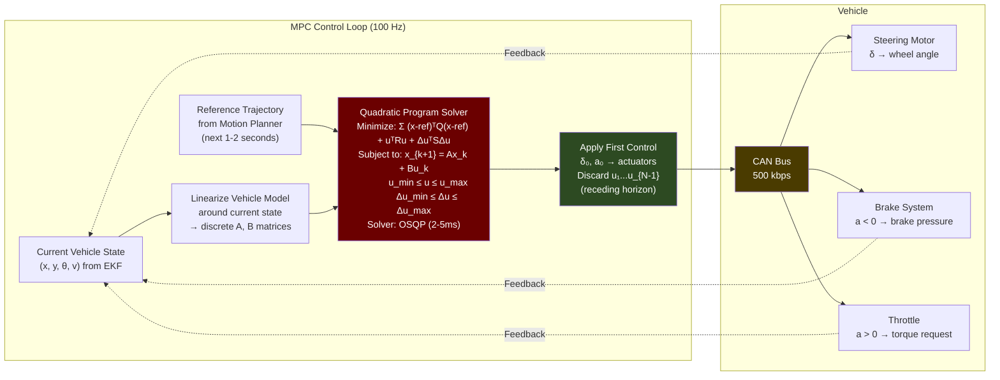
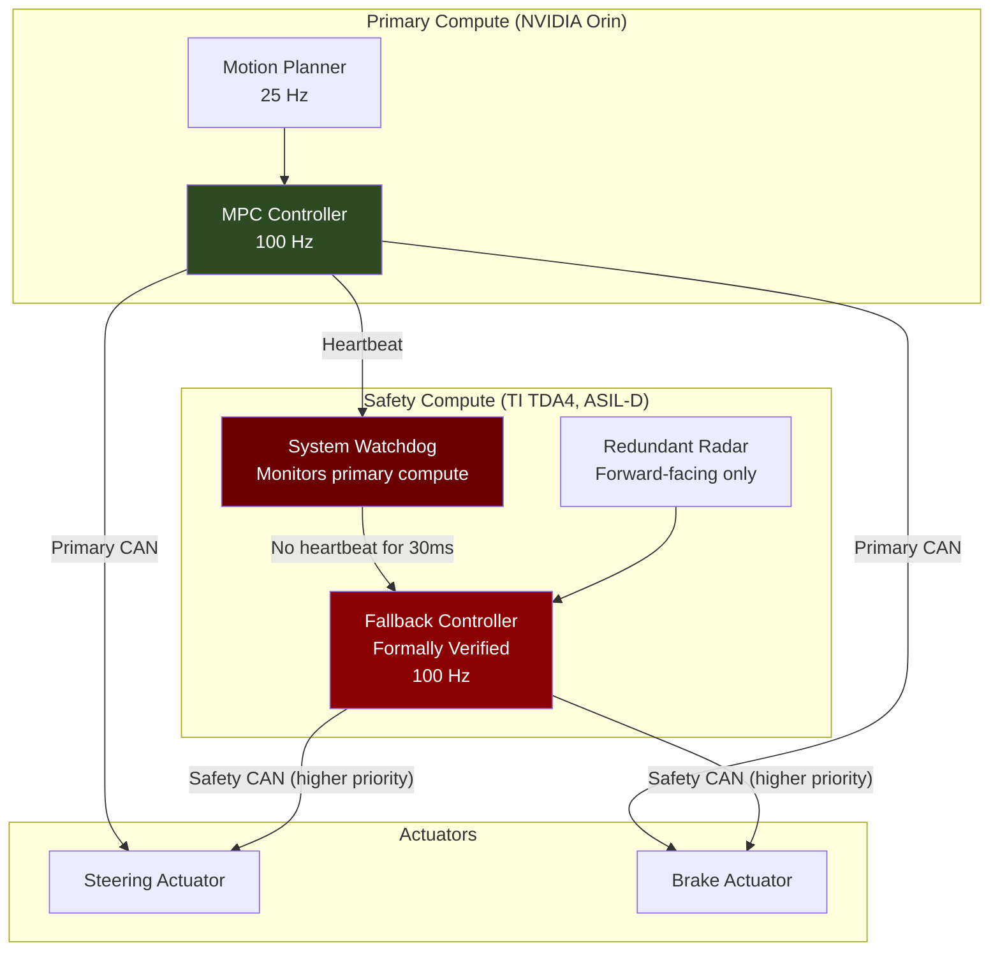

# 5. Control Theory — Actuation 🔴

> **The Problem:** The planning module outputs a beautiful, collision-free trajectory — a sequence of $(x, y, \theta, v, \kappa)$ waypoints at 10ms intervals over a 5-second horizon. But the vehicle is not a point mass. It is a 2,000 kg machine with tire friction that varies with temperature and road surface, suspension that shifts weight during braking, steering linkage with backlash and delay, and brake hydraulics that take 30–80ms to respond. A simple PID controller that tracks the trajectory point-by-point will oscillate at highway speeds, overshoot in turns, and fail catastrophically on wet roads. The control system must solve an **optimization problem** at every timestep: find the sequence of steering angle, throttle, and brake commands that minimizes tracking error **over a future time horizon**, subject to the vehicle's physical dynamics, actuator limits, and passenger comfort constraints. This is **Model Predictive Control (MPC)**.

---

## 5.1 The Vehicle Dynamics Model

Before we can control the vehicle, we need a mathematical model of how it responds to inputs. The model must be accurate enough to predict behavior 1–2 seconds into the future, yet simple enough to solve in < 10ms.

### The Bicycle Model

The most widely used simplified vehicle dynamics model treats the car as a bicycle — collapsing the two front wheels into one and the two rear wheels into one:

```
        δ (steering angle)
        ↓
    ┌──[Front Wheel]──┐
    │                  │
    │    L (wheelbase) │
    │                  │
    └──[Rear Wheel]───┘
         ↑
         (x, y, θ) — vehicle state at rear axle
```

State vector:

$$\mathbf{x} = \begin{bmatrix} x \\ y \\ \theta \\ v \end{bmatrix}$$

Control inputs:

$$\mathbf{u} = \begin{bmatrix} \delta \\ a \end{bmatrix}$$

Where $\delta$ is the front wheel steering angle and $a$ is the longitudinal acceleration (positive = throttle, negative = brake).

**Kinematic bicycle model** (valid at low-to-moderate speeds):

$$\dot{x} = v \cos(\theta)$$
$$\dot{y} = v \sin(\theta)$$
$$\dot{\theta} = \frac{v}{L} \tan(\delta)$$
$$\dot{v} = a$$

Where $L$ is the wheelbase (distance between front and rear axles).

**Dynamic bicycle model** (required at high speeds where tire slip matters):

$$\dot{v}_x = a_x + v_y \cdot r$$
$$\dot{v}_y = \frac{F_{yf} + F_{yr}}{m} - v_x \cdot r$$
$$\dot{r} = \frac{L_f \cdot F_{yf} - L_r \cdot F_{yr}}{I_z}$$

Where:
- $v_x, v_y$ = longitudinal and lateral velocities
- $r$ = yaw rate
- $F_{yf}, F_{yr}$ = lateral tire forces (front, rear) — from the tire model
- $m$ = vehicle mass
- $I_z$ = yaw moment of inertia
- $L_f, L_r$ = distance from CG to front/rear axle

### Tire Force Model (Pacejka "Magic Formula")

Tire forces are the **critical nonlinearity** that separates toy simulations from production control. The Pacejka tire model:

$$F_y = D \sin\left(C \arctan\left(B\alpha - E(B\alpha - \arctan(B\alpha))\right)\right)$$

Where $\alpha$ is the tire slip angle and $B, C, D, E$ are empirically determined coefficients that depend on tire compound, temperature, and road surface.

| Coefficient | Dry Asphalt | Wet Asphalt | Ice |
|-------------|-------------|-------------|-----|
| $B$ (stiffness) | 10.0 | 8.0 | 4.0 |
| $C$ (shape) | 1.9 | 1.9 | 2.0 |
| $D$ (peak force) | $\mu \cdot F_z$ | $0.7 \cdot F_z$ | $0.1 \cdot F_z$ |
| $E$ (curvature) | 0.97 | 0.95 | 0.90 |

```rust
/// Pacejka Magic Formula tire model
fn tire_lateral_force(slip_angle: f64, normal_force: f64, surface: &RoadSurface) -> f64 {
    let (b, c, d_coeff, e) = match surface {
        RoadSurface::DryAsphalt => (10.0, 1.9, 1.0, 0.97),
        RoadSurface::WetAsphalt => (8.0, 1.9, 0.7, 0.95),
        RoadSurface::Snow       => (5.0, 2.0, 0.3, 0.92),
        RoadSurface::Ice        => (4.0, 2.0, 0.1, 0.90),
    };

    let d = d_coeff * normal_force;
    let b_alpha = b * slip_angle;
    d * (c * (b_alpha - e * (b_alpha - b_alpha.atan())).atan()).sin()
}
```

---

## 5.2 Why PID Fails at Highway Speeds

A PID (Proportional-Integral-Derivative) controller is the simplest possible control law:

$$u(t) = K_p \cdot e(t) + K_i \int_0^t e(\tau) d\tau + K_d \cdot \dot{e}(t)$$

Where $e(t)$ is the tracking error (cross-track error for steering, speed error for throttle).

### PID's Fatal Flaws for AV Control

```rust
// 💥 NAIVE: PID lateral controller
// Tracks the nearest waypoint on the reference trajectory

fn pid_steering(
    cross_track_error: f64,   // lateral distance from trajectory
    heading_error: f64,       // angular mismatch
    prev_error: f64,
    integral: &mut f64,
    dt: f64,
) -> f64 {
    let kp = 1.2;
    let ki = 0.01;
    let kd = 0.8;

    *integral += cross_track_error * dt;
    let derivative = (cross_track_error - prev_error) / dt;

    let steering = kp * cross_track_error + ki * *integral + kd * derivative;

    steering.clamp(-0.5, 0.5) // Clamp to physical limits

    // 💥 PROBLEM 1: PID is REACTIVE — it only responds to CURRENT error.
    //    It cannot anticipate an upcoming sharp curve and pre-steer.
    //    Result: car overshoots every curve entry.

    // 💥 PROBLEM 2: PID is SINGLE-INPUT-SINGLE-OUTPUT.
    //    Steering and speed are coupled (faster = wider turn radius).
    //    PID controls them independently → oscillation at high speed.

    // 💥 PROBLEM 3: PID has NO model of the vehicle.
    //    It doesn't know the car's mass, tire grip, or speed.
    //    Tuned for 30 mph? It oscillates at 60 mph.
    //    Tuned for dry road? It spins on wet road.

    // 💥 PROBLEM 4: PID cannot handle CONSTRAINTS.
    //    It might command steering angles beyond physical limits,
    //    or accelerations that exceed tire grip.
    //    Clamping is a hack, not constraint satisfaction.
}
```

| | PID | MPC |
|---|---|---|
| Reacts to | Current error only | Error over future horizon (predictive) |
| Vehicle model | None | Full dynamic model |
| Constraint handling | Clamping (post-hoc) | Native constraint satisfaction |
| MIMO coupling | Independent SISO loops | Coupled multi-input multi-output |
| Tuning | 3 gains, speed-dependent | Cost weights, more principled |
| Compute cost | Trivial | 1–5 ms solve (QP/NLP) |
| Adaptability | Fixed gains | Re-optimizes every cycle |

---

## 5.3 Model Predictive Control (MPC)

MPC solves an optimization problem at every control cycle: find the optimal control sequence over a finite horizon that minimizes a cost function subject to the vehicle dynamics model and constraints.

### The MPC Formulation

At each timestep $t$, solve:

$$\min_{\mathbf{u}_0, \ldots, \mathbf{u}_{N-1}} \sum_{k=0}^{N-1} \left[ \|\mathbf{x}_k - \mathbf{x}_k^{\text{ref}}\|_{\mathbf{Q}}^2 + \|\mathbf{u}_k\|_{\mathbf{R}}^2 + \|\Delta\mathbf{u}_k\|_{\mathbf{S}}^2 \right] + \|\mathbf{x}_N - \mathbf{x}_N^{\text{ref}}\|_{\mathbf{Q}_f}^2$$

Subject to:

$$\mathbf{x}_{k+1} = f(\mathbf{x}_k, \mathbf{u}_k) \quad \text{(vehicle dynamics)}$$
$$\mathbf{u}_{\min} \leq \mathbf{u}_k \leq \mathbf{u}_{\max} \quad \text{(actuator limits)}$$
$$\Delta\mathbf{u}_{\min} \leq \Delta\mathbf{u}_k \leq \Delta\mathbf{u}_{\max} \quad \text{(rate limits)}$$
$$\mathbf{x}_k \in \mathcal{X}_{\text{safe}} \quad \text{(state constraints)}$$

Where:
- $N$ = prediction horizon (typically 20–50 steps at 50ms = 1–2.5 seconds)
- $\mathbf{Q}$ = state tracking cost (penalize deviation from reference trajectory)
- $\mathbf{R}$ = control effort cost (penalize large steering/braking)
- $\mathbf{S}$ = control rate cost (penalize jerky commands — passenger comfort)
- $\mathbf{Q}_f$ = terminal cost (ensure stability at end of horizon)

### MPC Cost Matrices

```rust
/// MPC tuning parameters — the soul of vehicle behavior
struct MpcConfig {
    /// Prediction horizon [steps]
    horizon: usize,          // 20 steps × 50ms = 1.0 second lookahead
    /// Control interval [seconds]
    dt: f64,                 // 0.05s = 50ms per step

    /// State cost weights Q = diag(q_x, q_y, q_theta, q_v)
    q_lateral: f64,          // 500.0 — aggressive lateral tracking
    q_heading: f64,          // 200.0 — heading alignment
    q_velocity: f64,         // 10.0  — speed tracking (less critical)

    /// Control effort weights R = diag(r_delta, r_accel)
    r_steering: f64,         // 50.0  — penalize large steering angles
    r_acceleration: f64,     // 10.0  — penalize harsh braking/accel

    /// Control rate weights S = diag(s_ddelta, s_daccel)
    s_steering_rate: f64,    // 1000.0 — heavily penalize jerky steering
    s_accel_rate: f64,       // 100.0  — penalize jerk (comfort)

    /// Actuator limits
    max_steering_angle: f64,      // 0.52 rad (≈30°)
    max_steering_rate: f64,       // 0.35 rad/s
    max_acceleration: f64,        // 3.0 m/s² (comfortable)
    max_deceleration: f64,        // -8.0 m/s² (emergency)
    max_jerk: f64,                // 2.0 m/s³ (comfort limit)
}
```



### The Receding Horizon Principle

MPC solves for $N$ future control inputs $[\mathbf{u}_0, \mathbf{u}_1, \ldots, \mathbf{u}_{N-1}]$ but **only applies the first one** ($\mathbf{u}_0$). At the next timestep, it resolves the entire problem with updated state. This "receding horizon" approach gives MPC its robustness: it continuously re-optimizes as conditions change.

---

## 5.4 MPC Implementation

```rust
// ✅ PRODUCTION: MPC Controller using OSQP (Operator Splitting Quadratic Program)

use osqp::{CscMatrix, Problem, Settings};

struct MpcController {
    config: MpcConfig,
    /// Vehicle model parameters
    wheelbase: f64,       // 2.85m
    mass: f64,            // 1800 kg
    moment_inertia: f64,  // 3200 kg⋅m²

    /// Pre-allocated matrices for the QP
    /// Avoid allocation in the hot path
    h_matrix: Vec<f64>,    // Hessian (cost)
    a_matrix: Vec<f64>,    // Constraint matrix
    gradient: Vec<f64>,    // Linear cost term
    lower_bounds: Vec<f64>,
    upper_bounds: Vec<f64>,

    /// Previous solution (warm start for faster convergence)
    prev_solution: Vec<f64>,
}

impl MpcController {
    /// Solve the MPC problem and return the optimal control command.
    /// Must complete in < 8ms to leave 2ms margin in the 10ms cycle.
    fn solve(
        &mut self,
        current_state: &VehicleState,
        reference_trajectory: &[TrajectoryPoint],
    ) -> ActuatorCommand {
        let n = self.config.horizon;

        // Step 1: Linearize the vehicle model around the current operating point
        // x_{k+1} = A_d * x_k + B_d * u_k
        let (a_d, b_d) = self.linearize_and_discretize(current_state);

        // Step 2: Build the QP problem
        // Decision variables: [u_0, u_1, ..., u_{N-1}] (2N variables: steering + accel)
        let num_vars = 2 * n;

        // Build Hessian H = B^T Q B + R + S (precomputed structure, update values)
        self.build_hessian(&a_d, &b_d, reference_trajectory);

        // Build gradient f = -2 * B^T Q * (x_ref - A*x_0)
        self.build_gradient(&a_d, &b_d, current_state, reference_trajectory);

        // Build constraint matrix and bounds
        // Constraints: actuator limits + rate limits
        self.build_constraints(current_state);

        // Step 3: Solve with OSQP
        let settings = Settings::default()
            .warm_start(true)           // Use previous solution
            .max_iter(200)              // Hard limit on iterations
            .eps_abs(1e-4)              // Sufficient precision
            .eps_rel(1e-4)
            .time_limit(0.005);         // 5ms hard deadline

        let mut problem = Problem::new(
            CscMatrix::from(&self.h_matrix),
            &self.gradient,
            CscMatrix::from(&self.a_matrix),
            &self.lower_bounds,
            &self.upper_bounds,
            &settings,
        ).expect("QP setup failed");

        // Warm start: seed with shifted previous solution
        problem.warm_start_x(&self.prev_solution);

        let result = problem.solve();

        // Step 4: Extract first control input (receding horizon)
        let (steering, acceleration) = match result.x() {
            Some(x) => {
                self.prev_solution = x.to_vec();
                // Shift for warm start next cycle
                self.prev_solution.rotate_left(2);
                (x[0], x[1])
            }
            None => {
                // 🚨 QP solver failed — use fallback
                // Extrapolate from previous solution
                log::error!("MPC QP solver failed — using fallback");
                (self.prev_solution[2], self.prev_solution[3])
            }
        };

        // Step 5: Convert to actuator commands
        ActuatorCommand {
            steering_angle: steering.clamp(
                -self.config.max_steering_angle,
                self.config.max_steering_angle,
            ),
            acceleration: acceleration.clamp(
                self.config.max_deceleration,
                self.config.max_acceleration,
            ),
            timestamp: current_state.timestamp,
        }
    }

    /// Linearize the nonlinear bicycle model around current state
    /// and discretize using zero-order hold (ZOH)
    fn linearize_and_discretize(
        &self,
        state: &VehicleState,
    ) -> (nalgebra::SMatrix<f64, 4, 4>, nalgebra::SMatrix<f64, 4, 2>) {
        let v = state.velocity;
        let theta = state.heading;
        let delta = state.steering_angle;
        let dt = self.config.dt;
        let l = self.wheelbase;

        // Jacobian of bicycle model w.r.t. state
        // A_c = df/dx evaluated at current state
        let a_c = nalgebra::SMatrix::<f64, 4, 4>::new(
            0.0, 0.0, -v * theta.sin(), theta.cos(),
            0.0, 0.0,  v * theta.cos(), theta.sin(),
            0.0, 0.0,  0.0,             delta.tan() / l,
            0.0, 0.0,  0.0,             0.0,
        );

        // Jacobian of bicycle model w.r.t. control input
        // B_c = df/du
        let b_c = nalgebra::SMatrix::<f64, 4, 2>::new(
            0.0,                                0.0,
            0.0,                                0.0,
            v / (l * delta.cos() * delta.cos()), 0.0,
            0.0,                                1.0,
        );

        // Discretize: A_d = I + A_c * dt,  B_d = B_c * dt
        // (Euler discretization — sufficient for 50ms steps at moderate speed)
        let i = nalgebra::SMatrix::<f64, 4, 4>::identity();
        let a_d = i + a_c * dt;
        let b_d = b_c * dt;

        (a_d, b_d)
    }
}
```

---

## 5.5 Actuator Interface: CAN Bus Communication

The final step: converting the MPC output into electrical signals on the CAN (Controller Area Network) bus that physically move the steering motor, engage the brakes, and command the throttle.

```rust
/// CAN Bus message definitions for vehicle actuation
/// These are vehicle-specific — every OEM has different CAN databases

/// Steering command (sent at 100 Hz to steering ECU)
struct SteeringCommand {
    /// Target steering angle in degrees × 10 (fixed-point on CAN)
    /// Range: -5000 to +5000 (±500°, covers full steering ratio)
    angle_deg_x10: i16,
    /// Torque overlay request (Nm × 100)
    torque_nm_x100: i16,
    /// Rolling counter (0–15, incremented each message for integrity)
    rolling_counter: u8,
    /// CRC-8 checksum (SAE J1850 polynomial)
    checksum: u8,
}

/// Brake command (sent at 100 Hz to ESP/brake ECU)
struct BrakeCommand {
    /// Target deceleration in m/s² × 100
    /// Range: 0 to -1000 (0 to -10 m/s²)
    decel_ms2_x100: i16,
    /// Brake mode
    mode: BrakeMode,
    /// Rolling counter + CRC
    rolling_counter: u8,
    checksum: u8,
}

enum BrakeMode {
    /// Normal comfort braking (jerk-limited)
    Comfort = 0,
    /// Emergency braking (maximum deceleration, no jerk limit)
    Emergency = 1,
    /// ABS-assisted (let brake ECU handle anti-lock)
    AbsAssisted = 2,
}

// ✅ PRODUCTION: Send actuator commands over CAN bus with integrity checks

fn send_actuator_command(
    can_bus: &mut CanSocket,
    command: &ActuatorCommand,
    counter: &mut u8,
) {
    // Convert floating-point to fixed-point CAN representation
    let steer_msg = SteeringCommand {
        angle_deg_x10: (command.steering_angle.to_degrees() * STEERING_RATIO * 10.0) as i16,
        torque_nm_x100: 0, // Torque overlay only for parking
        rolling_counter: *counter & 0x0F,
        checksum: 0, // Computed below
    };

    let mut frame = CanFrame::new(STEERING_CMD_CAN_ID, &steer_msg.to_bytes());
    // CRC protects against bit flips on the CAN bus
    frame.data[7] = crc8_sae_j1850(&frame.data[0..7]);

    can_bus.send(&frame).expect("CAN send failed");

    // Brake command
    let brake_msg = if command.acceleration < -0.1 {
        BrakeCommand {
            decel_ms2_x100: (command.acceleration * 100.0) as i16,
            mode: if command.acceleration < -6.0 {
                BrakeMode::Emergency
            } else {
                BrakeMode::Comfort
            },
            rolling_counter: *counter & 0x0F,
            checksum: 0,
        }
    } else {
        BrakeCommand {
            decel_ms2_x100: 0,
            mode: BrakeMode::Comfort,
            rolling_counter: *counter & 0x0F,
            checksum: 0,
        }
    };

    let mut frame = CanFrame::new(BRAKE_CMD_CAN_ID, &brake_msg.to_bytes());
    frame.data[7] = crc8_sae_j1850(&frame.data[0..7]);
    can_bus.send(&frame).expect("CAN send failed");

    *counter = counter.wrapping_add(1);
}
```

---

## 5.6 The Fallback Controller: When MPC Fails

If the MPC solver fails to converge within its deadline, or if the planning module stops producing trajectories, the vehicle must have an **independent fallback controller** that brings it to a safe stop. This controller is intentionally simple — it must be formally verifiable.

```rust
/// Minimum Risk Condition (MRC) fallback controller
/// This runs on a SEPARATE, isolated compute module
/// It has its OWN CAN bus connection and does NOT depend on the main computer
struct FallbackController {
    /// Current vehicle speed (from redundant wheel speed sensor)
    speed: f64,
    /// Target deceleration (constant, comfortable)
    decel_target: f64,  // -2.0 m/s² (gentle stop, ~7s from highway speed)
    /// Emergency deceleration (if obstacle detected by redundant radar)
    decel_emergency: f64,  // -8.0 m/s² (ABS-limited maximum)
    /// Steering: hold current angle (do not steer)
    steering_hold: f64,
}

impl FallbackController {
    /// This function is so simple it can be formally verified
    /// with tools like CBMC or Frama-C
    fn compute_command(&self) -> ActuatorCommand {
        if self.speed > 0.1 {
            ActuatorCommand {
                steering_angle: self.steering_hold,
                acceleration: self.decel_target,
                timestamp: now(),
            }
        } else {
            // Vehicle stopped — engage parking brake
            ActuatorCommand {
                steering_angle: self.steering_hold,
                acceleration: 0.0,
                timestamp: now(),
            }
        }
    }
}
```



---

## 5.7 Stability and Robustness: Handling Model Uncertainty

The bicycle model is an approximation. In reality:

| Uncertainty Source | Impact | Mitigation |
|-------------------|--------|------------|
| Tire wear | Less grip → shorter braking distance | Periodic friction estimation via ABS probes |
| Road surface change | Wet/icy → dramatically less grip | Online friction coefficient estimation |
| Vehicle mass (passengers, cargo) | Heavier → slower response | Mass estimation from accelerometer response |
| Steering backlash | Dead zone in steering response | Feed-forward compensation, encoder feedback |
| Brake pad temperature | Hot brakes → brake fade | Thermal model, duty cycle monitoring |
| Wind gusts | Lateral force disturbance | IMU detects lateral acceleration → MPC compensates |

### Online Friction Estimation

```rust
/// Estimate road friction coefficient μ from ABS wheel speed data
/// When ABS activates briefly, it probes the tire-road friction limit
fn estimate_friction(
    wheel_speeds: &[f64; 4],
    vehicle_speed: f64,
    brake_pressure: f64,
) -> f64 {
    // Compute slip ratio for each wheel
    // λ = (v_wheel - v_vehicle) / v_vehicle
    let slip_ratios: Vec<f64> = wheel_speeds.iter()
        .map(|&ws| (ws * WHEEL_RADIUS - vehicle_speed) / vehicle_speed.max(0.1))
        .collect();

    // If any wheel has significant slip (|λ| > 0.03), we can estimate μ
    let max_slip = slip_ratios.iter().map(|s| s.abs()).fold(0.0f64, f64::max);

    if max_slip > 0.03 && brake_pressure > 10.0 {
        // μ ≈ F_brake / (m * g) at the point where slip begins
        // This is a simplified estimator; production uses recursive least squares
        let estimated_mu = brake_pressure * BRAKE_GAIN / (VEHICLE_MASS * 9.81);
        estimated_mu.clamp(0.05, 1.2) // Physically reasonable range
    } else {
        // No slip event — return last known estimate
        LAST_KNOWN_MU
    }
}
```

---

## 5.8 Comfort Constraints: The Ride Quality Matrix

An AV that brakes hard and steers aggressively — even if it follows the trajectory perfectly — will cause motion sickness and erode rider trust. Comfort constraints are **first-class requirements**, not afterthoughts:

| Metric | Comfortable | Tolerable | Emergency Only |
|--------|-------------|-----------|----------------|
| Longitudinal acceleration | < 2.0 m/s² | < 4.0 m/s² | < 8.0 m/s² |
| Lateral acceleration | < 1.5 m/s² | < 3.0 m/s² | < 6.0 m/s² |
| Longitudinal jerk | < 1.0 m/s³ | < 2.0 m/s³ | Unlimited |
| Lateral jerk | < 0.5 m/s³ | < 1.5 m/s³ | Unlimited |
| Steering rate | < 5 °/s | < 15 °/s | < 45 °/s |

These are encoded directly into MPC constraints:

$$-2.0 \leq a_k \leq 2.0 \quad \text{(longitudinal acceleration, comfort)}$$
$$|a_{k+1} - a_k| / \Delta t \leq 1.0 \quad \text{(jerk limit)}$$
$$|\delta_{k+1} - \delta_k| / \Delta t \leq 0.087 \text{ rad/s} \quad \text{(steering rate)}$$

During emergency maneuvers, these constraints are relaxed:

```rust
fn mpc_constraints_for_mode(mode: &DrivingMode) -> MpcConfig {
    match mode {
        DrivingMode::Comfort => MpcConfig {
            max_acceleration: 2.0,
            max_deceleration: -2.5,
            max_jerk: 1.0,
            max_steering_rate: 0.087,
            ..DEFAULT_CONFIG
        },
        DrivingMode::Sport => MpcConfig {
            max_acceleration: 3.5,
            max_deceleration: -4.0,
            max_jerk: 2.0,
            max_steering_rate: 0.15,
            ..DEFAULT_CONFIG
        },
        DrivingMode::Emergency => MpcConfig {
            max_acceleration: 4.0,
            max_deceleration: -8.0,
            max_jerk: f64::INFINITY, // No jerk limit in emergency
            max_steering_rate: 0.8,
            ..DEFAULT_CONFIG
        },
    }
}
```

---

> **Key Takeaways**
>
> 1. **PID is insufficient for AV control.** It's reactive, has no vehicle model, cannot handle constraints, and cannot coordinate coupled steering/throttle/brake. MPC is the minimum viable approach.
> 2. **The bicycle model is the workhorse** for MPC in AVs. Use the kinematic version at low speed, the dynamic version with tire models at high speed.
> 3. **MPC solves a constrained optimization (QP) at every timestep** — typically 100 Hz. The solver (OSQP, qpOASES) must converge in < 5ms. Warm-starting from the previous solution is essential.
> 4. **The receding horizon principle** provides robustness: only the first control input is applied, and the problem is re-solved with fresh state feedback at the next cycle.
> 5. **Tire forces are the critical nonlinearity.** The Pacejka model captures the relationship between slip angle and lateral force. On wet or icy roads, peak grip drops by 70–90%, and the MPC must respect this.
> 6. **A formally verified fallback controller on separate hardware** is the last line of defense. If the main computer, planner, or MPC fails, the fallback brings the vehicle to a safe stop using a trivially simple deceleration law.
> 7. **Comfort constraints are not optional.** An AV that jerks, sways, and brakes hard will not be trusted or tolerated by passengers. Jerk limits and lateral acceleration bounds are encoded directly into MPC constraints, not applied as post-hoc filters.
