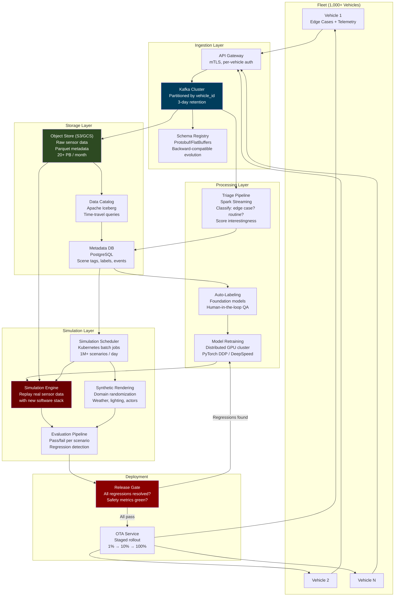
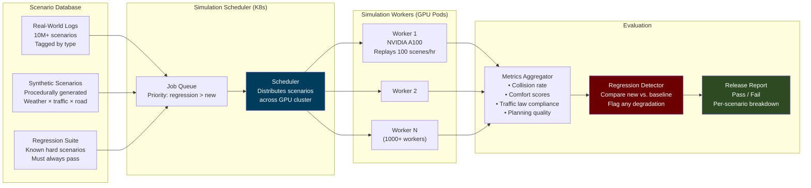
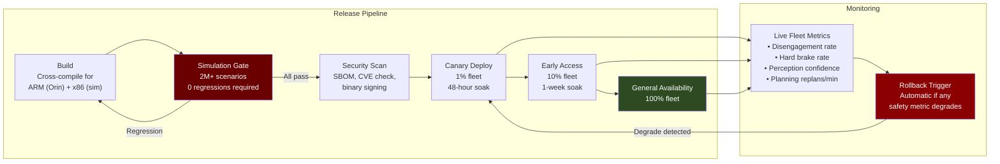

# 6. Shadow Mode and Simulation Infrastructure 🔴

> **The Problem:** The vehicle's edge software stack — perception, localization, planning, control — is only half the autonomous driving system. The other half lives in the cloud. A fleet of 1,000 vehicles generates **20+ petabytes of sensor data per month**. Every edge case — a near-miss, a perception failure, an unusual road geometry — must be captured, cataloged, and used to improve the system. Before any software update ships to vehicles via OTA, it must be validated against **millions of simulated miles** that replay real-world edge cases with the new code. A single regression — a scenario that the old software handled correctly but the new software fails — is an absolute deployment blocker. The cloud infrastructure must ingest, store, query, simulate, and validate at a scale that dwarfs traditional software CI/CD.

---

## 6.1 The Cloud Architecture: End-to-End



---

## 6.2 Shadow Mode: Learning Without Risk

**Shadow mode** is how AV companies accumulate the billions of miles of driving data needed to train and validate their systems — without putting anyone at risk. The AV software stack runs on the vehicle's compute hardware, processing live sensor data and making driving decisions, but its outputs are **not** sent to the actuators. The human driver (or an already-validated AV stack) drives the car. The shadow system's decisions are logged and compared against what the human/baseline did.

### What Shadow Mode Captures

| Data Type | Size per Hour | Why It Matters |
|-----------|--------------|----------------|
| Raw camera (8 cameras, compressed H.265) | ~100 GB | Training perception models, replay |
| LiDAR point clouds (compressed) | ~50 GB | 3D ground truth, map building |
| Radar detections | ~1 GB | All-weather validation |
| IMU + GPS + odometry | ~0.5 GB | Ground truth trajectory |
| Perception output (objects, tracks) | ~2 GB | Label verification, debugging |
| Planning output (trajectories) | ~1 GB | Behavioral analysis, shadow comparison |
| **Shadow divergence events** | ~0.1 GB | When shadow would have done something different |
| **Total** | **~155 GB/hour/vehicle** | **1,000 vehicles × 8 hrs = 1.24 PB/day** |

### Shadow Divergence Detection

The most valuable data from shadow mode is when the shadow system **disagrees** with the human driver:

```rust
/// Detect and classify divergences between shadow AV and human driver
struct ShadowAnalyzer {
    /// Threshold for lateral divergence (meters)
    lateral_threshold: f64,      // 1.5m — different lane position
    /// Threshold for longitudinal divergence (meters)
    longitudinal_threshold: f64, // 5.0m — different stopping point
    /// Threshold for speed divergence (m/s)
    speed_threshold: f64,        // 3.0 m/s — significantly different speed
}

#[derive(Debug)]
enum DivergenceType {
    /// Shadow would have braked, human didn't
    /// (Potential false positive — shadow is too cautious)
    ShadowBrake { decel: f64, reason: String },

    /// Human braked, shadow wouldn't have
    /// (Potential miss — shadow failed to detect hazard)
    ShadowMiss { human_decel: f64, scenario: String },

    /// Different lane choice
    LaneDivergence { shadow_lane: u64, human_lane: u64 },

    /// Shadow would have yielded, human didn't (or vice versa)
    YieldDivergence { shadow_yielded: bool, human_yielded: bool },

    /// Speed profile significantly different
    SpeedDivergence { shadow_speed: f64, human_speed: f64 },
}

impl ShadowAnalyzer {
    fn analyze_frame(
        &self,
        shadow_trajectory: &PlannedTrajectory,
        human_trajectory: &RecordedTrajectory,
        perception: &PerceptionOutput,
    ) -> Vec<DivergenceEvent> {
        let mut events = Vec::new();

        // Check: Did shadow want to brake when human didn't?
        if shadow_trajectory.min_acceleration() < -2.0
            && human_trajectory.acceleration_at_time(0.0) > -0.5
        {
            events.push(DivergenceEvent {
                timestamp: human_trajectory.timestamp,
                divergence_type: DivergenceType::ShadowBrake {
                    decel: shadow_trajectory.min_acceleration(),
                    reason: shadow_trajectory.brake_reason.clone(),
                },
                // Priority: MEDIUM — shadow may be too cautious
                priority: Priority::Medium,
                // Attach 10 seconds of sensor data for replay
                sensor_window: TimeWindow::centered(human_trajectory.timestamp, 10.0),
            });
        }

        // Check: Did human brake hard when shadow didn't?
        // This is the CRITICAL case — shadow missed something
        if human_trajectory.acceleration_at_time(0.0) < -3.0
            && shadow_trajectory.min_acceleration() > -1.0
        {
            events.push(DivergenceEvent {
                timestamp: human_trajectory.timestamp,
                divergence_type: DivergenceType::ShadowMiss {
                    human_decel: human_trajectory.acceleration_at_time(0.0),
                    scenario: classify_scenario(perception),
                },
                // Priority: CRITICAL — the AV stack would have failed here
                priority: Priority::Critical,
                sensor_window: TimeWindow::centered(human_trajectory.timestamp, 30.0),
            });
        }

        events
    }
}
```

---

## 6.3 The Data Ingestion Pipeline

### Vehicle-to-Cloud Data Transfer

Vehicles don't upload 155 GB/hour in real-time. Data is **tiered and prioritized**:

| Tier | What | When Uploaded | How |
|------|------|---------------|-----|
| **P0 — Immediate** | Shadow divergences (critical), safety events, crashes | Real-time via 5G | Direct to Kafka, < 1 min latency |
| **P1 — End of Trip** | Edge case sensor windows (30s clips) | At depot, on WiFi | Queued upload, resumable |
| **P2 — Nightly** | Full perception/planning logs | Overnight at depot | Bulk transfer, NVMe offload |
| **P3 — Weekly** | Full raw sensor data | Scheduled pickup | Physical NVMe swap or high-bandwidth link |

```rust
/// On-vehicle data upload manager
struct UploadManager {
    /// Priority queue of data segments to upload
    upload_queue: BinaryHeap<UploadSegment>,
    /// Available bandwidth estimate
    bandwidth: BandwidthEstimate,
    /// Local NVMe storage usage
    storage_usage: StorageUsage,
}

struct UploadSegment {
    priority: UploadPriority,
    /// Path to data on local NVMe
    local_path: PathBuf,
    /// Size in bytes
    size: u64,
    /// Unique segment ID for deduplication
    segment_id: Uuid,
    /// Upload destination
    destination: UploadDestination,
    /// Resumable upload state
    resume_token: Option<String>,
    /// Checksum for integrity verification
    sha256: [u8; 32],
}

impl UploadManager {
    /// Called periodically to process the upload queue
    fn process_queue(&mut self, connection: &mut CloudConnection) {
        while let Some(segment) = self.upload_queue.peek() {
            match segment.priority {
                UploadPriority::P0Immediate => {
                    // Upload immediately, even on cellular
                    self.upload_segment(connection, segment);
                }
                UploadPriority::P1EndOfTrip => {
                    // Wait for WiFi or high-bandwidth connection
                    if self.bandwidth.is_high_bandwidth() {
                        self.upload_segment(connection, segment);
                    } else {
                        break; // Wait for better connectivity
                    }
                }
                UploadPriority::P2Nightly | UploadPriority::P3Weekly => {
                    // Only upload when at depot and idle
                    if self.bandwidth.is_depot_connection() {
                        self.upload_segment(connection, segment);
                    } else {
                        break;
                    }
                }
            }

            self.upload_queue.pop();
        }
    }
}
```

### Cloud-Side Ingestion: Kafka to Object Store

```rust
// ✅ PRODUCTION: Kafka consumer that writes sensor data to object store
// Partitioned by vehicle_id for ordering guarantees

async fn ingest_sensor_data(
    kafka_consumer: &StreamConsumer,
    object_store: &S3Client,
    metadata_db: &PgPool,
) {
    // Process messages in micro-batches for throughput
    let mut batch: Vec<SensorDataRecord> = Vec::with_capacity(1000);
    let mut batch_size_bytes: u64 = 0;

    loop {
        match kafka_consumer.recv().await {
            Ok(message) => {
                let record: SensorDataRecord = deserialize(message.payload());

                batch_size_bytes += record.size_bytes;
                batch.push(record);

                // Flush batch when size threshold reached (64 MB)
                if batch_size_bytes >= 64 * 1024 * 1024 {
                    flush_batch(&batch, object_store, metadata_db).await;
                    batch.clear();
                    batch_size_bytes = 0;
                }
            }
            Err(e) => {
                log::error!("Kafka consume error: {}", e);
                // Don't retry indefinitely — backpressure the pipeline
                tokio::time::sleep(Duration::from_secs(1)).await;
            }
        }
    }
}

async fn flush_batch(
    batch: &[SensorDataRecord],
    object_store: &S3Client,
    metadata_db: &PgPool,
) {
    // Group records by vehicle_id and time window
    let groups = group_by_vehicle_and_time(batch);

    for (key, records) in groups {
        // Write raw sensor data to object store
        // Path: s3://av-data/{vehicle_id}/{date}/{hour}/{segment_id}.parquet
        let path = format!(
            "av-data/{}/{}/{}/{}.parquet",
            key.vehicle_id,
            key.date,
            key.hour,
            Uuid::new_v4()
        );

        let parquet_bytes = encode_as_parquet(&records);
        object_store.put_object(&path, parquet_bytes).await
            .expect("S3 write failed");

        // Write metadata to PostgreSQL for queryability
        // (scene tags, interesting events, data quality metrics)
        insert_metadata(metadata_db, &key, &path, &records).await;
    }
}
```

---

## 6.4 The Simulation Engine

Simulation is the primary validation mechanism for AV software. Before any code change ships to vehicles, it must pass **millions of simulation scenarios** without regression.

### Simulation Modes

| Mode | Input | Output | Purpose |
|------|-------|--------|---------|
| **Log Replay** | Real sensor recordings | Run new perception/planning/control on recorded data | Validate against real-world data |
| **Closed-Loop Sim** | Virtual sensors + physics engine | Full AV stack runs in simulated world, actions affect state | Test planning and control behavior |
| **Scenario Injection** | Log replay + synthetic actors | Inject synthetic agents into real recordings | Test edge cases never seen in real data |
| **Fuzzing** | Procedurally generated scenarios | Randomized traffic, weather, sensor noise | Discover unknown failure modes |



### Log Replay Architecture

Log replay is the most common simulation mode. It takes a real-world sensor recording and reruns the perception, planning, and control software against the recorded sensor data.

```rust
// ✅ PRODUCTION: Log replay simulation engine

struct LogReplaySimulator {
    /// The AV software stack under test (compiled as a library)
    av_stack: AvSoftwareStack,
    /// Baseline AV stack (last known good version)
    baseline_stack: AvSoftwareStack,
}

struct SimulationResult {
    scenario_id: String,
    /// Did the new stack produce a collision?
    collision: bool,
    /// Minimum distance to any agent
    min_distance_to_agent: f64,
    /// Comfort metrics
    max_longitudinal_jerk: f64,
    max_lateral_acceleration: f64,
    /// Traffic law compliance
    red_light_violations: u32,
    speed_limit_violations_seconds: f64,
    /// Planning quality: how closely did the ego follow the planner's trajectory?
    tracking_error_rms: f64,
    /// Comparison with baseline
    regression_flags: Vec<RegressionFlag>,
}

impl LogReplaySimulator {
    /// Run a single scenario through both stacks and compare
    fn run_scenario(&mut self, scenario: &Scenario) -> SimulationResult {
        let mut result = SimulationResult::default();
        result.scenario_id = scenario.id.clone();

        // Initialize both stacks with the same initial state
        self.av_stack.reset(scenario.initial_state());
        self.baseline_stack.reset(scenario.initial_state());

        // Replay sensor data frame by frame
        for frame in scenario.sensor_frames() {
            // Run new stack
            let new_perception = self.av_stack.perception.process(&frame);
            let new_localization = self.av_stack.localization.process(&frame);
            let new_plan = self.av_stack.planner.plan(&new_perception, &new_localization);
            let new_control = self.av_stack.controller.control(&new_plan, &new_localization);

            // Run baseline stack
            let base_perception = self.baseline_stack.perception.process(&frame);
            let base_localization = self.baseline_stack.localization.process(&frame);
            let base_plan = self.baseline_stack.planner.plan(&base_perception, &base_localization);
            let base_control = self.baseline_stack.controller.control(&base_plan, &base_localization);

            // Evaluate new stack against ground truth
            evaluate_frame(
                &new_perception,
                &new_plan,
                &new_control,
                &scenario.ground_truth_at(frame.timestamp),
                &mut result,
            );

            // Compare new vs baseline
            compare_stacks(
                &new_plan, &new_control,
                &base_plan, &base_control,
                &mut result,
            );
        }

        result
    }
}
```

### Closed-Loop Simulation with Physics Engine

Log replay has a critical limitation: the ego vehicle's actions don't affect the world. If the new planner brakes earlier, the recorded agents don't react. **Closed-loop simulation** solves this with a full physics engine:

```rust
/// Closed-loop simulation: the ego vehicle's actions affect the simulated world
struct ClosedLoopSimulator {
    /// Physics engine (vehicle + environment dynamics)
    physics: PhysicsEngine,
    /// Traffic agent behavior models
    traffic_agents: Vec<TrafficAgent>,
    /// Virtual sensor models (render synthetic camera, LiDAR, radar)
    sensor_sim: SensorSimulator,
    /// The AV stack under test
    av_stack: AvSoftwareStack,
}

impl ClosedLoopSimulator {
    fn run(&mut self, scenario: &ClosedLoopScenario, max_time: f64) -> SimulationResult {
        let mut time = 0.0;
        let dt = 0.01; // 100 Hz physics step

        // Initialize world state
        self.physics.set_initial_state(&scenario.initial_world_state);
        for agent in &mut self.traffic_agents {
            agent.set_initial_state(&scenario.agent_state(agent.id));
        }

        while time < max_time {
            // 1. Generate synthetic sensor data from current world state
            let sensor_frame = self.sensor_sim.render(
                &self.physics.ego_state(),
                &self.traffic_agents,
                &scenario.static_environment,
            );

            // 2. Run the AV stack on synthetic sensor data
            let perception = self.av_stack.perception.process(&sensor_frame);
            let localization = self.av_stack.localization.process(&sensor_frame);
            let plan = self.av_stack.planner.plan(&perception, &localization);
            let control = self.av_stack.controller.control(&plan, &localization);

            // 3. Apply ego control to physics engine
            // This is the key difference: the ego MOVES in the simulated world
            self.physics.apply_ego_control(&control);

            // 4. Step traffic agents (they react to ego's behavior)
            for agent in &mut self.traffic_agents {
                agent.step(dt, &self.physics.ego_state());
            }

            // 5. Step physics
            self.physics.step(dt);

            // 6. Check termination conditions
            if self.physics.collision_detected() {
                return SimulationResult::collision(time);
            }
            if self.physics.ego_reached_goal(&scenario.goal) {
                return SimulationResult::success(time);
            }

            time += dt;
        }

        SimulationResult::timeout(max_time)
    }
}
```

---

## 6.5 Scenario Mining: Finding the Needles in the Haystack

99.9% of driving data is boring. The valuable data — edge cases, near-misses, unusual situations — must be automatically identified and extracted.

### Interestingness Scoring

```rust
/// Score how "interesting" a driving segment is for training/testing
fn compute_interestingness(segment: &DrivingSegment) -> f64 {
    let mut score = 0.0;

    // High brake events (potential near-miss)
    if segment.max_deceleration < -4.0 {
        score += 50.0;
    }

    // Shadow divergence (AV would have done something different)
    score += segment.shadow_divergences.len() as f64 * 30.0;

    // Rare object classes (construction vehicle, wheelchair, animal)
    for obj in &segment.detected_objects {
        match obj.class {
            ObjectClass::ConstructionVehicle => score += 20.0,
            ObjectClass::Wheelchair => score += 40.0,
            ObjectClass::Animal => score += 25.0,
            ObjectClass::EmergencyVehicle => score += 35.0,
            _ => {}
        }
    }

    // Unusual road geometry (intersection complexity, construction zone)
    if segment.road_type == RoadType::ConstructionZone { score += 30.0; }
    if segment.intersection_complexity > 4 { score += 15.0; }

    // Adverse weather
    match segment.weather {
        Weather::HeavyRain => score += 20.0,
        Weather::Snow => score += 30.0,
        Weather::Fog => score += 25.0,
        Weather::Night => score += 10.0,
        _ => {}
    }

    // Perception confidence drops (model uncertainty spike)
    if segment.min_perception_confidence < 0.5 {
        score += 40.0;
    }

    // Near-miss events (min time-to-collision < 2 seconds)
    if segment.min_ttc < 2.0 {
        score += 80.0;
    }

    score
}
```

---

## 6.6 Over-The-Air (OTA) Update Pipeline

Once a new software version passes the simulation gauntlet, it must be deployed to the fleet safely.

### Staged Rollout Strategy

| Stage | Fleet % | Duration | Gate Criteria |
|-------|---------|----------|---------------|
| **Canary** | 1% (10 vehicles) | 48 hours | Zero safety events, no regression in live metrics |
| **Early Access** | 10% (100 vehicles) | 1 week | metrics within 5% of baseline, no new edge cases |
| **General Availability** | 100% | 2 weeks | Full fleet nominal |
| **Rollback** | — | < 30 minutes | Automatic if safety metric degrades >10% |



### OTA Update Binary Integrity

```rust
/// OTA update package format
/// Every update is cryptographically signed and verified before installation
struct OtaPackage {
    /// Semantic version
    version: SemanticVersion,
    /// Target hardware platform
    target: HardwarePlatform,
    /// Compressed binary payload (zstd level 19)
    payload: Vec<u8>,
    /// SHA-256 hash of the uncompressed payload
    payload_hash: [u8; 32],
    /// Ed25519 signature over (version || target || payload_hash)
    /// Signed by the OTA signing key (HSM-protected)
    signature: [u8; 64],
    /// Minimum software version that can upgrade to this version
    /// (prevents downgrade attacks)
    min_source_version: SemanticVersion,
    /// Rollback version (if this update fails, revert to this)
    rollback_version: SemanticVersion,
}

fn verify_and_install_ota(
    package: &OtaPackage,
    trusted_public_key: &[u8; 32],
    current_version: &SemanticVersion,
) -> Result<(), OtaError> {
    // Step 1: Verify signature
    let message = [
        package.version.as_bytes(),
        package.target.as_bytes(),
        &package.payload_hash,
    ].concat();

    if !ed25519_verify(trusted_public_key, &message, &package.signature) {
        return Err(OtaError::SignatureVerificationFailed);
    }

    // Step 2: Verify payload integrity
    let computed_hash = sha256(&decompress_zstd(&package.payload));
    if computed_hash != package.payload_hash {
        return Err(OtaError::PayloadCorrupted);
    }

    // Step 3: Version compatibility check
    if current_version < &package.min_source_version {
        return Err(OtaError::VersionTooOld);
    }

    // Step 4: Install to inactive partition (A/B partitioning)
    install_to_inactive_partition(&package.payload)?;

    // Step 5: Set boot flag to try new partition on next boot
    set_boot_partition(PartitionSlot::Inactive)?;

    // Step 6: On next boot, if software fails health check within 60s,
    // bootloader automatically reverts to previous partition
    Ok(())
}
```

---

## 6.7 Metrics and Safety Monitoring

### The Fleet Safety Dashboard

Production AV fleets track these metrics in real-time across the entire fleet:

| Metric | Target | Red Line | Measurement |
|--------|--------|----------|-------------|
| **Disengagements per 1,000 miles** | < 0.1 | > 0.5 | Human takeovers (manual or automatic) |
| **Hard brakes per 100 miles** | < 2.0 | > 5.0 | Deceleration > 4 m/s² not in plan |
| **Mean perception confidence** | > 0.85 | < 0.70 | Average detection confidence score |
| **Planning replans per minute** | < 5 | > 15 | Full trajectory recomputation |
| **Localization uncertainty (95th percentile)** | < 15 cm | > 50 cm | EKF covariance trace |
| **Collision count** | 0 | ≥ 1 | Any physical contact |
| **MPC solve time (99th percentile)** | < 5 ms | > 8 ms | QP solver wallclock time |
| **Perception latency (99th percentile)** | < 28 ms | > 35 ms | Camera frame to detection output |

```rust
/// Real-time fleet monitoring — aggregated across all vehicles
struct FleetMetrics {
    /// Per-vehicle, per-hour metrics, streamed via Kafka
    vehicles: HashMap<VehicleId, VehicleMetrics>,
    /// Aggregate metrics across fleet
    fleet_wide: AggregateMetrics,
    /// Alerting thresholds
    thresholds: AlertThresholds,
}

impl FleetMetrics {
    /// Called every minute with aggregated data
    fn evaluate_fleet_health(&self) -> FleetHealth {
        let disengagement_rate = self.fleet_wide.disengagements_per_1k_miles();
        let hard_brake_rate = self.fleet_wide.hard_brakes_per_100_miles();
        let perception_confidence = self.fleet_wide.mean_perception_confidence();

        // Any red-line breach triggers immediate alert
        if disengagement_rate > 0.5
            || hard_brake_rate > 5.0
            || perception_confidence < 0.70
        {
            return FleetHealth::Critical {
                action: "HALT CANARY ROLLOUT — investigate immediately",
                metrics: self.fleet_wide.clone(),
            };
        }

        // Warning: metrics degrading but not critical
        if disengagement_rate > 0.2 || hard_brake_rate > 3.0 {
            return FleetHealth::Warning {
                action: "Pause rollout expansion, investigate trend",
                metrics: self.fleet_wide.clone(),
            };
        }

        FleetHealth::Nominal
    }
}
```

---

## 6.8 The Simulation Scale: Why Millions of Miles Matter

A Level 4 AV must demonstrate safety that is **statistically significantly better than a human driver**. Human drivers in the US have a fatal crash rate of approximately **1.1 per 100 million miles**. To demonstrate with 95% confidence that an AV is at least twice as safe requires:

$$n = \frac{z_{\alpha/2}^2 \cdot \hat{p} \cdot (1 - \hat{p})}{E^2}$$

With the target rate $\hat{p} = 0.55 \times 10^{-8}$ (half the human rate) and margin of error $E = 0.55 \times 10^{-8}$:

$$n \approx 8.8 \text{ billion miles}$$

This is physically impossible to achieve through real-world driving alone. Hence the absolute necessity of **simulation at scale**:

| Validation Method | Speed | Volume | Fidelity | Role |
|-------------------|-------|--------|----------|------|
| Real-world driving | 1× real-time | ~10M miles/year (large fleet) | Ground truth | Canary validation |
| Log replay simulation | 100–1000× real-time | ~1B scenarios/month | High (real sensors) | Primary regression testing |
| Closed-loop simulation | 10–100× real-time | ~100M scenarios/month | Medium (synthetic sensors) | Behavioral validation |
| Fuzzing / adversarial | 1000× real-time | ~10B scenarios/month | Low (simplified) | Edge case discovery |

The combination of all four — with the cloud infrastructure to orchestrate them — is what makes Level 4 autonomy achievable.

---

> **Key Takeaways**
>
> 1. **The cloud is half the AV system.** The vehicle's edge compute runs the driving stack; the cloud runs the learning, validation, and deployment infrastructure. Neither works without the other.
> 2. **Shadow mode is the safest way to accumulate driving experience.** The AV stack processes live data but doesn't control the car. Divergences between the shadow and the human driver are the most valuable training signal.
> 3. **Data tiering is essential.** Upload critical events (safety, divergences) immediately over 5G. Bulk sensor data can wait for depot WiFi. Physical media swaps handle petabyte-scale raw data.
> 4. **Simulation is the primary validation mechanism.** No software update ships without passing millions of simulated scenarios. Log replay validates perception; closed-loop simulation validates planning and control.
> 5. **Regression detection is the deployment gate.** A single scenario that the old software handled but the new software fails is an absolute blocker. The new version must be **strictly better** across all known scenarios.
> 6. **OTA updates use A/B partitioning with cryptographic verification.** If the update fails the health check on first boot, the bootloader automatically reverts. Rollback takes < 30 seconds.
> 7. **Fleet metrics must be monitored continuously during staged rollout.** Any degradation in disengagement rate, hard brakes, or perception confidence triggers an automatic rollout pause and investigation.
> 8. **Proving statistical safety improvement over human drivers requires billions of miles** — achievable only through a combination of real-world driving and simulation at enormous scale.
