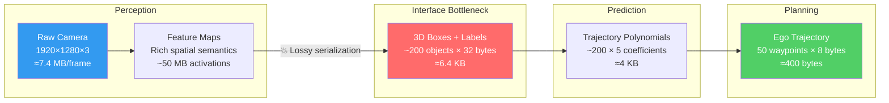
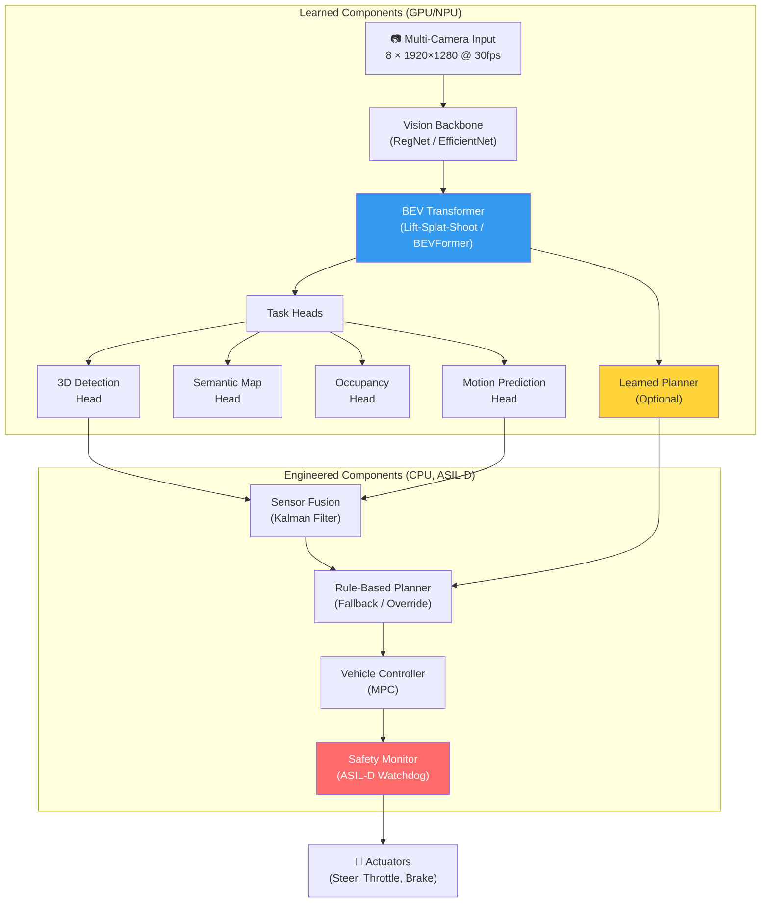
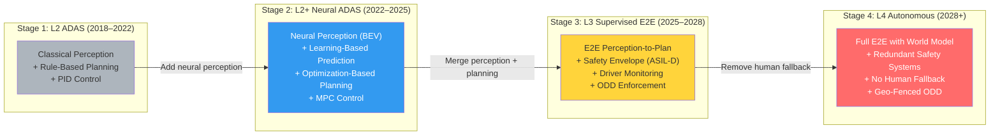

# 7. The Paradigm Shift — Modular vs. End-to-End AI 🟢

> **The Problem:** Classical autonomous driving stacks decompose the world into isolated modules — perception, prediction, planning, control — each maintained by a different team with hand-tuned interfaces. Every interface is a lossy bottleneck: the perception team outputs a list of bounding boxes, discarding the rich feature representations the planner actually needs. The prediction team fits polynomial trajectories, unable to express uncertainty in ways the planner can consume. Errors compound across module boundaries because **no single loss function trains the entire chain**. The result: a system that works 99% of the time in structured environments and fails catastrophically in the 1% of unstructured scenarios — construction zones, emergency vehicles, a mattress on the highway — where module-boundary assumptions break down. End-to-End AI promises to eliminate these boundaries. But replacing a 15-year engineering stack with a single neural network is not a deployment strategy — it is a research aspiration with no safety story. The real architectural question is: **where exactly do you draw the line between learned and engineered components?**

---

## 7.1 The Classical Modular Stack: Anatomy of a Pipeline

The modular approach — pioneered by the DARPA Grand Challenge teams and refined by every major OEM since — decomposes autonomous driving into a serial pipeline:

```
Raw Sensors → Perception → Prediction → Planning → Control → Actuators
```

Each module has a well-defined API contract:

| Module | Input | Output | Typical Team |
|--------|-------|--------|--------------|
| **Perception** | Camera pixels, LiDAR point clouds, radar returns | 3D bounding boxes, lane lines, traffic signs, drivable area | Computer Vision |
| **Prediction** | Object tracks + map context | Future trajectories (polylines, 3–5s horizon) | ML / Robotics |
| **Planning** | Predicted trajectories + route | Ego trajectory (spatiotemporal path) | Robotics / Controls |
| **Control** | Desired trajectory + vehicle state | Steering angle, throttle %, brake pressure | Controls / Embedded |

### Why This Architecture Dominated for a Decade

1. **Testability.** Each module can be unit-tested in isolation. You can run a perception benchmark (nuScenes, KITTI) without needing a planner.
2. **Debuggability.** When the car makes a bad decision, you can trace the error to a specific module: "Perception missed the pedestrian" vs. "Planner chose an unsafe trajectory."
3. **Safety Certification.** ISO 26262 requires decomposition into safety elements with defined failure modes. A modular stack maps naturally to ASIL decomposition.
4. **Team Scaling.** Separate teams work in parallel with stable interfaces.

### Where the Modular Stack Breaks

The critical flaw is **information loss at module boundaries**:



The perception module compresses **7.4 MB of raw visual information** per camera per frame into **6.4 KB of bounding boxes** — a **1,000× information reduction**. Everything the neural network learned about texture, occlusion patterns, material properties, and scene context is thrown away at the module boundary.

**Concrete failure mode:** A truck carrying a large mirror reflects the image of cars in the adjacent lane. The perception module correctly detects these as "car" objects — inside the mirror. The prediction module, receiving only bounding boxes, has no way to know these objects are reflections. It predicts collision trajectories. The planner brakes hard on the highway. This actually happened in production.

---

## 7.2 The End-to-End Vision: One Network, Pixels to Control

The End-to-End (E2E) paradigm proposes a single differentiable function:

$$f: \mathbb{R}^{N \times H \times W \times 3} \rightarrow \mathbb{R}^{T \times 3}$$

Where $N$ cameras produce images of height $H$ and width $W$, and the output is $T$ future waypoints in 3D space (x, y, heading), from which steering and acceleration are derived via a simple PID or MPC controller.

The entire network is trained end-to-end with a single loss function:

$$\mathcal{L} = \lambda_1 \mathcal{L}_{\text{imitation}} + \lambda_2 \mathcal{L}_{\text{safety}} + \lambda_3 \mathcal{L}_{\text{comfort}}$$

Where:
- $\mathcal{L}_{\text{imitation}}$ penalizes deviation from expert (human driver) trajectories
- $\mathcal{L}_{\text{safety}}$ penalizes collision with ground-truth object occupancy
- $\mathcal{L}_{\text{comfort}}$ penalizes jerk and lateral acceleration

### The Promise

| Advantage | Mechanism |
|-----------|-----------|
| **No information loss** | The planner has access to all intermediate features — occluded objects, uncertain detections, scene context |
| **Joint optimization** | A single loss function means perception learns features that are *useful for driving*, not just useful for detection benchmarks |
| **Emergent behaviors** | The network can discover driving strategies humans never explicitly programmed |
| **Simpler codebase** | Replace 500K lines of C++ with a single model checkpoint |

### The Reality Check

```
// 💥 DEPLOYMENT HAZARD: Pure End-to-End in production

Problems:
  1. INTERPRETABILITY: The car brakes. Why? The network has no "perception output"
     you can inspect. Regulators (UNECE R157) require explainability.

  2. LONG TAIL: The model has never seen a horse-drawn carriage on a highway.
     A modular stack can at least detect it as "unknown obstacle" via LiDAR.
     An E2E network may hallucinate a trajectory straight through it.

  3. VALIDATION: How do you certify a single 500M-parameter network to ASIL-B?
     ISO 26262 requires failure mode analysis of every component.
     "The neural network might do anything" is not an acceptable FMEA entry.

  4. OTA RISK: Updating one weight in an E2E model potentially changes every
     behavior. Modular stacks allow surgical updates to one module.
```

---

## 7.3 The Hybrid Architecture: Where Production Lives

Every shipping ADAS system in 2026 uses a **hybrid architecture** — learned perception and prediction with engineered planning and safety layers:



### The Key Architectural Decision: Where to Draw the Line

| Architecture Variant | Learned | Engineered | Ships In |
|---------------------|---------|------------|----------|
| **Conservative Hybrid** | Perception only (detection, segmentation) | Prediction + Planning + Control | Most L2 ADAS (Mobileye, Bosch) |
| **Progressive Hybrid** | Perception + Prediction + Learned Planner | Safety envelope + Control | Tesla FSD, Wayve |
| **Full E2E with Safety Wrapper** | Perception → Planning (single network) | Hard-coded safety monitor (override only) | Research / limited geo-fence (Waymo) |

### Research Approach vs. Production Approach

```python
# 💥 RESEARCH APPROACH: Pure imitation learning E2E model
# Works great in simulation, fails in deployment

class NaiveE2EModel(nn.Module):
    """Maps 8 camera images directly to steering + acceleration."""
    def __init__(self):
        super().__init__()
        self.backbone = ResNet50(pretrained=True)
        self.temporal = TransformerEncoder(d_model=2048, nhead=8, num_layers=6)
        self.trajectory_head = MLP(2048, [512, 256], output_dim=30)  # 10 waypoints × 3

    def forward(self, images: Tensor) -> Tensor:
        # images: [B, T, N_cams, C, H, W]
        features = self.backbone(images.flatten(0, 2))       # Flatten batch, time, cameras
        features = features.unflatten(0, (B, T, N_cams))
        features = features.mean(dim=2)                       # 💥 Naive camera averaging!
        features = self.temporal(features)                    # Temporal context
        trajectory = self.trajectory_head(features[:, -1])    # Last timestep → trajectory
        return trajectory.reshape(B, 10, 3)                   # [x, y, heading] × 10 steps

    # 💥 Problems:
    # 1. No geometric reasoning — cameras averaged in feature space, not 3D space
    # 2. No explicit object representation — can't explain decisions
    # 3. No safety bounds — network can output physically impossible trajectories
    # 4. Compounding errors from pure imitation (distribution shift)
```

```rust
// ✅ PRODUCTION APPROACH: Hybrid architecture with safety-certified fallback
// Learned perception + engineered safety envelope

/// The production system separates learned inference from safety-critical control.
/// The neural network proposes; the safety monitor disposes.

/// Safety-certified trajectory validator (ASIL-D, runs on lockstep CPU)
pub struct SafetyEnvelope {
    max_lateral_accel_m_s2: f64,       // 4.0 m/s² comfort, 8.0 m/s² emergency
    max_longitudinal_decel_m_s2: f64,  // -10.0 m/s² (hard braking limit)
    max_steering_rate_deg_s: f64,      // 500 °/s (physical actuator limit)
    min_ttc_seconds: f64,              // 1.5s minimum time-to-collision
}

impl SafetyEnvelope {
    /// Validate a trajectory proposed by the neural network.
    /// Returns Ok(trajectory) if safe, Err(violation) if not.
    /// On violation, the system falls back to the emergency trajectory.
    pub fn validate(&self, proposed: &Trajectory, ego_state: &VehicleState) -> Result<&Trajectory, SafetyViolation> {
        for (i, waypoint) in proposed.waypoints.iter().enumerate() {
            let lateral_accel = self.compute_lateral_accel(waypoint, ego_state);
            if lateral_accel.abs() > self.max_lateral_accel_m_s2 {
                return Err(SafetyViolation::ExcessiveLateralAccel {
                    waypoint_index: i,
                    actual: lateral_accel,
                    limit: self.max_lateral_accel_m_s2,
                });
            }

            let ttc = self.compute_time_to_collision(waypoint, ego_state);
            if ttc < self.min_ttc_seconds {
                return Err(SafetyViolation::InsufficientTTC {
                    waypoint_index: i,
                    actual_ttc: ttc,
                    min_ttc: self.min_ttc_seconds,
                });
            }
        }
        Ok(proposed)
    }

    /// Emergency fallback: pure physics-based deceleration along current heading.
    /// No neural network involved. Deterministic. Certified.
    pub fn emergency_stop_trajectory(&self, ego_state: &VehicleState) -> Trajectory {
        let mut waypoints = Vec::with_capacity(10);
        let mut speed = ego_state.speed_m_s;
        let dt = 0.1; // 100ms steps

        for i in 0..10 {
            speed = (speed + self.max_longitudinal_decel_m_s2 * dt).max(0.0);
            let distance = speed * dt;
            waypoints.push(Waypoint {
                x: ego_state.x + distance * ego_state.heading.cos() * (i as f64 + 1.0),
                y: ego_state.y + distance * ego_state.heading.sin() * (i as f64 + 1.0),
                heading: ego_state.heading, // Maintain current heading
                speed,
                timestamp_s: ego_state.timestamp_s + dt * (i as f64 + 1.0),
            });
        }
        Trajectory { waypoints }
    }
}

/// The main autonomy loop: learned proposal + engineered safety
pub fn autonomy_tick(
    nn_output: &NNTrajectoryProposal,
    safety: &SafetyEnvelope,
    ego: &VehicleState,
    controller: &mut MpcController,
) -> ActuatorCommand {
    let trajectory = match safety.validate(&nn_output.trajectory, ego) {
        Ok(traj) => traj.clone(),
        Err(violation) => {
            log_safety_event(&violation);
            // 🛡️ Neural network overridden — deterministic emergency trajectory
            safety.emergency_stop_trajectory(ego)
        }
    };

    controller.track(&trajectory, ego)
}
```

---

## 7.4 The Evolution Path: From L2 to L4

The industry does not jump from modular to E2E. It evolves through well-defined stages:



### Stage 2 → Stage 3: The Critical Transition

The most important architectural shift happening right now is the merger of perception and planning into a single learned backbone. The key enabler is the **Bird's Eye View (BEV) representation**, which we cover in depth in Chapter 8.

| Aspect | Stage 2 (Separate Networks) | Stage 3 (Merged Backbone) |
|--------|---------------------------|--------------------------|
| Perception output | Bounding boxes, lanes | Dense BEV feature map (shared) |
| Prediction input | Detection boxes + tracks | BEV features (no information loss) |
| Planning input | Predicted trajectories (polylines) | BEV features + predicted occupancy |
| Training | Each model trained independently | Joint training with driving loss |
| Latency | Sum of all modules (120–200ms) | Single forward pass (40–80ms) |
| Accuracy | Limited by worst module | Globally optimized |

---

## 7.5 Training Paradigms: Imitation vs. Reinforcement vs. World Models

### Imitation Learning (Behavioral Cloning)

The simplest E2E approach: learn to mimic human drivers.

$$\mathcal{L}_{\text{BC}} = \mathbb{E}_{(o_t, a_t^*) \sim \mathcal{D}} \left[ \| \pi_\theta(o_t) - a_t^* \|^2 \right]$$

Where $\pi_\theta$ is the policy network, $o_t$ is the observation at time $t$, and $a_t^*$ is the expert action.

**Fatal flaw: Distribution shift.** The model is trained on expert trajectories but at inference time must recover from its own errors — states the expert never visited. Small errors compound over time.

### DAgger (Dataset Aggregation)

Addresses distribution shift by iteratively collecting data under the learned policy:

1. Train initial policy $\pi_1$ on expert data $\mathcal{D}_0$.
2. Run $\pi_1$ in the real world (or simulation), but record what the expert *would* have done at each state.
3. Aggregate: $\mathcal{D}_1 = \mathcal{D}_0 \cup \{(s, a^*_{\text{expert}}) : s \sim \pi_1\}$.
4. Retrain on $\mathcal{D}_1$. Repeat.

**Practical limitation:** You cannot deploy an untested policy on public roads to collect DAgger data. This is where **Shadow Mode** (Chapter 9) becomes essential — the learned policy runs silently alongside the human driver, and discrepancies are automatically flagged.

### World Models

The frontier approach: train a neural network to predict the future state of the world, then plan within the model's imagination:

$$\hat{s}_{t+1} = f_\theta(s_t, a_t) \qquad \text{(World Model: predict next state)}$$
$$a^* = \arg\min_{a_{t:t+H}} \sum_{k=0}^{H} c(\hat{s}_{t+k}, a_{t+k}) \qquad \text{(Plan: optimize in imagination)}$$

This is the approach behind GAIA-1 (Wayve) and the rumored next-generation Tesla planner. The key advantage: the world model can be trained on massive unlabeled video data (self-supervised), and the planner can evaluate thousands of candidate trajectories in the model's latent space before committing to one.

---

## 7.6 Comparative Architecture Matrix

| Dimension | Pure Modular | Hybrid (Production) | Pure E2E |
|-----------|-------------|--------------------|-----------| 
| **Information flow** | Lossy (serialized interfaces) | Partial sharing (BEV features) | Lossless (single network) |
| **Debuggability** | High (inspect each module) | Medium (inspect heads, not backbone) | Low (black box) |
| **Safety certification** | Straightforward (ASIL decomposition) | Feasible (safety wrapper certified) | Open research problem |
| **Training data needs** | Moderate (per-task labels) | Large (joint labels + driving logs) | Massive (expert demonstrations) |
| **Long-tail handling** | Rules can patch rare cases | Rules + learned + fleet data | Requires seeing everything in training |
| **Latency** | High (serial pipeline) | Medium (parallel heads) | Low (single pass) |
| **OTA update risk** | Low (update one module) | Medium (shared backbone affects all) | High (any weight changes everything) |
| **Regulatory acceptance** | High (UNECE R157 compliant) | Emerging (conditional acceptance) | Not yet accepted |

---

> **Key Takeaways**
>
> 1. **No shipping ADAS system is purely End-to-End.** Every production system wraps learned components in engineered safety envelopes. The debate is not "modular vs. E2E" — it is "where does the learned boundary end and the engineered boundary begin?"
>
> 2. **The BEV representation is the architectural bridge** between the modular and E2E worlds. It allows learned components to share rich 3D features while still producing interpretable intermediate outputs for debugging and safety monitoring.
>
> 3. **Safety is not a feature — it is the architecture.** The hard-coded safety monitor running on a separate, ASIL-D certified processor is non-negotiable. The neural network proposes; the safety system disposes.
>
> 4. **The real competitive advantage is the data engine, not the model architecture.** Two teams with identical network architectures but different fleet data pipelines will produce wildly different driving quality. Chapter 9 covers this in depth.
>
> 5. **Plan the evolution path.** Design your interfaces to support progressive replacement of engineered components with learned ones. Today's explicit object list will be tomorrow's dense feature vector — ensure your planner can consume both.
