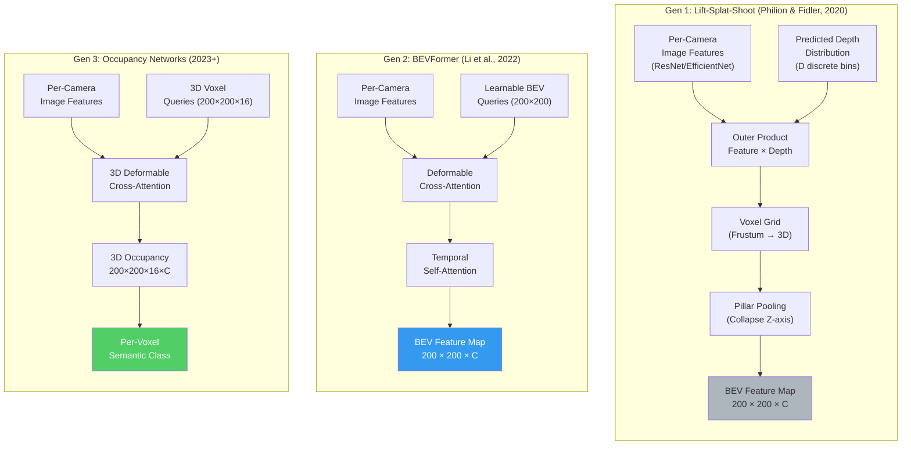
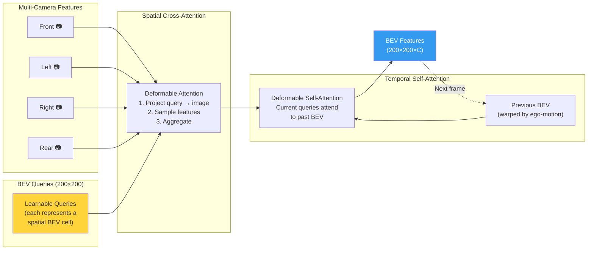
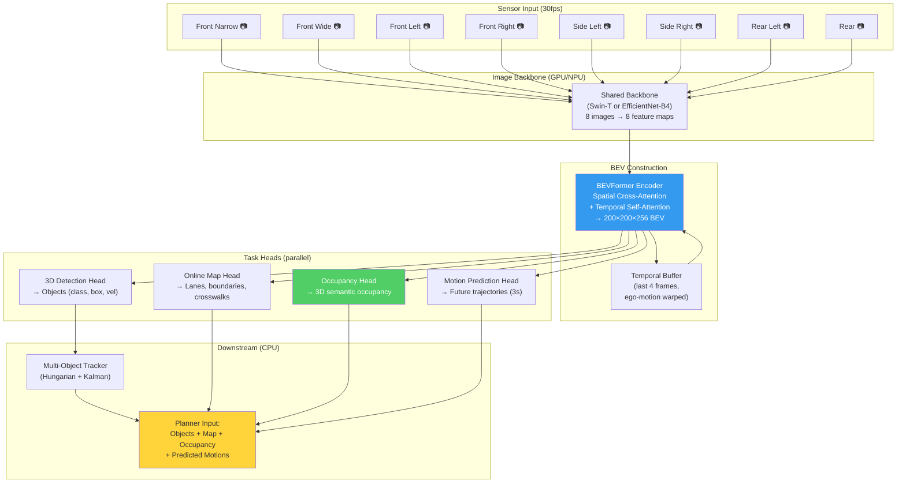

# 8. Vision, Transformers, and Bird's Eye View (BEV) 🟡

> **The Problem:** An autonomous vehicle has 8 cameras, each producing a 2D image in its own perspective projection. A pedestrian standing at the boundary of two cameras appears as two separate partial silhouettes in two different images with different scales, distortions, and coordinate systems. Classical computer vision processes each camera independently and then attempts to stitch the results in 3D — a process plagued by calibration errors, duplicate detections, and blind spots in overlap zones. The fundamental failure: **we are trying to reason about a 3D world using 2D representations**. What we need is a single, unified 3D representation of the scene — a Bird's Eye View (BEV) — constructed by geometrically lifting every pixel from every camera into a common coordinate frame. This is the architectural revolution that made vision-only autonomous driving viable without LiDAR.

---

## 8.1 Why Per-Camera 2D Detection Fails

Consider the camera configuration of a typical production ADAS vehicle:

```
                Front Narrow (120m, 8° FOV)
                      │
    Front Left ───── [CAR] ───── Front Right
    (60° FOV)    Front Wide     (60° FOV)
                 (60m, 120° FOV)
                      │
    Side Left ───────────────── Side Right
    (80° FOV)                   (80° FOV)
                      │
               Rear (50m, 120° FOV)
```

A pedestrian 30 meters ahead and 5 meters to the right may appear in **both** the front-wide and front-right cameras. Classical per-camera detection produces:

| Camera | Detection | Confidence | Depth Estimate |
|--------|-----------|------------|----------------|
| Front Wide | Pedestrian, bbox [1402, 380, 1480, 520] | 0.87 | 28m ± 5m (monocular) |
| Front Right | Pedestrian, bbox [95, 350, 180, 510] | 0.91 | 32m ± 4m (monocular) |

Now you must **associate** these into a single object. Is it the same pedestrian? Different pedestrians? The depth estimates disagree by 4 meters. The bounding boxes are in completely different pixel coordinates. Every heuristic you write for association will fail in some edge case.

```
// 💥 FRAGILE: Post-hoc 3D association from 2D detections

def associate_cross_camera(detections_by_camera, calibrations):
    """Attempt to match 2D detections across cameras using 3D projection."""
    all_3d_points = []
    for cam_id, dets in detections_by_camera.items():
        K, R, t = calibrations[cam_id]  # Intrinsic, rotation, translation
        for det in dets:
            # 💥 Monocular depth is unreliable: ±30% error at 30m
            depth = estimate_monocular_depth(det.bbox, cam_id)
            point_3d = backproject(det.center, depth, K, R, t)
            all_3d_points.append((point_3d, det, cam_id))

    # 💥 Greedy nearest-neighbor matching in 3D — fails with depth errors
    clusters = dbscan(all_3d_points, eps=3.0)  # 3m threshold hides errors
    # 💥 A 3m clustering threshold merges a cyclist and a pedestrian
    #    standing 2m apart into a single "object"
    return clusters
```

---

## 8.2 The BEV Paradigm: Lift, Project, Fuse

The Bird's Eye View (BEV) approach solves this by explicitly reasoning in 3D during feature extraction, not after detection. The core insight is:

> **Don't detect in 2D and then lift to 3D. Lift features to 3D and then detect in 3D.**

### The Geometry: Camera-to-BEV Projection

For each pixel $(u, v)$ in camera $i$ with intrinsic matrix $\mathbf{K}_i$ and extrinsic (world-to-camera) transform $[\mathbf{R}_i | \mathbf{t}_i]$, the ray in world coordinates is:

$$\mathbf{r}(d) = \mathbf{R}_i^{-1}\left(\mathbf{K}_i^{-1} \begin{bmatrix} u \\ v \\ 1 \end{bmatrix} d - \mathbf{t}_i\right)$$

Where $d$ is the unknown depth along the ray. The BEV grid is a discretized top-down representation of the scene:

- **X range:** -50m to +50m (lateral)
- **Y range:** -50m to +50m (longitudinal)
- **Z range:** -3m to +5m (vertical, for bridges/overpasses)
- **Resolution:** 0.5m per cell → 200 × 200 BEV grid

### The Three Generations of BEV Construction



---

## 8.3 Deep Dive: Lift-Splat-Shoot (LSS)

LSS is the foundational BEV algorithm and the simplest to understand. It has three stages:

### Stage 1: Lift — Predict Depth for Every Pixel

For each camera, a 2D backbone (ResNet-50, EfficientNet-B4) produces a feature map $\mathbf{F}_i \in \mathbb{R}^{C \times H' \times W'}$. A depth head predicts a discrete depth distribution over $D$ bins:

$$\alpha_{i}(u, v) = \text{softmax}(\mathbf{W}_d \cdot \mathbf{F}_i(u, v)) \in \mathbb{R}^D$$

This distribution tells us the probability of each pixel being at depth $d_1, d_2, \ldots, d_D$ (e.g., $D=59$ bins from 4m to 45m in 0.7m steps).

The "lifted" feature at each depth is:

$$\mathbf{G}_i(u, v, d) = \alpha_i(u, v, d) \cdot \mathbf{F}_i(u, v) \in \mathbb{R}^C$$

### Stage 2: Splat — Project into the BEV Grid

Each feature $\mathbf{G}_i(u, v, d)$ is projected to the 3D voxel grid using the known camera calibration. Multiple features landing in the same voxel are sum-pooled, then the Z-axis is collapsed via concatenation and 1×1 convolution:

$$\text{BEV}(x, y) = \text{Conv}_{1\times1}\left(\bigoplus_{z} \sum_{i, u, v, d \rightarrow (x, y, z)} \mathbf{G}_i(u, v, d)\right)$$

### Stage 3: Shoot — Task-Specific Heads

The BEV feature map is consumed by downstream heads — detection, segmentation, motion prediction — all operating in the same top-down coordinate frame.

```python
# ✅ PRODUCTION APPROACH: Lift-Splat-Shoot BEV construction
# Runs on edge SoC with TensorRT optimization

import torch
import torch.nn as nn
import torch.nn.functional as F

class LiftSplatShoot(nn.Module):
    """
    Lifts multi-camera 2D features into a unified 3D BEV representation.
    Production config: 8 cameras, 59 depth bins (4m–45m), 200×200 BEV grid.
    """
    def __init__(
        self,
        num_cameras: int = 8,
        bev_x_range: tuple = (-50.0, 50.0),
        bev_y_range: tuple = (-50.0, 50.0),
        bev_resolution: float = 0.5,
        depth_min: float = 4.0,
        depth_max: float = 45.0,
        depth_bins: int = 59,
        feature_channels: int = 256,
    ):
        super().__init__()
        self.depth_bins = depth_bins
        self.depths = torch.linspace(depth_min, depth_max, depth_bins)

        # Image backbone (shared across cameras)
        self.backbone = EfficientNetB4Backbone(out_channels=feature_channels)

        # Depth prediction head
        self.depth_head = nn.Sequential(
            nn.Conv2d(feature_channels, feature_channels, 3, padding=1),
            nn.BatchNorm2d(feature_channels),
            nn.ReLU(inplace=True),
            nn.Conv2d(feature_channels, depth_bins, 1),
        )

        # BEV grid dimensions
        self.bev_x = int((bev_x_range[1] - bev_x_range[0]) / bev_resolution)  # 200
        self.bev_y = int((bev_y_range[1] - bev_y_range[0]) / bev_resolution)  # 200

        # BEV refinement convolution
        self.bev_conv = nn.Sequential(
            nn.Conv2d(feature_channels, feature_channels, 3, padding=1),
            nn.BatchNorm2d(feature_channels),
            nn.ReLU(inplace=True),
        )

    def create_frustum_grid(self, depth_distribution, intrinsics, extrinsics):
        """
        Create the frustum-to-BEV mapping using camera calibration.
        This is precomputed once per calibration and cached.
        """
        B, N, D, H, W = depth_distribution.shape
        # Create pixel grid
        u = torch.arange(W, device=depth_distribution.device).float()
        v = torch.arange(H, device=depth_distribution.device).float()
        u, v = torch.meshgrid(u, v, indexing='xy')

        # For each depth bin, backproject to 3D
        points_3d = []
        for d_idx in range(D):
            d = self.depths[d_idx]
            # Pixel to camera coords: p_cam = K^{-1} @ [u, v, 1]^T * d
            cam_points = torch.stack([u * d, v * d, torch.full_like(u, d)], dim=-1)
            cam_points = cam_points @ torch.inverse(intrinsics[:, :, :3, :3]).transpose(-1, -2)
            # Camera to world coords: p_world = R^{-1} @ (p_cam - t)
            world_points = (cam_points - extrinsics[:, :, :3, 3].unsqueeze(2).unsqueeze(2))
            world_points = world_points @ torch.inverse(extrinsics[:, :, :3, :3]).transpose(-1, -2)
            points_3d.append(world_points)

        return torch.stack(points_3d, dim=2)  # [B, N, D, H, W, 3]

    def forward(self, images, intrinsics, extrinsics):
        """
        Args:
            images: [B, N, 3, H, W] — N camera images
            intrinsics: [B, N, 4, 4] — camera intrinsic matrices
            extrinsics: [B, N, 4, 4] — camera-to-ego transforms
        Returns:
            bev_features: [B, C, bev_y, bev_x] — unified BEV feature map
        """
        B, N, C, H, W = images.shape

        # 1. LIFT: Extract features and predict depth per camera
        imgs_flat = images.flatten(0, 1)                    # [B*N, 3, H, W]
        features = self.backbone(imgs_flat)                   # [B*N, C, H', W']
        depth_logits = self.depth_head(features)              # [B*N, D, H', W']
        depth_probs = F.softmax(depth_logits, dim=1)          # [B*N, D, H', W']

        _, Cf, Hf, Wf = features.shape
        features = features.view(B, N, Cf, Hf, Wf)
        depth_probs = depth_probs.view(B, N, self.depth_bins, Hf, Wf)

        # Outer product: feature × depth → [B, N, C, D, H', W']
        lifted = torch.einsum('bncij,bndij->bncdij', features, depth_probs)

        # 2. SPLAT: Project lifted features into BEV grid
        frustum_grid = self.create_frustum_grid(depth_probs, intrinsics, extrinsics)
        bev = self.splat_to_bev(lifted, frustum_grid)         # [B, C, bev_y, bev_x]

        # 3. Refine BEV
        bev = self.bev_conv(bev)
        return bev
```

---

## 8.4 Deep Dive: BEVFormer — Attention-Based BEV

BEVFormer (ECCV 2022) replaces explicit depth prediction with **deformable cross-attention**, allowing the network to learn *where* to look in the images rather than explicitly predicting depth.

### Core Idea: BEV Queries

Instead of lifting every pixel, BEVFormer maintains a set of **learnable BEV queries** $\mathbf{Q} \in \mathbb{R}^{H_{BEV} \times W_{BEV} \times C}$. Each query corresponds to one cell in the BEV grid and "asks" the camera features: *"What do you see at my location?"*

### Spatial Cross-Attention

For each BEV query at position $(x, y)$, the algorithm:

1. Projects reference 3D points (at multiple heights $z_1, \ldots, z_K$) into each camera using known calibration.
2. Uses deformable attention to sample features around the projected 2D locations.
3. Aggregates across cameras and heights.

$$\text{SCA}(\mathbf{Q}_p, \{\mathbf{F}_i\}) = \frac{1}{|\mathcal{V}_p|} \sum_{i \in \mathcal{V}_p} \sum_{j=1}^{N_{\text{ref}}} \text{DeformAttn}(\mathbf{Q}_p, \mathbf{P}_{ij}, \mathbf{F}_i)$$

Where $\mathcal{V}_p$ is the set of cameras that can observe position $p$, and $\mathbf{P}_{ij}$ are the projected reference points.

### Temporal Self-Attention

The killer feature: BEVFormer maintains a **temporal BEV buffer** — the BEV features from the previous $T$ timesteps. Current BEV queries attend to past BEV features aligned by ego-motion:

$$\text{TSA}(\mathbf{Q}_p, \{\mathbf{B}_{t-k}\}) = \text{DeformAttn}(\mathbf{Q}_p, \text{Warp}(\mathbf{B}_{t-1}, \Delta\mathbf{T}), \ldots)$$

This gives the network **temporal context** without explicit tracking — it can reason about object velocity, occlusion history, and scene dynamics directly in BEV space.



### LSS vs. BEVFormer: Architectural Trade-offs

| Property | Lift-Splat-Shoot | BEVFormer |
|----------|-----------------|-----------|
| **3D reasoning** | Explicit depth prediction (categorical distribution) | Implicit via deformable attention (no explicit depth) |
| **Depth supervision** | Benefits greatly from LiDAR depth supervision | Does not need depth labels |
| **Temporal fusion** | Requires separate temporal module | Built-in temporal self-attention |
| **Compute cost** | $O(N \times D \times H \times W)$ — scales with depth bins | $O(H_{BEV} \times W_{BEV} \times N_{\text{ref}} \times N_{\text{cam}})$ — scales with BEV resolution |
| **Long-range depth** | Requires fine depth bins at far range (expensive) | Attention can reach arbitrarily far |
| **Calibration sensitivity** | Very sensitive (explicit geometry) | More robust (learned projection offsets) |
| **Edge deployment** | Easier to optimize (regular ops, voxelization) | Harder (deformable attention is irregular) |
| **Production use** | Tesla (custom variant), many L2 systems | Research frontrunner, emerging in production |

---

## 8.5 Occupancy Networks: Beyond Bounding Boxes

The limitation of BEV: it is a 2D top-down view. A truck's cargo can overhang the vehicle boundary. A bridge creates a tunnel you can drive under. A construction barrier at head height is invisible in a 2D BEV grid that collapses the Z axis.

**Occupancy Networks** extend BEV to full 3D: predict whether each voxel in a 3D grid is occupied and what semantic class it belongs to.

### 3D Voxel Representation

The output is a 3D tensor $\mathbf{O} \in \{0, 1, \ldots, K\}^{X \times Y \times Z}$ where each voxel is classified as:

| Class Index | Semantic | Why It Matters |
|-------------|----------|----------------|
| 0 | Free space | Safe to drive through |
| 1 | Occupied — Vehicle | Must track and predict |
| 2 | Occupied — Pedestrian | Highest priority avoidance |
| 3 | Occupied — Cyclist | Vulnerable road user |
| 4 | Occupied — Static (building) | Permanent obstacle |
| 5 | Occupied — Barrier | Lane boundary |
| 6 | Occupied — Vegetation | Typically not a hard obstacle |
| 7 | Occupied — Construction | Temporary; may not be in map |
| 8 | Occupied — Unknown | **Critical: something is there, but we don't know what** |

### Why "Unknown Occupied" Is the Most Important Class

A bounding box detector can only output classes it was trained on. A suitcase on the highway? Never labeled in training → no detection → no avoidance. An occupancy network doesn't need to know *what* it is — it just needs to know the voxel is **not free space**.

```
// 💥 DETECTION FAILURE: Object not in training taxonomy

Scenario: A cardboard box falls off a truck onto the highway.
  Detection model output: [nothing detected]     ← Trained on {car, truck, ped, cyclist} only
  Occupancy model output: Voxels (42,100,2)–(44,101,4) = OCCUPIED_UNKNOWN ✅

The planner receives:
  Detection: "Road is clear" → 💥 Drive over the box at 70mph
  Occupancy: "Something is in the way" → ✅ Initiate lane change or brake
```

### Occupancy Network Architecture

```python
# ✅ PRODUCTION: 3D Occupancy Network with BEV backbone

class OccupancyNetwork(nn.Module):
    """
    Extends BEV to full 3D voxel occupancy prediction.
    Input: Multi-camera images + calibration.
    Output: Semantic 3D occupancy grid (200 × 200 × 16 voxels).
    """
    def __init__(self, num_classes: int = 9, voxel_z: int = 16):
        super().__init__()
        self.bev_encoder = BEVFormerEncoder(
            bev_h=200, bev_w=200, embed_dim=256,
            num_cams=8, num_layers=6, num_heads=8,
        )

        # 3D decoder: Upsample BEV features into Z dimension
        self.z_expansion = nn.Sequential(
            nn.Conv2d(256, 256 * voxel_z, 1),   # [B, 256, 200, 200] → [B, 256*16, 200, 200]
            Rearrange('b (c z) h w -> b c z h w', z=voxel_z),  # [B, 256, 16, 200, 200]
        )

        # 3D convolution refinement
        self.refine_3d = nn.Sequential(
            nn.Conv3d(256, 128, 3, padding=1),
            nn.BatchNorm3d(128),
            nn.ReLU(inplace=True),
            nn.Conv3d(128, 64, 3, padding=1),
            nn.BatchNorm3d(64),
            nn.ReLU(inplace=True),
        )

        # Per-voxel classification
        self.cls_head = nn.Conv3d(64, num_classes, 1)

    def forward(self, images, intrinsics, extrinsics):
        bev = self.bev_encoder(images, intrinsics, extrinsics)   # [B, 256, 200, 200]
        voxels = self.z_expansion(bev)                             # [B, 256, 16, 200, 200]
        voxels = self.refine_3d(voxels)                            # [B, 64, 16, 200, 200]
        occupancy = self.cls_head(voxels)                          # [B, 9, 16, 200, 200]
        return occupancy  # Per-voxel logits, shape [B, K, Z, Y, X]

    def training_loss(self, pred, target, class_weights):
        """
        Focal loss for severe class imbalance (99%+ voxels are free space).
        """
        return focal_cross_entropy(
            pred.permute(0, 2, 3, 4, 1).reshape(-1, self.num_classes),
            target.reshape(-1),
            alpha=class_weights,
            gamma=2.0,
        )
```

---

## 8.6 Vision Transformers (ViTs) for Autonomous Driving

The backbone network extracts features from raw camera images before any BEV transformation. The choice of backbone fundamentally determines what the system can see.

### CNN vs. ViT Backbones

| Property | CNN (ResNet-50, EfficientNet-B4) | ViT (Swin-T, ViT-B) |
|----------|--------------------------------|---------------------|
| **Receptive field** | Local (grows with depth, ~100px at layer 4) | Global (self-attention sees all patches) |
| **Long-range context** | Poor (a traffic light 200m away is 5 pixels — smaller than the receptive field only at the deepest layers) | Excellent (attention is resolution-independent) |
| **Compute cost** | Lower ($O(H \times W \times C^2)$) | Higher ($O((H \times W)^2 \times C)$ for full attention) |
| **Edge deployment** | Well-supported by TensorRT, NPU compilers | Emerging support; deformable/window attention helps |
| **Pre-training data needs** | ImageNet sufficient | Requires large-scale pre-training (ImageNet-22K or driving data) |
| **Production adoption** | Dominant in shipping L2 systems | Transitioning; Swin used in next-gen stacks |

### The Swin Transformer: Production-Viable ViT

Swin Transformer solves the quadratic attention cost by restricting self-attention to local windows and shifting them between layers:

$$\text{Complexity:} \quad \underbrace{O((HW)^2 \cdot C)}_{\text{Full ViT}} \longrightarrow \underbrace{O(HW \cdot M^2 \cdot C)}_{\text{Swin (window size } M \text{)}}$$

For a typical feature map $H=48, W=80$ and window size $M=7$:
- Full ViT: $3.840^2 \times C = 14.7M \times C$ attention ops
- Swin: $3,840 \times 49 \times C = 188K \times C$ — **78× fewer operations**

---

## 8.7 Replacing LiDAR: The Cost-Quality Trade-off

The ultimate promise of the BEV + occupancy approach: replace a $10,000+ LiDAR sensor with camera-only perception.

### The Economic Argument

| Component | LiDAR Suite | Camera-Only |
|-----------|------------|-------------|
| Sensor hardware | $8,000–$75,000 (128-beam spinning + solid-state) | $800–$2,000 (8 cameras) |
| Compute for LiDAR processing | 15 TOPS (point cloud NN) | 0 TOPS (no LiDAR to process) |
| Compute for camera processing | 80 TOPS (with LiDAR supervision) | 120 TOPS (compensate for no LiDAR) |
| Total BOM per vehicle | +$12,000–$80,000 | +$3,000–$5,000 |
| At 1M vehicles/year | $12B–$80B | $3B–$5B |

### The Technical Gap (2026 State of the Art)

| Metric | LiDAR + Camera Fusion | Camera-Only (BEV) | Gap |
|--------|----------------------|-------------------|-----|
| 3D detection mAP (nuScenes) | 72.0% | 65.8% | -6.2% |
| Depth accuracy at 30m | ±0.3m | ±1.5m | 5× worse |
| Detection at 80m+ (highway) | Reliable (direct measurement) | Degraded (depth estimation fails at range) |  |
| Night / direct sunlight | LiDAR unaffected | Camera degraded | |
| Rain / fog | LiDAR partially degraded | Camera severely degraded | |
| Unknown objects (no labels) | Excellent (returns from any surface) | Occupancy networks closing gap | |

### The Engineering Conclusion

Camera-only BEV is **sufficient for L2/L2+ ADAS** (lane keeping, adaptive cruise, automated lane change) where the human remains the fallback. It is **not yet sufficient for L4 autonomous driving** where no human is available. The gap is closing at approximately 2% mAP per year through better architectures, more training data, and improved depth supervision techniques (including pseudo-LiDAR from fleet stereo).

---

## 8.8 The Production BEV Pipeline: End-to-End Architecture

Putting it all together: the complete perception stack from raw pixels to actionable scene understanding.



### Latency Budget

Every millisecond matters. At 120 km/h, the car moves 33 mm per millisecond.

| Stage | Target Latency | Actual (Orin SoC) | Notes |
|-------|---------------|-------------------|-------|
| Camera ISP + capture | 5 ms | 4.2 ms | Hardware pipeline, fixed |
| Image backbone (8 cams) | 12 ms | 11.8 ms | Batched inference on GPU |
| BEV construction | 15 ms | 16.1 ms | Deformable attention is the bottleneck |
| Task heads (parallel) | 8 ms | 7.5 ms | All heads run in parallel on GPU |
| Post-processing + tracking | 3 ms | 2.8 ms | CPU, optimized C++ |
| **Total perception** | **43 ms** | **42.4 ms** | **~24 fps** (meets 20fps requirement) |

```rust
// ✅ PRODUCTION: BEV perception latency monitor (Rust, runs on safety CPU)

use std::time::{Duration, Instant};

/// Hard deadline monitor for the perception pipeline.
/// If perception exceeds deadline, the system enters degraded mode.
pub struct PerceptionDeadlineMonitor {
    max_perception_latency: Duration,
    consecutive_misses: u32,
    max_consecutive_misses: u32,
    degraded_mode_active: bool,
}

impl PerceptionDeadlineMonitor {
    pub fn new(deadline_ms: u64, max_misses: u32) -> Self {
        Self {
            max_perception_latency: Duration::from_millis(deadline_ms),
            consecutive_misses: 0,
            max_consecutive_misses: max_misses,
            degraded_mode_active: false,
        }
    }

    /// Called every frame with the actual perception latency.
    /// Returns the system mode: Normal, Degraded, or EmergencyStop.
    pub fn report_latency(&mut self, actual_latency: Duration) -> SystemMode {
        if actual_latency > self.max_perception_latency {
            self.consecutive_misses += 1;
            log::warn!(
                "Perception deadline MISS: {:.1}ms > {:.1}ms (miss #{}/{})",
                actual_latency.as_secs_f64() * 1000.0,
                self.max_perception_latency.as_secs_f64() * 1000.0,
                self.consecutive_misses,
                self.max_consecutive_misses,
            );

            if self.consecutive_misses >= self.max_consecutive_misses {
                // 🛡️ Too many misses → the neural network is stuck or the SoC is
                // throttling due to overheating. Fall back to radar-only perception.
                return SystemMode::EmergencyStop;
            }

            self.degraded_mode_active = true;
            SystemMode::Degraded {
                reason: "Perception latency exceeded deadline",
                fallback: "Radar-only tracking with increased following distance",
            }
        } else {
            self.consecutive_misses = 0;
            if self.degraded_mode_active {
                self.degraded_mode_active = false;
                log::info!("Perception latency recovered. Exiting degraded mode.");
            }
            SystemMode::Normal
        }
    }
}

pub enum SystemMode {
    Normal,
    Degraded {
        reason: &'static str,
        fallback: &'static str,
    },
    EmergencyStop,
}
```

---

> **Key Takeaways**
>
> 1. **BEV is the unifying representation.** By lifting camera features into a common 3D coordinate frame, we eliminate the fatal information loss of per-camera 2D detection and cross-camera association heuristics.
>
> 2. **Occupancy Networks replace bounding boxes as the primary planning input.** A 3D semantic voxel grid can represent *anything* — including objects the network has never seen — by classifying voxels as occupied vs. free rather than requiring a training-time taxonomy.
>
> 3. **Temporal fusion is non-negotiable.** A single frame gives you geometry; temporal fusion over 4–8 frames gives you velocity, acceleration, and occlusion reasoning. BEVFormer's temporal self-attention is the current state of the art.
>
> 4. **Camera-only is sufficient for L2/L2+, not yet for L4.** The economic argument ($5K vs. $80K per vehicle) is overwhelming, but the depth accuracy and nighttime performance gaps must close before removing LiDAR from fully driverless vehicles.
>
> 5. **Latency is the hidden architecture constraint.** A beautiful BEV model that takes 200ms is worthless. Every architectural choice — backbone width, attention type, BEV resolution — must be validated against the real-time budget on the target SoC before training begins.
