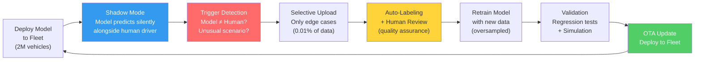
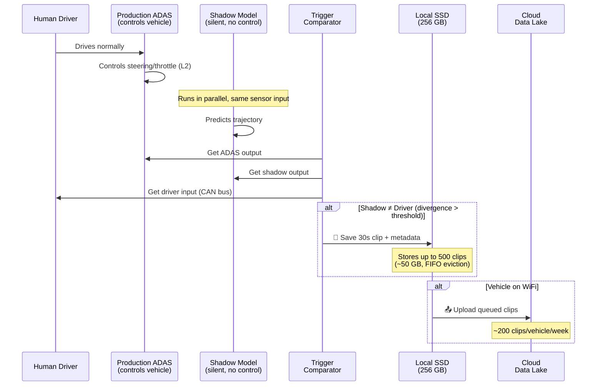
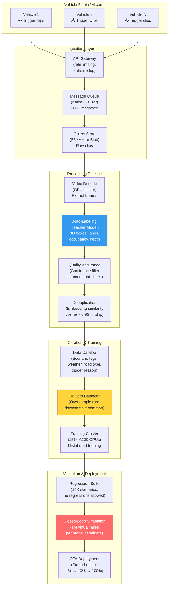
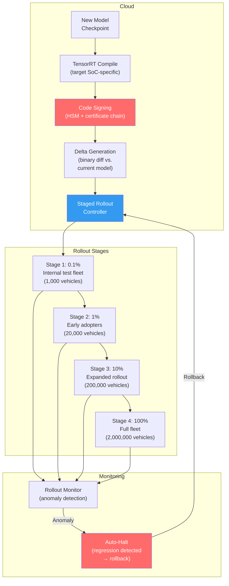

# 9. The Fleet Data Engine and Auto-Labeling 🔴

> **The Problem:** You have deployed an ADAS system to 2 million consumer vehicles. Each vehicle has 8 cameras recording 1920×1280 at 30fps. That is **2.9 petabytes of raw video per hour** across your fleet. You cannot store it all. You cannot label it all. You cannot even upload it all — cellular bandwidth costs alone would bankrupt the program. Yet somewhere in that ocean of mundane highway driving, a single vehicle encountered a scenario your neural network has never seen: a wheelchair user crossing a highway on-ramp at dusk, partially occluded by a guardrail. Your model failed silently — the safety driver intervened before anything happened. If you don't find that clip, auto-label it, retrain on it, and deploy the fix via OTA, the next vehicle to encounter this scenario may not have a safety driver. **The fleet data engine is the system that turns millions of boring drives into the precise training data your model needs to stop failing.**

---

## 9.1 The Data Flywheel: Why Data Beats Algorithms

The central thesis of modern autonomous driving is not that better architectures win — it's that **better data wins**. Two teams with identical BEV transformer architectures but different data engines will have wildly different driving quality.



### The Numbers That Matter

| Metric | Naive Approach | Production Data Engine | Factor |
|--------|---------------|----------------------|--------|
| Data collected per day | 2.9 PB (all video) | 2.9 TB (0.1% filtered) | 1000× reduction |
| Upload bandwidth cost/month | $870M (impossible) | $870K | 1000× reduction |
| Labeling cost per frame | $2.50 (human) | $0.003 (auto-label + QA) | 830× reduction |
| Time to find a rare scenario | Never (drowned in data) | <24 hours (trigger-based) | ∞ → finite |
| Model improvement cycle | 6 months | 2 weeks | 12× faster |

---

## 9.2 Shadow Mode: The Silent Teacher

Shadow Mode is the mechanism by which the neural network learns from millions of human drivers without ever controlling the vehicle.

### How It Works

1. **The production ADAS model** runs on the vehicle's SoC and controls the vehicle (L2 features: lane keeping, adaptive cruise).
2. **A shadow model** — the *next version* of the neural network — runs simultaneously but **its outputs are discarded.** It never touches the actuators.
3. **A comparator** monitors the divergence between the shadow model's predictions and the human driver's actual inputs.
4. When divergence exceeds a threshold, the system **triggers a data snapshot** — the surrounding video, CAN bus data, and model activations are saved to the vehicle's local SSD.
5. On the next WiFi connection (home garage, fleet depot), the snapshot is uploaded to the cloud.



### The Trigger Taxonomy

Not all divergences are equal. The trigger system must classify *why* the shadow model disagreed with the human:

| Trigger Type | Condition | Priority | Upload Rate |
|-------------|-----------|----------|-------------|
| **Hard Brake Disagreement** | Shadow predicts cruise; driver brakes >0.3g | P0 — Critical | 100% (always upload) |
| **Lateral Disagreement** | Shadow trajectory diverges >1.0m from actual | P1 — High | 100% |
| **Object Hallucination** | Shadow detects obstacle; radar/map confirms nothing | P2 — Medium | 50% (sampled) |
| **Missed Detection** | Radar confirms object; shadow model confidence <0.3 | P1 — High | 100% |
| **Unusual Scenario** | Low typicality score (embedding distance from training data) | P2 — Medium | 30% |
| **Model Uncertainty** | Prediction variance in MC-Dropout exceeds threshold | P2 — Medium | 30% |
| **High Intervention Rate** | Driver overrides ADAS >3× in 60 seconds | P0 — Critical | 100% |

```rust
// ✅ PRODUCTION: Shadow Mode trigger engine (runs on vehicle's application CPU)

use std::collections::VecDeque;
use std::time::Duration;

/// Trigger types ordered by severity.
#[derive(Debug, Clone, Copy, PartialEq, Eq, PartialOrd, Ord)]
pub enum TriggerPriority {
    P0Critical,
    P1High,
    P2Medium,
    P3Low,
}

#[derive(Debug, Clone)]
pub struct TriggerEvent {
    pub priority: TriggerPriority,
    pub trigger_type: TriggerType,
    pub timestamp_ns: u64,
    pub shadow_trajectory: Vec<[f32; 3]>,  // [x, y, heading] × T steps
    pub driver_trajectory: Vec<[f32; 3]>,
    pub max_divergence_m: f32,
    pub metadata: TriggerMetadata,
}

#[derive(Debug, Clone)]
pub enum TriggerType {
    HardBrakeDisagreement { driver_decel_g: f32 },
    LateralDivergence { max_offset_m: f32 },
    ObjectHallucination { ghost_object_id: u64 },
    MissedDetection { radar_track_id: u64, model_confidence: f32 },
    UnusualScenario { typicality_score: f32 },
    ModelUncertainty { prediction_variance: f32 },
    HighInterventionRate { interventions_per_minute: f32 },
}

/// Compares shadow model output against human driver behavior.
pub struct ShadowModeComparator {
    lateral_divergence_threshold_m: f32,
    brake_disagreement_threshold_g: f32,
    typicality_threshold: f32,
    uncertainty_threshold: f32,
    recent_interventions: VecDeque<u64>,  // timestamps of recent driver overrides
}

impl ShadowModeComparator {
    pub fn new() -> Self {
        Self {
            lateral_divergence_threshold_m: 1.0,
            brake_disagreement_threshold_g: 0.3,
            typicality_threshold: 0.15,
            uncertainty_threshold: 2.5,
            recent_interventions: VecDeque::new(),
        }
    }

    /// Evaluate one frame of shadow mode data. Returns triggers if any.
    pub fn evaluate(
        &mut self,
        shadow_output: &ShadowModelOutput,
        driver_input: &DriverInput,
        radar_tracks: &[RadarTrack],
        timestamp_ns: u64,
    ) -> Vec<TriggerEvent> {
        let mut triggers = Vec::new();

        // 1. Hard brake disagreement
        if driver_input.longitudinal_accel_g < -self.brake_disagreement_threshold_g {
            let shadow_accel = shadow_output.predicted_accel_g;
            if shadow_accel > -0.1 {
                // Shadow predicted cruise/accel, but driver braked hard
                triggers.push(TriggerEvent {
                    priority: TriggerPriority::P0Critical,
                    trigger_type: TriggerType::HardBrakeDisagreement {
                        driver_decel_g: driver_input.longitudinal_accel_g,
                    },
                    timestamp_ns,
                    shadow_trajectory: shadow_output.trajectory.clone(),
                    driver_trajectory: driver_input.recent_trajectory.clone(),
                    max_divergence_m: self.compute_max_divergence(
                        &shadow_output.trajectory,
                        &driver_input.recent_trajectory,
                    ),
                    metadata: TriggerMetadata::from_frame(shadow_output, driver_input),
                });
            }
        }

        // 2. Lateral divergence
        let max_lat_div = self.compute_lateral_divergence(
            &shadow_output.trajectory,
            &driver_input.recent_trajectory,
        );
        if max_lat_div > self.lateral_divergence_threshold_m {
            triggers.push(TriggerEvent {
                priority: TriggerPriority::P1High,
                trigger_type: TriggerType::LateralDivergence {
                    max_offset_m: max_lat_div,
                },
                timestamp_ns,
                shadow_trajectory: shadow_output.trajectory.clone(),
                driver_trajectory: driver_input.recent_trajectory.clone(),
                max_divergence_m: max_lat_div,
                metadata: TriggerMetadata::from_frame(shadow_output, driver_input),
            });
        }

        // 3. Missed detection (radar sees it, model doesn't)
        for track in radar_tracks {
            if track.range_m < 80.0 && track.rcs_dbsm > 0.0 {
                let model_conf = shadow_output
                    .detection_confidences_near(track.position_m, 3.0)
                    .unwrap_or(0.0);
                if model_conf < 0.3 {
                    triggers.push(TriggerEvent {
                        priority: TriggerPriority::P1High,
                        trigger_type: TriggerType::MissedDetection {
                            radar_track_id: track.id,
                            model_confidence: model_conf,
                        },
                        timestamp_ns,
                        shadow_trajectory: shadow_output.trajectory.clone(),
                        driver_trajectory: driver_input.recent_trajectory.clone(),
                        max_divergence_m: 0.0,
                        metadata: TriggerMetadata::from_frame(shadow_output, driver_input),
                    });
                }
            }
        }

        // 4. Unusual scenario (low typicality)
        if shadow_output.typicality_score < self.typicality_threshold {
            triggers.push(TriggerEvent {
                priority: TriggerPriority::P2Medium,
                trigger_type: TriggerType::UnusualScenario {
                    typicality_score: shadow_output.typicality_score,
                },
                timestamp_ns,
                shadow_trajectory: shadow_output.trajectory.clone(),
                driver_trajectory: driver_input.recent_trajectory.clone(),
                max_divergence_m: 0.0,
                metadata: TriggerMetadata::from_frame(shadow_output, driver_input),
            });
        }

        triggers
    }

    fn compute_lateral_divergence(&self, shadow: &[[f32; 3]], driver: &[[f32; 3]]) -> f32 {
        shadow.iter().zip(driver.iter())
            .map(|(s, d)| {
                let dx = s[0] - d[0];
                let dy = s[1] - d[1];
                // Lateral component relative to driver heading
                let heading = d[2];
                (dx * (-heading.sin()) + dy * heading.cos()).abs()
            })
            .fold(0.0_f32, f32::max)
    }

    fn compute_max_divergence(&self, shadow: &[[f32; 3]], driver: &[[f32; 3]]) -> f32 {
        shadow.iter().zip(driver.iter())
            .map(|(s, d)| ((s[0] - d[0]).powi(2) + (s[1] - d[1]).powi(2)).sqrt())
            .fold(0.0_f32, f32::max)
    }
}
```

---

## 9.3 The Cloud Data Pipeline: From Upload to Training

Once a trigger event is uploaded from the vehicle, it enters a massive cloud pipeline that must process, store, label, and curate the data at fleet scale.

### Pipeline Architecture



### Data Volume Reality Check

| Stage | Daily Volume | Cost/Month | Retention |
|-------|-------------|------------|-----------|
| Raw trigger clips uploaded | 40 TB/day | $36K (transfer) + $30K (storage) | 90 days |
| Decoded frames | 800M frames/day | $12K (GPU decode) | 30 days (frames) |
| Auto-labeled frames | 800M frames/day | $48K (GPU inference) | Permanent (labels only) |
| Curated training dataset | 50M frames (balanced) | $15K (storage) | Permanent |
| Training compute | — | $400K (256 A100s × 5 days) | — |
| Simulation (1M miles) | — | $200K (GPU cluster) | — |
| **Total monthly cost** | | **~$750K/month** | |

---

## 9.4 Auto-Labeling: The Teacher-Student Pipeline

Manual labeling is the bottleneck that kills data engines. At $2.50 per frame and 800M frames/day, manual labeling would cost **$2 billion per day**. Auto-labeling replaces 99.5% of human labeling with a large, accurate "teacher" model running in the cloud.

### The Teacher-Student Architecture

```
// ✅ PRODUCTION: Teacher-Student Auto-Labeling Pipeline

Teacher Model (runs in cloud, no latency constraint):
  - Backbone: ViT-Large (632M params)
  - BEV resolution: 400×400 (0.25m/cell) — 4× finer than edge model
  - Temporal context: 16 frames (vs. 4 on edge)
  - Multi-task heads: 3D detection, segmentation, depth, occupancy, flow
  - Inference time: 800ms per frame (acceptable in cloud)
  - Trained on: ALL available labeled data (manual + verified auto-labels)

Student Model (runs on vehicle SoC):
  - Backbone: EfficientNet-B4 (20M params)
  - BEV resolution: 200×200 (0.5m/cell)
  - Temporal context: 4 frames
  - Same task heads, smaller capacity
  - Inference time: 42ms per frame (required for real-time)
  - Trained on: Auto-labeled data from Teacher + manual labels
```

### The Auto-Labeling Pipeline in Detail

```python
# ✅ PRODUCTION: Auto-labeling pipeline
# Runs on cloud GPU cluster (A100 or H100)

class AutoLabelPipeline:
    """
    Takes raw video clips uploaded from fleet vehicles and produces
    dense per-frame labels using the teacher model ensemble.
    """
    def __init__(self):
        # Ensemble of 3 teacher models for uncertainty estimation
        self.teachers = [
            load_teacher_model(f"teacher_v{i}", device=f"cuda:{i}")
            for i in range(3)
        ]
        self.confidence_threshold = 0.85
        self.iou_agreement_threshold = 0.7

    def label_clip(self, clip: VideoClip) -> LabeledClip:
        """Label a full video clip (30s @ 30fps = 900 frames)."""
        labels = []
        for frame_idx, frame_data in enumerate(clip.frames()):
            images = frame_data.camera_images          # [8, 3, 1280, 1920]
            intrinsics = frame_data.camera_intrinsics   # [8, 4, 4]
            extrinsics = frame_data.camera_extrinsics   # [8, 4, 4]

            # Run all teachers on the same frame
            teacher_outputs = [
                teacher.infer(images, intrinsics, extrinsics)
                for teacher in self.teachers
            ]

            # Fuse predictions with uncertainty-aware consensus
            fused_labels = self.ensemble_fusion(teacher_outputs)
            labels.append(fused_labels)

        # Temporal smoothing: enforce track consistency
        labels = self.temporal_smooth(labels)
        return LabeledClip(clip.metadata, labels)

    def ensemble_fusion(self, teacher_outputs: list) -> FrameLabels:
        """
        Fuse predictions from multiple teachers.
        Only accept labels where teachers *agree* — disagreement → human review.
        """
        # 3D Detection: Match detections across teachers using 3D IoU
        all_detections = [t.detections_3d for t in teacher_outputs]
        fused_detections = []

        for det in all_detections[0]:
            agreements = 0
            matched_confs = [det.confidence]

            for other_dets in all_detections[1:]:
                best_iou = max(
                    (iou_3d(det.box, other.box) for other in other_dets),
                    default=0.0
                )
                if best_iou > self.iou_agreement_threshold:
                    agreements += 1
                    matching = max(other_dets, key=lambda o: iou_3d(det.box, o.box))
                    matched_confs.append(matching.confidence)

            avg_confidence = sum(matched_confs) / len(matched_confs)

            if agreements >= 1 and avg_confidence > self.confidence_threshold:
                det.confidence = avg_confidence
                det.label_source = LabelSource.AutoHighConfidence
                fused_detections.append(det)
            elif agreements == 0:
                det.label_source = LabelSource.AutoLowConfidence
                det.needs_human_review = True
                fused_detections.append(det)

        # Occupancy: Voxel-wise majority vote
        occupancy_maps = torch.stack([t.occupancy for t in teacher_outputs])
        fused_occupancy = occupancy_maps.mode(dim=0).values

        # Per-voxel uncertainty: where teachers disagree → flag for review
        occupancy_agreement = (occupancy_maps == fused_occupancy.unsqueeze(0)).float().mean(0)

        return FrameLabels(
            detections_3d=fused_detections,
            occupancy=fused_occupancy,
            occupancy_confidence=occupancy_agreement,
            semantic_map=self.fuse_maps(teacher_outputs),
        )
```

### Quality Assurance: The Human-in-the-Loop

Auto-labels are not blindly trusted. A multi-stage QA pipeline ensures quality:

| QA Stage | What It Checks | Rate | Cost |
|----------|---------------|------|------|
| **Automated checks** | Physical plausibility (car not floating, pedestrian height <2.5m) | 100% of labels | ~$0 |
| **Confidence filter** | Drop labels below ensemble agreement threshold | 100% of labels | ~$0 |
| **Embedding anomaly** | Flag labels where scene embedding is far from training distribution | 100% of labels | $0.001/frame |
| **Random human audit** | Professional labelers verify 0.5% of auto-labels | 4M frames/day | $0.25/frame = $1M/day |
| **Triggered human review** | All labels flagged by confidence filter or anomaly | ~5% of labels | $2.50/frame |

---

## 9.5 Data Curation: Fighting the Long Tail

Machine learning has a dirty secret: **more data does not always help.** If 95% of your data is straight highway driving and 5% is construction zones, adding more highway data actually *hurts* construction zone performance by diluting the gradient signal.

### The Long Tail Distribution

```
Scenario Frequency in Fleet Data:

Highway cruise, clear weather     ████████████████████████████████████░░░  88.2%
Urban intersection, clear           █████░░░░░░░░░░░░░░░░░░░░░░░░░░░░░░░░   5.1%
Highway, rain                        ██░░░░░░░░░░░░░░░░░░░░░░░░░░░░░░░░░░░   2.3%
Urban, rain                           █░░░░░░░░░░░░░░░░░░░░░░░░░░░░░░░░░░░   1.1%
Construction zone                      ░░░░░░░░░░░░░░░░░░░░░░░░░░░░░░░░░░░   0.8%
Night, urban                           ░░░░░░░░░░░░░░░░░░░░░░░░░░░░░░░░░░░   0.7%
Snow/ice                               ░░░░░░░░░░░░░░░░░░░░░░░░░░░░░░░░░░░   0.3%
Emergency vehicle                      ░░░░░░░░░░░░░░░░░░░░░░░░░░░░░░░░░░░   0.1%
Pedestrian in road (uncontrolled)      ░░░░░░░░░░░░░░░░░░░░░░░░░░░░░░░░░░░   0.04%
Wheelchair user on highway ramp        ░░░░░░░░░░░░░░░░░░░░░░░░░░░░░░░░░░░   0.0001%
                                                                                  ↑ The scenario
                                                                                    that kills
```

### Balancing Strategy: Scenario-Based Sampling

```python
# ✅ PRODUCTION: Dataset balancer with scenario-aware oversampling

class ScenarioBalancer:
    """
    Rebalances the training dataset to ensure rare but critical scenarios
    are adequately represented.

    Strategy: Square-root frequency rebalancing.
    If a scenario appears with frequency f, sample it with weight sqrt(f).
    This upweights rare scenarios without completely ignoring common ones.
    """

    # Target distribution (manually curated by safety team)
    SCENARIO_WEIGHTS = {
        "highway_cruise_clear": 0.15,        # Downsample from 88% to 15%
        "urban_intersection_clear": 0.15,     # Upsample from 5% to 15%
        "highway_rain": 0.10,
        "urban_rain": 0.10,
        "construction_zone": 0.10,            # 12.5× oversample
        "night_urban": 0.10,
        "snow_ice": 0.08,
        "emergency_vehicle": 0.08,            # 80× oversample
        "pedestrian_uncontrolled": 0.08,      # 200× oversample
        "other_rare": 0.06,
    }

    def __init__(self, catalog: DataCatalog):
        self.catalog = catalog

    def build_training_dataset(self, target_size: int) -> Dataset:
        """Build a balanced training set of `target_size` frames."""
        balanced = []

        for scenario, target_weight in self.SCENARIO_WEIGHTS.items():
            available = self.catalog.query(scenario=scenario)
            target_count = int(target_size * target_weight)

            if len(available) >= target_count:
                # Downsample: random selection
                sampled = random.sample(available, target_count)
            else:
                # Oversample: repeat with augmentation flags
                repeats = target_count // len(available) + 1
                sampled = []
                for r in range(repeats):
                    for item in available:
                        sampled.append(item.with_augmentation(
                            seed=r,
                            # Each repeat gets different augmentation to add variety
                            brightness_jitter=0.2,
                            spatial_jitter_m=0.5,
                            dropout_cameras=r % 8 if r > 0 else None,
                        ))
                sampled = sampled[:target_count]

            balanced.extend(sampled)

        random.shuffle(balanced)
        return Dataset(balanced)
```

### Typicality Scoring: Finding What You've Never Seen

The most valuable data is data that is *unlike* your current training set. Typicality scoring uses embedding distance to quantify novelty:

$$\text{typicality}(x) = \frac{1}{k} \sum_{i=1}^{k} \cos(\mathbf{e}(x), \mathbf{e}(x_i^{\text{nn}}))$$

Where $\mathbf{e}(x)$ is the embedding of the new scene and $x_1^{\text{nn}}, \ldots, x_k^{\text{nn}}$ are its $k$-nearest neighbors in the training set embedding space.

- **High typicality (>0.9):** Scene is similar to existing training data → low value.
- **Low typicality (<0.3):** Scene is unlike anything in training → **extremely high value.**

```rust
// ✅ PRODUCTION: Typicality scorer running on vehicle SoC
// Uses scene embedding from the BEV network's penultimate layer

/// Approximate nearest neighbor index for typicality scoring.
/// The index is a compressed representation of the training set embeddings,
/// shipped to the vehicle as part of the model package (~50 MB).
pub struct TypicalityScorer {
    /// Product-quantized embedding index (IVF-PQ)
    /// Contains 10M training scene embeddings compressed to 64 bytes each
    pq_index: ProductQuantizedIndex,
    k_neighbors: usize,
    low_typicality_threshold: f32,
}

impl TypicalityScorer {
    pub fn new(index_path: &std::path::Path) -> std::io::Result<Self> {
        Ok(Self {
            pq_index: ProductQuantizedIndex::load(index_path)?,
            k_neighbors: 8,
            low_typicality_threshold: 0.3,
        })
    }

    /// Score a scene embedding for typicality.
    /// Returns a value in [0, 1] where lower = more novel.
    pub fn score(&self, scene_embedding: &[f32; 256]) -> f32 {
        let neighbors = self.pq_index.search(scene_embedding, self.k_neighbors);

        let avg_similarity: f32 = neighbors.iter()
            .map(|n| n.cosine_similarity)
            .sum::<f32>() / self.k_neighbors as f32;

        avg_similarity  // 0.0 = completely novel, 1.0 = duplicate of training data
    }

    /// Should this frame trigger an upload?
    pub fn should_trigger(&self, scene_embedding: &[f32; 256]) -> bool {
        self.score(scene_embedding) < self.low_typicality_threshold
    }
}
```

---

## 9.6 OTA Updates: Deploying the Improved Model

The data engine's cycle completes with Over-The-Air deployment of the retrained model. This is not a simple file transfer — it is a safety-critical software update to a device moving at highway speed.

### The OTA Deployment Pipeline



### OTA Safety Constraints

| Constraint | Requirement | Rationale |
|-----------|-------------|-----------|
| **Atomic update** | Model update is all-or-nothing; no partial states | A half-loaded model produces garbage predictions |
| **Dual-bank storage** | Vehicle has two model slots (A/B); new model loads into inactive bank | Instant rollback by booting from previous bank |
| **Integrity verification** | SHA-256 hash + RSA-4096 signature verified before activation | Prevent tampered model deployment |
| **Activation window** | Model swap only occurs when vehicle is parked (ignition off) | Never swap models while driving |
| **Rollback trigger** | If new model triggers >2× shadow mode events vs. baseline in first 100 miles, auto-rollback | Catch regressions at individual vehicle level |
| **Staged rollout** | Must clear each stage for 7 days before advancing | Catch population-level regressions |

```rust
// ✅ PRODUCTION: OTA model activation controller (Rust, vehicle-side)

use ring::signature;
use sha2::{Sha256, Digest};
use std::path::Path;

/// Manages dual-bank model storage and atomic model swaps.
pub struct OtaModelController {
    active_bank: ModelBank,
    banks: [ModelSlot; 2],
}

#[derive(Clone, Copy, PartialEq)]
pub enum ModelBank { A, B }

pub struct ModelSlot {
    pub model_path: std::path::PathBuf,
    pub version: String,
    pub sha256: [u8; 32],
    pub is_valid: bool,
}

impl OtaModelController {
    /// Install a new model into the inactive bank.
    /// Does NOT activate — activation only happens when parked.
    pub fn install_update(
        &mut self,
        model_data: &[u8],
        expected_hash: &[u8; 32],
        signature_bytes: &[u8],
        signing_public_key: &signature::UnparsedPublicKey<Vec<u8>>,
    ) -> Result<(), OtaError> {
        // 1. Verify cryptographic signature
        signing_public_key
            .verify(model_data, signature_bytes)
            .map_err(|_| OtaError::SignatureVerificationFailed)?;

        // 2. Verify SHA-256 hash
        let mut hasher = Sha256::new();
        hasher.update(model_data);
        let actual_hash: [u8; 32] = hasher.finalize().into();
        if &actual_hash != expected_hash {
            return Err(OtaError::HashMismatch {
                expected: *expected_hash,
                actual: actual_hash,
            });
        }

        // 3. Write to inactive bank
        let inactive = self.inactive_bank();
        std::fs::write(&self.banks[inactive as usize].model_path, model_data)
            .map_err(OtaError::IoError)?;

        self.banks[inactive as usize].sha256 = actual_hash;
        self.banks[inactive as usize].is_valid = true;

        Ok(())
    }

    /// Activate the new model. ONLY call when vehicle is parked.
    pub fn activate_update(&mut self, vehicle_state: &VehicleState) -> Result<(), OtaError> {
        if vehicle_state.speed_m_s > 0.1 {
            return Err(OtaError::VehicleInMotion);
        }
        if !vehicle_state.ignition_off {
            return Err(OtaError::IgnitionStillOn);
        }

        let inactive = self.inactive_bank();
        if !self.banks[inactive as usize].is_valid {
            return Err(OtaError::NoPendingUpdate);
        }

        // Atomic swap: just flip the active bank pointer
        self.active_bank = inactive;
        self.persist_active_bank()?;

        Ok(())
    }

    /// Emergency rollback to previous model.
    pub fn rollback(&mut self) -> Result<(), OtaError> {
        let previous = self.inactive_bank();
        if !self.banks[previous as usize].is_valid {
            return Err(OtaError::NoPreviousModel);
        }
        self.active_bank = previous;
        self.persist_active_bank()?;
        Ok(())
    }

    fn inactive_bank(&self) -> ModelBank {
        match self.active_bank {
            ModelBank::A => ModelBank::B,
            ModelBank::B => ModelBank::A,
        }
    }

    fn persist_active_bank(&self) -> Result<(), OtaError> {
        // Write to persistent NVRAM — survives power loss
        let bank_byte = match self.active_bank {
            ModelBank::A => 0u8,
            ModelBank::B => 1u8,
        };
        std::fs::write("/sys/firmware/ota/active_bank", [bank_byte])
            .map_err(OtaError::IoError)
    }
}

#[derive(Debug)]
pub enum OtaError {
    SignatureVerificationFailed,
    HashMismatch { expected: [u8; 32], actual: [u8; 32] },
    IoError(std::io::Error),
    VehicleInMotion,
    IgnitionStillOn,
    NoPendingUpdate,
    NoPreviousModel,
}
```

---

## 9.7 The Metrics That Matter

The data engine's effectiveness is measured not by data volume but by **model improvement per dollar spent**:

| Metric | Definition | Target |
|--------|-----------|--------|
| **Miles per critical intervention** | How many miles between cases where the model makes a safety-critical error | >100,000 (L2+) |
| **Edge case discovery rate** | New unique failure modes found per week | >50 novel scenarios/week |
| **Data efficiency** | Model improvement (mAP) per TB of new training data | >0.1% mAP per TB |
| **Label accuracy** | Auto-label agreement with human ground truth | >98% (detection), >95% (occupancy) |
| **Pipeline latency** | Time from trigger event to model retrained and validated | <14 days |
| **OTA success rate** | Percentage of vehicles successfully updated | >99.9% |
| **Regression rate** | How often a new model is worse than the previous on any metric | <1% of deployments |

---

> **Key Takeaways**
>
> 1. **The data engine is the moat.** Any team can download a BEV transformer from GitHub. No team can replicate 2 million vehicles generating edge-case data 24/7. The fleet data engine is the single most defensible competitive advantage in autonomous driving.
>
> 2. **Shadow Mode is the backbone.** By running the next-gen model silently on millions of vehicles, you get billions of miles of testing without any safety risk. Every divergence between the model and the human driver is a free training signal.
>
> 3. **Auto-labeling with teacher-student enables scale.** A cloud-resident teacher model 30× the size of the edge model produces labels at 1/800th the cost of human labelers. Ensemble disagreement flags the 0.5% of frames that need human review.
>
> 4. **Data curation matters more than data volume.** Without scenario-based rebalancing, adding more data can actually hurt performance on rare scenarios. Square-root frequency rebalancing is the industry standard.
>
> 5. **OTA is a safety-critical system, not a convenience feature.** Dual-bank storage, cryptographic verification, staged rollout with auto-halt, and parked-only activation are non-negotiable. A bad OTA push to 2 million vehicles is a mass-casualty event.
